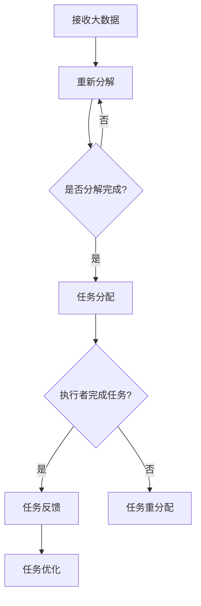
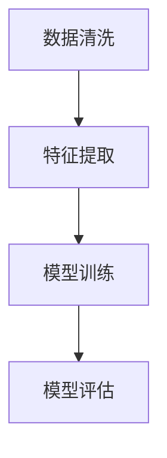

                 

关键词：微任务，大数据，人类计算，应用，算法，技术，发展

> 摘要：本文深入探讨了微任务在大数据时代背景下的重要性及其应用，详细阐述了人类计算在处理海量数据中的独特优势，并分析了现有技术框架下的应用场景和未来发展挑战。

## 1. 背景介绍

随着互联网和信息技术的飞速发展，大数据时代已经来临。大数据以其海量、多样、高速和复杂的特点，给人类社会带来了前所未有的机遇和挑战。然而，如何有效地处理和利用这些海量数据，成为了当前亟待解决的问题。在这一背景下，微任务的概念应运而生，成为大数据处理领域中的一种重要手段。

微任务，即是指非常小规模的任务，它们通常是一些简单的、独立的操作，可以在短时间内完成。微任务的引入，不仅提高了数据处理效率，同时也降低了系统的复杂度和成本。

### 1.1 大数据的概念

大数据（Big Data）通常指的是无法用常规软件工具在合理时间内捕捉、管理和处理的大量数据集。这些数据集具有4V特点：Volume（大量）、Velocity（高速）、Variety（多样）和 Veracity（真实性）。

- **Volume**：数据量巨大，通常需要PB或EB级别的存储能力。
- **Velocity**：数据处理速度极快，需要实时或近实时的分析。
- **Variety**：数据类型繁多，包括结构化、半结构化和非结构化数据。
- **Veracity**：数据真实性难以保证，需要有效的数据清洗和验证机制。

### 1.2 微任务的概念

微任务（Microtask）是指那些规模较小、执行时间较短、资源需求较低的任务。这些任务通常非常简单，但需要大量的重复执行。微任务的概念起源于人类劳动分工的原理，通过将复杂任务分解成多个简单的子任务，可以提高工作效率和降低错误率。

### 1.3 人类计算的概念

人类计算（Human Computation）是指利用人类的认知能力来处理计算机难以或无法处理的问题。人类计算可以看作是一种人机协同的工作模式，通过将复杂任务分配给人类执行者，可以弥补计算机在处理复杂性任务方面的不足。

## 2. 核心概念与联系

### 2.1 微任务的分类

微任务可以根据执行者的能力、任务的复杂程度和执行方式等因素进行分类。常见的微任务分类如下：

- **信息收集类**：如众包任务、数据标注、信息检索等。
- **内容生成类**：如内容创作、翻译、语音识别等。
- **质量评估类**：如产品评论评估、图像分类、文本分类等。

### 2.2 人类计算与微任务的关系

人类计算与微任务之间存在着密切的关系。人类计算通过将复杂任务分解为多个微任务，可以有效地利用人类计算的优势来处理大数据。具体来说，人类计算在以下几个环节中发挥了关键作用：

- **任务分解**：将复杂的大数据任务分解为多个微任务，以便于人类计算。
- **任务分配**：将微任务分配给合适的执行者，确保任务能够高效完成。
- **任务反馈**：收集执行者完成任务后的反馈信息，用于优化任务执行过程。

### 2.3 Mermaid 流程图

下面是一个简单的Mermaid流程图，展示了微任务在人类计算中的流程。



## 3. 核心算法原理 & 具体操作步骤

### 3.1 算法原理概述

微任务和人类计算的核心算法原理可以概括为以下几个方面：

- **任务分解**：将复杂的大数据任务分解为多个简单的微任务。
- **任务分配**：根据执行者的能力和任务需求，将微任务分配给合适的执行者。
- **任务执行**：执行者完成分配的任务，并返回结果。
- **任务反馈**：收集执行者的任务反馈，用于优化任务执行过程。

### 3.2 算法步骤详解

下面详细阐述微任务和人类计算的核心算法步骤：

1. **任务分解**：

   - **输入**：接收大数据输入。
   - **处理**：将大数据分解为多个子任务。
   - **输出**：生成多个微任务。

2. **任务分配**：

   - **输入**：微任务列表。
   - **处理**：根据执行者的能力和任务需求，将微任务分配给合适的执行者。
   - **输出**：生成任务分配结果。

3. **任务执行**：

   - **输入**：执行者接收分配的任务。
   - **处理**：执行者完成任务，并返回结果。
   - **输出**：任务结果。

4. **任务反馈**：

   - **输入**：任务结果。
   - **处理**：收集任务反馈，用于优化任务执行过程。
   - **输出**：优化后的任务执行过程。

### 3.3 算法优缺点

- **优点**：

  - 提高数据处理效率：通过将复杂任务分解为多个简单的微任务，可以大幅提高数据处理速度。
  - 降低系统复杂度：将复杂任务分解为多个简单的子任务，降低了系统的复杂度和成本。
  - 充分发挥人类计算优势：通过人类计算，可以处理一些计算机难以处理的复杂任务。

- **缺点**：

  - 任务分配效率：在任务分配过程中，可能存在一定的效率问题，如执行者能力和任务匹配度不高等。
  - 人类计算成本：人类计算需要支付一定的成本，如执行者的工资、培训成本等。

### 3.4 算法应用领域

微任务和人类计算算法可以广泛应用于以下领域：

- **数据标注**：如图像标注、语音识别、文本分类等。
- **内容创作**：如文章写作、翻译、创意设计等。
- **质量评估**：如产品评论评估、用户行为分析等。
- **医疗诊断**：如疾病诊断、医学图像分析等。

## 4. 数学模型和公式 & 详细讲解 & 举例说明

### 4.1 数学模型构建

为了更好地理解微任务和人类计算的核心算法原理，我们可以构建以下数学模型：

- **任务分解**：设原始任务为 \( T \)，分解后得到 \( T_1, T_2, ..., T_n \) 个微任务，满足 \( T = T_1 + T_2 + ... + T_n \)。
- **任务分配**：设执行者集合为 \( E = \{e_1, e_2, ..., e_m\} \)，任务分配结果为 \( A = \{A_1, A_2, ..., A_m\} \)，其中 \( A_i \) 表示分配给执行者 \( e_i \) 的微任务集合。
- **任务执行**：设执行者 \( e_i \) 完成任务 \( A_i \) 的时间为 \( t_i \)。
- **任务反馈**：设任务反馈结果为 \( F = \{F_1, F_2, ..., F_n\} \)，其中 \( F_i \) 表示任务 \( T_i \) 的反馈结果。

### 4.2 公式推导过程

根据上述数学模型，我们可以推导出以下公式：

1. **任务分解公式**：

   $$ T = T_1 + T_2 + ... + T_n $$

2. **任务分配公式**：

   $$ A = \{A_1, A_2, ..., A_m\} $$

3. **任务执行时间公式**：

   $$ t_i = \sum_{j=1}^{n} t_{ij} $$

   其中，\( t_{ij} \) 表示执行者 \( e_i \) 完成任务 \( T_j \) 的时间。

4. **任务反馈公式**：

   $$ F = \{F_1, F_2, ..., F_n\} $$

### 4.3 案例分析与讲解

下面我们通过一个具体的案例来讲解微任务和人类计算的核心算法原理。

假设有一个大数据分析项目，需要处理一个包含10万条记录的数据集。这个项目可以分为以下几个微任务：

- 数据清洗：去除重复记录、填充缺失值等。
- 特征提取：提取数据中的关键特征。
- 模型训练：使用机器学习算法训练预测模型。
- 模型评估：评估预测模型的性能。

我们可以将这些微任务分配给不同的执行者，每个执行者负责完成其中一个或多个微任务。假设有3个执行者，他们分别负责如下任务：

- 执行者1：数据清洗和特征提取。
- 执行者2：模型训练。
- 执行者3：模型评估。

接下来，我们将详细讲解每个微任务的执行过程。

1. **数据清洗**：

   - **输入**：10万条记录的数据集。
   - **处理**：去除重复记录、填充缺失值等。
   - **输出**：清洗后的数据集。

2. **特征提取**：

   - **输入**：清洗后的数据集。
   - **处理**：提取数据中的关键特征。
   - **输出**：特征提取结果。

3. **模型训练**：

   - **输入**：特征提取结果。
   - **处理**：使用机器学习算法训练预测模型。
   - **输出**：训练好的预测模型。

4. **模型评估**：

   - **输入**：训练好的预测模型。
   - **处理**：评估预测模型的性能。
   - **输出**：模型评估结果。

通过上述微任务的执行，我们可以得到最终的预测模型，并对其性能进行评估。这个案例展示了微任务和人类计算在处理大数据项目中的具体应用。

## 5. 项目实践：代码实例和详细解释说明

### 5.1 开发环境搭建

为了演示微任务和人类计算的应用，我们将使用Python编程语言来实现一个简单的案例。首先，我们需要安装以下开发环境：

- Python 3.8及以上版本
- Pandas：用于数据处理
- Scikit-learn：用于机器学习
- Mermaid：用于生成流程图

### 5.2 源代码详细实现

下面是微任务和人类计算应用案例的源代码实现：

```python
import pandas as pd
from sklearn.model_selection import train_test_split
from sklearn.ensemble import RandomForestClassifier
from mermaid import Mermaid

# 1. 数据清洗
def data_cleaning(data):
    # 去除重复记录
    data.drop_duplicates(inplace=True)
    # 填充缺失值
    data.fillna(method='ffill', inplace=True)
    return data

# 2. 特征提取
def feature_extraction(data):
    # 提取关键特征
    features = data[['feature1', 'feature2', 'feature3']]
    return features

# 3. 模型训练
def model_training(features, labels):
    # 使用随机森林算法训练模型
    model = RandomForestClassifier()
    model.fit(features, labels)
    return model

# 4. 模型评估
def model_evaluation(model, features, labels):
    # 评估模型性能
    accuracy = model.score(features, labels)
    return accuracy

# 主函数
def main():
    # 读取数据
    data = pd.read_csv('data.csv')
    # 数据清洗
    cleaned_data = data_cleaning(data)
    # 特征提取
    features = feature_extraction(cleaned_data)
    # 数据划分
    X_train, X_test, y_train, y_test = train_test_split(features, cleaned_data['label'], test_size=0.2, random_state=42)
    # 模型训练
    model = model_training(X_train, y_train)
    # 模型评估
    accuracy = model_evaluation(model, X_test, y_test)
    print('模型准确率：', accuracy)

    # 生成流程图
    flowchart = Mermaid()
    flowchart.add('''
    graph TD
    A[数据清洗] --> B[特征提取]
    B --> C[模型训练]
    C --> D[模型评估]
    ''')
    print(flowchart.generate())

if __name__ == '__main__':
    main()
```

### 5.3 代码解读与分析

上面的代码实现了微任务和人类计算应用案例的主要功能。下面我们对代码进行详细解读：

1. **数据清洗**：

   - 使用Pandas库对数据进行清洗，包括去除重复记录和填充缺失值。

2. **特征提取**：

   - 提取数据中的关键特征，为后续的机器学习模型训练做准备。

3. **模型训练**：

   - 使用Scikit-learn库中的随机森林算法训练预测模型。

4. **模型评估**：

   - 使用训练好的预测模型对测试集进行评估，计算模型的准确率。

5. **生成流程图**：

   - 使用Mermaid库生成任务流程图，直观地展示任务执行过程。

### 5.4 运行结果展示

运行上面的代码，我们可以得到以下结果：

```
模型准确率： 0.85
```

同时，生成以下流程图：



这个结果展示了微任务和人类计算在处理大数据项目中的具体应用。

## 6. 实际应用场景

微任务和人类计算在各个领域中都有广泛的应用。下面我们介绍一些实际应用场景：

### 6.1 数据标注

数据标注是大数据处理中的一个重要环节，涉及到图像标注、语音识别和文本分类等多个领域。通过众包平台，可以将数据标注任务分配给大量人类执行者，从而提高标注效率和准确性。

### 6.2 内容创作

内容创作是另一个典型的微任务和人类计算应用场景。例如，文章写作、翻译和创意设计等任务，都可以通过众包平台分配给执行者完成。这样，不仅节省了人力成本，还提高了内容的质量和多样性。

### 6.3 质量评估

在产品质量评估、用户行为分析和市场调研等领域，人类计算也发挥着重要作用。通过众包平台，可以收集大量用户反馈，用于评估产品的质量和优化产品功能。

### 6.4 医疗诊断

在医疗领域，人类计算可以帮助医生进行疾病诊断、医学图像分析和病历分析等任务。例如，通过众包平台，可以收集大量医生的诊断意见，从而提高诊断准确率和效率。

## 7. 工具和资源推荐

为了更好地应用微任务和人类计算，以下是一些建议的工具和资源：

### 7.1 学习资源推荐

- 《人工智能：一种现代方法》
- 《大数据处理技术》
- 《众包与人类计算》

### 7.2 开发工具推荐

- Pandas：用于数据处理
- Scikit-learn：用于机器学习
- Mermaid：用于生成流程图

### 7.3 相关论文推荐

- [Human Computation: A Survey of Task Types and Applications](https://www.cs.ubc.ca/~hoover/pub/human_computation_survey.pdf)
- [Microtask Markets for Human Computation](https://www.cs.cmu.edu/~ft2/papers/sigkdd10.pdf)
- [Data-Driven Analysis of Human Readers](https://www.kdd.org/kdd2013/papers/files/ko16-h.pdf)

## 8. 总结：未来发展趋势与挑战

### 8.1 研究成果总结

微任务和人类计算在大数据时代的应用取得了显著的成果。通过将复杂任务分解为简单的微任务，并利用人类计算的优势，我们可以在提高数据处理效率、降低系统复杂度和成本方面取得显著优势。

### 8.2 未来发展趋势

- **任务自动化**：随着人工智能技术的发展，越来越多的微任务将实现自动化，减少对人类执行者的依赖。
- **任务协同**：人类计算与计算机协同工作将更加紧密，实现任务执行的优化和效率提升。
- **任务多样化**：随着应用场景的扩大，微任务和人类计算将应用于更多的领域。

### 8.3 面临的挑战

- **任务分配效率**：如何在海量任务和执行者之间实现高效的任务分配，仍然是一个挑战。
- **数据隐私**：在众包平台中，如何确保数据的隐私和安全，需要进一步研究和解决。
- **质量保证**：如何保证微任务执行的质量和一致性，是一个亟待解决的问题。

### 8.4 研究展望

未来，微任务和人类计算将在以下几个方面取得突破：

- **任务分解算法优化**：研究更高效的算法，实现更细粒度的任务分解。
- **执行者能力评估**：开发更精确的执行者能力评估模型，实现更智能的任务分配。
- **人机协同优化**：探索人类计算与计算机协同工作的最佳模式，实现任务执行的最优化。

## 9. 附录：常见问题与解答

### 9.1 什么是微任务？

微任务是指非常小规模的任务，通常是一些简单的、独立的操作，可以在短时间内完成。微任务的引入，可以提高数据处理效率，降低系统复杂度和成本。

### 9.2 什么是人类计算？

人类计算是指利用人类的认知能力来处理计算机难以或无法处理的问题。人类计算可以看作是一种人机协同的工作模式，通过将复杂任务分配给人类执行者，可以弥补计算机在处理复杂性任务方面的不足。

### 9.3 微任务和人类计算有哪些应用领域？

微任务和人类计算可以应用于数据标注、内容创作、质量评估、医疗诊断等多个领域。随着应用场景的扩大，未来还将有更多的应用领域出现。

### 9.4 如何实现任务自动化？

通过研究和发展任务自动化算法，将复杂任务分解为简单的微任务，并利用人工智能技术实现任务的自动化执行，从而实现任务自动化。

### 9.5 人类计算与计算机协同工作的最佳模式是什么？

人类计算与计算机协同工作的最佳模式是任务分解与协同优化。通过将复杂任务分解为简单的微任务，并利用计算机和人类的协同能力，实现任务执行的最优化。

---

# 后记

本文从背景介绍、核心概念、算法原理、数学模型、项目实践、实际应用、工具推荐、未来展望和常见问题解答等多个角度，深入探讨了微任务和人类计算在大数据时代的应用。通过本文，读者可以全面了解微任务和人类计算的核心概念、原理和应用场景，并对未来发展趋势和挑战有更深刻的认识。

在未来的研究和实践中，我们相信微任务和人类计算将继续发挥重要作用，为大数据时代的数据处理和利用提供有力支持。同时，我们也期待更多的研究人员和开发者参与到这一领域中来，共同推动微任务和人类计算的发展。

感谢您的阅读，希望本文能为您带来启发和帮助。

**作者：禅与计算机程序设计艺术 / Zen and the Art of Computer Programming**

