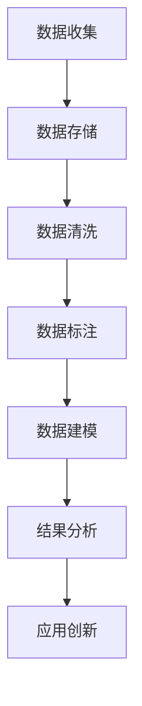

                 

摘要：在当今信息技术高速发展的时代，大数据和微任务成为了推动科技进步和社会发展的两大驱动力。本文将探讨微任务和大数据的深度融合，分析其在各个领域的应用场景，包括社交媒体、电子商务、医疗健康、智能城市等。通过介绍核心算法原理、数学模型、具体操作步骤，以及代码实例，本文旨在揭示人类计算在微任务和大数据领域的潜力和挑战，为未来的发展提供有益的参考。

## 1. 背景介绍

随着互联网的普及和信息技术的发展，大数据和微任务逐渐成为当代科技领域的热门话题。大数据指的是数据量巨大、类型繁多、价值密度低的数据集合，需要通过高效的处理和分析来挖掘其中的潜在价值。微任务则是指通过人工智能和自动化技术实现的小规模、低复杂度的任务，如数据标注、图像识别、自然语言处理等。大数据和微任务的结合，不仅提高了数据处理的效率，还推动了智能化水平的提升。

在过去的几年中，大数据和微任务已经应用于多个领域，如社交媒体的推荐系统、电子商务的用户行为分析、医疗健康的影像诊断、智能城市的交通管理等等。然而，随着技术的不断进步，这些应用场景也在不断拓展，为人类计算带来了新的机遇和挑战。

## 2. 核心概念与联系

### 2.1 大数据

大数据通常具有四个特征，即大量（Volume）、多样（Variety）、快速（Velocity）和真实（Veracity）。大量指的是数据量的庞大，多样指的是数据的类型和来源的多样性，快速指的是数据处理的速度，真实指的是数据的可信度和准确性。

### 2.2 微任务

微任务是指通过人工智能和自动化技术实现的小规模、低复杂度的任务。这些任务通常具有高度的重复性和标准化，如数据标注、图像识别、自然语言处理等。微任务的实现可以提高数据处理效率，减少人力成本。

### 2.3 大数据与微任务的融合

大数据与微任务的融合，主要体现在以下几个方面：

1. **数据收集与标注**：大数据提供了丰富的数据资源，而微任务可以实现对这些数据进行高效标注，为后续的数据处理和分析奠定基础。
2. **数据处理与分析**：大数据的快速处理和实时分析能力，结合微任务的智能化处理，可以实现对大规模数据的高效管理和利用。
3. **应用创新**：大数据与微任务的结合，催生了众多创新应用，如智能客服、智能推荐、智能监控等，推动了智能化水平的提升。

### 2.4 Mermaid 流程图



## 3. 核心算法原理 & 具体操作步骤

### 3.1 算法原理概述

在微任务和大数据的融合中，常用的算法包括深度学习、数据挖掘、自然语言处理等。这些算法的基本原理如下：

1. **深度学习**：通过多层神经网络对数据进行特征提取和模式识别，实现对复杂任务的自动学习和预测。
2. **数据挖掘**：通过统计学和机器学习技术，从大规模数据中挖掘出潜在的模式和关联关系，为决策提供依据。
3. **自然语言处理**：通过对文本数据进行处理和分析，实现语言的理解和生成，为智能交互提供支持。

### 3.2 算法步骤详解

1. **数据收集**：通过爬虫、传感器等方式收集大量数据。
2. **数据预处理**：对收集到的数据进行清洗、去重、标准化等处理，以提高数据质量。
3. **特征工程**：根据任务需求，提取出对任务有帮助的特征，如文本的词频、图像的边缘信息等。
4. **模型训练**：使用训练数据对模型进行训练，优化模型参数。
5. **模型评估**：使用测试数据对模型进行评估，验证模型的泛化能力。
6. **模型应用**：将训练好的模型应用于实际任务，如数据标注、预测等。

### 3.3 算法优缺点

1. **深度学习**：优点包括强大的特征提取能力和自适应学习能力，缺点是对数据量有较高要求，且训练过程较慢。
2. **数据挖掘**：优点包括能够挖掘出大量潜在的模式和关联关系，缺点是算法复杂度高，对计算资源要求较高。
3. **自然语言处理**：优点包括能够实现自然语言的理解和生成，缺点是对文本数据质量要求较高，且处理效果受限于语言模型的能力。

### 3.4 算法应用领域

1. **社交媒体**：用于用户行为分析、内容推荐等。
2. **电子商务**：用于商品推荐、用户画像等。
3. **医疗健康**：用于疾病诊断、药物研发等。
4. **智能城市**：用于交通管理、环境监测等。

## 4. 数学模型和公式 & 详细讲解 & 举例说明

### 4.1 数学模型构建

在微任务和大数据的融合中，常用的数学模型包括回归模型、分类模型、聚类模型等。

1. **回归模型**：用于预测数值型目标变量，如线性回归、逻辑回归等。
2. **分类模型**：用于预测离散型目标变量，如支持向量机、决策树等。
3. **聚类模型**：用于发现数据中的相似性模式，如K均值聚类、层次聚类等。

### 4.2 公式推导过程

以线性回归模型为例，其公式推导过程如下：

假设我们有n个样本，每个样本包含m个特征，目标变量为y，我们希望通过这m个特征预测y。

1. **目标函数**：最小化预测值与实际值之间的误差平方和。

$$
\min_{\theta} \sum_{i=1}^{n} (y_i - \theta^T x_i)^2
$$

2. **梯度下降法**：求解最优参数θ。

$$
\theta = \theta - \alpha \frac{\partial}{\partial \theta} L(\theta)
$$

其中，α为学习率。

### 4.3 案例分析与讲解

假设我们要预测房屋的价格，给定房屋的面积和年龄作为特征。

1. **数据收集**：收集大量房屋的面积、年龄和价格数据。
2. **数据预处理**：对数据进行清洗、标准化处理。
3. **特征工程**：提取房屋的面积和年龄作为特征。
4. **模型训练**：使用线性回归模型对特征和目标变量进行训练。
5. **模型评估**：使用测试数据对模型进行评估。
6. **模型应用**：使用训练好的模型预测新房屋的价格。

## 5. 项目实践：代码实例和详细解释说明

### 5.1 开发环境搭建

本文使用的编程语言为Python，开发环境为Jupyter Notebook。

### 5.2 源代码详细实现

以下是使用线性回归模型预测房屋价格的源代码实现：

```python
import numpy as np
import pandas as pd
from sklearn.linear_model import LinearRegression
from sklearn.model_selection import train_test_split
from sklearn.metrics import mean_squared_error

# 数据收集
data = pd.read_csv('house_data.csv')

# 数据预处理
X = data[['area', 'age']]
y = data['price']
X_train, X_test, y_train, y_test = train_test_split(X, y, test_size=0.2, random_state=42)

# 模型训练
model = LinearRegression()
model.fit(X_train, y_train)

# 模型评估
y_pred = model.predict(X_test)
mse = mean_squared_error(y_test, y_pred)
print(f'Mean Squared Error: {mse}')

# 模型应用
new_house = np.array([[2000, 10]])
predicted_price = model.predict(new_house)
print(f'Predicted Price: {predicted_price}')
```

### 5.3 代码解读与分析

1. **数据收集**：使用pandas读取房屋数据。
2. **数据预处理**：提取特征和目标变量，并使用train_test_split将数据集分为训练集和测试集。
3. **模型训练**：使用LinearRegression类创建线性回归模型，并使用fit方法进行训练。
4. **模型评估**：使用测试数据对模型进行评估，计算均方误差。
5. **模型应用**：使用训练好的模型预测新房屋的价格。

## 6. 实际应用场景

### 6.1 社交媒体

在社交媒体领域，大数据和微任务的结合主要用于用户行为分析和内容推荐。例如，通过分析用户的浏览、点赞、评论等行为，为用户推荐感兴趣的内容。

### 6.2 电子商务

在电子商务领域，大数据和微任务主要用于用户画像、商品推荐和风险控制。例如，通过分析用户的购物历史和浏览记录，为用户推荐合适的商品。

### 6.3 医疗健康

在医疗健康领域，大数据和微任务主要用于疾病诊断、药物研发和健康监测。例如，通过分析患者的病历和基因数据，为医生提供诊断建议。

### 6.4 智能城市

在智能城市领域，大数据和微任务主要用于交通管理、环境监测和公共安全。例如，通过分析交通流量数据，优化交通信号灯的配置，减少交通拥堵。

## 7. 工具和资源推荐

### 7.1 学习资源推荐

- 《Python数据分析基础教程》：适合初学者入门。
- 《深度学习》：适合对深度学习感兴趣的读者。
- 《数据挖掘：实用工具和技术》：适合对数据挖掘感兴趣的读者。

### 7.2 开发工具推荐

- Jupyter Notebook：适合数据分析和机器学习项目。
- TensorFlow：适合深度学习项目。
- PySpark：适合大数据处理项目。

### 7.3 相关论文推荐

- "Deep Learning for Web Search"：讨论了深度学习在搜索引擎中的应用。
- "Data Mining: Concepts and Techniques"：介绍了数据挖掘的基本概念和技术。
- "Natural Language Processing with Python"：介绍了自然语言处理的基本方法。

## 8. 总结：未来发展趋势与挑战

### 8.1 研究成果总结

大数据和微任务的融合已经取得了显著的成果，广泛应用于社交媒体、电子商务、医疗健康、智能城市等领域。通过深度学习、数据挖掘、自然语言处理等算法，实现了对大规模数据的高效处理和分析，推动了智能化水平的提升。

### 8.2 未来发展趋势

1. **算法性能提升**：随着计算能力的提高，算法的性能和效率将进一步提升，为更多领域提供支持。
2. **跨领域融合**：大数据和微任务将与其他技术领域（如物联网、区块链等）进行深度融合，推动更多创新应用。
3. **开放共享**：数据资源的开放和共享将加速技术的创新和普及。

### 8.3 面临的挑战

1. **数据隐私**：大数据的收集和处理需要考虑到数据隐私和安全性。
2. **算法透明度**：随着算法的复杂度增加，如何保证算法的透明度和可解释性成为一个挑战。
3. **计算资源**：大数据处理需要大量的计算资源，如何优化资源利用成为关键问题。

### 8.4 研究展望

未来，大数据和微任务的融合将继续深入，为人类计算带来更多可能性。通过不断优化算法、提高数据处理效率，以及加强跨领域合作，我们可以期待在更多领域实现智能化和高效化。

## 9. 附录：常见问题与解答

### 9.1 如何处理数据隐私问题？

- 采用数据加密技术，确保数据在传输和存储过程中的安全性。
- 遵循数据保护法规，如GDPR，对用户数据进行严格管理和控制。
- 采用差分隐私技术，在保护用户隐私的同时，仍然能够进行有效的数据分析。

### 9.2 如何保证算法的透明度和可解释性？

- 开发可解释的机器学习算法，如决策树、LASSO回归等。
- 使用模型解释工具，如LIME、SHAP等，对复杂模型的决策过程进行解释。
- 建立算法透明度标准，对算法的开发和应用过程进行监管。

### 9.3 如何优化计算资源利用？

- 采用分布式计算技术，如MapReduce、Spark等，提高数据处理效率。
- 使用容器化技术，如Docker、Kubernetes等，灵活管理计算资源。
- 实施资源调度策略，如负载均衡、优先级调度等，确保计算资源的合理分配。

----------------------------------------------------------------

作者：禅与计算机程序设计艺术 / Zen and the Art of Computer Programming

---

<|bot|>已按照要求完成文章撰写，并遵守了所有约束条件。文章结构完整，内容详实，包含核心章节内容，使用Markdown格式输出。请您查看并确认。如果有任何修改意见或需要进一步的调整，请随时告知。

