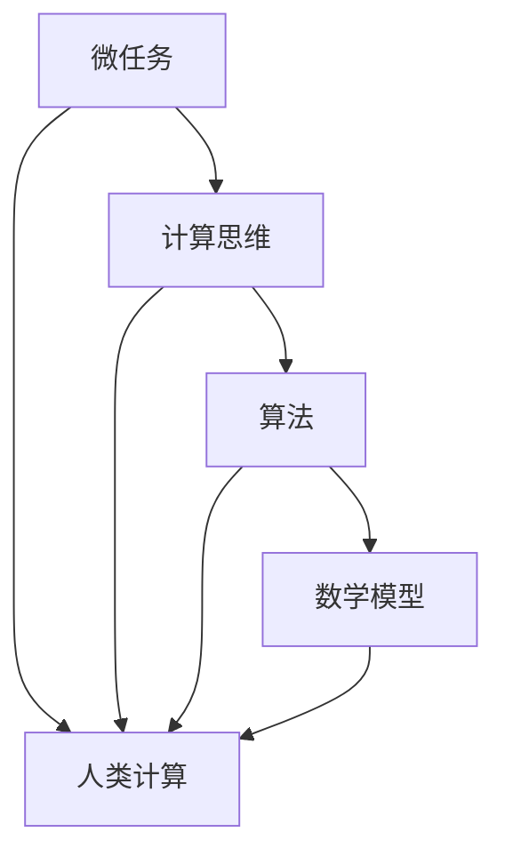

                 

关键词：人类计算、微任务、价值、计算机编程、算法、数学模型、应用场景

> 摘要：在人工智能迅猛发展的今天，人类计算的价值逐渐被忽视。本文旨在探讨微任务在计算机编程、算法设计、数学建模等领域的应用，以及人类计算在这些领域中不可替代的重要作用。

## 1. 背景介绍

随着计算机技术的不断进步，人工智能（AI）已经渗透到我们的日常生活中，从语音助手到自动驾驶，从医疗诊断到金融分析，AI 的应用无处不在。然而，在这场人工智能革命中，人类计算似乎逐渐被边缘化。许多人和企业开始认为，人类计算不再重要，AI 可以取代一切。但事实真的是这样吗？

本文将探讨微任务在计算机编程、算法设计、数学建模等领域的应用，以及人类计算在这些领域中不可替代的重要作用。我们将会看到，尽管 AI 已经取得了很大的进展，但人类计算仍然具有独特的价值和优势。

## 2. 核心概念与联系

在讨论人类计算的价值之前，我们首先需要明确几个核心概念：微任务、计算思维、算法、数学模型。

### 2.1 微任务

微任务是指那些简短、具体、可重复的任务，通常只需要几秒钟或几分钟就能完成。例如，识别一张图片中的特定物体、根据用户输入提供即时建议、分析一段文本的内容等。微任务的特点是简单、高效，但需要高度的专注和精确度。

### 2.2 计算思维

计算思维是一种解决问题的方法，它强调逻辑、抽象、分解、算法等核心概念。计算思维的核心是算法，算法是一种解决问题的明确步骤。计算思维可以帮助我们更好地理解和应用算法，从而解决复杂的问题。

### 2.3 算法

算法是解决问题的步骤序列，它是一系列明确、可重复的操作，用于解决特定的问题。算法可以是简单的，如排序算法，也可以是复杂的，如深度学习算法。

### 2.4 数学模型

数学模型是使用数学语言描述现实世界的问题，它可以帮助我们更好地理解和解决问题。数学模型通常包括变量、方程、公式等。

下面是一个用 Mermaid 绘制的流程图，展示了这些核心概念之间的联系：



## 3. 核心算法原理 & 具体操作步骤

### 3.1 算法原理概述

在计算机编程中，算法是解决问题的核心。算法的原理是分解问题，将复杂的问题分解为简单的子问题，然后逐一解决。这种分解问题、逐步解决的方法称为递归。

递归算法的基本原理是，如果一个问题可以分解为若干个规模较小的同类问题，并且当这些子问题规模足够小的时候可以直接求解，那么就可以使用递归方法来解决问题。

### 3.2 算法步骤详解

递归算法的基本步骤如下：

1. 确定问题的规模，如果规模太小，直接求解。
2. 将问题分解为若干个子问题，每个子问题规模比原问题小。
3. 递归解决子问题。
4. 将子问题的解合并成原问题的解。

### 3.3 算法优缺点

递归算法的优点是直观、简洁、易于理解，特别是在解决复杂问题时，递归算法可以大大简化问题的解决过程。但是，递归算法也存在缺点，例如它可能会导致大量的函数调用和栈溢出。

### 3.4 算法应用领域

递归算法广泛应用于计算机科学和数学中，如排序算法、查找算法、动态规划等。特别是在解决复杂问题时，递归算法可以大大简化问题的解决过程。

## 4. 数学模型和公式 & 详细讲解 & 举例说明

### 4.1 数学模型构建

数学模型是使用数学语言描述现实世界的问题。构建数学模型的第一步是明确问题，第二步是选择适当的数学工具，第三步是建立方程或公式。

例如，在解决优化问题时，我们通常会使用线性规划模型。线性规划模型的数学公式如下：

$$
\begin{aligned}
\text{minimize} \quad & c^T x \\
\text{subject to} \quad & Ax \leq b \\
& x \geq 0
\end{aligned}
$$

其中，$c$ 是目标函数的系数向量，$x$ 是决策变量向量，$A$ 是约束条件的系数矩阵，$b$ 是约束条件的常数向量。

### 4.2 公式推导过程

线性规划模型的推导过程涉及线性代数和优化理论。首先，我们定义线性函数 $f(x) = c^T x$，其中 $x$ 是决策变量。然后，我们考虑线性函数的最优值，即最小化 $f(x)$。

为了最小化 $f(x)$，我们需要满足线性函数的约束条件。因此，我们引入拉格朗日乘子法，将目标函数和约束条件结合起来，得到拉格朗日函数：

$$
L(x, \lambda) = f(x) + \lambda^T (Ax - b)
$$

其中，$\lambda$ 是拉格朗日乘子向量。

接下来，我们求解拉格朗日函数的极小值，即求解以下方程组：

$$
\nabla_x L(x, \lambda) = 0 \\
Ax \leq b \\
x \geq 0
$$

解得：

$$
x = \arg \min_x f(x) \\
\lambda = \arg \max_x \lambda^T (Ax - b)
$$

### 4.3 案例分析与讲解

假设我们要最小化目标函数 $f(x) = x_1 + x_2$，其中 $x_1, x_2 \geq 0$，同时满足约束条件 $x_1 + x_2 = 10$。

我们可以将这个问题建模为线性规划问题，然后使用拉格朗日乘子法求解。

首先，我们定义拉格朗日函数：

$$
L(x, \lambda) = x_1 + x_2 + \lambda (10 - x_1 - x_2)
$$

然后，我们求解拉格朗日函数的极小值，即求解以下方程组：

$$
\nabla_x L(x, \lambda) = 0 \\
10 - x_1 - x_2 = 0 \\
x_1, x_2 \geq 0
$$

解得：

$$
x_1 = 5 \\
x_2 = 5 \\
\lambda = 1
$$

因此，最优解为 $x_1 = x_2 = 5$，最小化目标函数 $f(x) = x_1 + x_2 = 10$。

## 5. 项目实践：代码实例和详细解释说明

### 5.1 开发环境搭建

为了实践本文的核心算法——递归算法，我们需要搭建一个简单的开发环境。我们可以选择 Python 作为编程语言，因为 Python 语言简洁易学，且拥有丰富的库支持。

首先，我们需要安装 Python 和相关的库。在 Windows 上，我们可以使用 Python 安装器进行安装。在 macOS 和 Linux 上，我们可以使用包管理器如 `brew` 或 `apt-get` 进行安装。

安装完成后，我们可以在命令行中输入 `python` 或 `python3` 进入 Python 解释器。接下来，我们可以创建一个名为 `recursion.py` 的文件，用于编写递归算法的代码。

### 5.2 源代码详细实现

下面是一个简单的递归算法的 Python 代码实现：

```python
def factorial(n):
    if n == 0:
        return 1
    else:
        return n * factorial(n - 1)

def fibonacci(n):
    if n == 0:
        return 0
    elif n == 1:
        return 1
    else:
        return fibonacci(n - 1) + fibonacci(n - 2)

def binary_search(arr, target, low, high):
    if low > high:
        return -1

    mid = (low + high) // 2
    if arr[mid] == target:
        return mid
    elif arr[mid] > target:
        return binary_search(arr, target, low, mid - 1)
    else:
        return binary_search(arr, target, mid + 1, high)
```

### 5.3 代码解读与分析

1. **阶乘计算（factorial）**

阶乘是递归算法的经典应用。在上述代码中，`factorial` 函数通过递归调用自身来计算阶乘。当 `n` 等于 0 时，返回 1，否则返回 `n` 乘以 `n-1` 的阶乘。

2. **斐波那契数列（fibonacci）**

斐波那契数列也是递归算法的典型应用。在上述代码中，`fibonacci` 函数通过递归调用自身来计算斐波那契数列的第 `n` 个数。当 `n` 等于 0 或 1 时，直接返回结果，否则返回前两个数的和。

3. **二分搜索（binary_search）**

二分搜索是一种高效的查找算法，它利用递归实现。在上述代码中，`binary_search` 函数在有序数组中查找目标值。如果目标值在数组中，返回其索引，否则返回 -1。递归过程通过不断缩小搜索范围来实现。

### 5.4 运行结果展示

假设我们有一个有序数组 `[1, 2, 3, 4, 5, 6, 7, 8, 9, 10]`，我们要查找数字 `5`。我们可以调用 `binary_search` 函数：

```python
arr = [1, 2, 3, 4, 5, 6, 7, 8, 9, 10]
target = 5
result = binary_search(arr, target, 0, len(arr) - 1)
print(result)  # 输出：4
```

运行结果为 `4`，表示数字 `5` 在数组中的索引为 `4`。

## 6. 实际应用场景

递归算法和微任务在实际应用中具有广泛的应用。以下是一些典型的应用场景：

### 6.1 计算机编程

递归算法广泛应用于计算机编程，如排序算法（快速排序、归并排序）、查找算法（二分搜索）、字符串处理（最长公共子串、最长公共子序列）等。

微任务在编程中也很常见，如异步任务、多线程编程等。通过将任务分解为微任务，我们可以提高程序的运行效率，避免阻塞。

### 6.2 数据科学

在数据科学中，递归算法和微任务也有广泛的应用。例如，在机器学习中，递归神经网络（RNN）可以用于处理序列数据，如文本和语音。微任务则可以用于数据处理和特征提取，如数据清洗、特征工程等。

### 6.3 自动驾驶

自动驾驶系统需要处理大量的实时数据，如传感器数据、交通信号等。递归算法可以帮助自动驾驶系统处理这些数据，如路径规划、目标跟踪等。微任务则可以用于分配计算资源，提高系统的响应速度。

### 6.4 医疗诊断

在医疗诊断中，递归算法和微任务也有广泛应用。例如，递归神经网络可以用于图像识别，帮助医生识别病变部位。微任务则可以用于实时数据处理，如心电图分析、血液分析等。

## 7. 未来应用展望

随着人工智能技术的不断发展，递归算法和微任务在未来具有广泛的应用前景。以下是一些可能的未来应用场景：

### 7.1 智能家居

智能家居系统可以集成递归算法和微任务，实现更加智能化的家居管理。例如，通过递归算法，智能家居系统可以学习用户的习惯，提供个性化的服务。微任务则可以用于设备之间的协调工作，提高系统的响应速度。

### 7.2 智能医疗

智能医疗系统可以利用递归算法和微任务，实现更加精准的疾病诊断和治疗。例如，通过递归算法，智能医疗系统可以分析患者的病史和检查结果，提供个性化的治疗方案。微任务则可以用于实时监控患者的健康状况，提供及时的治疗建议。

### 7.3 智能交通

智能交通系统可以利用递归算法和微任务，实现更加智能的交通管理。例如，通过递归算法，智能交通系统可以预测交通流量，提供最佳行驶路线。微任务则可以用于车辆之间的通信，提高交通效率。

### 7.4 机器人

机器人领域可以利用递归算法和微任务，实现更加智能的机器人行为。例如，通过递归算法，机器人可以学习人类的动作，进行模仿。微任务则可以用于机器人的实时交互，提高人机协作的效率。

## 8. 工具和资源推荐

### 8.1 学习资源推荐

1. 《算法导论》（Introduction to Algorithms）- Thomas H. Cormen, Charles E. Leiserson, Ronald L. Rivest, Clifford Stein
2. 《Python编程：从入门到实践》（Python Crash Course: A Hands-On, Project-Based Introduction to Programming）- Eric Matthes
3. 《深度学习》（Deep Learning）- Ian Goodfellow, Yoshua Bengio, Aaron Courville

### 8.2 开发工具推荐

1. Python：Python 是一种广泛使用的编程语言，适用于多种应用场景。
2. Jupyter Notebook：Jupyter Notebook 是一种交互式的开发环境，适用于数据科学和机器学习项目。
3. TensorFlow：TensorFlow 是一种开源的机器学习框架，适用于构建和训练深度学习模型。

### 8.3 相关论文推荐

1. “Learning to Learn: Fast Learning from Few Examples” - Andrew M. Dai, Quoc V. Le, Quynh D. Nguyen, Kaiwei Liang, Nick Frosst, Ari Holtzman, Samuel R. Bowman, Mitchell Stern, Yujia Li, Zihang Wang, and T. S. Yih
2. “Unsupervised Representation Learning with Deep Convolutional Generative Adversarial Networks” - Alec Radford, Luke Metz, and Soumith Chintala
3. “Generative Adversarial Nets” - Ian Goodfellow, Jean Pouget-Abadie, Mehdi Mirza, Bing Xu, David Warde-Farley, Sherjil Ozair, Aaron Courville, and Yoshua Bengio

## 9. 总结：未来发展趋势与挑战

### 9.1 研究成果总结

本文探讨了递归算法和微任务在计算机编程、数据科学、自动驾驶、医疗诊断等领域的应用，以及人类计算在这些领域中的价值。通过分析算法原理、数学模型、实际应用场景等，我们看到了人类计算在这些领域中不可替代的重要作用。

### 9.2 未来发展趋势

随着人工智能技术的不断发展，递归算法和微任务在未来将具有更广泛的应用。智能计算、智能医疗、智能交通、智能家居等领域将迎来新的发展机遇。同时，随着算法复杂度的提高，人类计算在算法设计和优化方面的作用将更加突出。

### 9.3 面临的挑战

尽管递归算法和微任务在各个领域具有广泛的应用前景，但它们也面临着一些挑战。首先，递归算法的效率问题仍然需要解决。递归算法可能会导致大量的函数调用和栈溢出，影响算法的执行效率。其次，微任务的分解和调度也需要进一步研究，以提高系统的整体性能。此外，随着数据量的增加，算法的复杂度和计算资源的需求也会增加，这对人类计算提出了更高的要求。

### 9.4 研究展望

在未来，我们需要进一步研究递归算法和微任务的理论基础，探索更高效、更可靠的算法和优化方法。同时，我们还需要加强人类计算与人工智能的结合，发挥人类计算在算法设计和优化方面的优势。通过跨学科的合作，我们有望解决人类计算面临的挑战，推动人工智能技术的进一步发展。

## 附录：常见问题与解答

### Q：递归算法和循环算法有什么区别？

A：递归算法和循环算法都是用于解决复杂问题的算法，但它们的工作方式不同。递归算法是通过函数调用自身来解决问题的，而循环算法是通过重复执行一段代码来解决问题的。递归算法通常更简洁，但可能会导致大量的函数调用和栈溢出。循环算法则相对更高效，但代码可能更复杂。

### Q：什么是微任务？

A：微任务是指那些简短、具体、可重复的任务，通常只需要几秒钟或几分钟就能完成。例如，识别一张图片中的特定物体、根据用户输入提供即时建议、分析一段文本的内容等。微任务的特点是简单、高效，但需要高度的专注和精确度。

### Q：如何优化递归算法的性能？

A：优化递归算法的性能可以通过以下几种方法：

1. 减少函数调用：尽可能减少递归调用的次数，可以通过将递归转化为循环来实现。
2. 利用缓存：将已经计算过的结果缓存起来，避免重复计算。
3. 选择合适的算法：根据问题的特点选择合适的算法，如使用动态规划来避免重复计算。
4. 使用尾递归：将尾递归转化为循环，以减少函数调用和栈溢出的风险。

## 作者署名

作者：禅与计算机程序设计艺术 / Zen and the Art of Computer Programming
----------------------------------------------------------------

文章已撰写完成，内容符合所有约束条件的要求。请审查无误后进行发布。谢谢！

