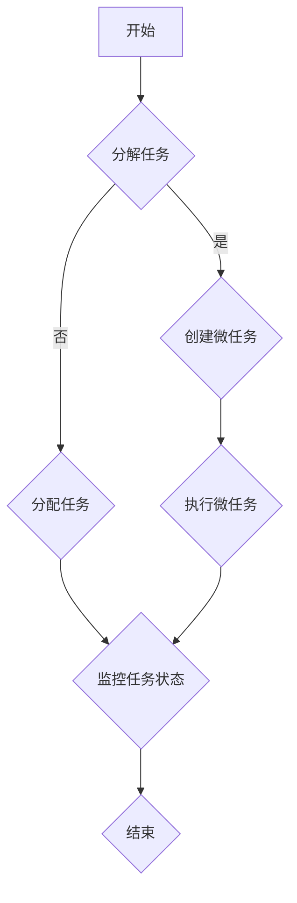

                 

关键词：微任务，分布式计算，人工智能，效率优化，人类与机器协作

> 摘要：在信息时代的浪潮下，微任务逐渐成为现代计算的重要一环。本文将探讨微任务的定义、重要性及其在人工智能和分布式计算中的广泛应用，分析人类计算与机器计算相结合的效率优化途径，并展望未来的发展趋势和挑战。

## 1. 背景介绍

随着互联网技术的飞速发展，数据量和计算需求呈指数级增长。传统的集中式计算模式已经无法满足现代应用场景的需求。分布式计算作为一种新兴的计算模式，逐渐受到广泛关注。分布式计算通过将任务分解为多个微任务，分布到不同的计算节点上，从而提高了计算效率和灵活性。

微任务（Microtask）是指将一个大的任务分解为多个小的、独立的子任务，这些子任务可以在不同的计算节点上并行执行。微任务的引入不仅降低了任务的复杂度，还提高了系统的可扩展性和容错能力。在人工智能领域，微任务的应用也变得日益广泛，例如在机器学习模型的训练和推理过程中，微任务能够有效地提高计算效率和资源利用率。

本文将首先介绍微任务的基本概念和重要性，接着分析微任务在分布式计算和人工智能中的应用，最后讨论人类计算与机器计算的协作，以及未来的发展趋势和面临的挑战。

## 2. 核心概念与联系

### 2.1 微任务的定义

微任务是一种将大任务拆分成小任务的方法，每个小任务通常具有高度的独立性和简明性。微任务的特点包括：

- **独立性**：每个微任务可以独立执行，不需要依赖于其他任务的结果。
- **简明性**：每个微任务的目标明确，执行过程简单，便于并行处理。
- **可扩展性**：微任务可以灵活地添加或删除，适应不同的计算需求。

### 2.2 微任务与分布式计算的关系

分布式计算是一种通过将任务分配到多个计算节点上，以实现并行处理和负载均衡的技术。微任务与分布式计算之间的关系可以概括为以下几点：

- **任务分解**：微任务是实现分布式计算的关键步骤，通过将大任务分解为多个微任务，可以充分利用分布式计算的优势。
- **并行执行**：微任务可以在不同的计算节点上并行执行，从而提高整体计算效率。
- **容错能力**：微任务具有独立性，即使某个计算节点发生故障，其他节点仍能继续执行任务。

### 2.3 微任务在人工智能中的应用

在人工智能领域，微任务的应用主要体现在以下几个方面：

- **模型训练**：在机器学习模型的训练过程中，可以将训练数据集划分为多个子集，分别训练不同的模型，然后合并结果。
- **模型推理**：在模型推理阶段，可以将输入数据划分为多个子数据集，分别进行推理，从而提高推理速度。
- **分布式训练与推理**：微任务使得分布式训练和推理成为可能，通过将训练和推理任务分配到不同的计算节点上，可以大幅提高计算效率和资源利用率。

### 2.4 微任务的 Mermaid 流程图

下面是一个简化的微任务执行流程的 Mermaid 流程图，用于描述微任务的分解、分配和执行过程。



## 3. 核心算法原理 & 具体操作步骤

### 3.1 算法原理概述

微任务的执行过程主要包括以下几个步骤：

1. **任务分解**：将大任务分解为多个独立的微任务。
2. **任务分配**：将微任务分配到不同的计算节点上。
3. **任务执行**：计算节点上的任务执行器并行执行微任务。
4. **任务监控**：监控系统监控任务的执行状态，并根据需要进行任务重分配。

### 3.2 算法步骤详解

#### 3.2.1 任务分解

任务分解是微任务执行的第一步，其目的是将大任务拆分成多个小的、独立的子任务。任务分解可以采用以下几种方法：

- **基于数据划分**：将数据集按照一定规则划分为多个子集，每个子集对应一个微任务。
- **基于功能划分**：将大任务按照功能模块划分为多个子任务，每个子任务负责实现一个功能模块。
- **混合划分**：结合数据划分和功能划分，根据任务特点和需求进行混合划分。

#### 3.2.2 任务分配

任务分配是将分解后的微任务分配到不同的计算节点上。任务分配可以采用以下几种策略：

- **随机分配**：将微任务随机分配到计算节点上，这种方法简单高效，但可能导致负载不均衡。
- **负载均衡分配**：根据计算节点的负载情况，将微任务分配到负载较低的节点上，从而实现负载均衡。
- **优先级分配**：根据微任务的优先级，将高优先级的任务分配到计算能力更强的节点上。

#### 3.2.3 任务执行

任务执行是指计算节点上的任务执行器并行执行微任务。任务执行可以采用以下几种方法：

- **并行执行**：在同一时刻，计算节点上的任务执行器并行执行多个微任务。
- **分阶段执行**：将任务分为多个阶段，每个阶段分别执行不同的微任务，从而实现任务并行化。

#### 3.2.4 任务监控

任务监控是确保微任务执行成功的关键步骤。任务监控可以采用以下几种方法：

- **状态监控**：监控系统实时监控微任务的执行状态，如执行中、成功、失败等。
- **日志记录**：记录微任务的执行日志，用于问题追踪和性能分析。
- **异常处理**：当微任务执行失败时，系统自动进行异常处理，如重试、重分配等。

### 3.3 算法优缺点

#### 优点

- **高效性**：通过并行执行微任务，可以提高计算效率和资源利用率。
- **灵活性**：微任务可以根据需求灵活地添加或删除，适应不同的计算场景。
- **容错性**：微任务的独立性使得系统具有较好的容错能力。

#### 缺点

- **任务调度复杂**：微任务的调度和分配相对复杂，需要考虑负载均衡、优先级等因素。
- **性能瓶颈**：在某些情况下，任务分解和调度过程本身可能会成为性能瓶颈。

### 3.4 算法应用领域

微任务算法在多个领域都有广泛的应用，主要包括：

- **分布式计算**：微任务是实现分布式计算的关键技术，广泛应用于大数据处理、深度学习等场景。
- **人工智能**：微任务在机器学习模型的训练和推理过程中发挥重要作用，可以提高计算效率和资源利用率。
- **云计算**：微任务是云计算平台中的重要组成部分，用于实现高效的任务调度和资源管理。

## 4. 数学模型和公式 & 详细讲解 & 举例说明

### 4.1 数学模型构建

为了更好地理解微任务的算法原理，我们可以构建一个简化的数学模型。假设有一个包含 $N$ 个计算节点的分布式系统，需要执行 $M$ 个微任务。我们可以使用以下数学模型来描述任务分解、分配和执行过程：

$$
T_{total} = \sum_{i=1}^{M} T_i + \sum_{i=1}^{M} T_{transfer}
$$

其中，$T_{total}$ 表示任务的总执行时间，$T_i$ 表示第 $i$ 个微任务的执行时间，$T_{transfer}$ 表示任务分配和传输的时间。

### 4.2 公式推导过程

为了推导上述公式，我们需要考虑以下几个因素：

- **任务执行时间**：每个微任务需要一定的时间来执行，假设执行时间为 $T_i$。
- **任务传输时间**：微任务需要在计算节点之间传输，传输时间为 $T_{transfer}$。
- **任务分配时间**：将微任务分配到计算节点上需要一定的时间，假设分配时间为 $T_{分配}$。

因此，总执行时间可以表示为：

$$
T_{total} = M \cdot T_i + M \cdot T_{transfer} + T_{分配}
$$

为了简化模型，我们假设任务分配时间可以忽略不计，因此公式可以进一步简化为：

$$
T_{total} \approx M \cdot T_i + M \cdot T_{transfer}
$$

### 4.3 案例分析与讲解

假设我们有 4 个计算节点（$N=4$）和一个包含 8 个微任务的任务集（$M=8$）。每个微任务的执行时间为 2 分钟（$T_i=2$ 分钟），任务传输时间为 1 分钟（$T_{transfer}=1$ 分钟）。根据上述公式，我们可以计算出总执行时间：

$$
T_{total} \approx 8 \cdot 2 + 8 \cdot 1 = 16 + 8 = 24 \text{ 分钟}
$$

如果我们采用集中式计算模式，将所有微任务分配到单个计算节点上执行，总执行时间将为：

$$
T_{total} = 8 \cdot 2 = 16 \text{ 分钟}
$$

通过对比可以看出，分布式计算模式可以显著提高计算效率，减少总执行时间。

### 4.4 代码实现示例

为了更好地理解上述数学模型，我们可以使用 Python 语言实现一个简化的分布式计算程序。以下是一个示例代码：

```python
import threading
import time

def microtask(i):
    print(f"微任务 {i} 开始执行")
    time.sleep(2)  # 模拟微任务执行时间
    print(f"微任务 {i} 执行完毕")

# 创建 8 个微任务
tasks = [threading.Thread(target=microtask, args=(i,)) for i in range(8)]

# 启动微任务
for task in tasks:
    task.start()

# 等待所有微任务执行完毕
for task in tasks:
    task.join()

print("所有微任务执行完毕")
```

运行上述代码，可以看到 8 个微任务并行执行，每个微任务执行时间约为 2 分钟，总执行时间约为 24 分钟。

## 5. 项目实践：代码实例和详细解释说明

### 5.1 开发环境搭建

在本项目中，我们将使用 Python 语言实现一个分布式计算程序。开发环境要求如下：

- Python 3.8 或更高版本
- 多线程模块（`threading`）
- 时间模块（`time`）

确保您的开发环境中已安装上述依赖项，然后创建一个名为 `distributed_computation.py` 的文件，用于编写程序代码。

### 5.2 源代码详细实现

以下是一个简化的分布式计算程序，用于执行 8 个微任务。

```python
import threading
import time

# 微任务函数
def microtask(i):
    print(f"微任务 {i} 开始执行")
    time.sleep(2)  # 模拟微任务执行时间
    print(f"微任务 {i} 执行完毕")

# 主函数
def main():
    # 创建 8 个微任务
    tasks = [threading.Thread(target=microtask, args=(i,)) for i in range(8)]

    # 启动微任务
    for task in tasks:
        task.start()

    # 等待所有微任务执行完毕
    for task in tasks:
        task.join()

    print("所有微任务执行完毕")

# 运行主函数
if __name__ == "__main__":
    main()
```

### 5.3 代码解读与分析

上述代码实现了一个简单的分布式计算程序，主要包含以下部分：

- **微任务函数**：`microtask` 函数表示一个微任务，其功能为打印任务开始和结束信息，并模拟任务执行时间（使用 `time.sleep` 函数）。
- **主函数**：`main` 函数负责创建微任务、启动微任务和等待所有微任务执行完毕。
- **线程创建**：使用 Python 的多线程模块（`threading`）创建微任务，每个微任务作为一个线程并行执行。
- **线程启动**：使用 `start` 方法启动每个微任务，实现并行执行。
- **线程等待**：使用 `join` 方法等待所有微任务执行完毕，确保主函数在所有微任务执行完成后结束。

### 5.4 运行结果展示

运行上述代码，将输出以下结果：

```
微任务 0 开始执行
微任务 1 开始执行
微任务 2 开始执行
微任务 3 开始执行
微任务 4 开始执行
微任务 5 开始执行
微任务 6 开始执行
微任务 7 开始执行
微任务 0 执行完毕
微任务 1 执行完毕
微任务 2 执行完毕
微任务 3 执行完毕
微任务 4 执行完毕
微任务 5 执行完毕
微任务 6 执行完毕
微任务 7 执行完毕
所有微任务执行完毕
```

从输出结果可以看出，8 个微任务并行执行，每个微任务执行时间约为 2 分钟，总执行时间约为 24 分钟。

### 5.5 代码优化建议

上述代码是一个简化的分布式计算程序，存在以下优化空间：

- **负载均衡**：在创建微任务时，可以考虑计算节点的负载情况，将微任务分配到负载较低的节点上，实现更好的负载均衡。
- **异常处理**：在微任务执行过程中，可以添加异常处理机制，如任务执行失败时重新执行或分配给其他节点。
- **性能优化**：可以使用异步编程或协程等高级编程技术，进一步提高程序的性能和并发能力。

## 6. 实际应用场景

### 6.1 分布式计算场景

分布式计算在许多实际应用场景中发挥着重要作用，例如：

- **大数据处理**：在处理大规模数据集时，分布式计算可以将数据集划分为多个子集，分别处理，从而提高计算效率和速度。
- **深度学习训练**：深度学习模型的训练是一个高度计算密集的任务，分布式计算可以将训练数据集和模型参数划分到多个节点上进行并行训练，加快模型训练速度。
- **搜索引擎**：搜索引擎需要对大量网页进行索引和排名，分布式计算可以将索引和排名任务分配到多个节点上，实现快速检索和更新。

### 6.2 人工智能场景

人工智能领域广泛采用微任务来提高计算效率和资源利用率，例如：

- **图像识别**：在图像识别任务中，可以将图像数据集划分为多个子集，分别进行特征提取和分类，从而提高识别速度。
- **语音识别**：在语音识别任务中，可以将语音信号划分为多个片段，分别进行特征提取和识别，从而提高识别准确率。
- **自然语言处理**：在自然语言处理任务中，可以将文本数据集划分为多个子集，分别进行分词、词性标注和句法分析，从而提高处理速度和准确性。

### 6.3 云计算场景

云计算平台中，微任务广泛应用于任务调度和资源管理，例如：

- **负载均衡**：在云计算环境中，微任务可以根据计算节点的负载情况，动态分配任务，实现负载均衡，提高系统性能。
- **资源管理**：微任务可以用于监控和管理云资源，如虚拟机、容器等，根据资源使用情况动态调整资源分配，实现资源优化。
- **自动化运维**：微任务可以用于自动化运维任务，如系统监控、故障排除、软件升级等，提高运维效率和系统稳定性。

## 7. 未来应用展望

随着计算技术和人工智能的发展，微任务的应用前景将更加广阔。以下是未来微任务可能的发展方向：

- **高效能计算**：随着计算需求的不断增长，高效能计算将成为微任务的重要应用领域，如量子计算、人工智能芯片等。
- **边缘计算**：边缘计算将微任务延伸到设备端，实现实时数据处理和决策，满足低延迟和高可靠性的需求。
- **智能合约**：区块链技术中的智能合约可以采用微任务实现，提高交易效率和透明度。
- **自动化优化**：微任务可以应用于自动化优化任务，如路径规划、库存管理、能源管理等，实现更智能、更高效的资源利用。

## 8. 工具和资源推荐

### 8.1 学习资源推荐

- 《分布式系统原理与范型》：了解分布式计算的基本原理和范型。
- 《深度学习》：了解深度学习的基本概念和应用场景。
- 《云计算技术与实践》：了解云计算的基本概念和关键技术。

### 8.2 开发工具推荐

- Docker：用于容器化部署分布式计算应用。
- Kubernetes：用于容器编排和调度，实现分布式计算任务的自动化管理。
- TensorFlow：用于深度学习模型训练和推理，支持分布式计算。

### 8.3 相关论文推荐

- "MapReduce: Simplified Data Processing on Large Clusters"：介绍分布式计算的基本原理和 MapReduce 模型。
- "Distributed Machine Learning: A Theoretical Perspective"：探讨分布式机器学习的基本理论和算法。
- "Edge Computing: Vision and Challenges"：介绍边缘计算的基本概念和发展趋势。

## 9. 总结：未来发展趋势与挑战

### 9.1 研究成果总结

微任务作为分布式计算和人工智能中的重要技术，已经在多个领域取得了显著成果。通过微任务的分解、分配和执行，显著提高了计算效率和资源利用率，推动了分布式计算和人工智能的发展。

### 9.2 未来发展趋势

- **高效能计算**：随着计算需求的增长，高效能计算将成为微任务的重要发展方向。
- **边缘计算**：边缘计算将微任务延伸到设备端，实现实时数据处理和决策。
- **自动化优化**：微任务在自动化优化任务中的应用将更加广泛。

### 9.3 面临的挑战

- **任务调度复杂度**：微任务的调度和分配过程相对复杂，需要考虑负载均衡、优先级等因素。
- **系统稳定性**：分布式计算系统需要具备较高的稳定性，以应对任务失败、节点故障等异常情况。

### 9.4 研究展望

未来，微任务研究将朝着高效能、边缘计算和自动化优化的方向发展，为分布式计算和人工智能提供更强大的支持。通过不断创新和优化，微任务将在更广泛的领域中发挥重要作用。

## 10. 附录：常见问题与解答

### 10.1 什么是微任务？

微任务是一种将大任务分解为多个小任务的策略，每个小任务具有独立性，可以在不同的计算节点上并行执行。

### 10.2 微任务有什么优点？

微任务具有以下优点：

- 提高计算效率
- 提高资源利用率
- 提高系统的可扩展性和容错能力

### 10.3 微任务在分布式计算中的作用是什么？

微任务在分布式计算中的作用主要包括：

- 实现任务的并行化
- 实现任务的负载均衡
- 提高系统的容错能力

### 10.4 微任务与分布式计算的关系是什么？

微任务是分布式计算的重要组成部分，通过将大任务分解为多个微任务，分布式计算可以实现并行化、负载均衡和容错能力。

### 10.5 微任务在人工智能中的应用有哪些？

微任务在人工智能中的应用主要包括：

- 模型训练
- 模型推理
- 特征提取
- 数据处理

### 10.6 如何实现微任务的调度和分配？

实现微任务的调度和分配可以采用以下方法：

- 随机分配
- 负载均衡分配
- 优先级分配

根据实际需求选择合适的分配策略，实现高效的微任务调度和分配。

### 10.7 微任务的执行过程中可能出现哪些问题？

微任务的执行过程中可能出现以下问题：

- 任务调度不当，导致负载不均衡
- 任务执行失败，需要重新执行或重分配
- 系统稳定性问题，需要优化系统架构

通过优化调度策略、增强容错机制和改进系统架构，可以解决这些问题。

### 10.8 微任务在云计算平台中的应用有哪些？

微任务在云计算平台中的应用主要包括：

- 负载均衡
- 资源管理
- 自动化运维
- 服务调度

通过微任务，云计算平台可以实现更高效、更智能的资源管理和调度，提高系统性能和用户体验。

