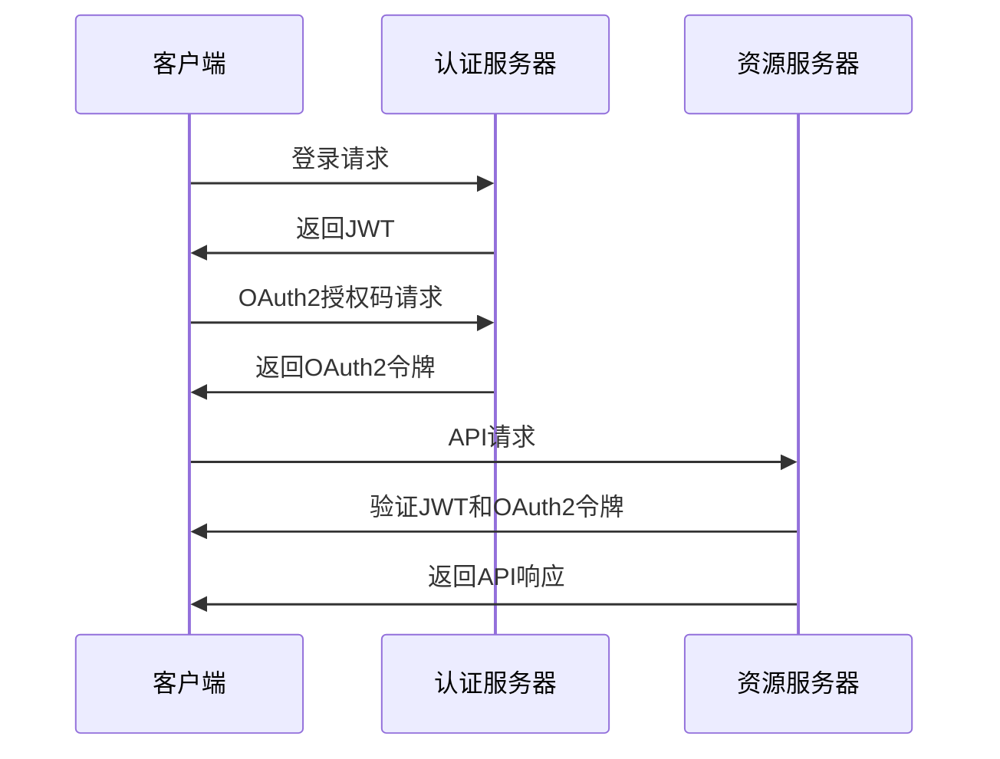

                 

 在当今快速发展的数字化时代，微服务架构因其灵活、可扩展和易于管理的特性而成为企业应用开发的主流趋势。然而，随着微服务系统的复杂性增加，安全性问题也日益凸显。OAuth2和JSON Web Token（JWT）是两种广泛用于微服务安全认证的技术。本文将深入探讨OAuth2和JWT的工作原理、实际应用，以及如何在微服务架构中有效使用它们来保障系统的安全性。

## 文章关键词

微服务，OAuth2，JWT，安全认证，API保护，单点登录，身份验证，授权

## 文章摘要

本文旨在为开发者提供关于OAuth2和JWT在微服务安全中的应用指南。通过本文，读者将了解这两种认证机制的核心概念、架构原理以及如何在实际项目中部署和使用。我们将通过具体的实例和步骤，展示如何通过OAuth2和JWT来增强微服务的安全性，并探讨它们在未来的发展趋势和面临的挑战。

## 1. 背景介绍

### 微服务架构的兴起

微服务架构是一种将大型单体应用拆分成多个小型、独立的服务的方法。每个微服务负责特定的业务功能，并通过API与其他微服务进行通信。这种架构模式具有模块化、易于维护和扩展的优点，能够更好地应对业务需求的变化。然而，随着系统的复杂度增加，安全性问题也逐渐成为开发者和运维人员关注的焦点。

### 安全认证的必要性

在微服务架构中，由于各个服务独立运行，传统的基于单点登录和集中认证的解决方案变得不再适用。因此，引入安全认证机制来保护API和数据通信的完整性、机密性和可靠性变得尤为重要。OAuth2和JWT是两种用于实现安全认证的流行技术，它们分别代表了授权和身份验证的两种不同方式。

## 2. 核心概念与联系

为了更好地理解OAuth2和JWT的工作原理，我们首先需要了解它们的核心概念及其在微服务架构中的联系。

### OAuth2

OAuth2是一种授权协议，用于允许第三方应用访问用户资源，而无需获取用户密码。它通过客户端-授权-资源服务器（Client-Authentication-Resource Server）的模式，实现了对资源访问的控制。

#### OAuth2的工作流程

1. **注册客户端**：客户端在资源服务器上注册，获取客户端ID和客户端密钥。
2. **授权码获取**：用户通过用户代理（通常是浏览器）访问授权端点，客户端请求用户授权。
3. **令牌获取**：用户同意授权后，授权端点将生成授权码，并返回给客户端。
4. **令牌交换**：客户端使用授权码向令牌端点请求访问令牌。
5. **访问资源**：获得访问令牌后，客户端可以使用该令牌访问受保护的资源。

### JWT

JWT是一种基于JSON的开放标准，用于在通信双方之间安全地传递信息。它通过数字签名确保数据在传输过程中的完整性和真实性。

#### JWT的结构

JWT由三部分组成：头部（Header）、载荷（Payload）和签名（Signature）。头部定义了JWT的算法和类型，载荷包含用户信息，签名则通过头部和载荷的哈希值与私钥计算得到。

#### JWT的工作流程

1. **生成JWT**：客户端或认证服务器使用公钥和头部信息生成JWT。
2. **传输JWT**：客户端将JWT作为HTTP请求的Authorization头传递给服务器。
3. **验证JWT**：服务器使用私钥对JWT进行验证，确保其完整性和真实性。

### OAuth2与JWT的联系

OAuth2和JWT在微服务安全认证中扮演着不同的角色。OAuth2负责授权，确保客户端有权访问用户资源；JWT则负责身份验证，确保请求者确实是合法的用户。通过将OAuth2和JWT结合起来，可以构建一个完整的安全认证体系。

#### Mermaid 流程图

下面是一个简单的Mermaid流程图，展示了OAuth2和JWT在微服务架构中的交互：



## 3. 核心算法原理 & 具体操作步骤

### 3.1 算法原理概述

#### OAuth2

OAuth2的工作原理基于三个核心组件：客户端、授权服务器和资源服务器。客户端请求访问资源时，需要通过授权服务器获得授权。授权服务器通过授权码或令牌来验证客户端的身份，并允许其访问资源。

#### JWT

JWT的核心原理是利用JSON格式封装用户信息，并通过数字签名确保数据的安全性。JWT由三部分组成：头部、载荷和签名。头部定义了使用的加密算法，载荷包含用户信息，而签名则是通过头部和载荷的哈希值与私钥计算得到的。

### 3.2 算法步骤详解

#### OAuth2

1. **客户端注册**：客户端在资源服务器上注册，获取客户端ID和客户端密钥。
2. **用户登录**：用户通过用户代理访问授权端点，客户端请求用户授权。
3. **授权码获取**：授权端点生成授权码，并返回给客户端。
4. **令牌交换**：客户端使用授权码向令牌端点请求访问令牌。
5. **访问资源**：客户端使用访问令牌访问资源服务器，获取资源。

#### JWT

1. **生成JWT**：使用公钥和头部信息生成JWT。
2. **传输JWT**：客户端将JWT作为HTTP请求的Authorization头传递给服务器。
3. **验证JWT**：服务器使用私钥对JWT进行验证，确保其完整性和真实性。

### 3.3 算法优缺点

#### OAuth2

**优点**：
- **灵活**：支持多种授权类型，如授权码、密码凭证和客户端凭证。
- **安全**：通过令牌机制减少直接使用用户密码的风险。

**缺点**：
- **复杂度**：相对于其他认证机制，OAuth2的流程较为复杂。
- **兼容性**：由于存在多种授权类型，实现时需要考虑兼容性问题。

#### JWT

**优点**：
- **简单**：相对于OAuth2，JWT的流程更加简单。
- **高效**：无需额外的令牌交换和验证步骤，减少通信开销。

**缺点**：
- **安全性**：由于JWT包含用户信息，一旦泄露，可能导致严重的安全问题。

### 3.4 算法应用领域

#### OAuth2

- **社交登录**：允许用户使用第三方账户（如Facebook、Google）登录应用程序。
- **API保护**：用于保护RESTful API，确保只有授权客户端可以访问。

#### JWT

- **单点登录**：在一个系统中，用户只需登录一次，即可访问多个子系统。
- **会话管理**：用于管理用户会话，确保用户身份的持续验证。

## 4. 数学模型和公式 & 详细讲解 & 举例说明

### 4.1 数学模型构建

在OAuth2和JWT中，数学模型主要涉及加密算法的使用。以下是一个简单的数学模型，用于描述这两种认证机制中的加密过程。

#### OAuth2

- **加密算法**：使用RSA算法进行加密。
- **密钥对**：客户端获得一对公钥和私钥。
- **加密过程**：
  - **生成密钥对**：使用RSA算法生成公钥和私钥。
  - **加密**：使用公钥对数据进行加密。

#### JWT

- **加密算法**：使用HMAC算法进行加密。
- **密钥对**：服务器获得一对公钥和私钥。
- **加密过程**：
  - **生成密钥对**：使用HMAC算法生成公钥和私钥。
  - **加密**：使用私钥对数据进行加密。

### 4.2 公式推导过程

#### OAuth2

- **加密公式**：`encrypted_data = RSAEncryption(plaintext, public_key)`
- **解密公式**：`plaintext = RSADecryption(encrypted_data, private_key)`

#### JWT

- **加密公式**：`encrypted_data = HMACEncryption(plaintext, private_key)`
- **解密公式**：`plaintext = HMACDecryption(encrypted_data, public_key)`

### 4.3 案例分析与讲解

#### OAuth2

**案例**：一个客户端需要访问一个资源服务器中的用户数据。

1. **客户端注册**：客户端在资源服务器上注册，获得客户端ID和客户端密钥。
2. **用户登录**：用户访问授权端点，客户端请求用户授权。
3. **授权码获取**：授权端点生成授权码，并返回给客户端。
4. **令牌交换**：客户端使用授权码向令牌端点请求访问令牌。
5. **访问资源**：客户端使用访问令牌访问资源服务器，获取用户数据。

#### JWT

**案例**：一个用户需要访问一个RESTful API。

1. **生成JWT**：服务器使用用户信息生成JWT。
2. **传输JWT**：用户将JWT作为HTTP请求的Authorization头传递给服务器。
3. **验证JWT**：服务器使用私钥对JWT进行验证，确保其完整性和真实性。

## 5. 项目实践：代码实例和详细解释说明

### 5.1 开发环境搭建

为了演示OAuth2和JWT在微服务中的使用，我们选择Spring Boot作为开发框架。以下是搭建开发环境的基本步骤：

1. **安装Java开发工具包（JDK）**：确保JDK版本不低于1.8。
2. **安装IDE**：推荐使用IntelliJ IDEA或Eclipse。
3. **创建Spring Boot项目**：使用Spring Initializr创建一个基础的Spring Boot项目。
4. **添加依赖**：在`pom.xml`文件中添加OAuth2和JWT的相关依赖。

### 5.2 源代码详细实现

以下是OAuth2和JWT在Spring Boot中的基本实现：

#### OAuth2

1. **配置授权服务器**：
   ```java
   @Configuration
   @EnableAuthorizationServer
   public class AuthorizationServerConfig extends AuthorizationServerConfigurerAdapter {
       @Override
       public void configure(ClientDetailsService clientDetailsService) throws Exception {
           clientDetailsService.setClientDetails(ClientDetails.withClient("client_id")
                   .secret("client_secret")
                   .authorizedGrantTypes("password", "authorization_code", "refresh_token", "client_credentials")
                   .scopes("read", "write", "trust").build());
       }

       @Override
       public void configure(AuthorizationEndpointProperties properties) {
           properties.setAccessTokenValiditySeconds(60);
       }

       @Override
       public void configure(AccessTokenConverter accessTokenConverter) {
           accessTokenConverter.setTokenEnhancer(new DefaultTokenEnhancer());
       }
   }
   ```

2. **配置资源服务器**：
   ```java
   @Configuration
   @EnableResourceServer
   public class ResourceServerConfig extends ResourceServerConfigurerAdapter {
       @Override
       public void configure(HttpSecurity http) throws Exception {
           http
                   .authorizeRequests()
                   .antMatchers("/api/**").hasAuthority("SCOPE_read")
                   .anyRequest().authenticated()
                   .and()
                   .httpBasic();
       }
   }
   ```

#### JWT

1. **配置JWT**：
   ```java
   @Configuration
   @EnableWebSecurity
   public class WebSecurityConfig extends WebSecurityConfigurerAdapter {
       @Override
       protected void configure(HttpSecurity http) throws Exception {
           http
                   .csrf().disable()
                   .authorizeRequests()
                   .antMatchers("/login").permitAll()
                   .anyRequest().authenticated()
                   .and()
                   .addFilter(new JWTAuthenticationFilter(authenticationManager()));
       }

       @Override
       protected void configure(AuthenticationManagerBuilder auth) throws Exception {
           auth.userDetailsService(userDetailsService());
       }
   }
   ```

### 5.3 代码解读与分析

上述代码实现了OAuth2和JWT的基本功能。在授权服务器中，我们配置了客户端详情，并设置了访问令牌的有效期。在资源服务器中，我们配置了访问控制规则，确保只有授权客户端可以访问特定资源。在JWT配置中，我们实现了登录认证和身份验证，通过JWT来保障用户会话的安全性。

### 5.4 运行结果展示

1. **运行授权服务器和资源服务器**：启动Spring Boot应用程序，分别访问授权端点和资源端点。
2. **登录和授权**：用户通过登录接口获取JWT令牌，并在后续请求中将其传递给资源服务器。
3. **访问受保护资源**：使用JWT令牌访问受保护的API，服务器将验证JWT的有效性和用户权限。

## 6. 实际应用场景

### 6.1 微服务之间的认证

在微服务架构中，服务之间需要进行认证和授权以确保数据安全和服务的可靠性。OAuth2和JWT可以用来实现服务间的安全通信。例如，一个订单服务需要访问用户服务获取用户信息，可以使用OAuth2和JWT来确保只有授权的服务才能访问用户数据。

### 6.2 API保护

许多企业需要保护其API免受未经授权的访问。通过使用OAuth2和JWT，可以确保只有经过认证和授权的客户端才能访问API。这种机制对于构建开放API和第三方集成尤为重要。

### 6.3 社交登录

在Web应用程序中，社交登录已经成为用户注册和登录的首选方式。OAuth2和JWT可以结合使用，允许用户使用社交媒体账户登录，同时保障用户数据的隐私和安全。

## 7. 工具和资源推荐

### 7.1 学习资源推荐

- **《OAuth 2.0 实战》**：一本关于OAuth2实践的入门书籍，适合初学者。
- **《JSON Web Token: The Complete Guide》**：涵盖JWT的详细教程和实战案例。

### 7.2 开发工具推荐

- **Spring Security**：用于实现OAuth2和JWT的Spring Boot安全框架。
- **JSON Web Key（JWK）**：用于管理和分发JWT所需的公钥和私钥。

### 7.3 相关论文推荐

- **OAuth 2.0: The Fine Print**：对OAuth2协议的深入分析。
- **The JSON Web Token (JWT) Standard**：JWT的官方标准文档。

## 8. 总结：未来发展趋势与挑战

### 8.1 研究成果总结

近年来，OAuth2和JWT在微服务安全认证领域取得了显著的成果。随着微服务架构的普及，这两种技术得到了广泛应用。同时，开源社区和商业公司也在不断推出相关的工具和框架，提高了开发效率和安全性。

### 8.2 未来发展趋势

- **标准化和规范化**：随着技术的发展，OAuth2和JWT将逐渐实现标准化和规范化，提高跨平台和跨服务的互操作性。
- **隐私保护**：随着对用户隐私保护的要求不断提高，OAuth2和JWT将逐步引入更多的隐私保护机制，如差分隐私和匿名化技术。

### 8.3 面临的挑战

- **安全性**：尽管OAuth2和JWT提供了强大的安全认证机制，但在实际应用中仍然存在安全漏洞和攻击风险。未来需要进一步加强安全防护措施，提高认证系统的抗攻击能力。
- **兼容性和扩展性**：随着微服务架构的多样性和复杂性增加，OAuth2和JWT需要具备更好的兼容性和扩展性，以适应不同的应用场景和业务需求。

### 8.4 研究展望

未来，OAuth2和JWT的研究将继续深入，特别是在以下几个方面：

- **安全增强**：研究新型加密算法和认证机制，提高认证系统的安全性。
- **隐私保护**：探索更加隐私保护的技术，如差分隐私和联邦学习。
- **跨域认证**：研究跨域认证机制，实现多系统之间的无缝认证和授权。

## 9. 附录：常见问题与解答

### 9.1 OAuth2和JWT的区别是什么？

OAuth2是一种授权协议，用于允许第三方应用访问用户资源。JWT是一种基于JSON的开放标准，用于在通信双方之间安全地传递信息。OAuth2负责授权，JWT负责身份验证。

### 9.2 如何保护JWT免受攻击？

可以使用HTTPS协议传输JWT，确保数据在传输过程中的安全性。同时，建议使用强加密算法和适当的密钥管理策略，确保JWT的签名不被篡改。

### 9.3 OAuth2和JWT可以共存吗？

是的，OAuth2和JWT可以共存。OAuth2负责授权，JWT负责身份验证。通过结合使用这两种技术，可以构建一个完整的安全认证体系。

## 作者署名

作者：禅与计算机程序设计艺术 / Zen and the Art of Computer Programming

以上是关于“微服务安全：OAuth2和JWT的实践”的文章。希望这篇文章能够帮助读者更好地理解OAuth2和JWT在微服务安全认证中的应用，并为其实际项目提供参考。在数字化时代，安全始终是发展的基石，让我们共同努力，构建一个更加安全、可靠的微服务生态系统。

