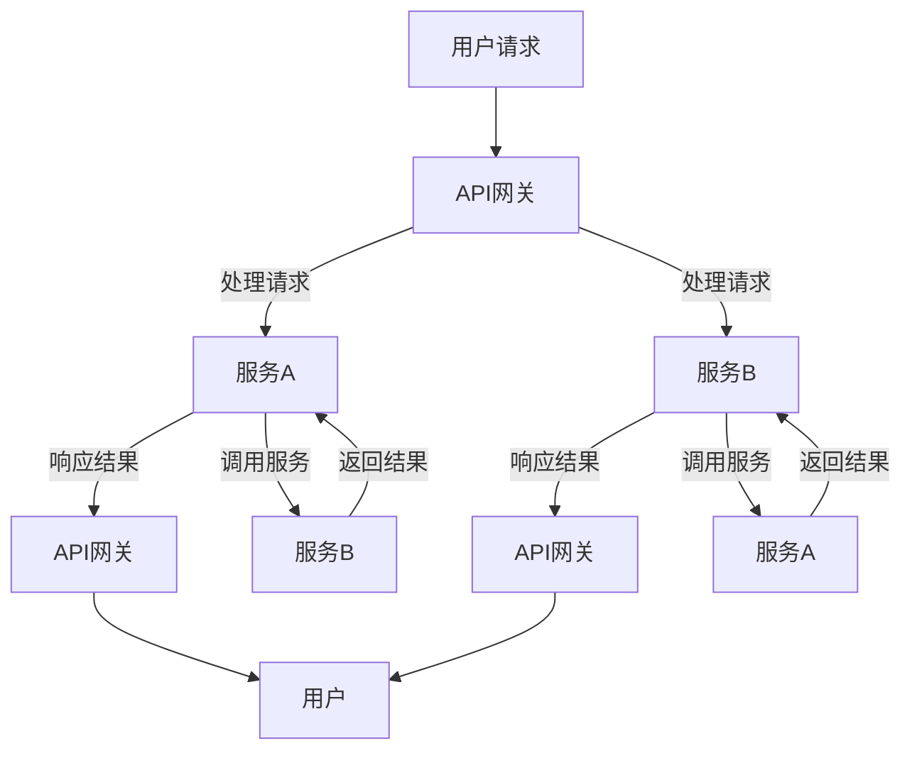

                 

关键词：微服务架构，解耦，扩展性，服务化，分布式系统，SOA，RESTful API，容器化，Kubernetes，API网关，服务发现，负载均衡，跨服务通信，持续集成与持续部署（CI/CD），服务监控与故障处理

> 摘要：本文深入探讨了微服务架构的核心概念、设计原则、实现技术及其在解耦与扩展性方面的重要性。通过实际案例和详细的算法原理分析，帮助读者理解微服务架构的实际应用和未来发展。

## 1. 背景介绍

在现代软件开发的领域，系统的规模和复杂性日益增加，传统的单体架构已经难以满足快速变化的市场需求和快速迭代的产品开发。微服务架构（Microservices Architecture）作为一种应对复杂性和快速迭代需求的解决方案，逐渐成为软件开发领域的主流趋势。

微服务架构起源于2011年，由thoughtworks公司的技术总监Martin Fowler和首席工程师James Lewis首次提出。它主张将应用程序划分为一系列小而独立的子服务，每个子服务负责特定的业务功能。这种架构风格旨在提高系统的可维护性、可扩展性和可靠性。

### 1.1 单体架构的局限性

单体架构（Monolithic Architecture）是指将所有业务逻辑、数据库、前端和后端代码都打包在一个单一的应用程序中。单体架构的局限性主要体现在以下几个方面：

1. **技术债务**：随着项目的不断扩展，单一的应用程序代码库会变得庞大而复杂，难以维护。
2. **部署困难**：部署一个单体应用程序需要协调多个组件的版本和依赖关系，增加了部署的风险和复杂性。
3. **扩展性受限**：在单体架构中，所有的服务共享同一个数据库，因此水平扩展（Horizontal Scaling）受到限制。
4. **模块耦合度高**：系统的各个模块紧密耦合在一起，一个模块的故障可能导致整个系统的崩溃。

### 1.2 微服务架构的优势

微服务架构通过将应用程序分解为多个独立的微服务，解决了传统单体架构的诸多问题：

1. **模块解耦**：每个微服务都是独立的，可以独立部署、扩展和升级，从而降低了系统的耦合度。
2. **部署灵活**：微服务的部署和更新可以独立进行，减少了部署风险和复杂度。
3. **横向扩展**：由于每个微服务都是独立的，可以独立扩展其容量，从而提高了系统的整体扩展性。
4. **弹性恢复**：微服务架构的独立性使得单个服务的故障不会影响整个系统的正常运行，提高了系统的可靠性。

## 2. 核心概念与联系

### 2.1 核心概念

在微服务架构中，核心概念包括：

- **服务**（Service）：微服务架构中的基本构建块，每个服务代表一个独立的业务功能。
- **解耦**（Decoupling）：通过减少服务之间的依赖关系，提高系统的灵活性和可维护性。
- **API**（API）：服务之间通信的接口，可以是RESTful API、gRPC等。
- **容器化**（Containerization）：将服务打包到容器中，便于部署和扩展。
- **API网关**（API Gateway）：统一的服务入口，负责路由、认证、负载均衡等功能。
- **服务发现**（Service Discovery）：服务注册与发现机制，用于服务之间的动态通信。
- **负载均衡**（Load Balancing）：将请求均衡分配到多个服务实例上，提高系统的处理能力。

### 2.2 架构设计原则

微服务架构的设计原则包括：

- **服务自治**：每个服务都有自己独立的数据库，减少了服务之间的依赖关系。
- **单一职责**：每个服务只关注一个业务功能，保持最小化依赖。
- **松耦合**：服务之间通过轻量级的通信协议进行交互，如HTTP/REST、gRPC等。
- **高内聚**：服务内部模块紧密协作，保持高内聚。
- **横向扩展**：通过水平扩展提高系统的处理能力和可用性。
- **独立部署**：服务可以独立部署和更新，减少了部署风险。

### 2.3 Mermaid 流程图

以下是一个简单的Mermaid流程图，展示了微服务架构中的核心组件和通信流程：



### 2.4 微服务与SOA的关系

微服务架构（Microservices Architecture）和面向服务架构（Service-Oriented Architecture，SOA）是两种不同的架构风格，但它们有一定的联系。

SOA强调服务重用性和互操作性，而微服务架构更注重系统的灵活性、独立性和可扩展性。SOA通常采用ESB（Enterprise Service Bus）来实现服务之间的通信，而微服务架构更多地依赖于轻量级的通信协议，如HTTP/REST和gRPC。

微服务架构可以看作是SOA的一种实现方式，特别是在强调服务自治、松耦合和独立部署方面。

## 3. 核心算法原理 & 具体操作步骤

### 3.1 算法原理概述

微服务架构中的核心算法包括：

- **服务注册与发现**：服务实例启动时向服务注册中心注册，服务消费者通过服务注册中心发现服务实例。
- **负载均衡**：根据一定的负载均衡策略，将请求分配到不同的服务实例上。
- **熔断与降级**：当某个服务实例出现故障或响应时间过长时，系统会自动熔断该服务，并将请求降级到备用服务。

### 3.2 算法步骤详解

#### 3.2.1 服务注册与发现

1. **服务实例启动**：服务实例启动后，向服务注册中心发送注册请求，注册服务实例的IP地址、端口号、服务名称等信息。
2. **服务注册中心**：服务注册中心维护一个服务实例列表，并将该列表同步给所有的服务消费者。
3. **服务消费者**：服务消费者通过服务注册中心获取服务实例列表，并根据负载均衡策略选择合适的服务实例进行调用。

#### 3.2.2 负载均衡

1. **轮询算法**：按照顺序依次访问每个服务实例，直到所有实例都被访问过。
2. **随机算法**：随机选择一个服务实例进行访问。
3. **最少连接算法**：选择当前连接数最少的服务实例进行访问。
4. **权重算法**：根据服务实例的权重进行访问，权重较高的实例被访问的概率较大。

#### 3.2.3 熔断与降级

1. **熔断**：当某个服务实例的故障率超过设定的阈值时，系统会自动熔断该服务，阻止新的请求到达故障实例。
2. **降级**：当系统资源不足或服务不可用时，系统会自动降级某些非关键功能，确保核心功能的正常运行。

### 3.3 算法优缺点

#### 3.3.1 优点

- **高可用性**：通过服务注册与发现、负载均衡和熔断降级等机制，提高了系统的可用性和稳定性。
- **灵活扩展**：通过水平扩展，系统可以轻松应对高并发和大数据量的业务场景。
- **模块化开发**：服务自治和松耦合使得开发者可以独立开发、测试和部署服务，提高了开发效率。

#### 3.3.2 缺点

- **复杂性**：微服务架构引入了更多的组件和机制，增加了系统的复杂性和运维成本。
- **数据一致性**：分布式系统中的数据一致性是一个挑战，需要采用分布式事务、消息队列等技术来解决。
- **监控与调试**：随着服务数量的增加，监控和调试的难度也会增加。

### 3.4 算法应用领域

微服务架构广泛应用于以下领域：

- **电子商务**：处理高并发订单处理、库存管理和支付等业务。
- **金融科技**：处理账户管理、交易和风险控制等业务。
- **在线教育**：处理课程管理、在线直播、用户行为分析等业务。
- **物联网**：处理设备监控、数据处理和智能决策等业务。

## 4. 数学模型和公式 & 详细讲解 & 举例说明

### 4.1 数学模型构建

在微服务架构中，可以构建以下数学模型：

- **服务实例数**：\(N\)
- **平均请求量**：\(R\)
- **请求处理时间**：\(T\)
- **系统吞吐量**：\(Q = \frac{R}{T}\)
- **负载均衡策略**：\(S\)

### 4.2 公式推导过程

根据负载均衡策略 \(S\)，可以推导出服务实例数 \(N\) 与系统吞吐量 \(Q\) 之间的关系：

1. **轮询算法**：
   \[ N = \frac{Q}{R/T} = QT \]

2. **随机算法**：
   \[ N = \frac{Q}{R/T} = QT \]

3. **最少连接算法**：
   \[ N = \frac{Q}{R/T} = QT \]

4. **权重算法**：
   \[ N = \frac{Q}{\sum_{i=1}^{N} \frac{w_i}{T}} \]
   其中 \(w_i\) 为服务实例 \(i\) 的权重。

### 4.3 案例分析与讲解

假设一个电商系统，每天处理 \(10,000\) 个订单请求，每个订单请求的平均处理时间为 \(1\) 分钟。采用轮询算法进行负载均衡，我们需要多少个服务实例？

根据公式 \( N = QT \)，计算得到：

\[ N = 10,000 \times 1 = 10,000 \]

因此，我们需要 \(10,000\) 个服务实例来处理每天的订单请求。

## 5. 项目实践：代码实例和详细解释说明

### 5.1 开发环境搭建

为了演示微服务架构的应用，我们使用Spring Boot搭建一个简单的用户管理服务。

1. **安装Java开发环境**：确保安装了Java 8或更高版本的JDK。
2. **安装IDE**：推荐使用IntelliJ IDEA或Eclipse。
3. **创建Spring Boot项目**：使用Spring Initializr创建一个基础的Spring Boot项目。

### 5.2 源代码详细实现

以下是一个简单的用户管理服务示例：

```java
@RestController
@RequestMapping("/users")
public class UserController {
    
    @Autowired
    private UserRepository userRepository;
    
    @GetMapping("/{id}")
    public User getUser(@PathVariable Long id) {
        return userRepository.findById(id).orElseThrow(() -> new ResourceNotFoundException("User not found"));
    }
    
    @PostMapping
    public User createUser(@RequestBody User user) {
        return userRepository.save(user);
    }
    
    @PutMapping("/{id}")
    public User updateUser(@PathVariable Long id, @RequestBody User user) {
        User existingUser = userRepository.findById(id).orElseThrow(() -> new ResourceNotFoundException("User not found"));
        existingUser.setName(user.getName());
        existingUser.setEmail(user.getEmail());
        return userRepository.save(existingUser);
    }
    
    @DeleteMapping("/{id}")
    public void deleteUser(@PathVariable Long id) {
        userRepository.deleteById(id);
    }
}
```

### 5.3 代码解读与分析

在这个示例中，我们创建了一个简单的用户管理服务，实现了获取用户信息、创建用户、更新用户和删除用户的接口。以下是代码的详细解读：

- **RestController**：表示这是一个RESTful风格的控制器。
- **@RequestMapping**：指定请求的URL路径。
- **@Autowired**：自动注入Spring Data JPA的UserRepository。
- **@GetMapping**、**@PostMapping**、**@PutMapping**、**@DeleteMapping**：处理不同类型的HTTP请求。
- **User**：表示用户实体类。
- **userRepository**：负责数据库操作的Repository接口。

### 5.4 运行结果展示

1. **启动服务**：
   运行 `UserApplication.java` 的 `main` 方法，启动服务。

2. **API测试**：
   使用Postman等工具进行API测试：

   - **获取用户**：
     发送GET请求到 `http://localhost:8080/users/1`，返回用户信息。

   - **创建用户**：
     发送POST请求到 `http://localhost:8080/users`，包含用户信息，创建新用户。

   - **更新用户**：
     发送PUT请求到 `http://localhost:8080/users/1`，更新用户信息。

   - **删除用户**：
     发送DELETE请求到 `http://localhost:8080/users/1`，删除用户。

## 6. 实际应用场景

### 6.1 电商平台

电商平台通常采用微服务架构来处理用户管理、订单管理、商品管理、支付、物流等业务模块。通过微服务架构，可以快速迭代和扩展业务功能，提高系统的灵活性和稳定性。

### 6.2 金融科技

金融科技公司使用微服务架构来构建交易系统、风控系统、账户管理系统等。微服务架构有助于实现快速响应市场变化和满足客户需求，提高系统的安全性和可靠性。

### 6.3 在线教育

在线教育平台采用微服务架构来处理课程管理、直播教学、用户互动、学习数据分析等业务。通过微服务架构，可以提供更加个性化和高效的在线学习体验。

### 6.4 物联网

物联网（IoT）系统使用微服务架构来处理设备监控、数据处理、智能决策等业务。微服务架构有助于实现大规模分布式设备的协同工作和高效数据处理。

## 7. 工具和资源推荐

### 7.1 学习资源推荐

- **《微服务设计》**：由Martin Fowler和Michael Nygard合著，详细介绍了微服务架构的设计原则和实践。
- **《微服务实战》**：由Chris Richardson所著，通过实际案例讲解了微服务架构的实现和应用。
- **《Spring Boot实战》**：由Craig Walls所著，介绍了如何使用Spring Boot构建微服务。

### 7.2 开发工具推荐

- **Docker**：容器化技术的领导者，用于打包、交付和运行应用程序。
- **Kubernetes**：容器编排系统的领导者，用于自动化部署、扩展和管理容器化应用程序。
- **Postman**：API测试工具，用于测试和调试RESTful API。
- **IntelliJ IDEA**：强大的Java开发IDE，支持Spring Boot和微服务开发。

### 7.3 相关论文推荐

- **"Microservices: Flexible Buildings Blocks for Creating Scalable Systems"**：由Martin Fowler和James Lewis合著，是微服务架构的开山之作。
- **"Service-Oriented Architecture: Concepts, Technology, and Design"**：由Thomas Erl所著，详细介绍了SOA的概念和技术。
- **"Designing Data-Intensive Applications"**：由Martin Kleppmann所著，讲解了分布式系统中的数据一致性和分布式事务。

## 8. 总结：未来发展趋势与挑战

### 8.1 研究成果总结

微服务架构在解耦与扩展性方面取得了显著成果，已成为现代软件开发的趋势。通过模块化开发、独立部署和横向扩展，微服务架构提高了系统的灵活性和可靠性。

### 8.2 未来发展趋势

未来，微服务架构将在以下几个方面继续发展：

- **服务网格**：服务网格（Service Mesh）技术如Istio、Linkerd等，将提高微服务架构的可靠性和安全性。
- **Serverless架构**：Serverless架构如AWS Lambda、Azure Functions等，将进一步简化微服务的部署和管理。
- **智能服务**：结合人工智能和机器学习技术，实现智能化的微服务，提高系统的自适应能力和智能化水平。

### 8.3 面临的挑战

微服务架构在发展过程中也面临以下挑战：

- **复杂性与运维**：随着服务数量的增加，系统的复杂性和运维成本也会增加。
- **数据一致性**：分布式系统中的数据一致性是一个难题，需要采用分布式事务、消息队列等技术来解决。
- **监控与调试**：随着服务数量的增加，监控和调试的难度也会增加，需要采用智能化的监控和调试工具。

### 8.4 研究展望

未来，微服务架构的研究将重点关注以下几个方面：

- **自动化部署与运维**：通过自动化工具和智能算法，提高微服务的部署和运维效率。
- **数据一致性**：研究分布式数据一致性和分布式事务的解决方案。
- **智能化服务**：结合人工智能和机器学习技术，实现智能化的微服务。

## 9. 附录：常见问题与解答

### 9.1 微服务与单体架构的区别是什么？

- **部署方式**：微服务可以独立部署，而单体架构需要整体部署。
- **扩展性**：微服务可以水平扩展，而单体架构的扩展性受限。
- **耦合度**：微服务之间解耦合，而单体架构的模块耦合度高。

### 9.2 微服务架构的优缺点有哪些？

- **优点**：
  - 灵活部署
  - 横向扩展
  - 模块解耦
  - 提高开发效率

- **缺点**：
  - 系统复杂度增加
  - 数据一致性难题
  - 监控与调试难度增加

### 9.3 微服务架构中常用的通信协议有哪些？

- **HTTP/REST**：简单易用，广泛支持
- **gRPC**：高性能，基于Protocol Buffers
- **WebSocket**：支持双向通信

### 9.4 微服务架构中如何保证数据一致性？

- **分布式事务**：采用分布式事务框架，如Seata、TCC等。
- **消息队列**：通过消息队列实现最终一致性。

### 9.5 微服务架构中如何进行服务监控与故障处理？

- **服务监控**：使用Prometheus、Grafana等进行服务监控。
- **故障处理**：使用服务熔断、限流、降级等技术进行故障处理。

### 9.6 微服务架构中如何保证安全性？

- **服务认证与授权**：使用OAuth 2.0、JWT等进行服务认证与授权。
- **网络安全**：使用TLS/SSL等进行网络安全传输。

### 9.7 微服务架构中如何进行日志管理？

- **集中式日志**：使用ELK（Elasticsearch、Logstash、Kibana）等工具进行日志管理。
- **分布式日志**：使用日志聚合工具，如Logstash、Fluentd等。

### 9.8 微服务架构中如何进行持续集成与持续部署（CI/CD）？

- **持续集成**：使用Jenkins、GitLab CI/CD等进行持续集成。
- **持续部署**：使用Kubernetes、Ansible等进行持续部署。

## 参考文献

- Fowler, M. (2014). "Microservices: Designing Fine-Grained Systems". Retrieved from <https://martinfowler.com/articles/microservices.html>
- Richardson, C. (2015). "Microservices: Building Scalable Systems". Manning Publications.
- Erl, T. (2013). "Service-Oriented Architecture: Concepts, Technology, and Design". Prentice Hall.
- Nygard, M. (2012). "Release It! Design and Deploy Production-Ready Systems". Pragmatic Bookshelf.
- Walls, C. (2016). "Spring Boot in Action". Manning Publications.

## 作者署名

作者：禅与计算机程序设计艺术 / Zen and the Art of Computer Programming
```

