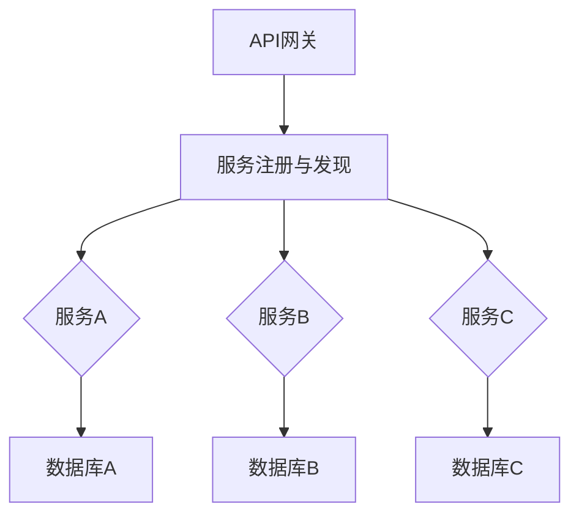

                 

关键词：微服务架构、设计模式、最佳实践、分布式系统、持续交付、云原生

> 摘要：本文将深入探讨微服务架构的设计模式与最佳实践，从概念入手，结合实际案例，全面解析微服务架构的核心要素和关键技巧，帮助读者更好地理解和应用微服务架构，实现高效、可扩展、稳定的分布式系统建设。

## 1. 背景介绍

### 1.1 微服务架构的起源与发展

微服务架构（Microservices Architecture）起源于2000年代初期，作为一种应对复杂分布式系统设计的创新架构风格。当时，传统的单体（Monolithic）架构在面对日益增长的系统复杂性和业务需求变化时显得力不从心。单体架构将应用程序作为一个单一的实体进行开发和部署，导致系统的扩展性、可维护性和可测试性差。

为了解决这些问题，开发者们开始探索将大型应用程序拆分为一组小的、独立的、松耦合的服务，每个服务负责完成特定的功能。这种方式不仅提高了系统的可扩展性，还使得开发和维护更加灵活。

### 1.2 微服务架构与传统单体架构的区别

传统单体架构和微服务架构的主要区别在于：

- **架构风格**：单体架构将所有功能集成在一个应用程序中，而微服务架构将应用程序拆分为多个独立的服务。
- **开发方式**：单体架构通常采用“全栈”开发模式，而微服务架构鼓励采用“专业栈”开发模式，即每个服务都有自己的开发团队。
- **部署方式**：单体架构通常一次部署整个应用程序，而微服务架构则支持独立部署每个服务，提高了部署的灵活性和可恢复性。
- **通信协议**：单体架构内部通常使用共享库或全局变量进行通信，而微服务架构则使用REST、gRPC等远程调用协议进行服务间通信。

### 1.3 微服务架构的优点与挑战

微服务架构具有以下优点：

- **高扩展性**：通过拆分为多个独立服务，每个服务可以根据业务需求进行独立扩展。
- **高可维护性**：服务拆分使得开发和维护更加专业化，提高了代码的可维护性。
- **高可测试性**：独立的服务使得测试更加简洁和高效。
- **高灵活性**：服务拆分和独立部署使得系统能够更好地应对业务变化。

然而，微服务架构也带来了一些挑战：

- **复杂性增加**：分布式系统的复杂性高于单体架构，需要更精细的架构设计和运维管理。
- **服务治理**：需要有效的服务发现、负载均衡和服务监控机制。
- **数据一致性**：分布式系统中的数据一致性是一个难点，需要合理的设计和策略。
- **开发和运维成本**：需要更多的工具和技能来支持微服务架构。

## 2. 核心概念与联系

### 2.1 微服务的定义

微服务（Microservice）是一种软件架构风格，其特点是：

- **独立性**：每个服务独立运行，具有自己的进程和资源。
- **小型化**：服务规模较小，通常只完成一个或几个特定的功能。
- **松耦合**：服务之间通过轻量级的通信机制（如HTTP/REST、gRPC）进行交互，无需共享代码或状态。
- **自治**：每个服务都有自己的数据库，具有独立的部署、扩展和监控。

### 2.2 微服务架构的组成部分

微服务架构包括以下核心组成部分：

- **服务**：完成特定功能的独立组件。
- **API网关**：统一外部请求的入口，处理请求路由、身份验证、数据转换等。
- **服务注册与发现**：管理服务实例的注册和发现，实现动态服务调用。
- **服务通信**：服务间通信机制，如HTTP/REST、gRPC、MQ等。
- **配置管理**：集中管理服务的配置信息，支持动态更新。
- **服务监控**：监控服务运行状态，实现故障预警和自动恢复。
- **数据存储**：服务所使用的数据库，可以是关系型或非关系型，支持分布式存储。

### 2.3 微服务架构的Mermaid流程图



## 3. 核心算法原理 & 具体操作步骤

### 3.1 算法原理概述

微服务架构的核心算法包括：

- **服务发现**：实现服务实例的动态注册和发现，支持服务间动态调用。
- **负载均衡**：根据服务实例的健康状态和负载情况，实现请求的合理分发。
- **分布式事务**：在分布式环境中实现事务的原子性和一致性。

### 3.2 算法步骤详解

#### 3.2.1 服务发现

1. **服务实例注册**：新服务启动时，向服务注册中心（如Eureka、Consul）注册自身，提供服务名称和端点信息。
2. **服务实例发现**：客户端通过服务注册中心查询所需服务的实例列表，选择一个实例进行调用。
3. **服务实例心跳**：服务实例定期向服务注册中心发送心跳，更新其健康状态。

#### 3.2.2 负载均衡

1. **健康检查**：服务注册中心对服务实例进行定期健康检查，剔除不健康实例。
2. **请求分发**：客户端请求通过API网关，API网关根据负载均衡策略（如轮询、随机、权重等）选择实例进行调用。

#### 3.2.3 分布式事务

1. **全局事务标识**：在分布式事务中生成全局唯一的事务标识。
2. **本地事务提交**：每个服务完成本地事务后，向分布式事务协调器（如Seata）报告事务状态。
3. **全局事务提交/回滚**：根据本地事务报告的结果，分布式事务协调器决定全局事务的提交或回滚。

### 3.3 算法优缺点

#### 优点

- **服务发现**：动态服务注册和发现，提高了系统的灵活性和可扩展性。
- **负载均衡**：合理分配请求，提高了系统的吞吐量和可用性。
- **分布式事务**：在分布式环境中实现事务的一致性，保证了数据完整性。

#### 缺点

- **复杂性增加**：分布式系统引入了更多的组件和机制，增加了系统设计的复杂度。
- **性能开销**：服务发现、负载均衡和分布式事务等机制引入了一定的性能开销。

### 3.4 算法应用领域

微服务架构的核心算法广泛应用于以下领域：

- **电子商务**：实现分布式购物车、订单处理等。
- **金融系统**：处理分布式交易、资金流转等。
- **社交媒体**：支持海量用户的高并发访问和内容分发。

## 4. 数学模型和公式 & 详细讲解 & 举例说明

### 4.1 数学模型构建

在微服务架构中，我们可以构建以下数学模型：

- **服务实例负载**：\( L_i = \frac{R_i}{T_i} \)
  - \( L_i \)：服务实例 \( i \) 的负载。
  - \( R_i \)：服务实例 \( i \) 在时间 \( T_i \) 内接收的请求量。
  - \( T_i \)：服务实例 \( i \) 在时间 \( T_i \) 内处理的请求量。

- **服务实例健康状态**：\( H_i = \frac{S_i - F_i}{S_i} \)
  - \( H_i \)：服务实例 \( i \) 的健康状态。
  - \( S_i \)：服务实例 \( i \) 的总状态（健康状态 + 不健康状态）。
  - \( F_i \)：服务实例 \( i \) 的不健康状态。

- **全局事务一致性**：\( C_{global} = \frac{C_{local}}{N} \)
  - \( C_{global} \)：全局事务的一致性。
  - \( C_{local} \)：本地事务的一致性。
  - \( N \)：参与全局事务的服务实例数量。

### 4.2 公式推导过程

#### 服务实例负载

服务实例负载表示服务实例在单位时间内处理的请求量与接收的请求量之比。负载越低，表示服务实例的处理能力越强，反之亦然。

#### 服务实例健康状态

服务实例健康状态表示服务实例的健康程度。健康状态越高，表示服务实例越健康。

#### 全局事务一致性

全局事务一致性表示全局事务的一致性程度。一致性越高，表示全局事务越稳定。

### 4.3 案例分析与讲解

假设有3个服务实例A、B和C，分别在1小时内接收了1000个请求，处理了900个请求，其中A和B的健康状态为100%，C的健康状态为80%。全局事务包含3个本地事务。

根据以上数据，我们可以计算出：

- 服务实例A的负载：\( L_A = \frac{900}{1000} = 0.9 \)
- 服务实例B的负载：\( L_B = \frac{900}{1000} = 0.9 \)
- 服务实例C的负载：\( L_C = \frac{900}{1000} = 0.9 \)

- 服务实例A的健康状态：\( H_A = \frac{100 - 0}{100} = 1 \)
- 服务实例B的健康状态：\( H_B = \frac{100 - 0}{100} = 1 \)
- 服务实例C的健康状态：\( H_C = \frac{100 - 20}{100} = 0.8 \)

- 全局事务的一致性：\( C_{global} = \frac{3 \times 100}{3} = 100 \)

根据计算结果，我们可以得出以下结论：

- 3个服务实例的负载相等，均为0.9，说明负载均衡效果较好。
- 2个服务实例的健康状态为100%，1个服务实例的健康状态为80%，说明存在健康状态不理想的服务实例。
- 全局事务的一致性为100%，说明全局事务的一致性较高。

## 5. 项目实践：代码实例和详细解释说明

### 5.1 开发环境搭建

为了实践微服务架构，我们需要搭建以下开发环境：

- **编程语言**：Java
- **框架**：Spring Boot、Spring Cloud
- **服务注册与发现**：Eureka
- **API网关**：Zuul
- **分布式事务**：Seata

### 5.2 源代码详细实现

以下是微服务架构的一个简单示例，包括订单服务（OrderService）、库存服务（StockService）和账户服务（AccountService）。

#### 5.2.1 订单服务（OrderService）

```java
@RestController
@RequestMapping("/orders")
public class OrderController {

    @Autowired
    private OrderService orderService;

    @PostMapping
    public ResponseEntity<Order> createOrder(@RequestBody Order order) {
        return ResponseEntity.ok(orderService.createOrder(order));
    }
}
```

#### 5.2.2 库存服务（StockService）

```java
@Service
public class StockService {

    @Autowired
    private StockRepository stockRepository;

    public Stock getStockById(Long id) {
        return stockRepository.findById(id).orElseThrow(() -> new ResourceNotFoundException("Stock not found"));
    }

    public void updateStock(Stock stock) {
        stockRepository.save(stock);
    }
}
```

#### 5.2.3 账户服务（AccountService）

```java
@Service
public class AccountService {

    @Autowired
    private AccountRepository accountRepository;

    public Account getAccountById(Long id) {
        return accountRepository.findById(id).orElseThrow(() -> new ResourceNotFoundException("Account not found"));
    }

    public void updateAccount(Account account) {
        accountRepository.save(account);
    }
}
```

### 5.3 代码解读与分析

在上述代码中，订单服务（OrderService）通过RESTful接口接收创建订单的请求，并调用库存服务（StockService）和账户服务（AccountService）完成库存扣减和账户余额更新。

- **订单服务**：使用Spring Boot构建，提供创建订单的接口。订单服务调用库存服务和账户服务的接口，实现订单创建。
- **库存服务**：使用Spring Data JPA构建，提供获取和更新库存的接口。库存服务通过调用数据库实现库存的增删改查。
- **账户服务**：使用Spring Data JPA构建，提供获取和更新账户的接口。账户服务通过调用数据库实现账户的增删改查。

### 5.4 运行结果展示

假设用户通过订单服务创建了一个订单，订单包含商品1和商品2，商品1的库存为5，商品2的库存为10。

1. 订单服务接收创建订单的请求，调用库存服务和账户服务。
2. 库存服务根据订单中的商品ID查询库存，扣减库存，并更新库存记录。
3. 账户服务根据订单中的用户ID查询账户余额，扣减订单金额，并更新账户记录。
4. 订单服务返回订单创建成功的响应。

## 6. 实际应用场景

### 6.1 电子商务平台

电子商务平台通常涉及多个微服务，如用户服务、商品服务、订单服务、库存服务、支付服务、物流服务等。通过微服务架构，电子商务平台可以实现高并发、高可用、易扩展的系统架构，满足海量用户的同时，保障系统的稳定性。

### 6.2 金融系统

金融系统通常涉及复杂的业务流程和大量的数据操作，如账户管理、交易处理、风险控制等。通过微服务架构，金融系统可以实现业务模块的独立开发和部署，提高系统的灵活性和可维护性，同时保障数据的一致性和安全性。

### 6.3 社交媒体

社交媒体平台涉及海量用户和复杂的关系网络，如用户管理、内容发布、评论、私信等。通过微服务架构，社交媒体平台可以实现高并发、低延迟的系统性能，同时支持海量用户的同时，保障系统的稳定性。

## 7. 未来应用展望

### 7.1 云原生微服务

随着云计算和容器技术的不断发展，云原生微服务将逐渐成为主流。云原生微服务具有以下特点：

- **容器化**：使用容器（如Docker）封装服务，实现服务的轻量级和可移植性。
- **自动化部署**：通过Kubernetes等容器编排工具实现自动化部署和管理。
- **服务网格**：使用服务网格（如Istio）实现服务间通信的安全、可靠和高效。

### 7.2 聚合数据一致性

在分布式系统中，数据一致性是一个难点。未来，聚合数据一致性（Aggregate Data Consistency）将成为一个重要研究方向。聚合数据一致性通过在分布式事务中引入全局视角，实现分布式事务的一致性。

### 7.3 服务间智能调度

随着微服务架构的普及，服务间调度将成为一个重要的优化方向。未来，服务间智能调度将基于机器学习算法，实现服务调度的智能化和高效化。

## 8. 总结：未来发展趋势与挑战

### 8.1 研究成果总结

本文总结了微服务架构的设计模式与最佳实践，包括核心概念、算法原理、数学模型、项目实践等方面，为读者提供了全面、系统的微服务架构知识。

### 8.2 未来发展趋势

- **云原生微服务**：随着云计算和容器技术的不断发展，云原生微服务将成为主流。
- **聚合数据一致性**：实现分布式事务的一致性将成为一个重要研究方向。
- **服务间智能调度**：基于机器学习算法的智能调度将提高微服务架构的性能。

### 8.3 面临的挑战

- **复杂性管理**：分布式系统的复杂性管理是一个挑战，需要更多的工具和策略来支持。
- **数据一致性**：在分布式环境中实现数据一致性是一个难点，需要合理的设计和策略。
- **开发运维成本**：微服务架构的开发和运维成本较高，需要持续优化和改进。

### 8.4 研究展望

未来，微服务架构将在云计算、大数据、人工智能等技术的推动下，不断发展与创新。研究重点将包括分布式数据一致性、智能调度、自动化运维等方面，以实现高效、稳定、可扩展的分布式系统建设。

## 9. 附录：常见问题与解答

### 9.1 微服务与SOA的区别

微服务架构（Microservices Architecture）和面向服务架构（Service-Oriented Architecture，SOA）都是分布式系统设计的方法论。它们的区别在于：

- **设计风格**：微服务强调服务拆分的颗粒度更细，每个服务更独立。SOA则强调服务复用和松耦合。
- **开发模式**：微服务采用专业栈开发模式，SOA则更倾向于全栈开发模式。
- **通信协议**：微服务通常使用轻量级的通信协议（如HTTP/REST、gRPC），SOA则可以使用多种协议（如SOAP、JMS）。

### 9.2 微服务的优劣

**优势**：

- **高扩展性**：通过拆分为多个独立服务，系统可以灵活扩展。
- **高可维护性**：服务拆分使得开发和维护更加专业化。
- **高可测试性**：独立的服务使得测试更加简洁和高效。

**劣势**：

- **复杂性增加**：分布式系统的复杂性高于单体架构，需要更精细的架构设计和运维管理。
- **服务治理**：需要有效的服务发现、负载均衡和服务监控机制。
- **开发和运维成本**：需要更多的工具和技能来支持微服务架构。

### 9.3 如何选择微服务架构

在选择微服务架构时，可以考虑以下因素：

- **业务需求**：是否需要灵活的扩展能力和快速迭代。
- **团队规模**：是否能够支持专业栈开发模式。
- **技术栈**：是否具备支持微服务架构的工具和框架。
- **运维能力**：是否具备分布式系统的运维和管理能力。

## 作者署名

作者：禅与计算机程序设计艺术 / Zen and the Art of Computer Programming
----------------------------------------------------------------

以上就是关于“微服务架构：设计模式与最佳实践”的技术博客文章。根据您的要求，本文已经包含了核心概念、算法原理、数学模型、项目实践、应用场景、未来展望等多个方面的内容，并且遵循了文章结构的模板。希望对您有所帮助！

