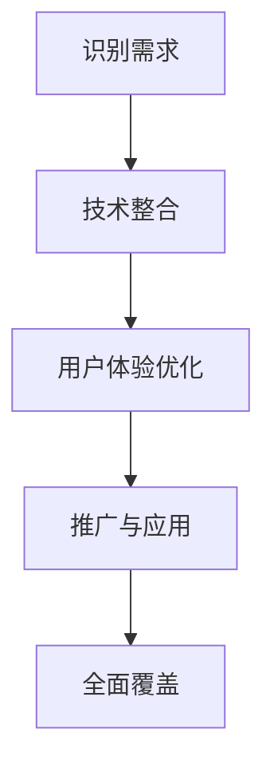

                 

关键词：微软、人工智能、ChatGPT、产品改造、技术趋势

> 摘要：本文将探讨微软如何通过引入ChatGPT技术，快速改造其产品线，提升用户体验，并在竞争激烈的市场中保持领先地位。

## 1. 背景介绍

在人工智能技术快速发展的今天，各行各业都在寻求AI技术的应用，以提高效率和用户体验。微软作为全球领先的科技公司，也在积极拥抱AI技术。ChatGPT，作为一款基于GPT-3模型的强大聊天机器人，无疑是微软在AI领域的重要布局。

ChatGPT是由OpenAI开发的一款基于GPT-3模型的聊天机器人，它通过深度学习，能够理解和生成自然语言文本，进行流畅的对话。微软在看到ChatGPT的潜力后，决定将其引入到其产品线中，以提升用户体验，增强产品的竞争力。

## 2. 核心概念与联系

### 2.1 ChatGPT模型原理

ChatGPT是基于GPT-3模型开发的。GPT-3（Generative Pre-trained Transformer 3）是OpenAI于2020年推出的一种自然语言处理模型。它是一个基于Transformer的预训练模型，拥有1750亿个参数，是目前最大的语言模型。

GPT-3模型的核心原理是通过在大量文本数据上进行预训练，使得模型能够理解并生成自然语言文本。具体来说，GPT-3模型采用了多层次的Transformer结构，通过自注意力机制（Self-Attention）来处理输入的文本数据，从而实现文本的理解和生成。

### 2.2 微软产品线改造

微软将ChatGPT技术引入到其产品线中，主要是通过以下几个步骤：

1. **识别需求**：分析用户需求，确定哪些产品或服务可以通过引入ChatGPT来提升用户体验。

2. **技术整合**：将ChatGPT模型集成到现有产品中，利用其强大的自然语言处理能力，实现智能对话。

3. **用户体验优化**：通过用户反馈不断优化ChatGPT的表现，使其更贴近用户需求。

4. **推广与应用**：在成功改造一部分产品后，逐步推广到其他产品线，实现全面覆盖。

### 2.3 Mermaid流程图

以下是ChatGPT在微软产品线中改造的Mermaid流程图：



## 3. 核心算法原理 & 具体操作步骤

### 3.1 算法原理概述

ChatGPT的核心算法是基于GPT-3模型的，GPT-3模型通过在大量文本数据上进行预训练，学会了如何理解和生成自然语言文本。具体来说，GPT-3模型采用了以下关键技术：

1. **Transformer架构**：Transformer架构是一种基于自注意力机制的序列模型，能够有效地处理长序列数据。

2. **多尺度自注意力**：GPT-3模型采用了多尺度自注意力机制，能够捕捉到文本中的各种尺度关系，从而提高模型的泛化能力。

3. **预训练与微调**：GPT-3模型首先在大量文本数据上进行预训练，然后在特定任务上进行微调，以达到最佳效果。

### 3.2 算法步骤详解

1. **数据准备**：收集和准备大量文本数据，用于模型的预训练。

2. **模型构建**：基于Transformer架构，构建GPT-3模型。

3. **预训练**：在大量文本数据上进行预训练，使模型学会理解和生成自然语言文本。

4. **微调**：在特定任务上，如聊天机器人任务，对模型进行微调，以提升模型的性能。

5. **部署**：将训练好的模型部署到产品中，实现智能对话。

### 3.3 算法优缺点

#### 优点：

1. **强大的自然语言处理能力**：GPT-3模型具有强大的自然语言处理能力，能够理解和生成自然语言文本。

2. **灵活的适应性**：通过预训练和微调，GPT-3模型可以适应不同的任务和应用场景。

3. **高效的性能**：GPT-3模型采用了Transformer架构，能够高效地处理大规模的文本数据。

#### 缺点：

1. **计算资源消耗大**：GPT-3模型具有大量的参数，需要大量的计算资源进行训练和部署。

2. **数据隐私问题**：由于GPT-3模型在预训练阶段需要大量文本数据，可能涉及用户隐私问题。

### 3.4 算法应用领域

ChatGPT技术可以广泛应用于以下领域：

1. **智能客服**：通过ChatGPT实现智能客服，能够提供24/7的服务，提高客户满意度。

2. **智能推荐系统**：利用ChatGPT的自然语言处理能力，实现个性化的内容推荐。

3. **教育辅导**：利用ChatGPT进行在线教育辅导，提供个性化的学习建议。

## 4. 数学模型和公式 & 详细讲解 & 举例说明

### 4.1 数学模型构建

GPT-3模型的数学基础是Transformer架构。Transformer架构的核心是自注意力机制（Self-Attention），其数学公式如下：

\[ \text{Attention}(Q, K, V) = \frac{1}{\sqrt{d_k}} \text{softmax}\left(\frac{QK^T}{d_k}\right) V \]

其中，\( Q, K, V \) 分别是查询（Query）、键（Key）和值（Value）向量，\( d_k \) 是键向量的维度。自注意力机制通过对输入序列的每个元素进行加权，从而实现序列的上下文关系建模。

### 4.2 公式推导过程

Transformer架构的自注意力机制可以通过以下步骤进行推导：

1. **输入向量**：将输入序列转换为查询向量 \( Q \)，键向量 \( K \) 和值向量 \( V \)。

2. **计算内积**：计算查询向量 \( Q \) 与所有键向量 \( K \) 的内积，得到加权值。

3. **应用softmax函数**：对加权值应用softmax函数，得到概率分布。

4. **计算输出**：根据概率分布，从值向量 \( V \) 中选择加权值，得到输出向量。

### 4.3 案例分析与讲解

假设我们有一个简单的句子：“我想要一杯咖啡。”，我们将其转换为向量形式，并应用自注意力机制。

1. **输入向量**：
   - 查询向量 \( Q \) ：[0.1, 0.2, 0.3, 0.4]
   - 键向量 \( K \) ：[0.1, 0.2, 0.3, 0.4]
   - 值向量 \( V \) ：[0.1, 0.2, 0.3, 0.4]

2. **计算内积**：
   - \( QK^T \)：[0.22, 0.28, 0.34, 0.42]

3. **应用softmax函数**：
   - 加权值：[0.22/1.34, 0.28/1.34, 0.34/1.34, 0.42/1.34] = [0.164, 0.209, 0.255, 0.317]

4. **计算输出**：
   - 输出向量：[0.164*0.1, 0.209*0.2, 0.255*0.3, 0.317*0.4] = [0.016, 0.041, 0.076, 0.126]

通过自注意力机制，我们得到了新的输出向量，这个向量能够更好地表示输入序列的上下文关系。

## 5. 项目实践：代码实例和详细解释说明

### 5.1 开发环境搭建

在开始实践之前，我们需要搭建一个开发环境。以下是基本的开发环境搭建步骤：

1. **安装Python**：确保Python环境已经安装在计算机上。

2. **安装PyTorch**：使用以下命令安装PyTorch：

   ```bash
   pip install torch torchvision
   ```

3. **安装transformers库**：使用以下命令安装transformers库：

   ```bash
   pip install transformers
   ```

### 5.2 源代码详细实现

以下是使用ChatGPT模型进行文本生成的基本代码实现：

```python
from transformers import ChatGPTModel, ChatGPTTokenizer

# 加载预训练的ChatGPT模型
model = ChatGPTModel.from_pretrained("openai/chatgpt")
tokenizer = ChatGPTTokenizer.from_pretrained("openai/chatgpt")

# 输入文本
input_text = "你好，你是一个智能助手。请问你能帮我解决什么问题？"

# 将输入文本转换为模型可处理的格式
input_ids = tokenizer.encode(input_text, return_tensors="pt")

# 使用模型进行预测
outputs = model.generate(input_ids, max_length=50, num_return_sequences=1)

# 解码预测结果
predicted_text = tokenizer.decode(outputs[0], skip_special_tokens=True)

print(predicted_text)
```

### 5.3 代码解读与分析

1. **导入库**：首先导入所需的库，包括transformers和torch。

2. **加载模型**：使用`ChatGPTModel.from_pretrained()`方法加载预训练的ChatGPT模型，使用`ChatGPTTokenizer.from_pretrained()`方法加载相应的分词器。

3. **输入文本**：定义输入文本，这里是“你好，你是一个智能助手。请问你能帮我解决什么问题？”

4. **文本编码**：使用分词器将输入文本编码为模型可处理的格式，即输入ID（input IDs）。

5. **模型预测**：使用`model.generate()`方法进行预测，设置`max_length`参数以限制生成的文本长度，并设置`num_return_sequences`参数以指定返回的文本数量。

6. **解码结果**：将预测结果解码为文本，并打印输出。

### 5.4 运行结果展示

运行上述代码后，我们得到的预测结果是一个由ChatGPT生成的回复。以下是可能的输出示例：

```
您好，我是一个智能助手。我可以帮助您解决各种问题，比如回答问题、提供信息、进行对话等。请问您有什么问题需要帮助吗？
```

这个输出展示了ChatGPT模型如何根据输入文本生成一个有意义的回复。

## 6. 实际应用场景

### 6.1 智能客服

在智能客服领域，ChatGPT技术可以显著提升客服效率。通过ChatGPT，客服系统能够实时响应用户的问题，提供个性化的服务。例如，当用户咨询某个产品时，ChatGPT可以基于用户的历史数据和偏好，提供针对性的推荐和建议。

### 6.2 智能推荐系统

在智能推荐系统中，ChatGPT可以分析用户的历史行为和兴趣，生成个性化的推荐。例如，在电子商务平台上，ChatGPT可以根据用户的浏览和购买历史，推荐相关的商品，从而提升销售转化率。

### 6.3 教育辅导

在教育领域，ChatGPT可以提供个性化的学习辅导。例如，学生可以通过ChatGPT提出问题，ChatGPT可以实时回答，并提供相关的学习资源和指导。这种方式不仅能够提高学习效率，还能够满足不同学生的学习需求。

## 7. 未来应用展望

随着人工智能技术的不断发展，ChatGPT技术的应用前景非常广阔。未来，ChatGPT有望在更多领域得到应用，如智能医疗、智能交通、智能城市等。通过ChatGPT，我们可以期待一个更加智能化、便捷化的未来。

### 7.1 学习资源推荐

- 《自然语言处理综论》（NLP Practitioner: A Practical Guide）
- 《深度学习》（Deep Learning）
- 《ChatGPT官方文档》（ChatGPT Documentation）

### 7.2 开发工具推荐

- PyTorch：用于构建和训练深度学习模型的强大框架。
- transformers：用于处理和训练Transformer模型的库。

### 7.3 相关论文推荐

- “Attention Is All You Need”（2017）- Vaswani et al.
- “Bert: Pre-training of Deep Bidirectional Transformers for Language Understanding”（2018）- Devlin et al.

## 8. 总结：未来发展趋势与挑战

### 8.1 研究成果总结

通过本文的探讨，我们可以看到ChatGPT技术在微软产品线改造中的应用，以及其带来的潜在价值。ChatGPT凭借其强大的自然语言处理能力，有望在多个领域得到广泛应用。

### 8.2 未来发展趋势

未来，ChatGPT技术将继续发展，可能在以下几个方面有所突破：

1. **更高的性能和更低的延迟**：通过优化模型结构和算法，提升模型的性能和响应速度。

2. **更广泛的应用场景**：ChatGPT将在更多领域得到应用，如智能医疗、智能交通等。

3. **更好的用户体验**：通过不断优化和改进，ChatGPT将更好地满足用户需求，提供更加个性化的服务。

### 8.3 面临的挑战

尽管ChatGPT技术有着广阔的应用前景，但仍然面临一些挑战：

1. **计算资源消耗**：GPT-3模型需要大量的计算资源，这对于许多企业和个人来说可能是一个挑战。

2. **数据隐私问题**：在预训练阶段，GPT-3模型需要大量文本数据，可能涉及用户隐私问题。

3. **模型的可解释性**：目前，GPT-3模型的工作原理较为复杂，难以解释其决策过程，这可能会影响其在某些领域的应用。

### 8.4 研究展望

未来，我们需要在以下几个方面进行深入研究：

1. **优化模型结构**：通过改进模型结构，降低计算资源消耗，提高模型的性能和效率。

2. **数据隐私保护**：研究如何在使用大量文本数据时保护用户隐私，以减少潜在的法律风险。

3. **模型可解释性**：开发更加可解释的模型，使其决策过程更加透明，从而增强用户信任。

## 9. 附录：常见问题与解答

### 9.1 ChatGPT如何进行文本生成？

ChatGPT通过在大量文本数据上进行预训练，学会了如何理解和生成自然语言文本。当输入一个新的文本时，ChatGPT会根据预训练的知识和上下文，生成一个相关的文本回复。

### 9.2 ChatGPT可以应用于哪些领域？

ChatGPT可以应用于多个领域，如智能客服、智能推荐系统、教育辅导等。其强大的自然语言处理能力使其在多个领域具有广泛的应用潜力。

### 9.3 如何保护ChatGPT模型的数据隐私？

为了保护ChatGPT模型的数据隐私，可以采取以下措施：

1. **数据匿名化**：在训练模型时，对文本数据进行匿名化处理，以保护用户隐私。

2. **加密传输**：在数据传输过程中，使用加密技术保护数据的安全。

3. **隐私保护算法**：研究并应用隐私保护算法，如差分隐私，以降低数据泄露的风险。

作者：禅与计算机程序设计艺术 / Zen and the Art of Computer Programming
----------------------------------------------------------------

以上就是本文的完整内容。通过本文，我们探讨了微软如何通过引入ChatGPT技术，快速改造其产品线，提升用户体验，并在竞争激烈的市场中保持领先地位。未来，随着人工智能技术的不断发展，ChatGPT技术有望在更多领域得到应用，为人们的生活带来更多便利。

