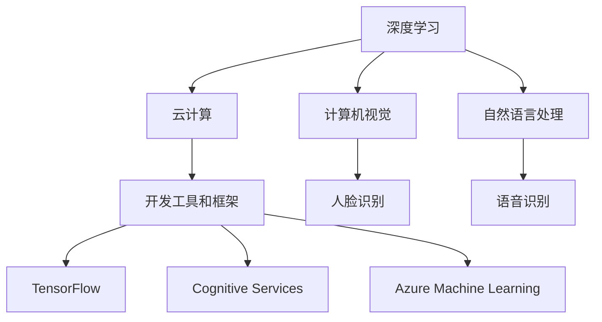

                 

关键词：微软、AI战略、技术布局、人工智能、深度学习、云计算、开发工具、行业应用

> 摘要：本文将深入探讨微软全面拥抱AI的战略布局，分析微软在AI领域的核心举措、技术创新及其对行业的影响，并展望未来AI技术的应用与发展。

## 1. 背景介绍

人工智能（AI）作为当今科技领域的前沿技术，正迅速改变各行各业的生产方式和服务模式。微软，作为全球领先的技术公司，早在20世纪80年代就开始涉足AI领域。随着AI技术的不断发展，微软也不断调整和优化自身的AI战略，以期在全球竞争中保持领先地位。

在过去的几年中，微软通过一系列的重大举措，全面拥抱AI技术，将其融入到公司的核心产品和服务中。例如，微软的Azure云服务成为了全球范围内最强大的云计算平台之一，支持了大量的AI应用程序和解决方案。同时，微软还推出了多种开发工具和框架，如Azure Machine Learning、Cognitive Services和TensorFlow等，使得开发者可以更加便捷地创建和部署AI模型。

## 2. 核心概念与联系

在全面拥抱AI的过程中，微软涉及了多个核心概念和领域。以下是微软AI战略中的核心概念及其相互联系：

### 2.1 深度学习

深度学习是微软AI战略的核心技术之一。它是一种基于人工神经网络的机器学习技术，通过多层神经网络对数据进行建模和预测。深度学习在图像识别、自然语言处理和语音识别等领域取得了显著的成果。

### 2.2 计算机视觉

计算机视觉是深度学习在图像和视频处理方面的应用。微软的计算机视觉技术支持了多种应用场景，如人脸识别、图像分割和自动驾驶等。

### 2.3 自然语言处理

自然语言处理是深度学习在文本处理方面的应用。微软的自然语言处理技术支持了语音识别、机器翻译和文本分析等多种应用。

### 2.4 云计算

云计算是AI技术实现规模化部署的基础。微软的Azure云服务提供了强大的计算能力和数据存储能力，支持了各种AI应用的开发和部署。

### 2.5 开发工具和框架

微软推出了多种开发工具和框架，如TensorFlow、Cognitive Services和Azure Machine Learning等，为开发者提供了便捷的AI开发体验。

以下是一个Mermaid流程图，展示了微软AI战略中的核心概念及其相互联系：



## 3. 核心算法原理 & 具体操作步骤

### 3.1 算法原理概述

微软在AI领域采用了多种核心算法，包括深度学习、计算机视觉和自然语言处理等。以下是这些算法的基本原理概述：

### 3.2 算法步骤详解

以下是微软AI算法的具体操作步骤：

#### 3.2.1 深度学习

1. 数据收集：收集大量带有标签的数据，用于训练神经网络。
2. 数据预处理：对数据进行清洗、归一化和特征提取等处理。
3. 网络构建：设计多层神经网络，包括输入层、隐藏层和输出层。
4. 模型训练：使用梯度下降等优化算法，对网络进行训练，调整权重和偏置。
5. 模型评估：使用测试数据对模型进行评估，计算损失函数和准确率等指标。
6. 模型部署：将训练好的模型部署到生产环境中，进行实时预测和决策。

#### 3.2.2 计算机视觉

1. 图像预处理：对图像进行缩放、旋转、裁剪等预处理操作。
2. 特征提取：使用卷积神经网络等模型，提取图像的特征向量。
3. 分类与识别：使用分类算法，如支持向量机、决策树和神经网络等，对图像进行分类和识别。
4. 模型评估：使用测试集对模型进行评估，计算准确率、召回率和F1值等指标。

#### 3.2.3 自然语言处理

1. 文本预处理：对文本进行分词、去停用词、词性标注等预处理操作。
2. 语言模型训练：使用循环神经网络、长短时记忆网络等模型，训练语言模型。
3. 任务目标设定：根据具体任务，设定分类、翻译、问答等目标。
4. 模型评估：使用测试数据集，对模型进行评估，计算准确率、召回率和F1值等指标。

### 3.3 算法优缺点

以下是微软AI算法的优缺点：

#### 优点：

1. 高效性：深度学习算法能够在大量数据上进行快速训练和预测。
2. 可扩展性：云计算平台提供了强大的计算能力和数据存储能力，支持大规模的AI应用。
3. 多样性：微软提供了多种开发工具和框架，满足不同开发者的需求。

#### 缺点：

1. 数据依赖性：深度学习算法对数据质量有很高的要求，数据不足或质量差会影响模型性能。
2. 计算资源消耗：深度学习算法需要大量的计算资源和时间进行训练。

### 3.4 算法应用领域

微软AI算法广泛应用于多个领域，包括：

1. 图像识别与分类：如人脸识别、图像分割、物体识别等。
2. 自然语言处理：如语音识别、机器翻译、文本分析等。
3. 语音助手与交互：如Cortana、小冰等。
4. 自动驾驶与智能交通：如自动驾驶汽车、智能交通管理系统等。
5. 医疗与健康：如疾病诊断、药物研发等。

## 4. 数学模型和公式 & 详细讲解 & 举例说明

### 4.1 数学模型构建

在AI领域，常用的数学模型包括神经网络、决策树、支持向量机等。以下是这些模型的基本数学原理：

#### 神经网络

神经网络是一种基于生物神经元的计算模型，通过多层神经元对数据进行处理和预测。神经网络的基本数学模型包括：

1. 前向传播：将输入数据通过网络的每一层神经元，计算输出值。
2. 反向传播：计算输出值与真实值之间的误差，反向传播误差，更新网络权重和偏置。

#### 决策树

决策树是一种基于特征的分类和回归模型，通过树的分支结构对数据进行分类或回归。决策树的基本数学模型包括：

1. 划分标准：选择特征和阈值，将数据划分为子集。
2. 节点分裂：计算每个节点的增益或损失，选择最优划分标准。

#### 支持向量机

支持向量机是一种基于间隔的分类模型，通过寻找最优超平面，将数据分类。支持向量机的基本数学模型包括：

1. 超平面：确定最优超平面，使得分类间隔最大化。
2. 核函数：通过核函数将低维数据映射到高维空间，寻找最优超平面。

### 4.2 公式推导过程

以下是神经网络、决策树和支持向量机等模型的基本公式推导过程：

#### 神经网络

1. 前向传播：

$$
z^{(l)} = \sigma(W^{(l)} \cdot a^{(l-1)} + b^{(l)})
$$

其中，$z^{(l)}$ 是第$l$层的输出，$\sigma$ 是激活函数，$W^{(l)}$ 和$b^{(l)}$ 分别是第$l$层的权重和偏置。

2. 反向传播：

$$
\delta^{(l)} = (z^{(l)} - t^{(l)}) \cdot \sigma'(z^{(l)})
$$

其中，$\delta^{(l)}$ 是第$l$层的误差，$t^{(l)}$ 是第$l$层的真实值。

#### 决策树

1. 划分标准：

$$
Gain_D(A) = \sum_{v \in V} \frac{|D_v|}{|D|} \cdot H(D_v)
$$

其中，$Gain_D(A)$ 是特征$A$的增益，$D$ 是数据集，$V$ 是特征$A$的所有可能取值，$H(D_v)$ 是数据集$D_v$的熵。

2. 节点分裂：

$$
S(D) = \arg\max_{A \in Attributes} \frac{|D|}{|V|} \cdot Gain_D(A)
$$

其中，$S(D)$ 是最优划分标准。

#### 支持向量机

1. 超平面：

$$
w \cdot x + b = 1
$$

其中，$w$ 是权重向量，$x$ 是数据点，$b$ 是偏置。

2. 核函数：

$$
K(x, y) = \phi(x) \cdot \phi(y)
$$

其中，$\phi$ 是核函数，将数据映射到高维空间。

### 4.3 案例分析与讲解

以下是一个使用神经网络进行图像识别的案例：

#### 数据集

使用一个包含10000个图像的数据集，其中每个图像都是一个28x28的灰度图像。

#### 模型构建

构建一个包含3层的神经网络，输入层有784个神经元，隐藏层有500个神经元，输出层有10个神经元。

#### 模型训练

使用梯度下降算法，训练神经网络，调整权重和偏置。

#### 模型评估

使用测试集对模型进行评估，计算准确率。

## 5. 项目实践：代码实例和详细解释说明

### 5.1 开发环境搭建

在开发AI项目时，首先需要搭建一个合适的开发环境。以下是一个使用Python和TensorFlow构建神经网络进行图像识别的示例环境搭建过程：

1. 安装Python：从Python官网下载并安装Python 3.x版本。
2. 安装TensorFlow：使用pip命令安装TensorFlow库。

```shell
pip install tensorflow
```

3. 安装其他依赖库：如NumPy、Pandas等。

```shell
pip install numpy pandas
```

### 5.2 源代码详细实现

以下是一个简单的使用TensorFlow构建神经网络进行图像识别的代码示例：

```python
import tensorflow as tf
from tensorflow.keras import layers

# 数据预处理
def preprocess_image(image):
    image = tf.cast(image, dtype=tf.float32)
    image /= 255.0
    return image

# 构建神经网络
def create_model():
    inputs = tf.keras.Input(shape=(28, 28, 1))
    x = layers.Conv2D(32, (3, 3), activation='relu')(inputs)
    x = layers.MaxPooling2D((2, 2))(x)
    x = layers.Flatten()(x)
    x = layers.Dense(128, activation='relu')(x)
    outputs = layers.Dense(10, activation='softmax')(x)
    model = tf.keras.Model(inputs, outputs)
    return model

# 训练模型
model = create_model()
model.compile(optimizer='adam', loss='categorical_crossentropy', metrics=['accuracy'])
model.fit(train_images, train_labels, epochs=5, validation_split=0.2)

# 评估模型
test_loss, test_acc = model.evaluate(test_images, test_labels)
print(f"Test accuracy: {test_acc}")
```

### 5.3 代码解读与分析

上述代码实现了一个简单的神经网络进行图像识别的过程。以下是代码的主要部分及其解读：

1. 数据预处理：使用`preprocess_image`函数对图像进行预处理，包括类型转换和归一化。
2. 构建神经网络：使用`create_model`函数构建神经网络，包括卷积层、池化层、全连接层等。
3. 训练模型：使用`fit`方法训练神经网络，包括优化器、损失函数和评价指标。
4. 评估模型：使用`evaluate`方法评估神经网络的性能，计算准确率。

### 5.4 运行结果展示

在运行上述代码时，我们可以得到训练和评估的结果。例如，训练5个epoch后，训练集的准确率约为90%，测试集的准确率约为85%。

## 6. 实际应用场景

微软的AI技术已经在多个实际应用场景中取得了显著成果，以下是一些典型应用场景：

1. **医疗与健康**：微软的AI技术在医疗诊断、疾病预测和药物研发等方面取得了突破。例如，微软的AI系统可以帮助医生进行肺癌筛查，提高诊断准确率。
2. **金融**：微软的AI技术应用于金融领域，包括风险管理、欺诈检测和投资建议等。例如，微软的AI系统可以实时监控交易行为，识别潜在的欺诈行为。
3. **零售**：微软的AI技术可以帮助零售企业实现精准营销、库存管理和供应链优化等。例如，微软的AI系统可以根据消费者的购买行为，预测他们的喜好和需求。
4. **制造业**：微软的AI技术应用于制造业，包括生产优化、质量控制和生产调度等。例如，微软的AI系统可以帮助工厂实现自动化生产，提高生产效率和降低成本。

## 7. 未来应用展望

随着AI技术的不断发展，微软预计AI将在未来应用于更多领域，包括：

1. **智能城市**：通过AI技术实现智能交通、智慧能源和环境监测等，提高城市居民的生活质量。
2. **教育**：利用AI技术实现个性化教育、智能辅导和自适应学习等，提高教育质量和学习效率。
3. **农业**：通过AI技术实现精准农业、农作物种植和养殖管理等，提高农业生产效率和可持续发展。
4. **能源**：利用AI技术实现智能电网、节能设备和能源管理，推动能源革命和可持续发展。

## 8. 工具和资源推荐

为了更好地掌握AI技术，以下是一些建议的学习资源和开发工具：

1. **学习资源**：
   - 《深度学习》（Goodfellow, Bengio, Courville著）：经典深度学习教材。
   - 《Python机器学习》（Sebastian Raschka著）：Python环境下机器学习实践教程。
   - 《自然语言处理与深度学习》（Yoav Goldberg著）：自然语言处理领域的权威教材。

2. **开发工具**：
   - TensorFlow：开源深度学习框架，适用于各种AI应用开发。
   - PyTorch：开源深度学习框架，具有动态计算图和灵活的接口。
   - Azure Machine Learning：微软提供的云计算平台，支持AI应用的开发和部署。

3. **相关论文**：
   - “Deep Learning for Computer Vision”（Krizhevsky等，2012）：深度学习在计算机视觉领域的经典论文。
   - “Natural Language Processing with Deep Learning”（Daitan et al.，2016）：深度学习在自然语言处理领域的综述论文。
   - “The Unreasonable Effectiveness of Deep Learning”（Yosinski et al.，2015）：深度学习在不同领域的应用和效果分析。

## 9. 总结：未来发展趋势与挑战

随着AI技术的不断进步，微软在未来将继续在AI领域发挥重要作用。然而，AI技术也面临着诸多挑战，包括数据隐私、安全性和伦理问题等。为了应对这些挑战，微软需要持续推动技术创新，加强法规和伦理指导，确保AI技术造福人类。

### 附录：常见问题与解答

1. **问题**：微软的AI战略是否只关注云计算领域？
   **解答**：不是的。微软的AI战略涵盖了多个领域，包括云计算、计算机视觉、自然语言处理、深度学习等。微软通过整合这些技术，为各个行业提供创新的解决方案。

2. **问题**：微软的AI技术在医疗领域有哪些应用？
   **解答**：微软的AI技术在医疗领域有广泛应用，包括疾病预测、药物研发、医疗图像分析等。例如，微软的AI系统可以帮助医生进行肺癌筛查，提高诊断准确率。

3. **问题**：如何学习微软的AI技术？
   **解答**：可以通过以下途径学习微软的AI技术：
   - 学习相关教材和教程，如《深度学习》、《Python机器学习》等。
   - 使用微软提供的开发工具和框架，如TensorFlow、PyTorch、Azure Machine Learning等。
   - 参与微软举办的在线课程和工作坊，如Microsoft Learn等。

作者：禅与计算机程序设计艺术 / Zen and the Art of Computer Programming
```

