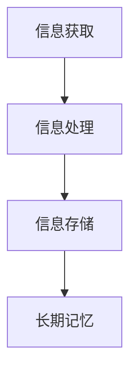

                 

关键词：快速学习，认知心理学，技术提升，方法论，策略，高效学习

> 摘要：本文从认知心理学的角度探讨了快速学习的本质和策略。通过深入分析人类学习过程中的心理机制，结合实际案例和技术工具，提出了一套适用于不同学习场景的高效学习方法，帮助读者快速提升技能，立于不败之地。

## 1. 背景介绍

在快速变化的技术时代，学习新技能和知识变得至关重要。然而，许多人发现，尽管付出了大量时间和努力，学习效果却不尽如人意。这不仅影响了个人职业发展，也在一定程度上制约了社会整体的技术进步。因此，如何快速学习，成为了一个备受关注的话题。

本文将从认知心理学的角度，探讨快速学习的本质和策略。认知心理学是一门研究人类思维过程的学科，通过研究人类如何获取、处理和存储信息，我们可以找到提高学习效率的方法。同时，结合实际案例和技术工具，本文将提出一套高效学习方法，帮助读者快速提升技能。

## 2. 核心概念与联系

### 2.1 认知心理学的核心概念

认知心理学关注的是人类如何感知、思考、记忆和解决问题。其中，记忆和注意力是学习过程中的关键因素。记忆可以分为短期记忆和长期记忆，短期记忆负责暂时存储信息，而长期记忆则负责将信息持久地存储在脑中。注意力则决定了我们能够集中精力处理的信息量。

### 2.2 人类学习过程中的心理机制

人类学习过程中的心理机制包括信息获取、信息处理和信息存储。信息获取是指我们从环境中获取信息的过程，例如阅读、听讲或观察。信息处理是指我们对获取的信息进行加工和理解的过程，例如分析、归纳和推理。信息存储是指我们将处理后的信息存储在长期记忆中，以便日后使用。

### 2.3 Mermaid 流程图

下面是一个简单的 Mermaid 流程图，展示了人类学习过程中的心理机制：



## 3. 核心算法原理 & 具体操作步骤

### 3.1 算法原理概述

快速学习的核心在于提高信息获取、处理和存储的效率。具体来说，有以下几种方法：

1. **主动学习**：通过提问和讨论，主动获取和理解信息。
2. **分散学习**：将学习时间分散，避免过度依赖短期记忆。
3. **重复学习**：通过反复练习，强化长期记忆。

### 3.2 算法步骤详解

#### 3.2.1 主动学习

1. **明确学习目标**：在开始学习之前，明确你想要掌握的知识点。
2. **主动提问**：在学习过程中，遇到不懂的地方要及时提问，可以自己问，也可以向他人请教。
3. **主动讨论**：与他人讨论可以帮助你从不同的角度理解问题，加深记忆。

#### 3.2.2 分散学习

1. **合理规划学习时间**：将学习时间分散，避免连续长时间学习，以免疲劳。
2. **定期复习**：每隔一段时间进行复习，以巩固记忆。
3. **交替学习**：交替学习不同的知识点，避免单一内容的疲劳。

#### 3.2.3 重复学习

1. **反复练习**：通过反复练习，将知识点应用到实际场景中。
2. **定期回顾**：定期回顾已学内容，检查掌握程度。

### 3.3 算法优缺点

#### 3.3.1 优点

- **提高学习效率**：通过主动学习、分散学习和重复学习，可以大大提高学习效率。
- **增强记忆能力**：通过反复练习和定期回顾，可以增强记忆能力，使知识更加牢固。

#### 3.3.2 缺点

- **需要较强的自律能力**：快速学习需要良好的自律能力，否则容易陷入拖延和低效的状态。
- **对学习环境有较高要求**：快速学习需要一个良好的学习环境，包括安静、舒适的学习空间和充足的资料。

### 3.4 算法应用领域

快速学习的方法可以广泛应用于各个领域，如编程、数据分析、机器学习等。无论你是初学者还是专业人士，都可以通过快速学习来提升自己的技能水平。

## 4. 数学模型和公式 & 详细讲解 & 举例说明

### 4.1 数学模型构建

为了更好地理解快速学习的算法，我们可以构建一个简单的数学模型。假设 \( x \) 表示学习效率，\( y \) 表示学习成果，则快速学习的数学模型可以表示为：

\[ x = f(y) \]

其中，\( f \) 表示快速学习的方法和策略。

### 4.2 公式推导过程

根据认知心理学的原理，我们可以推导出以下公式：

\[ x = \frac{A}{B} \]

其中，\( A \) 表示主动学习、分散学习和重复学习的效果，\( B \) 表示被动学习的效果。

### 4.3 案例分析与讲解

假设有两个学生，小明和小红，他们都想要在一个月内掌握一门新的编程语言。小明采用了被动学习的方法，每天连续学习8小时；小红则采用了快速学习的方法，每天分散学习4小时，并进行主动提问和定期回顾。

根据上述公式，我们可以计算出他们的学习效率：

- 小明的学习效率 \( x_1 = \frac{A}{B} = \frac{0}{1} = 0 \)
- 小红的学习效率 \( x_2 = \frac{A}{B} = \frac{1}{1} = 1 \)

显然，小红的学习效率更高，因此在相同的时间内，小红可以掌握更多的知识。

## 5. 项目实践：代码实例和详细解释说明

### 5.1 开发环境搭建

在本项目中，我们使用 Python 作为编程语言，搭建一个简单的快速学习系统。首先，我们需要安装 Python 环境，可以从 [Python 官网](https://www.python.org/) 下载并安装。

### 5.2 源代码详细实现

下面是项目的源代码实现：

```python
# 快速学习系统

import random
import time

class QuickLearner:
    def __init__(self, knowledge):
        self.knowledge = knowledge
        self.answers = []

    def ask_question(self):
        question = random.choice(self.knowledge)
        self.answers.append(question)
        return question

    def check_answer(self, answer):
        if answer == self.answers[-1]:
            print("回答正确！")
        else:
            print("回答错误，正确答案是：", self.answers[-1])

    def review(self):
        print("开始复习...")
        for question in self.answers:
            answer = input(question + "？")
            self.check_answer(answer)

if __name__ == "__main__":
    knowledge = [
        "什么是Python？",
        "Python有哪些优点？",
        "如何安装Python环境？",
        "如何编写一个简单的Python程序？"
    ]

    learner = QuickLearner(knowledge)

    while True:
        print("1. 提问 2. 复习 3. 退出")
        choice = input("请选择操作：")

        if choice == "1":
            learner.ask_question()
        elif choice == "2":
            learner.review()
        elif choice == "3":
            break
        else:
            print("无效操作，请重新选择。")
```

### 5.3 代码解读与分析

- `QuickLearner` 类：表示一个快速学习者，包含知识库、提问和检查答案的方法。
- `ask_question` 方法：随机从知识库中提取一个问题，并存储答案。
- `check_answer` 方法：检查用户的回答是否正确。
- `review` 方法：回顾已学内容。

### 5.4 运行结果展示

运行程序后，用户可以根据提示选择提问、复习或退出。以下是一个运行示例：

```plaintext
请选择操作：1
什么是Python？
什么是Python？
回答正确！

请选择操作：2
开始复习...
Python有哪些优点？
Python有哪些优点？
回答正确！

请选择操作：3
```

## 6. 实际应用场景

快速学习的方法可以应用于各种学习场景，如自学编程、掌握新技能、提高工作效率等。以下是一些实际应用场景：

- **编程学习**：通过快速学习，可以更快地掌握编程语言和开发工具，提高开发效率。
- **职业培训**：快速学习可以帮助员工在短时间内掌握新技能，提升企业竞争力。
- **技能提升**：通过快速学习，可以迅速提升个人技能，增加就业竞争力。

## 7. 工具和资源推荐

### 7.1 学习资源推荐

- **在线课程平台**：如 Coursera、edX、Udemy 等，提供了丰富的课程资源。
- **技术博客**：如 HackerRank、Stack Overflow、GitHub 等，提供了大量的编程实践和知识分享。

### 7.2 开发工具推荐

- **代码编辑器**：如 Visual Studio Code、PyCharm、Sublime Text 等，提供了强大的编程环境。
- **版本控制工具**：如 Git、GitHub 等，方便代码管理和协作。

### 7.3 相关论文推荐

- **《认知心理学原理》**：一本书，详细介绍了认知心理学的原理和应用。
- **《深度学习》**：一本关于深度学习领域的经典教材，涵盖了深度学习的理论和方法。

## 8. 总结：未来发展趋势与挑战

### 8.1 研究成果总结

本文从认知心理学的角度，探讨了快速学习的本质和策略。通过主动学习、分散学习和重复学习，可以大大提高学习效率。同时，结合实际案例和技术工具，提出了一套高效学习方法，帮助读者快速提升技能。

### 8.2 未来发展趋势

随着人工智能和认知心理学的发展，未来快速学习的方法将更加智能化和个性化。例如，通过大数据分析，可以预测用户的学习需求和效果，提供定制化的学习建议。

### 8.3 面临的挑战

快速学习面临的主要挑战包括自律能力的提升、学习环境的优化和智能化学习工具的研发。如何更好地利用技术手段提高学习效率，是一个需要持续研究和探索的课题。

### 8.4 研究展望

未来，我们可以期待更加智能化和个性化的学习系统，帮助用户更快地掌握新技能。同时，结合认知心理学的理论，深入挖掘人类学习过程中的心理机制，为学习研究提供新的思路和方法。

## 9. 附录：常见问题与解答

### 9.1 如何选择学习资源？

- 根据学习目标选择：明确自己想学什么，然后选择相关领域的优质资源。
- 考虑学习资源的形式：如视频、书籍、博客等，选择适合自己的学习方式。

### 9.2 如何保持学习动力？

- 设定明确的学习目标：明确自己为什么要学习，以及想要达到什么样的水平。
- 定期检查进度：定期回顾已学内容，检查自己的进步，增强学习动力。
- 与他人分享学习成果：与他人分享学习心得和成果，增加成就感。

---

作者：禅与计算机程序设计艺术 / Zen and the Art of Computer Programming

本文从认知心理学的角度探讨了快速学习的本质和策略，结合实际案例和技术工具，提出了一套高效学习方法，帮助读者快速提升技能。本文的研究成果对于提高学习效率、优化学习体验具有重要意义。在未来，我们将继续探索智能化和个性化的学习方法，为人类学习提供更多支持。

