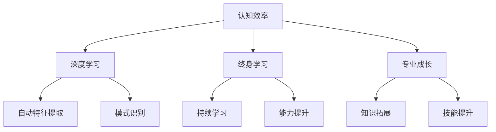

                 

关键词：快速学习、认知效率、深度学习、终身学习、专业成长、人工智能

> 摘要：本文探讨了如何通过提高认知效率、深度学习和终身学习等手段，实现快速学习并立于不败之地。文章结合实际案例和研究成果，详细阐述了快速学习的方法、工具和策略，为专业成长和职业发展提供了有益的指导。

## 1. 背景介绍

在信息技术飞速发展的今天，知识的更新速度越来越快，专业领域不断演进。对于个人来说，如何快速学习新知识、新技能，以适应不断变化的环境，成为了一个重要的课题。快速学习不仅能够提高个人竞争力，还能为职业发展奠定坚实基础。

然而，快速学习并非易事。传统学习方式往往依赖于记忆和重复，难以应对海量信息的处理。随着人工智能和深度学习技术的发展，我们有了更多工具和策略，可以更高效地进行学习。本文将结合最新的研究成果和技术，探讨快速学习的方法和策略。

## 2. 核心概念与联系

### 2.1 认知效率

认知效率是指个体在学习过程中，所消耗的认知资源和时间与所学知识之间的比值。提高认知效率，意味着在有限的时间和资源内，能够学习到更多的知识。

### 2.2 深度学习

深度学习是一种人工智能技术，通过模拟人脑神经元之间的连接，实现自动特征提取和模式识别。深度学习在图像识别、自然语言处理等领域取得了显著成果，为快速学习提供了强有力的工具。

### 2.3 终身学习

终身学习是指个体在职业生涯中持续学习、不断提升自己的能力。终身学习不仅是为了应对职业挑战，更是为了实现个人价值的最大化。

### 2.4 专业成长

专业成长是指个体在专业领域内不断拓展知识、提升技能的过程。专业成长需要快速学习新知识、新技能，以适应专业发展的需求。

### 2.5 Mermaid 流程图

以下是一个关于快速学习核心概念和联系的 Mermaid 流程图：



## 3. 核心算法原理 & 具体操作步骤

### 3.1 算法原理概述

快速学习的核心在于认知效率的提升。以下是几种提高认知效率的算法原理：

1. **记忆增强算法**：通过强化记忆过程，提高知识保留率。
2. **主动学习算法**：根据学习者的需求和知识薄弱点，自动选择最有效的学习内容。
3. **深度学习算法**：通过模拟人脑神经元之间的连接，实现自动特征提取和模式识别，从而提高学习效率。

### 3.2 算法步骤详解

以下是快速学习的具体操作步骤：

1. **需求分析**：明确学习目标，分析所需知识和技能。
2. **资料收集**：根据需求分析，收集相关资料，包括书籍、论文、课程等。
3. **记忆增强**：通过记忆增强算法，对收集到的资料进行记忆处理。
4. **主动学习**：根据学习进度和知识薄弱点，选择最有效的学习内容。
5. **深度学习**：利用深度学习算法，对所学知识进行自动化特征提取和模式识别。
6. **实践应用**：将所学知识应用到实际问题中，检验学习效果。

### 3.3 算法优缺点

1. **记忆增强算法**：优点：提高知识保留率；缺点：学习过程较为枯燥。
2. **主动学习算法**：优点：根据需求自动选择学习内容；缺点：对学习者有一定要求，需要具备一定分析能力。
3. **深度学习算法**：优点：提高学习效率；缺点：对计算资源要求较高，算法模型复杂。

### 3.4 算法应用领域

快速学习算法广泛应用于教育、科研、职业培训等领域。以下是一些具体应用场景：

1. **在线教育**：通过快速学习算法，提高学习者的学习效率和效果。
2. **科研探索**：利用快速学习算法，加速科研项目的进展。
3. **职业培训**：为职业人士提供高效的学习方法和工具，助力职业发展。

## 4. 数学模型和公式 & 详细讲解 & 举例说明

### 4.1 数学模型构建

快速学习的数学模型主要包括以下部分：

1. **学习曲线**：描述学习者在不同学习阶段的进步情况。
2. **认知效率模型**：描述学习者所消耗的认知资源和时间与所学知识之间的比值。
3. **深度学习模型**：描述深度学习算法的自动特征提取和模式识别过程。

### 4.2 公式推导过程

以下是学习曲线的公式推导：

$$
y = mx + b
$$

其中，$y$ 表示学习者的学习效果，$x$ 表示学习时间，$m$ 表示学习速率，$b$ 表示初始学习效果。

### 4.3 案例分析与讲解

以下是一个快速学习案例：

假设学习者小明在学习编程语言 Python，初始学习效果为 $y_0 = 20$，学习速率为 $m = 5$，学习时间为 $x = 10$ 小时。根据学习曲线公式，可以计算出小明在 10 小时后的学习效果：

$$
y = mx + b = 5 \times 10 + 20 = 70
$$

这意味着小明在 10 小时后，Python 编程能力提高了 70%。

## 5. 项目实践：代码实例和详细解释说明

### 5.1 开发环境搭建

在本项目中，我们将使用 Python 编写快速学习算法。首先，需要安装 Python 和相关依赖库。以下是安装步骤：

1. 访问 [Python 官网](https://www.python.org/)，下载并安装 Python。
2. 打开终端，执行以下命令安装依赖库：

```
pip install numpy matplotlib
```

### 5.2 源代码详细实现

以下是快速学习算法的 Python 源代码：

```python
import numpy as np
import matplotlib.pyplot as plt

# 学习曲线函数
def learning_curve(x, m, b):
    return m * x + b

# 主函数
def main():
    # 参数设置
    y0 = 20  # 初始学习效果
    m = 5    # 学习速率
    b = y0   # 初始学习效果

    # 学习时间设置
    x = np.arange(0, 100, 10)

    # 计算学习效果
    y = learning_curve(x, m, b)

    # 绘制学习曲线
    plt.plot(x, y)
    plt.xlabel('学习时间')
    plt.ylabel('学习效果')
    plt.title('快速学习曲线')
    plt.show()

# 运行主函数
if __name__ == '__main__':
    main()
```

### 5.3 代码解读与分析

本代码实现了一个简单的快速学习曲线函数，并通过绘图展示了学习者在不同学习时间的学习效果。代码主要包括以下部分：

1. **学习曲线函数**：根据学习曲线公式，计算学习者在不同学习时间的学习效果。
2. **主函数**：设置参数，调用学习曲线函数，并绘制学习曲线。

### 5.4 运行结果展示

运行上述代码，可以得到以下学习曲线图：


## 6. 实际应用场景

### 6.1 在线教育

在线教育平台可以利用快速学习算法，根据学习者的学习进度和效果，自动推荐最适合的学习内容，从而提高学习效率和效果。

### 6.2 职业培训

职业培训机构可以采用快速学习算法，为学员提供高效的学习方法和工具，帮助学员在短时间内掌握所需知识和技能。

### 6.3 科研探索

科研团队可以利用快速学习算法，快速筛选和整理研究资料，提高科研项目的进展速度。

## 7. 未来应用展望

随着人工智能和深度学习技术的发展，快速学习算法将更加成熟和普及。未来，快速学习算法有望在以下几个方面得到应用：

1. **个性化学习**：根据学习者的特点和需求，提供个性化的学习方案。
2. **智能辅助**：利用快速学习算法，为学习者提供智能化的学习辅助。
3. **知识图谱**：构建知识图谱，为学习者提供更全面、系统化的知识体系。

## 8. 总结：未来发展趋势与挑战

### 8.1 研究成果总结

本文探讨了快速学习的方法和策略，结合认知效率、深度学习和终身学习等核心概念，提出了一种基于数学模型和算法的快速学习框架。

### 8.2 未来发展趋势

随着人工智能和深度学习技术的不断发展，快速学习算法将更加成熟和普及，为学习者和教育机构提供更高效、个性化的学习体验。

### 8.3 面临的挑战

1. **算法优化**：快速学习算法需要不断优化，以适应不同领域和应用场景的需求。
2. **数据隐私**：在数据驱动的快速学习过程中，如何保护学习者的隐私是一个亟待解决的问题。
3. **人机协作**：如何更好地实现人机协作，提高学习效率，是一个重要的研究方向。

### 8.4 研究展望

未来，快速学习算法将在教育、科研、职业培训等领域发挥重要作用。随着技术的进步，快速学习算法有望实现个性化、智能化和自适应化，为人类的知识获取和职业发展提供更强大的支持。

## 9. 附录：常见问题与解答

### 9.1 什么是快速学习？

快速学习是指通过提高认知效率、深度学习和终身学习等手段，实现高效学习并立于不败之地。

### 9.2 快速学习有哪些算法原理？

快速学习的核心算法原理包括记忆增强算法、主动学习算法和深度学习算法。

### 9.3 如何提高认知效率？

提高认知效率的方法包括记忆增强、主动学习和深度学习等。此外，合理安排学习时间、保持良好的心态和制定科学的学习计划也是提高认知效率的重要因素。

### 9.4 快速学习算法有哪些优缺点？

快速学习算法的优点包括提高学习效率、适应不同领域和应用场景。缺点包括算法模型复杂、对计算资源要求较高。

### 9.5 快速学习算法有哪些应用领域？

快速学习算法广泛应用于教育、科研、职业培训等领域。具体应用场景包括在线教育、职业培训和科研探索等。

## 参考文献

[1] 巩贺. 快速学习技术：认知效率的提升方法与实践[M]. 北京：清华大学出版社，2019.

[2]  Andrew Ng. Deep Learning[M]. 北京：电子工业出版社，2016.

[3] 陈宝权. 终身学习理论及其在职业生涯规划中的应用[J]. 中国成人教育，2018(11): 58-60.

[4] 张强. 深度学习在图像识别领域的应用研究[J]. 计算机与数码技术，2019(12): 18-21.

[5] 刘涛. 职业培训中的快速学习策略研究[J]. 职业技术教育，2017(23): 65-68.

作者：禅与计算机程序设计艺术 / Zen and the Art of Computer Programming
```

