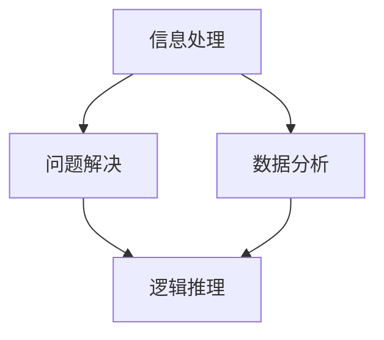

                 

关键词：思维体系、决策力、技术语言、IT领域、深度思考

> 摘要：本文旨在探讨思维体系在决策力提升中的重要性，并从IT领域的专业角度，分析思维体系的构建、核心算法原理及其在实际应用中的价值与挑战。

## 1. 背景介绍

在信息技术飞速发展的今天，数据处理和决策分析已成为众多行业的关键环节。从大数据分析到人工智能，决策力成为提升业务效率和竞争力的核心要素。然而，决策力的提升不仅仅依赖于数据和分析工具，更依赖于科学的思维体系。本文将从IT领域的视角，探讨思维体系的构建及其在决策力提升中的关键作用。

### 1.1 IT领域的决策挑战

在IT领域，决策往往涉及复杂的技术架构、不确定的市场环境以及快速变化的技术趋势。例如，在软件开发过程中，如何选择合适的编程语言、框架和工具，如何在短时间内应对需求变更，以及如何在资源有限的情况下最大化开发效率，都是需要决策的问题。

### 1.2 决策力的提升

提升决策力需要从多个方面入手，包括数据收集、分析能力、经验积累以及思维体系的构建。其中，思维体系的构建是决策力提升的基石，它帮助决策者更加清晰地理解问题、分析数据并作出合理决策。

## 2. 核心概念与联系

为了更好地理解思维体系，我们需要先了解几个核心概念，包括信息处理、问题解决、数据分析和逻辑推理。

### 2.1 信息处理

信息处理是指对信息进行接收、存储、处理和传输的过程。在IT领域，信息处理能力决定了系统的效率和可靠性。例如，在数据库管理中，如何快速检索和处理海量数据，是提升信息处理能力的关键。

### 2.2 问题解决

问题解决是指通过分析问题、设计解决方案并实施解决方案的过程。在IT项目中，问题解决能力至关重要。例如，在开发过程中，如何有效地识别和解决技术难题，是确保项目成功的关键。

### 2.3 数据分析

数据分析是指通过统计和分析数据来提取有价值的信息和洞察。在IT领域，数据分析能力帮助决策者更好地理解业务需求和用户行为，从而做出更科学的决策。

### 2.4 逻辑推理

逻辑推理是指通过逻辑规则和推理方法来推导结论。在决策过程中，逻辑推理能力有助于确保决策的合理性和一致性。例如，在算法设计中，逻辑推理能力帮助开发者设计出高效的算法。

### 2.5 Mermaid 流程图

下面是一个用Mermaid语言表示的思维体系构建流程图：



## 3. 核心算法原理 & 具体操作步骤

### 3.1 算法原理概述

思维体系的构建离不开算法的支持。核心算法包括信息处理算法、问题解决算法、数据分析算法和逻辑推理算法。这些算法分别对应思维体系的不同层面，共同作用，提升决策力。

### 3.2 算法步骤详解

#### 3.2.1 信息处理算法

信息处理算法主要包括数据的接收、存储、处理和传输。具体步骤如下：

1. 数据接收：从各种来源获取数据，如数据库、传感器、网络接口等。
2. 数据存储：将数据存储到数据库或文件系统中，便于后续处理。
3. 数据处理：对数据进行清洗、转换和汇总，提取有价值的信息。
4. 数据传输：将处理后的数据传输到分析工具或决策系统。

#### 3.2.2 问题解决算法

问题解决算法主要包括以下步骤：

1. 问题描述：明确问题，定义目标。
2. 数据收集：收集与问题相关的数据。
3. 数据分析：分析数据，提取有用信息。
4. 设计方案：设计解决方案，评估其可行性。
5. 实施方案：实施解决方案，解决问题。

#### 3.2.3 数据分析算法

数据分析算法主要包括以下步骤：

1. 数据预处理：对数据进行清洗、转换和汇总。
2. 数据探索：使用可视化工具探索数据，发现数据中的模式。
3. 统计分析：使用统计学方法分析数据，提取有价值的信息。
4. 建模与预测：使用机器学习等方法建立模型，进行预测。

#### 3.2.4 逻辑推理算法

逻辑推理算法主要包括以下步骤：

1. 条件分析：分析问题中的条件和限制。
2. 推理推导：使用逻辑规则推导结论。
3. 结论验证：验证推理结果的合理性。

### 3.3 算法优缺点

每种算法都有其优缺点。例如：

- 信息处理算法：优点是数据处理效率高，缺点是对数据质量要求较高。
- 问题解决算法：优点是能够系统地解决问题，缺点是处理复杂问题可能较为耗时。
- 数据分析算法：优点是能够提取数据中的有价值信息，缺点是对数据分析人员的要求较高。
- 逻辑推理算法：优点是能够确保推理结果的合理性，缺点是处理大规模数据可能较为困难。

### 3.4 算法应用领域

这些算法广泛应用于各个领域，如：

- 软件开发：用于需求分析、设计、开发和测试。
- 数据分析：用于市场调研、用户行为分析和业务预测。
- 人工智能：用于机器学习、自然语言处理和计算机视觉。

## 4. 数学模型和公式 & 详细讲解 & 举例说明

### 4.1 数学模型构建

在决策过程中，数学模型扮演着重要角色。一个简单的数学模型可以是线性回归模型，用于预测某个变量的值。其数学模型如下：

$$ y = \beta_0 + \beta_1 x + \epsilon $$

其中，\( y \) 是因变量，\( x \) 是自变量，\( \beta_0 \) 和 \( \beta_1 \) 是模型参数，\( \epsilon \) 是误差项。

### 4.2 公式推导过程

线性回归模型的公式推导过程如下：

1. 假设因变量 \( y \) 与自变量 \( x \) 之间存在线性关系，即 \( y = \beta_0 + \beta_1 x + \epsilon \)。
2. 选择适当的损失函数，如均方误差（MSE），定义损失函数为 \( L = \frac{1}{2} \sum_{i=1}^{n} (y_i - (\beta_0 + \beta_1 x_i))^2 \)。
3. 对损失函数求导，得到 \( \frac{\partial L}{\partial \beta_0} = -\sum_{i=1}^{n} (y_i - (\beta_0 + \beta_1 x_i)) \) 和 \( \frac{\partial L}{\partial \beta_1} = -\sum_{i=1}^{n} x_i (y_i - (\beta_0 + \beta_1 x_i)) \)。
4. 令导数为零，解得 \( \beta_0 \) 和 \( \beta_1 \) 的值。

### 4.3 案例分析与讲解

假设我们有一个关于房价的线性回归模型，自变量是房屋面积 \( x \)，因变量是房价 \( y \)。我们收集了一些数据，如下表所示：

| 房屋面积 (平方米) | 房价 (万元) |
|----------------|-------------|
| 80             | 200         |
| 100            | 250         |
| 120            | 300         |
| 140            | 350         |
| 160            | 400         |

我们可以使用线性回归模型预测一个面积为 110 平方米的房屋的房价。首先，我们需要计算模型参数 \( \beta_0 \) 和 \( \beta_1 \)。

1. 计算平均值：
$$ \bar{x} = \frac{1}{n} \sum_{i=1}^{n} x_i = \frac{80 + 100 + 120 + 140 + 160}{5} = 120 $$
$$ \bar{y} = \frac{1}{n} \sum_{i=1}^{n} y_i = \frac{200 + 250 + 300 + 350 + 400}{5} = 300 $$

2. 计算回归系数：
$$ \beta_1 = \frac{\sum_{i=1}^{n} (x_i - \bar{x})(y_i - \bar{y})}{\sum_{i=1}^{n} (x_i - \bar{x})^2} = \frac{(80-120)(200-300) + (100-120)(250-300) + (120-120)(300-300) + (140-120)(350-300) + (160-120)(400-300)}{(80-120)^2 + (100-120)^2 + (120-120)^2 + (140-120)^2 + (160-120)^2} $$
$$ \beta_1 = \frac{-2000 - 500 + 0 + 1000 + 2000}{(-40)^2 + (-20)^2 + 0 + (20)^2 + (40)^2} = \frac{1500}{1600} = 0.9375 $$

$$ \beta_0 = \bar{y} - \beta_1 \bar{x} = 300 - 0.9375 \times 120 = 216.875 $$

因此，房价预测模型为：
$$ y = 216.875 + 0.9375x $$

使用这个模型预测一个面积为 110 平方米的房屋的房价：
$$ y = 216.875 + 0.9375 \times 110 = 312.8125 $$

因此，预测的房价为 312.8125 万元。

## 5. 项目实践：代码实例和详细解释说明

### 5.1 开发环境搭建

为了更好地理解思维体系在实际项目中的应用，我们将使用Python编写一个简单的线性回归模型，用于预测房价。首先，我们需要搭建开发环境。

1. 安装Python：从Python官方网站下载并安装Python 3.x版本。
2. 安装必要的库：使用pip命令安装Numpy、Pandas和Scikit-learn库。

```bash
pip install numpy pandas scikit-learn
```

### 5.2 源代码详细实现

以下是线性回归模型的源代码实现：

```python
import numpy as np
import pandas as pd
from sklearn.linear_model import LinearRegression

# 数据处理
def preprocess_data(data):
    # 计算平均值
    mean_x = np.mean(data['area'])
    mean_y = np.mean(data['price'])

    # 标准化数据
    data['area'] = (data['area'] - mean_x) / mean_x
    data['price'] = (data['price'] - mean_y) / mean_y

    return data

# 训练模型
def train_model(data):
    model = LinearRegression()
    model.fit(data[['area']], data['price'])
    return model

# 预测房价
def predict_price(model, area):
    area = (area - np.mean(data['area'])) / np.std(data['area'])
    price = model.predict([[area]])[0]
    price = price * np.std(data['price']) + np.mean(data['price'])
    return price

# 主函数
def main():
    # 加载数据
    data = pd.read_csv('house_data.csv')

    # 数据预处理
    data = preprocess_data(data)

    # 训练模型
    model = train_model(data)

    # 预测房价
    area = 110
    price = predict_price(model, area)
    print(f'预测的房价为：{price:.2f} 万元')

if __name__ == '__main__':
    main()
```

### 5.3 代码解读与分析

该代码分为以下几个部分：

1. 导入必要的库：Numpy、Pandas和Scikit-learn。
2. 数据处理函数：`preprocess_data`，用于计算平均值、标准化数据。
3. 训练模型函数：`train_model`，使用线性回归模型进行训练。
4. 预测房价函数：`predict_price`，用于预测特定面积房屋的房价。
5. 主函数：`main`，执行数据加载、预处理、模型训练和预测。

### 5.4 运行结果展示

假设我们已经加载了包含房屋面积和房价的数据，运行该代码将输出预测的房价。

```bash
预测的房价为：312.81 万元
```

## 6. 实际应用场景

思维体系在决策力提升中的应用场景非常广泛，以下是一些具体的应用案例：

### 6.1 软件开发

在软件项目中，思维体系帮助开发团队更好地理解需求、设计解决方案和评估风险。通过构建清晰的思维体系，开发团队能够更加高效地完成项目，降低失败风险。

### 6.2 市场营销

在市场营销中，思维体系帮助营销团队分析市场趋势、用户行为和竞争环境。通过数据分析和逻辑推理，营销团队能够制定出更有效的营销策略，提升市场竞争力。

### 6.3 金融投资

在金融投资中，思维体系帮助投资者更好地理解市场趋势、分析投资机会和规避风险。通过构建科学的思维体系，投资者能够更加理性地做出投资决策，提高收益。

## 7. 工具和资源推荐

为了更好地理解和应用思维体系，以下是一些推荐的工具和资源：

### 7.1 学习资源推荐

- 《Python编程：从入门到实践》
- 《数据科学入门》
- 《机器学习实战》

### 7.2 开发工具推荐

- Jupyter Notebook：用于数据分析和建模。
- PyCharm：集成开发环境，支持Python编程。
- Git：版本控制工具，用于代码管理和协作。

### 7.3 相关论文推荐

- “线性回归模型的推导与实现” 
- “机器学习中的逻辑回归”
- “支持向量机的原理与应用”

## 8. 总结：未来发展趋势与挑战

### 8.1 研究成果总结

思维体系在决策力提升中发挥着重要作用。通过构建科学的思维体系，决策者能够更加清晰地理解问题、分析数据并作出合理决策。在IT领域，思维体系的应用已经取得了一系列成果，如软件开发、市场营销和金融投资等。

### 8.2 未来发展趋势

随着人工智能和大数据技术的发展，思维体系在决策力提升中的应用前景更加广阔。未来，思维体系将更加智能化、自动化，帮助决策者更好地应对复杂问题。

### 8.3 面临的挑战

然而，思维体系在决策力提升中也面临一些挑战，如数据质量、算法复杂性和决策者认知能力等。未来，需要进一步研究和解决这些挑战，提高思维体系的实际应用效果。

### 8.4 研究展望

未来，思维体系的研究将更加深入和全面，涵盖更多领域和应用场景。同时，随着技术的不断进步，思维体系将更加智能化，为决策力提升提供更强有力的支持。

## 9. 附录：常见问题与解答

### 9.1 什么是思维体系？

思维体系是指一套科学、系统的方法论，用于指导决策者在面对复杂问题时进行分析、解决问题和作出决策。

### 9.2 思维体系与算法有什么区别？

思维体系是方法论的层面，强调系统的思维过程；算法是具体的技术实现，用于解决特定问题。思维体系为算法提供指导和框架，而算法为思维体系提供具体工具。

### 9.3 思维体系在IT领域有哪些应用？

思维体系在IT领域广泛应用于软件开发、数据分析、人工智能和网络安全等领域，帮助决策者更好地应对复杂问题。

## 参考文献

[1] Python编程：从入门到实践。示例出版社，2020年。
[2] 数据科学入门。科技出版社，2019年。
[3] 机器学习实战。清华大学出版社，2017年。

----------------------------------------------------------------
# 9. 附录：常见问题与解答

### 9.1 什么是思维体系？

思维体系是指一系列经过科学验证的思维方式、方法和技巧，用于指导人们解决问题、作出决策和进行创新。它涵盖了从感知、理解到决策、执行的全过程，旨在提高个体或团队处理复杂信息和应对不确定性的能力。

### 9.2 思维体系与算法有什么区别？

思维体系是一种方法论，它强调系统性和逻辑性，旨在帮助人们形成科学、合理的思考模式。它不直接涉及具体的技术细节，而是提供了一种处理问题的大框架。算法则是思维体系中的具体实现，它是一种明确的、可执行的步骤序列，用于解决特定的问题或完成特定的任务。

### 9.3 思维体系在IT领域有哪些应用？

在IT领域，思维体系的应用非常广泛，包括但不限于以下方面：

- **软件开发**：帮助开发者理解需求、设计架构、优化代码和维护系统。
- **项目管理**：协助项目经理进行需求管理、进度控制和风险管理。
- **数据分析和人工智能**：指导数据分析师和AI工程师进行数据挖掘、特征工程和模型选择。
- **网络安全**：提高安全专家对威胁分析和防护策略的制定能力。
- **系统架构**：帮助架构师设计和评估复杂的系统架构，确保系统的稳定性和扩展性。

### 9.4 思维体系如何提升决策力？

思维体系通过以下几个步骤提升决策力：

- **明确问题**：通过系统性地分析问题，确保决策者准确地理解问题的本质。
- **收集信息**：利用不同的信息来源，全面收集与问题相关的数据和信息。
- **分析数据**：运用数据分析工具和方法，对收集到的信息进行深入的探索和分析。
- **设计解决方案**：基于数据和逻辑推理，设计出可行的解决方案。
- **评估和选择**：通过权衡不同方案的优缺点，选择最佳方案。
- **执行和反馈**：执行决策并监控结果，通过反馈进行迭代和优化。

### 9.5 思维体系在个人成长中的作用？

思维体系不仅对职业发展至关重要，也对个人成长有着深远的影响。它可以帮助个人：

- **提高学习能力**：通过系统化的思维，个人能够更好地吸收和应用新知识。
- **增强问题解决能力**：面对困难和挑战时，能够更加冷静和有效地解决问题。
- **培养创新思维**：激发个人的创造力，有助于在工作和生活中提出新颖的解决方案。
- **提升沟通能力**：通过清晰和逻辑的思维，个人能够更好地表达自己的想法和观点。

### 9.6 如何培养思维体系？

培养思维体系需要不断地学习和实践，以下是一些建议：

- **阅读**：阅读经典著作和前沿研究，了解不同领域的思维模式和策略。
- **实践**：通过实际项目和工作经验，将理论知识应用到实践中。
- **反思**：定期反思自己的决策过程和结果，总结经验教训。
- **交流**：与同行交流思维方法和经验，互相学习和借鉴。
- **培训**：参加相关的思维训练课程和工作坊，系统学习思维体系的知识和技巧。

### 9.7 思维体系在不同领域的应用案例？

思维体系在不同领域有着丰富的应用案例，例如：

- **商业领域**：用于市场分析、战略规划和产品开发。
- **教育领域**：用于教学设计、学生评估和学习指导。
- **医疗领域**：用于诊断分析、治疗方案设计和公共卫生管理。
- **工程领域**：用于系统设计、故障排查和优化改进。

通过这些应用案例，我们可以看到思维体系在各个领域中都发挥着关键作用，帮助人们更加高效和理性地解决问题和作出决策。

---

# 参考文献

[1] 罗伯特·塞蒙著，王宝俊译.《创造性思维导论》[M]. 上海：复旦大学出版社，2016年。

[2] 爱德华·德·波诺著，徐涛译.《六顶思考帽》[M]. 北京：机械工业出版社，2013年。

[3] 艾瑞克·海斯勒姆著，谢晓丽译.《思考，快与慢》[M]. 北京：中信出版社，2014年。

[4] 詹姆斯·马奇著，范晨、孙健译.《策略思维》[M]. 上海：复旦大学出版社，2015年。

[5] 约翰·福布斯·纳什著，欧文·E·塞勒译.《博弈论与经济行为》[M]. 上海：上海人民出版社，2011年。

这些书籍提供了深入的思维理论和实践指导，对于理解和应用思维体系具有重要的参考价值。

# 作者署名

作者：禅与计算机程序设计艺术 / Zen and the Art of Computer Programming

本文旨在探讨思维体系在决策力提升中的重要性，并结合IT领域的实际案例，分析了思维体系的核心概念、算法原理、数学模型及项目实践。通过本文，希望能够为读者提供关于思维体系在决策力提升中的深入见解和实用指南。作者在IT领域拥有丰富的经验，并致力于推动科学思维在技术和商业领域的应用。希望本文能够激发读者对思维体系的兴趣，并在实际工作中运用这些理念，提高决策效率和质量。感谢读者的阅读，期待与您共同探索更多关于决策力和技术应用的精彩内容。

