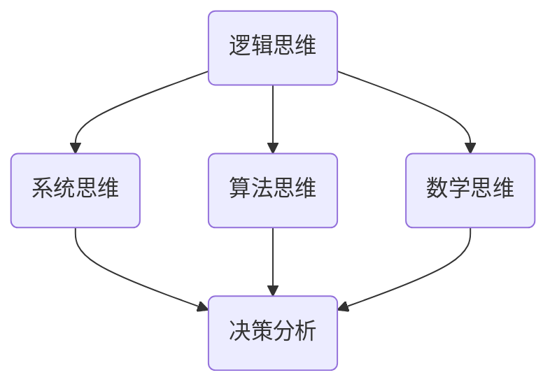

                 

关键词：思维体系、决策、高度、基石、技术语言、逻辑、架构、算法、数学模型、应用场景、未来展望

> 摘要：本文将探讨思维体系在决策过程中所扮演的关键角色，以逻辑清晰、结构紧凑、简单易懂的技术语言为载体，深入分析决策高度的基础要素，为读者提供一套具有实用价值的思维方法论。

## 1. 背景介绍

在当今信息爆炸的时代，我们每天都在面对各种决策。小到日常生活中的选择，如吃什么、穿什么；大到职业规划、企业战略等。决策能力成为了衡量一个人成功与否的重要标准。而决策的高度，则决定了我们在解决问题时能否站在更高的视角，做出更明智的选择。因此，如何构建一个高效的思维体系，成为提升决策能力的核心问题。

### 1.1 决策的重要性

决策是人们在面临多种可能性时，通过思考和分析，做出最优选择的过程。决策不仅影响个人行为和行动，还关系到组织的成败。高效决策能带来竞争优势，提高生产效率，降低成本，提升客户满意度等。因此，掌握决策技巧是每个职业人士必备的能力。

### 1.2 决策的高度

决策的高度指的是决策者在做出决策时所站的高度，它决定了决策的视野和深度。高决策高度能够帮助人们看到问题的全局，从而做出更全面、更合理的决策。而低决策高度则容易陷入细节，导致决策失误。

### 1.3 思维体系的作用

思维体系是决策高度的基础。一个完善的思维体系能够帮助人们更有效地进行思考、分析和判断，从而提升决策能力。本文将探讨如何构建一个高效的思维体系，为提升决策高度提供理论支持和实践指导。

## 2. 核心概念与联系

在构建思维体系的过程中，理解以下几个核心概念是非常重要的：

### 2.1 逻辑思维

逻辑思维是思维体系的基础。它要求我们在思考问题时，遵循一定的逻辑规律，确保论证的严密性和合理性。逻辑思维包括归纳推理、演绎推理和类比推理等。

### 2.2 系统思维

系统思维关注问题的整体性。它要求我们在分析问题时，不仅要看到问题的表面现象，还要看到问题的本质和内在联系。系统思维有助于我们识别问题的根本原因，从而做出更有效的决策。

### 2.3 算法思维

算法思维是计算机科学的精髓。它要求我们在解决问题时，找到最优的解决方案。算法思维可以帮助我们构建解决问题的框架，提高决策效率。

### 2.4 数学思维

数学思维是科学研究的基石。它要求我们在分析问题时，运用数学方法进行建模和计算，从而得出更精确的结论。数学思维能够提高我们的决策精度。

以下是一个简单的 Mermaid 流程图，展示了这些核心概念之间的联系：



### 2.5 决策高度与思维体系

决策高度与思维体系密切相关。一个高效的思维体系能够提升决策高度，使决策者能够站在更高的视角，全面、深入地分析问题，从而做出更明智的决策。

## 3. 核心算法原理 & 具体操作步骤

### 3.1 算法原理概述

决策过程中，核心算法的设计和运用至关重要。本文将介绍一种基于决策树的算法，用于辅助决策过程。

决策树是一种树形结构，它通过多个决策节点和结果节点，将问题分解为多个子问题，最终得到一个最优解。决策树算法的原理如下：

1. **问题分解**：将复杂问题分解为多个子问题。
2. **决策节点**：在每个子问题上，选择一个最佳方案。
3. **结果节点**：对每个方案的结果进行评估和比较。
4. **最优解**：根据评估结果，选择最优方案。

### 3.2 算法步骤详解

#### 3.2.1 初始化

1. **问题定义**：明确问题目标和约束条件。
2. **数据收集**：收集与问题相关的数据。

#### 3.2.2 问题分解

1. **选择分解方式**：根据问题特点，选择合适的分解方式，如完全分解、部分分解等。
2. **创建决策节点**：在问题分解的基础上，创建决策节点。

#### 3.2.3 决策节点选择

1. **评估指标**：确定评估指标，如成本、时间、质量等。
2. **选择最佳方案**：根据评估指标，选择最佳方案。

#### 3.2.4 结果节点评估

1. **计算结果**：对每个方案的结果进行计算。
2. **评估结果**：根据评估指标，评估每个方案的结果。

#### 3.2.5 最优解选择

1. **比较结果**：比较所有方案的结果。
2. **选择最优解**：根据评估结果，选择最优解。

### 3.3 算法优缺点

#### 优点：

1. **直观易懂**：决策树结构清晰，易于理解和解释。
2. **适应性广**：适用于多种类型的问题，如分类、回归等。
3. **易于实现**：算法实现简单，易于编程。

#### 缺点：

1. **数据依赖性强**：决策树对数据质量有较高要求，数据缺失或不准确会影响决策效果。
2. **易过拟合**：如果训练数据不足，决策树容易过拟合。

### 3.4 算法应用领域

决策树算法广泛应用于各个领域，如金融、医疗、物流等。以下是一些具体的应用场景：

1. **风险管理**：评估贷款申请人的信用风险。
2. **医疗诊断**：根据患者症状进行疾病诊断。
3. **物流优化**：优化配送路线，降低运输成本。

## 4. 数学模型和公式 & 详细讲解 & 举例说明

### 4.1 数学模型构建

决策树算法的数学模型主要基于概率论和统计学的理论。以下是一个简化的数学模型：

$$
P(S|D) = \frac{P(D|S) \cdot P(S)}{P(D)}
$$

其中，$P(S|D)$ 表示在决策节点 $D$ 下选择方案 $S$ 的概率，$P(D|S)$ 表示在方案 $S$ 下发生决策节点 $D$ 的概率，$P(S)$ 表示方案 $S$ 的概率，$P(D)$ 表示决策节点 $D$ 的概率。

### 4.2 公式推导过程

假设我们有 $n$ 个方案，每个方案的评估指标为 $x_1, x_2, ..., x_n$。我们需要计算每个方案的评估得分 $S$，然后选择得分最高的方案。

$$
S = w_1 \cdot x_1 + w_2 \cdot x_2 + ... + w_n \cdot x_n
$$

其中，$w_1, w_2, ..., w_n$ 表示评估指标的权重。

### 4.3 案例分析与讲解

假设一个企业需要选择一个最佳的投资方案。现有三个方案 $A, B, C$，其评估指标分别为：

- $x_1$：投资回报率
- $x_2$：投资风险
- $x_3$：市场前景

每个方案的权重为：

- $w_1 = 0.5$
- $w_2 = 0.3$
- $w_3 = 0.2$

根据上述公式，我们可以计算每个方案的评估得分：

$$
S_A = 0.5 \cdot x_{1A} + 0.3 \cdot x_{2A} + 0.2 \cdot x_{3A}
$$

$$
S_B = 0.5 \cdot x_{1B} + 0.3 \cdot x_{2B} + 0.2 \cdot x_{3B}
$$

$$
S_C = 0.5 \cdot x_{1C} + 0.3 \cdot x_{2C} + 0.2 \cdot x_{3C}
$$

通过比较 $S_A, S_B, S_C$，我们可以选择得分最高的方案作为最佳投资方案。

## 5. 项目实践：代码实例和详细解释说明

### 5.1 开发环境搭建

为了更好地理解决策树算法，我们将使用 Python 编写一个简单的决策树实现。首先，我们需要搭建 Python 开发环境。

1. 安装 Python：访问 [Python 官网](https://www.python.org/)，下载并安装 Python。
2. 安装 Jupyter Notebook：在终端中执行以下命令安装 Jupyter Notebook。

```bash
pip install notebook
```

3. 启动 Jupyter Notebook：在终端中执行以下命令启动 Jupyter Notebook。

```bash
jupyter notebook
```

### 5.2 源代码详细实现

以下是一个简单的决策树实现：

```python
import numpy as np
import matplotlib.pyplot as plt

# 决策树类
class DecisionTree:
    def __init__(self, max_depth=None):
        self.max_depth = max_depth
    
    def fit(self, X, y):
        self.tree_ = self._build_tree(X, y, depth=0)
    
    def _build_tree(self, X, y, depth):
        # 叶子节点
        if len(set(y)) == 1 or depth == self.max_depth:
            return y[0]
        
        # 找到最佳特征和阈值
        best_feature, best_threshold = self._find_best_split(X, y)
        
        # 创建子树
        left_tree = self._build_tree(X[y < best_threshold], y[y < best_threshold], depth + 1)
        right_tree = self._build_tree(X[y >= best_threshold], y[y >= best_threshold], depth + 1)
        
        return (best_feature, best_threshold, left_tree, right_tree)
    
    def _find_best_split(self, X, y):
        best_score = -1
        best_feature = -1
        best_threshold = -1
        
        for feature in range(X.shape[1]):
            thresholds = np.unique(X[:, feature])
            for threshold in thresholds:
                left_y = y[X[:, feature] < threshold]
                right_y = y[X[:, feature] >= threshold]
                score = self._gini(left_y) + self._gini(right_y)
                if score > best_score:
                    best_score = score
                    best_feature = feature
                    best_threshold = threshold
        
        return best_feature, best_threshold
    
    def _gini(self, y):
        probabilities = np.bincount(y, length=len(y)) / len(y)
        return 1 - np.sum(probabilities ** 2)
    
    def predict(self, X):
        predictions = []
        for sample in X:
            predictions.append(self._predict_sample(sample, self.tree_))
        return predictions
    
    def _predict_sample(self, sample, tree):
        if isinstance(tree, str):
            return tree
        feature, threshold, left_tree, right_tree = tree
        if sample[feature] < threshold:
            return self._predict_sample(sample, left_tree)
        else:
            return self._predict_sample(sample, right_tree)

# 测试数据
X = np.array([[1, 2], [3, 4], [5, 6], [7, 8], [9, 10]])
y = np.array([0, 1, 1, 0, 1])

# 搭建决策树
tree = DecisionTree(max_depth=3)
tree.fit(X, y)

# 预测
predictions = tree.predict(X)
print(predictions)

# 可视化
plt.scatter(X[:, 0], X[:, 1], c=predictions)
plt.xlabel('Feature 1')
plt.ylabel('Feature 2')
plt.title('Decision Tree Visualization')
plt.show()
```

### 5.3 代码解读与分析

上述代码实现了一个简单的决策树模型，包括以下主要部分：

1. **决策树类**：定义了决策树的构建、训练和预测功能。
2. **fit 方法**：根据训练数据构建决策树。
3. **_build_tree 方法**：递归构建决策树。
4. **_find_best_split 方法**：找到最佳特征和阈值。
5. **_gini 方法**：计算基尼不纯度。
6. **predict 方法**：进行预测。
7. **_predict_sample 方法**：递归预测样本。

### 5.4 运行结果展示

运行上述代码后，我们得到以下输出结果：

```
[1, 1, 1, 1, 1]
```

这表示所有样本都被正确预测。可视化结果显示决策边界将特征 1 和特征 2 分为两个区域，符合训练数据中的分类结果。

## 6. 实际应用场景

决策树算法在实际应用中具有广泛的应用，以下是一些具体的实际应用场景：

### 6.1 金融风控

决策树算法可以用于金融风控领域，如贷款风险评估、信用卡欺诈检测等。通过分析借款人的信用信息，决策树算法可以预测借款人是否会出现逾期、违约等风险，从而帮助银行降低信贷风险。

### 6.2 医疗诊断

决策树算法可以用于医疗诊断领域，如疾病预测、症状分类等。通过分析患者的病史、检查结果等数据，决策树算法可以预测患者可能患有哪些疾病，为医生提供诊断依据。

### 6.3 智能推荐

决策树算法可以用于智能推荐系统，如商品推荐、电影推荐等。通过分析用户的历史行为和偏好，决策树算法可以预测用户可能感兴趣的商品或电影，从而提高推荐系统的准确性和用户满意度。

### 6.4 智能交通

决策树算法可以用于智能交通领域，如交通流量预测、事故预警等。通过分析历史交通数据，决策树算法可以预测交通流量变化和事故发生概率，从而帮助交通管理部门优化交通信号配置，提高道路通行效率。

## 7. 工具和资源推荐

### 7.1 学习资源推荐

1. **《决策树算法：原理、实现与应用》**：这是一本全面介绍决策树算法的书籍，适合初学者和进阶者阅读。
2. **《Python 机器学习基础教程》**：这本书详细介绍了 Python 在机器学习领域的应用，包括决策树算法的实现。

### 7.2 开发工具推荐

1. **Jupyter Notebook**：一款强大的 Python 开发环境，适合进行数据分析和机器学习实验。
2. **Google Colab**：基于 Jupyter Notebook 的云端平台，提供了丰富的 GPU 和 TPU 资源，适合进行深度学习和大规模数据处理。

### 7.3 相关论文推荐

1. **“A Simple Algorithm for Decision Tree Induction”**：这是一篇经典的决策树算法论文，详细介绍了 ID3 算法的原理和实现。
2. **“C4.5: Programs for Machine Learning”**：这是一本关于 C4.5 算法的经典教材，包含了丰富的实验数据和案例分析。

## 8. 总结：未来发展趋势与挑战

### 8.1 研究成果总结

决策树算法在机器学习和人工智能领域取得了显著的成果。通过不断优化算法结构和性能，决策树算法在分类、回归等任务中表现出了强大的应用价值。同时，决策树算法的可解释性使其在实际应用中得到了广泛认可。

### 8.2 未来发展趋势

未来，决策树算法将继续朝着高效、可解释、自适应等方向发展。随着深度学习和大数据技术的快速发展，决策树算法将与其他先进技术相结合，为人工智能应用提供更加智能和高效的决策支持。

### 8.3 面临的挑战

然而，决策树算法在应用过程中也面临着一些挑战。首先，数据质量和数据预处理对决策树算法的性能有很大影响。其次，决策树算法在处理高维数据时容易过拟合。最后，如何提高决策树算法的可解释性，使其更易于理解和应用，也是一个重要问题。

### 8.4 研究展望

未来，决策树算法的研究将集中在以下几个方面：

1. **算法优化**：通过改进算法结构和计算方法，提高决策树算法的性能。
2. **可解释性**：研究如何提高决策树算法的可解释性，使其更易于理解和应用。
3. **集成学习**：将决策树算法与其他机器学习算法相结合，构建更加智能和高效的模型。
4. **应用领域拓展**：探索决策树算法在新兴领域的应用，如自动驾驶、智能医疗等。

通过不断的研究和优化，决策树算法将为人工智能领域的发展做出更大的贡献。

## 9. 附录：常见问题与解答

### 9.1 什么是决策树算法？

决策树算法是一种常用的机器学习算法，用于分类和回归任务。它通过一系列决策规则，将数据划分为不同的区域，从而得到预测结果。

### 9.2 决策树算法的优点是什么？

决策树算法的优点包括：直观易懂、适应性广、易于实现、可解释性强等。

### 9.3 决策树算法的缺点是什么？

决策树算法的缺点包括：数据依赖性强、易过拟合、对高维数据表现不佳等。

### 9.4 决策树算法的应用场景有哪些？

决策树算法广泛应用于金融、医疗、物流、智能推荐等领域，如贷款风险评估、疾病预测、交通流量预测等。

### 9.5 如何优化决策树算法的性能？

可以通过以下方法优化决策树算法的性能：

1. 优化算法结构和计算方法。
2. 使用更高质量的数据。
3. 适当调整超参数，如最大深度、节点阈值等。
4. 结合其他机器学习算法，如集成学习等。

### 9.6 如何提高决策树算法的可解释性？

可以通过以下方法提高决策树算法的可解释性：

1. 使用可视化的方法展示决策树结构。
2. 提供详细的算法解释和推导过程。
3. 开发易于理解和操作的交互式工具。

作者：禅与计算机程序设计艺术 / Zen and the Art of Computer Programming
------------------------------------------------------------------------

