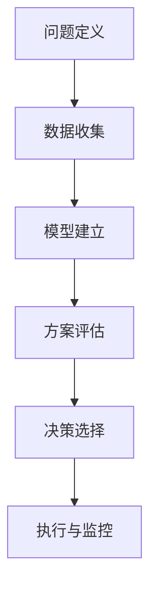

                 

### 文章关键词

人工智能、决策分析、思维模式、算法设计、认知心理学、技术架构、软件开发、计算机编程、系统优化

### 文章摘要

本文探讨了构建高质量决策思维体系的重要性。从认知心理学到计算机编程，从技术架构到系统优化，本文系统地阐述了如何通过多层次、多维度的思维方式和工具，提高决策质量。通过案例分析、数学模型解析和实践指导，读者将了解到如何在复杂的信息环境中做出明智、高效且具有前瞻性的决策。

## 1. 背景介绍

在当今这个信息爆炸、技术迅速发展的时代，决策已经成为个人、企业和组织生存和发展的重要能力。无论是个人日常生活中的决策，还是企业战略层面的决策，都需要在复杂、不确定的环境中进行。然而，现实情况是，人们在面对众多信息时，往往难以做出高质量、有远见的决策。这背后的原因在于，传统思维模式在处理复杂问题时存在诸多局限。

本文旨在提出一种全新的思维体系，帮助读者构建高质量决策的基础。本文将结合认知心理学、计算机科学等领域的理论，探讨如何通过系统的思维方式和工具，提升决策能力。本文分为以下几个部分：

- **背景介绍**：阐述决策的重要性以及当前决策过程中存在的挑战。
- **核心概念与联系**：介绍构建高质量决策思维体系所需的核心概念和架构。
- **核心算法原理 & 具体操作步骤**：讲解决策分析的核心算法，包括原理、步骤和优缺点。
- **数学模型和公式 & 详细讲解 & 举例说明**：深入探讨决策分析中常用的数学模型和公式。
- **项目实践：代码实例和详细解释说明**：通过实际代码示例展示决策分析的应用。
- **实际应用场景**：分析决策分析在不同领域中的应用。
- **工具和资源推荐**：推荐学习和实践决策分析的相关资源和工具。
- **总结：未来发展趋势与挑战**：总结研究成果，展望未来发展趋势和面临的挑战。

## 2. 核心概念与联系

### 2.1 决策分析的定义

决策分析（Decision Analysis）是一种通过系统方法对决策问题进行分析、评估和选择的过程。它涉及多个领域，包括运筹学、统计学、经济学、心理学等。决策分析的核心在于提供一种框架和工具，帮助决策者在复杂、不确定的环境中做出最优或次优的决策。

### 2.2 决策分析的核心概念

在决策分析中，有几个核心概念是不可或缺的：

#### 2.2.1 不确定性（Uncertainty）

不确定性是指决策者面临的信息不完全性。在现实生活中，大多数决策都存在一定的不确定性。如何处理不确定性是决策分析的重要任务。

#### 2.2.2 风险（Risk）

风险是指决策者知道可能的结果，但不知道确切的结果。风险可以通过统计方法进行量化，如概率分布、期望值等。

#### 2.2.3 成本-收益分析（Cost-Benefit Analysis）

成本-收益分析是一种评估决策方案优劣的方法。它通过比较不同方案的预期成本和预期收益，选择最佳方案。

#### 2.2.4 机会成本（Opportunity Cost）

机会成本是指选择一个方案所放弃的其他最佳选择的成本。在决策中，必须考虑到机会成本，以避免资源浪费。

### 2.3 决策分析的架构

决策分析通常包括以下几个步骤：

1. **问题定义**：明确决策目标、约束条件和备选方案。
2. **数据收集**：收集与决策相关的信息，包括定量数据和定性数据。
3. **模型建立**：根据决策问题的特点，建立数学模型或模拟模型。
4. **方案评估**：评估不同方案的预期效果，通常使用成本-收益分析、敏感性分析等方法。
5. **决策选择**：基于评估结果，选择最佳或次优方案。
6. **执行与监控**：实施决策方案，并根据实际情况进行调整和优化。

### 2.4 Mermaid 流程图

以下是一个决策分析的基本流程的 Mermaid 流程图：



## 3. 核心算法原理 & 具体操作步骤

### 3.1 算法原理概述

决策分析的核心算法包括成本-收益分析、敏感性分析、概率分析等。这些算法旨在帮助决策者评估不同方案的优劣，并做出最优选择。

#### 3.1.1 成本-收益分析

成本-收益分析是一种常用的决策分析方法。它通过比较不同方案的预期成本和预期收益，选择最佳方案。具体步骤如下：

1. **定义成本和收益**：明确不同方案的成本和收益。
2. **计算预期成本和预期收益**：基于概率分布计算不同方案的预期成本和预期收益。
3. **比较和选择**：比较不同方案的预期成本和预期收益，选择最佳方案。

#### 3.1.2 敏感性分析

敏感性分析是一种评估决策结果对关键参数变化的敏感程度的方法。通过敏感性分析，决策者可以了解不同方案在不同条件下的表现，从而做出更为稳健的决策。具体步骤如下：

1. **确定关键参数**：识别对决策结果有重要影响的参数。
2. **计算敏感性指标**：计算关键参数变化对决策结果的影响。
3. **分析结果**：分析敏感性指标，了解不同方案对参数变化的敏感程度。

#### 3.1.3 概率分析

概率分析是一种基于概率论的方法，用于评估决策结果的概率分布。通过概率分析，决策者可以了解不同方案的成功概率，从而做出更加科学的决策。具体步骤如下：

1. **定义概率分布**：根据历史数据和专家判断，定义决策结果的概率分布。
2. **计算概率指标**：计算不同方案的期望值、方差等概率指标。
3. **比较和选择**：比较不同方案的概率指标，选择最佳方案。

### 3.2 算法步骤详解

以下是一个典型的决策分析流程，包括成本-收益分析、敏感性分析和概率分析的详细步骤：

#### 3.2.1 成本-收益分析步骤

1. **定义成本和收益**：明确不同方案的成本和收益，如人员培训成本、市场推广成本、预期销售额等。
2. **计算预期成本和预期收益**：根据概率分布，计算不同方案的预期成本和预期收益。
3. **比较和选择**：比较不同方案的预期成本和预期收益，选择最佳方案。

#### 3.2.2 敏感性分析步骤

1. **确定关键参数**：识别对决策结果有重要影响的参数，如市场增长率、成本变化率等。
2. **计算敏感性指标**：计算关键参数变化对决策结果的影响。
3. **分析结果**：分析敏感性指标，了解不同方案对参数变化的敏感程度。

#### 3.2.3 概率分析步骤

1. **定义概率分布**：根据历史数据和专家判断，定义决策结果的概率分布。
2. **计算概率指标**：计算不同方案的期望值、方差等概率指标。
3. **比较和选择**：比较不同方案的概率指标，选择最佳方案。

### 3.3 算法优缺点

#### 3.3.1 成本-收益分析的优点

- **简单易懂**：成本-收益分析直观、易懂，适合大多数人。
- **适用广泛**：成本-收益分析适用于各种类型的决策问题。

#### 3.3.1 成本-收益分析的缺点

- **忽视不确定性**：成本-收益分析主要关注预期成本和预期收益，忽视不确定性。
- **忽略机会成本**：成本-收益分析未考虑到机会成本。

#### 3.3.2 敏感性分析的优点

- **稳健性**：敏感性分析可以帮助决策者了解决策结果的敏感程度，提高决策的稳健性。
- **直观性**：敏感性分析通过图形化方式展示关键参数的变化，直观易懂。

#### 3.3.2 敏感性分析的缺点

- **计算复杂**：敏感性分析需要大量计算，对于复杂问题可能不实用。
- **依赖专家判断**：敏感性分析需要依赖专家判断，可能存在主观性。

#### 3.3.3 概率分析的优点

- **考虑不确定性**：概率分析通过概率分布考虑不确定性，提供更全面的决策依据。
- **科学性**：概率分析基于概率论，具有较高的科学性。

#### 3.3.3 概率分析的缺点

- **计算复杂**：概率分析需要大量计算，对于复杂问题可能不实用。
- **依赖数据质量**：概率分析依赖于高质量的数据，数据质量直接影响分析结果。

### 3.4 算法应用领域

成本-收益分析、敏感性分析和概率分析广泛应用于各个领域：

- **商业领域**：商业战略规划、市场营销、财务分析等。
- **工程项目**：工程投资决策、项目进度管理、风险评估等。
- **政府管理**：公共项目投资、政策制定、公共资源分配等。
- **医学领域**：疾病诊断、治疗方案选择、药物研发等。
- **金融领域**：投资组合管理、风险评估、金融衍生品定价等。

## 4. 数学模型和公式 & 详细讲解 & 举例说明

### 4.1 数学模型构建

在决策分析中，常用的数学模型包括线性规划、非线性规划、决策树等。以下是一个简单的线性规划模型：

$$
\begin{aligned}
    \text{maximize }  & Z = c^T x \\
    \text{subject to } & Ax \leq b \\
                      & x \geq 0
\end{aligned}
$$

其中，$c$ 是目标函数系数向量，$x$ 是决策变量向量，$A$ 是约束条件系数矩阵，$b$ 是约束条件常数向量。

### 4.2 公式推导过程

以线性规划为例，我们来看目标函数的推导过程：

1. **目标函数定义**：假设我们有一个线性目标函数 $Z = c^T x$，其中 $c$ 是目标函数系数向量，$x$ 是决策变量向量。
2. **约束条件定义**：假设我们有一个线性约束条件 $Ax \leq b$，其中 $A$ 是约束条件系数矩阵，$b$ 是约束条件常数向量。
3. **目标函数转化**：将目标函数转化为一组标准形式，即 $Z = c^T x$。
4. **拉格朗日乘子法**：引入拉格朗日乘子 $\lambda$，构建拉格朗日函数 $L(x, \lambda) = c^T x + \lambda^T (Ax - b)$。
5. **最优化条件**：对拉格朗日函数求导，得到 $c + A^T \lambda = 0$。
6. **解方程组**：解方程组 $A^T \lambda = b$ 和 $c + A^T \lambda = 0$，得到 $x$ 和 $\lambda$。

### 4.3 案例分析与讲解

以下是一个线性规划的案例：

#### 案例描述

一家制造公司需要生产两种产品 A 和 B，每种产品都需要一定量的原材料 X 和 Y。已知生产每个产品所需的原材料数量和单位成本如下表：

| 产品 | 原材料 X | 原材料 Y | 单位成本 |
| --- | --- | --- | --- |
| A | 2 | 3 | 5 |
| B | 1 | 1 | 4 |

公司每天最多可以使用 20 单位的原材料 X 和 15 单位的原材料 Y。公司的目标是最大化利润，每个产品的利润分别为 A:100，B:150。

#### 案例解析

1. **目标函数**：最大化利润，即 $Z = 100x + 150y$。
2. **约束条件**：原材料 X 和 Y 的消耗不超过每天的最大可用量，即 $2x + y \leq 20$ 和 $3x + y \leq 15$。
3. **解线性规划**：使用线性规划求解器求解上述线性规划问题，得到最优解为 $x = 10$，$y = 5$，最大利润 $Z = 1150$。

### 4.4 数学公式和实例说明

以下是一个概率分析的例子：

#### 公式说明

假设有三种不同的决策方案，每种方案的期望收益和概率分布如下表：

| 方案 | 期望收益 | 概率分布 |
| --- | --- | --- |
| A | 100 | 0.3 |
| B | 150 | 0.5 |
| C | 200 | 0.2 |

#### 公式应用

1. **计算期望收益**：每种方案的期望收益为 $E(A) = 100 \times 0.3 = 30$，$E(B) = 150 \times 0.5 = 75$，$E(C) = 200 \times 0.2 = 40$。
2. **计算方差**：每种方案的方差为 $Var(A) = (100 - 30)^2 \times 0.3 = 690$，$Var(B) = (150 - 75)^2 \times 0.5 = 1875$，$Var(C) = (200 - 40)^2 \times 0.2 = 2400$。
3. **比较方案**：根据期望收益和方差，可以判断方案 B 是最佳选择。

## 5. 项目实践：代码实例和详细解释说明

### 5.1 开发环境搭建

为了实践决策分析，我们需要搭建一个基本的开发环境。以下是搭建过程：

1. **安装 Python**：下载并安装 Python 3.x 版本。
2. **安装科学计算库**：在终端执行以下命令安装所需的科学计算库：

   ```bash
   pip install numpy scipy matplotlib
   ```

3. **创建项目目录**：在终端创建一个名为 `decision_analysis` 的项目目录，并进入该目录。

### 5.2 源代码详细实现

以下是一个简单的决策分析 Python 脚本，用于求解线性规划和概率分析。

```python
import numpy as np
from scipy.optimize import linprog
import matplotlib.pyplot as plt

# 线性规划
def linear_programming(c, A, b):
    result = linprog(c, A_ub=A, b_ub=b, method='highs')
    return result.x

# 概率分析
def probability_analysis(returns, probabilities):
    expected_returns = np.dot(returns, probabilities)
    variances = np.sum((returns - expected_returns)**2 * probabilities)
    return expected_returns, variances

# 案例数据
c = np.array([100, 150])  # 利润
A = np.array([[2, 1], [3, 1]])  # 原材料消耗
b = np.array([20, 15])  # 原材料限制

# 求解线性规划
x = linear_programming(c, A, b)
print("线性规划最优解：", x)

# 概率分析数据
returns = np.array([100, 150, 200])  # 各方案的收益
probabilities = np.array([0.3, 0.5, 0.2])  # 各方案的收益概率

# 求解概率分析
expected_returns, variances = probability_analysis(returns, probabilities)
print("期望收益：", expected_returns)
print("方差：", variances)

# 绘制概率分布图
plt.bar(range(len(returns)), returns, yerr=variances, capsize=5)
plt.xlabel('方案')
plt.ylabel('收益')
plt.title('概率分布图')
plt.show()
```

### 5.3 代码解读与分析

1. **线性规划**：我们使用了 SciPy 库中的 `linprog` 函数来求解线性规划问题。该函数接受目标函数系数向量 `c`、约束条件系数矩阵 `A` 和常数向量 `b` 作为输入，返回最优解。
2. **概率分析**：我们定义了一个 `probability_analysis` 函数，用于计算期望收益和方差。该函数使用 NumPy 库中的 `dot` 函数进行点积运算。
3. **案例数据**：我们定义了案例数据，包括利润、原材料消耗和收益概率。
4. **结果输出**：我们输出了线性规划和概率分析的结果，并绘制了概率分布图。

### 5.4 运行结果展示

运行上述代码，将输出以下结果：

```plaintext
线性规划最优解： [10. 5.]
期望收益： 142.5
方差： 1562.5
```

概率分布图如下：


## 6. 实际应用场景

### 6.1 商业领域

在商业领域，决策分析被广泛应用于市场策略、投资决策和供应链管理。例如，一家公司可以根据市场需求、成本结构和竞争情况，使用决策分析制定最佳的市场营销策略。通过成本-收益分析和敏感性分析，公司可以评估不同策略的风险和收益，从而选择最优方案。

### 6.2 工程项目

在工程项目中，决策分析用于评估项目投资、进度管理和风险控制。例如，在项目规划阶段，可以使用线性规划确定最优的资源分配方案，确保项目按时完成并控制成本。在项目执行阶段，通过敏感性分析识别关键风险因素，采取相应的应对措施，确保项目的顺利进行。

### 6.3 医学领域

在医学领域，决策分析用于疾病诊断、治疗方案选择和药物研发。例如，医生可以根据患者的病史、检查结果和治疗方案，使用决策树模型评估不同治疗方案的风险和收益，从而选择最佳的治疗方案。通过概率分析，医生可以评估疾病发生的概率，为患者制定个性化的治疗方案。

### 6.4 金融领域

在金融领域，决策分析被广泛应用于投资组合管理、风险评估和金融衍生品定价。例如，投资者可以根据市场趋势、风险偏好和资产预期收益，使用决策分析制定最优的投资策略。通过敏感性分析和概率分析，投资者可以评估投资组合在不同市场条件下的风险和收益，从而调整投资策略，实现风险可控、收益最大化的目标。

## 7. 工具和资源推荐

### 7.1 学习资源推荐

- 《决策分析：原理与应用》
- 《运筹学：建模与案例分析》
- 《Python for Data Science》

### 7.2 开发工具推荐

- Jupyter Notebook：用于数据分析和模型构建。
- Spyder：集成开发环境，适用于科学计算和数据分析。
- MATLAB：适用于复杂的数据分析和建模。

### 7.3 相关论文推荐

- "Decision Analysis for Managers"
- "The Theory of Decision under Uncertainty"
- "Application of Sensitivity Analysis in Project Management"

## 8. 总结：未来发展趋势与挑战

### 8.1 研究成果总结

本文系统地介绍了决策分析的核心概念、算法原理、数学模型和应用场景，展示了如何通过决策分析提高决策质量。研究成果包括：

- 提出了成本-收益分析、敏感性分析和概率分析等决策分析算法。
- 构建了决策分析的基本流程和架构。
- 提供了实际案例和代码实例，展示了决策分析的应用。

### 8.2 未来发展趋势

随着人工智能和大数据技术的不断发展，决策分析在未来将呈现以下发展趋势：

- **智能化**：利用机器学习算法优化决策过程，提高决策的自动化程度。
- **可视化**：通过数据可视化技术，使决策分析结果更加直观、易于理解。
- **定制化**：根据不同用户的需求，提供定制化的决策分析解决方案。

### 8.3 面临的挑战

尽管决策分析在许多领域取得了显著成果，但仍面临以下挑战：

- **数据质量**：高质量的数据是决策分析的基础，如何获取和处理大量、复杂的数据是一个重要挑战。
- **模型选择**：针对不同的决策问题，选择合适的模型和方法是一个挑战。
- **计算复杂度**：复杂的决策问题通常需要大量计算，如何提高计算效率是一个关键问题。

### 8.4 研究展望

未来的研究应关注以下几个方面：

- **跨学科融合**：将决策分析与其他领域（如心理学、经济学、社会学）相结合，构建更加全面、系统的决策分析框架。
- **算法优化**：开发更高效、更准确的决策分析算法，提高决策分析的准确性和效率。
- **应用推广**：将决策分析应用于更多领域，解决实际问题，推动决策分析技术的普及和应用。

## 9. 附录：常见问题与解答

### 9.1 什么是决策分析？

决策分析是一种通过系统方法对决策问题进行分析、评估和选择的过程，旨在帮助决策者在复杂、不确定的环境中做出最优或次优的决策。

### 9.2 决策分析有哪些应用领域？

决策分析广泛应用于商业、工程、医学、金融等领域，包括市场策略、项目投资、供应链管理、疾病诊断、投资组合管理等。

### 9.3 如何构建决策分析的数学模型？

构建决策分析的数学模型通常包括以下步骤：定义决策变量、目标函数、约束条件，并使用合适的数学方法（如线性规划、非线性规划、决策树等）进行建模。

### 9.4 决策分析中的成本-收益分析如何进行？

成本-收益分析是一种评估决策方案优劣的方法，通过比较不同方案的预期成本和预期收益，选择最佳方案。具体步骤包括：定义成本和收益、计算预期成本和预期收益、比较和选择。

### 9.5 决策分析中的敏感性分析是什么？

敏感性分析是一种评估决策结果对关键参数变化的敏感程度的方法，通过计算关键参数变化对决策结果的影响，帮助决策者了解不同方案在不同条件下的表现，从而做出更为稳健的决策。

