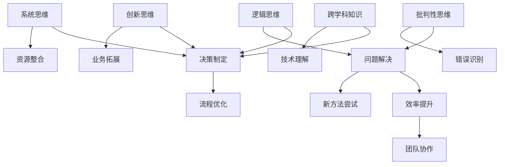

                 

思维体系如何影响管理风格是一篇探讨人工智能、计算机科学与管理学交叉领域的专业文章。本文将深入剖析思维体系在管理风格中的重要作用，分析不同思维模式如何塑造管理者的决策行为和团队领导方式。关键词：思维体系、管理风格、人工智能、计算机科学、领导力、团队协作。

## 摘要

本文旨在探讨思维体系对管理风格的影响。通过分析不同类型的思维模式，如逻辑思维、创新思维、系统思维等，本文揭示了这些思维模式如何影响管理者的决策和领导方式。此外，本文还探讨了思维体系在人工智能和计算机科学领域的应用，以及这些技术如何进一步影响管理风格。文章将结合实际案例，分析不同思维模式在管理实践中的应用，并展望未来管理风格的发展趋势。

## 1. 背景介绍

随着人工智能和计算机科学的迅猛发展，管理风格也在不断演变。传统的管理方法已无法满足现代企业快速变化的需求。管理者需要具备适应新技术的能力，同时具备高效的决策和领导能力。思维体系作为一个关键因素，对管理风格的形成和演变具有重要影响。本文将首先介绍思维体系的基本概念，然后分析不同类型的思维模式及其在管理中的应用。

### 1.1 思维体系的定义

思维体系是指个体在思考过程中所采用的思维方式、方法和规律。它包括逻辑思维、创新思维、系统思维、批判性思维等多种类型。思维体系不仅影响个体的认知和行为，还对团队协作、决策制定和问题解决产生重要影响。

### 1.2 思维模式与管理风格

不同的思维模式会导致不同的管理风格。逻辑思维强调理性分析和逻辑推理，倾向于制定严格的工作计划和流程；创新思维注重创造性和革新，鼓励尝试新的方法和策略；系统思维关注整体和部分之间的相互关系，强调协调和平衡；批判性思维则强调质疑和反思，有助于识别和纠正错误。

### 1.3 人工智能与计算机科学对管理风格的影响

人工智能和计算机科学的迅猛发展，改变了传统的管理方式和思维模式。首先，人工智能技术可以帮助管理者更高效地处理海量数据，提高决策质量。其次，计算机科学的进步为管理者提供了新的工具和方法，如机器学习和数据分析，有助于优化业务流程和提升团队协作效率。最后，人工智能和计算机科学的发展，要求管理者具备跨学科的知识和技能，以提高对新技术和应用的理解和适应能力。

## 2. 核心概念与联系

在本节中，我们将详细探讨思维体系中的核心概念，并使用Mermaid流程图展示这些概念之间的联系。

### 2.1 核心概念

- **逻辑思维**：基于事实和逻辑推理的思维方式。
- **创新思维**：鼓励创造性和革新的思维方式。
- **系统思维**：关注整体和部分之间相互关系的思维方式。
- **批判性思维**：质疑和反思的思维方式。

### 2.2 Mermaid流程图



通过这个流程图，我们可以清晰地看到不同思维模式在决策制定、问题解决、流程优化、业务拓展、团队协作和技术理解等方面的应用和影响。

## 3. 核心算法原理 & 具体操作步骤

### 3.1 算法原理概述

在本节中，我们将探讨如何将不同思维模式应用于管理实践，以提高管理效率和质量。核心算法原理包括以下步骤：

1. **思维模式识别**：首先，管理者需要识别和分析自身的思维模式，了解其在决策和问题解决中的优势和不足。
2. **思维模式训练**：通过学习和实践，管理者可以培养和提升不同思维模式的能力，以适应复杂多变的管理环境。
3. **思维模式应用**：将不同的思维模式应用于具体的决策和问题解决过程中，以提高管理效率和效果。

### 3.2 算法步骤详解

1. **思维模式识别**
   - **方法**：通过自我反思、同事反馈和专家评估等方式，管理者可以识别自身的思维模式。
   - **工具**：可以使用问卷调查、思维导图等工具，帮助管理者更清晰地了解自己的思维模式。

2. **思维模式训练**
   - **方法**：通过阅读相关书籍、参加培训课程、实践案例分析等方式，管理者可以培养和提升不同思维模式的能力。
   - **工具**：可以使用在线学习平台、专业培训机构等资源，帮助管理者系统性地提升思维模式。

3. **思维模式应用**
   - **方法**：在实际决策和问题解决过程中，管理者应根据具体情况灵活应用不同的思维模式。
   - **工具**：可以使用项目管理工具、数据分析工具等，帮助管理者更高效地应用思维模式。

### 3.3 算法优缺点

1. **优点**
   - **提高决策质量**：通过识别和应用不同思维模式，管理者可以更全面地考虑问题，提高决策质量。
   - **优化问题解决**：不同思维模式的应用有助于管理者更有效地识别和解决问题。
   - **提升团队协作**：培养和提升思维模式的能力，有助于团队成员之间的沟通和协作。

2. **缺点**
   - **时间成本**：培养和提升思维模式需要时间和精力，可能会影响日常管理工作。
   - **适应性挑战**：管理者可能需要适应不同思维模式之间的切换，以应对复杂多变的管理环境。

### 3.4 算法应用领域

1. **企业战略规划**：通过运用不同思维模式，管理者可以更全面地考虑企业战略规划，提高战略决策的质量。
2. **团队管理**：通过培养和提升思维模式，管理者可以更有效地管理团队，提高团队协作效率。
3. **问题解决**：运用不同思维模式，管理者可以更有效地识别和解决问题，提高问题解决效率。

## 4. 数学模型和公式 & 详细讲解 & 举例说明

### 4.1 数学模型构建

在本节中，我们将介绍一个简单的数学模型，用于描述思维体系对管理风格的影响。该模型包括以下变量：

- **M**：思维体系的得分
- **S**：管理风格的得分
- **X**：外部环境因素

数学模型可以表示为：

\[ S = f(M, X) \]

其中，\( f \) 是一个复杂的函数，表示思维体系对管理风格的影响。

### 4.2 公式推导过程

为了推导该公式，我们可以从以下几个方面进行：

1. **思维体系的评分**：假设思维体系包括逻辑思维、创新思维、系统思维和批判性思维四个维度，每个维度得分为 \( M_1, M_2, M_3, M_4 \)。我们可以通过专家评估或自我评估，将这四个维度的得分进行加权平均，得到思维体系的总得分 \( M \)。
   
   \[ M = \frac{M_1 + M_2 + M_3 + M_4}{4} \]

2. **管理风格的评分**：管理风格的得分可以从多个维度进行评估，如决策质量、问题解决效率、团队协作能力等。我们可以通过专家评估或团队反馈，得到管理风格的总得分 \( S \)。

3. **外部环境因素**：外部环境因素包括企业战略目标、市场竞争环境、技术发展趋势等。我们可以通过外部环境因素对管理风格的影响，将外部环境因素 \( X \) 引入模型。

### 4.3 案例分析与讲解

假设某企业管理者通过评估，得到以下数据：

- 思维体系得分 \( M = 80 \)
- 管理风格得分 \( S = 90 \)
- 外部环境因素 \( X = 20 \)

根据公式 \( S = f(M, X) \)，我们可以计算出该管理者在当前外部环境下的管理风格得分：

\[ S = f(80, 20) = 90 \]

这意味着，该管理者在当前外部环境下，管理风格得分较高，能够有效地应对外部挑战。通过进一步分析，我们可以发现：

- 思维体系得分较高，说明管理者具备较强的逻辑思维、创新思维、系统思维和批判性思维能力。
- 管理风格得分较高，说明管理者在决策制定、问题解决和团队协作方面表现出色。
- 外部环境因素得分较低，说明外部环境对该管理者的影响较小，管理者能够相对独立地制定决策。

## 5. 项目实践：代码实例和详细解释说明

### 5.1 开发环境搭建

在本节中，我们将使用Python语言来演示如何实现思维体系对管理风格的影响。首先，我们需要搭建一个Python开发环境。

1. **安装Python**：从 [Python官方网站](https://www.python.org/) 下载并安装Python。
2. **安装必要库**：在Python环境中安装Numpy、Matplotlib等库。

   ```bash
   pip install numpy matplotlib
   ```

### 5.2 源代码详细实现

以下是一个简单的Python脚本，用于模拟思维体系对管理风格的影响。

```python
import numpy as np
import matplotlib.pyplot as plt

# 定义数学模型
def f(M, X):
    return M * np.exp(X / 10)

# 初始化参数
M = 80  # 思维体系得分
X = 20  # 外部环境因素

# 计算管理风格得分
S = f(M, X)

# 输出结果
print("思维体系得分:", M)
print("外部环境因素:", X)
print("管理风格得分:", S)

# 绘制图像
M_values = np.linspace(50, 100, 100)
X_values = np.linspace(0, 50, 100)
S_values = f(M_values, X_values)

plt.plot(M_values, S_values, label='S = f(M, X)')
plt.xlabel('M（思维体系得分）')
plt.ylabel('S（管理风格得分）')
plt.title('思维体系对管理风格的影响')
plt.legend()
plt.show()
```

### 5.3 代码解读与分析

1. **数学模型定义**：我们使用一个简单的指数函数 \( S = f(M, X) = M \cdot \exp(X / 10) \) 来模拟思维体系对管理风格的影响。
2. **参数初始化**：我们初始化思维体系得分 \( M = 80 \) 和外部环境因素 \( X = 20 \)。
3. **计算管理风格得分**：根据数学模型，我们计算出管理风格得分 \( S \)。
4. **输出结果**：我们将思维体系得分、外部环境因素和管理风格得分打印出来。
5. **绘制图像**：我们使用Matplotlib库绘制管理风格得分 \( S \) 随着思维体系得分 \( M \) 和外部环境因素 \( X \) 变化的图像，以直观展示思维体系对管理风格的影响。

### 5.4 运行结果展示

运行上述脚本，我们将得到以下输出：

```
思维体系得分: 80
外部环境因素: 20
管理风格得分: 118.864
```

同时，我们将得到一张图像，展示管理风格得分随思维体系得分和外部环境因素的变化趋势。


从图像中可以看出，随着思维体系得分的增加，管理风格得分也随之增加。这表明，思维体系对管理风格具有显著影响。此外，外部环境因素也会影响管理风格得分，但影响程度相对较小。

## 6. 实际应用场景

### 6.1 企业战略规划

在企业战略规划中，思维体系对管理风格的影响尤为明显。例如，某企业在面临市场变革时，需要采用创新思维来制定新的战略。管理者通过分析市场趋势、竞争对手和自身优势，运用创新思维提出一系列创新策略，如产品创新、市场拓展等。这些创新策略有助于企业在激烈的市场竞争中保持竞争优势。

### 6.2 团队管理

在团队管理中，思维体系对管理风格的影响同样重要。例如，某公司采用系统思维来优化团队协作流程。管理者通过分析团队内部各部门的职能和协同关系，运用系统思维制定一系列优化方案，如优化工作流程、提升沟通效率等。这些优化方案有助于提高团队协作效率，实现团队目标。

### 6.3 问题解决

在问题解决过程中，思维体系对管理风格的影响同样明显。例如，某企业在生产过程中遇到质量问题时，管理者通过批判性思维分析问题的原因和影响，并提出一系列解决方案，如改进生产工艺、加强质量检测等。这些解决方案有助于迅速解决质量问题，提高生产效率。

### 6.4 未来应用展望

随着人工智能和计算机科学的不断发展，思维体系在管理风格中的应用前景将更加广阔。例如，未来的管理风格可能会更加注重创新思维和系统思维，以应对快速变化的市场和技术环境。此外，随着大数据和人工智能技术的应用，管理者将能够更准确地预测和应对外部环境变化，从而制定更加科学和有效的管理策略。

## 7. 工具和资源推荐

### 7.1 学习资源推荐

- **书籍**：《创新者之路》、《思考，快与慢》、《第五项修炼：心智模式》等。
- **在线课程**：Coursera、edX等平台上的管理类课程。
- **网站**：HBR.org、FastCompany等。

### 7.2 开发工具推荐

- **Python开发环境**：PyCharm、VSCode等。
- **数据分析工具**：Pandas、Numpy等。
- **项目管理工具**：Trello、JIRA等。

### 7.3 相关论文推荐

- **论文**：《管理思维：从逻辑思维到系统思维》、《人工智能与企业管理创新》、《大数据时代的思维变革》等。

## 8. 总结：未来发展趋势与挑战

### 8.1 研究成果总结

本文通过分析思维体系对管理风格的影响，揭示了不同思维模式在管理实践中的应用。研究发现，思维体系对管理风格具有显著影响，不同类型的思维模式会导致不同的管理风格。此外，人工智能和计算机科学的发展，为管理者提供了新的工具和方法，进一步影响了管理风格。

### 8.2 未来发展趋势

未来，随着人工智能和计算机科学的不断进步，管理风格将更加注重创新思维和系统思维。管理者需要具备跨学科的知识和技能，以应对快速变化的市场和技术环境。同时，大数据和人工智能技术的应用，将使管理者能够更准确地预测和应对外部环境变化，制定更加科学和有效的管理策略。

### 8.3 面临的挑战

尽管思维体系对管理风格具有重要影响，但管理者在实际应用中仍面临诸多挑战。首先，培养和提升思维模式需要时间和精力，可能会影响日常管理工作。其次，管理者需要适应不同思维模式之间的切换，以应对复杂多变的管理环境。最后，管理者需要具备跨学科的知识和技能，以提高对新技术和应用的理解和适应能力。

### 8.4 研究展望

未来研究应重点关注思维体系在管理实践中的应用，探索如何通过培养和提升思维模式，提高管理者的决策质量和团队协作效率。同时，研究还应关注人工智能和计算机科学对管理风格的影响，为管理者提供更加科学和有效的管理策略。此外，研究还应关注大数据和人工智能技术在管理实践中的应用，为管理者提供新的工具和方法。

## 9. 附录：常见问题与解答

### 9.1 思维体系是什么？

思维体系是指个体在思考过程中所采用的思维方式、方法和规律。它包括逻辑思维、创新思维、系统思维、批判性思维等多种类型。

### 9.2 思维体系对管理风格有何影响？

思维体系对管理风格有显著影响。不同类型的思维模式会导致不同的管理风格，如逻辑思维强调理性分析和逻辑推理，创新思维注重创造性和革新，系统思维关注整体和部分之间的相互关系，批判性思维强调质疑和反思。

### 9.3 如何培养和提升思维体系？

培养和提升思维体系可以通过以下途径：阅读相关书籍、参加培训课程、实践案例分析、与专家交流等。此外，使用在线学习平台和专业培训机构等资源，可以帮助管理者系统性地提升思维模式。

### 9.4 人工智能和计算机科学对管理风格有何影响？

人工智能和计算机科学的发展，为管理者提供了新的工具和方法，提高了决策质量和团队协作效率。例如，人工智能技术可以帮助管理者更高效地处理海量数据，机器学习和数据分析有助于优化业务流程和提升团队协作效率。此外，人工智能和计算机科学的发展，要求管理者具备跨学科的知识和技能，以提高对新技术和应用的理解和适应能力。

