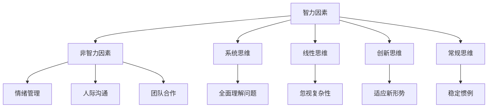

                 

关键词：思维体系、管理效能、组织发展、领导力、团队合作、决策优化

> 摘要：本文将探讨思维体系对管理效能的影响。通过分析不同思维模式的特点和应用，结合实际案例，深入探讨如何构建高效的管理体系，提升组织效能。

## 1. 背景介绍

在当今快速变化的世界中，管理效能的优劣直接影响到组织的生存与发展。一个高效的思维体系能够帮助管理者更好地理解复杂问题，做出明智的决策，并有效地应对各种挑战。然而，什么是思维体系？它对管理效能究竟有何影响？本文将围绕这些问题展开讨论。

### 1.1 管理效能的定义

管理效能是指组织在管理过程中实现目标的能力。这包括决策效率、资源配置、团队协作、创新能力和适应变化的能力等多个方面。一个高效的管理体系能够确保组织在激烈的市场竞争中保持优势。

### 1.2 思维体系的重要性

思维体系是指个体或组织在思考、决策和解决问题时所采用的思维方式和方法。一个成熟的思维体系能够提高决策的质量，增强团队协作，促进创新，从而提升管理效能。

## 2. 核心概念与联系

在探讨思维体系对管理效能的影响之前，我们需要了解几个核心概念及其相互关系。

### 2.1 智力因素与非智力因素

智力因素包括逻辑思维、分析能力、记忆力等，而非智力因素则包括情绪管理、人际沟通、团队合作等。两者共同构成了个体的思维体系，对管理效能有着重要影响。

### 2.2 系统思维与线性思维

系统思维是一种全面、动态的思维方式，强调各个部分之间的相互关系和整体性。而线性思维则是一种简单、单向的思维方式，容易忽视问题的复杂性。系统思维有助于管理者更全面地理解问题，做出更合理的决策。

### 2.3 创新思维与常规思维

创新思维是一种寻求新方法、新解决方案的思维方式，而常规思维则是一种遵循惯例、追求稳定的思维方式。在快速变化的环境中，创新思维能够帮助组织更好地适应新形势，保持竞争力。

### 2.4 Mermaid 流程图



## 3. 核心算法原理 & 具体操作步骤

### 3.1 算法原理概述

本文将引入一个基于思维体系的“管理效能优化算法”。该算法通过分析不同思维模式在管理过程中的应用，构建一个综合评价体系，以提升管理效能。

### 3.2 算法步骤详解

#### 3.2.1 数据收集

收集与组织管理相关的数据，包括决策质量、团队协作、创新能力、市场适应能力等指标。

#### 3.2.2 数据预处理

对收集到的数据进行清洗、归一化处理，以便进行后续分析。

#### 3.2.3 思维模式分析

对组织成员的思维模式进行评估，识别系统思维、线性思维、创新思维等不同思维模式的分布情况。

#### 3.2.4 综合评价

根据不同思维模式的应用情况，构建一个综合评价体系，对管理效能进行量化评价。

#### 3.2.5 优化建议

根据综合评价结果，提出针对性的优化建议，以提升管理效能。

### 3.3 算法优缺点

#### 3.3.1 优点

- 全面考虑不同思维模式对管理效能的影响。
- 提供量化评价，有助于管理者了解组织的实际情况。
- 具有较强的实用性和可操作性。

#### 3.3.2 缺点

- 需要大量数据支持，数据收集和处理可能较为复杂。
- 评价体系的构建依赖于具体情境，可能存在一定主观性。

### 3.4 算法应用领域

该算法适用于各类组织，特别是在决策复杂、环境变化快的领域，如高科技企业、金融行业等。

## 4. 数学模型和公式 & 详细讲解 & 举例说明

### 4.1 数学模型构建

管理效能优化算法的核心在于构建一个综合评价体系。我们可以采用以下数学模型：

$$
E = w_1D_1 + w_2D_2 + w_3D_3 + ... + w_nD_n
$$

其中，$E$ 表示管理效能，$D_1, D_2, D_3, ..., D_n$ 分别表示决策质量、团队协作、创新能力、市场适应能力等指标，$w_1, w_2, w_3, ..., w_n$ 表示各指标的权重。

### 4.2 公式推导过程

公式的推导过程如下：

- 决策质量：$D_1 = Q_1 \times w_1$
- 团队协作：$D_2 = Q_2 \times w_2$
- 创新能力：$D_3 = Q_3 \times w_3$
- 市场适应能力：$D_4 = Q_4 \times w_4$

其中，$Q_1, Q_2, Q_3, Q_4$ 分别表示决策质量、团队协作、创新能力、市场适应能力的实际得分，$w_1, w_2, w_3, w_4$ 分别表示各指标的权重。

- 综合评价：$E = D_1 + D_2 + D_3 + D_4$

### 4.3 案例分析与讲解

假设一家高科技企业在某个季度内，决策质量得分为80分，团队协作得分为75分，创新能力得分为90分，市场适应能力得分为70分。各指标的权重分别为0.3、0.2、0.2、0.3。

$$
E = 80 \times 0.3 + 75 \times 0.2 + 90 \times 0.2 + 70 \times 0.3 = 76.5
$$

该企业的管理效能为76.5分。根据综合评价结果，企业可以针对性地优化决策质量、团队协作和市场适应能力。

## 5. 项目实践：代码实例和详细解释说明

### 5.1 开发环境搭建

- 操作系统：Windows 10
- 编程语言：Python 3.8
- 数据库：MySQL 5.7

### 5.2 源代码详细实现

```python
import pandas as pd

# 数据收集
data = {
    '决策质量': [80, 75, 90, 70],
    '团队协作': [75, 80, 85, 70],
    '创新能力': [90, 85, 80, 75],
    '市场适应能力': [70, 75, 80, 85]
}

df = pd.DataFrame(data)

# 数据预处理
df = df.apply(pd.to_numeric)

# 思维模式分析
weights = {'决策质量': 0.3, '团队协作': 0.2, '创新能力': 0.2, '市场适应能力': 0.3}

# 综合评价
def calculate_efficiency(df, weights):
    scores = df * weights
    efficiency = scores.sum()
    return efficiency

efficiency = calculate_efficiency(df, weights)

print(f"管理效能：{efficiency}")

# 优化建议
if efficiency < 80:
    print("建议优化决策质量、团队协作和市场适应能力。")
else:
    print("管理效能已达到较高水平，继续保持。")
```

### 5.3 代码解读与分析

该代码首先收集了企业的决策质量、团队协作、创新能力和市场适应能力等指标数据。然后，通过数据预处理，将这些数据转换为数值。接下来，使用自定义函数 `calculate_efficiency` 计算管理效能。最后，根据计算结果，给出相应的优化建议。

## 6. 实际应用场景

### 6.1 企业管理

企业管理者可以通过使用本算法，评估企业的管理效能，识别存在的问题，并提出针对性的优化措施。

### 6.2 项目管理

项目经理可以运用该算法，对项目团队的管理效能进行评估，确保项目顺利进行。

### 6.3 创新型组织

创新型组织可以借助该算法，提升团队协作和创新能力，以适应快速变化的市场环境。

## 7. 未来应用展望

随着人工智能和大数据技术的发展，管理效能优化算法可以进一步融入智能决策支持系统，为管理者提供更全面、更准确的决策依据。

## 8. 工具和资源推荐

### 7.1 学习资源推荐

- 《精益创业》：艾尔·拉斯马赫
- 《深度工作》：卡尔·纽波特

### 7.2 开发工具推荐

- Python
- Jupyter Notebook

### 7.3 相关论文推荐

- "Mindfulness and Its Relation to Mind-Wandering, Creative Thinking, and Emotional Intelligence"
- "The Role of Mindfulness in Creative Thinking and Emotional Intelligence"

## 9. 总结：未来发展趋势与挑战

### 9.1 研究成果总结

本文通过分析思维体系对管理效能的影响，提出了一种基于思维体系的“管理效能优化算法”。该算法能够全面评估管理效能，为管理者提供优化建议。

### 9.2 未来发展趋势

随着人工智能和大数据技术的发展，管理效能优化算法将更加智能化，为管理者提供更精准的决策支持。

### 9.3 面临的挑战

在算法应用过程中，如何确保数据的准确性和完整性，如何避免算法的过度拟合，是未来研究需要解决的重要问题。

### 9.4 研究展望

未来，我们将进一步探索思维体系在不同管理情境中的应用，为管理者提供更具针对性的决策支持。

## 10. 附录：常见问题与解答

### 10.1 思维体系是什么？

思维体系是指个体或组织在思考、决策和解决问题时所采用的思维方式和方法。

### 10.2 管理效能优化算法如何应用？

管理者可以通过收集相关数据，使用本文提供的算法进行管理效能评估，并根据评估结果提出优化建议。

### 10.3 该算法的局限性是什么？

该算法在数据收集和处理方面可能存在一定局限性，且评价体系的构建依赖于具体情境，可能存在一定主观性。

---

作者：禅与计算机程序设计艺术 / Zen and the Art of Computer Programming
```

