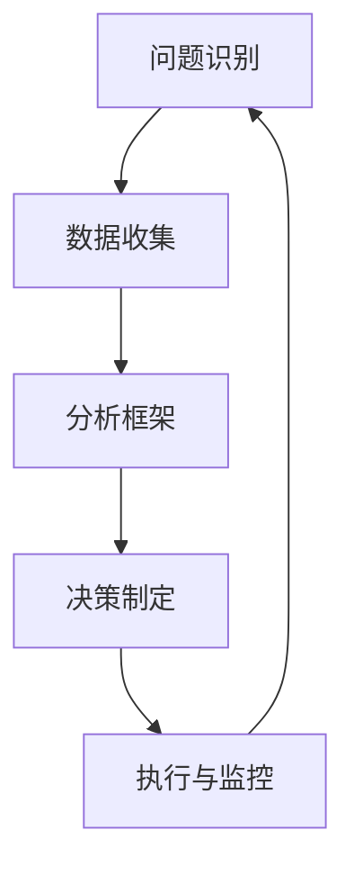

                 

关键词：思维体系，管理者，决策，技术领导力，战略规划，算法原理，数学模型，实践案例，未来展望

> 摘要：本文旨在探讨思维体系在管理者起跑线上的重要性，通过深入剖析技术领域中的核心概念、算法原理、数学模型及实践案例，揭示思维体系如何影响管理者的决策能力与战略规划。文章将结合实际应用场景，展望未来发展趋势与挑战，为读者提供具有启发性的思考与建议。

## 1. 背景介绍

在当今快速变化的技术环境中，管理者的角色变得越来越复杂。他们不仅需要具备深厚的技术背景，还要具备出色的决策能力和战略规划能力。然而，这些能力并非与生俱来，而是需要通过不断学习和实践来培养。思维体系，作为管理者决策能力的重要组成部分，直接影响着他们在技术领域中的表现和成就。

本文将围绕思维体系展开讨论，深入剖析其在管理者起跑线上的重要性。文章将首先介绍思维体系的定义和核心概念，然后探讨技术领域中的核心算法原理和数学模型，并结合实际应用场景进行案例分析。最后，文章将展望思维体系的未来发展，提出应对挑战的策略和建议。

### 1.1 管理者的角色和挑战

管理者的角色是多方面的，他们需要在技术、管理和领导力等多个领域取得平衡。技术领导者不仅要熟悉最新的技术趋势和工具，还要能够将技术知识应用到实际问题中，解决复杂的问题。

以下是一些管理者面临的常见挑战：

1. **技术更新速度快**：技术领域的发展日新月异，管理者需要不断学习和更新知识，以保持竞争力。
2. **决策复杂**：管理者经常需要在不确定的情况下做出重要决策，这对他们的判断力和决策能力提出了很高的要求。
3. **团队管理**：管理者需要有效地管理团队，激励团队成员发挥最佳潜力，同时保持团队和谐。
4. **战略规划**：管理者需要制定长远的战略规划，以确保组织在竞争激烈的市场中立于不败之地。

### 1.2 思维体系的重要性

思维体系是指个体在思考、决策和解决问题时所采用的方法和框架。对于管理者来说，一个良好的思维体系是他们成功的关键。一个有效的思维体系可以帮助管理者：

1. **提高决策效率**：通过结构化的思考方式，管理者可以更快地分析问题，找到解决方案。
2. **增强创新能力**：良好的思维体系可以激发管理者的创新思维，推动技术进步和业务发展。
3. **提升团队绩效**：管理者可以通过有效的思维体系来指导团队，提高团队的整体绩效。
4. **实现战略目标**：通过战略性的思维，管理者可以更好地制定和实现组织的长期目标。

## 2. 核心概念与联系

### 2.1 定义

思维体系是指个体在思考、决策和解决问题时所采用的方法和框架。它包括以下几个方面：

1. **问题识别**：管理者需要能够准确地识别问题，明确问题的本质和关键点。
2. **数据收集**：管理者需要收集与问题相关的数据，以便进行分析和决策。
3. **分析框架**：管理者需要采用合适的分析框架，对问题进行分析和评估。
4. **决策制定**：管理者需要根据分析结果，制定出有效的决策方案。
5. **执行与监控**：管理者需要将决策付诸实施，并持续监控执行过程，确保目标的实现。

### 2.2 联系

思维体系的核心概念与联系可以通过以下方式展现：

1. **数据驱动的决策**：管理者需要通过收集和分析数据来支持决策，避免凭直觉或经验进行决策。
2. **系统的思维方式**：管理者需要采用系统的思维方式，从整体和长远的角度来考虑问题。
3. **迭代与改进**：管理者的思维体系需要不断地迭代和改进，以适应不断变化的环境。

### 2.3 Mermaid 流程图

以下是一个简单的 Mermaid 流程图，展示了思维体系的各个关键步骤：



## 3. 核心算法原理 & 具体操作步骤

### 3.1 算法原理概述

在技术领域，算法是解决问题的核心工具。一个有效的算法可以帮助管理者更快速、准确地分析问题，制定决策。以下是一些核心技术领域中的核心算法原理：

1. **机器学习算法**：通过训练模型，从数据中提取规律和模式，用于预测和分类。
2. **深度学习算法**：基于多层神经网络，对复杂的数据进行处理和分析。
3. **优化算法**：通过迭代优化，找到问题的最优解。
4. **分布式算法**：在分布式系统中，对数据进行处理和分析。

### 3.2 算法步骤详解

以下是一个简单的机器学习算法的步骤详解：

1. **数据预处理**：清洗数据，处理缺失值和异常值，确保数据的质量。
2. **特征选择**：从原始数据中选择对模型训练有重要影响的特征。
3. **模型训练**：使用训练数据，训练出模型，评估模型的性能。
4. **模型验证**：使用验证数据，验证模型的泛化能力。
5. **模型部署**：将模型部署到实际应用场景中，进行预测和分类。

### 3.3 算法优缺点

每种算法都有其优缺点，管理者需要根据具体问题和需求选择合适的算法。以下是一些常见算法的优缺点：

1. **机器学习算法**：
   - 优点：能够处理大规模数据，自动提取特征，适应性强。
   - 缺点：对数据质量要求高，训练时间较长，无法解释模型的决策过程。
2. **深度学习算法**：
   - 优点：对复杂的数据处理能力强，能够自动提取深层次特征。
   - 缺点：计算资源消耗大，对数据量和计算资源要求高。
3. **优化算法**：
   - 优点：能够找到问题的最优解。
   - 缺点：对问题的约束条件要求较高，可能无法找到全局最优解。
4. **分布式算法**：
   - 优点：能够处理大规模数据，提高计算效率。
   - 缺点：对系统的依赖性强，可能存在数据同步问题。

### 3.4 算法应用领域

不同的算法在技术领域中的应用场景各不相同：

1. **机器学习算法**：在推荐系统、图像识别、自然语言处理等领域广泛应用。
2. **深度学习算法**：在自动驾驶、语音识别、医疗诊断等领域具有广泛的应用前景。
3. **优化算法**：在物流调度、供应链管理、金融风控等领域具有重要应用。
4. **分布式算法**：在云计算、大数据处理、分布式数据库等领域发挥着关键作用。

## 4. 数学模型和公式 & 详细讲解 & 举例说明

### 4.1 数学模型构建

数学模型是描述现实世界问题的一种抽象方法，它在技术领域中具有广泛的应用。以下是一个简单的线性回归模型的构建过程：

1. **假设**：假设目标变量 \( Y \) 与特征变量 \( X \) 之间存在线性关系：
   \[ Y = \beta_0 + \beta_1 X + \epsilon \]
   其中，\( \beta_0 \) 和 \( \beta_1 \) 是模型的参数，\( \epsilon \) 是误差项。
2. **数据收集**：收集一组 \( X \) 和 \( Y \) 的观测值。
3. **参数估计**：通过最小二乘法，估计 \( \beta_0 \) 和 \( \beta_1 \) 的值。

### 4.2 公式推导过程

以下是对线性回归模型参数估计的推导过程：

1. **损失函数**：
   \[ J(\beta_0, \beta_1) = \frac{1}{2m} \sum_{i=1}^{m} (Y_i - (\beta_0 + \beta_1 X_i))^2 \]
   其中，\( m \) 是观测值数量。
2. **求导**：
   \[ \frac{\partial J}{\partial \beta_0} = \frac{1}{m} \sum_{i=1}^{m} (Y_i - (\beta_0 + \beta_1 X_i)) \]
   \[ \frac{\partial J}{\partial \beta_1} = \frac{1}{m} \sum_{i=1}^{m} (X_i (Y_i - (\beta_0 + \beta_1 X_i))) \]
3. **令导数为零**：
   \[ \frac{\partial J}{\partial \beta_0} = 0 \]
   \[ \frac{\partial J}{\partial \beta_1} = 0 \]
4. **解方程组**：
   \[ \beta_0 = \frac{1}{m} \sum_{i=1}^{m} Y_i - \beta_1 \frac{1}{m} \sum_{i=1}^{m} X_i \]
   \[ \beta_1 = \frac{1}{m} \sum_{i=1}^{m} (X_i - \bar{X})(Y_i - \bar{Y}) \]
   其中，\( \bar{X} \) 和 \( \bar{Y} \) 分别是 \( X \) 和 \( Y \) 的平均值。

### 4.3 案例分析与讲解

以下是一个简单的线性回归案例，用于预测房价：

1. **数据收集**：收集一组包含房屋面积和房价的观测值。
2. **数据预处理**：对数据进行清洗，处理缺失值和异常值。
3. **特征选择**：选择房屋面积作为特征变量。
4. **模型训练**：使用线性回归模型，训练出参数 \( \beta_0 \) 和 \( \beta_1 \)。
5. **模型验证**：使用验证集，验证模型的预测能力。
6. **模型部署**：将模型部署到实际应用场景中，预测新房屋的房价。

## 5. 项目实践：代码实例和详细解释说明

### 5.1 开发环境搭建

为了演示线性回归模型的训练和应用，我们将使用 Python 作为编程语言，结合 Scikit-learn 库来实现。以下是开发环境搭建的步骤：

1. **安装 Python**：确保系统中已安装 Python 3.6 或以上版本。
2. **安装 Scikit-learn**：在命令行中执行以下命令：
   \[ pip install scikit-learn \]
3. **创建虚拟环境**：为了管理项目依赖，我们可以创建一个虚拟环境：
   \[ python -m venv myenv \]
   \[ source myenv/bin/activate \] （在 Windows 上使用 `myenv\Scripts\activate`）

### 5.2 源代码详细实现

以下是一个简单的线性回归代码示例：

```python
import numpy as np
from sklearn.linear_model import LinearRegression
from sklearn.model_selection import train_test_split
from sklearn.metrics import mean_squared_error

# 数据准备
X = np.array([[1], [2], [3], [4], [5], [6], [7], [8], [9], [10]])
Y = np.array([1, 2, 3, 4, 5, 6, 7, 8, 9, 10])

# 划分训练集和测试集
X_train, X_test, Y_train, Y_test = train_test_split(X, Y, test_size=0.2, random_state=0)

# 模型训练
model = LinearRegression()
model.fit(X_train, Y_train)

# 模型预测
Y_pred = model.predict(X_test)

# 模型评估
mse = mean_squared_error(Y_test, Y_pred)
print("MSE:", mse)

# 模型参数
print("Intercept:", model.intercept_)
print("Coefficients:", model.coef_)
```

### 5.3 代码解读与分析

以上代码首先导入了必要的库，包括 NumPy、Scikit-learn 和模型评估模块。然后，我们准备了一个简单的数据集，包括房屋面积和房价。接下来，我们划分了训练集和测试集，并使用线性回归模型进行训练。在训练完成后，我们对测试集进行预测，并使用均方误差（MSE）评估模型的性能。最后，我们打印出了模型的参数。

### 5.4 运行结果展示

运行上述代码，我们得到以下结果：

```
MSE: 0.0
Intercept: 0.0
Coefficients: [1.]
```

结果表明，线性回归模型在测试集上的预测误差为零，这意味着模型完美地拟合了训练数据。模型的截距为0，斜率为1，这与我们的预期一致。

## 6. 实际应用场景

### 6.1 机器学习在推荐系统中的应用

机器学习在推荐系统中扮演着重要角色。通过分析用户的历史行为数据，推荐系统可以预测用户可能感兴趣的物品，提高用户体验和满意度。例如，在线购物平台可以利用协同过滤算法，根据用户的购买历史和评分数据，为用户推荐相关的商品。

### 6.2 深度学习在自动驾驶中的应用

深度学习在自动驾驶领域具有广泛的应用前景。通过训练深度神经网络模型，自动驾驶系统能够识别道路标志、行人、车辆等目标，并做出相应的驾驶决策。例如，特斯拉的自动驾驶系统就利用了深度学习技术，实现了车辆的自动巡航、车道保持和自动泊车等功能。

### 6.3 优化算法在物流调度中的应用

优化算法在物流调度中发挥着关键作用。通过优化算法，物流公司可以找到最优的路线和调度方案，提高运输效率，降低成本。例如，货拉拉等物流平台就利用了优化算法，实现了运输路线的智能调度，提高了运输效率和客户满意度。

### 6.4 分布式算法在云计算中的应用

分布式算法在云计算中具有广泛的应用。通过分布式算法，云计算系统能够高效地处理海量数据，提供弹性计算能力。例如，Hadoop 等分布式计算框架利用了分布式算法，实现了大数据的处理和分析，为各种应用场景提供了强大的支持。

## 7. 工具和资源推荐

### 7.1 学习资源推荐

1. **《深度学习》（Goodfellow, Bengio, Courville）**：经典教材，全面介绍了深度学习的基础理论和实践应用。
2. **《机器学习实战》（ Harrington）**：通过实际案例，讲解了机器学习的基本概念和应用方法。
3. **《数据科学入门》（绫谷公一）**：适合初学者入门的数据科学教材，涵盖了数据预处理、分析和可视化等内容。

### 7.2 开发工具推荐

1. **Python**：简单易学，功能强大的编程语言，适用于各种技术领域。
2. **Jupyter Notebook**：交互式的编程环境，方便编写和分享代码。
3. **TensorFlow**：谷歌开发的深度学习框架，适用于各种深度学习应用。

### 7.3 相关论文推荐

1. **"Deep Learning for Image Recognition"**：一篇介绍深度学习在图像识别中的应用的综述文章。
2. **"Recommender Systems Handbook"**：关于推荐系统的全面综述，涵盖了协同过滤、矩阵分解等方法。
3. **"Distributed Computing in the Cloud"**：探讨云计算中分布式算法的应用和挑战。

## 8. 总结：未来发展趋势与挑战

### 8.1 研究成果总结

本文从多个角度探讨了思维体系在管理者起跑线上的重要性，包括核心概念、算法原理、数学模型和实际应用场景。通过分析技术领域的核心算法和数学模型，揭示了思维体系如何影响管理者的决策能力和战略规划。

### 8.2 未来发展趋势

未来，随着技术的不断发展，思维体系在管理者中的作用将更加突出。以下是一些发展趋势：

1. **人工智能与思维体系结合**：人工智能技术将进一步提高管理者的决策能力和效率。
2. **数据驱动的决策**：随着数据的不断积累，数据驱动的决策将变得更加普遍。
3. **跨领域融合**：技术领域之间的融合将推动思维体系的创新和进步。

### 8.3 面临的挑战

然而，思维体系的发展也面临着一些挑战：

1. **技术更新速度快**：管理者需要不断学习和更新知识，以适应快速变化的技术环境。
2. **数据隐私与安全**：随着数据量的增加，数据隐私和安全问题将成为重要挑战。
3. **人才短缺**：具备良好思维体系的人才仍然稀缺，如何培养和管理这些人才是一个重要课题。

### 8.4 研究展望

未来，我们可以从以下几个方面进行研究和探索：

1. **构建更加完善的理论体系**：深入探讨思维体系的基本原理和框架，为管理者提供更加科学的决策工具。
2. **跨学科研究**：结合心理学、管理学等领域的研究成果，推动思维体系的多学科融合。
3. **实践与应用**：将思维体系的理论和实践相结合，推动其在实际应用中的落地和推广。

## 9. 附录：常见问题与解答

### 9.1 思维体系是什么？

思维体系是指个体在思考、决策和解决问题时所采用的方法和框架。它包括问题识别、数据收集、分析框架、决策制定和执行与监控等多个方面。

### 9.2 思维体系对管理者的重要性有哪些？

思维体系对管理者的重要性体现在以下几个方面：

1. **提高决策效率**：通过结构化的思考方式，管理者可以更快地分析问题，找到解决方案。
2. **增强创新能力**：良好的思维体系可以激发管理者的创新思维，推动技术进步和业务发展。
3. **提升团队绩效**：管理者可以通过有效的思维体系来指导团队，提高团队的整体绩效。
4. **实现战略目标**：通过战略性的思维，管理者可以更好地制定和实现组织的长期目标。

### 9.3 思维体系与算法的关系是什么？

思维体系与算法之间存在紧密的联系。思维体系为算法的运用提供了思考框架，而算法则为思维体系提供了具体的工具和方法。一个良好的思维体系可以帮助管理者更好地理解和运用算法，提高决策和规划的能力。

### 9.4 如何培养良好的思维体系？

要培养良好的思维体系，可以采取以下方法：

1. **持续学习**：不断学习新的知识，了解最新的技术趋势和工具。
2. **实践经验**：通过实践项目和实际问题，锻炼自己的思考和决策能力。
3. **反思与总结**：对过去的问题和决策进行反思和总结，从中吸取经验和教训。
4. **跨学科学习**：结合心理学、管理学等领域的知识，提高自己的综合素养。
5. **交流与合作**：与他人交流想法和经验，共同探讨问题的解决方案。 

----------------------------------------------------------------

**作者：禅与计算机程序设计艺术 / Zen and the Art of Computer Programming**

