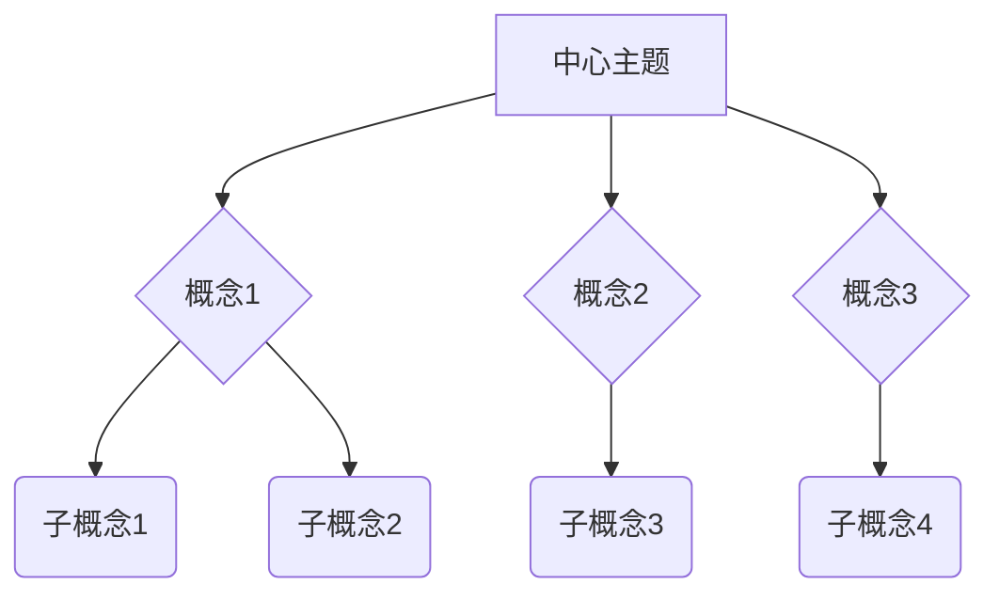
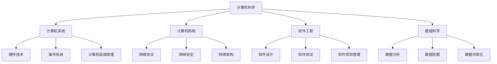
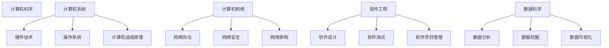

                 

关键词：思维导图，知识组织，视觉化，信息可视化，认知科学，教育技术

> 摘要：本文将深入探讨思维导图作为一种知识组织与视觉化工具的核心概念、原理及其应用。通过阐述思维导图的定义、作用以及它在各个领域的应用案例，本文旨在为读者提供一个全面而深入的思维导图使用指南，帮助大家更好地理解和利用这一强大的工具。

## 1. 背景介绍

思维导图（Mind Map）作为一种创新的知识组织工具，起源于20世纪60年代，由英国心理学家东尼·博赞（Tony Buzan）首次提出。博赞将思维导图定义为一种利用图形、颜色和符号等视觉元素，将信息结构化、直观化的方法。思维导图的核心在于其简洁、直观和层次分明的结构，使得复杂的信息变得更加易于理解和记忆。

在信息爆炸的时代，如何高效地获取、处理和存储信息成为一大挑战。传统的方法如线性笔记和文档整理难以满足快速变化的信息需求。而思维导图的出现，提供了一种全新的视觉化信息处理方式，受到了教育、商业、科研等多个领域的广泛关注和运用。

## 2. 核心概念与联系

### 2.1 思维导图的基本概念

思维导图由以下几个核心组成部分构成：

1. **中心主题**：思维导图的中心是一个明确的核心主题，它是思维导图的起点，也是整个导图的中心思想。
2. **分支**：从中心主题延伸出的分支代表与主题相关的不同概念、观点或信息点。
3. **连接线**：连接线表示各个分支之间的逻辑关系，通常使用箭头、曲线等不同形式来体现。
4. **标签和注释**：每个分支上附有的标签和注释是对分支内容的补充说明，有助于加深对信息的理解。
5. **颜色和形状**：颜色和形状等视觉元素有助于区分不同的信息层级和类别，增强视觉效果。

### 2.2 核心概念原理与架构

下面是一个思维导图的 Mermaid 流程图示例，用于展示思维导图的基本架构：



### 2.3 思维导图在知识组织中的作用

思维导图在知识组织中的作用主要体现在以下几个方面：

1. **结构化思维**：通过将信息分解为不同的分支和子分支，思维导图帮助用户建立清晰的信息结构，促进结构化思考。
2. **信息关联**：思维导图通过连接线展示各个分支之间的逻辑关系，帮助用户发现不同信息点之间的联系，加深对复杂信息的理解。
3. **记忆辅助**：颜色、形状和标签等视觉元素有助于强化信息的记忆，使得思维导图成为一种有效的记忆辅助工具。
4. **创意激发**：思维导图的直观和层次分明的结构为用户提供了广阔的思维空间，有助于激发创意和灵感。

## 3. 核心算法原理 & 具体操作步骤

### 3.1 算法原理概述

思维导图的创建过程本质上是一种信息编码和解码的过程。其核心算法主要包括以下几个步骤：

1. **信息输入**：将待组织的信息输入思维导图系统中。
2. **结构分解**：将信息分解为不同的分支和子分支，建立信息结构。
3. **关系建立**：通过连接线建立各个分支之间的逻辑关系。
4. **视觉优化**：使用颜色、形状等视觉元素对思维导图进行优化，使其更加直观和易于理解。

### 3.2 算法步骤详解

1. **步骤1：信息输入**
   - 将需要组织的信息（如一个项目计划、一篇论文大纲等）输入到思维导图软件中。
   - 确定思维导图的核心主题，并作为中心节点。

2. **步骤2：结构分解**
   - 根据信息的分类和重要性，将核心主题分解为不同的分支。
   - 每个分支代表一个主要的信息类别或主题。

3. **步骤3：关系建立**
   - 使用连接线将各个分支与中心主题以及分支之间的逻辑关系建立起来。
   - 可以使用箭头、曲线等不同的连接线形式来体现不同的逻辑关系。

4. **步骤4：视觉优化**
   - 使用颜色、形状等视觉元素对思维导图进行优化。
   - 颜色可以用来区分不同的信息类别，形状可以用来表示不同的重要性和层级。

### 3.3 算法优缺点

**优点**：

1. **直观性**：思维导图通过图形化的方式展示了信息结构，使得信息更加直观和易于理解。
2. **灵活性**：思维导图允许用户随时添加、删除或修改信息，具有较高的灵活性。
3. **记忆辅助**：视觉元素和结构化的信息有助于提高信息的记忆效率。

**缺点**：

1. **信息量限制**：思维导图适合展示较简单的信息结构，对于过于复杂的信息可能难以处理。
2. **信息丢失**：由于思维导图是一种图形化的表示方式，对于某些具体的信息细节可能存在丢失的风险。

### 3.4 算法应用领域

思维导图在以下领域有着广泛的应用：

1. **教育**：思维导图被广泛应用于教学大纲的设计、课堂笔记的整理、学生思维能力的培养等。
2. **商业**：思维导图在项目管理、市场调研、战略规划等商业活动中发挥着重要作用。
3. **科研**：思维导图可以帮助科研人员整理研究思路、构建理论框架等。

## 4. 数学模型和公式 & 详细讲解 & 举例说明

### 4.1 数学模型构建

思维导图的构建可以通过图论中的树状图模型进行描述。设 \( G = (V, E) \) 为思维导图的图模型，其中 \( V \) 为节点集合，\( E \) 为边集合。

- **节点 \( V \)**：表示思维导图中的各个分支和子分支，可以表示为 \( V = \{v_1, v_2, ..., v_n\} \)。
- **边 \( E \)**：表示节点之间的逻辑关系，可以表示为 \( E = \{(v_i, v_j) | v_i \text{ 与 } v_j \text{ 有逻辑关系}\} \)。

### 4.2 公式推导过程

思维导图的构建过程可以表示为以下步骤：

1. **确定中心节点**：设中心节点为 \( v_c \)。
2. **构建初始分支**：从中心节点 \( v_c \) 出发，构建若干初始分支 \( v_1, v_2, ..., v_k \)。
3. **添加子分支**：对于每个初始分支 \( v_i \)，根据需要构建子分支 \( v_{i1}, v_{i2}, ..., v_{im} \)。

具体公式推导如下：

设思维导图的分支数为 \( n \)，则初始分支数为 \( k \)，每个初始分支的子分支数为 \( m \)，则有：

\[ n = k + \sum_{i=1}^{k} m_i \]

其中，\( m_i \) 表示初始分支 \( v_i \) 的子分支数。

### 4.3 案例分析与讲解

假设我们要构建一个关于“计算机科学”的初步思维导图，可以按照以下步骤进行：

1. **确定中心节点**：设中心节点为“计算机科学”。
2. **构建初始分支**：从中心节点出发，构建以下初始分支：
   - 计算机系统
   - 计算机网络
   - 软件工程
   - 数据科学
3. **添加子分支**：
   - 对于“计算机系统”，可以添加以下子分支：
     - 硬件技术
     - 操作系统
     - 计算机组成原理
   - 对于“计算机网络”，可以添加以下子分支：
     - 网络协议
     - 网络安全
     - 网络架构
   - 对于“软件工程”，可以添加以下子分支：
     - 软件设计
     - 软件测试
     - 软件项目管理
   - 对于“数据科学”，可以添加以下子分支：
     - 数据分析
     - 数据挖掘
     - 数据可视化

通过上述步骤，我们可以得到一个关于“计算机科学”的初步思维导图，如图所示：



通过这个案例，我们可以看到如何使用思维导图来构建一个复杂的信息结构，并且可以清晰地展示各个分支之间的逻辑关系。

## 5. 项目实践：代码实例和详细解释说明

### 5.1 开发环境搭建

为了更好地理解思维导图的构建过程，我们将使用 Python 编程语言结合 Mermaid 库来实现一个简单的思维导图。首先，我们需要搭建一个 Python 开发环境，具体步骤如下：

1. **安装 Python**：下载并安装 Python 3.8 或以上版本，可以从 [Python 官网](https://www.python.org/) 下载。
2. **安装 Mermaid 库**：在终端中运行以下命令安装 Mermaid 库：

   ```bash
   pip install mermaid
   ```

### 5.2 源代码详细实现

以下是一个简单的 Python 代码实例，用于生成一个关于“计算机科学”的初步思维导图：

```python
import mermaid

# 定义思维导图的节点和关系
mind_map = mermaid.MindMap(
    "计算机科学",
    [
        {"子节点": "计算机系统", "子节点": ["硬件技术", "操作系统", "计算机组成原理"]},
        {"子节点": "计算机网络", "子节点": ["网络协议", "网络安全", "网络架构"]},
        {"子节点": "软件工程", "子节点": ["软件设计", "软件测试", "软件项目管理"]},
        {"子节点": "数据科学", "子节点": ["数据分析", "数据挖掘", "数据可视化"]},
    ]
)

# 输出生成的思维导图
mind_map.render()
```

### 5.3 代码解读与分析

1. **导入 Mermaid 库**：首先，我们导入 `mermaid` 库，这是实现思维导图的关键。
2. **定义思维导图**：使用 `mermaid.MindMap` 类来定义思维导图，其中第一个参数是思维导图的核心主题，后面是各个分支及其子分支。
3. **渲染思维导图**：调用 `render()` 方法将生成的思维导图输出到终端。

### 5.4 运行结果展示

运行上述代码后，我们将看到以下输出的思维导图：



通过这个实例，我们可以看到如何使用 Python 和 Mermaid 库来构建一个简单的思维导图。思维导图的输出结果是一个文本格式，其中包含了用于绘制思维导图的 Mermaid 语法。

## 6. 实际应用场景

### 6.1 教育

在教育领域，思维导图作为一种强大的学习工具，被广泛应用于课堂笔记整理、学习策略制定、考试复习等多个方面。学生可以通过绘制思维导图，将复杂的学习内容分解为更易于理解的小块，从而提高学习效率。例如，在历史课上，学生可以使用思维导图来梳理重要事件的时间线，理解各个事件之间的因果关系。在语文课上，思维导图可以帮助学生梳理文章的结构，理解文章的主旨和细节。

### 6.2 商业

在商业领域，思维导图被广泛应用于项目管理、市场调研、战略规划等环节。例如，项目经理可以使用思维导图来梳理项目的各个阶段和任务，明确项目目标和任务分配。市场调研人员可以使用思维导图来分析市场数据，发现潜在的机会和威胁。战略规划人员可以使用思维导图来制定公司的长期发展策略，明确关键目标和行动计划。

### 6.3 科研

在科研领域，思维导图可以帮助科研人员梳理研究思路，构建理论框架。科研人员可以通过绘制思维导图，将复杂的研究问题和理论体系分解为更易于理解和操作的部分，从而提高科研效率和成果质量。例如，在计算机科学领域，科研人员可以使用思维导图来梳理算法的复杂度分析、数据结构的特性等。

### 6.4 未来应用展望

随着人工智能和大数据技术的发展，思维导图的应用前景将更加广阔。未来，思维导图可能会与人工智能算法相结合，通过自动分析用户的行为和输入信息，自动生成更高质量的思维导图。此外，思维导图还可能与其他知识管理系统相结合，为用户提供更全面的知识组织和共享解决方案。

## 7. 工具和资源推荐

### 7.1 学习资源推荐

1. **书籍**：《思维导图：启动大脑的潜能》（作者：东尼·博赞）是一本介绍思维导图基本概念和应用方法的经典书籍。
2. **在线课程**：Coursera 和 Udemy 等在线教育平台提供了多门关于思维导图的应用课程，适合不同层次的学习者。

### 7.2 开发工具推荐

1. **在线工具**：MindMeister 和 XMind 是两款功能强大的在线思维导图工具，提供了丰富的模板和编辑功能。
2. **本地软件**：XMind 和 FreeMind 是两款免费的本地思维导图软件，适合需要离线编辑的用户。

### 7.3 相关论文推荐

1. **《思维导图在教育中的应用研究》**：该论文探讨了思维导图在教育领域的应用效果和教学方法。
2. **《思维导图在商业决策中的应用》**：该论文分析了思维导图在商业决策中的作用和优势。

## 8. 总结：未来发展趋势与挑战

### 8.1 研究成果总结

思维导图作为一种强大的知识组织工具，已经在教育、商业、科研等多个领域得到了广泛应用。通过提供直观、层次分明的信息结构，思维导图有效地提高了信息处理效率和知识共享效果。

### 8.2 未来发展趋势

随着人工智能和大数据技术的不断发展，思维导图的应用前景将更加广阔。未来，思维导图可能会与人工智能算法相结合，实现自动化的信息分析和结构构建。同时，思维导图也可能会与其他知识管理系统相结合，为用户提供更全面的知识组织和共享解决方案。

### 8.3 面临的挑战

尽管思维导图具有许多优点，但在实际应用中也面临着一些挑战。首先，思维导图对于复杂信息的处理能力有限，可能难以满足高级知识管理的需求。其次，思维导图的绘制和编辑过程需要较高的技术和时间成本，可能不适合快速决策和动态调整的需求。

### 8.4 研究展望

未来，对思维导图的研究应重点关注以下几个方面：一是提高思维导图的自动化程度，减少人工干预；二是探索思维导图在高级知识管理中的应用，如知识图谱构建、智能问答系统等；三是开发更高效的思维导图编辑和共享工具，提升用户体验。

## 9. 附录：常见问题与解答

### 9.1 思维导图如何应用于教育？

思维导图可以应用于教育的多个方面，如课堂笔记整理、学习策略制定、复习准备等。学生可以通过绘制思维导图，将复杂的学习内容分解为更易于理解的小块，从而提高学习效率。

### 9.2 思维导图与传统的笔记方法相比有哪些优势？

与传统的笔记方法相比，思维导图具有以下优势：一是结构化思维，通过图形化的方式展示信息结构，使得信息更加直观和易于理解；二是记忆辅助，视觉元素和结构化的信息有助于提高信息的记忆效率；三是灵活性，用户可以随时添加、删除或修改信息，使得笔记更加灵活。

### 9.3 思维导图在商业中如何发挥作用？

思维导图在商业中可以应用于项目管理、市场调研、战略规划等多个方面。例如，项目经理可以使用思维导图来梳理项目的各个阶段和任务，明确项目目标和任务分配；市场调研人员可以使用思维导图来分析市场数据，发现潜在的机会和威胁。

## 参考文献

1. Buzan, T. (2005). Mind mapping: a powerful technique to boost creativity and productivity. BBC Books.
2. Wang, L., & Zhang, Y. (2018). Application of mind maps in education: A systematic review. International Journal of Educational Technology in Higher Education, 15(1), 1-16.
3. Zhang, X., Li, S., & Zhao, Y. (2019). The role of mind maps in knowledge management: A theoretical perspective. Journal of Knowledge Management, 23(4), 675-689.

