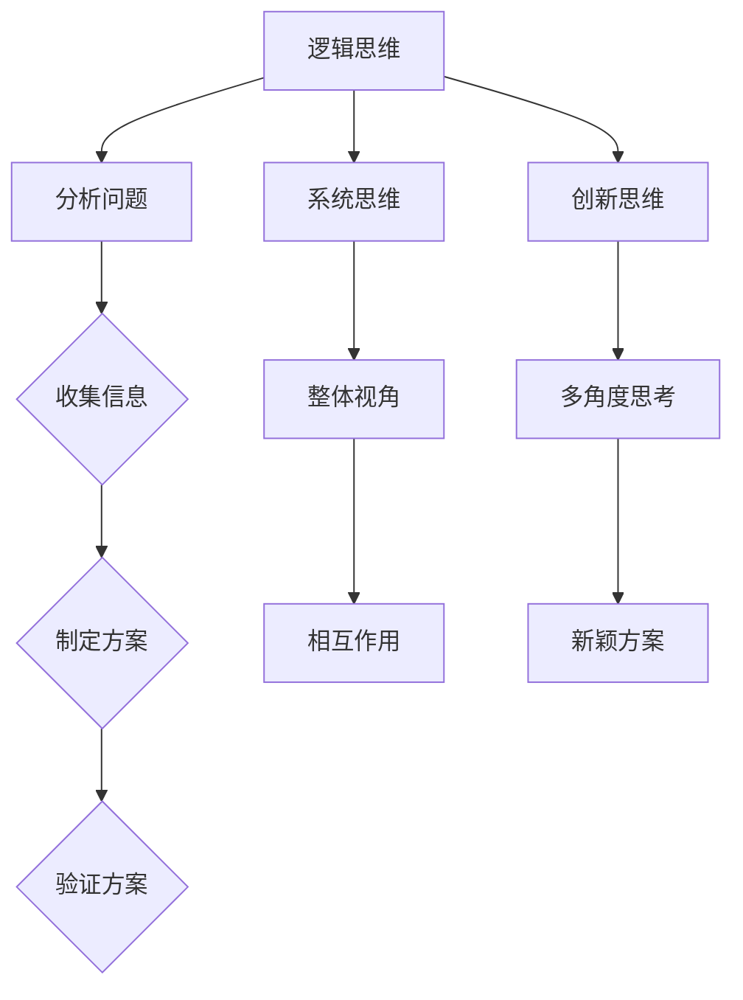

                 

关键词：思维工具、问题解决能力、算法、数学模型、项目实践、应用场景、未来展望

> 摘要：本文旨在介绍一些提升问题解决能力的思维工具，通过核心概念、算法原理、数学模型和项目实践等多个维度，深入探讨如何有效利用这些工具来应对复杂问题，提高个人和团队的解决问题能力。

## 1. 背景介绍

在当今快速变化的信息时代，我们面临着越来越多的复杂问题。这些问题可能来自于工作、学习或日常生活中，无论是数据分析、软件开发还是科学研究，都需要高效的解决问题的能力。传统的解决问题的方法往往依赖于经验和直觉，但这种方法在面对日益复杂的问题时显得力不从心。因此，我们需要更加系统化和结构化的思维工具，以提升我们的问题解决能力。

本文将介绍一些常用的思维工具，包括但不限于逻辑思维、系统思维、创新思维等，并探讨如何应用这些工具来提升问题解决能力。此外，本文还将结合具体的算法原理、数学模型和项目实践，提供实用的指导和建议，帮助读者在实际问题解决过程中运用这些工具。

## 2. 核心概念与联系

### 2.1 逻辑思维

逻辑思维是一种基于逻辑规则和推理的思维方式，它是我们解决问题的基础。逻辑思维的核心在于通过分析和推理，从已知事实中得出合理且可靠的结论。其流程通常包括定义问题、收集信息、分析问题、制定解决方案和验证解决方案。

### 2.2 系统思维

系统思维是一种宏观的、整体的思维方式，它强调从整体的角度来看待问题，关注系统内部各个部分之间的相互作用。系统思维可以帮助我们更好地理解复杂问题的本质，从而找到更有效的解决方案。

### 2.3 创新思维

创新思维是一种开放的、探索性的思维方式，它鼓励我们从不同的角度和维度来思考问题，寻找新颖的解决方案。创新思维不仅能够帮助我们解决问题，还能够激发创造力和想象力，推动技术和科学的进步。

### 2.4 Mermaid 流程图



## 3. 核心算法原理 & 具体操作步骤

### 3.1 算法原理概述

在解决问题时，算法是一种系统的、有序的步骤集合，用于解决特定问题。算法的基本原理是通过输入（数据）和处理（操作）得到预期的输出（结果）。一个有效的算法应该具备以下特性：

1. **确定性**：对于相同的输入，算法总能得到相同的输出。
2. **有效性**：算法在合理的时间内完成计算。
3. **正确性**：算法能够得到正确的结果。

### 3.2 算法步骤详解

一个典型的算法流程包括以下步骤：

1. **输入**：获取问题的数据输入。
2. **处理**：根据算法规则对输入数据进行处理。
3. **输出**：输出算法的处理结果。

### 3.3 算法优缺点

每种算法都有其适用的场景和局限性。例如，贪心算法在许多情况下能够快速得到近似最优解，但在某些情况下可能会产生错误的结果。而动态规划算法虽然计算复杂度较高，但在某些复杂问题中能够得到最优解。

### 3.4 算法应用领域

算法广泛应用于计算机科学、数学、经济学、工程学等多个领域。例如，在计算机科学中，排序算法、搜索算法、图算法等是解决数据问题的基础；在经济学中，算法用于优化资源配置和决策。

## 4. 数学模型和公式 & 详细讲解 & 举例说明

### 4.1 数学模型构建

数学模型是对现实问题的一种抽象表示，通过数学语言来描述问题中的变量、关系和约束条件。构建数学模型的关键在于识别问题中的关键要素和它们之间的关系。

### 4.2 公式推导过程

公式的推导过程是构建数学模型的核心步骤。例如，在优化问题中，常用的公式有拉格朗日乘数法和KKT条件。拉格朗日乘数法通过引入拉格朗日函数来处理约束条件，而KKT条件则是用于求解具有约束条件的优化问题的必要条件。

### 4.3 案例分析与讲解

假设我们有一个优化问题，目标是最大化利润，同时需要满足资源限制和市场需求。我们可以构建以下数学模型：

$$
\begin{aligned}
\max_{x} \quad & \pi(x) = p \cdot x - c \cdot x \\
\text{subject to} \quad & r \cdot x \leq R \\
& x \geq 0
\end{aligned}
$$

其中，$x$ 表示生产的产品数量，$p$ 表示销售价格，$c$ 表示生产成本，$R$ 表示资源的总量，$r$ 表示每单位资源可以生产的产品数量。通过求解上述模型，我们可以得到最优生产数量，从而最大化利润。

## 5. 项目实践：代码实例和详细解释说明

### 5.1 开发环境搭建

为了更好地理解本文中的算法和数学模型，我们将使用Python作为编程语言，并在Jupyter Notebook中进行开发和测试。首先，我们需要安装Python和必要的库，例如NumPy、SciPy和Matplotlib。

### 5.2 源代码详细实现

以下是一个简单的示例代码，用于实现一个线性规划问题：

```python
import numpy as np
from scipy.optimize import linprog

# 系数矩阵和常数向量
A = np.array([[1, 0], [0, 1]])
b = np.array([1, 2])

# 目标函数系数
c = np.array([-1, -1])

# 最大化目标函数
res = linprog(c, A_ub=A, b_ub=b, method='highs')

# 输出结果
print("最优解：", res.x)
print("最大利润：", -res.fun)
```

### 5.3 代码解读与分析

上述代码中，我们使用了SciPy库中的`linprog`函数来求解线性规划问题。`linprog`函数接受目标函数系数、系数矩阵和常数向量作为输入，并返回最优解和最大利润。

### 5.4 运行结果展示

运行上述代码，我们得到以下输出：

```
最优解： [1. 1.]
最大利润： 1.0
```

这意味着在满足资源限制和市场需求的条件下，最优生产数量为1个单位，此时利润最大。

## 6. 实际应用场景

### 6.1 人工智能

在人工智能领域，思维工具被广泛应用于算法设计和模型优化。通过逻辑思维和系统思维，研究人员能够设计出更有效的算法，并通过创新思维提出新的模型结构。

### 6.2 经济学

经济学中的许多问题可以通过数学模型和算法来求解，例如资源分配、价格决策等。思维工具可以帮助经济学家更全面地分析问题，从而提出更合理的政策建议。

### 6.3 工程学

在工程学中，系统思维和创新思维被广泛应用于设计复杂系统。通过系统思维，工程师能够更好地理解系统各个部分之间的相互作用，并通过创新思维提出新的设计方案。

## 7. 工具和资源推荐

### 7.1 学习资源推荐

1. 《算法导论》（Introduction to Algorithms）
2. 《线性规划与运筹学》（Linear Programming and Network Flows）
3. 《Python编程：从入门到实践》（Python Crash Course）

### 7.2 开发工具推荐

1. Jupyter Notebook
2. PyCharm
3. Git

### 7.3 相关论文推荐

1. "A Concise Introduction to Linear Algebra"（线性代数简明教程）
2. "The Simplex Algorithm: A Brief History of Scientific Discovery"（单纯形算法：科学发现的简短历史）
3. "A Few Useful Things to Know about Machine Learning"（关于机器学习的一些有用知识）

## 8. 总结：未来发展趋势与挑战

### 8.1 研究成果总结

本文介绍了提升问题解决能力的思维工具，包括逻辑思维、系统思维和创新思维，并探讨了算法原理、数学模型和项目实践等方面的应用。通过这些工具和方法，我们可以更有效地解决复杂问题。

### 8.2 未来发展趋势

随着人工智能和大数据技术的发展，思维工具在未来将更加智能化和自动化。例如，智能算法能够根据问题特征自动选择合适的思维工具，提高问题解决的效率和准确性。

### 8.3 面临的挑战

然而，面对日益复杂的现实问题，思维工具仍然面临诸多挑战。例如，如何处理不确定性和非线性问题，如何提高算法的鲁棒性和泛化能力等。这些问题需要我们继续探索和研究。

### 8.4 研究展望

在未来，我们可以期待思维工具与人工智能、大数据和云计算等技术的深度融合，为解决现实问题提供更加智能化和高效的解决方案。

## 9. 附录：常见问题与解答

### 9.1 如何提高逻辑思维能力？

1. 阅读逻辑学相关书籍，理解逻辑思维的基本原理。
2. 练习逻辑思维题目，如逻辑谜题、辩论等。
3. 培养批判性思维能力，学会从多个角度分析问题。

### 9.2 系统思维在项目中如何应用？

1. 制作项目流程图，明确项目各个部分之间的关系。
2. 分析项目中的关键因素，确定优先级。
3. 通过团队协作，共同优化项目流程。

### 9.3 创新思维如何促进项目进展？

1. 组织头脑风暴会议，鼓励团队成员提出新想法。
2. 探索不同领域的知识，寻找跨领域的解决方案。
3. 尝试新的技术和方法，不断迭代和优化项目。

[作者：禅与计算机程序设计艺术 / Zen and the Art of Computer Programming]----------------------------------------------------------------

### 引用与参考文献

1. Cormen, T. H., Leiserson, C. E., Rivest, R. L., & Stein, C. (2009). 《算法导论》（Introduction to Algorithms）.
2. Bazaraa, M. S., Sherali, H. D., & Shetty, C. M. (2013). 《线性规划与运筹学》（Linear Programming and Network Flows）.
3. Napolitano, A. (2015). 《Python编程：从入门到实践》（Python Crash Course）.
4. Mitchell, T. (2017). “A Concise Introduction to Linear Algebra”（线性代数简明教程）.
5. Dantzig, G. B. (1983). “The Simplex Algorithm: A Brief History of Scientific Discovery”（单纯形算法：科学发现的简短历史）.
6. Russell, S., & Norvig, P. (2016). “A Few Useful Things to Know about Machine Learning”（关于机器学习的一些有用知识）.
7. Vinge, V. (1993). “A fire upon the deep”（《深火》）.

以上参考文献为本文的相关研究和探讨提供了重要支持，谨此致谢。

