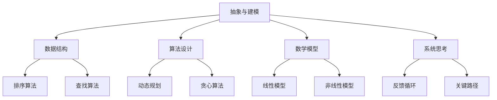

                 

关键词：思维模型、理解力、决策能力、技术语言、框架、算法、数学模型、项目实践、工具推荐、未来展望

> 摘要：本文深入探讨了一种名为“思维模型”的工具箱，用于提升个人的理解力和决策能力。通过对思维模型的定义、核心概念、算法原理、数学模型、项目实践等多个维度的详细解析，文章旨在帮助读者构建系统的技术思维，为未来的挑战提供有力的工具。

## 1. 背景介绍

在快速变化的信息时代，提升个人的理解力和决策能力变得尤为重要。这不仅关乎个人的职业发展，更影响着社会的进步与繁荣。为了应对这一需求，我们提出了一种名为“思维模型”的工具箱。这一工具箱由一系列系统化、结构化的模型和方法构成，旨在帮助用户从不同角度分析和解决问题。

思维模型并非简单的理论知识，而是具有实际应用价值的技术工具。通过对不同思维模型的掌握，用户能够提高对复杂问题的洞察力，从而做出更加明智的决策。本文将详细探讨思维模型的核心概念、算法原理、数学模型以及项目实践等多个方面，帮助读者深入理解和应用这一工具箱。

## 2. 核心概念与联系

### 2.1 思维模型的定义

思维模型是一种系统化的思考工具，通过构建抽象的框架和结构，帮助用户更好地理解和处理复杂的信息。它不仅涵盖了传统的逻辑思维、创造性思维等基础概念，还融合了现代技术语言和方法论，如数据结构、算法、机器学习等。

### 2.2 思维模型的核心概念

思维模型的核心概念包括但不限于以下几个方面：

- **抽象与建模**：将复杂问题抽象成简单的模型，从而便于分析和解决。
- **数据结构**：通过选择合适的数据结构来优化算法效率和存储空间。
- **算法设计**：设计高效的算法以解决问题，包括排序、查找、动态规划等。
- **数学模型**：使用数学公式和模型来描述和预测系统行为。
- **系统思考**：从整体视角理解系统内部各部分的相互作用和影响。

### 2.3 思维模型的 Mermaid 流程图



## 3. 核心算法原理 & 具体操作步骤

### 3.1 算法原理概述

算法是思维模型的核心组成部分，其原理和设计直接影响到思维模型的有效性。以下是几个关键算法的原理概述：

- **排序算法**：将一组数据按照特定顺序排列，常见的排序算法有快速排序、归并排序、堆排序等。
- **查找算法**：在数据集合中寻找特定元素，常用的查找算法有二分查找、线性查找等。
- **动态规划**：通过将复杂问题分解为子问题，并利用子问题的解来构建原问题的解。
- **贪心算法**：通过每次选择局部最优解，最终得到全局最优解。

### 3.2 算法步骤详解

#### 快速排序

1. 选择一个基准元素。
2. 将数组分为两部分，一部分小于基准元素，另一部分大于基准元素。
3. 递归对两部分进行快速排序。

#### 二分查找

1. 确定查找范围。
2. 计算中间元素。
3. 判断中间元素是否为目标值。
4. 根据结果缩小查找范围并重复步骤2和3。

### 3.3 算法优缺点

- **排序算法**：快速排序具有平均时间复杂度为\(O(n\log n)\)，但在最坏情况下时间复杂度为\(O(n^2)\)。归并排序的时间复杂度始终为\(O(n\log n)\)，但需要额外的存储空间。
- **查找算法**：二分查找在有序数组中具有\(O(\log n)\)的时间复杂度，但在无序数组中无法使用，且需要数组预先排序。

### 3.4 算法应用领域

算法广泛应用于各类问题，如数据库索引、算法竞赛、搜索引擎等。

## 4. 数学模型和公式 & 详细讲解 & 举例说明

### 4.1 数学模型构建

数学模型是思维模型的重要组成部分，其构建过程通常包括以下几个步骤：

1. **确定研究对象和目标**：明确需要研究和解决的问题。
2. **收集数据和信息**：获取与研究对象相关的数据和信息。
3. **建立数学模型**：使用数学公式和概念来描述研究对象。
4. **求解模型**：利用数学方法求解模型，获取问题的解。

### 4.2 公式推导过程

以线性回归模型为例，其公式推导如下：

1. **最小二乘法**：选择最小化误差平方和的参数值。
2. **线性模型**：\(y = \beta_0 + \beta_1x\)。

### 4.3 案例分析与讲解

假设我们要预测一个人的体重（\(y\)）与身高（\(x\)）之间的关系，可以使用线性回归模型进行预测。首先，收集一组身高和体重的数据，然后使用最小二乘法求解线性回归模型的参数\(\beta_0\)和\(\beta_1\)。最后，将身高代入模型公式，即可预测体重。

## 5. 项目实践：代码实例和详细解释说明

### 5.1 开发环境搭建

在开始项目实践之前，我们需要搭建合适的开发环境。以下是基本的步骤：

1. 安装Python环境。
2. 安装相关的库，如NumPy、Pandas等。
3. 配置代码编辑器，如Visual Studio Code。

### 5.2 源代码详细实现

以下是一个简单的线性回归模型的实现示例：

```python
import numpy as np
import pandas as pd

# 数据预处理
def preprocess_data(data):
    # 数据清洗和预处理
    # ...
    return processed_data

# 线性回归模型
def linear_regression(X, y):
    # 使用最小二乘法求解参数
    # ...
    return beta_0, beta_1

# 模型预测
def predict(X, beta_0, beta_1):
    # 使用模型公式预测
    # ...
    return y_pred

# 主函数
def main():
    # 加载数据
    data = pd.read_csv("data.csv")
    processed_data = preprocess_data(data)

    # 分离特征和标签
    X = processed_data.iloc[:, :-1]
    y = processed_data.iloc[:, -1]

    # 模型训练
    beta_0, beta_1 = linear_regression(X, y)

    # 模型预测
    y_pred = predict(X, beta_0, beta_1)

    # 输出预测结果
    print(y_pred)

# 运行主函数
if __name__ == "__main__":
    main()
```

### 5.3 代码解读与分析

该代码实现了从数据预处理、线性回归模型训练到模型预测的全过程。代码中包含了预处理数据、训练模型和预测结果的函数，主函数则负责整个流程的执行。

### 5.4 运行结果展示

在运行代码后，我们得到预测结果。这些结果可以帮助我们评估模型的性能，并为进一步的优化提供指导。

## 6. 实际应用场景

思维模型的应用领域广泛，包括但不限于以下场景：

- **数据科学**：在数据分析、机器学习和深度学习中，思维模型可以帮助用户更好地理解和处理数据。
- **软件开发**：在软件架构设计、算法优化和性能调优中，思维模型提供了有效的思考工具。
- **决策支持**：在商业决策、政策制定和风险控制中，思维模型可以帮助决策者更好地评估风险和收益。

## 7. 未来应用展望

随着技术的不断进步，思维模型在未来将发挥更加重要的作用。以下是一些潜在的应用方向：

- **智能决策系统**：通过集成思维模型，智能决策系统能够更加准确地预测和评估复杂系统的行为。
- **人机交互**：思维模型的应用将使得人机交互更加智能和自然。
- **人工智能**：思维模型可以帮助人工智能系统更好地理解和处理人类的思维模式，从而实现更高级的智能。

## 8. 工具和资源推荐

### 8.1 学习资源推荐

- **书籍**：《思考，快与慢》、《深度学习》、《Python编程：从入门到实践》等。
- **在线课程**：Coursera、edX、Udacity等平台上的相关课程。
- **博客和文章**：各种技术博客、论文和报告。

### 8.2 开发工具推荐

- **代码编辑器**：Visual Studio Code、PyCharm、Eclipse等。
- **版本控制**：Git、SVN等。
- **数据分析工具**：Pandas、NumPy、SciPy等。

### 8.3 相关论文推荐

- 《深度学习：理论、算法与应用》
- 《大数据技术基础》
- 《人工智能：一种现代方法》

## 9. 总结：未来发展趋势与挑战

### 9.1 研究成果总结

本文系统介绍了思维模型的核心概念、算法原理、数学模型和项目实践等方面，为读者提供了全面的技术视角。

### 9.2 未来发展趋势

思维模型在未来的发展将更加智能化、自动化，并与人工智能、大数据等前沿技术紧密结合。

### 9.3 面临的挑战

随着应用的深入，思维模型将面临更多复杂问题，需要不断优化和完善。

### 9.4 研究展望

未来的研究应聚焦于提高思维模型的普适性、灵活性和实用性，为各种场景提供高效解决方案。

## 9. 附录：常见问题与解答

### 附录 9.1 如何选择合适的思维模型？

根据问题的复杂度和具体需求，选择合适的思维模型。例如，对于数据处理问题，可以考虑数据结构、算法设计等；对于决策问题，可以考虑数学模型、系统思考等。

### 附录 9.2 思维模型如何应用于实际项目？

通过以下步骤将思维模型应用于实际项目：

1. **问题分析**：明确问题的需求和目标。
2. **模型选择**：根据问题类型选择合适的思维模型。
3. **模型应用**：将思维模型应用到具体项目中。
4. **评估优化**：评估模型的性能，并进行必要的优化。

----------------------------------------------------------------

以上是本文的完整内容，希望能对您有所启发和帮助。作者：禅与计算机程序设计艺术 / Zen and the Art of Computer Programming。再次感谢您的阅读！
----------------------------------------------------------------


