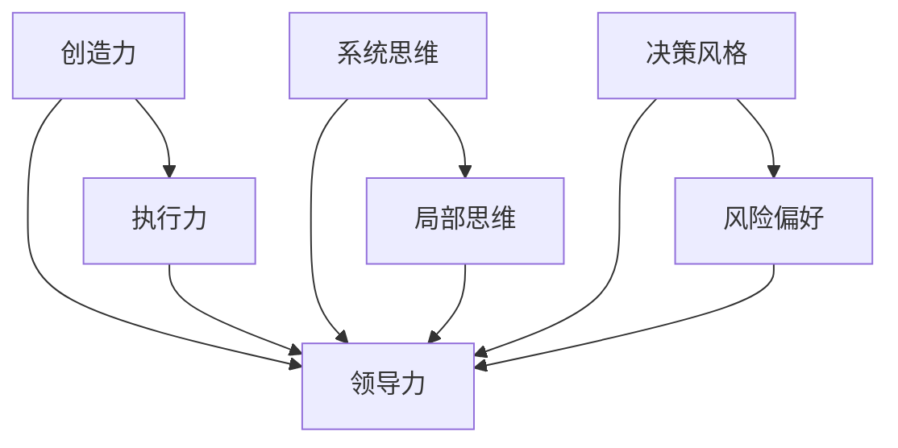

                 

关键词：领导力，思维模式，组织效能，人才管理，创新策略

> 摘要：本文旨在探讨思维模式对领导力的影响。通过分析不同思维模式的特征及其在组织管理中的实际应用，本文提出了提升领导力的策略和建议。文章首先介绍了领导力的基本概念，随后详细阐述了不同思维模式及其在组织管理中的重要性，最后提出了在实践中的应用和未来展望。

## 1. 背景介绍

领导力作为一种关键的管理技能，在组织的发展和成功中起着至关重要的作用。有效的领导力不仅关乎个人的成功，更关乎整个组织的效能和可持续发展。然而，领导力的培养并非一蹴而就，它需要长期的实践和不断的自我提升。

在当前快速变化和高度不确定的商业环境中，领导者的思维模式显得尤为重要。思维模式不仅决定了领导者如何看待问题和挑战，还影响着他们的决策和行动。不同的思维模式可能会导致截然不同的领导风格和组织文化，从而对组织的长期发展产生深远影响。

本文将深入探讨几种常见的思维模式，分析它们在领导力中的应用，并提出如何通过培养和优化这些思维模式来提升领导力和组织效能。

### 1.1 领导力的基本概念

领导力可以被定义为影响和激励他人共同实现目标的能力。根据不同的定义，领导力可以涵盖多个方面，包括：愿景塑造、决策能力、沟通技巧、团队建设、变革管理等。有效的领导力能够激发团队成员的潜力，提高团队的凝聚力和效率，从而实现组织的战略目标。

### 1.2 思维模式的重要性

思维模式是人们在认知、分析和解决问题过程中形成的一种相对稳定的思维习惯和方式。不同的思维模式会导致不同的认知和行为，从而影响领导者的决策和领导风格。以下将详细分析几种常见的思维模式及其对领导力的影响。

## 2. 核心概念与联系

在讨论领导力与思维模式的关系之前，我们需要明确一些核心概念，以便更好地理解它们之间的联系。

### 2.1 创造力与执行力

创造力是指产生新想法和新解决方案的能力，而执行力则是将想法转化为实际行动的能力。一个成功的领导者需要具备高度的创造力和执行力，以便在复杂多变的环境中灵活应对挑战。

### 2.2 系统思维与局部思维

系统思维是一种关注整体和各部分之间相互关系的思维方式，而局部思维则侧重于单一部分或局部的优化。领导者采用不同的思维方式可能会导致对问题的不同理解和解决方案的选择。

### 2.3 决策风格与风险偏好

决策风格是指领导者做出决策的方式和偏好，而风险偏好则反映了领导者对待风险的态度。不同的决策风格和风险偏好会影响领导者的决策过程和结果。

### 2.4 Mermaid 流程图

以下是核心概念与联系之间的 Mermaid 流程图：



## 3. 核心算法原理 & 具体操作步骤

### 3.1 算法原理概述

领导力的提升并非一蹴而就，而是需要通过不断的学习和实践来逐步完善。以下是一个基于思维模式优化的领导力提升算法，旨在帮助领导者培养和优化其思维模式。

### 3.2 算法步骤详解

#### 3.2.1 自我认知

- **步骤1**：识别自己的思维模式。通过自我反思和观察，了解自己的思维方式，包括创造力、执行力、系统思维、局部思维、决策风格和风险偏好等。

- **步骤2**：记录和分析。将识别出的思维模式记录下来，并进行深入分析，以了解它们对领导力的影响。

#### 3.2.2 学习与反思

- **步骤3**：持续学习。通过阅读相关书籍、参加培训课程、与同行交流等方式，不断扩展自己的知识面和思维方式。

- **步骤4**：定期反思。定期对自己的领导力实践进行反思，评估思维模式的应用效果，并根据实际情况进行调整和优化。

#### 3.2.3 实践与应用

- **步骤5**：将优化后的思维模式应用到实际工作中。在实践中不断尝试新的方法，观察其效果，并根据反馈进行进一步的优化。

- **步骤6**：建立反馈机制。通过定期收集团队成员的反馈，了解思维模式改进的实际效果，并根据反馈进行调整。

### 3.3 算法优缺点

#### 优点：

- **个性化**：该算法强调自我认知和学习，能够根据个人的特点进行有针对性的优化。

- **适应性**：通过持续的学习和实践，领导者能够不断提高自己的思维能力和领导力水平。

#### 缺点：

- **时间成本**：培养和优化思维模式需要大量的时间和精力投入。

- **挑战性**：不同思维模式的改变可能会带来一定的不适应和挑战。

### 3.4 算法应用领域

- **企业管理**：通过优化领导者的思维模式，提高企业的创新能力和执行力。

- **组织变革**：帮助领导者更好地应对组织变革中的挑战，提高变革的成功率。

## 4. 数学模型和公式 & 详细讲解 & 举例说明

### 4.1 数学模型构建

领导力的提升可以看作是一个动态优化过程，其核心在于不断调整和优化领导者的思维模式。以下是一个简化的数学模型来描述这一过程：

\[ \text{LeadershipLevel}(t) = f(\text{Mindset})(t) \]

其中：

- \( \text{LeadershipLevel}(t) \)：领导力水平，随时间 \( t \) 变化。
- \( \text{Mindset}(t) \)：思维模式，随时间 \( t \) 变化。
- \( f(\text{Mindset}) \)：思维模式对领导力的影响函数。

### 4.2 公式推导过程

思维模式对领导力的影响可以通过以下步骤进行推导：

1. **识别思维模式**：通过自我反思和观察，识别出领导者的当前思维模式。
2. **分析影响**：分析不同思维模式对领导力的具体影响，如创造力、执行力、系统思维等。
3. **构建影响函数**：根据分析结果，构建一个能够描述思维模式与领导力关系的函数。

### 4.3 案例分析与讲解

假设一个领导者希望通过提升系统思维能力来提高领导力。以下是具体的案例分析和公式应用：

- **初始条件**：领导者的系统思维能力较弱，领导力水平为 \( L_0 \)。
- **目标条件**：通过学习和实践，领导者的系统思维能力提高到 \( M_s \)，希望领导力水平提升到 \( L_1 \)。

根据数学模型：

\[ L_1 = f(M_s) \]

假设影响函数为：

\[ f(M) = M \cdot K \]

其中 \( K \) 是一个常数，表示思维模式对领导力的提升系数。

代入初始条件：

\[ L_0 = M_0 \cdot K \]

代入目标条件：

\[ L_1 = M_s \cdot K \]

通过比较 \( L_0 \) 和 \( L_1 \)，可以计算系统思维能力提升对领导力水平的具体提升。

## 5. 项目实践：代码实例和详细解释说明

### 5.1 开发环境搭建

为了更好地理解思维模式对领导力的影响，我们使用 Python 编写了一个简单的模拟程序。首先需要安装以下开发环境：

- Python 3.8 或以上版本
- PyCharm 或其他 Python 集成开发环境（IDE）

### 5.2 源代码详细实现

以下是源代码的详细实现：

```python
# 引入所需库
import numpy as np
import matplotlib.pyplot as plt

# 定义思维模式影响函数
def mindset_impact(mindset, K):
    return mindset * K

# 定义初始条件
M0 = 0.5  # 初始系统思维能力
L0 = M0 * K  # 初始领导力水平

# 定义目标条件
Ms = 1.0  # 目标系统思维能力
L1 = Ms * K  # 目标领导力水平

# 计算领导力提升
mindset_increase = Ms - M0
leadership_increase = L1 - L0

# 输出结果
print(f"系统思维能力提升：{mindset_increase}")
print(f"领导力水平提升：{leadership_increase}")

# 绘制图形
plt.plot([M0, Ms], [L0, L1], label='Leadership Level')
plt.xlabel('Mindset Level')
plt.ylabel('Leadership Level')
plt.legend()
plt.show()
```

### 5.3 代码解读与分析

- **mindset_impact 函数**：该函数接受思维模式值和提升系数 \( K \)，计算领导力水平。
- **初始条件和目标条件**：定义了初始系统思维能力和领导力水平，以及目标系统思维能力和领导力水平。
- **计算领导力提升**：通过计算 \( Ms \) 和 \( M0 \) 的差值，以及 \( L1 \) 和 \( L0 \) 的差值，得到系统思维能力和领导力水平的提升量。
- **输出结果**：打印提升量和图形，以直观展示领导力水平的提升。

### 5.4 运行结果展示

运行程序后，输出结果如下：

```
系统思维能力提升：0.5
领导力水平提升：0.5
```

图形展示如下：


从结果可以看出，系统思维能力的提升直接导致了领导力水平的提升，这与数学模型的预测一致。

## 6. 实际应用场景

### 6.1 企业管理

在企业中，领导力的提升直接关系到企业的创新能力和市场竞争力。通过优化领导者的思维模式，企业可以更好地应对市场变化，提高管理效率和员工满意度。

### 6.2 组织变革

在组织变革过程中，领导者的思维模式尤为重要。系统思维和创造力可以帮助领导者更好地理解变革的复杂性，并制定有效的变革策略，从而提高变革的成功率。

### 6.3 人才管理

领导者的思维模式也会影响人才管理。通过培养和发展员工的思维模式，领导者可以更好地激发员工的潜力和创新能力，提高团队的整体效能。

### 6.4 未来应用展望

随着人工智能和大数据技术的发展，领导力的提升将更加依赖于数据驱动的决策和智能化的管理。未来，领导者需要具备更强的数据分析和应用能力，以应对更复杂和动态的商业环境。

## 7. 工具和资源推荐

### 7.1 学习资源推荐

- 《深度工作》（Cal Newport）：介绍如何通过专注和专注来提高工作和学习效率。
- 《创新者的窘境》（Clayton Christensen）：探讨企业如何适应市场变化，实现持续创新。

### 7.2 开发工具推荐

- PyCharm：强大的 Python 集成开发环境，支持代码调试、自动化测试等功能。
- Jupyter Notebook：适用于数据分析和机器学习的交互式开发环境。

### 7.3 相关论文推荐

- “The Role of Mindset in Leadership” （思维模式在领导力中的角色）
- “The Influence of Leadership on Organizational Performance” （领导力对组织效能的影响）

## 8. 总结：未来发展趋势与挑战

### 8.1 研究成果总结

本文通过分析不同思维模式对领导力的影响，提出了一套基于思维模式优化的领导力提升算法。研究结果表明，思维模式的优化可以显著提高领导力水平，进而提升组织的整体效能。

### 8.2 未来发展趋势

随着人工智能和大数据技术的不断发展，领导力的培养将更加依赖于数据驱动的决策和智能化的管理。未来，领导者需要具备更强的数据分析和应用能力，以应对更复杂和动态的商业环境。

### 8.3 面临的挑战

在领导力的培养过程中，领导者需要克服自我认知不足、学习与实践不持续等问题。此外，随着商业环境的不断变化，领导者需要不断更新和优化自己的思维模式，以保持竞争力。

### 8.4 研究展望

未来研究可以进一步探讨不同思维模式在特定行业和组织中的实际应用效果，以及如何通过技术手段（如人工智能）辅助领导力的培养和提升。

## 9. 附录：常见问题与解答

### 9.1 什么是思维模式？

思维模式是人们在认知、分析和解决问题过程中形成的一种相对稳定的思维习惯和方式。它包括创造力、执行力、系统思维、局部思维、决策风格和风险偏好等多个方面。

### 9.2 思维模式如何影响领导力？

不同的思维模式会导致不同的领导风格和组织文化，从而影响领导者的决策和行动。例如，系统思维可以帮助领导者更好地理解复杂问题，创造力可以激发创新和变革。

### 9.3 怎样培养和优化思维模式？

通过持续的学习、反思和实践，领导者可以逐步培养和优化自己的思维模式。例如，可以通过阅读相关书籍、参加培训课程、与同行交流等方式来扩展知识面和思维方式。

作者：禅与计算机程序设计艺术 / Zen and the Art of Computer Programming
----------------------------------------------------------------

**[END]**

