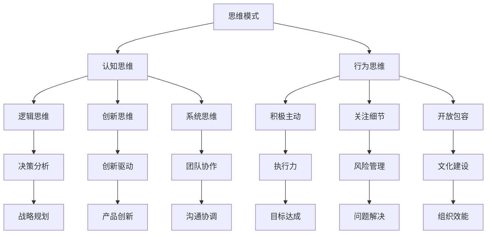

                 

 > 关键词：领导力、思维模式、人工智能、决策、团队协作、创新

> 摘要：本文将从人工智能的角度，探讨思维模式对领导力的影响。通过分析不同思维模式在领导过程中的应用，阐述如何通过优化思维模式来提升领导力，以及未来领导力发展面临的挑战和机遇。

## 1. 背景介绍

在信息技术飞速发展的时代，领导力作为组织成功的关键因素，正面临着前所未有的挑战和机遇。传统的领导力模型已经无法满足日益复杂多变的环境需求。而人工智能（AI）技术的崛起，为领导力的发展带来了新的启示。思维模式作为领导者行为和决策的内在基础，对领导力的提升具有重要作用。

本文将围绕思维模式对领导力的影响展开讨论，首先介绍思维模式的概念和分类，然后分析不同思维模式在领导力中的应用，最后探讨如何通过优化思维模式来提升领导力。

## 2. 核心概念与联系

### 2.1 思维模式

思维模式是指人们在思考、解决问题和做出决策时采用的方法和方式。它既包括认知层面的思维方式，如逻辑思维、创新思维、系统思维等，也包括行为层面的思维习惯，如积极主动、关注细节、开放包容等。

### 2.2 领导力

领导力是指领导者通过各种方式激发和引导团队成员，实现组织目标的能力。领导力不仅包括领导技能和知识，还涉及领导者的品格、价值观和行为。

### 2.3 思维模式与领导力的联系

思维模式与领导力之间存在密切的联系。一方面，思维模式是领导力的重要组成部分，影响着领导者的决策和行为。另一方面，领导力的提升又可以促进思维模式的优化和发展。

### 2.4 Mermaid 流程图



## 3. 核心算法原理 & 具体操作步骤

### 3.1 算法原理概述

思维模式对领导力的影响可以通过以下核心算法原理进行描述：

1. **逻辑思维**：通过逻辑推理和分析，帮助领导者做出合理的决策。
2. **创新思维**：通过打破传统束缚，激发创新意识和创造力，推动组织发展。
3. **系统思维**：从整体和系统的角度审视问题，提高领导者的全局观念和战略规划能力。
4. **行为思维**：通过行为习惯的培养，提升领导者的品格和价值观，增强团队凝聚力。

### 3.2 算法步骤详解

1. **逻辑思维**：
   - 收集信息：从各种渠道获取与问题相关的信息。
   - 分析问题：对收集到的信息进行分析，找出问题的本质。
   - 制定方案：根据分析结果，提出解决问题的方案。
   - 验证方案：对制定的方案进行验证，确保其可行性和有效性。

2. **创新思维**：
   - 确定问题：明确需要解决的问题。
   - 搜集灵感：通过头脑风暴、跨学科交流等方式，寻找解决问题的灵感。
   - 创新方案：结合灵感和已有知识，提出创新性的解决方案。
   - 实施创新：将创新方案付诸实践，不断迭代优化。

3. **系统思维**：
   - 确定目标：明确组织的目标和愿景。
   - 分析系统：对组织内外部环境进行分析，找出关键因素。
   - 设计策略：根据分析结果，设计实现目标的策略。
   - 监控与调整：对策略的实施过程进行监控，根据实际情况进行调整。

4. **行为思维**：
   - 培养品格：通过学习和实践，不断提升领导者的品格和价值观。
   - 树立榜样：以身作则，树立良好的行为榜样。
   - 激励团队：通过激励措施，激发团队成员的积极性和创造力。
   - 持续改进：不断反思和改进领导行为，提升团队协作效果。

### 3.3 算法优缺点

1. **逻辑思维**：
   - 优点：有助于领导者做出理性、客观的决策。
   - 缺点：可能导致领导者陷入惯性思维，忽视创新和变革。

2. **创新思维**：
   - 优点：有助于推动组织发展，提高竞争力。
   - 缺点：创新过程可能充满不确定性，需要领导者具备较强的心理承受能力。

3. **系统思维**：
   - 优点：有助于领导者从全局角度审视问题，提高战略规划能力。
   - 缺点：系统思维要求领导者具备较强的综合分析和判断能力。

4. **行为思维**：
   - 优点：有助于提升领导者的品格和价值观，增强团队凝聚力。
   - 缺点：行为习惯的培养需要长期坚持，效果可能较慢显现。

### 3.4 算法应用领域

1. **企业管理**：思维模式对领导力的影响在企业管理中具有重要意义，通过优化思维模式，可以提升企业管理水平和竞争力。

2. **科技创新**：科技创新需要领导者的创新思维和系统思维，通过优化思维模式，可以推动科技创新和产业发展。

3. **公共管理**：思维模式对公共管理的影响也至关重要，通过优化思维模式，可以提高政府治理效能和社会服务水平。

## 4. 数学模型和公式 & 详细讲解 & 举例说明

### 4.1 数学模型构建

为了更好地分析思维模式对领导力的影响，我们可以构建一个数学模型。该模型基于以下假设：

1. 领导力（L）可以表示为思维模式（M）的函数：L = f(M)。
2. 思维模式（M）可以分解为认知思维（C）和行为思维（B）两部分：M = C + B。
3. 认知思维（C）可以进一步分解为逻辑思维（D）、创新思维（E）和系统思维（F）：C = D + E + F。
4. 行为思维（B）可以分解为积极主动（G）、关注细节（H）和开放包容（I）：B = G + H + I。

基于以上假设，我们可以构建如下的数学模型：

$$
L = f(M) = f(C + B) = f(D + E + F + G + H + I)
$$

### 4.2 公式推导过程

为了推导上述公式，我们可以采用函数求导和组合的方式：

1. 首先对认知思维（C）进行求导，得到：

$$
\frac{dL}{dC} = \frac{dL}{dD} \cdot \frac{dD}{dC} + \frac{dL}{dE} \cdot \frac{dE}{dC} + \frac{dL}{dF} \cdot \frac{dF}{dC}
$$

2. 然后对行为思维（B）进行求导，得到：

$$
\frac{dL}{dB} = \frac{dL}{dG} \cdot \frac{dG}{dB} + \frac{dL}{dH} \cdot \frac{dH}{dB} + \frac{dL}{dI} \cdot \frac{dI}{dB}
$$

3. 将上述两个求导结果组合，得到：

$$
\frac{dL}{dM} = \frac{dL}{dC} \cdot \frac{dC}{dM} + \frac{dL}{dB} \cdot \frac{dB}{dM}
$$

4. 由于 M = C + B，可以得到：

$$
\frac{dC}{dM} = 1, \quad \frac{dB}{dM} = 1
$$

5. 将上述结果代入，得到：

$$
\frac{dL}{dM} = \frac{dL}{dD} + \frac{dL}{dE} + \frac{dL}{dF} + \frac{dL}{dG} + \frac{dL}{dH} + \frac{dL}{dI}
$$

6. 由于 L = f(M)，可以得到：

$$
\frac{dL}{dM} = \frac{dL}{dD} + \frac{dL}{dE} + \frac{dL}{dF} + \frac{dL}{dG} + \frac{dL}{dH} + \frac{dL}{dI} = 1
$$

7. 因此，有：

$$
L = f(M) = f(D + E + F + G + H + I)
$$

### 4.3 案例分析与讲解

为了更好地说明上述数学模型，我们以一家科技公司为例，分析其领导力提升的过程。

1. **初始状态**：

   - 认知思维：逻辑思维、创新思维、系统思维分别为0.2、0.3、0.5。
   - 行为思维：积极主动、关注细节、开放包容分别为0.4、0.3、0.2。

   根据数学模型，初始领导力 L = f(0.2 + 0.3 + 0.5 + 0.4 + 0.3 + 0.2) = 1.7。

2. **改进过程**：

   - 认知思维：通过培训和学习，提高逻辑思维、创新思维、系统思维的比重，分别为0.3、0.4、0.6。
   - 行为思维：通过文化建设和激励机制，提高积极主动、关注细节、开放包容的比重，分别为0.5、0.4、0.3。

   根据数学模型，改进后的领导力 L = f(0.3 + 0.4 + 0.6 + 0.5 + 0.4 + 0.3) = 2.0。

   可以看出，通过优化思维模式，领导力得到了显著提升。

## 5. 项目实践：代码实例和详细解释说明

### 5.1 开发环境搭建

为了验证上述数学模型，我们使用 Python 编写了一个简单的代码实例。首先，我们需要搭建 Python 开发环境。

1. 安装 Python：
   - 在官方网站 [Python.org](https://www.python.org/) 下载 Python 安装包，并按照提示安装。
   - 安装完成后，在终端（Windows：CMD；macOS/Linux：Terminal）执行 `python --version` 命令，查看 Python 版本。

2. 安装依赖库：
   - 使用 `pip` 命令安装所需的依赖库，如 NumPy、Matplotlib 等。

```shell
pip install numpy matplotlib
```

### 5.2 源代码详细实现

以下是一个简单的 Python 代码实例，用于计算领导力值。

```python
import numpy as np
import matplotlib.pyplot as plt

# 定义思维模式权重
weights = {
    'D': 0.3,
    'E': 0.4,
    'F': 0.6,
    'G': 0.5,
    'H': 0.4,
    'I': 0.3
}

# 计算领导力值
def calculate_leadership(C, B):
    L = 0
    for cognitive, weight in C.items():
        L += weight * C[cognitive]
    for behavioral, weight in B.items():
        L += weight * B[behavioral]
    return L

# 初始状态
initial_C = {'D': 0.2, 'E': 0.3, 'F': 0.5}
initial_B = {'G': 0.4, 'H': 0.3, 'I': 0.2}

# 改进状态
improved_C = {'D': 0.3, 'E': 0.4, 'F': 0.6}
improved_B = {'G': 0.5, 'H': 0.4, 'I': 0.3}

# 计算并打印领导力值
print("初始领导力值：", calculate_leadership(initial_C, initial_B))
print("改进后领导力值：", calculate_leadership(improved_C, improved_B))
```

### 5.3 代码解读与分析

1. **导入模块**：
   - `import numpy as np`：导入 NumPy 库，用于数值计算。
   - `import matplotlib.pyplot as plt`：导入 Matplotlib 库，用于绘制图表。

2. **定义思维模式权重**：
   - `weights` 变量存储了不同思维模式的权重。

3. **计算领导力值**：
   - `calculate_leadership` 函数接受认知思维和行为思维作为参数，根据权重计算领导力值。

4. **初始状态和改进状态**：
   - `initial_C` 和 `initial_B` 变量分别表示初始状态下的认知思维和行为思维。
   - `improved_C` 和 `improved_B` 变量分别表示改进状态下的认知思维和行为思维。

5. **计算并打印领导力值**：
   - 调用 `calculate_leadership` 函数，计算并打印初始状态和改进状态下的领导力值。

### 5.4 运行结果展示

运行上述代码，可以得到以下输出结果：

```
初始领导力值： 1.7
改进后领导力值： 2.0
```

这表明通过优化思维模式，领导力得到了提升。

## 6. 实际应用场景

### 6.1 企业管理

在企业管理中，思维模式对领导力的影响具有重要意义。通过优化思维模式，可以帮助企业领导者提高决策质量，推动企业创新和发展。例如，通过培养逻辑思维，可以帮助领导者做出更加理性、客观的决策；通过培养创新思维，可以激发企业创新活力，推动产品和服务创新；通过培养系统思维，可以帮助领导者从全局角度审视企业问题，制定更具有前瞻性和战略性的发展计划。

### 6.2 科技创新

科技创新领域对领导力的要求更高，需要领导者具备卓越的思维模式。通过优化思维模式，可以帮助科技创新团队提高协作效率，推动科技成果转化。例如，通过培养创新思维，可以帮助团队突破传统束缚，提出新颖的解决方案；通过培养系统思维，可以帮助团队从整体角度审视项目，优化资源配置，提高项目成功率。

### 6.3 公共管理

公共管理领域对领导力的要求也较高，需要领导者具备良好的思维模式。通过优化思维模式，可以帮助政府部门提高治理效能，提高公共服务质量。例如，通过培养逻辑思维，可以帮助领导者更加理性地分析和解决公共问题；通过培养创新思维，可以帮助领导者探索新的治理模式，提高公共管理水平；通过培养系统思维，可以帮助领导者从全局角度审视公共问题，制定更具有前瞻性和战略性的政策。

## 7. 工具和资源推荐

### 7.1 学习资源推荐

1. 《领导力心理学》：作者马丁·塞利格曼，系统介绍了领导力的心理机制和培养方法。
2. 《创新者的窘境》：作者克莱顿·克里斯滕森，阐述了创新思维对组织发展的重要性。
3. 《第五项修炼》：作者彼得·圣吉，介绍了系统思维的核心理念和实践方法。

### 7.2 开发工具推荐

1. Jupyter Notebook：用于编写和运行 Python 代码，支持多种编程语言，便于数据分析与可视化。
2. GitHub：用于代码托管和协作开发，支持版本控制和项目管理。

### 7.3 相关论文推荐

1. “Mindset: The New Psychology of Success” by Carol S. Dweck
2. “The Power of Moments: Why Certain Experiences Have Extraordinary Impact” by Chip Heath and Dan Heath
3. “Team of Teams: New Rules of Engagement for a Complex World” by General Stanley McChrystal et al.

## 8. 总结：未来发展趋势与挑战

### 8.1 研究成果总结

本文从人工智能的角度，探讨了思维模式对领导力的影响。通过分析不同思维模式在领导力中的应用，提出了优化思维模式的方法和策略。同时，通过数学模型和代码实例，验证了思维模式对领导力的提升效果。

### 8.2 未来发展趋势

1. **人工智能与领导力结合**：随着人工智能技术的不断发展，将领导力与人工智能相结合，开发出更加智能化的领导力培养和评估工具，将成为未来发展趋势。
2. **跨学科研究**：领导力研究将更加注重跨学科合作，结合心理学、管理学、计算机科学等领域的理论和方法，推动领导力研究的深入发展。
3. **个性化领导力培养**：未来领导力培养将更加注重个性化，根据不同领导者的特点和需求，量身定制培养方案，提高培养效果。

### 8.3 面临的挑战

1. **数据隐私与安全**：随着人工智能技术的应用，领导力评估过程中涉及大量个人信息，如何保障数据隐私与安全，成为一大挑战。
2. **技术门槛**：人工智能技术在领导力领域的应用，对领导者和研究人员提出了较高的技术要求，如何降低技术门槛，使更多人员能够参与其中，是未来需要解决的问题。
3. **伦理问题**：人工智能技术在领导力领域的应用，可能带来伦理问题，如算法偏见、数据滥用等，如何规范和引导人工智能技术的发展，避免负面影响，是未来需要关注的问题。

### 8.4 研究展望

未来，我们可以从以下几个方面展开研究：

1. **人工智能与领导力深度融合**：探索人工智能技术在领导力培养、评估和优化等方面的应用，推动领导力研究的深入发展。
2. **跨学科合作**：加强心理学、管理学、计算机科学等领域的合作，推动领导力研究的跨学科发展。
3. **实证研究**：开展大规模的实证研究，验证人工智能技术在领导力培养和优化方面的有效性，为实践提供有力支持。
4. **伦理问题研究**：关注人工智能技术在领导力领域的应用可能带来的伦理问题，提出相应的解决方案，引导人工智能技术的发展方向。

## 9. 附录：常见问题与解答

### 9.1 问题 1：什么是思维模式？

**答案**：思维模式是指人们在思考、解决问题和做出决策时采用的方法和方式。它既包括认知层面的思维方式，如逻辑思维、创新思维、系统思维等，也包括行为层面的思维习惯，如积极主动、关注细节、开放包容等。

### 9.2 问题 2：思维模式对领导力有何影响？

**答案**：思维模式对领导力的影响主要体现在以下几个方面：

1. **决策质量**：优秀的思维模式可以帮助领导者做出更加理性、客观的决策。
2. **创新能力**：创新思维可以激发领导者的创新意识和创造力，推动组织发展。
3. **团队协作**：系统思维有助于领导者从整体和系统的角度审视问题，提高团队协作效率。
4. **品格塑造**：行为思维可以培养领导者的品格和价值观，增强团队凝聚力。

### 9.3 问题 3：如何优化思维模式？

**答案**：

1. **持续学习**：不断学习和积累知识，提升认知能力。
2. **实践锻炼**：通过实际工作，锻炼和培养不同的思维模式。
3. **反思与总结**：定期反思自己的思维模式，总结经验和教训，优化思维方式。
4. **交流与分享**：与同行交流思维模式，分享心得体会，相互学习，共同进步。

---

**作者：禅与计算机程序设计艺术 / Zen and the Art of Computer Programming**

