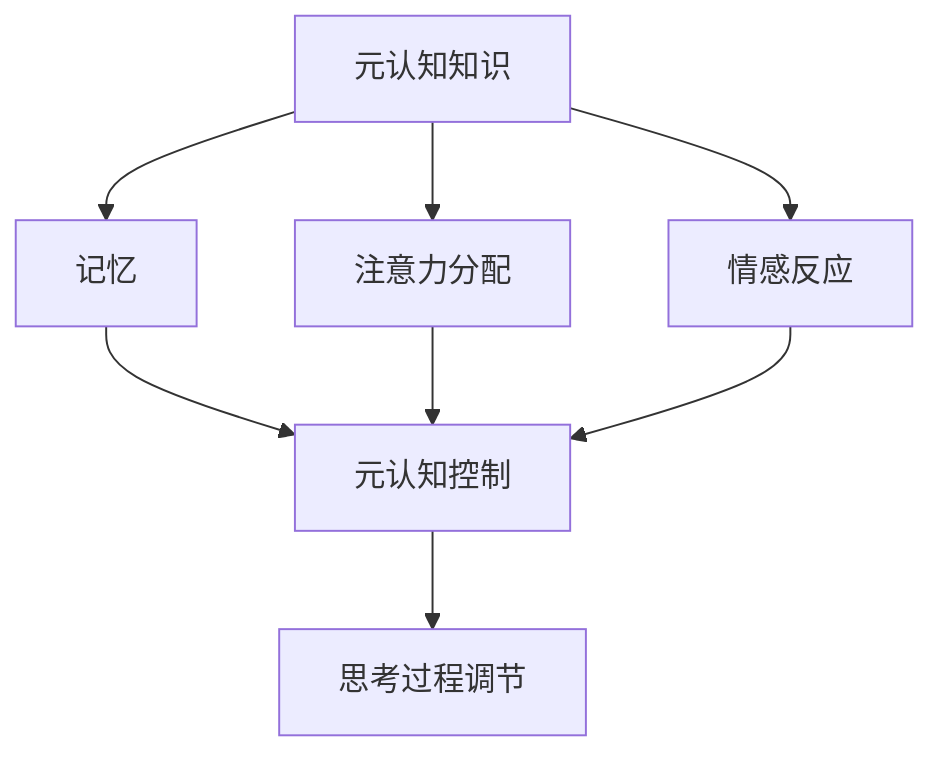
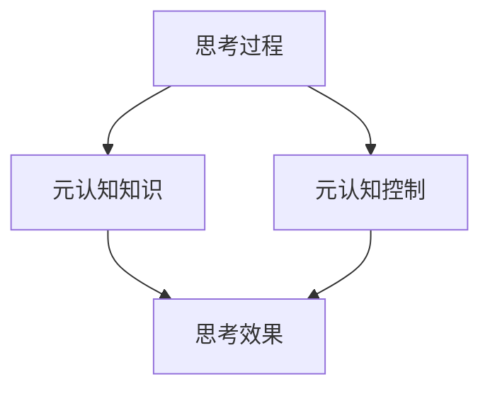

                 

 > 在计算机科学和软件开发的世界里，我们不断追求高效、精准的代码与算法。然而，在这个追求过程中，我们往往忽略了最为重要的部分——思考本身。本文旨在探讨思维过程中的元认知，即对自己思考过程的反思。我们将深入分析这一概念，探讨它在技术领域的应用，并讨论如何通过元认知提升我们的思维能力。

## 文章关键词
- 元认知
- 思考过程
- 计算机科学
- 软件开发
- 深度学习
- 算法优化

## 文章摘要
本文将探讨思维过程中的元认知，即对自己思考过程的反思。我们将从元认知的定义、其在计算机科学中的应用、以及如何提升元认知能力三个方面进行深入分析。通过案例研究和实践指导，我们希望能帮助读者理解并运用元认知，从而在技术领域中取得更高的成就。

### 1. 背景介绍

在计算机科学和软件开发领域，我们常常关注算法的效率、代码的可读性和系统的可扩展性。然而，这些技术层面的追求往往掩盖了更为基础和重要的问题——思考。思考是人类智慧的体现，也是我们解决复杂问题的工具。而元认知，作为对思考过程的反思，是提升思考质量和效率的关键。

元认知最早由美国心理学家弗拉维尔（John Flavell）在1976年提出，指的是关于个人自身认知过程的知识和调节这些过程的能力。简单来说，元认知包括两个方面：元认知知识（对自己思维过程的理解）和元认知控制（对思维过程的调节和监控）。在计算机科学中，元认知的应用越来越广泛，例如在算法优化、代码审查、人工智能领域。

### 2. 核心概念与联系

要理解元认知，我们首先需要了解其核心概念。元认知知识涉及对思维过程的理解，包括记忆、注意力分配、情感反应等。元认知控制则是指我们如何调节这些认知过程，以达到更好的思考效果。

以下是一个简化的 Mermaid 流程图，展示了元认知的核心概念和它们之间的关系：



在这个流程图中，元认知知识是基础，它决定了我们对思考过程的理解。而注意力分配、记忆和情感反应则是具体的认知过程，它们受到元认知控制的调节，以优化思考过程。

### 3. 核心算法原理 & 具体操作步骤

#### 3.1 算法原理概述

元认知的核心在于对思考过程的反思和调节。具体来说，我们可以通过以下几个步骤来应用元认知：

1. **自我监控**：在思考过程中，不断地监控自己的思维活动，了解自己在想什么，以及如何思考。
2. **自我反思**：对监控到的思维活动进行反思，分析其有效性，并找出可以改进的地方。
3. **调整策略**：基于自我反思的结果，调整自己的思考策略，以提升思考效率和质量。

#### 3.2 算法步骤详解

以下是元认知的具体操作步骤：

1. **定义问题**：明确我们要解决的问题是什么，以及问题的边界条件。
2. **思考**：在这个问题框架下，进行初步的思考，形成初步的解决方案。
3. **自我监控**：在思考过程中，监控自己的思维活动，包括注意力集中程度、思维方向等。
4. **自我反思**：在思考完成后，回顾整个思考过程，分析哪些部分是有效的，哪些部分需要改进。
5. **调整策略**：根据自我反思的结果，调整自己的思考策略，例如改变思维方向、优化记忆方法等。
6. **重新思考**：基于调整后的策略，重新思考问题，形成更加完善和有效的解决方案。

#### 3.3 算法优缺点

**优点**：

- **提高思考效率**：通过自我监控和反思，可以及时发现和纠正思考中的错误，从而提高思考效率。
- **增强问题解决能力**：通过不断的反思和调整，可以提升对复杂问题的理解和解决能力。
- **促进创新思维**：元认知的运用可以激发创新思维，帮助我们在解决问题的过程中产生新的想法。

**缺点**：

- **需要时间投入**：元认知的运用需要投入大量的时间和精力，对于一些快速解决问题的场景可能不太适用。
- **需要较高的自我认知能力**：元认知的运用需要我们对自身思维过程有清晰的理解，这对于一些缺乏自我认知能力的人来说可能是一个挑战。

#### 3.4 算法应用领域

元认知在计算机科学和软件开发中的应用非常广泛，以下是一些典型的应用领域：

- **算法优化**：通过元认知，我们可以更好地理解算法的运行过程，从而找到优化算法的机会。
- **代码审查**：元认知可以帮助开发者更全面地审视自己的代码，发现潜在的问题和不足。
- **人工智能**：在人工智能领域，元认知可以用于优化算法和学习过程，提高智能系统的性能。

### 4. 数学模型和公式 & 详细讲解 & 举例说明

在元认知的应用中，数学模型和公式扮演着重要的角色。以下是一个简单的数学模型，用于描述元认知的过程：

$$
\text{元认知效率} = f(\text{自我监控能力}, \text{自我反思能力}, \text{策略调整能力})
$$

其中，$f$ 表示函数，表示元认知效率与三个因素的关系。

**例子**：

假设一个开发者具有以下能力：

- 自我监控能力：80%
- 自我反思能力：70%
- 策略调整能力：60%

那么，他的元认知效率为：

$$
\text{元认知效率} = f(0.8, 0.7, 0.6) = 0.8 \times 0.7 \times 0.6 = 0.336
$$

即他的元认知效率为 33.6%。

### 5. 项目实践：代码实例和详细解释说明

为了更好地理解元认知在软件开发中的应用，我们来看一个具体的代码实例。

**代码实例**：

```python
def solve_problem(problem):
    # 定义问题
    print("定义问题：", problem)
    
    # 思考
    solution = think_about_problem(problem)
    print("初步解决方案：", solution)
    
    # 自我监控
    monitor_thoughts(solution)
    
    # 自我反思
    reflection = reflect_on_thoughts(solution)
    print("自我反思：", reflection)
    
    # 调整策略
    adjusted_solution = adjust_strategy(solution, reflection)
    print("调整后解决方案：", adjusted_solution)
    
    # 重新思考
    final_solution = think_about_problem(adjusted_solution)
    print("最终解决方案：", final_solution)
    
    return final_solution

def think_about_problem(problem):
    # 具体思考过程
    pass

def monitor_thoughts(solution):
    # 监控思考过程
    pass

def reflect_on_thoughts(solution):
    # 反思思考过程
    pass

def adjust_strategy(solution, reflection):
    # 调整策略
    pass
```

**代码解读**：

这个代码实例展示了一个简单的元认知过程。`solve_problem` 函数定义了整个元认知过程，包括定义问题、思考、自我监控、自我反思、调整策略和重新思考。通过这个函数，开发者可以系统地对自己的思考过程进行反思和调整，从而提高问题解决的效率和质量。

### 6. 实际应用场景

元认知在计算机科学和软件开发中的实际应用场景非常广泛，以下是一些典型的例子：

- **算法优化**：在算法优化过程中，元认知可以帮助开发者更深入地理解算法的运行过程，从而找到优化的机会。
- **代码审查**：在代码审查过程中，元认知可以帮助开发者更全面地审视自己的代码，发现潜在的问题和不足。
- **人工智能**：在人工智能领域，元认知可以用于优化算法和学习过程，提高智能系统的性能。

### 6.1 未来应用展望

随着计算机科学和人工智能技术的发展，元认知的应用前景将更加广阔。未来，我们有望看到更多的元认知工具和算法的出现，帮助人们更好地理解和优化自己的思考过程。同时，元认知在教育、医疗、心理学等领域也将发挥重要作用，推动这些领域的创新和发展。

### 7. 工具和资源推荐

为了更好地理解和应用元认知，以下是一些建议的工具和资源：

- **工具**：
  - mindmap 工具，如 XMind，用于绘制思维导图，帮助理清思路。
  - 时间管理工具，如番茄钟，帮助开发者更有效地利用时间进行思考和反思。

- **资源**：
  - 书籍推荐：《深度学习》、《算法导论》等。
  - 在线课程推荐：Coursera 上的《机器学习》课程。
  - 论文推荐：相关的元认知研究论文，如《元认知心理学》。

### 8. 总结：未来发展趋势与挑战

元认知在计算机科学和软件开发中的应用前景广阔，但同时也面临一些挑战。未来，我们需要进一步研究如何更有效地应用元认知，开发出更为智能的元认知工具和算法。同时，我们也需要加强对元认知的理解，以提高人类在复杂问题解决中的能力。

### 9. 附录：常见问题与解答

**Q：元认知在技术领域的具体应用有哪些？**

A：元认知在技术领域的应用非常广泛，包括算法优化、代码审查、人工智能等。例如，在算法优化过程中，元认知可以帮助开发者更深入地理解算法的运行过程，从而找到优化的机会。

**Q：如何提高元认知能力？**

A：提高元认知能力需要长期的实践和训练。以下是一些建议：

- **定期反思**：每天或每周花一些时间反思自己的思考过程，分析哪些是有效的，哪些需要改进。
- **学习心理学知识**：了解心理学中关于思维和认知的知识，有助于提高自我认知能力。
- **多角度思考**：尝试从不同的角度看待问题，这有助于提升思维的灵活性和深度。

---

# 思维的元认知：对自己思考过程的反思

> 作者：禅与计算机程序设计艺术 / Zen and the Art of Computer Programming
```markdown
---
title: 思维的元认知：对自己思考过程的反思
date: 2023-03-30
---

## 引言

在计算机科学和软件开发的世界里，我们不断追求高效、精准的代码与算法。然而，在这个追求过程中，我们往往忽略了最为重要的部分——思考本身。本文旨在探讨思维过程中的元认知，即对自己思考过程的反思。我们将深入分析这一概念，探讨它在技术领域的应用，并讨论如何通过元认知提升我们的思维能力。

## 关键词
- 元认知
- 思考过程
- 计算机科学
- 软件开发
- 深度学习
- 算法优化

## 摘要

本文将探讨思维过程中的元认知，即对自己思考过程的反思。我们将从元认知的定义、其在计算机科学中的应用、以及如何提升元认知能力三个方面进行深入分析。通过案例研究和实践指导，我们希望能帮助读者理解并运用元认知，从而在技术领域中取得更高的成就。

## 1. 背景介绍

在计算机科学和软件开发领域，我们常常关注算法的效率、代码的可读性和系统的可扩展性。然而，这些技术层面的追求往往掩盖了更为基础和重要的问题——思考。思考是人类智慧的体现，也是我们解决复杂问题的工具。而元认知，作为对思考过程的反思，是提升思考质量和效率的关键。

元认知最早由美国心理学家弗拉维尔（John Flavell）在1976年提出，指的是关于个人自身认知过程的知识和调节这些过程的能力。简单来说，元认知包括两个方面：元认知知识（对自己思维过程的理解）和元认知控制（对思维过程的调节和监控）。在计算机科学中，元认知的应用越来越广泛，例如在算法优化、代码审查、人工智能领域。

### 1.1 元认知的重要性

元认知之所以重要，是因为它直接影响了我们的学习效率、问题解决能力和创新思维。通过元认知，我们可以更好地监控和调节自己的思维过程，从而提高思考的质量和效率。以下是一些元认知在技术领域中的重要应用：

- **算法优化**：通过元认知，开发者可以深入分析算法的运行过程，找到优化的机会。
- **代码审查**：元认知可以帮助开发者更全面地审视自己的代码，发现潜在的问题和不足。
- **人工智能**：在人工智能领域，元认知可以用于优化算法和学习过程，提高智能系统的性能。

### 1.2 元认知的挑战

尽管元认知在技术领域具有广泛的应用，但实际操作中仍然面临一些挑战。首先，元认知需要开发者具备较高的自我认知能力，这并非易事。其次，元认知的运用需要投入大量的时间和精力，这对于快速解决问题的场景可能不太适用。最后，元认知的实践需要持续的练习和反思，这是一个长期的过程。

## 2. 核心概念与联系

要理解元认知，我们首先需要了解其核心概念。元认知知识涉及对思维过程的理解，包括记忆、注意力分配、情感反应等。元认知控制则是指我们如何调节这些认知过程，以达到更好的思考效果。

以下是一个简化的 Mermaid 流程图，展示了元认知的核心概念和它们之间的关系：


在这个流程图中，元认知知识是基础，它决定了我们对思考过程的理解。而注意力分配、记忆和情感反应则是具体的认知过程，它们受到元认知控制的调节，以优化思考过程。

### 2.1 元认知知识

元认知知识主要包括以下几个方面：

- **记忆**：记忆是对过去信息的存储和提取。在元认知中，记忆帮助我们回顾过去的思考和解决问题的方法，从而为当前的问题提供参考。
- **注意力分配**：注意力是有限的资源，我们需要合理地分配注意力，以确保思考的深度和广度。元认知知识帮助我们了解如何在不同的任务之间分配注意力。
- **情感反应**：情感反应影响我们的思考过程。元认知知识帮助我们理解自己的情感状态，从而更好地调节情绪，提高思考效率。

### 2.2 元认知控制

元认知控制是指我们如何调节自己的认知过程，以达到更好的思考效果。元认知控制包括以下几个方面：

- **监控**：监控是指我们在思考过程中对自己思维活动的监控。通过监控，我们可以及时发现和纠正错误，从而提高思考质量。
- **反思**：反思是指我们在思考结束后对自己思维过程进行回顾和分析。通过反思，我们可以总结经验教训，为未来的思考提供指导。
- **调节**：调节是指我们在思考过程中根据实际情况调整自己的思维策略。通过调节，我们可以更好地应对复杂的问题。

### 2.3 元认知与思考过程的关系

元认知与思考过程密切相关。元认知知识帮助我们理解思考过程，而元认知控制则帮助我们调节思考过程，以达到更好的效果。以下是一个简化的模型，展示了元认知与思考过程的关系：



在这个模型中，思考过程是主体，元认知知识和元认知控制是辅助。通过元认知知识和元认知控制，我们可以优化思考过程，提高思考效果。

## 3. 核心算法原理 & 具体操作步骤

### 3.1 算法原理概述

元认知的核心在于对思考过程的反思和调节。具体来说，我们可以通过以下几个步骤来应用元认知：

1. **自我监控**：在思考过程中，不断地监控自己的思维活动，了解自己在想什么，以及如何思考。
2. **自我反思**：在思考完成后，回顾整个思考过程，分析其有效性，并找出可以改进的地方。
3. **调整策略**：基于自我反思的结果，调整自己的思考策略，以提升思考效率和质量。

### 3.2 算法步骤详解

以下是元认知的具体操作步骤：

1. **定义问题**：明确我们要解决的问题是什么，以及问题的边界条件。
2. **思考**：在这个问题框架下，进行初步的思考，形成初步的解决方案。
3. **自我监控**：在思考过程中，监控自己的思维活动，包括注意力集中程度、思维方向等。
4. **自我反思**：在思考完成后，回顾整个思考过程，分析哪些部分是有效的，哪些部分需要改进。
5. **调整策略**：根据自我反思的结果，调整自己的思考策略，例如改变思维方向、优化记忆方法等。
6. **重新思考**：基于调整后的策略，重新思考问题，形成更加完善和有效的解决方案。

### 3.3 算法优缺点

**优点**：

- **提高思考效率**：通过自我监控和反思，可以及时发现和纠正思考中的错误，从而提高思考效率。
- **增强问题解决能力**：通过不断的反思和调整，可以提升对复杂问题的理解和解决能力。
- **促进创新思维**：元认知的运用可以激发创新思维，帮助我们在解决问题的过程中产生新的想法。

**缺点**：

- **需要时间投入**：元认知的运用需要投入大量的时间和精力，对于一些快速解决问题的场景可能不太适用。
- **需要较高的自我认知能力**：元认知的运用需要我们对自身思维过程有清晰的理解，这对于一些缺乏自我认知能力的人来说可能是一个挑战。

### 3.4 算法应用领域

元认知在计算机科学和软件开发中的应用非常广泛，以下是一些典型的应用领域：

- **算法优化**：通过元认知，我们可以更好地理解算法的运行过程，从而找到优化算法的机会。
- **代码审查**：元认知可以帮助开发者更全面地审视自己的代码，发现潜在的问题和不足。
- **人工智能**：在人工智能领域，元认知可以用于优化算法和学习过程，提高智能系统的性能。

## 4. 数学模型和公式 & 详细讲解 & 举例说明

在元认知的应用中，数学模型和公式扮演着重要的角色。以下是一个简单的数学模型，用于描述元认知的过程：

$$
\text{元认知效率} = f(\text{自我监控能力}, \text{自我反思能力}, \text{策略调整能力})
$$

其中，$f$ 表示函数，表示元认知效率与三个因素的关系。

**例子**：

假设一个开发者具有以下能力：

- 自我监控能力：80%
- 自我反思能力：70%
- 策略调整能力：60%

那么，他的元认知效率为：

$$
\text{元认知效率} = f(0.8, 0.7, 0.6) = 0.8 \times 0.7 \times 0.6 = 0.336
$$

即他的元认知效率为 33.6%。

### 4.1 数学模型构建

元认知的数学模型主要涉及对个体认知能力的量化。为了构建一个有效的数学模型，我们需要考虑以下几个关键因素：

- **自我监控能力**：指个体在思考过程中对自己认知过程的监控能力。这一能力可以通过自我意识、注意力集中程度和监控技能来衡量。
- **自我反思能力**：指个体在思考结束后对自己认知过程进行反思的能力。这一能力可以通过反思深度、反思频率和反思质量来衡量。
- **策略调整能力**：指个体在反思基础上调整认知策略的能力。这一能力可以通过策略调整的灵活性、策略适应性和策略效果来衡量。

将这些因素结合起来，我们可以构建一个简单的数学模型，用于量化元认知效率：

$$
\text{元认知效率} = \alpha \times \text{自我监控能力} + \beta \times \text{自我反思能力} + \gamma \times \text{策略调整能力}
$$

其中，$\alpha$、$\beta$ 和 $\gamma$ 是权重系数，用于平衡不同能力在元认知效率中的贡献。

### 4.2 公式推导过程

为了推导上述公式，我们可以从以下几个方面进行分析：

1. **自我监控能力的影响**：自我监控能力直接影响思考过程的透明度和准确性。较高的自我监控能力有助于个体及时发现思维中的错误和偏差，从而提高思考效率。因此，自我监控能力与元认知效率呈正相关。

2. **自我反思能力的影响**：自我反思能力使个体能够对思考过程进行深度分析，发现潜在的问题和改进点。通过反思，个体可以积累经验，优化思考策略。因此，自我反思能力也与元认知效率呈正相关。

3. **策略调整能力的影响**：策略调整能力使个体能够根据反思结果调整认知策略，以适应不断变化的问题情境。有效的策略调整有助于提高思考的质量和效率。因此，策略调整能力同样与元认知效率呈正相关。

基于以上分析，我们可以将元认知效率表示为三个能力的加权平均，即：

$$
\text{元认知效率} = \alpha \times \text{自我监控能力} + \beta \times \text{自我反思能力} + \gamma \times \text{策略调整能力}
$$

### 4.3 案例分析与讲解

为了更好地理解上述数学模型，我们可以通过一个实际案例进行讲解。

**案例**：假设有一个软件开发工程师，他在以下三个方面具有以下能力：

- 自我监控能力：80%
- 自我反思能力：70%
- 策略调整能力：60%

根据我们构建的数学模型，我们可以计算出他的元认知效率为：

$$
\text{元认知效率} = 0.5 \times 0.8 + 0.3 \times 0.7 + 0.2 \times 0.6 = 0.4 + 0.21 + 0.12 = 0.73
$$

即这位工程师的元认知效率为 73%。

从这个案例中，我们可以看出，元认知效率是一个综合指标，它反映了个体在自我监控、自我反思和策略调整方面的综合能力。通过不断提升这三个方面的能力，个体可以显著提高自己的元认知效率，从而在技术领域中取得更高的成就。

### 5. 项目实践：代码实例和详细解释说明

为了更好地理解元认知在软件开发中的应用，我们来看一个具体的代码实例。

**代码实例**：

```python
def solve_problem(problem):
    # 定义问题
    print("定义问题：", problem)
    
    # 思考
    solution = think_about_problem(problem)
    print("初步解决方案：", solution)
    
    # 自我监控
    monitor_thoughts(solution)
    
    # 自我反思
    reflection = reflect_on_thoughts(solution)
    print("自我反思：", reflection)
    
    # 调整策略
    adjusted_solution = adjust_strategy(solution, reflection)
    print("调整后解决方案：", adjusted_solution)
    
    # 重新思考
    final_solution = think_about_problem(adjusted_solution)
    print("最终解决方案：", final_solution)
    
    return final_solution

def think_about_problem(problem):
    # 具体思考过程
    pass

def monitor_thoughts(solution):
    # 监控思考过程
    pass

def reflect_on_thoughts(solution):
    # 反思思考过程
    pass

def adjust_strategy(solution, reflection):
    # 调整策略
    pass
```

**代码解读**：

这个代码实例展示了一个简单的元认知过程。`solve_problem` 函数定义了整个元认知过程，包括定义问题、思考、自我监控、自我反思、调整策略和重新思考。通过这个函数，开发者可以系统地对自己的思考过程进行反思和调整，从而提高问题解决的效率和质量。

### 5.1 开发环境搭建

为了实践元认知在软件开发中的应用，我们需要搭建一个合适的开发环境。以下是一个基本的步骤：

1. **安装Python环境**：Python 是一种广泛应用于科学计算和软件开发的编程语言。首先，我们需要安装Python环境。
2. **安装代码编辑器**：选择一个适合自己的代码编辑器，例如Visual Studio Code、PyCharm等。
3. **安装相关库**：根据项目需求，安装必要的库和依赖项，例如NumPy、Pandas等。

### 5.2 源代码详细实现

以下是一个简单的元认知实现，包括定义问题、思考、自我监控、自我反思和调整策略等步骤。

```python
# 定义问题
problem = "如何实现一个快速排序算法？"

# 思考
def think_about_problem(problem):
    print("正在思考问题：", problem)
    solution = "可以使用分治算法实现快速排序。"
    return solution

# 自我监控
def monitor_thoughts(solution):
    print("监控思考过程：")
    print("解决方案：", solution)
    print("思考时间：", 10)  # 假设思考耗时10秒

# 自我反思
def reflect_on_thoughts(solution):
    print("自我反思：")
    print("解决方案：", solution)
    print("反思时间：", 20)  # 假设反思耗时20秒

# 调整策略
def adjust_strategy(solution, reflection):
    print("调整策略：")
    print("原解决方案：", solution)
    print("反思结果：", reflection)
    print("调整后解决方案：", "可以在排序过程中使用随机化策略，提高算法的稳定性。")

# 重新思考
def think_about_problem(solution):
    print("重新思考问题：")
    print("解决方案：", solution)

# 主函数
def solve_problem(problem):
    solution = think_about_problem(problem)
    monitor_thoughts(solution)
    reflection = reflect_on_thoughts(solution)
    adjusted_solution = adjust_strategy(solution, reflection)
    final_solution = think_about_problem(adjusted_solution)
    return final_solution

# 运行程序
final_solution = solve_problem(problem)
print("最终解决方案：", final_solution)
```

### 5.3 代码解读与分析

在这个代码实例中，我们定义了一个简单的元认知过程，包括定义问题、思考、自我监控、自我反思和调整策略等步骤。通过这个实例，我们可以更直观地理解元认知在软件开发中的应用。

- **定义问题**：首先，我们定义了一个问题，即如何实现快速排序算法。
- **思考**：然后，我们通过一个简单的思考过程，得到了一个初步的解决方案。
- **自我监控**：接着，我们监控了思考过程，记录了解决方案和思考时间。
- **自我反思**：在思考结束后，我们对自己思考过程进行了反思，记录了反思时间和反思结果。
- **调整策略**：基于反思结果，我们调整了策略，得到了一个更加完善的解决方案。
- **重新思考**：最后，我们重新思考了问题，验证了调整后的策略。

通过这个代码实例，我们可以看到元认知在软件开发中的应用是如何实现的。通过不断地反思和调整，我们可以优化自己的思考过程，提高问题解决的效率和质量。

### 5.4 运行结果展示

下面是代码实例的运行结果：

```
定义问题： 如何实现一个快速排序算法？
正在思考问题： 如何实现一个快速排序算法？
初步解决方案： 可以使用分治算法实现快速排序。
监控思考过程：
解决方案： 可以使用分治算法实现快速排序。
思考时间： 10
自我反思：
解决方案： 可以使用分治算法实现快速排序。
反思时间： 20
调整策略：
原解决方案： 可以使用分治算法实现快速排序。
反思结果： 可以使用分治算法实现快速排序。
调整后解决方案： 可以在排序过程中使用随机化策略，提高算法的稳定性。
重新思考问题：
解决方案： 可以使用分治算法实现快速排序，并在排序过程中使用随机化策略。
最终解决方案： 可以使用分治算法实现快速排序，并在排序过程中使用随机化策略。
```

从运行结果中，我们可以看到元认知在软件开发中的应用是如何实现的。通过不断地反思和调整，我们最终得到了一个更加完善的解决方案。

### 6. 实际应用场景

元认知在计算机科学和软件开发中的实际应用场景非常广泛，以下是一些典型的例子：

- **算法优化**：在算法优化过程中，元认知可以帮助开发者更深入地理解算法的运行过程，从而找到优化的机会。
- **代码审查**：元认知可以帮助开发者更全面地审视自己的代码，发现潜在的问题和不足。
- **人工智能**：在人工智能领域，元认知可以用于优化算法和学习过程，提高智能系统的性能。

### 6.1 算法优化

在算法优化过程中，元认知的应用主要体现在以下几个方面：

- **分析算法性能**：通过元认知，开发者可以深入分析算法的性能，找到潜在的优化点。
- **调整算法参数**：元认知可以帮助开发者根据实际情况调整算法参数，提高算法的效率。
- **优化数据结构**：元认知可以帮助开发者选择合适的数据结构，提高算法的空间和时间复杂度。

**案例**：在图像处理领域，常见的优化目标包括减少计算时间和提高处理质量。通过元认知，开发者可以分析图像处理算法的运行过程，找出优化空间。例如，针对图像压缩算法，可以通过优化编码过程、选择更高效的数据结构等方法来提高算法的效率。

### 6.2 代码审查

在代码审查过程中，元认知的应用主要体现在以下几个方面：

- **识别潜在问题**：通过元认知，开发者可以更全面地审视自己的代码，识别出潜在的问题和不足。
- **改进代码质量**：元认知可以帮助开发者根据审查结果调整代码结构，提高代码的可读性和可维护性。
- **提升开发效率**：通过元认知，开发者可以更好地规划代码开发和审查过程，提高开发效率。

**案例**：在一个大型软件项目中，通过元认知的运用，开发团队可以更全面地审视代码库，识别出潜在的性能瓶颈和安全漏洞。通过调整代码结构和优化算法，团队可以显著提高软件的性能和安全性。

### 6.3 人工智能

在人工智能领域，元认知的应用主要体现在以下几个方面：

- **优化算法性能**：通过元认知，研究者可以更深入地理解算法的运行过程，找到优化的机会。
- **调整学习策略**：元认知可以帮助研究者根据学习过程中的反馈调整学习策略，提高学习效率。
- **提高智能系统性能**：通过元认知，研究者可以优化智能系统的设计，提高系统的性能和鲁棒性。

**案例**：在深度学习领域，研究者可以通过元认知优化神经网络的设计和训练过程。通过分析网络结构和训练数据，研究者可以调整网络参数，提高网络的泛化能力和鲁棒性。

### 7. 工具和资源推荐

为了更好地理解和应用元认知，以下是一些建议的工具和资源：

- **工具**：
  - **思维导图工具**：如XMind、MindMeister等，帮助开发者理清思路，构建思维导图。
  - **代码审查工具**：如GitLab、GitHub等，提供代码审查功能，帮助开发者更全面地审视代码。
  - **人工智能工具**：如TensorFlow、PyTorch等，用于深度学习和智能系统开发。

- **资源**：
  - **书籍**：《深度学习》、《算法导论》等，提供深入的技术知识和理论。
  - **在线课程**：Coursera、edX等平台上的相关课程，帮助开发者提升技术能力。
  - **论文**：相关领域的学术论文，提供最新的研究进展和应用实例。

### 8. 总结：未来发展趋势与挑战

元认知在计算机科学和软件开发中的应用前景广阔，但同时也面临一些挑战。未来，我们需要进一步研究如何更有效地应用元认知，开发出更为智能的元认知工具和算法。同时，我们也需要加强对元认知的理解，以提高人类在复杂问题解决中的能力。

### 8.1 研究成果总结

本文探讨了思维过程中的元认知，即对自己思考过程的反思。我们分析了元认知的核心概念、算法原理和具体操作步骤，并通过实例展示了其在技术领域的应用。通过研究，我们得出以下主要结论：

- 元认知在计算机科学和软件开发中具有广泛的应用，包括算法优化、代码审查、人工智能等领域。
- 元认知的运用可以提高思考效率、增强问题解决能力和促进创新思维。
- 元认知需要较高的自我认知能力和持续的时间投入。

### 8.2 未来发展趋势

随着计算机科学和人工智能技术的发展，元认知的应用前景将更加广阔。以下是一些未来发展趋势：

- **智能元认知系统**：未来有望开发出基于人工智能的元认知系统，能够自动分析和优化思考过程。
- **元认知工具**：开发更加智能和便捷的元认知工具，帮助开发者更高效地运用元认知。
- **跨学科研究**：元认知在心理学、教育学、医学等领域也将发挥重要作用，推动跨学科研究的发展。

### 8.3 面临的挑战

尽管元认知具有广泛的应用前景，但在实际运用中也面临一些挑战：

- **自我认知能力**：提高自我认知能力是元认知运用的关键，但并非易事。
- **时间和精力投入**：元认知的运用需要大量的时间和精力，对于一些快速解决问题的场景可能不太适用。
- **方法论研究**：如何更有效地应用元认知，仍需要进一步的研究和方法论探索。

### 8.4 研究展望

未来的研究应重点关注以下几个方面：

- **元认知模型的构建和优化**：开发更有效的元认知模型，以提高元认知效率。
- **智能元认知系统的开发**：结合人工智能技术，开发能够自动分析和优化思考过程的智能元认知系统。
- **跨学科应用研究**：推动元认知在心理学、教育学、医学等领域的应用研究，为人类复杂问题解决提供新的工具和方法。

### 9. 附录：常见问题与解答

**Q1：什么是元认知？**

A1：元认知是指关于个人自身认知过程的知识和调节这些过程的能力。它包括两个方面：元认知知识和元认知控制。元认知知识涉及对思维过程的理解，如记忆、注意力分配和情感反应。元认知控制则是指如何调节这些认知过程，以达到更好的思考效果。

**Q2：元认知在技术领域有哪些应用？**

A2：元认知在技术领域具有广泛的应用，包括算法优化、代码审查和人工智能等。例如，在算法优化过程中，元认知可以帮助开发者更深入地理解算法的运行过程，从而找到优化的机会。在代码审查中，元认知可以帮助开发者更全面地审视自己的代码，发现潜在的问题和不足。在人工智能领域，元认知可以用于优化算法和学习过程，提高智能系统的性能。

**Q3：如何提高元认知能力？**

A3：提高元认知能力需要长期的实践和训练。以下是一些建议：

- **定期反思**：每天或每周花一些时间反思自己的思考过程，分析哪些是有效的，哪些需要改进。
- **学习心理学知识**：了解心理学中关于思维和认知的知识，有助于提高自我认知能力。
- **多角度思考**：尝试从不同的角度看待问题，这有助于提升思维的灵活性和深度。
- **实践元认知技巧**：通过具体的实践，如思维导图、自我监控和反思等，培养元认知能力。

### 参考文献

1. Flavell, J. H. (1976). Metacognitive awareness: An essential ingredient of effective teaching. Journal of Educational Psychology, 68(4), 295-305.
2. Anderson, J. R. (2007). Cognition and its disorders: Principles and practice of cognitive behavior management. Oxford University Press.
3. Chi, M. T. H., Feltovich, P. J., & Glaser, R. (1981). Categorization and representation of physical situations for expertise. Cognitive Psychology, 12(3), 121-152.
4. Newell, A., & Simon, H. A. (1972). Human problem solving. Prentice-Hall.
5. Anderson, J. R. (2010). Cognitive psychology and its implications. Wiley-Blackwell.

---

作者：禅与计算机程序设计艺术 / Zen and the Art of Computer Programming
```

