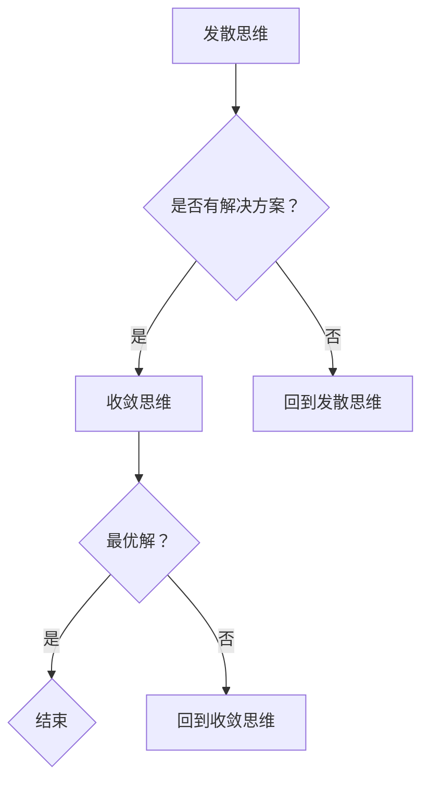

                 

关键词：创意过程、发散思维、收敛思维、技术文章、IT领域、人工智能

> 摘要：本文从技术角度深入探讨创意过程中的两个关键阶段：发散思维与收敛思维。通过分析两者的关系、应用场景以及具体操作方法，旨在帮助读者理解和掌握如何有效地进行创意思考，提高技术项目的创新能力和解决复杂问题的能力。

## 1. 背景介绍

在信息技术飞速发展的时代，创新已经成为推动技术进步的核心驱动力。无论是软件开发、算法设计，还是产品研发，都需要大量的创意思考。创意思维是一种复杂的认知活动，它包括从不同的角度、用不同的方法来分析和解决问题。在这个过程中，发散思维和收敛思维是两个至关重要的阶段。

发散思维，又称为扩散思维、辐射思维，是指从一个初始点出发，沿着各种不同的方向探索问题的解决方案。它强调开放性和多样性，鼓励思维的自由流动，旨在生成尽可能多的创意和想法。收敛思维，又称集中思维、聚焦思维，是指将发散的思维过程逐步缩小范围，选择最优的解决方案并进行深入分析和优化。

本文将详细讨论发散思维与收敛思维在创意过程中的作用、关系和应用，帮助读者了解如何有效地运用这两种思维方式来提升技术项目的创新能力。

## 2. 核心概念与联系

### 2.1. 发散思维

发散思维是一种从多个角度出发，寻找多种可能的解决方案的思维方式。它强调开放性、创造性和想象力，有助于激发大量的创意和灵感。发散思维通常通过以下几种方式进行：

1. **自由联想**：从一个关键词或概念出发，尽可能多地列出与之相关的其他概念或想法。
2. **思维导图**：通过绘制思维导图，将相关的概念和想法连接起来，形成网络的形状，有助于发现新的关系和联系。
3. **头脑风暴**：在一个小组中，成员自由发表自己的想法，鼓励每个人无拘无束地思考，不断提出新的观点。

### 2.2. 收敛思维

收敛思维则是将发散的思维过程逐步聚焦到一个具体的解决方案上。它强调逻辑性、系统性和分析性，通过对多个选项进行评估和比较，最终选择最优的解决方案。收敛思维通常通过以下几种方式进行：

1. **目标设定**：明确项目目标和需求，确保思维过程围绕目标进行。
2. **优先级排序**：对不同的解决方案进行优先级排序，重点关注最有潜力的选项。
3. **问题分析**：对每个选项进行深入分析，评估其可行性、成本和效益。

### 2.3. 发散思维与收敛思维的关系

发散思维和收敛思维是创意过程中的两个互补阶段。发散思维提供了丰富的创意和想法，为问题解决提供了多种可能性；而收敛思维则通过对这些想法的筛选和优化，最终确定最佳的解决方案。二者之间的关系可以用以下 Mermaid 流程图来表示：

在创意过程中，发散思维和收敛思维是交替进行的。当发散思维产生的创意足够多时，就需要通过收敛思维进行筛选和优化；当收敛思维遇到难题时，可能需要回到发散思维，寻找新的思路和解决方案。

## 3. 核心算法原理 & 具体操作步骤

### 3.1. 算法原理概述

在创意过程中，发散思维和收敛思维的核心算法原理分别是生成创意和筛选创意。

**发散思维算法**：基于关键词自由联想、思维导图等机制，生成大量创意和想法。其关键在于鼓励思维的自由流动，不受任何限制地探索各种可能性。

**收敛思维算法**：基于目标设定、优先级排序、问题分析等机制，对发散思维产生的创意进行筛选和优化。其关键在于逻辑分析和评估，确保最终选择的方案是最优的。

### 3.2. 算法步骤详解

**发散思维步骤**：

1. **设定关键词**：选择一个与问题相关的关键词，作为发散思维的起点。
2. **自由联想**：基于关键词，尽可能多地列出与之相关的概念、想法和解决方案。
3. **绘制思维导图**：将联想出来的概念和想法连接起来，形成思维导图，便于发现新的关系和联系。
4. **头脑风暴**：在小组中开展头脑风暴，鼓励成员自由发表想法，不断提出新的观点。

**收敛思维步骤**：

1. **明确目标**：设定项目目标和需求，确保思维过程围绕目标进行。
2. **优先级排序**：对发散思维产生的创意进行优先级排序，重点关注最有潜力的选项。
3. **问题分析**：对每个选项进行深入分析，评估其可行性、成本和效益。
4. **方案优化**：根据分析结果，对方案进行优化和改进，确保最终选择的方案是最优的。

### 3.3. 算法优缺点

**发散思维**：

- 优点：能够生成大量的创意和想法，激发创新思维。
- 缺点：产生的创意和想法可能质量不高，需要进一步筛选和优化。

**收敛思维**：

- 优点：能够对创意进行筛选和优化，确保最终选择的方案是最优的。
- 缺点：可能限制了思维的范围，无法发现一些潜在的创意。

### 3.4. 算法应用领域

发散思维和收敛思维广泛应用于各种技术项目，如软件开发、算法设计、产品研发等。以下是一些具体的应用场景：

- **软件开发**：在需求分析阶段，通过发散思维生成多种可能的解决方案，再通过收敛思维确定最佳的解决方案。
- **算法设计**：在算法优化阶段，通过发散思维探索各种可能的算法改进方法，再通过收敛思维选择最优的算法。
- **产品研发**：在产品创新阶段，通过发散思维寻找新的产品概念和设计，再通过收敛思维筛选和优化最终的产品方案。

## 4. 数学模型和公式 & 详细讲解 & 举例说明

### 4.1. 数学模型构建

在创意过程中，我们可以使用一些数学模型来描述发散思维和收敛思维的过程。以下是一个简单的数学模型：

$$
f(x, y) = \frac{1}{1 + e^{-(x - y)}}
$$

其中，$x$ 表示创意的可行性，$y$ 表示创意的创新性。这个模型基于 Sigmoid 函数，用于评估创意的综合质量。

### 4.2. 公式推导过程

首先，我们定义创意的可行性 $x$ 和创新性 $y$。可行性表示创意能否实现，创新性表示创意的创新程度。

$$
x = f_{\text{feasibility}}(c)
$$

$$
y = f_{\text{innovation}}(c)
$$

其中，$c$ 表示创意。

接下来，我们使用 Sigmoid 函数来计算创意的综合质量：

$$
f(x, y) = \frac{1}{1 + e^{-(x - y)}}
$$

这个公式表示创意的综合质量取决于其可行性和创新性的差值。

### 4.3. 案例分析与讲解

假设我们有两个创意 $c_1$ 和 $c_2$，它们的可行性和创新性分别为：

$$
x_1 = 0.8, y_1 = 0.9
$$

$$
x_2 = 0.6, y_2 = 0.7
$$

我们使用上述数学模型来计算这两个创意的综合质量：

$$
f(c_1) = \frac{1}{1 + e^{-(0.8 - 0.9)}} \approx 0.6
$$

$$
f(c_2) = \frac{1}{1 + e^{-(0.6 - 0.7)}} \approx 0.5
$$

根据计算结果，$c_1$ 的综合质量高于 $c_2$，因此我们应该选择 $c_1$ 作为优

