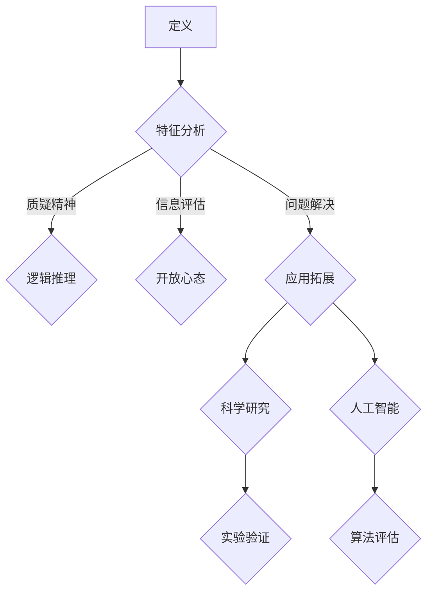

                 

关键词：批判性思维，科学精神，技术进步，人工智能，程序设计

> 摘要：本文旨在探讨批判性思维在科学精神中的核心地位，以及它如何推动技术进步和人工智能的发展。通过分析批判性思维的关键特征和应用，本文将揭示其在现代科技领域的深远影响。

## 1. 背景介绍

科学精神是推动人类文明进步的重要力量，它强调理性思考、实证研究和不断创新。在这个框架下，批判性思维扮演着至关重要的角色。批判性思维不仅是一种思考技巧，更是一种态度和方法，它鼓励我们质疑现有的知识体系，不断寻求更深刻的理解和更完善的解决方案。

随着技术的飞速发展，人工智能（AI）成为当今社会的重要驱动力。然而，AI的发展不仅仅是算法和技术的进步，更是思维方式的变化。批判性思维在AI领域的应用尤为关键，它帮助我们识别潜在的偏见、评估算法的合理性，并推动AI系统的不断优化。

本文将围绕批判性思维的核心概念，分析其在科学研究和人工智能领域的应用，并探讨其对于技术进步的推动作用。

## 2. 核心概念与联系

### 2.1 批判性思维的定义

批判性思维是一种系统性的分析、评估和思考过程，它不仅关注信息的表面含义，更注重背后的逻辑关系和潜在假设。批判性思维涉及以下几个关键特征：

- **质疑精神**：不轻易接受未经验证的信息，对现有理论和方法持怀疑态度。
- **逻辑推理**：运用逻辑规则进行推理，确保结论的可靠性和一致性。
- **信息评估**：对信息来源、可靠性和有效性进行评估，避免盲目接受。
- **开放心态**：愿意接受不同的观点和证据，以丰富和优化自己的思考。
- **问题解决**：面对复杂问题时，能够提出有建设性的解决方案。

### 2.2 科学精神的内涵

科学精神是追求真理、理性思考和实证研究的精神。它包括以下几个方面：

- **怀疑主义**：对传统观念和权威持怀疑态度，通过实验和观察来验证。
- **客观性**：追求客观、公正的研究方法，避免个人偏见和情感干扰。
- **系统化**：将知识系统化，形成理论框架，以指导新的研究和实践。
- **创新性**：不断探索新的知识和方法，推动科学技术的进步。

### 2.3 批判性思维与科学精神的关系

批判性思维是科学精神的重要组成部分，两者相互促进、相辅相成。批判性思维为科学精神提供了具体的思考方法和实践路径，使得科学研究更加严谨和有效。同时，科学精神为批判性思维提供了目标和方向，使得批判性思维能够更好地服务于科学探索。

### 2.4 批判性思维的 Mermaid 流程图



## 3. 核心算法原理 & 具体操作步骤

### 3.1 算法原理概述

批判性思维在算法设计和应用中的核心作用体现在以下几个方面：

- **算法评估**：通过批判性思维，评估算法的合理性、有效性和可靠性。
- **算法优化**：识别算法中的潜在问题，进行改进和优化。
- **算法解释**：解释算法的工作原理和决策过程，提高算法的可解释性和透明度。

### 3.2 算法步骤详解

1. **问题定义**：明确需要解决的问题和目标，确保问题表述清晰、具体。
2. **数据收集**：收集相关数据，进行预处理，确保数据质量和完整性。
3. **算法设计**：基于问题定义和数据特点，选择合适的算法框架和模型。
4. **算法实现**：将算法设计转化为代码，进行实现和调试。
5. **算法评估**：通过实验和测试，评估算法的性能和效果。
6. **算法优化**：根据评估结果，对算法进行改进和优化。
7. **算法解释**：对算法的工作原理和决策过程进行详细解释，提高可解释性和透明度。

### 3.3 算法优缺点

**优点**：

- **提高算法可靠性**：通过批判性思维，识别和纠正算法中的潜在问题，提高算法的可靠性和稳定性。
- **优化算法性能**：批判性思维有助于发现算法中的瓶颈和不足，进行优化，提高算法的效率和效果。
- **增强算法透明性**：通过批判性思维，对算法进行详细解释和说明，提高算法的可解释性和透明度。

**缺点**：

- **时间成本**：批判性思维需要大量的时间和精力，可能导致研究进程的延迟。
- **主观性**：批判性思维可能受到个人经验和偏见的干扰，影响算法评估的客观性。

### 3.4 算法应用领域

批判性思维在算法设计和应用中的关键作用体现在以下领域：

- **人工智能**：在人工智能系统中，批判性思维有助于评估算法的合理性、有效性和可靠性，提高AI系统的性能和可解释性。
- **数据科学**：在数据科学研究中，批判性思维有助于识别和纠正数据中的错误和偏见，提高数据分析的准确性和有效性。
- **软件工程**：在软件工程中，批判性思维有助于发现和解决软件中的缺陷和问题，提高软件的质量和可靠性。

## 4. 数学模型和公式 & 详细讲解 & 举例说明

### 4.1 数学模型构建

批判性思维在数学模型构建中的应用体现在以下几个方面：

- **问题定义**：明确研究问题的目标和假设，确保问题表述清晰、具体。
- **变量选取**：根据问题特点，选取合适的变量和参数，构建模型的基本框架。
- **关系表达**：通过批判性思维，分析变量之间的关系，建立数学模型的表达式。
- **模型优化**：根据实验结果和数据分析，对模型进行改进和优化，提高模型的准确性和可靠性。

### 4.2 公式推导过程

以下是一个简单的线性回归模型的推导过程：

1. **问题定义**：假设我们要研究一个自变量 \(x\) 和因变量 \(y\) 之间的关系，目标是建立一个线性模型来预测 \(y\) 的值。
2. **变量选取**：选择 \(x\) 和 \(y\) 作为变量，并假设它们之间存在线性关系。
3. **关系表达**：假设线性关系可以表示为 \(y = \beta_0 + \beta_1 x + \epsilon\)，其中 \(\beta_0\) 和 \(\beta_1\) 是待估参数，\(\epsilon\) 是误差项。
4. **最小二乘法**：使用最小二乘法估计参数 \(\beta_0\) 和 \(\beta_1\)，使预测值与实际值之间的误差平方和最小。
5. **模型优化**：根据误差项 \(\epsilon\) 的分布特点，对模型进行优化，提高模型的预测能力和可靠性。

### 4.3 案例分析与讲解

以下是一个使用线性回归模型进行房屋价格预测的案例：

**问题定义**：预测某地区房屋的价格。

**数据收集**：收集该地区多个房屋的售价和特征数据，如房屋面积、楼层、建造年代等。

**变量选取**：选取房屋面积和楼层作为自变量，售价作为因变量。

**关系表达**：建立线性回归模型，假设房屋价格与面积和楼层之间存在线性关系，即 \(y = \beta_0 + \beta_1 x_1 + \beta_2 x_2 + \epsilon\)，其中 \(x_1\) 是房屋面积，\(x_2\) 是楼层，\(\beta_0\)、\(\beta_1\) 和 \(\beta_2\) 是待估参数，\(\epsilon\) 是误差项。

**模型实现**：使用最小二乘法估计参数 \(\beta_0\)、\(\beta_1\) 和 \(\beta_2\)，建立预测模型。

**模型评估**：通过交叉验证和误差分析，评估模型的预测能力和准确性。

**模型优化**：根据评估结果，对模型进行改进和优化，提高模型的预测能力。

## 5. 项目实践：代码实例和详细解释说明

### 5.1 开发环境搭建

**环境要求**：Python 3.8、NumPy、Pandas、Scikit-learn

**安装步骤**：

1. 安装 Python 3.8。
2. 安装 NumPy、Pandas 和 Scikit-learn。

```bash
pip install numpy pandas scikit-learn
```

### 5.2 源代码详细实现

以下是一个简单的线性回归模型实现示例：

```python
import numpy as np
import pandas as pd
from sklearn.linear_model import LinearRegression

# 数据读取与预处理
data = pd.read_csv('house_prices.csv')
X = data[['area', 'floor']]
y = data['price']

# 模型实现
model = LinearRegression()
model.fit(X, y)

# 模型评估
score = model.score(X, y)
print(f'Model accuracy: {score:.2f}')

# 预测
predictions = model.predict(X)
print(f'Predictions: {predictions}')
```

### 5.3 代码解读与分析

1. **数据读取与预处理**：使用 Pandas 读取 CSV 数据，并分离自变量和因变量。
2. **模型实现**：使用 Scikit-learn 的 LinearRegression 类实现线性回归模型。
3. **模型评估**：使用 score 方法评估模型的准确率。
4. **预测**：使用 predict 方法进行预测。

### 5.4 运行结果展示

运行代码后，将输出模型的准确率和预测结果。根据评估结果，可以进一步优化模型，提高预测能力。

## 6. 实际应用场景

### 6.1 人工智能

在人工智能领域，批判性思维有助于评估算法的合理性、有效性和可靠性。例如，在图像识别任务中，我们需要质疑模型的准确性和泛化能力，通过实验和测试不断优化算法。

### 6.2 数据科学

在数据科学研究中，批判性思维有助于识别和纠正数据中的错误和偏见，提高数据分析的准确性和有效性。例如，在医疗数据分析中，我们需要质疑数据来源和完整性，确保分析结果的可靠性。

### 6.3 软件工程

在软件工程中，批判性思维有助于发现和解决软件中的缺陷和问题，提高软件的质量和可靠性。例如，在软件测试过程中，我们需要质疑测试用例的覆盖率和有效性，确保软件的稳定性和安全性。

### 6.4 未来应用展望

随着技术的不断发展，批判性思维将在更多领域发挥重要作用。在未来，批判性思维将成为人工智能、数据科学和软件工程等领域的核心能力，推动技术进步和科学创新。

## 7. 工具和资源推荐

### 7.1 学习资源推荐

- **《批判性思维技巧：如何成为更好的思考者》**：一本关于批判性思维的基础教程。
- **《人工智能：一种现代方法》**：详细介绍了人工智能的核心算法和应用。

### 7.2 开发工具推荐

- **Jupyter Notebook**：用于数据分析和机器学习的交互式开发环境。
- **PyTorch**：用于深度学习研究的开源框架。

### 7.3 相关论文推荐

- **“Deep Learning”**：介绍深度学习核心算法和应用的经典论文。
- **“The AI Revolution”**：探讨人工智能发展趋势和挑战的论文。

## 8. 总结：未来发展趋势与挑战

### 8.1 研究成果总结

本文探讨了批判性思维在科学精神和人工智能领域的核心作用，分析了其在算法设计和应用中的关键作用，并展示了其在实际项目中的应用。

### 8.2 未来发展趋势

随着技术的不断发展，批判性思维将在更多领域发挥重要作用，推动技术进步和科学创新。未来，批判性思维将成为人工智能、数据科学和软件工程等领域的核心能力。

### 8.3 面临的挑战

批判性思维的推广和应用仍面临一些挑战，包括教育资源的不足、个体思维的局限性等。未来，需要进一步加强批判性思维的普及和培训，提高个体的思维能力和素养。

### 8.4 研究展望

未来，批判性思维研究将继续深入，探索其在更多领域的应用，推动科学技术的进步。同时，需要关注批判性思维与人工智能的结合，为人工智能的发展提供更加全面和深入的指导。

## 9. 附录：常见问题与解答

### 9.1 批判性思维如何提高？

- **持续学习**：不断学习新的知识和思考方法，提高自己的认知水平。
- **多角度思考**：从不同角度和立场思考问题，避免单一思维的局限。
- **质疑精神**：不轻易接受未经验证的信息，对现有理论和观点持怀疑态度。

### 9.2 批判性思维在人工智能领域有哪些应用？

- **算法评估**：评估人工智能算法的合理性和可靠性。
- **算法优化**：优化人工智能算法，提高其性能和效率。
- **算法解释**：解释人工智能算法的工作原理和决策过程，提高其可解释性和透明度。

### 9.3 批判性思维与科学精神的关系是什么？

- **相互促进**：批判性思维是科学精神的重要组成部分，科学精神为批判性思维提供了目标和方向。
- **相辅相成**：批判性思维推动科学精神的发展，科学精神为批判性思维提供了实践基础。

---

作者：禅与计算机程序设计艺术 / Zen and the Art of Computer Programming

本文探讨了批判性思维在科学精神和人工智能领域的核心作用，分析了其在算法设计和应用中的关键作用，并展示了其在实际项目中的应用。未来，批判性思维将继续发挥重要作用，推动技术进步和科学创新。希望本文能够为读者提供有益的思考和实践指导。

