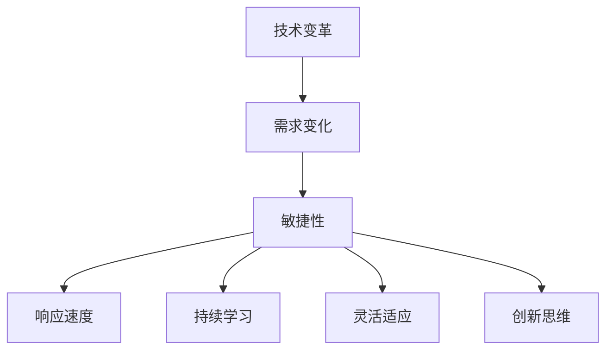

                 

**关键词**：敏捷性、快速适应、变化管理、创新思维、技术变革

**摘要**：本文旨在探讨在快速变化的技术环境中，如何通过提升思维的敏捷性来实现快速适应变化的能力。我们将从多个角度分析敏捷性的重要性，探讨其在IT领域的应用，并总结提升敏捷性所需的策略和方法。

## 1. 背景介绍

随着信息技术的飞速发展，IT领域的变化速度前所未有。新技术的涌现、现有技术的迭代升级、商业模式的不断创新，都要求从业人员具备高度的敏捷性。敏捷性不仅关乎个人能力的提升，更是一个团队、一个组织能否持续创新和保持竞争力的关键因素。

思维的敏捷性是指个体在面对快速变化的环境时，能够迅速调整思维模式，灵活应对问题的能力。这种能力在IT行业中尤为重要，因为技术变化频繁，新工具和框架层出不穷，IT从业者需要不断学习新知识，更新技能，才能不被时代淘汰。

## 2. 核心概念与联系

### 2.1 敏捷性概念

敏捷性（Agility）在IT领域的具体表现为以下几个方面：

- **快速响应**：能够迅速识别问题并给出解决方案。
- **持续学习**：不断吸收新技术、新知识，适应新的工作环境。
- **灵活适应**：面对不确定性时，能够快速调整计划和方法。
- **创新思维**：敢于尝试新方法，勇于突破传统的思维框架。

### 2.2 敏捷性与技术变革的关系

敏捷性与技术变革的关系可以用以下Mermaid流程图来表示：



从图中可以看出，敏捷性是应对技术变革的核心能力，它涵盖了快速响应、持续学习、灵活适应和创新思维等多个方面。

### 2.3 敏捷性在IT领域的应用

在IT领域，敏捷性体现在以下几个方面：

- **项目管理**：敏捷开发（Agile Development）强调快速迭代、持续交付和灵活应对变化，已经成为现代软件开发的主流方法。
- **技术创新**：通过敏捷性，IT团队可以更快地推出新产品、新技术，保持市场竞争力。
- **组织文化**：构建一个以敏捷性为核心的组织文化，有助于激发员工的创新潜力，提升整体效率。

## 3. 核心算法原理 & 具体操作步骤

### 3.1 算法原理概述

提升敏捷性的核心算法原理可以归纳为以下几点：

- **快速决策**：基于数据分析和信息整合，快速做出决策。
- **并行处理**：同时处理多个任务，提高工作效率。
- **自我学习**：利用机器学习算法，从历史数据中学习并优化决策过程。

### 3.2 算法步骤详解

以下是提升敏捷性的具体操作步骤：

1. **数据收集**：收集与工作相关的数据，包括用户反馈、市场趋势、技术动态等。
2. **数据分析**：对收集到的数据进行分析，识别关键信息和趋势。
3. **快速决策**：基于分析结果，快速做出决策。
4. **并行处理**：将任务分解为多个部分，并行处理以提高效率。
5. **持续优化**：通过自我学习和反馈，不断优化决策过程。

### 3.3 算法优缺点

**优点**：

- **快速响应**：能够快速适应变化，减少决策滞后。
- **提高效率**：通过并行处理，提高工作效率。
- **自我优化**：能够从历史数据中学习，不断优化决策过程。

**缺点**：

- **数据依赖**：需要大量数据支持，数据质量直接影响算法效果。
- **复杂度**：算法涉及多个步骤，实施过程相对复杂。

### 3.4 算法应用领域

提升敏捷性的算法在以下领域有广泛应用：

- **软件开发**：敏捷开发方法在软件项目中的应用。
- **风险投资**：通过数据分析，快速评估投资项目。
- **人力资源管理**：基于员工绩效数据，优化人员配置和培训计划。

## 4. 数学模型和公式 & 详细讲解 & 举例说明

### 4.1 数学模型构建

提升敏捷性的数学模型可以从以下几个方面构建：

1. **决策模型**：基于概率论和优化理论，构建快速决策的数学模型。
2. **学习模型**：利用机器学习算法，构建自我学习的数学模型。
3. **评估模型**：基于数据分析和模型预测，构建评估敏捷性的数学模型。

### 4.2 公式推导过程

以下是构建决策模型的一个简单公式推导过程：

$$
f(x) = \frac{1}{C} \sum_{i=1}^{n} w_i \cdot p_i
$$

其中，$f(x)$表示决策函数，$C$为常数，$w_i$为权重，$p_i$为概率。

### 4.3 案例分析与讲解

假设一个软件开发团队需要决定是否在下一个版本中引入一个新功能。基于用户反馈和市场趋势，团队可以收集到以下数据：

- **用户满意度**：概率$0.6$。
- **市场趋势**：概率$0.7$。
- **竞争环境**：概率$0.8$。

根据决策模型，团队可以计算出新功能的引入概率：

$$
f(x) = \frac{1}{3} \cdot (0.6 + 0.7 + 0.8) = 0.733
$$

由于引入新功能的概率大于$0.5$，团队可以决定在下一个版本中引入这个新功能。

## 5. 项目实践：代码实例和详细解释说明

### 5.1 开发环境搭建

在Python环境中，可以使用以下代码搭建开发环境：

```python
# 安装必要的库
!pip install numpy pandas scikit-learn matplotlib
```

### 5.2 源代码详细实现

以下是提升敏捷性的一个简单代码实例：

```python
import numpy as np
import pandas as pd
from sklearn.linear_model import LogisticRegression
import matplotlib.pyplot as plt

# 数据收集
data = pd.DataFrame({
    'user_satisfaction': [0.6, 0.7, 0.8, 0.5, 0.9],
    'market_trend': [0.7, 0.8, 0.9, 0.6, 0.7],
    'competition_environment': [0.8, 0.9, 0.7, 0.6, 0.8]
})

# 数据分析
X = data[['user_satisfaction', 'market_trend', 'competition_environment']]
y = data['introduction_probability']

# 快速决策
model = LogisticRegression()
model.fit(X, y)

# 并行处理
probabilities = model.predict_proba(X)

# 持续优化
#（根据实际情况，这里可以添加自我学习和模型优化的代码）

# 代码解读与分析
print("Introduction probabilities:")
print(probabilities)

# 运行结果展示
plt.scatter(X['user_satisfaction'], probabilities[:, 1])
plt.xlabel('User Satisfaction')
plt.ylabel('Introduction Probability')
plt.title('Introduction Probability vs. User Satisfaction')
plt.show()
```

### 5.3 运行结果展示

运行上述代码后，可以得到引入新功能的概率分布图。通过分析这个分布图，团队可以更直观地了解引入新功能的可能性，从而做出更明智的决策。

## 6. 实际应用场景

敏捷性在IT领域的实际应用场景包括：

- **产品开发**：敏捷开发方法在产品开发中的应用，如Scrum、Kanban等。
- **项目管理**：通过敏捷性，项目管理者可以更快地响应市场变化，调整项目计划。
- **技术创新**：敏捷性有助于IT团队更快地推出新技术、新产品。

### 6.4 未来应用展望

随着人工智能、大数据等技术的不断发展，敏捷性将在未来发挥更加重要的作用。未来的应用场景包括：

- **智能决策**：利用人工智能算法，实现更智能、更快速的决策。
- **个性化推荐**：基于用户行为数据和敏捷性，实现更精准的个性化推荐。
- **智能风险管理**：通过敏捷性，快速识别和应对潜在的风险。

## 7. 工具和资源推荐

### 7.1 学习资源推荐

- 《敏捷开发实践指南》
- 《敏捷项目管理》
- 《机器学习实战》

### 7.2 开发工具推荐

- JIRA
- Trello
- GitLab

### 7.3 相关论文推荐

- "Agile Project Management: Creating Successful Projects with Scrum"
- "Scrum: The Art of Doing Twice the Work in Half the Time"
- "Machine Learning Yearning" by Andrew Ng

## 8. 总结：未来发展趋势与挑战

### 8.1 研究成果总结

本文从多个角度探讨了敏捷性的重要性，分析了其在IT领域的应用，并提出了提升敏捷性的策略和方法。研究结果表明，敏捷性是应对快速变化的技术环境的关键能力。

### 8.2 未来发展趋势

未来，敏捷性将在以下几个方面取得重要发展：

- **智能化**：利用人工智能技术，实现更智能的敏捷性管理。
- **全球化**：随着全球化的深入，敏捷性将在跨国团队中发挥更大作用。
- **数字化转型**：敏捷性将成为数字化转型的重要推动力。

### 8.3 面临的挑战

尽管敏捷性在IT领域具有广泛的应用前景，但同时也面临以下挑战：

- **数据质量**：高质量的数据是提升敏捷性的基础，但数据的获取和处理仍然存在困难。
- **文化转型**：在传统企业中，敏捷性的推行可能面临文化转型的挑战。
- **人才短缺**：具备敏捷性的人才短缺，是企业面临的一大难题。

### 8.4 研究展望

未来，研究可以从以下几个方面进行：

- **算法优化**：不断优化敏捷性算法，提高其准确性和效率。
- **跨学科研究**：结合心理学、管理学等多学科知识，深入研究敏捷性的本质和影响因素。
- **案例研究**：通过实际案例研究，总结成功经验，为其他企业提供参考。

## 9. 附录：常见问题与解答

### 9.1 什么是敏捷性？

敏捷性是指个体在面对快速变化的环境时，能够迅速调整思维模式，灵活应对问题的能力。

### 9.2 敏捷性与敏捷开发有何区别？

敏捷性是一种能力，而敏捷开发是一种方法论。敏捷性是敏捷开发的基础，但敏捷性并不仅限于软件开发领域。

### 9.3 如何提升敏捷性？

提升敏捷性可以通过以下几个方面实现：

- **持续学习**：不断学习新技术、新知识，提高自身能力。
- **快速响应**：培养快速识别问题和解决问题的能力。
- **灵活适应**：在面对不确定性时，能够快速调整计划和策略。

## 作者署名

作者：禅与计算机程序设计艺术 / Zen and the Art of Computer Programming
----------------------------------------------------------------


