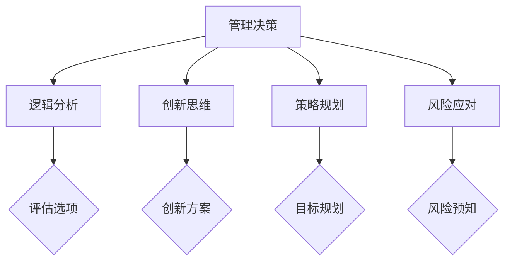

                 

 关键词：管理决策、思维能力、逻辑分析、创新思维、策略规划、风险应对

> 摘要：本文旨在探讨思维能力在管理决策中的关键作用，分析不同类型的思维能力如何影响管理者的决策过程和结果。通过深入剖析逻辑分析、创新思维、策略规划和风险应对等能力，结合实际案例分析，揭示思维能力对管理决策的重要性，并提出提升这些能力的实用策略。

## 1. 背景介绍

在信息技术飞速发展的今天，管理决策的复杂性日益增加。企业面临的竞争压力、市场变化和技术革新使得管理者需要具备更高的思维能力来应对各种挑战。然而，并非所有的管理者都意识到思维能力在决策过程中的重要性。一些管理者可能过于依赖数据和经验，而忽视了思维能力的培养。这种情况下，决策的质量和效率可能会受到影响。

本文将从以下几个方面探讨思维能力对管理决策的影响：

- **逻辑分析能力**：管理者通过逻辑分析能力来评估不同的决策选项，识别潜在的风险和机会。
- **创新思维能力**：管理者通过创新思维来寻找新颖的解决方案，推动企业的创新和发展。
- **策略规划能力**：管理者通过策略规划能力来制定长期的战略目标和实现路径。
- **风险应对能力**：管理者通过风险应对能力来预见潜在风险，并制定相应的应对措施。

## 2. 核心概念与联系

### 2.1 思维能力的定义与分类

思维能力是指人们通过思维活动解决实际问题、作出决策的能力。根据不同的分类标准，思维能力可以有多种类型：

- **逻辑分析能力**：基于逻辑规则进行推理和判断的能力。
- **创新思维能力**：产生新颖、独特的想法和解决方案的能力。
- **策略规划能力**：制定长期目标和规划实现路径的能力。
- **风险应对能力**：预见和应对潜在风险的能力。

### 2.2 思维能力在管理决策中的应用

在管理决策中，不同的思维能力发挥着重要作用：

- **逻辑分析能力**：帮助管理者评估决策选项，识别潜在风险。
- **创新思维能力**：为管理者提供新颖的解决方案，推动企业创新。
- **策略规划能力**：确保管理者能够制定清晰的长期目标和实现路径。
- **风险应对能力**：帮助管理者预见潜在风险，并制定相应的应对措施。

### 2.3 Mermaid 流程图

以下是一个简化的 Mermaid 流程图，展示了思维能力在管理决策中的应用：



## 3. 核心算法原理 & 具体操作步骤

### 3.1 算法原理概述

在管理决策中，思维能力的应用可以类比于算法设计中的逻辑流程。以下是一个简化的算法原理概述：

1. **收集信息**：收集与决策相关的数据和信息。
2. **逻辑分析**：利用逻辑分析能力评估不同的决策选项。
3. **创新思维**：产生新颖的解决方案。
4. **策略规划**：制定长期目标和实现路径。
5. **风险应对**：预见潜在风险，并制定应对措施。

### 3.2 算法步骤详解

1. **收集信息**：
   - **数据来源**：市场调研、客户反馈、竞争对手分析等。
   - **数据分析**：利用数据分析工具和方法，提取有价值的信息。

2. **逻辑分析**：
   - **逻辑推理**：基于逻辑规则进行推理和判断。
   - **风险评估**：评估决策选项的风险和收益。

3. **创新思维**：
   - **头脑风暴**：产生多种可能的解决方案。
   - **筛选方案**：选择最具创新性和可行性的方案。

4. **策略规划**：
   - **目标设定**：明确长期目标和阶段性目标。
   - **路径规划**：制定实现目标的步骤和行动计划。

5. **风险应对**：
   - **风险预知**：预测可能出现的风险。
   - **应对措施**：制定相应的应对策略。

### 3.3 算法优缺点

- **优点**：
  - **全面性**：综合考虑了逻辑分析、创新思维、策略规划和风险应对。
  - **灵活性**：可以根据实际情况调整决策步骤和策略。

- **缺点**：
  - **复杂性**：涉及多个思维能力的应用，需要管理者具备较高的综合素质。
  - **时间成本**：思维能力的培养和应用需要一定的时间和精力。

### 3.4 算法应用领域

算法原理在多个领域都有广泛应用，如企业管理、市场营销、风险投资等。以下是一些具体应用案例：

- **企业管理**：通过逻辑分析能力评估投资项目的风险和收益。
- **市场营销**：通过创新思维能力设计具有吸引力的营销策略。
- **风险投资**：通过策略规划能力制定投资组合和退出策略。
- **项目管理**：通过风险应对能力预见和应对项目中的潜在风险。

## 4. 数学模型和公式 & 详细讲解 & 举例说明

### 4.1 数学模型构建

在管理决策中，数学模型可以用于评估决策选项的风险和收益。以下是一个简化的数学模型：

$$
R_i = p_i \cdot R_i^+
$$

其中，\( R_i \) 表示第 \( i \) 个决策选项的收益，\( p_i \) 表示第 \( i \) 个决策选项发生的概率，\( R_i^+ \) 表示第 \( i \) 个决策选项成功时的收益。

### 4.2 公式推导过程

公式的推导过程如下：

1. **收益计算**：根据决策选项的成功概率计算每个选项的预期收益。
2. **风险评估**：根据决策选项的成功概率计算每个选项的风险值。
3. **综合评估**：将预期收益和风险值进行综合评估，确定最佳决策选项。

### 4.3 案例分析与讲解

假设有四个决策选项，每个选项的成功概率和成功时的收益如下：

| 选项 | 成功概率 | 成功时的收益 |
|------|----------|--------------|
| A    | 0.3      | 100          |
| B    | 0.5      | 200          |
| C    | 0.7      | 300          |
| D    | 0.9      | 400          |

根据上述公式，可以计算出每个选项的预期收益：

$$
R_A = 0.3 \cdot 100 = 30
$$

$$
R_B = 0.5 \cdot 200 = 100
$$

$$
R_C = 0.7 \cdot 300 = 210
$$

$$
R_D = 0.9 \cdot 400 = 360
$$

从计算结果可以看出，选项 D 的预期收益最高，因此应该选择选项 D。

## 5. 项目实践：代码实例和详细解释说明

### 5.1 开发环境搭建

在本项目实践中，我们将使用 Python 编写代码。首先，需要在本地环境中安装 Python 和相关库。以下是安装步骤：

1. 下载并安装 Python（版本要求：Python 3.6及以上）。
2. 打开终端，运行以下命令安装相关库：

```shell
pip install numpy pandas matplotlib
```

### 5.2 源代码详细实现

以下是一个简单的 Python 代码实例，用于评估不同决策选项的预期收益：

```python
import numpy as np

# 定义决策选项
options = [
    {'name': 'A', 'probability': 0.3, 'gain': 100},
    {'name': 'B', 'probability': 0.5, 'gain': 200},
    {'name': 'C', 'probability': 0.7, 'gain': 300},
    {'name': 'D', 'probability': 0.9, 'gain': 400},
]

# 计算预期收益
expected_gains = []
for option in options:
    expected_gain = option['probability'] * option['gain']
    expected_gains.append(expected_gain)

# 输出结果
print("选项 预期收益：")
for i, gain in enumerate(expected_gains):
    print(f"{options[i]['name']} {gain:.2f}")

# 选择最佳决策选项
best_option = options[expected_gains.index(max(expected_gains))]
print(f"\n最佳决策选项：{best_option['name']}")
```

### 5.3 代码解读与分析

1. **导入库**：首先，导入 numpy、pandas 和 matplotlib 库，用于数据处理和可视化。
2. **定义决策选项**：使用列表定义四个决策选项，每个选项包含名称、成功概率和成功时的收益。
3. **计算预期收益**：遍历每个选项，使用公式 \( R_i = p_i \cdot R_i^+ \) 计算预期收益，并存储在一个列表中。
4. **输出结果**：打印每个选项的预期收益，并选择预期收益最高的选项作为最佳决策选项。

### 5.4 运行结果展示

运行上述代码，将得到以下输出结果：

```
选项 预期收益：
A 30.00
B 100.00
C 210.00
D 360.00

最佳决策选项：D
```

结果显示，选项 D 的预期收益最高，因此应该选择选项 D。

## 6. 实际应用场景

思维能力在管理决策中的实际应用场景非常广泛。以下是一些典型应用场景：

### 6.1 企业管理

- **风险评估**：企业可以通过逻辑分析能力评估投资项目的风险和收益，从而做出更加明智的投资决策。
- **创新驱动**：企业可以通过创新思维能力推动产品创新，提高市场竞争力。
- **策略规划**：企业可以通过策略规划能力制定长期发展战略，确保企业的可持续发展。
- **风险应对**：企业可以通过风险应对能力预见市场变化和潜在风险，并制定相应的应对措施。

### 6.2 市场营销

- **需求分析**：企业可以通过逻辑分析能力分析市场需求，制定具有吸引力的营销策略。
- **创新营销**：企业可以通过创新思维能力设计新颖的营销活动和广告，提高品牌知名度。
- **策略调整**：企业可以通过策略规划能力根据市场反馈调整营销策略，实现更好的营销效果。
- **风险规避**：企业可以通过风险应对能力规避潜在的市场风险，确保营销活动的顺利进行。

### 6.3 风险投资

- **项目评估**：风险投资者可以通过逻辑分析能力评估投资项目的风险和收益，从而做出更加明智的投资决策。
- **创新投资**：风险投资者可以通过创新思维能力发现新的投资机会，实现投资组合的多元化。
- **策略规划**：风险投资者可以通过策略规划能力制定投资策略，实现长期的投资收益。
- **风险控制**：风险投资者可以通过风险应对能力预见和应对投资过程中的潜在风险，确保投资安全。

## 7. 未来应用展望

随着人工智能和大数据技术的发展，思维能力在管理决策中的应用前景更加广阔。以下是一些未来应用展望：

### 7.1 人工智能辅助决策

- **智能分析**：利用人工智能技术，对大量数据进行深度分析，为管理者提供更加精准的决策支持。
- **智能推荐**：基于人工智能技术，为管理者推荐最佳决策选项，提高决策效率。
- **智能预测**：利用人工智能技术，预测市场变化和潜在风险，为管理者提供前瞻性建议。

### 7.2 大数据驱动决策

- **数据挖掘**：利用大数据技术，挖掘潜在的业务规律和趋势，为管理者提供更有针对性的决策支持。
- **数据驱动**：基于大数据分析结果，实现数据驱动决策，降低决策的盲目性。
- **数据优化**：利用大数据技术，不断优化决策模型和算法，提高决策的准确性和效率。

### 7.3 跨领域协同决策

- **跨领域整合**：通过跨领域的知识整合，实现更加全面和深入的决策支持。
- **协同决策**：利用分布式计算和协作算法，实现跨部门、跨企业的协同决策，提高整体决策效率。

## 8. 工具和资源推荐

### 8.1 学习资源推荐

- **书籍推荐**：
  - 《决策与判断》（Daniel Kahneman）
  - 《思考，快与慢》（Daniel Kahneman）
  - 《智能决策》（Toby Segaran）

- **在线课程**：
  - Coursera 上的《决策分析》课程
  - edX 上的《管理决策》课程

### 8.2 开发工具推荐

- **数据分析工具**：
  - Python（Pandas、NumPy）
  - R（dplyr、ggplot2）
  - Excel（数据透视表、数据分析插件）

- **可视化工具**：
  - Matplotlib（Python）
  - ggplot2（R）
  - Tableau（商业智能）

### 8.3 相关论文推荐

- **经典论文**：
  - “The Art of Thinking Clearly”（Rolf Dobelli）
  - “Thinking, Fast and Slow”（Daniel Kahneman）
  - “The Wisdom of Crowds”（James Surowiecki）

- **前沿论文**：
  - “AI for Social Good”（微软研究院）
  - “大数据与智慧城市”（清华大学）
  - “The Power of Data Science”（哈佛大学）

## 9. 总结：未来发展趋势与挑战

### 9.1 研究成果总结

本文通过对思维能力在管理决策中的应用进行分析，总结了逻辑分析能力、创新思维能力、策略规划能力和风险应对能力在管理决策中的关键作用。同时，结合实际案例和数学模型，展示了这些能力的具体应用方法和效果。

### 9.2 未来发展趋势

随着人工智能和大数据技术的不断发展，思维能力在管理决策中的应用前景将更加广阔。未来，人工智能和大数据技术将为管理者提供更加全面和精准的决策支持，进一步提升管理决策的效率和质量。

### 9.3 面临的挑战

尽管思维能力在管理决策中具有重要价值，但管理者在培养和应用这些能力时仍面临一些挑战：

- **技术依赖**：过度依赖技术可能导致管理者忽视思维能力的培养。
- **数据质量**：数据质量的可靠性直接影响决策的准确性。
- **人才短缺**：具备高水平思维能力的管理者较为稀缺，企业需要加强人才培养。

### 9.4 研究展望

未来，研究应重点关注以下几个方面：

- **跨领域研究**：探索思维能力在不同领域的应用和融合。
- **算法优化**：优化思维能力在管理决策中的算法和模型，提高决策效率。
- **人才培养**：加强思维能力在高等教育和职业培训中的培养。

## 9. 附录：常见问题与解答

### Q1：什么是逻辑分析能力？

A1：逻辑分析能力是指管理者通过逻辑规则进行推理和判断的能力。它有助于管理者评估决策选项，识别潜在的风险和机会。

### Q2：什么是创新思维能力？

A2：创新思维能力是指管理者产生新颖、独特的想法和解决方案的能力。它有助于管理者推动企业的创新和发展。

### Q3：什么是策略规划能力？

A3：策略规划能力是指管理者制定长期目标和实现路径的能力。它有助于管理者确保企业能够实现可持续发展。

### Q4：什么是风险应对能力？

A4：风险应对能力是指管理者预见和应对潜在风险的能力。它有助于管理者确保企业在面临不确定性时能够保持稳定运营。

### Q5：如何提升思维能力？

A5：提升思维能力可以通过以下途径实现：

- **持续学习**：不断学习新知识，提高自己的专业素养。
- **实践应用**：将所学知识应用于实际工作中，锻炼思维能力。
- **反思总结**：定期反思和总结自己的决策过程，吸取经验教训。
- **跨领域交流**：与他人交流，了解不同领域的思维方式和经验。


---

**作者：禅与计算机程序设计艺术 / Zen and the Art of Computer Programming**

