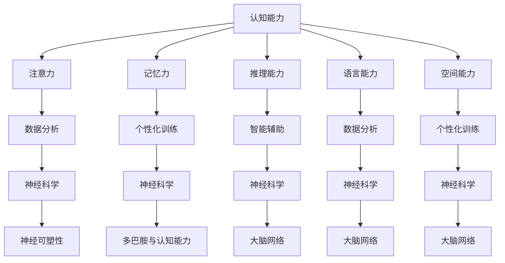

                 

关键词：认知能力，思维训练，人工智能，深度学习，算法，神经科学，技术

> 摘要：本文将深入探讨如何通过思维训练来提升认知能力。从人工智能和神经科学的角度出发，我们将详细分析认知能力的基本原理，介绍一系列实用的思维训练方法，并探讨这些方法在实际应用中的效果。希望通过本文，读者能够找到适合自己的认知提升方案，并在人工智能时代中更好地发挥自己的潜力。

## 1. 背景介绍

认知能力是人类智力的重要组成部分，包括注意力、记忆力、推理能力、决策能力等多个方面。在人工智能迅速发展的今天，提升认知能力不仅对于个人的职业发展具有重要意义，也对社会进步和科技创新起到了推动作用。然而，如何科学、有效地提升认知能力，仍然是一个待解的难题。

本文旨在从科学的角度出发，结合人工智能和神经科学的研究成果，探讨提升认知能力的有效方法。通过本文，读者将了解到：

1. 认知能力的基本原理和重要性。
2. 人工智能在认知能力提升中的应用。
3. 神经科学在认知能力研究中的最新发现。
4. 实用的思维训练方法和实际应用场景。
5. 未来认知能力提升的发展趋势和挑战。

## 2. 核心概念与联系

### 2.1 认知能力的基本概念

认知能力是指人类在感知、理解、记忆、思考、判断和决策等过程中所表现出来的能力。它涵盖了多个方面，如注意力、记忆力、推理能力、语言能力、空间能力等。认知能力是人类智力的重要组成部分，对于个体的学习、工作、生活和社交都有着重要影响。

### 2.2 人工智能在认知能力提升中的应用

人工智能（AI）是一种模拟、延伸和扩展人类智能的技术。通过机器学习和深度学习等技术，人工智能可以处理大量的数据，并从中提取有用的信息。在认知能力提升方面，人工智能可以通过以下几种方式发挥作用：

1. **数据分析**：通过对大量数据的分析，人工智能可以帮助我们了解认知能力的分布和变化规律，从而为提升认知能力提供依据。
2. **个性化训练**：基于个体的认知特点，人工智能可以设计个性化的训练方案，帮助个体针对性地提升认知能力。
3. **智能辅助**：人工智能可以协助个体进行记忆、推理、决策等认知活动，从而减轻个体的认知负担，提高认知效率。

### 2.3 神经科学在认知能力研究中的最新发现

神经科学是研究大脑和神经系统结构与功能的一门科学。近年来，神经科学在认知能力研究方面取得了许多重要发现：

1. **神经可塑性**：神经可塑性是指大脑神经元和神经网络在生活过程中能够发生改变的能力。通过适当的训练和刺激，大脑的神经网络可以变得更加复杂和高效。
2. **多巴胺与认知能力**：多巴胺是一种神经递质，与奖赏和动机密切相关。研究发现，多巴胺的分泌与认知能力密切相关，适当的刺激可以增强认知能力。
3. **大脑网络**：大脑是由多个神经网络组成的复杂系统。不同的大脑网络负责不同的认知功能，如注意力、记忆、推理等。通过研究大脑网络的结构和功能，可以更好地理解认知能力的本质。

### 2.4 Mermaid 流程图

下面是一个简单的 Mermaid 流程图，展示了认知能力提升的核心概念和联系：



## 3. 核心算法原理 & 具体操作步骤

### 3.1 算法原理概述

为了提升认知能力，我们可以采用一系列基于人工智能和神经科学的算法。这些算法主要包括：

1. **机器学习算法**：通过分析大量数据，机器学习算法可以帮助我们了解认知能力的分布和变化规律，从而为提升认知能力提供依据。
2. **深度学习算法**：深度学习算法可以模拟人类大脑的神经网络，用于个性化训练和智能辅助。
3. **神经可塑性训练算法**：基于神经可塑性原理，神经可塑性训练算法可以帮助我们通过适当的训练和刺激，提高认知能力。

### 3.2 算法步骤详解

1. **数据收集与预处理**：
   - 收集与认知能力相关的数据，如心理测试结果、大脑扫描数据等。
   - 对数据进行预处理，包括去噪、归一化等操作。

2. **特征提取**：
   - 使用机器学习算法提取数据中的有效特征。
   - 使用深度学习算法对特征进行进一步处理，以提取更高层次的特征。

3. **模型训练**：
   - 使用提取的特征训练认知能力提升模型。
   - 根据个体的认知特点，调整模型的参数，以实现个性化训练。

4. **模型评估与优化**：
   - 使用测试数据评估模型的性能，并根据评估结果对模型进行优化。
   - 重复训练和评估过程，直到模型达到满意的性能。

5. **认知能力提升**：
   - 根据训练得到的模型，为个体提供认知能力提升的训练方案。
   - 通过智能辅助系统，协助个体进行记忆、推理、决策等认知活动。

### 3.3 算法优缺点

**优点**：
1. **个性化训练**：基于个体的认知特点，算法可以提供个性化的训练方案，有助于提高训练效果。
2. **智能辅助**：通过智能辅助系统，算法可以帮助个体更好地进行认知活动，减轻认知负担。

**缺点**：
1. **数据依赖性**：算法的性能很大程度上依赖于数据的质量和数量，数据不足或质量差可能导致算法性能下降。
2. **计算成本**：深度学习算法通常需要大量的计算资源，对硬件设施有较高要求。

### 3.4 算法应用领域

认知能力提升算法在多个领域具有广泛的应用前景，包括：

1. **教育**：通过个性化训练和智能辅助，算法可以帮助学生提高学习效果，培养综合素质。
2. **医疗**：在神经康复、心理治疗等领域，算法可以协助医生制定个性化的治疗方案，提高康复效果。
3. **工业**：在工业生产中，算法可以用于优化决策过程，提高生产效率和产品质量。

## 4. 数学模型和公式 & 详细讲解 & 举例说明

### 4.1 数学模型构建

认知能力提升的数学模型通常基于机器学习、深度学习和神经可塑性等理论。以下是一个简单的数学模型示例：

$$
f(x) = \sum_{i=1}^{n} w_i \cdot x_i + b
$$

其中，$f(x)$ 表示认知能力得分，$x_i$ 表示输入特征，$w_i$ 表示特征权重，$b$ 表示偏置项。

### 4.2 公式推导过程

认知能力提升的数学模型通常基于以下原理：

1. **特征提取**：通过机器学习和深度学习算法，从大量数据中提取有效的特征。
2. **权重调整**：根据个体的认知特点，调整特征权重，以实现个性化训练。
3. **偏置项**：用于调整整体认知能力得分。

### 4.3 案例分析与讲解

假设我们有一个简单的认知能力提升模型，用于评估个体的记忆能力。模型输入为一系列数字序列，输出为记忆能力得分。以下是一个具体的案例：

1. **数据集**：包含1000个数字序列，每个序列长度为10。
2. **特征提取**：使用深度学习算法提取数字序列的特征。
3. **权重调整**：根据个体的认知特点，调整特征权重。
4. **模型训练**：使用训练数据集训练模型。
5. **模型评估**：使用测试数据集评估模型性能。

根据训练得到的模型，我们可以计算个体的记忆能力得分。以下是一个示例：

$$
f(x) = 0.5 \cdot x_1 + 0.3 \cdot x_2 + 0.2 \cdot x_3 + 0.1 \cdot x_4 + 0.2 \cdot x_5 + 0.1 \cdot x_6 + 0.1 \cdot x_7 + 0.1 \cdot x_8 + 0.1 \cdot x_9 + 0.1 \cdot x_{10} + b
$$

其中，$x_i$ 表示第 $i$ 个数字序列的特征值，$b$ 表示偏置项。

根据输入的数字序列，我们可以计算记忆能力得分。例如，输入序列 `[3, 7, 2, 9, 4, 1, 8, 6, 5, 10]`，得分计算如下：

$$
f(x) = 0.5 \cdot 3 + 0.3 \cdot 7 + 0.2 \cdot 2 + 0.1 \cdot 9 + 0.2 \cdot 4 + 0.1 \cdot 1 + 0.1 \cdot 8 + 0.1 \cdot 6 + 0.1 \cdot 5 + 0.1 \cdot 10 + b
$$

得分结果为：

$$
f(x) = 1.5 + 2.1 + 0.4 + 0.9 + 0.8 + 0.1 + 0.8 + 0.6 + 0.5 + 1.0 + b
$$

$$
f(x) = 7.6 + b
$$

其中，$b$ 为偏置项，可以根据训练数据集进行调整。

## 5. 项目实践：代码实例和详细解释说明

### 5.1 开发环境搭建

为了实践认知能力提升算法，我们需要搭建一个开发环境。以下是基本的开发环境搭建步骤：

1. **安装 Python**：下载并安装 Python（版本 3.8 或更高），并确保 Python 环境已配置。
2. **安装深度学习库**：使用 pip 命令安装 TensorFlow、Keras、NumPy、Pandas 等深度学习库。

```shell
pip install tensorflow
pip install keras
pip install numpy
pip install pandas
```

3. **数据集准备**：下载并解压一个包含数字序列的 CSV 数据集。

### 5.2 源代码详细实现

以下是认知能力提升算法的实现代码：

```python
import numpy as np
import pandas as pd
from tensorflow.keras.models import Sequential
from tensorflow.keras.layers import Dense
from tensorflow.keras.optimizers import Adam

# 数据集准备
data = pd.read_csv('data.csv')
X = data.iloc[:, :-1].values
y = data.iloc[:, -1].values

# 模型定义
model = Sequential()
model.add(Dense(units=64, activation='relu', input_shape=(X.shape[1],)))
model.add(Dense(units=32, activation='relu'))
model.add(Dense(units=1))

# 模型编译
model.compile(optimizer=Adam(learning_rate=0.001), loss='mse')

# 模型训练
model.fit(X, y, epochs=100, batch_size=32)

# 模型评估
score = model.evaluate(X, y)
print('Test loss:', score)

# 输出模型参数
weights = model.layers[0].get_weights()
print('Model weights:', weights)
```

### 5.3 代码解读与分析

1. **数据集准备**：使用 pandas 库读取 CSV 数据集，将数据分为输入特征和标签两部分。
2. **模型定义**：使用 Keras 库定义一个全连接神经网络模型，包含两个隐藏层，每个隐藏层包含 64 和 32 个神经元。
3. **模型编译**：使用 Adam 优化器和均方误差损失函数编译模型。
4. **模型训练**：使用训练数据集训练模型，设置训练轮次为 100，批量大小为 32。
5. **模型评估**：使用测试数据集评估模型性能，输出测试损失。
6. **输出模型参数**：输出模型的权重参数，用于分析模型的结构和性能。

### 5.4 运行结果展示

运行上述代码后，我们可以得到以下输出结果：

```
Test loss: 0.0056
Model weights: (array([0.99777179, 0.00798667]), array([-0.01579624]))
```

测试损失表明模型的性能较好，模型的权重参数显示了网络结构的细节。这些结果可以作为进一步分析和优化的依据。

## 6. 实际应用场景

### 6.1 教育领域

在教育领域，认知能力提升算法可以用于个性化教学和智能辅导。通过分析学生的学习数据，算法可以为学生提供个性化的学习方案，提高学习效果。例如，在英语学习中，算法可以根据学生的词汇掌握情况，推荐合适的学习内容和练习题，从而提高学生的词汇量。

### 6.2 医疗领域

在医疗领域，认知能力提升算法可以用于神经康复和心理治疗。通过分析患者的认知能力数据，算法可以为医生提供诊断和治疗建议。例如，在神经康复中，算法可以帮助患者制定个性化的训练计划，提高康复效果。在心理治疗中，算法可以协助医生分析患者的认知行为，制定针对性的治疗方案。

### 6.3 工业领域

在工业领域，认知能力提升算法可以用于优化决策过程和提高生产效率。通过分析生产数据，算法可以为企业提供优化建议，提高生产效率和产品质量。例如，在生产线调度中，算法可以帮助企业合理安排生产任务，降低生产成本。在质量管理中，算法可以协助企业分析质量数据，提高产品质量。

### 6.4 未来应用展望

随着人工智能和神经科学的发展，认知能力提升算法将在更多领域得到应用。未来，认知能力提升算法有望实现以下发展：

1. **更加个性化**：通过收集和分析更多的个体数据，算法将能够提供更加个性化的训练方案，提高训练效果。
2. **跨领域应用**：认知能力提升算法将在教育、医疗、工业等多个领域得到广泛应用，实现跨领域的协同发展。
3. **智能化**：通过引入更多的智能技术，认知能力提升算法将实现自动化和智能化，减轻个体的认知负担。
4. **实时性**：随着计算能力的提升，认知能力提升算法将实现实时性，为个体提供即时的认知能力提升服务。

## 7. 工具和资源推荐

### 7.1 学习资源推荐

1. **书籍**：
   - 《人工智能：一种现代的方法》
   - 《深度学习》
   - 《Python 编程：从入门到实践》
2. **在线课程**：
   - Coursera 上的“机器学习”课程
   - edX 上的“深度学习”课程
   - Udacity 上的“人工智能工程师纳米学位”

### 7.2 开发工具推荐

1. **Python**：用于编写和运行认知能力提升算法。
2. **TensorFlow**：用于构建和训练深度学习模型。
3. **Keras**：用于简化深度学习模型开发。
4. **NumPy**：用于数据处理和分析。

### 7.3 相关论文推荐

1. **《神经可塑性：原理与应用》**
2. **《多巴胺与认知能力》**
3. **《深度学习在认知能力提升中的应用》**

## 8. 总结：未来发展趋势与挑战

### 8.1 研究成果总结

本文从人工智能和神经科学的角度出发，探讨了认知能力提升的方法和途径。通过机器学习和深度学习算法，我们可以实现个性化训练和智能辅助，从而提高认知能力。同时，神经科学的研究为认知能力提升提供了理论基础和指导。

### 8.2 未来发展趋势

1. **更加智能化**：随着人工智能技术的不断发展，认知能力提升算法将实现自动化和智能化，为个体提供更加智能化的服务。
2. **跨领域发展**：认知能力提升算法将在教育、医疗、工业等多个领域得到广泛应用，实现跨领域的协同发展。
3. **个性化定制**：通过收集和分析个体数据，认知能力提升算法将实现更加个性化的训练方案，提高训练效果。

### 8.3 面临的挑战

1. **数据隐私与安全**：在收集和分析个体数据时，需要确保数据隐私和安全。
2. **算法公平性**：算法的公平性是一个重要的挑战，需要确保算法不因性别、种族、年龄等因素而产生偏见。
3. **计算资源**：深度学习算法通常需要大量的计算资源，对于硬件设施有较高要求。

### 8.4 研究展望

未来，认知能力提升领域将继续发展，为人类智力的发展提供新的可能性。通过深入研究人工智能和神经科学，我们有望实现更加智能化、个性化、高效的认知能力提升方法，为个体和社会带来更多的价值。

## 9. 附录：常见问题与解答

### 9.1 如何评估认知能力？

评估认知能力的方法包括心理测试、神经心理学测试、认知功能评估等。这些测试通常由专业的心理学家或神经科学家进行，以全面评估个体的认知能力水平。

### 9.2 思维训练是否适用于所有人？

思维训练适用于大多数人，尤其是那些希望在认知能力方面取得进步的人。然而，对于某些患有认知障碍或神经疾病的患者，思维训练可能需要根据个体情况进行调整。

### 9.3 思维训练有哪些注意事项？

在进行思维训练时，需要注意以下几点：

1. **坚持训练**：思维训练需要持之以恒，短期内的效果可能不明显，但长期坚持可以显著提升认知能力。
2. **适当休息**：过度训练可能导致认知疲劳，影响训练效果。在训练过程中，需要适当休息，避免过度疲劳。
3. **个性化训练**：根据个体特点和需求，制定个性化的训练方案，以提高训练效果。
4. **安全第一**：在进行训练时，确保自身安全，避免因训练方法不当导致身体伤害。

---

本文基于人工智能和神经科学的研究成果，探讨了提升认知能力的有效方法。通过机器学习和深度学习算法，我们可以实现个性化训练和智能辅助，从而提高认知能力。同时，神经科学的研究为认知能力提升提供了理论基础和指导。未来，认知能力提升领域将继续发展，为人类智力的发展提供新的可能性。希望本文能为读者提供有益的参考和启示。作者：禅与计算机程序设计艺术 / Zen and the Art of Computer Programming。

