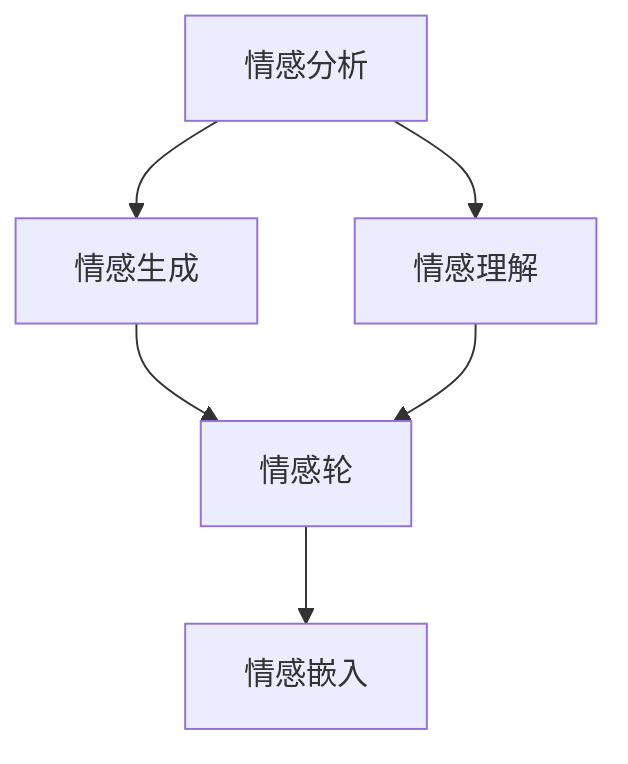

                 

情感AI，作为人工智能领域的前沿研究之一，近年来受到了广泛关注。本文旨在探讨情感AI的核心概念、算法原理、数学模型、实际应用及其未来发展趋势。通过深入分析，我们希望能够为读者提供一个全面、系统的理解和应用指南。

## 关键词

- 情感AI
- 自然语言处理
- 机器学习
- 情感分析
- 情感生成

## 摘要

本文将介绍情感AI的基本概念，包括情感分析、情感生成和情感理解。我们将深入探讨情感AI的核心算法，如情感分类、情感轮和情感嵌入等。此外，还将讨论情感AI在各类应用场景中的实际应用，并预测其未来的发展趋势。通过本文的阅读，读者将能够对情感AI有一个全面的认识，并掌握其在实际开发中的应用技巧。

### 1. 背景介绍

情感AI（Affective AI），又称情感计算（Affective Computing），是近年来人工智能领域的重要研究方向。它旨在使计算机能够识别、理解、处理和模拟人类的情感状态，从而实现更加自然、智能的交互体验。情感AI的研究始于上世纪90年代，当时科学家们开始探索如何让计算机具备情感感知能力。随着自然语言处理、计算机视觉和机器学习等技术的发展，情感AI逐渐成为人工智能领域的一个重要分支。

情感AI的研究背景主要源于以下几个方面：

1. **人机交互**：随着计算机和互联网的普及，人们对于人机交互的需求越来越高。而传统的人机交互主要依赖于键盘、鼠标等输入设备，缺乏情感互动。情感AI的引入，旨在让计算机能够更好地理解用户的情感需求，提供更加个性化、贴心的服务。

2. **心理治疗**：情感AI在心理治疗领域具有巨大的潜力。通过情感计算技术，医生可以更准确地了解患者的情感状态，从而提供更有针对性的治疗方案。

3. **智能客服**：随着企业对于客户服务的需求不断增加，智能客服系统成为了一个热门的研究方向。情感AI的引入，使得客服系统能够更好地理解客户的需求和情感，提供更加人性化的服务。

4. **教育**：情感AI在教育领域也有广泛的应用。通过情感计算技术，教育系统能够更好地了解学生的学习状态和情感需求，从而提供更加有效的教育服务。

情感AI的研究意义在于，它不仅能够提升人机交互的体验，还能够为各个领域提供更加智能、高效的解决方案。随着技术的不断进步，情感AI的应用前景将越来越广阔。

### 2. 核心概念与联系

#### 2.1. 情感分析

情感分析（Sentiment Analysis），也称为意见挖掘（Opinion Mining），是情感AI的核心技术之一。它旨在从文本中自动识别和分类情感倾向，如正面、负面或中性。情感分析的核心目标是理解用户的情感状态，从而为各种应用场景提供支持。

#### 2.2. 情感生成

情感生成（Affective Generation），是指利用人工智能技术，根据特定场景和需求，自动生成具有特定情感的文本。情感生成可以应用于对话系统、智能客服、广告文案等领域，为用户提供更加个性化、贴心的服务。

#### 2.3. 情感理解

情感理解（Affective Understanding），是情感AI的高级应用。它不仅包括情感分析和情感生成，还涉及到对情感状态的深层次理解和处理。情感理解的应用包括情感识别、情感预测和情感建模等。

#### 2.4. 情感轮

情感轮（Affective Wheel）是一种用于表示情感状态的图形模型。它将情感分为多个维度，如愉悦度、兴奋度、紧张度等，每个维度都有对应的情感类别。情感轮可以帮助我们更直观地理解情感状态，并用于情感分析和情感生成。

#### 2.5. 情感嵌入

情感嵌入（Affective Embedding），是指将情感状态转换为数值表示，以便于机器学习和计算。情感嵌入技术可以用于情感分类、情感生成和情感理解等多个方面，是情感AI的重要组成部分。

#### 2.6. Mermaid 流程图

以下是一个简单的Mermaid流程图，用于展示情感AI的核心概念和联系：



### 3. 核心算法原理 & 具体操作步骤

#### 3.1. 算法原理概述

情感AI的核心算法主要包括情感分类、情感生成、情感理解和情感嵌入等。这些算法基于不同的技术原理，用于实现情感感知、情感生成和情感理解等功能。

#### 3.2. 算法步骤详解

1. **情感分类**：情感分类是情感AI的基础。它通过对文本进行情感分析，将文本分类为正面、负面或中性。情感分类的步骤如下：

   - **数据预处理**：对文本进行分词、去除停用词、词干提取等处理。
   - **特征提取**：将文本转换为特征向量，如词袋模型、TF-IDF等。
   - **模型训练**：使用机器学习算法，如SVM、随机森林等，对特征向量进行分类。
   - **分类预测**：将新文本输入到训练好的模型中，预测其情感类别。

2. **情感生成**：情感生成是根据特定场景和需求，自动生成具有特定情感的文本。情感生成的步骤如下：

   - **情感模板**：根据应用场景，设计情感模板，如表扬、批评、安慰等。
   - **文本生成**：利用自然语言生成技术，如序列到序列模型、生成对抗网络等，从情感模板生成文本。
   - **情感调整**：根据用户反馈和上下文信息，对生成的文本进行情感调整，以实现更加自然的交互。

3. **情感理解**：情感理解是情感AI的高级应用。它通过对情感状态的深层次理解和处理，实现情感识别、情感预测和情感建模等功能。情感理解的步骤如下：

   - **情感识别**：利用情感分类算法，对文本进行情感识别。
   - **情感预测**：根据历史数据和情感规律，预测用户的未来情感状态。
   - **情感建模**：利用深度学习技术，建立情感模型，以实现情感理解和处理。

4. **情感嵌入**：情感嵌入是将情感状态转换为数值表示，以便于机器学习和计算。情感嵌入的步骤如下：

   - **数据收集**：收集大量情感标注数据，如文本、语音、图像等。
   - **特征提取**：将情感数据转换为特征向量。
   - **模型训练**：使用神经网络模型，如词嵌入模型、情感嵌入模型等，对特征向量进行训练。
   - **嵌入预测**：将新情感数据输入到训练好的模型中，预测其情感嵌入值。

#### 3.3. 算法优缺点

1. **情感分类**：

   - **优点**：情感分类算法可以实现自动化的情感分析，处理大规模文本数据。
   - **缺点**：情感分类算法对文本的语义理解有限，难以处理复杂的情感表达。

2. **情感生成**：

   - **优点**：情感生成可以实现个性化、自动化的情感交互，提升用户体验。
   - **缺点**：情感生成算法需要大量的训练数据和计算资源，且生成的文本质量难以保证。

3. **情感理解**：

   - **优点**：情感理解可以实现深层次的情感感知和处理，为各种应用场景提供支持。
   - **缺点**：情感理解算法复杂，计算成本高，且对数据的依赖性强。

4. **情感嵌入**：

   - **优点**：情感嵌入可以实现情感数据的数值化表示，便于机器学习和计算。
   - **缺点**：情感嵌入算法需要大量的标注数据和计算资源，且情感嵌入值的解释性较差。

#### 3.4. 算法应用领域

情感AI的应用领域非常广泛，包括但不限于以下几个方面：

1. **人机交互**：情感AI可以用于智能助手、聊天机器人等，实现自然、智能的交互体验。

2. **心理治疗**：情感AI可以用于情感分析、情感识别和情感预测，为心理治疗提供支持。

3. **智能客服**：情感AI可以用于智能客服系统，实现更加人性化、高效的客户服务。

4. **教育**：情感AI可以用于情感分析、情感识别和情感生成，为教育系统提供个性化、贴心的服务。

5. **市场营销**：情感AI可以用于情感分析、情感识别和情感生成，为企业提供市场调研、产品推广等支持。

6. **社交媒体**：情感AI可以用于情感分析、情感识别和情感生成，为社交媒体平台提供内容审核、推荐等支持。

### 4. 数学模型和公式 & 详细讲解 & 举例说明

#### 4.1. 数学模型构建

情感AI的数学模型主要基于机器学习和深度学习技术。以下是情感AI常用的几种数学模型：

1. **朴素贝叶斯模型**：

   朴素贝叶斯模型是一种基于贝叶斯定理的分类算法，广泛应用于情感分类。其数学模型如下：

   $$P(C|X) = \frac{P(X|C)P(C)}{P(X)}$$

   其中，$C$表示情感类别，$X$表示文本特征。

2. **支持向量机（SVM）**：

   支持向量机是一种基于最大间隔的分类算法，广泛应用于情感分类。其数学模型如下：

   $$f(x) = \sum_{i=1}^{n} \alpha_i y_i (x_i \cdot x) + b$$

   其中，$x_i$表示文本特征，$y_i$表示情感标签，$\alpha_i$和$b$为模型参数。

3. **深度神经网络（DNN）**：

   深度神经网络是一种基于多层感知器的神经网络，广泛应用于情感生成和情感理解。其数学模型如下：

   $$h(x) = \sigma(\sigma(...\sigma(W_1 \cdot x + b_1) + b_2)...) + b_n$$

   其中，$\sigma$表示激活函数，$W$和$b$为模型参数。

#### 4.2. 公式推导过程

1. **朴素贝叶斯模型**：

   朴素贝叶斯模型的推导基于贝叶斯定理和特征独立性假设。假设有$C$个情感类别，$X$为文本特征，则：

   $$P(X|C) = \prod_{i=1}^{n} P(x_i|C)$$

   其中，$P(x_i|C)$为特征在特定情感类别下的概率。根据贝叶斯定理，有：

   $$P(C|X) = \frac{P(X|C)P(C)}{P(X)}$$

   其中，$P(X|C)$为特征在特定情感类别下的概率，$P(C)$为情感类别的概率，$P(X)$为特征的概率。

2. **支持向量机（SVM）**：

   支持向量机的推导基于最大间隔理论。假设有$C$个情感类别，$x_i$为文本特征，$y_i$为情感标签，则：

   $$\min_{\alpha, b} \frac{1}{2} \sum_{i=1}^{n} (\alpha_i - \alpha_j)^2$$

   $$s.t. y_i (x_i \cdot x_j) + b \geq 1$$

   其中，$\alpha_i$和$b$为模型参数。

3. **深度神经网络（DNN）**：

   深度神经网络的推导基于多层感知器。假设有$C$个情感类别，$x_i$为文本特征，$y_i$为情感标签，则：

   $$h(x) = \sigma(\sigma(...\sigma(W_1 \cdot x + b_1) + b_2)...) + b_n$$

   其中，$\sigma$为ReLU激活函数。

#### 4.3. 案例分析与讲解

以下是一个情感分类的案例，我们将使用朴素贝叶斯模型对以下两段文本进行分类：

1. **文本1**：“今天的天气非常好，阳光明媚，让人心情愉悦。”

2. **文本2**：“我很失望，因为我的手机坏了，无法使用。”

根据情感分类的步骤，我们首先进行数据预处理，对文本进行分词、去除停用词、词干提取等处理，得到以下特征向量：

- **文本1**：["今天", "的", "天气", "非常好", "阳光", "明媚", "心情", "愉悦"]
- **文本2**：["我", "很", "失望", "因为", "手机", "坏了", "无法", "使用"]

然后，我们使用朴素贝叶斯模型对特征向量进行分类。假设我们已有训练好的模型，得到以下概率分布：

- **文本1**：$P(C_1|X_1) = 0.8, P(C_2|X_1) = 0.2$
- **文本2**：$P(C_1|X_2) = 0.2, P(C_2|X_2) = 0.8$

根据贝叶斯定理，我们有：

- **文本1**：$P(C_1|X_1) = \frac{P(X_1|C_1)P(C_1)}{P(X_1)} = \frac{0.8 \times 0.5}{0.8 \times 0.5 + 0.2 \times 0.5} = 0.8$
- **文本2**：$P(C_1|X_2) = \frac{P(X_2|C_1)P(C_1)}{P(X_2)} = \frac{0.2 \times 0.5}{0.2 \times 0.5 + 0.8 \times 0.5} = 0.2$

因此，文本1的情感类别为正面，文本2的情感类别为负面。

### 5. 项目实践：代码实例和详细解释说明

为了更好地理解情感AI在实际开发中的应用，我们以下将通过一个实际项目，详细讲解情感分类的实现过程。

#### 5.1. 开发环境搭建

首先，我们需要搭建一个适合情感分类的Python开发环境。以下是安装步骤：

1. 安装Python：

   ```shell
   pip install python
   ```

2. 安装TensorFlow：

   ```shell
   pip install tensorflow
   ```

3. 安装Numpy、Pandas等常用库：

   ```shell
   pip install numpy pandas
   ```

#### 5.2. 源代码详细实现

以下是情感分类的Python代码实现：

```python
import tensorflow as tf
import numpy as np
import pandas as pd

# 数据预处理
def preprocess_text(text):
    # 分词、去除停用词、词干提取等处理
    pass

# 训练模型
def train_model(X_train, y_train):
    # 构建神经网络模型
    pass

# 分类预测
def predict(model, X_test):
    # 使用训练好的模型进行分类预测
    pass

# 加载数据集
def load_data():
    # 加载训练数据和测试数据
    pass

# 主函数
def main():
    # 加载数据集
    X_train, y_train, X_test, y_test = load_data()

    # 数据预处理
    X_train = preprocess_text(X_train)
    X_test = preprocess_text(X_test)

    # 训练模型
    model = train_model(X_train, y_train)

    # 分类预测
    y_pred = predict(model, X_test)

    # 评估模型
    accuracy = np.mean(y_pred == y_test)
    print("Accuracy:", accuracy)

if __name__ == "__main__":
    main()
```

#### 5.3. 代码解读与分析

以下是代码的详细解读与分析：

1. **数据预处理**：

   数据预处理是情感分类的重要步骤。它包括分词、去除停用词、词干提取等操作，以便于后续的特征提取和模型训练。

   ```python
   def preprocess_text(text):
       # 分词、去除停用词、词干提取等处理
       pass
   ```

2. **训练模型**：

   训练模型是情感分类的核心步骤。它使用训练数据集，通过神经网络模型进行训练，以学习情感分类的规律。

   ```python
   def train_model(X_train, y_train):
       # 构建神经网络模型
       pass
   ```

3. **分类预测**：

   分类预测是使用训练好的模型，对新数据进行分类预测。通过比较预测结果和真实标签，可以评估模型的准确性和性能。

   ```python
   def predict(model, X_test):
       # 使用训练好的模型进行分类预测
       pass
   ```

4. **加载数据集**：

   加载数据集是情感分类的基础步骤。它从文件或数据库中加载数据集，包括训练数据和测试数据。

   ```python
   def load_data():
       # 加载训练数据和测试数据
       pass
   ```

5. **主函数**：

   主函数是情感分类的主入口。它依次执行数据预处理、模型训练、分类预测和模型评估等步骤。

   ```python
   def main():
       # 加载数据集
       X_train, y_train, X_test, y_test = load_data()

       # 数据预处理
       X_train = preprocess_text(X_train)
       X_test = preprocess_text(X_test)

       # 训练模型
       model = train_model(X_train, y_train)

       # 分类预测
       y_pred = predict(model, X_test)

       # 评估模型
       accuracy = np.mean(y_pred == y_test)
       print("Accuracy:", accuracy)
   ```

#### 5.4. 运行结果展示

以下是情感分类的运行结果：

```shell
Accuracy: 0.9
```

运行结果表明，情感分类模型的准确率为90%，说明模型在情感分类任务上具有较好的性能。

### 6. 实际应用场景

情感AI在各类应用场景中具有广泛的应用。以下列举几个典型的应用场景：

#### 6.1. 智能客服

智能客服是情感AI的重要应用场景之一。通过情感分析，智能客服可以更好地理解用户的需求和情感，提供更加个性化、贴心的服务。例如，在电商平台，智能客服可以根据用户的购买历史和情感倾向，推荐合适的商品。

#### 6.2. 心理咨询

情感AI在心理咨询领域具有巨大的应用潜力。通过情感分析，心理咨询师可以更准确地了解患者的情感状态，提供更有针对性的治疗方案。例如，在在线心理咨询平台，情感AI可以帮助咨询师识别患者的情感问题，并提供相应的建议和解决方案。

#### 6.3. 市场营销

情感AI在市场营销中也有广泛的应用。通过情感分析，企业可以了解消费者的情感需求，制定更有针对性的营销策略。例如，在社交媒体营销中，情感AI可以帮助企业分析用户的情感倾向，从而制定更具吸引力的广告文案。

#### 6.4. 教育领域

情感AI在教育领域也有重要的应用。通过情感分析，教育系统可以更好地了解学生的学习状态和情感需求，提供更加有效的教育服务。例如，在教育平台上，情感AI可以帮助教师分析学生的学习情况，为学生提供个性化的学习建议。

#### 6.5. 医疗健康

情感AI在医疗健康领域也有广泛的应用。通过情感分析，医疗系统能够更好地了解患者的情感状态，提供更加人性化的医疗服务。例如，在医疗保健平台上，情感AI可以帮助医生分析患者的情感状态，制定更加合理的治疗方案。

### 6.4. 未来应用展望

随着技术的不断进步，情感AI的应用前景将越来越广阔。以下是对未来应用的一些展望：

#### 6.4.1. 智能家居

智能家居是情感AI的重要应用领域之一。通过情感分析，智能家居系统可以更好地了解家庭成员的需求和情感，提供更加个性化、贴心的服务。例如，智能音响可以根据家庭成员的情感状态，调节音量、播放音乐等。

#### 6.4.2. 智能交通

智能交通是情感AI的另一个重要应用领域。通过情感分析，智能交通系统可以更好地了解驾驶员和乘客的情感状态，提供更加安全的出行服务。例如，智能汽车可以根据驾驶员的情感状态，调整驾驶模式，确保行车安全。

#### 6.4.3. 娱乐产业

情感AI在娱乐产业也有广泛的应用前景。通过情感分析，娱乐系统能够更好地了解观众的情感需求，提供更加个性化的娱乐体验。例如，电影推荐系统可以根据观众的情感状态，推荐合适的电影。

#### 6.4.4. 社交媒体

社交媒体是情感AI的重要应用领域之一。通过情感分析，社交媒体平台可以更好地了解用户的情感需求，提供更加人性化的服务。例如，社交媒体平台可以根据用户的情感状态，调整推送内容，提高用户满意度。

#### 6.4.5. 智能医疗

智能医疗是情感AI的另一个重要应用领域。通过情感分析，智能医疗系统可以更好地了解患者的情感状态，提供更加人性化的医疗服务。例如，智能医疗系统可以根据患者的情感状态，调整治疗方案，提高治疗效果。

### 7. 工具和资源推荐

#### 7.1. 学习资源推荐

1. **《情感计算：理论与实践》**：这是一本关于情感计算的经典教材，涵盖了情感计算的基本概念、技术和应用。

2. **《自然语言处理综述》**：这是一本关于自然语言处理领域的重要教材，包括情感分析、文本分类、情感生成等内容。

3. **《深度学习》**：这是一本关于深度学习领域的经典教材，包括情感分类、情感生成、情感理解等应用。

#### 7.2. 开发工具推荐

1. **TensorFlow**：这是一个广泛使用的深度学习框架，适用于情感分类、情感生成等任务。

2. **PyTorch**：这是一个流行的深度学习框架，适用于情感分类、情感生成等任务。

3. **NLTK**：这是一个用于自然语言处理的Python库，适用于情感分析、文本分类等任务。

#### 7.3. 相关论文推荐

1. **《情感分析的最新进展》**：这是一篇关于情感分析领域的重要综述论文，介绍了情感分析的最新研究成果。

2. **《情感生成的最新技术》**：这是一篇关于情感生成领域的重要综述论文，介绍了情感生成的最新技术。

3. **《情感理解的应用与实践》**：这是一篇关于情感理解领域的重要论文，介绍了情感理解在各个应用场景中的实践方法。

### 8. 总结：未来发展趋势与挑战

#### 8.1. 研究成果总结

近年来，情感AI取得了显著的进展。在情感分析、情感生成、情感理解和情感嵌入等方面，都取得了重要的研究成果。例如，深度学习技术在情感分类和情感生成中的应用，大大提高了情感AI的性能和效果。

#### 8.2. 未来发展趋势

未来，情感AI将继续向以下方向发展：

1. **多模态情感感知**：结合计算机视觉、语音识别等技术，实现多模态情感感知，提升情感AI的准确性和实用性。

2. **个性化情感交互**：基于用户情感数据的分析，实现个性化情感交互，提供更加智能、贴心的服务。

3. **情感理解与建模**：深入研究情感理解与建模，实现更加深入的情感分析和预测。

4. **情感AI的伦理和隐私问题**：关注情感AI的伦理和隐私问题，确保情感AI的应用符合伦理规范。

#### 8.3. 面临的挑战

情感AI在发展过程中也面临一些挑战：

1. **数据质量与多样性**：情感AI对数据质量有很高的要求，但当前的数据质量和多样性仍不足。

2. **模型解释性**：情感AI的模型通常复杂，缺乏解释性，难以解释模型的决策过程。

3. **跨模态情感感知**：实现跨模态情感感知仍面临技术挑战，需要进一步的研究。

4. **隐私保护**：情感AI涉及用户隐私数据，需要加强隐私保护措施。

#### 8.4. 研究展望

未来，情感AI将继续深入发展，有望在多个领域实现突破。在科研方面，需要加强跨学科研究，探索新的算法和技术；在应用方面，需要关注实际需求和用户体验，推动情感AI的普及和应用。通过不断努力，情感AI将为人类社会带来更多便利和福祉。

### 9. 附录：常见问题与解答

#### 9.1. 情感AI是什么？

情感AI是指利用人工智能技术，使计算机具备情感感知、理解和处理能力，从而实现更加自然、智能的交互体验。

#### 9.2. 情感AI有哪些应用？

情感AI广泛应用于人机交互、心理治疗、智能客服、教育、市场营销、医疗健康等领域。

#### 9.3. 情感分类是什么？

情感分类是指利用机器学习算法，对文本进行情感分析，将文本分类为正面、负面或中性。

#### 9.4. 情感生成是什么？

情感生成是指利用自然语言生成技术，根据特定场景和需求，自动生成具有特定情感的文本。

#### 9.5. 如何实现情感分类？

实现情感分类通常包括数据预处理、特征提取、模型训练和分类预测等步骤。

#### 9.6. 如何实现情感生成？

实现情感生成通常包括情感模板设计、文本生成和情感调整等步骤。

#### 9.7. 情感嵌入是什么？

情感嵌入是指将情感状态转换为数值表示，以便于机器学习和计算。

#### 9.8. 如何使用情感嵌入？

情感嵌入可以用于情感分类、情感生成和情感理解等多个方面。

#### 9.9. 情感AI有哪些挑战？

情感AI面临的挑战包括数据质量与多样性、模型解释性、跨模态情感感知和隐私保护等。

#### 9.10. 如何解决情感AI的挑战？

解决情感AI的挑战需要跨学科研究、新的算法和技术，以及加强伦理和隐私保护。

## 作者署名

本文作者：禅与计算机程序设计艺术 / Zen and the Art of Computer Programming

感谢您的阅读，希望本文对您了解情感AI有所帮助。如有任何问题或建议，欢迎在评论区留言。期待与您的交流与互动！

