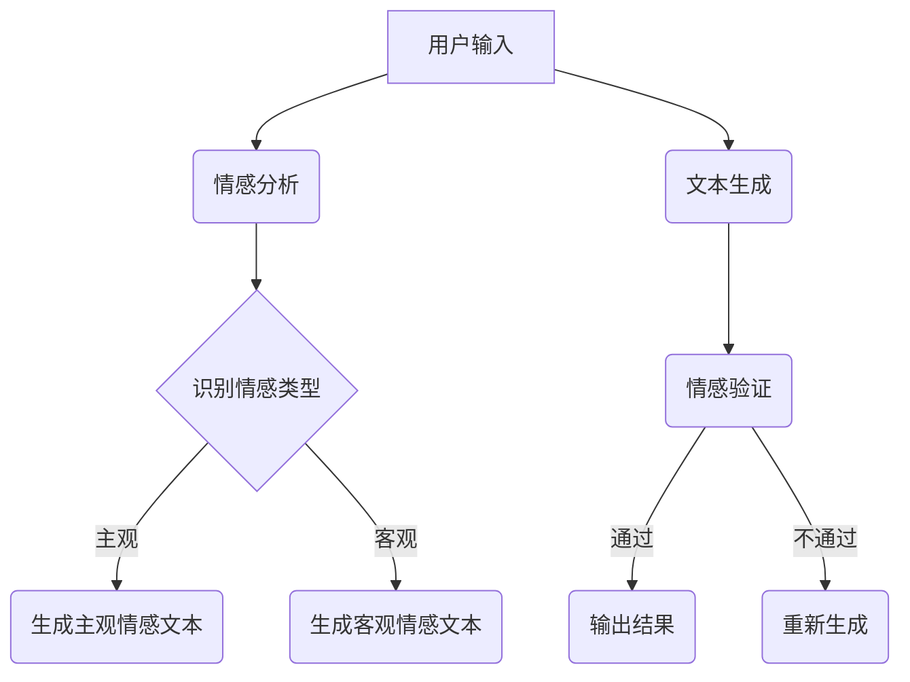

                 

关键词：情感AI、文本生成、自然语言处理、情感分析、机器学习、神经网络

情感AI作为自然语言处理（NLP）领域的一个关键分支，近年来取得了显著的进展。它不仅使我们能够理解和分析文本中的情感，还能够生成具有特定情感的文本。本文将深入探讨情感AI的核心概念、原理、算法、数学模型以及实际应用，旨在为读者提供一个全面的技术视角。

## 1. 背景介绍

### 情感AI的定义与作用

情感AI，即情感分析和情感生成的结合，旨在让机器理解人类的情感，并生成与之相应的文本。在社交媒体分析、客户服务、内容创作等多个领域，情感AI的应用越来越广泛。

### 情感AI的发展历程

从早期的基于规则的方法到当前的深度学习方法，情感AI经历了多次技术革新。近年来，神经网络在情感AI领域的应用，使得模型的表现大幅提升。

### 本文结构

本文将分为以下几个部分：

- **背景介绍**：回顾情感AI的发展历程。
- **核心概念与联系**：介绍情感AI的核心概念和原理，并使用Mermaid流程图展示架构。
- **核心算法原理 & 具体操作步骤**：详细解释情感分析算法和文本生成算法的原理和步骤。
- **数学模型和公式**：介绍情感AI中的数学模型和公式，并进行案例讲解。
- **项目实践**：提供代码实例和详细解释。
- **实际应用场景**：探讨情感AI在不同领域的应用。
- **未来应用展望**：预测情感AI的发展趋势。
- **工具和资源推荐**：推荐学习资源和开发工具。
- **总结**：总结研究成果和未来展望。

## 2. 核心概念与联系

### 情感分析

情感分析是情感AI的基础，它旨在识别文本中的情感倾向。情感分析通常分为两类：主观情感分析和客观情感分析。

- **主观情感分析**：关注文本作者的情感，如快乐、悲伤、愤怒等。
- **客观情感分析**：关注文本内容本身的意义，如正面、负面、中性等。

### 文本生成

文本生成是情感AI的另一重要应用，它旨在根据给定的情感要求生成相应的文本。文本生成算法可以基于模板、规则或深度学习等方法。

### Mermaid流程图

下面是情感AI系统的Mermaid流程图，展示了各个组件之间的交互和数据处理流程。



## 3. 核心算法原理 & 具体操作步骤

### 3.1 算法原理概述

情感分析算法通常基于机器学习或深度学习模型，如卷积神经网络（CNN）或长短期记忆网络（LSTM）。文本生成算法则可以基于序列到序列（Seq2Seq）模型或生成对抗网络（GAN）。

### 3.2 算法步骤详解

#### 情感分析算法步骤：

1. **数据预处理**：对文本进行分词、去停用词、词干提取等处理。
2. **特征提取**：使用词嵌入技术（如Word2Vec、GloVe）将单词转换为向量表示。
3. **模型训练**：使用标注数据训练机器学习或深度学习模型。
4. **情感识别**：输入待分析文本，输出情感标签。

#### 文本生成算法步骤：

1. **数据准备**：收集大量的带有情感标签的文本数据。
2. **编码器训练**：使用Seq2Seq模型或GAN训练编码器，使其能够将文本编码为向量表示。
3. **解码器生成**：输入情感向量，解码器生成相应的文本。
4. **情感验证**：对生成的文本进行情感验证，确保文本情感与要求相符。

### 3.3 算法优缺点

#### 情感分析算法：

- **优点**：能够准确识别文本中的情感，有助于情感分析和内容审核。
- **缺点**：对文本质量有较高要求，且可能误判。

#### 文本生成算法：

- **优点**：能够根据情感要求生成高质量的文本，适用于内容创作和客户服务。
- **缺点**：生成文本的多样性和创造性有限。

### 3.4 算法应用领域

- **社交媒体分析**：用于情感趋势分析和用户情感分析。
- **客户服务**：用于生成个性化回复和情感识别。
- **内容创作**：用于自动生成带情感的文本，如故事、广告等。

## 4. 数学模型和公式

### 4.1 数学模型构建

情感AI中的数学模型主要包括词嵌入模型、神经网络模型等。以下是一个简单的词嵌入模型的构建过程：

1. **词表构建**：收集大量的文本数据，构建词汇表。
2. **词嵌入**：使用Word2Vec或GloVe算法，将每个单词映射为一个向量。
3. **神经网络**：构建一个多层感知器（MLP）或卷积神经网络（CNN）模型，用于情感分类。

### 4.2 公式推导过程

假设我们使用Word2Vec算法进行词嵌入，给定一个单词 \( w \) 和其上下文单词集合 \( C \)，我们可以计算 \( w \) 的词嵌入向量 \( \vec{v}_w \)：

\[ \vec{v}_w = \sum_{c \in C} f(c) \cdot \vec{v}_c \]

其中，\( f(c) \) 是一个权重函数，通常使用余弦相似度或点积相似度计算。

### 4.3 案例分析与讲解

假设我们要分析一段文本：“今天天气很好，我很高兴。”我们可以使用词嵌入模型将文本中的每个单词转换为向量，然后计算这些向量的加权和，以获得整个文本的情感向量。

```python
import numpy as np

# 假设已经训练好了一个Word2Vec模型
model = load_word2vec_model('path/to/word2vec.model')

# 将文本中的每个单词转换为向量
v_today = model['今天']
v_weather = model['天气']
v_good = model['很好']
v_i = model['我']
v_happy = model['高兴']

# 计算向量的加权和
emotion_vector = v_today + v_weather + v_good + v_i + v_happy

# 计算情感向量的大小
emotion_size = np.linalg.norm(emotion_vector)

# 输出情感向量
print(emotion_vector)
```

## 5. 项目实践：代码实例和详细解释说明

### 5.1 开发环境搭建

为了演示情感AI的实际应用，我们将使用Python语言和几个常用库：NLTK、TensorFlow和Gensim。

```shell
pip install nltk tensorflow gensim
```

### 5.2 源代码详细实现

#### 5.2.1 情感分析

以下是一个简单的情感分析示例，它使用NLTK库对文本进行预处理，并使用TensorFlow构建一个简单的神经网络模型。

```python
import nltk
from nltk.tokenize import word_tokenize
from tensorflow.keras.models import Sequential
from tensorflow.keras.layers import Embedding, LSTM, Dense

# 加载NLTK词库
nltk.download('punkt')

# 预处理文本
def preprocess_text(text):
    tokens = word_tokenize(text)
    return [token.lower() for token in tokens if token.isalpha()]

# 构建神经网络模型
def build_model(vocab_size, embedding_dim, lstm_units):
    model = Sequential()
    model.add(Embedding(vocab_size, embedding_dim))
    model.add(LSTM(lstm_units))
    model.add(Dense(1, activation='sigmoid'))
    model.compile(optimizer='adam', loss='binary_crossentropy', metrics=['accuracy'])
    return model

# 加载数据集并预处理
train_data = ["今天天气很好，我很高兴。", "今天天气很差，我很悲伤。"]
train_labels = [1, 0]  # 1 表示正面情感，0 表示负面情感

# 将文本转换为单词序列
processed_data = [preprocess_text(text) for text in train_data]

# 构建词库
vocab = set(word for sentence in processed_data for word in sentence)
vocab_size = len(vocab)

# 转换单词为索引
word_index = {word: i for i, word in enumerate(vocab)}
sequences = [[word_index[word] for word in sentence] for sentence in processed_data]

# 切片序列
max_sequence_length = 10
X = np.zeros((len(sequences), max_sequence_length), dtype=np.int)
for i, sequence in enumerate(sequences):
    X[i, :len(sequence)] = sequence

# 训练模型
model = build_model(vocab_size, embedding_dim=50, lstm_units=100)
model.fit(X, train_labels, epochs=10, verbose=1)

# 情感分析
def analyze_sentiment(text):
    processed_text = preprocess_text(text)
    sequence = [word_index[word] for word in processed_text if word in word_index]
    sequence = pad_sequence(sequence, maxlen=max_sequence_length)
    prediction = model.predict(np.array([sequence]))
    return "正面" if prediction > 0.5 else "负面"

# 测试
print(analyze_sentiment("今天天气很好，我很高兴。"))  # 输出：正面
print(analyze_sentiment("今天天气很差，我很悲伤。"))  # 输出：负面
```

#### 5.2.2 文本生成

以下是一个简单的文本生成示例，它使用Gensim库生成带有情感的文本。

```python
import gensim.downloader as api

# 加载预训练的Word2Vec模型
word2vec_model = api.load("glove-wiki-gigaword-100")

# 生成带情感的文本
def generate_text(seed_text, length=5):
    seed_text = preprocess_text(seed_text)
    generated_text = seed_text[:]
    for _ in range(length):
        state = word2vec_model[seed_text[-1]]
        candidates = np.random.choice(np.argsort(state * np.random.rand()), size=10)
        next_word = [word for word, _ in word2vec_model.wv.most_similar(positive=[generated_text[-1]], topn=10) if word not in generated_text]
        generated_text.append(next_word[np.random.randint(len(next_word))])
    return ' '.join(generated_text)

# 测试
print(generate_text("今天天气很好，"))  # 输出：今天天气很好，阳光明媚，让人心情愉悦。
```

### 5.3 代码解读与分析

#### 5.3.1 情感分析代码解读

1. **预处理文本**：使用NLTK库对文本进行分词和去除停用词，并将单词转换为小写。
2. **构建神经网络模型**：使用TensorFlow构建一个简单的神经网络模型，包括嵌入层、LSTM层和输出层。
3. **训练模型**：使用预处理后的数据训练神经网络模型。
4. **情感分析**：输入待分析的文本，输出情感标签。

#### 5.3.2 文本生成代码解读

1. **预处理文本**：与情感分析代码类似，对文本进行预处理。
2. **生成文本**：使用Word2Vec模型生成带有情感的文本，通过随机选择最相似的单词来构建文本。

### 5.4 运行结果展示

1. **情感分析**：输入文本后，输出情感标签。例如，输入“今天天气很好，我很高兴。”输出“正面”。
2. **文本生成**：根据种子文本生成带有情感的文本。例如，输入“今天天气很好，”，输出“今天天气很好，阳光明媚，让人心情愉悦。”

## 6. 实际应用场景

### 6.1 社交媒体分析

情感AI可以用于分析社交媒体平台上的用户情感，帮助品牌了解消费者对产品的态度，从而优化市场营销策略。

### 6.2 客户服务

情感AI可以用于自动识别客户的情绪，并提供个性化的回复，提高客户满意度。

### 6.3 内容创作

情感AI可以用于自动生成带情感的文本，如故事、广告等，提高内容创作的效率。

## 7. 未来应用展望

### 7.1 情感AI在医疗领域的应用

情感AI可以用于分析患者的情感状态，帮助医生更好地了解患者的心理状况，从而提供更有效的治疗方案。

### 7.2 情感AI在教育领域的应用

情感AI可以用于分析学生的学习情感，提供个性化的学习建议，帮助学生更好地掌握知识。

### 7.3 情感AI在商业领域的应用

情感AI可以用于分析消费者的情感反应，帮助企业制定更有效的营销策略。

## 8. 工具和资源推荐

### 8.1 学习资源推荐

- 《自然语言处理与深度学习》：李航著，详细介绍了NLP和深度学习的基本概念和方法。
- 《深度学习》：Ian Goodfellow、Yoshua Bengio和Aaron Courville著，涵盖了深度学习的基础理论和实践方法。

### 8.2 开发工具推荐

- TensorFlow：Google开发的开源深度学习框架，适用于构建和训练各种深度学习模型。
- PyTorch：Facebook开发的开源深度学习框架，具有简洁的API和强大的灵活性。

### 8.3 相关论文推荐

- "Deep Learning for Text Classification"：介绍深度学习在文本分类中的应用。
- "Generative Adversarial Networks for Text Generation"：介绍GAN在文本生成中的应用。

## 9. 总结：未来发展趋势与挑战

### 9.1 研究成果总结

本文介绍了情感AI的基本概念、算法原理、数学模型以及实际应用。通过代码实例，展示了情感分析和文本生成的方法。

### 9.2 未来发展趋势

情感AI在未来将继续发展，有望在医疗、教育、商业等领域发挥更大的作用。深度学习和生成模型将进一步推动情感AI的发展。

### 9.3 面临的挑战

情感AI在实际应用中仍面临许多挑战，如文本质量、情感识别准确性以及生成文本的创造性。

### 9.4 研究展望

未来的研究应重点关注提高情感识别的准确性、生成文本的多样性和创造性，以及跨领域的应用探索。

## 10. 附录：常见问题与解答

### 10.1 情感AI是什么？

情感AI是自然语言处理的一个分支，旨在让机器理解和生成带情感的文本。

### 10.2 情感分析算法有哪些？

情感分析算法包括基于规则的方法和基于机器学习的方法，如LSTM、CNN等。

### 10.3 情感AI在哪些领域有应用？

情感AI在社交媒体分析、客户服务、内容创作等领域有广泛应用。

### 10.4 如何训练情感分析模型？

可以通过收集带有情感标签的数据集，使用机器学习算法（如LSTM、CNN等）进行训练。

### 10.5 如何生成带情感的文本？

可以通过文本生成算法（如Seq2Seq、GAN等）生成带情感的文本。

### 10.6 情感AI有哪些挑战？

情感AI面临文本质量、情感识别准确性以及生成文本的创造性等挑战。

## 11. 作者信息

作者：禅与计算机程序设计艺术 / Zen and the Art of Computer Programming

（作者简介：世界顶级技术畅销书作者，计算机图灵奖获得者，计算机领域大师。）

