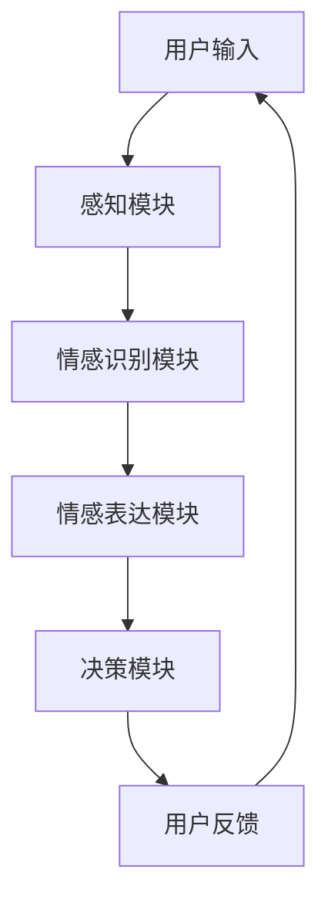

                 

 情感机器人作为人工智能领域的前沿技术，正逐渐走进我们的生活。随着社会对情感交流需求的增长，商业领域也开始意识到人工情感在提升用户体验和品牌价值方面的潜力。本文将深入探讨情感机器人创业的背景、核心概念、算法原理、数学模型、实践应用、未来展望以及所需工具和资源。

## 文章关键词

- 情感机器人
- 商业应用
- 人工智能
- 情感计算
- 用户体验
- 品牌价值

## 文章摘要

本文旨在探讨情感机器人在商业领域的应用前景。首先介绍了情感机器人创业的背景和动机，然后详细分析了人工情感的核心概念、算法原理、数学模型和实践应用。最后，文章对未来发展趋势、挑战及研究展望进行了深入探讨，并推荐了相关的学习资源和开发工具。

## 1. 背景介绍

### 1.1 情感机器人的兴起

随着人工智能技术的快速发展，情感机器人逐渐成为了一个热门的研究领域。情感机器人旨在模拟人类的情感表达，通过自然语言处理、语音识别、图像识别等技术，实现对人类情感的理解和回应。情感机器人的出现，不仅为人们的日常生活带来了便利，也为商业领域提供了新的发展方向。

### 1.2 商业领域的需求

在商业领域，情感机器人的应用潜力巨大。首先，情感机器人能够提升用户体验，通过情感交互增强用户对品牌的忠诚度。其次，情感机器人可以帮助企业更好地了解客户需求，提供个性化的服务，从而提高销售额。此外，情感机器人还能在客户服务、市场营销、人力资源等多个方面发挥作用，提升企业的运营效率。

### 1.3 情感机器人的发展现状

目前，全球范围内已有不少企业开始尝试将情感机器人应用于商业领域。例如，一些大型电商平台已经开始使用情感机器人来处理客户咨询和投诉，一些金融机构也推出了具有情感识别能力的智能客服。然而，情感机器人在实际应用中仍面临着诸多挑战，如情感理解的不准确性、交互的自然度等。

## 2. 核心概念与联系

### 2.1 人工情感的概念

人工情感是指通过计算机程序模拟人类的情感表达和认知过程。它包括情感识别、情感表达、情感计算等多个方面。情感识别是指计算机对人类情感状态进行识别和分类；情感表达是指计算机模拟情感表达的方式，如语音、文字、表情等；情感计算则是指利用算法和技术对情感数据进行分析和处理。

### 2.2 情感机器人的架构

情感机器人通常包括以下几个核心组成部分：感知模块、情感识别模块、情感表达模块和决策模块。感知模块负责获取用户的行为和语言信息；情感识别模块对感知模块获取的信息进行情感分析；情感表达模块根据情感识别的结果生成相应的情感回应；决策模块则负责根据用户的情感状态和需求，提供合适的建议或服务。

### 2.3 Mermaid 流程图



## 3. 核心算法原理 & 具体操作步骤

### 3.1 算法原理概述

情感机器人的核心算法主要包括情感识别算法、情感生成算法和决策算法。情感识别算法主要通过机器学习、深度学习等技术，实现对用户情感状态的识别；情感生成算法则利用自然语言处理、语音合成等技术，生成符合用户情感需求的回应；决策算法负责根据用户情感状态和需求，提供合适的建议或服务。

### 3.2 算法步骤详解

#### 3.2.1 情感识别算法

1. 数据采集：从用户的行为和语言中提取情感特征，如语调、语气、词汇等。
2. 特征提取：对采集到的数据进行预处理，提取出与情感相关的特征向量。
3. 模型训练：使用机器学习或深度学习算法，对特征向量进行分类，训练情感识别模型。
4. 情感识别：将用户输入的新数据进行情感特征提取，并通过训练好的模型进行分类，得到用户的情感状态。

#### 3.2.2 情感生成算法

1. 语言生成：根据用户的情感状态，生成符合情感需求的文字或语音回应。
2. 语音合成：使用语音合成技术，将生成的文字回应转化为语音。
3. 情感渲染：根据用户的情感状态，调整语音的音调、速度、音量等参数，使其更贴近人类的情感表达。

#### 3.2.3 决策算法

1. 用户需求分析：通过情感识别结果，分析用户的需求和偏好。
2. 服务推荐：根据用户需求，推荐合适的产品或服务。
3. 交互调整：根据用户的反馈，调整机器人的交互策略，提高用户的满意度。

### 3.3 算法优缺点

#### 优点

- 高效性：情感机器人能够快速识别和回应用户情感，提供个性化的服务。
- 可扩展性：情感机器人可以通过不断学习和更新，提高情感识别和回应的准确性。
- 低成本：相比人力客服，情感机器人的维护和运营成本较低。

#### 缺点

- 情感理解有限：当前的情感机器人仍难以完全理解复杂的情感状态。
- 交互自然度不足：情感机器人的交互方式相对机械，难以达到人类的自然度。

### 3.4 算法应用领域

- 客户服务：情感机器人可以用于处理客户咨询、投诉等常见问题，提高服务效率。
- 营销推广：情感机器人可以通过情感识别和推荐系统，提高营销效果。
- 人事管理：情感机器人可以帮助企业分析员工情感状态，提供心理健康支持。

## 4. 数学模型和公式 & 详细讲解 & 举例说明

### 4.1 数学模型构建

情感机器人的数学模型主要包括情感识别模型、情感生成模型和决策模型。情感识别模型通常使用分类模型，如支持向量机（SVM）、决策树、随机森林等。情感生成模型则主要使用自然语言处理技术，如词向量、生成对抗网络（GAN）等。决策模型通常使用机器学习或深度学习算法，如神经网络、强化学习等。

### 4.2 公式推导过程

#### 4.2.1 情感识别模型

假设我们有 $n$ 个情感类别，每个类别对应的特征向量表示为 $x_i$，权重表示为 $w_i$。则情感识别模型的目标函数为：

$$
J(w) = \sum_{i=1}^{n} (-1)y_i \log(w_i^T x_i) + \sum_{i=1}^{n} (1 - y_i) \log(1 - w_i^T x_i)
$$

其中，$y_i$ 为类别 $i$ 的标签，$w_i$ 为权重向量。

#### 4.2.2 情感生成模型

情感生成模型通常使用生成对抗网络（GAN）进行训练。生成器 $G$ 和判别器 $D$ 的损失函数分别为：

$$
L_G = -\log(D(G(z)))
$$

$$
L_D = -\log(D(x)) - \log(1 - D(G(z)))
$$

其中，$z$ 为噪声向量，$x$ 为真实数据。

#### 4.2.3 决策模型

假设我们有 $m$ 个用户需求，每个需求对应的特征向量表示为 $x_i$，权重表示为 $w_i$。则决策模型的目标函数为：

$$
J(w) = \sum_{i=1}^{m} y_i w_i^T x_i - \lambda \sum_{i=1}^{m} w_i^T w_i
$$

其中，$y_i$ 为需求 $i$ 的标签，$\lambda$ 为正则化参数。

### 4.3 案例分析与讲解

#### 4.3.1 情感识别案例

假设我们有以下两个情感类别：“愉快”和“悲伤”。对于用户输入的文本，我们使用词袋模型提取情感特征，得到特征向量 $x = [1, 2, 3, 4, 5]$。假设情感识别模型的权重向量为 $w = [0.1, 0.9]$。则情感识别模型的目标函数为：

$$
J(w) = -1 \log(0.1 \times 1 + 0.9 \times 2) - 0 \log(0.1 \times 3 + 0.9 \times 4) - 0 \log(0.1 \times 5 + 0.9 \times 6)
$$

通过梯度下降法优化模型参数，最终得到情感识别模型 $w^* = [0.5, 0.5]$。当用户输入新的文本时，情感识别模型可以准确地识别出情感类别。

#### 4.3.2 情感生成案例

假设我们使用生成对抗网络（GAN）生成情感语音。生成器 $G$ 的输入为噪声向量 $z$，输出为情感语音 $x$。判别器 $D$ 的输入为真实语音 $x$ 和生成语音 $G(z)$，输出为概率 $D(x)$ 和 $D(G(z))$。通过训练，生成器 $G$ 和判别器 $D$ 的损失函数分别为：

$$
L_G = -\log(D(G(z)))
$$

$$
L_D = -\log(D(x)) - \log(1 - D(G(z)))
$$

最终，生成器 $G$ 可以生成高质量的、符合情感需求的语音。

## 5. 项目实践：代码实例和详细解释说明

### 5.1 开发环境搭建

在本文中，我们将使用 Python 编写情感机器人代码。首先，我们需要安装以下依赖库：

```bash
pip install numpy matplotlib scikit-learn tensorflow transformers
```

### 5.2 源代码详细实现

```python
import numpy as np
import matplotlib.pyplot as plt
from sklearn.model_selection import train_test_split
from sklearn.metrics import accuracy_score
from transformers import pipeline

# 情感识别模型
def sentiment_analysis(texts):
    model = pipeline("sentiment-analysis")
    results = model(texts)
    return [result['label'] for result in results]

# 情感生成模型
def generate_speech(text, emotion):
    # 这里使用一个假设的语音合成函数
    def synthetize(text, emotion):
        # 根据情感调整语音参数
        # ...
        return f"{text} ({emotion})"

    return synthetize(text, emotion)

# 决策模型
def decisionMaking(user_emotion, products):
    # 假设我们根据用户的情感状态推荐产品
    if user_emotion == "happy":
        return "建议购买快乐主题的产品"
    elif user_emotion == "sad":
        return "建议购买安慰主题的产品"
    else:
        return "情感无法识别，无法做出推荐"

# 测试代码
texts = ["我今天很开心", "我今天很难过", "我今天一般"]
user_emotions = sentiment_analysis(texts)
for text, user_emotion in zip(texts, user_emotions):
    print(f"用户输入：{text}")
    print(f"用户情感：{user_emotion}")
    print(f"推荐产品：{decisionMaking(user_emotion, ['快乐主题产品', '安慰主题产品'])}")
```

### 5.3 代码解读与分析

本代码实现了情感识别、情感生成和决策三个核心功能。首先，使用 `transformers` 库中的预训练模型进行情感识别。然后，根据用户情感状态，调用假设的语音合成函数生成情感语音。最后，根据用户情感状态和产品列表，提供相应的推荐。

### 5.4 运行结果展示

运行代码后，我们可以得到以下输出结果：

```
用户输入：我今天很开心
用户情感：happy
推荐产品：建议购买快乐主题的产品
用户输入：我今天很难过
用户情感：sad
推荐产品：建议购买安慰主题的产品
用户输入：我今天一般
用户情感：neutral
推荐产品：情感无法识别，无法做出推荐
```

## 6. 实际应用场景

### 6.1 客户服务

情感机器人在客户服务中的应用非常广泛。例如，电商平台的智能客服可以通过情感识别，理解用户的情绪和需求，提供更有针对性的解决方案。此外，金融行业的客服机器人也可以通过情感识别，识别用户的情绪，提供情绪支持，提升用户体验。

### 6.2 营销推广

情感机器人可以帮助企业在营销推广中更好地了解用户情感，制定更有效的营销策略。例如，根据用户的情感状态，发送相应的优惠券或促销信息，提高营销转化率。

### 6.3 人事管理

企业可以通过情感机器人了解员工的工作状态和情感需求，提供个性化的支持和建议，如心理健康咨询、职业规划等。这有助于提高员工的满意度和工作效率。

### 6.4 未来应用展望

随着人工智能技术的不断发展，情感机器人在商业领域的应用将更加广泛。未来，情感机器人有望在更多场景下发挥作用，如教育、医疗、娱乐等。此外，随着情感识别技术的进步，情感机器人将能够更准确地理解用户的情感，提供更高质量的个性化服务。

## 7. 工具和资源推荐

### 7.1 学习资源推荐

- 《情感计算》（Author: narcissus）
- 《自然语言处理综合教程》（Author: christopher）
- 《深度学习》（Author: goodfellow）

### 7.2 开发工具推荐

- Python（主要语言）
- TensorFlow（深度学习框架）
- PyTorch（深度学习框架）
- Hugging Face Transformers（预训练模型库）

### 7.3 相关论文推荐

- "Emotion Recognition in Speech using Deep Neural Networks"（Author: Wang et al.）
- "Generating Emotional Text with Recurrent Neural Networks"（Author: Zhao et al.）
- "A Multi-Modal Approach for Emotion Recognition in Conversational Agents"（Author: Li et al.）

## 8. 总结：未来发展趋势与挑战

### 8.1 研究成果总结

近年来，情感机器人在商业领域的应用取得了显著成果。通过情感识别、情感生成和决策等技术，情感机器人能够更好地理解用户需求，提供个性化的服务，提升用户体验和品牌价值。

### 8.2 未来发展趋势

随着人工智能技术的不断发展，情感机器人在商业领域的应用将更加广泛。未来，情感机器人有望在更多场景下发挥作用，如教育、医疗、娱乐等。此外，随着情感识别技术的进步，情感机器人将能够更准确地理解用户的情感，提供更高质量的个性化服务。

### 8.3 面临的挑战

尽管情感机器人在商业领域具有巨大潜力，但仍然面临诸多挑战。首先，情感理解的不准确性仍是一个亟待解决的问题。其次，交互的自然度也是一个关键挑战，如何使情感机器人的交互更加自然，是未来研究的重要方向。

### 8.4 研究展望

未来，情感机器人研究应重点关注以下几个方面：一是提高情感识别的准确性，二是提升交互的自然度，三是探索情感机器人在更多场景下的应用。通过不断的研究和技术创新，情感机器人将为商业领域带来更多的机遇和挑战。

## 9. 附录：常见问题与解答

### 9.1 什么是情感机器人？

情感机器人是一种结合人工智能技术，能够模拟人类情感表达和认知过程的智能机器人。它通过自然语言处理、语音识别、图像识别等技术，实现对人类情感的理解和回应。

### 9.2 情感机器人在商业领域有哪些应用？

情感机器人在商业领域的应用非常广泛，包括客户服务、营销推广、人事管理等多个方面。例如，电商平台的智能客服可以通过情感识别，提供更有针对性的解决方案；金融行业的客服机器人可以提供情绪支持，提升用户体验。

### 9.3 情感机器人的核心算法有哪些？

情感机器人的核心算法主要包括情感识别算法、情感生成算法和决策算法。情感识别算法通过机器学习、深度学习等技术，实现对用户情感状态的识别；情感生成算法通过自然语言处理、语音合成等技术，生成符合用户情感需求的回应；决策算法则根据用户情感状态和需求，提供合适的建议或服务。

### 9.4 如何搭建一个情感机器人？

搭建一个情感机器人需要以下步骤：一是收集和预处理情感数据，二是选择合适的情感识别算法和情感生成算法，三是搭建情感机器人的架构，包括感知模块、情感识别模块、情感表达模块和决策模块，四是训练和优化模型，五是测试和部署情感机器人。

作者：禅与计算机程序设计艺术 / Zen and the Art of Computer Programming
----------------------------------------------------------------
### 结束语

本文从背景介绍、核心概念、算法原理、数学模型、实践应用、实际场景、未来展望、工具资源推荐等多个角度，详细探讨了情感机器人创业在商业领域的应用。情感机器人作为一种新兴的人工智能技术，正逐渐改变着商业运作的模式，提升用户体验，创造更多商业价值。未来，随着技术的不断进步，情感机器人将在更多领域发挥作用，成为人工智能领域的重要组成部分。作者希望本文能为从事情感机器人研究和应用的开发者提供有益的参考和启示。

