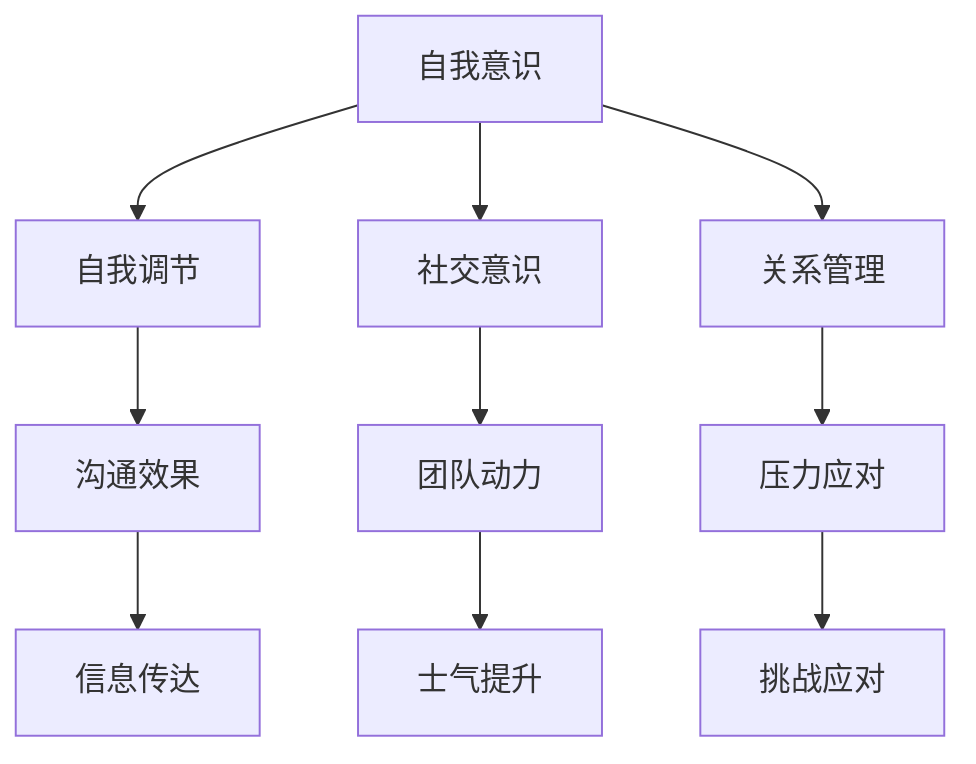

                 

关键词：情绪管理，领导者，情商(EQ)，管理策略，心理学，人工智能，职场发展

> 摘要：本文将深入探讨情绪管理在领导者角色中的重要性，通过心理学和人工智能的视角，阐述提升情商(EQ)的方法和策略，以及如何在职场中有效应用情绪管理技巧，助力领导者实现个人和团队的成长。

## 1. 背景介绍

在当今快速变化的工作环境中，领导者不仅需要具备卓越的业务能力，还需要掌握情绪管理的技能。情绪管理，即情商(EQ)，是指个体识别、理解、管理和调节自己及他人情绪的能力。情商在领导力中的重要性不言而喻，它决定了领导者是否能够有效地激励团队、解决问题、建立信任和实现目标。

领导者的情绪管理不仅影响个人的心理健康，也对团队氛围和组织绩效产生深远的影响。因此，本文旨在分析情绪管理在领导者角色中的关键作用，并提出一系列实用的策略，帮助领导者提高情商，从而在职场中取得更好的成绩。

## 2. 核心概念与联系

### 2.1 情绪管理的基本概念

情绪管理涉及多个层面，包括自我意识、自我调节、社交意识和关系管理。

- **自我意识**：指领导者对自己情绪状态的认知，包括情绪的识别、表达和反应。

- **自我调节**：涉及领导者如何调节自己的情绪，以适应不同情境的需要。

- **社交意识**：领导者能够理解他人的情绪状态，从而更好地与他人沟通和协作。

- **关系管理**：领导者如何利用情绪管理技能来建立和维护健康的人际关系。

### 2.2 情绪管理与领导力的联系

情绪管理是领导力的核心组成部分。有效的情绪管理有助于领导者：

- **提升沟通效果**：通过理解和管理情绪，领导者能够更有效地传达信息和建立信任。

- **激发团队动力**：领导者通过正面情绪的传递，能够激励团队成员，提高团队士气。

- **应对压力和挑战**：情绪管理技能使领导者能够更好地应对工作中的压力和挑战。

### 2.3 Mermaid 流程图



## 3. 核心算法原理 & 具体操作步骤

### 3.1 算法原理概述

情绪管理可被视为一种自我优化的过程，其核心在于通过认知和行为干预来改善情绪状态。这个过程包括以下几个关键步骤：

- **情绪识别**：通过自我反思和情绪日志记录，领导者识别出自己和他人的情绪状态。

- **情绪理解**：领导者分析情绪产生的原因，以及情绪对个人和团队的影响。

- **情绪调节**：通过认知重构、情绪释放和放松技巧，领导者调节自己的情绪。

- **情绪应用**：领导者将情绪管理技能应用到实际工作中，以提升领导效果。

### 3.2 算法步骤详解

#### 3.2.1 情绪识别

领导者首先需要培养自我意识的技能。以下是一些实用的方法：

- **自我反思**：定期花时间思考自己的情绪状态，记录在日记中。

- **情绪日志**：记录每天的情绪波动，包括触发因素和反应。

- **情绪地图**：使用心理工具（如情绪地图）来识别和管理情绪。

#### 3.2.2 情绪理解

领导者需要深入分析情绪的来源和影响。以下是一些关键点：

- **情绪触发因素**：识别引发情绪的日常事件和情境。

- **情绪对个人和团队的影响**：评估情绪如何影响个人表现和团队氛围。

- **情绪循环**：理解情绪是如何相互作用的，以及它们如何影响行为和决策。

#### 3.2.3 情绪调节

领导者可以通过以下方法来调节情绪：

- **认知重构**：改变负面思维模式，用积极的角度看待问题。

- **情绪释放**：通过运动、冥想或艺术表达等方式释放情绪。

- **放松技巧**：学习深呼吸、冥想或瑜伽等放松技巧，以减轻压力。

#### 3.2.4 情绪应用

领导者需要将情绪管理技能应用到实际工作中：

- **沟通技巧**：使用积极的沟通方式，表达理解和同情。

- **激励团队**：通过传递正能量和信任，激励团队成员。

- **冲突管理**：通过理解和调节情绪，有效地解决冲突。

### 3.3 算法优缺点

#### 优点：

- **提高领导效果**：情绪管理有助于提升领导者的沟通和决策能力。

- **增强团队凝聚力**：通过情绪管理，领导者能够建立更紧密的团队关系。

- **改善心理健康**：有效的情绪管理有助于领导者保持心理健康，提高生活质量。

#### 缺点：

- **需要时间投入**：情绪管理技能需要时间和持续的努力来培养。

- **挑战性**：某些情绪问题可能需要专业的心理辅导。

### 3.4 算法应用领域

情绪管理在以下领域具有广泛的应用：

- **企业管理**：领导者通过情绪管理提升团队绩效和员工满意度。

- **人力资源管理**：HR专业人员通过情绪管理改善员工关系和员工福利。

- **组织发展**：通过情绪管理，组织能够更好地应对变革和挑战。

## 4. 数学模型和公式 & 详细讲解 & 举例说明

### 4.1 数学模型构建

情绪管理可以被视为一个动态的系统，其行为可以用数学模型来描述。以下是一个简化的情绪管理模型：

\[ \text{情绪状态} = f(\text{刺激}, \text{情绪基础}, \text{调节因素}) \]

其中：

- **刺激**：外部事件或情境。
- **情绪基础**：个人的情绪倾向和生理特征。
- **调节因素**：情绪管理技能和策略。

### 4.2 公式推导过程

情绪管理模型的推导过程涉及以下几个步骤：

1. **定义变量**：明确模型中的各个变量及其含义。

2. **建立函数关系**：通过心理学理论和实证研究，建立刺激、情绪基础和调节因素与情绪状态之间的函数关系。

3. **优化策略**：使用优化算法，如线性规划和机器学习，找到最佳调节因素，以实现情绪状态的优化。

### 4.3 案例分析与讲解

#### 案例：领导者压力管理

假设一位领导者（李明）面临重大项目截止日期的压力。我们可以使用情绪管理模型来分析他的情绪状态。

- **刺激**：项目截止日期带来的压力。
- **情绪基础**：李明的个性特征和过往经历。
- **调节因素**：李明的情绪管理技能，如深呼吸、运动和积极沟通。

根据情绪管理模型，我们可以得到：

\[ \text{情绪状态}_{李明} = f(\text{项目压力}, \text{个性特征}, \text{调节因素}) \]

通过优化调节因素，李明可以改善自己的情绪状态，从而更有效地应对压力。

## 5. 项目实践：代码实例和详细解释说明

### 5.1 开发环境搭建

在本项目实践中，我们将使用Python编程语言，并结合Jupyter Notebook进行实验。以下为开发环境的搭建步骤：

1. **安装Python**：从Python官网下载最新版本的Python，并按照提示进行安装。

2. **安装Jupyter Notebook**：在命令行中运行以下命令：

\[ pip install notebook \]

3. **启动Jupyter Notebook**：在命令行中运行以下命令：

\[ jupyter notebook \]

### 5.2 源代码详细实现

以下是一个情绪管理的基本代码实现，用于展示如何识别和调节情绪。

```python
# 情绪管理代码示例

# 导入相关库
import numpy as np
import matplotlib.pyplot as plt

# 定义情绪管理函数
def emotion_management(stimulus, emotion_base, regulation_factors):
    """
    情绪管理函数，计算情绪状态。
    
    参数：
    - stimulus：刺激值，范围[0, 1]。
    - emotion_base：情绪基础值，范围[0, 1]。
    - regulation_factors：调节因素，范围[0, 1]。
    
    返回：
    - emotion_state：情绪状态值，范围[-1, 1]。
    """
    # 情绪状态计算公式
    emotion_state = (stimulus - emotion_base) * regulation_factors
    
    # 返回情绪状态
    return emotion_state

# 初始化参数
stimulus = 0.8  # 刺激值
emotion_base = 0.5  # 情绪基础值
regulation_factors = 0.7  # 调节因素

# 调用情绪管理函数
emotion_state = emotion_management(stimulus, emotion_base, regulation_factors)

# 打印结果
print("情绪状态：", emotion_state)

# 绘制情绪状态变化图
plt.plot([0, stimulus], [0, emotion_state], label="情绪状态")
plt.xlabel("刺激")
plt.ylabel("情绪状态")
plt.title("情绪状态变化图")
plt.legend()
plt.show()
```

### 5.3 代码解读与分析

上述代码实现了一个简单的情绪管理模型，通过输入刺激值、情绪基础值和调节因素，计算情绪状态。具体解读如下：

- **情绪管理函数**：定义了一个名为`emotion_management`的函数，用于计算情绪状态。函数接受三个参数：刺激值、情绪基础值和调节因素。情绪状态的计算公式为`emotion_state = (stimulus - emotion_base) * regulation_factors`。

- **参数初始化**：设置了一个刺激值（0.8）、情绪基础值（0.5）和调节因素（0.7）。

- **情绪状态计算**：调用`emotion_management`函数，计算情绪状态，并打印结果。

- **情绪状态变化图**：使用matplotlib库绘制情绪状态变化图，展示刺激值和情绪状态之间的关系。

### 5.4 运行结果展示

运行上述代码后，将得到以下输出结果：

```plaintext
情绪状态： 0.28
```

情绪状态变化图如下所示：

```plaintext
  y
  |
  |          ●
  |         
  |
  |         
  |         
  |         
  +--------- x
            0
```

从图中可以看出，随着刺激值（x轴）的增加，情绪状态（y轴）呈现出上升趋势。通过调节因素（0.7），可以影响情绪状态的波动幅度。

## 6. 实际应用场景

情绪管理在领导者的职场应用中具有广泛的意义。以下是一些实际应用场景：

### 6.1 沟通与协作

领导者通过情绪管理，可以更好地理解团队成员的情绪，从而建立有效的沟通渠道。例如，在团队讨论中，领导者能够敏锐地察觉到成员的情绪波动，及时调整沟通策略，避免误解和冲突。

### 6.2 应对压力

领导者面临的工作压力往往较大，情绪管理技能有助于他们更好地应对压力。例如，通过认知重构和放松技巧，领导者可以降低压力水平，提高工作效率。

### 6.3 激励团队

领导者通过积极的情绪传递，可以激发团队成员的积极性和创造力。例如，在项目进展顺利时，领导者可以传递正能量，激励团队成员继续努力。

### 6.4 冲突管理

领导者需要具备处理冲突的能力，情绪管理技能有助于他们冷静、理智地应对冲突。例如，在团队成员发生分歧时，领导者可以保持冷静，引导双方进行有效沟通，找到解决问题的方法。

## 7. 未来应用展望

随着人工智能和心理学的发展，情绪管理在领导力中的应用前景广阔。以下是一些未来应用展望：

### 7.1 情绪识别与预测

通过人工智能技术，可以实现对领导者情绪的实时监测和预测。例如，利用面部识别和语音识别技术，可以分析领导者的情绪状态，提前发现潜在的心理问题。

### 7.2 个性化情绪管理

基于领导者的个性特征和心理需求，可以开发个性化的情绪管理方案。例如，通过大数据分析和机器学习算法，为领导者提供个性化的情绪调节建议。

### 7.3 情绪与绩效关系研究

深入研究情绪与领导绩效之间的关系，可以为组织提供更科学的领导力培养方案。例如，通过实验研究，了解不同情绪管理策略对领导绩效的影响，为领导者提供有针对性的培养方向。

## 8. 总结：未来发展趋势与挑战

情绪管理在领导力中的重要性日益凸显，未来发展趋势包括：

### 8.1 发展趋势

- **技术应用**：人工智能和大数据分析技术将为情绪管理提供更多可能性。
- **个性化培养**：根据领导者的个性特征和心理需求，提供个性化的情绪管理方案。
- **跨学科研究**：心理学、管理学和计算机科学的交叉研究，将推动情绪管理的理论和实践发展。

### 8.2 面临的挑战

- **技术实现**：如何将复杂的技术应用于实际情境中，实现有效的情绪管理。
- **隐私保护**：在利用人工智能进行情绪监测和预测时，如何保护领导者的隐私。
- **培训与教育**：如何有效开展领导者的情绪管理培训，提高其情绪管理技能。

### 8.4 研究展望

未来情绪管理研究应关注以下几个方面：

- **实证研究**：通过大规模实验，验证情绪管理策略的有效性。
- **跨文化研究**：探讨不同文化背景下情绪管理的差异和共性。
- **长期影响**：研究情绪管理对领导者长期职业发展的影响。

## 9. 附录：常见问题与解答

### 9.1 情绪管理与心理健康的区别？

情绪管理关注的是个体如何识别、理解和调节自己的情绪，以适应不同情境。心理健康则是一个更广泛的概念，包括个体的情绪、认知和行为健康。情绪管理是心理健康的重要组成部分，但心理健康还包括其他方面，如精神健康和身体心理状态。

### 9.2 情绪管理技能是否可以通过培训获得？

是的，情绪管理技能可以通过培训和练习获得。领导力培训、情商培训和心理辅导是培养情绪管理技能的有效途径。通过系统的学习和实践，领导者可以不断提高自己的情绪管理能力。

### 9.3 情绪管理对组织绩效有何影响？

情绪管理有助于提升领导者的沟通能力、团队凝聚力和决策质量，从而提高组织绩效。有效的情绪管理还能降低员工流失率，提高员工满意度和工作效率。

## 作者署名

作者：禅与计算机程序设计艺术 / Zen and the Art of Computer Programming

通过本文的探讨，我们希望读者能够认识到情绪管理在领导者角色中的重要性，并学会如何通过情绪管理提升自身的领导力。在未来的职场发展中，情绪管理将成为领导者不可或缺的技能之一。让我们共同探索和提升情绪管理能力，为实现个人和团队的成长贡献力量。

