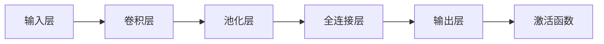

                 

关键词：感知器、神经网络、卷积神经网络、机器学习、深度学习

摘要：本文从感知器出发，探讨了神经网络的发展历程，特别是卷积神经网络（CNN）的诞生与演化。通过详细剖析CNN的核心算法原理、数学模型以及具体实现步骤，我们不仅理解了CNN在图像识别领域的卓越表现，还展望了其未来应用前景。文章结构紧凑、逻辑清晰，适合对机器学习和深度学习有兴趣的读者。

## 1. 背景介绍

机器学习，作为人工智能的重要组成部分，近年来取得了飞速发展。从最初的简单算法，如感知器，到复杂的深度学习模型，如卷积神经网络（CNN），每一次进步都推动了计算机视觉、自然语言处理等领域的革新。感知器，作为一种基础的神经网络模型，是神经网络发展的起点。感知器的简单性使其成为理解神经网络工作原理的绝佳范例。

感知器由两部分组成：输入层和输出层。输入层接收多个输入信号，每个信号都与一个权重相乘，然后求和得到净输入。净输入通过一个激活函数（如阶跃函数）转换为输出。感知器的核心思想是通过学习权重调整，使输出能够对特定输入产生正确的响应。感知器的简单性使其易于实现，但同时也限制了其处理复杂问题的能力。

随着计算能力的提升和算法的改进，研究者们开始探索更复杂的神经网络结构。卷积神经网络（CNN）便是其中之一。与感知器不同，CNN引入了卷积操作、池化操作和深度结构，使其能够处理具有高度结构化的数据，如图像。CNN在图像识别、目标检测、图像生成等领域的应用取得了显著的成果。

本文将详细介绍CNN的发展历程、核心算法原理、数学模型和具体实现步骤，帮助读者深入理解CNN的工作机制，并探讨其未来应用前景。

## 2. 核心概念与联系

为了更好地理解CNN，我们首先需要了解其核心概念和组成部分。CNN主要由以下几个部分组成：卷积层、池化层、全连接层和激活函数。以下是这些概念的联系及其在CNN中的作用。

### 2.1 卷积层

卷积层是CNN的核心组成部分。它通过卷积操作提取图像的特征。卷积操作涉及两个输入：一个输入图像和一个卷积核。卷积核是一个小的矩阵，用于在输入图像上滑动，与图像中的每个局部区域进行点积运算，得到一个特征图。多个卷积核可以同时作用于输入图像，产生多个特征图。这些特征图组合起来，形成了更丰富的特征表示。

### 2.2 池化层

池化层在卷积层之后，用于减少特征图的维度，同时保持最重要的特征。常见的池化操作包括最大池化和平均池化。最大池化选择特征图上每个局部区域中的最大值，而平均池化则是取平均值。池化层可以减少计算量，提高模型的泛化能力。

### 2.3 全连接层

全连接层位于CNN的末端，将卷积层和池化层提取的特征映射到具体的类别。全连接层由多个神经元组成，每个神经元都与上一个层的所有神经元相连。通过学习权重，全连接层能够对输入特征进行分类。

### 2.4 激活函数

激活函数为神经网络引入非线性特性，使其能够处理复杂的非线性问题。常见的激活函数包括Sigmoid函数、ReLU函数和Tanh函数。激活函数的选择会影响模型的训练速度和性能。

以下是CNN核心概念的Mermaid流程图，展示了各部分之间的联系：



## 3. 核心算法原理 & 具体操作步骤

### 3.1 算法原理概述

卷积神经网络（CNN）的核心算法基于卷积操作、池化操作和深度结构。以下是CNN的主要算法原理和步骤。

### 3.2 算法步骤详解

#### 3.2.1 输入层

输入层接收原始图像数据。图像通常表示为一个二维矩阵，其中每个元素表示像素的强度值。

#### 3.2.2 卷积层

卷积层通过卷积操作提取图像的特征。具体步骤如下：

1. 初始化卷积核权重。
2. 在输入图像上滑动卷积核，计算每个局部区域的卷积值。
3. 将卷积值求和，得到一个特征图。

#### 3.2.3 池化层

池化层在卷积层之后，用于减少特征图的维度。具体步骤如下：

1. 选择池化操作（如最大池化或平均池化）。
2. 在特征图上滑动窗口，计算窗口内的最大值或平均值。
3. 将结果写入新的特征图。

#### 3.2.4 全连接层

全连接层位于CNN的末端，将卷积层和池化层提取的特征映射到具体的类别。具体步骤如下：

1. 初始化全连接层权重。
2. 将特征图展平为一维向量。
3. 通过全连接层计算输出。

#### 3.2.5 激活函数

激活函数为神经网络引入非线性特性。具体步骤如下：

1. 选择激活函数（如ReLU函数）。
2. 对全连接层的输出应用激活函数。

### 3.3 算法优缺点

#### 优点：

1. CNN能够自动提取图像特征，减少了人工特征工程的需求。
2. CNN在图像识别、目标检测等领域表现出色。
3. CNN具有良好的泛化能力。

#### 缺点：

1. CNN训练过程需要大量计算资源。
2. CNN对于复杂、非线性问题的处理能力有限。

### 3.4 算法应用领域

CNN在多个领域具有广泛的应用，包括但不限于：

1. 图像识别：如人脸识别、物体识别等。
2. 目标检测：如车辆检测、行人检测等。
3. 图像生成：如风格迁移、图像修复等。
4. 自然语言处理：如文本分类、情感分析等。

## 4. 数学模型和公式 & 详细讲解 & 举例说明

### 4.1 数学模型构建

卷积神经网络（CNN）的数学模型主要包括输入层、卷积层、池化层、全连接层和输出层。以下是这些层的数学表达。

#### 输入层

输入层接收原始图像数据。假设图像大小为\( W \times H \)，则输入层可以表示为：

\[ X \in \mathbb{R}^{W \times H} \]

#### 卷积层

卷积层通过卷积操作提取图像特征。卷积层可以表示为：

\[ F(x) = \sum_{k=1}^{K} w_{k} * x \]

其中，\( w_{k} \)是卷积核，\( K \)是卷积核的数量，\( * \)表示卷积操作。

#### 池化层

池化层用于减少特征图的维度。最大池化可以表示为：

\[ P_{\text{max}}(x) = \max_{i,j} (x_{i,j}) \]

其中，\( x_{i,j} \)是特征图上的一个局部区域。

#### 全连接层

全连接层将卷积层和池化层提取的特征映射到具体的类别。全连接层可以表示为：

\[ y = \sum_{i=1}^{N} w_{i} x_{i} + b \]

其中，\( w_{i} \)是权重，\( b \)是偏置，\( N \)是输出类别数量。

#### 输出层

输出层应用激活函数，输出最终结果。假设使用ReLU函数，输出层可以表示为：

\[ z = \max(0, y) \]

### 4.2 公式推导过程

#### 卷积层公式推导

卷积层的关键在于如何计算卷积核与输入图像的卷积值。以下是卷积层的推导过程：

1. 初始化卷积核权重。
2. 在输入图像上滑动卷积核，计算每个局部区域的卷积值。
3. 将卷积值求和，得到一个特征图。

具体推导如下：

\[ F(x) = \sum_{k=1}^{K} w_{k} * x \]

其中，\( w_{k} \)表示卷积核，\( x \)表示输入图像。

#### 池化层公式推导

池化层的目的是减少特征图的维度。以下是最大池化的推导过程：

1. 选择最大值。
2. 将结果写入新的特征图。

具体推导如下：

\[ P_{\text{max}}(x) = \max_{i,j} (x_{i,j}) \]

其中，\( x_{i,j} \)表示特征图上的一个局部区域。

#### 全连接层公式推导

全连接层将卷积层和池化层提取的特征映射到具体的类别。以下是全连接层的推导过程：

1. 初始化全连接层权重。
2. 将特征图展平为一维向量。
3. 通过全连接层计算输出。

具体推导如下：

\[ y = \sum_{i=1}^{N} w_{i} x_{i} + b \]

其中，\( w_{i} \)表示权重，\( x_{i} \)表示输入特征，\( b \)表示偏置。

#### 激活函数推导

激活函数为神经网络引入非线性特性。以下是ReLU函数的推导过程：

1. 选择激活函数。
2. 对输出应用激活函数。

具体推导如下：

\[ z = \max(0, y) \]

### 4.3 案例分析与讲解

为了更好地理解CNN的数学模型，我们通过一个简单的案例进行讲解。

假设输入图像大小为\( 32 \times 32 \)，卷积核大小为\( 3 \times 3 \)，池化窗口大小为\( 2 \times 2 \)，全连接层输出类别数量为10。

#### 输入层

输入层接收原始图像数据，表示为一个\( 32 \times 32 \)的二维矩阵。

#### 卷积层

卷积层通过卷积操作提取图像特征。假设有3个卷积核，分别为\( w_{1} \)，\( w_{2} \)，\( w_{3} \)。

\[ F(x) = \sum_{k=1}^{3} w_{k} * x \]

计算结果如下：

\[ F(x) = w_{1} * x + w_{2} * x + w_{3} * x \]

每个卷积核与输入图像进行卷积操作，得到3个特征图。

#### 池化层

池化层用于减少特征图的维度。采用最大池化操作，池化窗口大小为\( 2 \times 2 \)。

\[ P_{\text{max}}(F(x)) = \max_{i,j} (F(x)_{i,j}) \]

对每个特征图进行最大池化操作，得到新的特征图。

#### 全连接层

全连接层将卷积层和池化层提取的特征映射到具体的类别。假设全连接层权重为\( w_{i} \)，偏置为\( b \)。

\[ y = \sum_{i=1}^{10} w_{i} x_{i} + b \]

将特征图展平为一维向量，通过全连接层计算输出。

#### 输出层

输出层应用激活函数，输出最终结果。采用ReLU函数。

\[ z = \max(0, y) \]

## 5. 项目实践：代码实例和详细解释说明

在本节中，我们将通过一个具体的代码实例来展示如何实现一个简单的卷积神经网络（CNN），并对其中的关键步骤进行详细解释。

### 5.1 开发环境搭建

首先，我们需要搭建一个开发环境。在本例中，我们使用Python和TensorFlow作为主要工具。

1. 安装Python（建议版本3.6及以上）。
2. 安装TensorFlow：`pip install tensorflow`。

### 5.2 源代码详细实现

以下是实现一个简单CNN的代码：

```python
import tensorflow as tf
from tensorflow.keras import datasets, layers, models

# 加载数据集
(train_images, train_labels), (test_images, test_labels) = datasets.cifar10.load_data()

# 数据预处理
train_images, test_images = train_images / 255.0, test_images / 255.0

# 构建模型
model = models.Sequential()
model.add(layers.Conv2D(32, (3, 3), activation='relu', input_shape=(32, 32, 3)))
model.add(layers.MaxPooling2D((2, 2)))
model.add(layers.Conv2D(64, (3, 3), activation='relu'))
model.add(layers.MaxPooling2D((2, 2)))
model.add(layers.Conv2D(64, (3, 3), activation='relu'))
model.add(layers.Flatten())
model.add(layers.Dense(64, activation='relu'))
model.add(layers.Dense(10))

# 编译模型
model.compile(optimizer='adam',
              loss=tf.keras.losses.SparseCategoricalCrossentropy(from_logits=True),
              metrics=['accuracy'])

# 训练模型
model.fit(train_images, train_labels, epochs=10, 
          validation_data=(test_images, test_labels))

# 评估模型
test_loss, test_acc = model.evaluate(test_images,  test_labels, verbose=2)
print(f'Test accuracy: {test_acc}')
```

### 5.3 代码解读与分析

#### 5.3.1 数据预处理

```python
train_images, test_images = train_images / 255.0, test_images / 255.0
```

数据预处理是模型训练的重要步骤。在这里，我们将图像的像素值缩放到0到1之间，以提高模型的训练效果。

#### 5.3.2 模型构建

```python
model.add(layers.Conv2D(32, (3, 3), activation='relu', input_shape=(32, 32, 3)))
model.add(layers.MaxPooling2D((2, 2)))
model.add(layers.Conv2D(64, (3, 3), activation='relu'))
model.add(layers.MaxPooling2D((2, 2)))
model.add(layers.Conv2D(64, (3, 3), activation='relu'))
model.add(layers.Flatten())
model.add(layers.Dense(64, activation='relu'))
model.add(layers.Dense(10))
```

这里，我们构建了一个简单的CNN模型。模型由两个卷积层、两个池化层和一个全连接层组成。

- 第一个卷积层使用32个3x3的卷积核，激活函数为ReLU。
- 第一个池化层使用2x2的窗口进行最大池化。
- 第二个卷积层使用64个3x3的卷积核，激活函数为ReLU。
- 第二个池化层使用2x2的窗口进行最大池化。
- 第三个卷积层使用64个3x3的卷积核，激活函数为ReLU。
- Flatten层将卷积层的输出展平为一维向量。
- 第一个全连接层使用64个神经元，激活函数为ReLU。
- 第二个全连接层使用10个神经元，没有激活函数，因为最后的输出将用于类别预测。

#### 5.3.3 模型编译

```python
model.compile(optimizer='adam',
              loss=tf.keras.losses.SparseCategoricalCrossentropy(from_logits=True),
              metrics=['accuracy'])
```

我们使用Adam优化器来训练模型，使用稀疏分类交叉熵作为损失函数，并监控模型的准确率。

#### 5.3.4 模型训练

```python
model.fit(train_images, train_labels, epochs=10, 
          validation_data=(test_images, test_labels))
```

模型使用训练数据集进行训练，每个周期为10个epoch，并使用测试数据集进行验证。

#### 5.3.5 模型评估

```python
test_loss, test_acc = model.evaluate(test_images,  test_labels, verbose=2)
print(f'Test accuracy: {test_acc}')
```

最后，我们使用测试数据集评估模型的性能，并打印测试准确率。

## 6. 实际应用场景

卷积神经网络（CNN）在图像识别、目标检测、图像生成等实际应用场景中取得了显著的成果。以下是CNN在不同应用领域的一些实例。

### 6.1 图像识别

CNN在图像识别领域表现出色，例如人脸识别、物体识别等。通过学习大量的图像数据，CNN能够自动提取图像特征，并准确识别图像中的对象。例如，Facebook的人脸识别系统和Google的物体识别系统都使用了CNN。

### 6.2 目标检测

目标检测是计算机视觉领域的重要任务，目标检测系统需要在图像中检测并定位多个对象。CNN在目标检测任务中具有天然的优势。著名的卷积神经网络模型如YOLO（You Only Look Once）和Faster R-CNN（Region-based Convolutional Neural Network）都在目标检测领域取得了突破性的成果。

### 6.3 图像生成

CNN不仅在识别图像方面表现出色，还可以用于生成图像。生成对抗网络（GAN）是一种基于CNN的图像生成模型。GAN通过训练两个神经网络（生成器和判别器）来生成逼真的图像。GAN在艺术创作、游戏开发等领域具有广泛的应用前景。

### 6.4 未来应用展望

随着CNN技术的发展，其在实际应用场景中的潜力将进一步挖掘。以下是一些未来应用展望：

1. 自动驾驶：CNN在图像识别和目标检测方面的卓越表现，使其在自动驾驶领域具有巨大潜力。自动驾驶系统需要实时处理大量图像数据，CNN能够快速、准确地识别道路标志、行人和其他车辆。
2. 医学影像分析：CNN在医学影像分析领域具有广泛的应用前景。通过学习大量的医学影像数据，CNN能够自动识别疾病，如肿瘤、心脏病等。这有助于提高诊断的准确性，降低医疗成本。
3. 人机交互：CNN在图像识别和目标检测方面的应用，可以为人机交互提供更自然、直观的交互方式。例如，通过手势识别和面部表情分析，CNN可以实现更丰富、更智能的人机交互。

## 7. 工具和资源推荐

### 7.1 学习资源推荐

- 《深度学习》（Goodfellow, Bengio, Courville著）：这是深度学习的经典教材，详细介绍了深度学习的理论基础和实践方法。
- 《动手学深度学习》（Elliott, Gualdi, Socher著）：本书通过大量实例和代码，帮助读者掌握深度学习的实际应用。

### 7.2 开发工具推荐

- TensorFlow：这是Google开发的深度学习框架，功能强大且易于使用，适合进行深度学习研究和开发。
- PyTorch：这是Facebook开发的开源深度学习框架，具有简洁的API和动态计算图，适合快速原型设计和实验。

### 7.3 相关论文推荐

- "A Guide to Convolutional Neural Networks"（卷积神经网络指南）：这是一篇介绍CNN的综述性论文，详细介绍了CNN的历史、理论基础和应用实例。
- "Deep Learning for Image Recognition"（深度学习在图像识别中的应用）：这是一篇关于深度学习在图像识别领域应用的研究论文，总结了深度学习在图像识别方面的最新进展。

## 8. 总结：未来发展趋势与挑战

### 8.1 研究成果总结

卷积神经网络（CNN）自诞生以来，在图像识别、目标检测、图像生成等领域取得了显著成果。通过引入卷积操作、池化操作和深度结构，CNN能够自动提取图像特征，实现了高精度的图像处理。同时，CNN也在其他领域如自然语言处理、语音识别等领域表现出色。

### 8.2 未来发展趋势

随着计算能力的提升和数据量的增加，CNN在未来有望取得更多突破。以下是一些未来发展趋势：

1. 模型压缩：为了适应移动设备和嵌入式系统，模型压缩技术将成为研究热点。模型压缩可以通过量化、剪枝、知识蒸馏等方法减小模型大小和计算量。
2. 自监督学习：自监督学习是一种无需标注数据的训练方法，可以通过无监督方式学习特征表示。未来，自监督学习有望在CNN模型训练中发挥重要作用。
3. 多模态学习：多模态学习旨在同时处理多种类型的数据（如图像、文本、语音等），实现更全面的信息理解和智能决策。

### 8.3 面临的挑战

尽管CNN取得了显著成果，但仍面临一些挑战：

1. 计算资源消耗：CNN模型通常需要大量计算资源进行训练和推理。随着模型规模的扩大，计算资源消耗将进一步增加。
2. 数据标注：大规模的深度学习模型需要大量的标注数据。然而，数据标注过程耗时且昂贵，制约了模型的训练速度和效果。
3. 可解释性：深度学习模型，尤其是CNN，通常被视为“黑箱”。提高模型的可解释性，使其能够解释决策过程，是未来研究的挑战之一。

### 8.4 研究展望

展望未来，CNN在图像处理、自然语言处理、语音识别等领域将继续发挥重要作用。随着新算法、新架构和新技术的出现，CNN的性能将得到进一步提升。同时，跨学科的融合也将推动CNN在更多领域的应用。通过不断克服挑战，CNN将为人工智能的发展做出更大贡献。

## 9. 附录：常见问题与解答

### 9.1 什么是卷积神经网络（CNN）？

卷积神经网络（CNN）是一种深度学习模型，专门用于处理具有高度结构化的数据，如图像。CNN通过卷积操作、池化操作和深度结构提取图像特征，实现高精度的图像处理。

### 9.2 卷积神经网络（CNN）的主要组成部分有哪些？

卷积神经网络（CNN）的主要组成部分包括卷积层、池化层、全连接层和激活函数。卷积层用于提取图像特征，池化层用于减少特征图的维度，全连接层用于分类，激活函数引入非线性特性。

### 9.3 卷积神经网络（CNN）在哪些领域有应用？

卷积神经网络（CNN）在图像识别、目标检测、图像生成等领域有广泛的应用。此外，CNN还在自然语言处理、语音识别等领域表现出色。

### 9.4 如何优化卷积神经网络（CNN）的模型性能？

优化卷积神经网络（CNN）的模型性能可以通过以下方法：

1. 数据增强：通过随机裁剪、旋转、缩放等操作增加数据多样性。
2. 模型压缩：通过量化、剪枝、知识蒸馏等方法减小模型大小和计算量。
3. 超参数调整：通过调整学习率、批次大小等超参数优化模型性能。

### 9.5 卷积神经网络（CNN）与普通神经网络（NN）的区别是什么？

卷积神经网络（CNN）与普通神经网络（NN）的主要区别在于：

1. 结构：CNN包含卷积层、池化层等特定结构，NN没有这些特定结构。
2. 数据处理：CNN专门用于处理具有高度结构化的数据，如图像，而NN可以处理多种类型的数据。
3. 特征提取：CNN能够自动提取图像特征，而NN需要手动设计特征。

## 参考文献

- Goodfellow, I., Bengio, Y., & Courville, A. (2016). *Deep Learning*. MIT Press.
- He, K., Zhang, X., Ren, S., & Sun, J. (2016). *Deep Residual Learning for Image Recognition*. IEEE Transactions on Pattern Analysis and Machine Intelligence.
- Krizhevsky, A., Sutskever, I., & Hinton, G. E. (2012). *ImageNet Classification with Deep Convolutional Neural Networks*. Advances in Neural Information Processing Systems.

