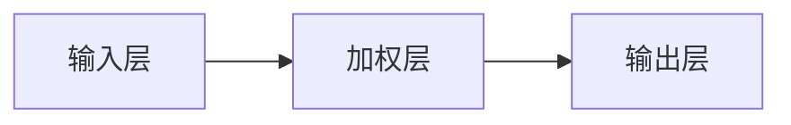
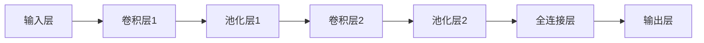

                 

关键词：感知器、卷积神经网络、机器学习、图像识别、深度学习、人工智能

> 摘要：本文从感知器的基本原理出发，详细阐述了卷积神经网络（CNN）的发展历程、核心概念、算法原理以及其在实际应用中的重要性。通过对CNN的数学模型、算法步骤、优缺点、应用领域等方面的深入探讨，本文旨在为广大读者提供一部全面、系统的CNN学习指南。

## 1. 背景介绍

在人工智能（AI）领域，图像识别是一项重要而具有挑战性的任务。早期的图像识别算法主要依赖于传统机器学习技术，如支持向量机（SVM）、K最近邻（K-NN）等。然而，这些方法在面对复杂图像场景时表现不佳，难以处理图像的层次结构和丰富的特征信息。

随着深度学习的兴起，卷积神经网络（CNN）逐渐成为图像识别领域的利器。CNN利用其独特的网络结构和强大的特征提取能力，在多个图像识别任务中取得了显著的成果。从感知器到卷积神经网络，本文将带领读者了解CNN的发展历程、核心概念和算法原理。

## 2. 核心概念与联系

### 2.1 感知器

感知器是神经网络的基本单元，负责对输入信号进行加权求和处理，并产生输出。一个简单的感知器由一个输入层、一个加权层和一个输出层组成。



### 2.2 卷积神经网络（CNN）

卷积神经网络是一种特殊的多层神经网络，主要应用于图像处理任务。CNN的核心结构包括卷积层、池化层、全连接层等。



### 2.3 感知器与卷积神经网络的联系

感知器是卷积神经网络的基础，CNN通过组合多个感知器，形成了更复杂的网络结构。感知器的思想在卷积层中得到了进一步的发展，卷积层利用卷积操作提取图像的特征。

## 3. 核心算法原理 & 具体操作步骤

### 3.1 算法原理概述

卷积神经网络通过以下几个关键步骤实现图像识别：

1. **卷积操作**：卷积层利用滤波器（也称为卷积核）对输入图像进行卷积操作，提取图像的特征。
2. **池化操作**：池化层对卷积后的特征进行下采样，减少特征数量，提高计算效率。
3. **全连接层**：全连接层将池化后的特征映射到输出层，实现图像分类或回归任务。

### 3.2 算法步骤详解

1. **输入层**：接收图像数据，将图像转化为二维矩阵。
2. **卷积层**：利用滤波器对输入图像进行卷积操作，提取特征。
    ```latex
    (F_{ij}) = \sum_{k=1}^{C} w_{ik} * f_{kj}
    ```
    其中，\(F_{ij}\)表示输出特征图上的元素，\(w_{ik}\)表示滤波器的权重，\(f_{kj}\)表示输入图像上的元素。
3. **激活函数**：对卷积后的特征图进行非线性变换，常用的激活函数有ReLU、Sigmoid和Tanh。
4. **池化层**：对激活后的特征图进行下采样，常用的池化方法有最大池化和平均池化。
5. **全连接层**：将池化后的特征图展平为一维向量，通过全连接层映射到输出层。
6. **输出层**：输出层实现图像分类或回归任务，常用的激活函数有Softmax和Sigmoid。

### 3.3 算法优缺点

#### 优点：

1. **强大的特征提取能力**：CNN能够自动提取图像的层次结构和丰富的特征信息。
2. **并行计算**：卷积操作可以并行计算，提高计算效率。
3. **适用于多种图像识别任务**：CNN在图像分类、目标检测、图像分割等领域表现出色。

#### 缺点：

1. **计算量大**：CNN模型参数众多，训练过程计算量大。
2. **训练时间较长**：深度神经网络训练时间较长，对计算资源和时间有较高要求。

### 3.4 算法应用领域

1. **图像分类**：CNN在图像分类任务中取得了显著的成果，如ImageNet竞赛。
2. **目标检测**：CNN在目标检测任务中表现优异，如YOLO、Faster R-CNN等模型。
3. **图像分割**：CNN在图像分割任务中具有广泛的应用，如U-Net、SegNet等模型。

## 4. 数学模型和公式 & 详细讲解 & 举例说明

### 4.1 数学模型构建

卷积神经网络主要由以下几个部分组成：

1. **输入层**：输入图像转化为二维矩阵。
2. **卷积层**：卷积操作提取图像特征，计算公式如上所述。
3. **激活函数**：常用的激活函数有ReLU、Sigmoid和Tanh。
4. **池化层**：下采样特征图，常用的池化方法有最大池化和平均池化。
5. **全连接层**：将池化后的特征图映射到输出层。
6. **输出层**：实现图像分类或回归任务。

### 4.2 公式推导过程

以一个简单的卷积神经网络为例，推导其计算过程：

1. **输入层**：输入图像 \(I\) 转化为二维矩阵。
    ```latex
    I = \begin{bmatrix}
    I_{11} & I_{12} & ... & I_{1n} \\
    I_{21} & I_{22} & ... & I_{2n} \\
    ... & ... & ... & ... \\
    I_{m1} & I_{m2} & ... & I_{mn}
    \end{bmatrix}
    ```

2. **卷积层**：卷积操作提取图像特征，计算公式如上所述。
    ```latex
    F = \begin{bmatrix}
    F_{11} & F_{12} & ... & F_{1n} \\
    F_{21} & F_{22} & ... & F_{2n} \\
    ... & ... & ... & ... \\
    F_{l1} & F_{l2} & ... & F_{ln}
    \end{bmatrix}
    ```

3. **激活函数**：对卷积后的特征图进行非线性变换，常用的激活函数有ReLU、Sigmoid和Tanh。

4. **池化层**：对激活后的特征图进行下采样，常用的池化方法有最大池化和平均池化。

5. **全连接层**：将池化后的特征图展平为一维向量，通过全连接层映射到输出层。
    ```latex
    z = \sum_{i=1}^{l} w_{i} * x_i + b
    ```

6. **输出层**：输出层实现图像分类或回归任务。

### 4.3 案例分析与讲解

以一个简单的图像分类任务为例，使用卷积神经网络实现猫狗分类。

1. **数据准备**：准备包含猫和狗的图像数据集。
2. **模型构建**：构建一个简单的卷积神经网络，包括卷积层、激活函数、池化层和全连接层。
3. **模型训练**：使用训练数据集对模型进行训练，优化网络参数。
4. **模型评估**：使用测试数据集对模型进行评估，计算分类准确率。

## 5. 项目实践：代码实例和详细解释说明

### 5.1 开发环境搭建

1. **安装Python**：在本地计算机上安装Python 3.x版本。
2. **安装TensorFlow**：使用pip命令安装TensorFlow库。
    ```bash
    pip install tensorflow
    ```

### 5.2 源代码详细实现

以下是一个简单的猫狗分类项目的代码示例：

```python
import tensorflow as tf
from tensorflow.keras import datasets, layers, models

# 数据准备
(train_images, train_labels), (test_images, test_labels) = datasets.cats_and_dogs.load_data()

# 数据预处理
train_images = train_images / 255.0
test_images = test_images / 255.0

# 模型构建
model = models.Sequential()
model.add(layers.Conv2D(32, (3, 3), activation='relu', input_shape=(150, 150, 3)))
model.add(layers.MaxPooling2D((2, 2)))
model.add(layers.Conv2D(64, (3, 3), activation='relu'))
model.add(layers.MaxPooling2D((2, 2)))
model.add(layers.Conv2D(64, (3, 3), activation='relu'))
model.add(layers.Flatten())
model.add(layers.Dense(64, activation='relu'))
model.add(layers.Dense(1, activation='sigmoid'))

# 模型编译
model.compile(optimizer='adam', loss='binary_crossentropy', metrics=['accuracy'])

# 模型训练
model.fit(train_images, train_labels, epochs=10, validation_split=0.2)

# 模型评估
test_loss, test_acc = model.evaluate(test_images, test_labels)
print('Test accuracy:', test_acc)
```

### 5.3 代码解读与分析

1. **数据准备**：从数据集中加载猫和狗的图像，并按比例划分训练集和测试集。
2. **数据预处理**：将图像数据缩放到0-1的范围内，便于模型训练。
3. **模型构建**：构建一个简单的卷积神经网络，包括卷积层、激活函数、池化层和全连接层。
4. **模型编译**：编译模型，指定优化器和损失函数。
5. **模型训练**：使用训练数据集对模型进行训练。
6. **模型评估**：使用测试数据集对模型进行评估，计算分类准确率。

## 6. 实际应用场景

卷积神经网络在图像识别领域具有广泛的应用，以下列举几个典型应用场景：

1. **图像分类**：如猫狗分类、植物分类等。
2. **目标检测**：如人脸检测、车辆检测等。
3. **图像分割**：如医学图像分割、城市交通场景分割等。
4. **图像增强**：如图像去噪、图像超分辨率等。

## 7. 未来应用展望

随着深度学习技术的不断发展，卷积神经网络在图像识别领域仍具有巨大的应用潜力。以下列举几个未来应用方向：

1. **实时图像识别**：提高CNN的实时处理能力，实现实时图像识别。
2. **跨域图像识别**：拓展CNN的应用范围，实现跨域图像识别。
3. **图像生成**：利用CNN生成具有逼真效果的图像。

## 8. 工具和资源推荐

### 8.1 学习资源推荐

1. **《深度学习》（Goodfellow, Bengio, Courville著）**：深度学习的经典教材，全面介绍了深度学习的基本原理和应用。
2. **《动手学深度学习》（阿斯顿·张等著）**：通过实际项目案例，深入讲解深度学习的基础知识。
3. **TensorFlow官网教程**：TensorFlow官方提供的教程，涵盖从基础到高级的深度学习应用。

### 8.2 开发工具推荐

1. **TensorFlow**：Google开源的深度学习框架，支持多种深度学习模型。
2. **PyTorch**：Facebook开源的深度学习框架，具有灵活性和高效性。
3. **Keras**：基于TensorFlow和PyTorch的高级深度学习框架，简化模型构建和训练过程。

### 8.3 相关论文推荐

1. **《A Comprehensive Review of Convolutional Neural Networks》**：全面综述卷积神经网络的发展历程和最新研究成果。
2. **《Deep Residual Learning for Image Recognition》**：提出残差网络（ResNet）模型，实现了图像分类任务的突破。
3. **《You Only Look Once: Unified, Real-Time Object Detection》**：提出YOLO目标检测模型，显著提高了目标检测的实时性能。

## 9. 总结：未来发展趋势与挑战

卷积神经网络在图像识别领域取得了显著的成果，但仍面临以下挑战：

1. **计算资源消耗**：深度神经网络训练过程计算量大，对计算资源和时间有较高要求。
2. **模型解释性**：深度神经网络模型具有强大的特征提取能力，但缺乏解释性，难以理解模型的决策过程。
3. **跨域适应性**：拓展CNN的应用范围，实现跨域图像识别仍具有较大挑战。

未来，随着深度学习技术的不断发展，卷积神经网络在图像识别领域仍具有广阔的应用前景。通过优化模型结构、提高计算效率、增强模型解释性等方法，卷积神经网络将更好地服务于人工智能领域。

## 10. 附录：常见问题与解答

### 10.1 卷积神经网络是什么？

卷积神经网络（CNN）是一种特殊的多层神经网络，主要用于图像处理任务。CNN利用其独特的网络结构和强大的特征提取能力，在多个图像识别任务中取得了显著的成果。

### 10.2 如何构建卷积神经网络？

构建卷积神经网络主要包括以下几个步骤：

1. 设计网络结构，包括卷积层、池化层和全连接层等。
2. 指定激活函数，如ReLU、Sigmoid和Tanh等。
3. 编译模型，指定优化器和损失函数。
4. 训练模型，使用训练数据集优化网络参数。
5. 评估模型，使用测试数据集评估模型性能。

### 10.3 卷积神经网络在图像识别中有什么优势？

卷积神经网络在图像识别中的优势主要包括：

1. **强大的特征提取能力**：CNN能够自动提取图像的层次结构和丰富的特征信息。
2. **并行计算**：卷积操作可以并行计算，提高计算效率。
3. **适用于多种图像识别任务**：CNN在图像分类、目标检测、图像分割等领域表现出色。

### 10.4 卷积神经网络有哪些常见的应用场景？

卷积神经网络在图像识别领域具有广泛的应用，以下列举几个典型应用场景：

1. **图像分类**：如猫狗分类、植物分类等。
2. **目标检测**：如人脸检测、车辆检测等。
3. **图像分割**：如医学图像分割、城市交通场景分割等。
4. **图像增强**：如图像去噪、图像超分辨率等。

