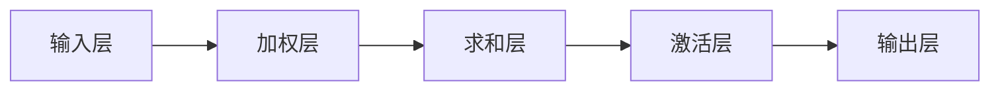
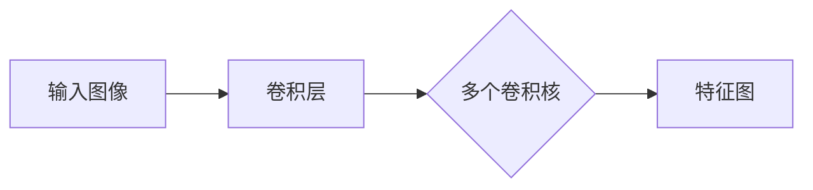
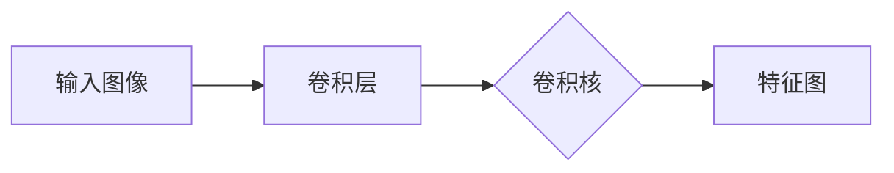
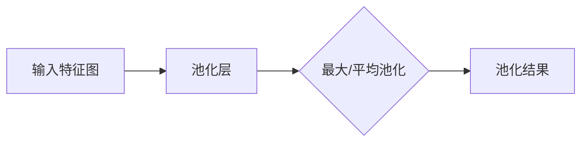
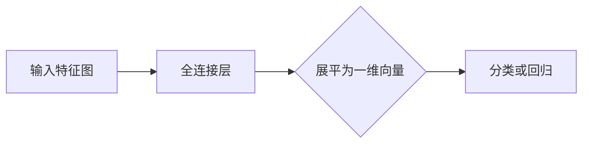

                 

关键词：感知器、卷积神经网络、深度学习、计算机视觉、图像识别、神经网络架构、算法原理、数学模型、应用实例、未来展望

> 摘要：本文将探讨从简单的感知器到现代卷积神经网络（CNN）的发展历程。我们将深入理解CNN的核心概念、算法原理、数学模型以及其在计算机视觉领域的广泛应用，同时也会展望CNN未来的发展趋势和面临的挑战。

## 1. 背景介绍

### 1.1 感知器的发展历史

感知器是神经网络中最基础的结构，可以看作是人工神经网络的开端。1958年，Frank Rosenblatt提出了感知器（Perceptron）这一概念，它是二分类线性分类器，能够使用加权输入和线性函数来实现阈值分类。感知器的出现标志着神经网络研究的开端，尽管其功能有限，但它为后续的人工神经网络研究提供了基础理论支持。

### 1.2 卷积神经网络的崛起

随着计算机性能的提升和大数据时代的到来，神经网络的应用范围不断扩大。1980年代，Yann LeCun提出了卷积神经网络（CNN），并在图像识别等领域取得了显著的成果。卷积神经网络引入了卷积层，能够自动提取图像的特征，大大提升了图像识别的准确率。

## 2. 核心概念与联系

### 2.1 神经元

神经元是神经网络的基本组成单元，类似于生物神经元。它接收输入信号，通过加权求和后，通过激活函数产生输出。神经元的基本结构包括输入层、加权层、求和层和激活层。



### 2.2 激活函数

激活函数是神经网络中重要的组成部分，用于决定神经元是否被激活。常见的激活函数包括sigmoid函数、ReLU函数、Tanh函数等。

```mermaid
flowchart LR
A[输入x] --> B{应用激活函数}
B --> C[输出f(x)]
```

### 2.3 卷积层

卷积层是CNN的核心部分，通过卷积操作提取图像特征。卷积层使用卷积核（filter）在输入图像上滑动，计算局部特征。每个卷积核都能提取一种特定类型的特征。



## 3. 核心算法原理 & 具体操作步骤

### 3.1 算法原理概述

卷积神经网络（CNN）的核心算法是基于卷积操作的。卷积神经网络的基本结构包括输入层、卷积层、池化层、全连接层和输出层。卷积层通过卷积操作提取图像特征，池化层用于降低特征图的空间分辨率，全连接层用于分类或回归任务。

### 3.2 算法步骤详解

#### 3.2.1 卷积操作

卷积操作是CNN的核心，通过卷积核（filter）在输入图像上滑动，计算局部特征。



#### 3.2.2 池化操作

池化层用于降低特征图的空间分辨率，常见的池化操作包括最大池化和平均池化。



#### 3.2.3 全连接层

全连接层用于分类或回归任务，将池化层输出的特征图展平为一维向量，并通过权重矩阵进行分类。



### 3.3 算法优缺点

#### 3.3.1 优点

- 强大的特征提取能力：卷积神经网络能够自动提取图像的局部特征，提高了图像识别的准确率。
- 参数共享：卷积神经网络通过卷积操作实现参数共享，减少了模型参数的数量，降低了计算复杂度。
- 平移不变性：卷积神经网络对图像的平移具有一定的鲁棒性，提高了图像识别的稳定性。

#### 3.3.2 缺点

- 计算量大：卷积神经网络需要进行大量的矩阵运算，计算量大，对硬件要求较高。
- 训练时间长：卷积神经网络的训练过程需要大量数据和计算资源，训练时间较长。

### 3.4 算法应用领域

卷积神经网络在计算机视觉领域取得了显著的成果，包括图像分类、目标检测、图像分割等。同时，卷积神经网络也被应用于自然语言处理、语音识别等领域。

## 4. 数学模型和公式 & 详细讲解 & 举例说明

### 4.1 数学模型构建

卷积神经网络的基本数学模型包括输入层、卷积层、池化层和全连接层。输入层接收图像数据，卷积层通过卷积操作提取特征，池化层降低特征图的空间分辨率，全连接层进行分类或回归。

### 4.2 公式推导过程

卷积神经网络的核心是卷积操作和反向传播算法。卷积操作的公式如下：

$$
\text{output} = \text{filter} * \text{input} + \text{bias}
$$

其中，*表示卷积操作，filter表示卷积核，input表示输入图像，bias表示偏置。

反向传播算法用于训练卷积神经网络，其核心是计算损失函数关于模型参数的梯度。损失函数的公式如下：

$$
L = \frac{1}{2} \sum_{i=1}^{N} (\hat{y_i} - y_i)^2
$$

其中，$L$表示损失函数，$\hat{y_i}$表示预测结果，$y_i$表示真实标签。

### 4.3 案例分析与讲解

假设我们有一个二分类问题，输入图像为$28 \times 28$的像素矩阵，卷积核大小为$3 \times 3$。首先，我们进行卷积操作，计算每个卷积核的输出：

$$
\text{output}_1 = f_1 * \text{input} + \text{bias}_1
$$

$$
\text{output}_2 = f_2 * \text{input} + \text{bias}_2
$$

其中，$f_1$和$f_2$表示卷积核，$\text{bias}_1$和$\text{bias}_2$表示偏置。

接下来，我们进行池化操作，以$2 \times 2$的窗口进行最大池化：

$$
\text{pool}_1 = \text{max}(\text{output}_1)
$$

$$
\text{pool}_2 = \text{max}(\text{output}_2)
$$

然后，我们将池化结果展平为一维向量，送入全连接层进行分类：

$$
\text{output} = W \cdot \text{pool}_1 + b
$$

其中，$W$表示权重矩阵，$b$表示偏置。

最后，计算损失函数关于模型参数的梯度，并更新模型参数：

$$
\frac{\partial L}{\partial W} = \text{pool}_1 \cdot (\hat{y} - y)
$$

$$
\frac{\partial L}{\partial b} = \hat{y} - y
$$

## 5. 项目实践：代码实例和详细解释说明

### 5.1 开发环境搭建

为了实践卷积神经网络，我们需要搭建一个合适的开发环境。本文使用Python作为编程语言，结合TensorFlow库来实现卷积神经网络。

### 5.2 源代码详细实现

以下是卷积神经网络的基本实现代码：

```python
import tensorflow as tf

# 创建卷积神经网络模型
model = tf.keras.Sequential([
    tf.keras.layers.Conv2D(32, (3, 3), activation='relu', input_shape=(28, 28, 1)),
    tf.keras.layers.MaxPooling2D((2, 2)),
    tf.keras.layers.Flatten(),
    tf.keras.layers.Dense(128, activation='relu'),
    tf.keras.layers.Dense(10, activation='softmax')
])

# 编译模型
model.compile(optimizer='adam',
              loss='categorical_crossentropy',
              metrics=['accuracy'])

# 训练模型
model.fit(train_images, train_labels, epochs=5, validation_split=0.2)
```

### 5.3 代码解读与分析

- **模型搭建**：使用`tf.keras.Sequential`创建序列模型，包括卷积层、池化层和全连接层。
- **编译模型**：设置优化器、损失函数和评估指标。
- **训练模型**：使用训练数据训练模型，设置训练轮数和验证比例。

### 5.4 运行结果展示

训练完成后，我们可以使用测试数据评估模型的性能：

```python
test_loss, test_acc = model.evaluate(test_images, test_labels)
print(f'测试准确率：{test_acc}')
```

## 6. 实际应用场景

卷积神经网络在计算机视觉领域取得了显著的成果，广泛应用于图像分类、目标检测、图像分割等领域。以下是一些实际应用场景：

- **图像分类**：使用卷积神经网络对大量图像进行分类，如ImageNet比赛。
- **目标检测**：检测图像中的目标物体，如YOLO算法。
- **图像分割**：将图像划分为不同的区域，如FCN算法。

## 7. 工具和资源推荐

### 7.1 学习资源推荐

- 《深度学习》（Goodfellow、Bengio、Courville著）：系统介绍了深度学习的基础理论和应用。
- 《神经网络与深度学习》（邱锡鹏著）：详细介绍了神经网络和深度学习的理论和实践。

### 7.2 开发工具推荐

- TensorFlow：开源深度学习框架，支持卷积神经网络等深度学习模型。
- Keras：基于TensorFlow的简洁易用的深度学习库。

### 7.3 相关论文推荐

- “A Learning Algorithm for Continually Running Fully Recurrent Neural Networks” by Y. LeCun, Y. Bengio, and G. Hinton。
- “Convolutional Networks for Images, Speech, and Time Series” by Y. LeCun, Y. Bengio, and G. Hinton。

## 8. 总结：未来发展趋势与挑战

### 8.1 研究成果总结

卷积神经网络在计算机视觉领域取得了显著的成果，其强大的特征提取能力和平移不变性使其成为图像识别、目标检测和图像分割的重要工具。

### 8.2 未来发展趋势

- **网络结构优化**：不断探索新的卷积神经网络架构，提高模型性能和效率。
- **迁移学习**：利用预训练模型和迁移学习技术，提高模型的泛化能力。
- **硬件加速**：利用GPU、TPU等硬件加速深度学习计算，提高模型训练速度。

### 8.3 面临的挑战

- **计算资源消耗**：卷积神经网络的训练过程需要大量的计算资源和时间。
- **数据隐私**：深度学习模型对数据的要求较高，如何在保护用户隐私的前提下进行数据训练是一个挑战。

### 8.4 研究展望

随着深度学习的不断发展，卷积神经网络在计算机视觉领域将会取得更多突破。同时，我们也可以预期深度学习在其他领域的广泛应用，如自然语言处理、语音识别等。

## 9. 附录：常见问题与解答

### 9.1 什么是卷积神经网络？

卷积神经网络（CNN）是一种特殊的神经网络，通过卷积操作提取图像特征，用于图像识别、目标检测和图像分割等计算机视觉任务。

### 9.2 卷积神经网络如何提取图像特征？

卷积神经网络通过卷积层提取图像的局部特征，然后通过池化层降低特征图的空间分辨率，最后通过全连接层进行分类或回归任务。

### 9.3 卷积神经网络的优缺点是什么？

卷积神经网络的优点包括强大的特征提取能力、参数共享和平移不变性。缺点包括计算量大和训练时间长。

### 9.4 如何优化卷积神经网络？

可以通过优化网络结构、使用迁移学习和硬件加速等方法来优化卷积神经网络。

### 9.5 卷积神经网络在哪些领域有应用？

卷积神经网络在图像分类、目标检测、图像分割等领域有广泛应用，同时也在自然语言处理、语音识别等领域取得了一定成果。

----------------------------------------------------------------

**作者署名：禅与计算机程序设计艺术 / Zen and the Art of Computer Programming**

