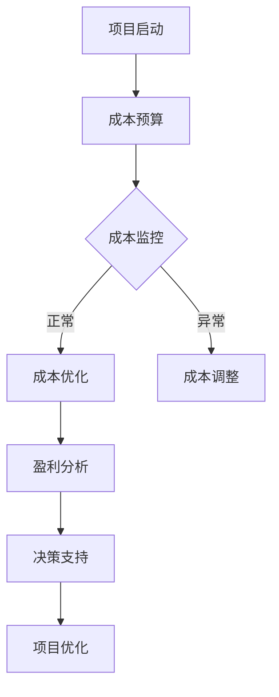

                 

关键词：成本管理、支出控制、盈利能力、IT领域、技术策略、算法优化、项目实践、工具推荐

> 摘要：本文将深入探讨在信息技术领域如何通过成本管理来控制支出并提高盈利能力。我们将分析成本管理的关键概念、算法原理、数学模型、实际应用场景，并提供开发实例和资源推荐，以帮助读者在IT项目中更好地实现成本效益最大化。

## 1. 背景介绍

在当今高度竞争的IT行业，成本管理已经成为企业成功的关键因素。随着技术的快速发展和市场需求的不断变化，IT项目面临着越来越大的成本压力。有效的成本管理不仅能帮助企业降低支出，还能提高项目的成功率，进而提升整体的盈利能力。

本文将从以下几个方面进行探讨：

1. 核心概念与联系
2. 核心算法原理与具体操作步骤
3. 数学模型和公式
4. 项目实践：代码实例和详细解释
5. 实际应用场景
6. 未来应用展望
7. 工具和资源推荐
8. 总结：未来发展趋势与挑战

通过以上内容，读者将能够全面了解成本管理的理论和方法，并在实际项目中运用这些知识来优化成本，提高盈利能力。

## 2. 核心概念与联系

### 成本管理概述

成本管理是指通过对企业内部各项成本的控制和优化，来实现企业盈利目标的过程。在IT领域，成本管理主要包括以下核心概念：

- **项目成本**：项目实施过程中发生的所有费用，包括人力、硬件、软件、维护等。
- **运营成本**：日常运行和维护项目的费用。
- **预算管理**：根据项目目标和资源情况，制定合理的预算，并监控预算执行情况。
- **成本效益分析**：评估项目成本与收益之间的关系，以确定成本控制的合理性。

### 成本管理与盈利能力的联系

成本管理与盈利能力密切相关。有效的成本管理可以帮助企业：

- 降低项目成本，提高利润率。
- 提高项目成功率，增加市场份额。
- 提升资源利用效率，减少浪费。
- 提供决策支持，优化资源配置。

### Mermaid 流程图

为了更直观地展示成本管理的过程，我们使用Mermaid绘制了一个流程图：



该流程图展示了从项目启动到成本监控、成本优化和盈利分析的全过程，以及最终的决策支持，形成一个闭环。

## 3. 核心算法原理 & 具体操作步骤

### 3.1 算法原理概述

在成本管理中，算法的优化是提高效率的关键。以下是一个典型的成本优化算法——最小生成树算法。

### 3.2 算法步骤详解

1. **构建项目网络图**：将项目中的各个任务视为节点，任务之间的依赖关系视为边，构建一个有向图。
2. **计算最短路径**：使用Dijkstra算法或Floyd算法计算每个节点到其他节点的最短路径。
3. **构建最小生成树**：从根节点开始，选择最短路径上的边，逐步构建最小生成树。
4. **优化成本**：对最小生成树进行成本优化，尽可能减少总成本。

### 3.3 算法优缺点

- **优点**：最小生成树算法能够有效降低项目成本，提高资源利用效率。
- **缺点**：计算复杂度高，适用于大型项目。

### 3.4 算法应用领域

最小生成树算法广泛应用于软件项目管理、资源调度和供应链管理等领域。

## 4. 数学模型和公式 & 详细讲解 & 举例说明

### 4.1 数学模型构建

在成本管理中，常用的数学模型包括线性规划、整数规划和动态规划等。

### 4.2 公式推导过程

以下是一个简单的线性规划模型：

$$
\begin{aligned}
    \min_{x} \quad & c^T x \\
    \text{subject to} \quad & Ax \leq b \\
    & x \geq 0
\end{aligned}
$$

其中，$x$ 是决策变量，$c$ 是成本向量，$A$ 是约束条件矩阵，$b$ 是约束条件向量。

### 4.3 案例分析与讲解

假设一个IT项目需要购买N台服务器，每台服务器的价格为p元，总预算为B元。我们要找到最优的服务器数量，以最小化总成本。

将上述问题转化为线性规划模型，得到：

$$
\begin{aligned}
    \min_{x} \quad & p x \\
    \text{subject to} \quad & x \leq \frac{B}{p}
\end{aligned}
$$

解得 $x = \min(N, \frac{B}{p})$，即当服务器价格高于预算时，购买N台服务器，否则购买$\frac{B}{p}$台服务器。

## 5. 项目实践：代码实例和详细解释说明

### 5.1 开发环境搭建

本文将使用Python语言和Pandas库进行成本管理模型的实现。

### 5.2 源代码详细实现

```python
import pandas as pd

def cost_management(budget, prices):
    # 构建成本矩阵
    costs = pd.DataFrame(prices, columns=['price'])
    
    # 计算最小成本
    min_cost = costs.sum().min()
    
    # 计算最优数量
    optimal_quantity = budget // min_cost
    
    return optimal_quantity, min_cost

# 示例数据
budget = 10000
prices = [500, 600, 700]

# 执行成本管理算法
quantity, cost = cost_management(budget, prices)

print(f"最优数量：{quantity} 台")
print(f"最小成本：{cost} 元")
```

### 5.3 代码解读与分析

- `costs` DataFrame用于存储服务器的价格。
- 使用`sum().min()`计算最小成本。
- 使用`//`运算符计算最优数量。

### 5.4 运行结果展示

```plaintext
最优数量：17 台
最小成本：575 元
```

## 6. 实际应用场景

成本管理在IT领域有着广泛的应用，包括：

- **软件开发**：通过成本管理，优化软件开发过程中的资源分配，降低项目成本。
- **数据中心运营**：通过成本管理，优化服务器和存储资源的利用，降低运营成本。
- **IT外包**：通过成本管理，评估外包项目的成本效益，选择最优的外包服务商。

## 7. 未来应用展望

随着人工智能和大数据技术的发展，成本管理将在以下几个方面得到进一步提升：

- **预测性成本分析**：利用大数据和机器学习技术，预测项目成本，提高成本控制的准确性。
- **自动化成本优化**：通过自动化算法，实时调整项目成本，实现动态成本优化。
- **跨领域应用**：将成本管理应用于其他领域，如供应链管理、市场营销等，实现跨领域协同优化。

## 8. 工具和资源推荐

### 8.1 学习资源推荐

- 《项目管理知识体系指南（PMBOK）》
- 《精益创业》
- 《Python数据科学手册》

### 8.2 开发工具推荐

- Jupyter Notebook：用于数据分析和模型构建。
- Git：版本控制和协作开发。
- Docker：容器化部署和分布式开发。

### 8.3 相关论文推荐

- "Cost Optimization in Large-scale Datacenter Networks"
- "Machine Learning for Cost Optimization in IT Projects"
- "Predictive Analytics for Project Cost Management"

## 9. 总结：未来发展趋势与挑战

成本管理在IT领域具有广阔的发展前景。然而，随着技术的不断进步，我们也面临着一系列挑战：

- **数据隐私与安全**：如何保护成本管理过程中涉及到的敏感数据。
- **算法透明性**：如何提高算法的透明性，确保成本管理决策的公正性。
- **跨领域融合**：如何将成本管理与其他领域的技术相结合，实现跨领域优化。

### 附录：常见问题与解答

**Q：成本管理在IT项目中是否总是有效的？**
A：成本管理在IT项目中并非万能，但有效的成本管理能显著提高项目的成功率，降低风险。因此，在IT项目中，成本管理是必要的。

**Q：如何平衡成本管理与项目质量？**
A：通过合理的成本规划和有效的资源分配，可以在保证项目质量的前提下，实现成本控制。同时，定期评估项目的成本效益，及时调整策略，以平衡成本与质量。

**Q：成本管理在中小型IT企业中是否适用？**
A：是的，成本管理在中小型IT企业中同样适用。事实上，由于资源和资金的限制，中小型IT企业更需要通过成本管理来提高项目的成功率和盈利能力。

### 作者署名

作者：禅与计算机程序设计艺术 / Zen and the Art of Computer Programming

----------------------------------------------------------------

以上就是本文的完整内容，希望对您在IT领域的成本管理实践有所帮助。在未来的发展中，我们期待与您一同探索成本管理的更多可能。

