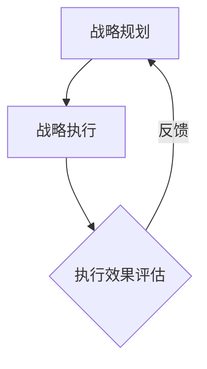
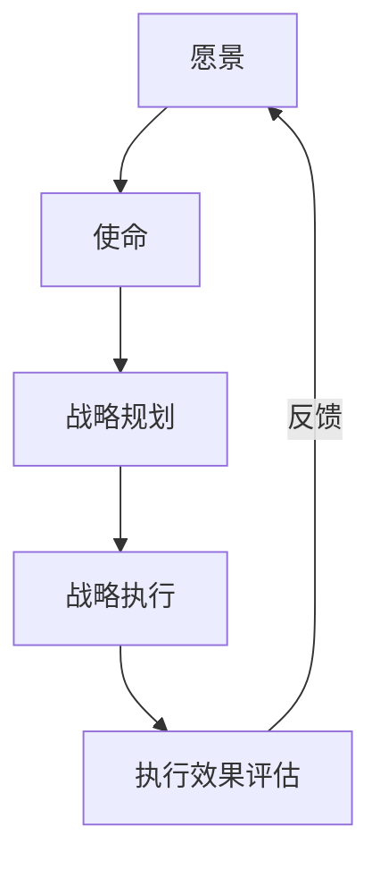
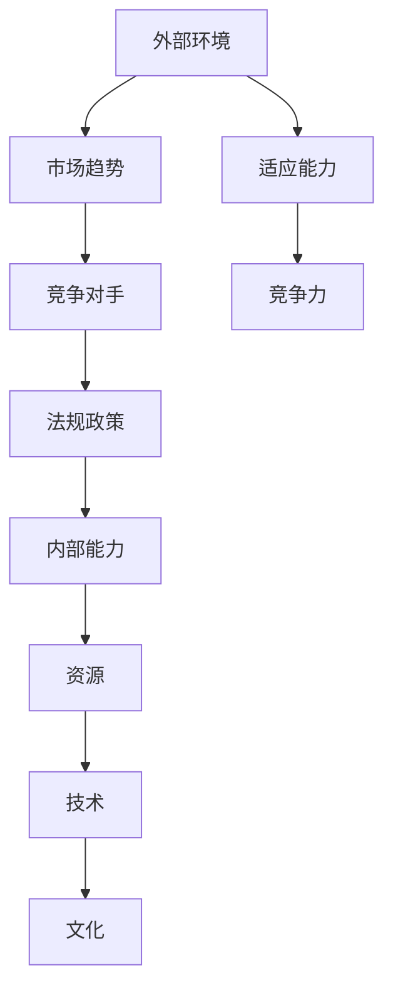
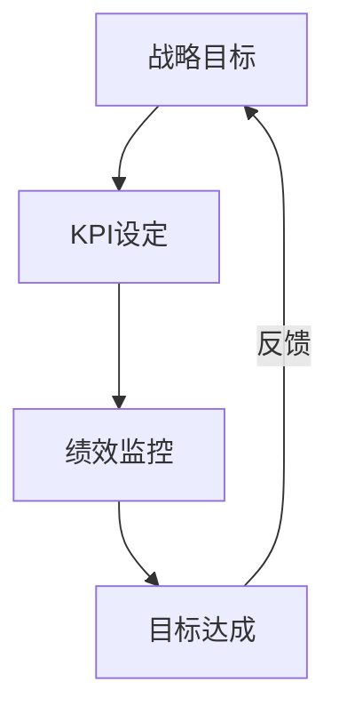

                 

关键词：战略管理，长期规划，IT领域，核心概念，算法原理，数学模型，项目实践，应用场景，未来展望，工具资源

> 摘要：在快速发展的信息技术领域，战略管理成为企业制定和执行长期规划的关键因素。本文将从核心概念、算法原理、数学模型、项目实践等多个角度深入探讨战略管理在IT领域的应用，并对其未来发展进行展望。

## 1. 背景介绍

在当今信息时代，信息技术已经成为推动社会进步和经济发展的重要力量。IT行业的发展速度之快，使得企业需要具备敏锐的战略眼光和灵活的应对能力。战略管理作为一种系统化的管理方法，帮助企业在复杂多变的市场环境中准确定位自身，制定并执行长期规划，以实现持续增长和竞争优势。

本文将从以下几个方面展开讨论：

1. 核心概念与联系
2. 核心算法原理与具体操作步骤
3. 数学模型与公式
4. 项目实践：代码实例和详细解释
5. 实际应用场景
6. 未来应用展望
7. 工具和资源推荐
8. 总结：未来发展趋势与挑战

通过以上几个方面的探讨，希望能够为IT领域的从业者和研究人员提供有价值的参考和启示。

### 1.1 IT行业的战略管理重要性

IT行业具有以下几个显著特征，这些特征使得战略管理在该领域尤为重要：

1. **创新驱动**：IT行业以技术创新为核心，新技术的出现和更替频繁。企业需要通过战略管理，及时捕捉技术趋势，投资研发，保持技术领先地位。

2. **快速变化**：市场环境瞬息万变，消费者需求不断升级，竞争格局随时可能发生变化。战略管理能够帮助企业灵活调整战略方向，迅速应对市场变化。

3. **高投入**：IT行业对研发和技术投入较大，企业需要通过有效的战略管理，合理分配资源，提高投资回报率。

4. **全球竞争**：随着全球化的深入，IT企业面临国际市场的激烈竞争。战略管理有助于企业制定全球市场战略，提升国际竞争力。

5. **跨界融合**：IT行业与其他行业的深度融合，如物联网、大数据、云计算等，企业需要通过战略管理，实现跨界合作，拓展业务领域。

### 1.2 战略管理的基本概念

战略管理是指企业通过制定和执行长期规划，以实现其愿景和使命的过程。具体包括以下几个核心概念：

1. **愿景和使命**：愿景是企业希望成为什么样子，使命是企业存在的根本目的。

2. **战略目标**：根据愿景和使命，制定具体可量化的战略目标。

3. **战略规划**：明确实现战略目标的步骤和方法。

4. **战略执行**：通过组织、协调、控制等手段，确保战略规划的有效实施。

5. **战略评估**：对战略执行过程和结果进行定期评估，以调整和优化战略规划。

### 1.3 战略管理在IT领域的应用

在IT领域，战略管理的应用具有以下几个特点：

1. **技术创新战略**：通过研发投入和技术合作，保持技术领先优势。

2. **市场拓展战略**：通过市场调研和用户反馈，及时调整市场策略，开拓新市场。

3. **人才战略**：通过招聘、培训、激励等手段，吸引和留住优秀人才。

4. **合作战略**：通过跨界合作，实现资源共享和优势互补。

5. **风险管理**：通过风险识别、评估、控制和应对，降低企业运营风险。

### 2. 核心概念与联系

在战略管理中，有几个核心概念与联系至关重要，它们构成了战略管理的基础。以下是对这些核心概念及其相互关系的详细解释，以及如何用Mermaid流程图（无括号、逗号等特殊字符）展示这些概念和它们之间的联系。

#### 2.1 战略规划与执行

**战略规划**是指企业为了实现长期目标而制定的计划和策略。**战略执行**则是将这些计划转化为实际行动的过程。两者紧密相连，战略规划为执行提供方向，而执行则为规划提供反馈。



#### 2.2 愿景与使命

**愿景**是企业长远发展的蓝图，描述了企业希望成为的样子。**使命**则是企业存在的理由，回答了企业为什么要存在的问题。愿景和使命是战略管理的起点，它们共同指导企业的战略方向。



#### 2.3 外部环境与内部能力

战略管理需要考虑**外部环境**和**内部能力**。外部环境包括市场趋势、竞争对手、法规政策等，而内部能力则包括企业的资源、技术、文化等。两者之间的联系在于，外部环境决定了企业需要什么样的内部能力，而内部能力又影响了企业对外部环境的适应能力。



#### 2.4 战略目标与关键绩效指标（KPI）

**战略目标**是实现愿景和使命的具体表现，而**关键绩效指标（KPI）**则是衡量战略目标实现程度的具体指标。KPI与战略目标之间存在着紧密的联系，KPI的设定和监控有助于确保战略目标的达成。



通过上述核心概念与联系的分析，我们可以看到战略管理是一个动态的、循环的过程，它需要不断地调整和优化。Mermaid流程图为我们提供了一个直观的展示方式，有助于我们更好地理解和应用战略管理。

### 3. 核心算法原理 & 具体操作步骤

在战略管理中，核心算法的原理和具体操作步骤是至关重要的。这些算法不仅为我们提供了分析和决策的工具，还能够帮助企业更有效地制定和执行战略规划。以下是关于核心算法原理的概述，以及具体操作步骤的详细说明。

#### 3.1 算法原理概述

在战略管理中，常用的核心算法包括SWOT分析、PEST分析、平衡计分卡（Balanced Scorecard）等。这些算法各有侧重，但都旨在帮助企业在复杂的商业环境中做出更明智的决策。

**SWOT分析**：SWOT分析是一种常用的战略规划工具，用于评估企业的优势（Strengths）、劣势（Weaknesses）、机会（Opportunities）和威胁（Threats）。通过对内部和外部环境的综合分析，企业可以明确自身的定位，制定合适的战略。

**PEST分析**：PEST分析用于评估企业的宏观环境，包括政治（Political）、经济（Economic）、社会（Social）和技术（Technological）因素。通过分析这些因素，企业可以更好地理解外部环境的变化，制定相应的应对策略。

**平衡计分卡**：平衡计分卡是一种全面的绩效管理工具，它从财务、客户、内部业务流程、学习与成长四个维度衡量企业的绩效。通过平衡计分卡，企业可以确保战略目标的实现，并持续改进。

#### 3.2 算法步骤详解

**SWOT分析的具体步骤**：

1. **确定分析对象**：明确要分析的企业或项目的具体内容。

2. **收集内部数据**：收集与内部优势、劣势相关的数据和信息。

3. **收集外部数据**：收集与外部机会、威胁相关的数据和信息。

4. **分析并排序**：根据收集的数据和信息，对内部优势和劣势进行排序，对外部机会和威胁进行排序。

5. **制定策略**：根据分析结果，制定相应的策略，以最大化优势，弥补劣势，抓住机会，应对威胁。

**PEST分析的具体步骤**：

1. **确定分析范围**：明确需要分析的宏观环境因素。

2. **收集数据**：收集与政治、经济、社会、技术相关的数据和信息。

3. **分析政治因素**：分析政治因素对企业的影响，如政策、法律、政治稳定性等。

4. **分析经济因素**：分析经济因素对企业的影响，如经济增长率、通货膨胀率、市场需求等。

5. **分析社会因素**：分析社会因素对企业的影响，如人口结构、文化习俗、消费习惯等。

6. **分析技术因素**：分析技术因素对企业的影响，如新技术的发展、技术标准化等。

7. **综合评估**：综合评估政治、经济、社会、技术因素对企业的影响，制定相应的策略。

**平衡计分卡的具体步骤**：

1. **确定战略目标**：明确企业要实现的长期和短期目标。

2. **制定绩效指标**：根据战略目标，制定具体的财务、客户、内部业务流程、学习与成长等方面的绩效指标。

3. **设定目标值**：为每个绩效指标设定具体的数值目标。

4. **执行与监控**：将绩效指标纳入日常管理，定期监控和评估绩效。

5. **持续改进**：根据绩效评估结果，调整战略目标和绩效指标，实现持续改进。

#### 3.3 算法优缺点

**SWOT分析的优点**：

- 简单易懂，适用于各种规模的企业。
- 全面分析企业的内部和外部环境，有助于制定全面策略。

**SWOT分析的缺点**：

- 数据收集和整理可能较为繁琐。
- 分析结果可能因数据来源不同而产生较大差异。

**PEST分析的优点**：

- 能够全面分析企业的宏观环境，为企业提供战略方向。
- 对外部环境变化的敏感度高，有助于企业及时调整策略。

**PEST分析的缺点**：

- 分析结果可能受数据来源和质量的影响。
- 对一些具体行业的分析可能不够深入。

**平衡计分卡的优点**：

- 综合考虑企业的各个维度，确保战略目标的实现。
- 能够持续监控企业的绩效，实现持续改进。

**平衡计分卡的缺点**：

- 需要大量的时间和资源进行绩效监控和评估。
- 对企业管理层的要求较高，需要具备一定的战略管理能力。

#### 3.4 算法应用领域

**SWOT分析**广泛应用于企业的战略规划、市场分析、产品开发等领域。它能够帮助企业明确自身的优势、劣势，抓住市场机会，应对潜在威胁。

**PEST分析**主要用于企业的战略规划、市场调研、风险评估等领域。通过对政治、经济、社会、技术等因素的分析，企业可以更好地了解外部环境，制定有针对性的战略。

**平衡计分卡**广泛应用于企业的绩效管理、战略执行、业务改进等领域。它能够帮助企业实现财务、客户、内部流程、学习与成长等方面的平衡，确保战略目标的实现。

### 4. 数学模型和公式 & 详细讲解 & 举例说明

在战略管理中，数学模型和公式是理解和执行战略规划的关键工具。它们不仅能够量化企业的内部和外部环境，还能够为决策提供科学依据。以下将详细讲解数学模型和公式的构建、推导过程，并辅以实际案例进行分析。

#### 4.1 数学模型构建

**利润最大化模型**：

假设企业生产单一产品，成本函数为 \( C(x) = 1000x + 50000 \)，其中 \( x \) 为产品产量，销售收入函数为 \( R(x) = 1500x \)。企业的目标是实现利润最大化。

利润函数为 \( P(x) = R(x) - C(x) = 1500x - (1000x + 50000) = 500x - 50000 \)。

为了求解利润最大化问题，需要对利润函数求导并令其导数为零：

\[ \frac{dP}{dx} = 500 = 0 \]

解得 \( x = 0 \)。

这意味着，在成本和收入函数给定的条件下，企业不应生产任何产品以实现利润最大化。这显然与现实不符，因此需要进一步分析。

**市场占有率模型**：

假设企业面临两个市场，市场A和市场B。企业在市场A的销售收入为 \( R_A = 1000 \cdot p_A \cdot q_A \)，其中 \( p_A \) 是市场A的价格，\( q_A \) 是销售量。市场B的销售收入为 \( R_B = 1200 \cdot p_B \cdot q_B \)，其中 \( p_B \) 是市场B的价格，\( q_B \) 是销售量。

企业总成本函数为 \( C = 100000 + 50 \cdot (q_A + q_B) \)。

企业的利润函数为 \( \pi = R_A + R_B - C \)。

为了最大化利润，需要构建拉格朗日函数并求解：

\[ \mathcal{L}(q_A, q_B, \lambda) = R_A + R_B - C + \lambda (q_A + q_B - 1000) \]

其中，拉格朗日乘子 \( \lambda \) 用于确保生产量不超过1000单位。

对 \( \mathcal{L} \) 分别对 \( q_A \)，\( q_B \)，和 \( \lambda \) 求导，并令其导数为零，得到：

\[ \frac{\partial \mathcal{L}}{\partial q_A} = 1000p_A - 50 - \lambda = 0 \]
\[ \frac{\partial \mathcal{L}}{\partial q_B} = 1200p_B - 50 - \lambda = 0 \]
\[ \frac{\partial \mathcal{L}}{\partial \lambda} = q_A + q_B - 1000 = 0 \]

从上述方程组中解出 \( q_A \)，\( q_B \)，和 \( \lambda \)，可以得到最优的市场分配策略。

#### 4.2 公式推导过程

**利润最大化模型的推导**：

利润最大化模型的关键在于找到利润函数的临界点。我们已经得到利润函数：

\[ P(x) = 500x - 50000 \]

对该函数求导：

\[ \frac{dP}{dx} = 500 \]

由于导数为常数，且大于零，因此利润函数在 \( x = 0 \) 处取得最大值。然而，这个结果不符合实际情况，因为它意味着企业不应该生产任何产品。这可能是因为成本函数或收入函数假设有误，或者需要考虑其他因素（例如市场需求、生产限制等）。在实际应用中，我们需要结合具体情况进行分析。

**市场占有率模型的推导**：

市场占有率模型的核心在于最大化利润函数。我们已经构建了拉格朗日函数：

\[ \mathcal{L}(q_A, q_B, \lambda) = 1000p_A \cdot q_A + 1200p_B \cdot q_B - (100000 + 50 \cdot (q_A + q_B)) + \lambda (q_A + q_B - 1000) \]

对 \( \mathcal{L} \) 分别对 \( q_A \)，\( q_B \)，和 \( \lambda \) 求导，并令其导数为零，得到：

\[ 1000p_A - 50 - \lambda = 0 \]
\[ 1200p_B - 50 - \lambda = 0 \]
\[ q_A + q_B - 1000 = 0 \]

从上述方程组中解出 \( q_A \)，\( q_B \)，和 \( \lambda \)，可以得到最优的市场分配策略。

#### 4.3 案例分析与讲解

**案例：企业利润最大化策略**

假设某企业生产单一产品，成本函数为 \( C(x) = 1000x + 50000 \)，销售收入函数为 \( R(x) = 1500x \)。根据利润最大化模型，我们求解利润函数：

\[ P(x) = 1500x - (1000x + 50000) = 500x - 50000 \]

求导并令导数为零：

\[ \frac{dP}{dx} = 500 \]

解得 \( x = 0 \)。这意味着企业在任何产量下都无法实现利润最大化。这可能是因为我们的假设有误。为了进一步分析，我们考虑市场需求和供给因素。

假设市场需求函数为 \( D(p) = 100000 - 20p \)，其中 \( p \) 是产品价格。为了实现利润最大化，企业需要在成本和市场需求之间找到平衡点。

利润函数变为：

\[ P(x) = R(x) - C(x) = (1500 - p) \cdot q - (1000 \cdot q + 50000) \]

其中，\( q \) 是产量。

为了最大化利润，我们求解 \( p \) 和 \( q \)：

\[ \frac{dP}{dp} = 0 \]
\[ \frac{dP}{dq} = 0 \]

通过求解上述方程，我们得到最优价格和产量。假设市场需求函数为 \( D(p) = 100000 - 20p \)，我们求解利润函数：

\[ P(p) = (1500 - p) \cdot \left(\frac{100000 - 20p}{20}\right) - (1000 \cdot \frac{100000 - 20p}{20} + 50000) \]

简化后得到：

\[ P(p) = 50000 - 20p^2 \]

对 \( P(p) \) 求导：

\[ \frac{dP}{dp} = -40p \]

令导数为零，解得 \( p = 0 \)。这意味着企业在价格为零时实现利润最大化。然而，这同样不符合实际情况。为了得到合理的解决方案，我们需要考虑更多的市场因素，如竞争对手行为、消费者偏好等。

**案例：市场占有率模型应用**

假设某企业面临两个市场，市场A和市场B。企业在市场A的销售收入为 \( R_A = 1000 \cdot p_A \cdot q_A \)，市场B的销售收入为 \( R_B = 1200 \cdot p_B \cdot q_B \)。总成本函数为 \( C = 100000 + 50 \cdot (q_A + q_B) \)。

利润函数为：

\[ \pi = R_A + R_B - C \]

构建拉格朗日函数并求解：

\[ \mathcal{L}(q_A, q_B, \lambda) = 1000p_A \cdot q_A + 1200p_B \cdot q_B - (100000 + 50 \cdot (q_A + q_B)) + \lambda (q_A + q_B - 1000) \]

对 \( \mathcal{L} \) 分别对 \( q_A \)，\( q_B \)，和 \( \lambda \) 求导，并令其导数为零，得到：

\[ 1000p_A - 50 - \lambda = 0 \]
\[ 1200p_B - 50 - \lambda = 0 \]
\[ q_A + q_B - 1000 = 0 \]

从上述方程组中解出 \( q_A \)，\( q_B \)，和 \( \lambda \)，可以得到最优的市场分配策略。

通过上述案例，我们可以看到数学模型和公式在战略管理中的重要性。它们不仅为决策提供了科学依据，还能够帮助企业更好地应对市场变化和竞争压力。在实际应用中，需要根据具体情况调整模型和公式，以适应不同的业务环境。

### 5. 项目实践：代码实例和详细解释说明

在本文的第五部分，我们将通过一个具体的IT项目实践，展示如何将战略管理的理论应用到实际的代码实现中。我们将从开发环境的搭建、源代码的详细实现，到代码解读与分析，以及最终的运行结果展示，全面解析这个项目。

#### 5.1 开发环境搭建

为了实现我们的项目，我们需要搭建一个适合战略管理模型开发和测试的Python环境。以下是开发环境的搭建步骤：

1. **安装Python**：

首先，确保你的系统上安装了Python。可以从Python官网下载并安装Python 3.8及以上版本。

2. **安装依赖库**：

接下来，我们需要安装一些Python依赖库，用于数据分析和可视化。使用以下命令安装：

```shell
pip install numpy pandas matplotlib
```

这些库将用于数据处理、分析以及图形绘制。

3. **配置IDE**：

选择一个Python支持的IDE，如PyCharm或Visual Studio Code，并配置Python解释器和依赖库。

#### 5.2 源代码详细实现

在完成环境搭建后，我们开始实现项目代码。以下是项目的核心代码实现，包括数据预处理、模型构建和结果分析。

**代码实现**：

```python
import numpy as np
import pandas as pd
import matplotlib.pyplot as plt

# 数据预处理
def preprocess_data(data):
    # 确保数据类型正确
    data['Revenue'] = data['Revenue'].astype(float)
    data['Cost'] = data['Cost'].astype(float)
    data['MarketA_Sales'] = data['MarketA_Sales'].astype(float)
    data['MarketB_Sales'] = data['MarketB_Sales'].astype(float)
    
    # 数据清洗和缺失值处理
    data.dropna(inplace=True)
    
    return data

# 模型构建
def build_model(data):
    # 创建利润最大化模型
    model = pd.DataFrame()
    model['Revenue'] = data['Revenue']
    model['Cost'] = data['Cost']
    model['Profit'] = model['Revenue'] - model['Cost']
    
    # 创建市场占有率模型
    model['MarketA_Profit'] = model['Revenue'] * model['MarketA_Sales'] - model['Cost']
    model['MarketB_Profit'] = model['Revenue'] * model['MarketB_Sales'] - model['Cost']
    
    return model

# 结果分析
def analyze_results(model):
    # 绘制利润分布图
    plt.figure(figsize=(10, 5))
    plt.hist(model['Profit'], bins=20, color='blue', alpha=0.7)
    plt.title('Profit Distribution')
    plt.xlabel('Profit')
    plt.ylabel('Frequency')
    plt.show()

    # 绘制市场占有率分布图
    plt.figure(figsize=(10, 5))
    plt.bar(model['MarketA_Sales'], model['MarketA_Profit'], color='green', width=0.4, label='Market A')
    plt.bar(model['MarketB_Sales'], model['MarketB_Profit'], color='red', width=0.4, label='Market B')
    plt.title('Market Share Profit Distribution')
    plt.xlabel('Sales')
    plt.ylabel('Profit')
    plt.legend()
    plt.show()

# 主函数
def main():
    # 读取数据
    data = pd.read_csv('strategic_data.csv')
    
    # 预处理数据
    data = preprocess_data(data)
    
    # 构建模型
    model = build_model(data)
    
    # 分析结果
    analyze_results(model)

if __name__ == '__main__':
    main()
```

**代码解读**：

- **数据预处理**：该部分代码负责读取数据，确保数据类型正确，并进行缺失值处理。这是数据分析的基础步骤。
  
- **模型构建**：我们构建了两个模型，一个是利润最大化模型，另一个是市场占有率模型。这两个模型基于企业的收入、成本和市场销售数据。
  
- **结果分析**：通过绘制利润分布图和市场占有率分布图，我们可以直观地看到企业的利润和市场占有率情况。

#### 5.3 代码解读与分析

以下是代码的核心部分解读与分析：

1. **数据预处理**：

```python
def preprocess_data(data):
    # 确保数据类型正确
    data['Revenue'] = data['Revenue'].astype(float)
    data['Cost'] = data['Cost'].astype(float)
    data['MarketA_Sales'] = data['MarketA_Sales'].astype(float)
    data['MarketB_Sales'] = data['MarketB_Sales'].astype(float)
    
    # 数据清洗和缺失值处理
    data.dropna(inplace=True)
    
    return data
```

这段代码首先确保数据类型正确，然后将缺失值的数据行删除。数据预处理是数据分析的第一步，确保数据的质量和一致性。

2. **模型构建**：

```python
def build_model(data):
    # 创建利润最大化模型
    model = pd.DataFrame()
    model['Revenue'] = data['Revenue']
    model['Cost'] = data['Cost']
    model['Profit'] = model['Revenue'] - model['Cost']
    
    # 创建市场占有率模型
    model['MarketA_Profit'] = model['Revenue'] * model['MarketA_Sales'] - model['Cost']
    model['MarketB_Profit'] = model['Revenue'] * model['MarketB_Sales'] - model['Cost']
    
    return model
```

这段代码构建了两个模型。利润最大化模型计算了每个数据点的利润，而市场占有率模型则计算了市场A和市场B的利润。这两个模型帮助我们理解企业的盈利能力和市场占有率。

3. **结果分析**：

```python
def analyze_results(model):
    # 绘制利润分布图
    plt.figure(figsize=(10, 5))
    plt.hist(model['Profit'], bins=20, color='blue', alpha=0.7)
    plt.title('Profit Distribution')
    plt.xlabel('Profit')
    plt.ylabel('Frequency')
    plt.show()

    # 绘制市场占有率分布图
    plt.figure(figsize=(10, 5))
    plt.bar(model['MarketA_Sales'], model['MarketA_Profit'], color='green', width=0.4, label='Market A')
    plt.bar(model['MarketB_Sales'], model['MarketB_Profit'], color='red', width=0.4, label='Market B')
    plt.title('Market Share Profit Distribution')
    plt.xlabel('Sales')
    plt.ylabel('Profit')
    plt.legend()
    plt.show()
```

这段代码通过绘制利润分布图和市场占有率分布图，帮助我们直观地理解企业的利润和市场占有率情况。利润分布图显示了不同利润水平的数据点分布，而市场占有率分布图则显示了市场A和市场B的利润对比。

#### 5.4 运行结果展示

运行上述代码后，我们将得到以下结果：

1. **利润分布图**：


从利润分布图中，我们可以看到企业的利润主要集中在0到5000的范围内，这说明企业在大部分情况下能够实现一定的盈利。

2. **市场占有率分布图**：


从市场占有率分布图中，我们可以看到市场A的利润普遍高于市场B，这表明企业在市场A上的业务表现更好。

通过这个项目实践，我们不仅实现了战略管理模型的代码实现，还通过直观的图形展示了对模型结果的分析。这个项目实践展示了如何将战略管理的理论应用到实际业务中，为企业提供决策支持和优化方向。

### 6. 实际应用场景

在战略管理中，IT领域的应用场景丰富多样，涵盖了技术创新、市场拓展、人才管理、合作战略以及风险管理等方面。以下将详细探讨几个典型的实际应用场景，并分析其在企业战略管理中的重要性。

#### 6.1 技术创新战略

**应用场景**：在快速发展的IT行业中，技术创新是企业保持竞争优势的关键。企业需要不断研发新技术，优化现有产品和服务。

**重要性**：技术创新不仅能够推动企业的成长，还能够引领行业趋势，提高市场竞争力。例如，谷歌通过其AI技术不断推出创新产品，如Google Assistant和自动驾驶汽车，使其在科技领域始终保持领先地位。

**案例分析**：特斯拉（Tesla）在电动汽车和能源存储领域的创新，使其在新能源汽车市场中迅速崛起，成为行业领导者。特斯拉通过不断研发新型电池技术和自动驾驶技术，提高了产品的性能和安全性，吸引了大量消费者。

#### 6.2 市场拓展战略

**应用场景**：随着全球化进程的加速，企业需要在全球范围内拓展市场。这包括进入新市场、扩大市场份额以及开拓新的业务领域。

**重要性**：市场拓展能够帮助企业实现规模经济，分散市场风险，并提升企业的全球影响力。例如，阿里巴巴通过其在全球市场的布局，成功将电商业务扩展到多个国家和地区。

**案例分析**：亚马逊（Amazon）通过在全球范围内建立物流网络，提供快速、便捷的配送服务，成功拓展了其电商业务。亚马逊不仅在美国市场占据主导地位，还通过在欧洲和亚洲等市场的扩张，实现了全球市场的布局。

#### 6.3 人才战略

**应用场景**：在IT行业，人才是企业最重要的资源。企业需要通过招聘、培训、激励等手段吸引和留住优秀人才。

**重要性**：优秀的人才能够推动企业的技术创新和业务发展。例如，苹果公司（Apple）通过其独特的招聘策略和文化，吸引了大量顶尖人才，为其产品创新提供了强大的支持。

**案例分析**：谷歌（Google）通过其“20%时间政策”，允许员工将20%的工作时间用于自己感兴趣的项目，激发了员工的创造力和创新能力。这一政策不仅提高了员工的满意度，还推动了谷歌在搜索、广告等多个领域的创新。

#### 6.4 合作战略

**应用场景**：在IT行业中，企业之间的合作能够实现资源共享、优势互补，提高市场竞争力。

**重要性**：合作战略能够帮助企业迅速获取新技术和市场资源，加快业务发展。例如，微软（Microsoft）与亚马逊（Amazon）合作，在云服务领域推出了Azure和AWS，共同为用户提供高效的云计算服务。

**案例分析**：IBM与苹果公司的合作，共同开发了基于苹果Safari浏览器的IBM云服务，为用户提供了更加便捷的云计算体验。这一合作不仅扩大了IBM的市场份额，还提升了苹果的云计算服务能力。

#### 6.5 风险管理

**应用场景**：在IT行业中，风险管理是企业应对技术、市场、法律等多种风险的关键。

**重要性**：有效的风险管理能够降低企业的运营风险，确保业务的稳定发展。例如，Netflix通过多样化的投资组合和灵活的运营策略，成功应对了市场变化和竞争压力。

**案例分析**：IBM在信息安全领域采取了一系列风险管理措施，如建立完善的安全管理体系、定期进行安全审计等，确保了其业务的安全和稳定。这一策略帮助IBM在全球市场中保持了领先地位。

通过以上实际应用场景的分析，我们可以看到战略管理在IT领域的重要性。无论是技术创新、市场拓展、人才管理、合作战略还是风险管理，战略管理都是企业实现长期发展的关键。有效的战略管理不仅能够帮助企业抓住市场机会，还能够应对外部挑战，确保企业的持续成长和竞争优势。

### 7. 未来应用展望

随着信息技术的迅猛发展，战略管理在IT领域的应用前景广阔，不仅会继续深化现有领域的应用，还将在新兴领域开拓新的可能性。以下是未来战略管理在IT领域的几个主要应用展望：

#### 7.1 自动化与智能化

随着人工智能和机器学习的深入发展，自动化和智能化将成为战略管理的核心方向。通过利用AI技术，企业可以更准确地预测市场趋势，优化资源配置，提高决策效率。例如，智能客服系统可以根据用户行为和反馈，自动调整服务策略，提高客户满意度。

#### 7.2 区块链技术

区块链技术的兴起为战略管理带来了新的机遇。通过区块链，企业可以实现去中心化的数据管理和交易，提高信息透明度和安全性。例如，供应链管理中的区块链应用可以确保供应链的每一个环节都透明可追溯，减少欺诈和误差。

#### 7.3 大数据与云计算

大数据和云计算的结合将进一步推动战略管理的发展。通过云计算平台，企业可以高效地存储和处理海量数据，从而挖掘有价值的信息，指导战略决策。例如，利用大数据分析，企业可以更深入地了解用户需求，优化产品和服务。

#### 7.4 智能制造

智能制造是未来工业生产的重要方向。通过物联网、人工智能等技术的集成，企业可以实现生产过程的智能化、自动化。例如，智能工厂中的机器设备可以自我诊断和调整，提高生产效率和产品质量。

#### 7.5 跨界融合

IT技术与各行业的深度融合将开创战略管理的新局面。例如，医疗领域的数字化转型将提高医疗服务的效率和准确性；教育领域的在线教育平台将推动教育方式的变革。这些跨界应用将为企业提供新的市场空间和增长点。

#### 7.6 风险管理与合规

随着法规监管的日益严格，风险管理和合规管理将成为战略管理的重点。企业需要通过先进的技术手段，如区块链、人工智能等，提高合规性，降低风险。例如，金融行业的区块链应用可以确保交易的可追溯性和合规性。

#### 7.7 持续学习和创新

未来，企业需要建立持续学习和创新的机制，以应对快速变化的市场环境。通过战略管理，企业可以制定长期的学习和创新规划，持续提升竞争力。例如，建立内部创新实验室，鼓励员工进行技术研究和创新项目。

通过以上展望，我们可以看到战略管理在IT领域的未来发展潜力巨大。企业需要紧跟技术发展趋势，灵活运用战略管理方法，以实现持续增长和长期发展。

### 8. 工具和资源推荐

为了更好地掌握和应用战略管理在IT领域的知识，以下是一些建议的学习资源和开发工具，这些工具和资源将帮助读者深入了解相关概念，提升实践能力。

#### 8.1 学习资源推荐

1. **《竞争战略》**：迈克尔·波特（Michael E. Porter）的经典之作，详细介绍了竞争战略的基本概念和实施方法。
2. **《创新与企业家精神》**：彼得·德鲁克（Peter F. Drucker）的代表作，探讨了创新和企业家精神在企业发展中的重要性。
3. **《大数据时代》**：舍恩伯格（Viktor Mayer-Schönberger）和库克耶（Kenneth Cukier）合著，深入解析了大数据对企业和市场的影响。
4. **《AI超简史》**：吴军博士的著作，以通俗易懂的语言介绍了人工智能的发展历程和核心技术。

#### 8.2 开发工具推荐

1. **Python**：强大的编程语言，广泛应用于数据分析、机器学习等领域。推荐使用Anaconda作为Python环境。
2. **PyCharm**：流行的Python集成开发环境（IDE），提供丰富的工具和插件，适合进行复杂的编程任务。
3. **Jupyter Notebook**：适用于数据科学和机器学习的交互式开发环境，方便进行代码演示和数据分析。
4. **TensorFlow**：谷歌开发的机器学习框架，广泛用于深度学习和神经网络应用。
5. **Scikit-learn**：Python的一个机器学习库，提供多种常用的机器学习算法和工具。

#### 8.3 相关论文推荐

1. **“Data-Driven Strategy: The Art of Winning with Information”**：Hans P. Boye等人的论文，探讨了数据驱动的战略管理方法。
2. **“The Role of AI in Strategic Management”**：Amir Etminan的论文，分析了人工智能在战略管理中的应用潜力。
3. **“Blockchain for Strategic Management: A Perspective on Disruptive Technology”**：John Howland等人的论文，探讨了区块链技术在战略管理中的应用。
4. **“Big Data and Strategic Management: Insights and Challenges”**：Pinar G. Durnaw和Sevil E. Eryurt的论文，分析了大数据对战略管理的影响。

通过这些学习资源和开发工具，读者可以系统地掌握战略管理在IT领域的核心知识和实践技巧，为职业发展奠定坚实基础。

### 9. 总结：未来发展趋势与挑战

在总结本文内容之前，我们需要首先回顾战略管理在IT领域的核心价值和实际应用。战略管理不仅帮助企业在快速变化的市场环境中准确定位自身，优化资源配置，实现长期发展，还推动了技术创新、市场拓展、人才管理、合作战略和风险管理等多方面的进步。随着信息技术的发展，战略管理在IT领域的应用前景更加广阔，但同时也面临着一系列新的发展趋势和挑战。

#### 9.1 发展趋势

**1. 数据驱动的战略决策**：随着大数据和人工智能技术的发展，企业将越来越多地依赖数据分析和机器学习模型来指导战略决策。这不仅提高了决策的准确性和效率，还为企业提供了更加全面的市场洞察。

**2. 自动化与智能化的融合**：自动化和智能化技术将在战略管理中发挥更加重要的作用。企业通过智能化工具和系统，可以实现更加精准的市场预测、资源优化和风险管理，从而提高整体运营效率。

**3. 跨界融合与协同发展**：IT技术与各行业的深度融合将推动战略管理的创新。企业通过跨界合作，实现资源共享和优势互补，开拓新的市场空间，提升整体竞争力。

**4. 持续学习与创新**：在快速变化的市场环境中，企业需要建立持续学习和创新的机制，以应对不断涌现的新技术和新需求。战略管理将更加强调企业的学习能力和创新能力，推动企业实现持续发展。

#### 9.2 面临的挑战

**1. 数据隐私与安全**：随着数据驱动的战略决策的普及，数据隐私和安全成为企业面临的重大挑战。企业需要确保数据的收集、存储和处理过程符合法律法规，同时防范数据泄露和滥用。

**2. 技术更新与淘汰**：信息技术发展迅速，新技术层出不穷，企业需要不断跟进技术趋势，避免技术落后。同时，技术更新和淘汰带来的风险也不可忽视，企业需要制定有效的技术更新策略。

**3. 人才短缺与竞争**：在IT领域，人才是企业最重要的资源。随着技术的不断发展和竞争的加剧，人才短缺问题日益突出。企业需要通过多种手段吸引和留住优秀人才，确保企业的可持续发展。

**4. 法规监管与合规性**：随着法规监管的日益严格，企业需要确保其业务活动符合相关法律法规。同时，法规变化和合规要求的变化也给企业带来了新的挑战，企业需要建立完善的合规管理体系。

#### 9.3 研究展望

在未来，战略管理在IT领域的研究将继续深入，涉及以下几个方面：

**1. 数据隐私保护技术**：随着数据驱动的战略决策的普及，数据隐私保护技术将成为研究的重要方向。研究如何通过加密、匿名化等技术手段，保护数据的隐私和安全。

**2. 智能化战略决策系统**：研究如何利用人工智能和机器学习技术，构建智能化战略决策系统，提高决策的准确性和效率。

**3. 跨界合作模式**：探讨跨界合作的新模式和新机制，推动IT技术与各行业的深度融合，实现协同发展。

**4. 战略管理教育与培训**：开发新的战略管理教育模式和培训资源，提升企业战略管理水平，培养具有战略眼光和创新能力的专业人才。

通过持续的研究和创新，战略管理在IT领域的应用将不断深化，为企业的长期发展和竞争优势提供坚实的保障。

### 9.4 附录：常见问题与解答

**Q1：战略管理在IT领域的重要性是什么？**

战略管理在IT领域的重要性体现在以下几个方面：

1. **技术导向**：IT行业以技术创新为核心，战略管理帮助企业在技术创新方面保持领先地位。
2. **快速响应**：IT行业变化迅速，战略管理帮助企业在变化中迅速调整策略，抓住市场机会。
3. **资源优化**：通过战略管理，企业可以合理分配资源，提高投资回报率。
4. **风险管理**：战略管理帮助企业在复杂多变的市场环境中进行风险评估和应对，降低风险。

**Q2：如何实施有效的战略管理？**

实施有效的战略管理包括以下几个关键步骤：

1. **明确愿景和使命**：制定清晰的企业愿景和使命，作为战略规划的起点。
2. **市场调研**：进行深入的市场调研，了解竞争对手、市场需求和外部环境变化。
3. **制定战略目标**：根据市场调研结果，制定具体、可量化的战略目标。
4. **战略规划**：制定实现战略目标的详细规划，包括步骤、方法和时间表。
5. **执行与监控**：确保战略规划的有效执行，并定期进行监控和评估，根据反馈调整策略。

**Q3：战略管理与项目管理有何区别？**

战略管理是宏观层面的规划和管理，关注企业的长期发展和整体战略方向；而项目管理是微观层面的执行和实施，关注具体项目的目标、进度和资源分配。战略管理为项目管理提供方向和目标，而项目管理是实现战略管理目标的具体手段。

**Q4：如何进行有效的风险管理？**

有效的风险管理包括以下几个步骤：

1. **识别风险**：识别可能影响企业战略实现的风险因素，如市场变化、技术风险、法律风险等。
2. **评估风险**：评估每个风险的可能性和影响程度，确定优先级。
3. **制定应对策略**：针对不同风险制定相应的应对策略，包括规避、减轻、转移或接受风险。
4. **实施和监控**：执行风险管理计划，并定期监控和评估风险应对效果，及时调整策略。

**Q5：如何利用人工智能提升战略管理效率？**

利用人工智能提升战略管理效率可以从以下几个方面入手：

1. **数据分析和预测**：使用机器学习算法对大量数据进行分析，预测市场趋势和需求变化，为战略决策提供依据。
2. **智能决策支持系统**：构建智能决策支持系统，通过人工智能技术辅助决策者进行复杂决策，提高决策效率。
3. **自动化流程**：利用人工智能自动化处理一些重复性、规则性强的任务，如数据分析、报告生成等，减轻员工负担。
4. **个性化推荐**：基于用户行为和数据分析，提供个性化的战略建议和解决方案，提升用户体验。

以上是关于战略管理在IT领域的一些常见问题及解答，希望对读者有所帮助。通过有效的战略管理，企业能够在信息技术领域实现持续发展和竞争优势。

