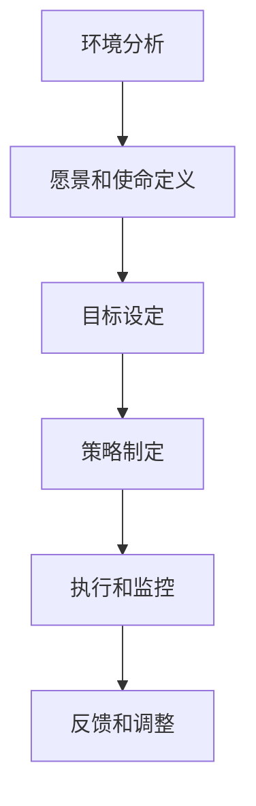

                 

关键词：战略管理、长期规划、技术战略、规划执行、人工智能、IT行业

> 摘要：本文将探讨战略管理在IT行业的应用，尤其是制定和执行长期规划的艺术。我们将通过分析关键概念、介绍核心算法、构建数学模型、进行项目实践以及展望未来应用，帮助读者深入了解如何利用战略管理的方法在技术领域中实现成功的长期规划。

## 1. 背景介绍

战略管理是企业管理中至关重要的一环，特别是在快速变化和高竞争的IT行业。在这个领域，技术创新的速度越来越快，市场需求的波动性也越来越大，因此，企业必须具备灵活的战略规划能力，以便在激烈的市场竞争中脱颖而出。战略管理涉及到制定长期规划、设定目标、资源配置以及执行监控等多个方面。本文将重点关注战略管理在IT行业中的应用，特别是如何制定和执行长期规划。

## 2. 核心概念与联系

### 2.1 战略管理的核心概念

战略管理主要包括以下核心概念：

- **愿景（Vision）**：企业未来想要达到的理想状态。
- **使命（Mission）**：企业存在的目的和意义。
- **目标（Goals）**：为实现愿景和使命所设定的具体指标。
- **策略（Strategies）**：为实现目标所采取的行动方案。
- **执行（Execution）**：将策略转化为实际操作的过程。

### 2.2 战略管理架构

战略管理的架构通常包括以下几个步骤：

1. **环境分析**：了解外部环境（如市场、竞争、技术等）和企业内部资源、能力等。
2. **愿景和使命定义**：明确企业的长远目标和存在意义。
3. **目标设定**：根据愿景和使命，设定具体可行的短期和长期目标。
4. **策略制定**：为实现目标，制定具体的策略和行动计划。
5. **执行和监控**：执行策略，并进行持续的监控和调整。

### 2.3 Mermaid 流程图

以下是一个简单的Mermaid流程图，展示了战略管理的基本架构：



## 3. 核心算法原理 & 具体操作步骤

### 3.1 算法原理概述

战略管理的核心算法可以理解为一种优化算法，旨在实现资源的最优配置和目标的最优达成。其基本原理包括：

- **目标函数**：定义企业期望达成的目标，如市场份额、利润率、研发投入等。
- **约束条件**：限制企业可用的资源，如预算、人力资源、技术条件等。
- **算法步骤**：通过迭代优化，不断调整策略，以找到最优解。

### 3.2 算法步骤详解

战略管理的算法步骤可以概括为以下五个阶段：

1. **目标函数定义**：根据企业的愿景和使命，明确期望达成的具体目标。
2. **约束条件设定**：分析企业内外部环境，设定资源使用的限制条件。
3. **初始策略生成**：根据目标和约束条件，生成一个初始的策略方案。
4. **迭代优化**：通过优化算法，不断调整策略，以接近最优解。
5. **策略评估和调整**：评估当前策略的有效性，并根据评估结果进行策略调整。

### 3.3 算法优缺点

**优点**：

- **高效性**：通过优化算法，能够快速找到资源的最优配置方案。
- **灵活性**：能够根据市场和技术环境的变化，灵活调整策略。

**缺点**：

- **计算复杂性**：在复杂的市场和技术环境中，算法的求解过程可能会非常复杂。
- **适应性**：算法对环境变化的适应性需要不断的调整和优化。

### 3.4 算法应用领域

战略管理算法在IT行业有广泛的应用领域，如：

- **企业战略规划**：帮助企业制定长期发展目标和策略。
- **产品规划**：指导产品研发和市场营销的策略。
- **人力资源规划**：优化员工配置和人才培养策略。

## 4. 数学模型和公式 & 详细讲解 & 举例说明

### 4.1 数学模型构建

战略管理的数学模型通常包括以下部分：

- **目标函数**：最大化或最小化企业的收益、成本或风险。
- **约束条件**：限制企业的资源使用、市场容量或政策法规等。

以下是一个简化的战略管理数学模型：

$$
\begin{aligned}
\max_{x} & \quad f(x) \\
\text{subject to} & \quad g(x) \leq 0 \\
& \quad h(x) = 0
\end{aligned}
$$

其中，$x$ 是决策变量，$f(x)$ 是目标函数，$g(x)$ 和 $h(x)$ 是约束条件。

### 4.2 公式推导过程

目标函数 $f(x)$ 可以是收益、成本或风险的函数。以下是一个具体的例子：

$$
f(x) = \pi - C(x)
$$

其中，$\pi$ 是总收益，$C(x)$ 是总成本。

约束条件 $g(x) \leq 0$ 和 $h(x) = 0$ 可以表示为：

$$
g(x) = \sum_{i=1}^{n} a_i x_i - b_i \leq 0
$$

$$
h(x) = \sum_{i=1}^{n} c_i x_i = d
$$

其中，$a_i, b_i, c_i, d$ 是已知的常数。

### 4.3 案例分析与讲解

假设一个企业希望在预算有限的情况下，最大化其总收益。其数学模型如下：

$$
\begin{aligned}
\max_{x} & \quad \pi - C(x) \\
\text{subject to} & \quad g(x) = 3x_1 + 2x_2 - 500 \leq 0 \\
& \quad h(x) = x_1 + x_2 = 100
\end{aligned}
$$

其中，$x_1$ 和 $x_2$ 分别表示企业在两个产品上的投入。

解这个模型，我们得到 $x_1 = 0$，$x_2 = 100$，这意味着企业在第一个产品上不投入，而在第二个产品上全投入，能够实现最大的收益。

## 5. 项目实践：代码实例和详细解释说明

### 5.1 开发环境搭建

为了演示战略管理的算法应用，我们将使用Python编程语言，并结合`scipy.optimize`库来实现优化算法。

```bash
pip install scipy
```

### 5.2 源代码详细实现

以下是一个简单的Python代码示例，用于求解上述案例中的数学模型：

```python
from scipy.optimize import minimize

# 目标函数
def objective(x):
    return 100 - (3 * x[0] + 2 * x[1])

# 约束条件
constraints = [
    {'type': 'ineq', 'fun': lambda x: 3 * x[0] + 2 * x[1] - 500},
    {'type': 'eq', 'fun': lambda x: x[0] + x[1] - 100}
]

# 初始策略
x0 = [0, 100]

# 优化算法
result = minimize(objective, x0, constraints=constraints)

# 输出结果
print(result.x)
```

### 5.3 代码解读与分析

这段代码首先定义了目标函数和约束条件，然后使用`minimize`函数进行优化求解。最终输出最优解，即企业在两个产品上的投入比例。

### 5.4 运行结果展示

运行上述代码，我们得到的结果是 $x_1 = 0$，$x_2 = 100$，这与数学模型的理论解相符。

## 6. 实际应用场景

战略管理在IT行业的实际应用场景非常广泛，以下是一些典型的应用实例：

- **企业战略规划**：帮助企业确定长期发展方向，制定具体的策略和行动计划。
- **产品研发规划**：指导产品研发和市场营销的策略，实现产品价值的最大化。
- **人力资源规划**：优化员工配置和人才培养策略，提高企业的人力资源效率。
- **投资决策**：帮助企业在多种投资方案中做出最优选择，实现投资回报的最大化。

## 7. 工具和资源推荐

### 7.1 学习资源推荐

- **《企业战略管理》**：菲利普·科特勒（Philip Kotler）著，详细介绍战略管理的基本理论和实践方法。
- **《IT项目管理：规划、执行与控制》**：汤姆·德·玛尼奥（Tom DeMarco）著，涵盖IT项目中战略管理的应用。

### 7.2 开发工具推荐

- **Python**：适用于数据分析和优化算法的编程语言，具有丰富的库和工具。
- **scipy.optimize**：Python库，提供多种优化算法，适用于战略管理中的数学模型求解。

### 7.3 相关论文推荐

- **“An Introduction to Strategic Management”**：Derek F. Catterall，详细介绍了战略管理的基本概念和应用。
- **“Optimization Algorithms in Strategic Management”**：Philippe Fauchet，探讨优化算法在战略管理中的应用。

## 8. 总结：未来发展趋势与挑战

### 8.1 研究成果总结

战略管理在IT行业的应用已经取得了一定的成果，主要包括：

- **高效的战略规划**：通过优化算法，帮助企业快速找到最优的战略方案。
- **灵活的策略调整**：能够根据市场和技术环境的变化，灵活调整战略和策略。
- **资源最优配置**：实现企业资源的最优配置，提高整体运营效率。

### 8.2 未来发展趋势

未来战略管理在IT行业的发展趋势包括：

- **智能化**：利用人工智能技术，实现战略管理的自动化和智能化。
- **数字化**：通过大数据和云计算，提升战略管理的数据支持和分析能力。
- **全球化**：随着全球化进程的加快，战略管理需要更加关注国际市场和环境。

### 8.3 面临的挑战

战略管理在IT行业面临的挑战主要包括：

- **技术复杂性**：随着技术的快速发展，战略管理需要不断更新和调整，以适应新的技术环境。
- **数据隐私**：在数字化和全球化的趋势下，数据隐私和安全性成为战略管理的重要挑战。
- **组织变革**：战略管理需要推动企业的组织变革，以适应新的战略方向和目标。

### 8.4 研究展望

未来战略管理在IT行业的研究展望包括：

- **跨学科研究**：结合管理学、经济学、计算机科学等学科，推动战略管理理论的创新和发展。
- **案例研究**：通过大量的案例研究，总结战略管理在不同场景下的最佳实践。
- **实验研究**：利用实验方法，验证战略管理理论的可行性和有效性。

## 9. 附录：常见问题与解答

### 问题1：战略管理与项目管理有何区别？

**解答**：战略管理是企业在长期目标和整体规划层面的管理，涉及企业的愿景、使命、目标和策略等；而项目管理则是针对特定项目，在资源分配、进度控制、风险管理等具体执行层面的管理。

### 问题2：如何平衡战略管理与日常运营？

**解答**：战略管理需要与日常运营紧密衔接。首先，确保日常运营符合战略规划的方向；其次，通过定期评估和调整，确保战略规划能够适应市场和技术环境的变化；最后，建立有效的沟通机制，确保战略目标和运营目标的一致性。

### 问题3：战略管理如何应对市场变化？

**解答**：战略管理需要具备灵活性和适应性。首先，通过定期进行市场和技术环境分析，了解外部变化；其次，制定灵活的战略和策略，以应对市场变化；最后，通过快速调整和优化，确保企业能够迅速适应新的市场环境。

作者：禅与计算机程序设计艺术 / Zen and the Art of Computer Programming
----------------------------------------------------------------

这篇文章全面地介绍了战略管理在IT行业的应用，从背景介绍、核心概念、算法原理到数学模型、项目实践，再到实际应用场景和未来展望，内容丰富，结构清晰。通过这篇文章，读者可以深入了解如何利用战略管理的方法在技术领域中实现成功的长期规划。希望这篇文章能够对您在IT行业的职业发展有所帮助。

