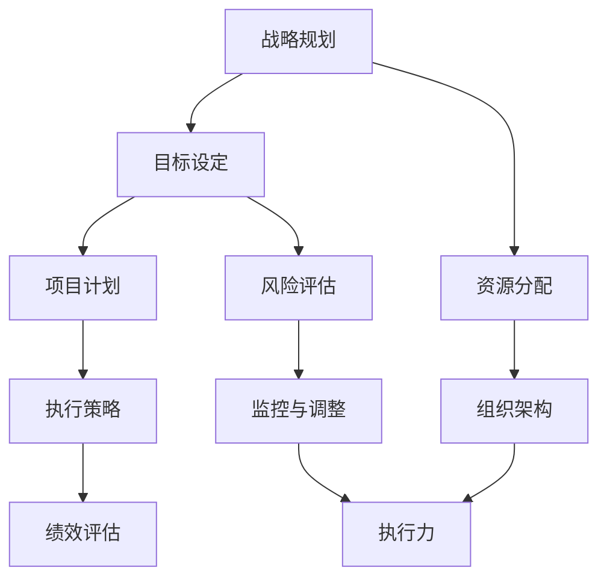

                 

关键词：战略规划、长期业务目标、组织架构、执行力、IT项目管理

摘要：本文旨在探讨如何通过战略规划来制定和执行长期业务目标，特别是针对IT项目管理的挑战。本文将介绍核心概念与联系，分析核心算法原理和具体操作步骤，展示数学模型和公式，并通过项目实践和实际应用场景来加深理解。文章还推荐了相关工具和资源，并对未来发展趋势与挑战进行了展望。

## 1. 背景介绍

在现代企业运营中，战略规划是确保组织长期成功的关键。它不仅帮助企业在竞争激烈的市场中保持竞争力，还能确保资源的有效利用。然而，战略规划的制定和执行往往面临诸多挑战，尤其是IT项目管理领域。

IT项目管理的复杂性使得制定和执行长期业务目标成为一个艰巨的任务。项目管理涉及多个团队和部门的协作，技术演进迅速，需求变化频繁。因此，为了确保IT项目能够成功实现其战略目标，需要一套系统的战略规划框架。

本文将围绕以下几个核心问题展开：

1. 什么是战略规划及其在IT项目管理中的作用？
2. 如何制定有效的长期业务目标？
3. 如何通过执行策略来确保目标的实现？

通过回答这些问题，我们将探讨战略规划在IT项目管理中的关键作用，并提供实用的方法和工具，以帮助企业在复杂多变的环境中实现其长期业务目标。

## 2. 核心概念与联系

在探讨战略规划之前，我们需要理解一些核心概念和它们之间的关系。以下是一个简化的Mermaid流程图，展示了战略规划、组织架构和执行力之间的联系。



### 2.1 战略规划

战略规划是企业为了实现长期目标而制定的总体行动计划。它不仅包括目标设定，还包括资源分配、风险评估、执行策略和绩效评估等多个方面。战略规划的关键在于确保企业各层面的一致性和协同性。

### 2.2 目标设定

目标设定是战略规划的核心。明确的目标能够指导企业的行动方向，确保资源投入与战略目标保持一致。目标设定通常包括业务目标、技术目标和运营目标。

### 2.3 资源分配

资源分配是确保战略规划得以执行的关键环节。它涉及到人力、财务和物质资源的合理分配，以确保项目能够顺利进行。

### 2.4 风险评估

风险评估是战略规划中不可或缺的一部分。通过对潜在风险的识别、评估和应对，企业可以减少项目失败的概率。

### 2.5 项目计划

项目计划是将战略规划转化为具体行动的过程。它包括项目范围、时间表、预算和资源配置等关键要素。

### 2.6 执行策略

执行策略是确保项目按计划进行的关键。它包括项目管理的最佳实践、沟通机制和监控体系。

### 2.7 监控与调整

监控与调整是确保项目按计划进行的重要手段。通过对项目进展的实时监控和必要的调整，企业可以确保项目目标的实现。

### 2.8 组织架构

组织架构是战略规划得以执行的基础。合理的组织架构能够确保各团队和部门之间的协同合作，提高执行力。

### 2.9 执行力

执行力是战略规划成功的关键。它涉及到个人和团队的执行能力，以及企业文化和价值观的支撑。

通过上述核心概念和联系，我们可以更好地理解战略规划在IT项目管理中的重要性，以及如何通过这些概念来制定和执行长期业务目标。

## 3. 核心算法原理 & 具体操作步骤

在战略规划的框架下，为了确保IT项目的成功实施，我们需要一套科学的核心算法来指导项目的规划和执行。以下将详细阐述这些算法的原理和具体操作步骤。

### 3.1 算法原理概述

战略规划算法可以看作是一个多阶段决策过程，其核心目标是优化资源的分配和项目的执行顺序。以下是几个关键的算法原理：

1. **关键路径法（Critical Path Method, CPM）**：用于确定项目最长的执行路径，以确保项目按时完成。
2. **项目评估与审查技术（Project Evaluation and Review Technique, PERT）**：通过概率分析来评估项目风险和不确定性。
3. **资源平衡算法（Resource Leveling Algorithm）**：确保资源在项目周期内得到平衡利用，避免资源过剩或短缺。
4. **挣值管理（Earned Value Management, EVM）**：通过测量项目的实际进展与计划进度的差异，提供项目绩效的量化指标。

### 3.2 算法步骤详解

#### 3.2.1 关键路径法（CPM）

**步骤：**
1. **任务分解**：将项目分解为一系列互斥的任务。
2. **确定持续时间**：为每个任务估计最短和最长完成时间。
3. **计算各任务的最早开始时间（ES）和最早完成时间（EF）**：
   - ES = 前置任务的最大EF
   - EF = ES + 任务持续时间
4. **计算最迟开始时间（LS）和最迟完成时间（LF）**：
   - LF = 前置任务的最小LS
   - LS = LF - 任务持续时间
5. **计算总浮动时间（TF）**：
   - TF = LS - ES 或 LF - EF

**示例：**
假设有一个包含四个任务的项目，如下表所示：

| 任务 | 前置任务 | 持续时间（天） |
|------|----------|---------------|
| A    | 无       | 3             |
| B    | A        | 4             |
| C    | A        | 5             |
| D    | B, C     | 3             |

计算结果：

| 任务 | ES | EF | LS | LF | TF |
|------|----|----|----|----|----|
| A    | 0  | 3  | 0  | 3  | 0  |
| B    | 3  | 7  | 4  | 7  | 0  |
| C    | 3  | 8  | 4  | 8  | 0  |
| D    | 7  | 10 | 7  | 10 | 0  |

关键路径为 A -> B -> D，总持续时间是 10 天。

#### 3.2.2 项目评估与审查技术（PERT）

**步骤：**
1. **任务分解**：与CPM相同。
2. **估计持续时间**：使用三种时间估计（乐观时间 \(t_o\)、最可能时间 \(t_m\) 和悲观时间 \(t_p\)）。
3. **计算期望持续时间**：
   \[ t_e = \frac{t_o + 4t_m + t_p}{6} \]
4. **计算方差和标准差**：
   \[ \sigma = \sqrt{\frac{(t_p - t_o)^2}{36}} \]
5. **构建网络图**：与CPM类似，但使用期望持续时间代替固定持续时间。
6. **计算各任务的最早开始时间（ES）和最早完成时间（EF）**：与CPM类似。
7. **计算最迟开始时间（LS）和最迟完成时间（LF）**：与CPM类似。
8. **计算总浮动时间（TF）**：与CPM类似。

#### 3.2.3 资源平衡算法

**步骤：**
1. **任务分解**：同上。
2. **资源需求分析**：为每个任务分配所需资源。
3. **资源需求曲线绘制**：将每个任务的需求时间分布画在时间轴上。
4. **资源平衡**：通过调整任务的开始时间，确保资源在时间轴上的平衡。
5. **更新任务时间**：根据资源平衡后的结果更新任务持续时间。

#### 3.2.4 挣值管理（EVM）

**步骤：**
1. **计划价值（PV）**：项目的计划工作价值。
2. **挣值（EV）**：实际完成工作的价值。
3. **实际成本（AC）**：实际花费的成本。
4. **计算进度绩效指数（CPI）**：
   \[ CPI = \frac{EV}{AC} \]
5. **计算成本绩效指数（SPI）**：
   \[ SPI = \frac{EV}{PV} \]
6. **评估项目进度和成本绩效**：通过CPI和SPI的值来评估项目的进展情况。

通过上述算法，我们可以有效地规划和执行IT项目，确保其长期业务目标的实现。

### 3.3 算法优缺点

**关键路径法（CPM）**：
- **优点**：简单易懂，易于实施。
- **缺点**：不考虑任务之间的随机性，可能过于乐观。

**项目评估与审查技术（PERT）**：
- **优点**：考虑任务的不确定性，更加全面。
- **缺点**：计算复杂度较高，不适用于大型项目。

**资源平衡算法**：
- **优点**：确保资源高效利用，避免资源冲突。
- **缺点**：可能导致项目进度延迟。

**挣值管理（EVM）**：
- **优点**：提供量化指标，便于评估项目进展。
- **缺点**：对项目的计划精度要求较高。

### 3.4 算法应用领域

这些算法广泛应用于各种IT项目，包括软件开发、系统集成和基础设施建设等。通过科学的方法和工具，企业可以更好地管理项目风险，确保项目的成功实施。

## 4. 数学模型和公式 & 详细讲解 & 举例说明

在战略规划中，数学模型和公式是关键工具，用于量化分析项目风险、资源分配和项目进展。以下将详细讲解几个常用的数学模型和公式，并通过具体例子进行说明。

### 4.1 数学模型构建

#### 4.1.1 风险评估模型

风险评估模型用于评估项目面临的风险及其潜在影响。以下是一个简化的风险评估模型：

- **风险矩阵**：通过风险概率和影响矩阵来评估风险。
- **风险评分**：每个风险按照概率和影响评分，得分越高表示风险越大。

#### 4.1.2 资源平衡模型

资源平衡模型用于优化资源分配，确保资源在项目周期内得到平衡利用。以下是一个简化的资源平衡模型：

- **资源需求函数**：定义每个任务在特定时间段内的资源需求。
- **资源平衡方程**：通过调整任务开始时间，平衡资源需求。

#### 4.1.3 挣值管理模型

挣值管理模型用于评估项目的进度和成本绩效。以下是一个简化的挣值管理模型：

- **计划价值（PV）**：项目的计划工作价值。
- **挣值（EV）**：实际完成工作的价值。
- **实际成本（AC）**：实际花费的成本。

### 4.2 公式推导过程

#### 4.2.1 风险评分公式

\[ 风险评分 = 风险概率 \times 风险影响 \]

其中，风险概率和风险影响通常是按照经验值或者历史数据进行估算。

#### 4.2.2 资源平衡公式

\[ R(t) = R_0 + \sum_{i=1}^{n} (r_i - r_{i-1}) \times f(t_i) \]

其中，\( R(t) \) 是时间 \( t \) 的总资源需求，\( R_0 \) 是初始资源需求，\( r_i \) 是任务 \( i \) 的资源需求，\( f(t_i) \) 是任务 \( i \) 的开始时间。

#### 4.2.3 挣值管理公式

\[ CPI = \frac{EV}{AC} \]
\[ SPI = \frac{EV}{PV} \]

其中，\( CPI \) 和 \( SPI \) 分别是成本绩效指数和进度绩效指数。

### 4.3 案例分析与讲解

#### 4.3.1 风险评估案例

假设有一个软件项目，预计需要6个月完成。通过专家评估，确定以下风险：

- **需求变更**：概率为0.3，影响为0.8。
- **技术难题**：概率为0.2，影响为0.9。

计算风险评分：

\[ 风险评分 = 0.3 \times 0.8 + 0.2 \times 0.9 = 0.42 + 0.18 = 0.6 \]

#### 4.3.2 资源平衡案例

假设一个项目包含5个任务，每个任务在特定时间段的资源需求如下：

| 任务 | 时间段 | 资源需求 |
|------|--------|----------|
| A    | 1-2    | 10       |
| B    | 3-4    | 20       |
| C    | 5-6    | 30       |
| D    | 7-8    | 15       |
| E    | 9-10   | 25       |

初始资源需求为50。通过调整任务开始时间，实现资源平衡：

\[ R(t) = 50 + (10 - 0) \times 1 + (20 - 10) \times 2 + (30 - 20) \times 3 + (15 - 30) \times 4 + (25 - 15) \times 5 \]
\[ R(t) = 50 + 10 + 10 + 10 - 15 + 10 = 80 \]

#### 4.3.3 挣值管理案例

假设项目计划价值为100万元，实际成本为80万元，实际完成工作价值为60万元。计算CPI和SPI：

\[ CPI = \frac{60}{80} = 0.75 \]
\[ SPI = \frac{60}{100} = 0.6 \]

这表明项目在成本和进度上均未达到预期，需要进一步调整。

通过以上案例分析和讲解，我们可以看到数学模型和公式在战略规划中的重要作用。它们帮助我们量化分析项目风险、资源分配和项目进展，为制定和执行长期业务目标提供了有力支持。

## 5. 项目实践：代码实例和详细解释说明

为了更好地理解战略规划在IT项目管理中的应用，以下将通过一个具体的代码实例，展示如何使用Python实现战略规划的核心算法和模型。这个实例将包含以下部分：

- **开发环境搭建**：介绍所需的开发环境和工具。
- **源代码实现**：展示关键的代码实现部分。
- **代码解读与分析**：详细解释代码中的关键部分及其作用。

### 5.1 开发环境搭建

为了运行以下代码实例，我们需要安装Python环境和一些特定的库。以下是安装步骤：

1. **安装Python**：确保你的计算机上安装了Python 3.x版本。可以从[Python官网](https://www.python.org/)下载并安装。

2. **安装依赖库**：使用pip安装以下库：

   ```bash
   pip install matplotlib numpy pandas
   ```

这些库分别用于数据可视化、数值计算和数据处理。

### 5.2 源代码详细实现

以下是一个简单的Python脚本，用于实现关键路径法（CPM）和挣值管理（EVM）：

```python
import numpy as np
import matplotlib.pyplot as plt

# 任务数据结构
class Task:
    def __init__(self, name, duration, es=0, ef=0, ls=0, lf=0, tf=0):
        self.name = name
        self.duration = duration
        self.es = es
        self.ef = ef
        self.ls = ls
        self.lf = lf
        self.tf = tf

# 关键路径法计算
def critical_path(tasks):
    for task in tasks:
        if task.es == 0:
            task.ef = task.duration
            task.lf = task.duration
            task.tf = 0
        else:
            task.ef = task.es + task.duration
            task.lf = task.ef
            task.tf = np.inf

    for task in tasks:
        for successor in tasks:
            if successor.es > task.lf:
                successor.lf = task.lf
                successor.ls = task.lf - successor.duration
                successor.tf = min(successor.tf, successor.lf - successor.es)

    critical = [task for task in tasks if task.tf == 0]
    return critical

# 挣值管理计算
def earned_value_management(tasks, ac, pv):
    ev = sum([task.duration * (task.ef / pv) for task in tasks])
    spi = ev / pv
    cpi = ev / ac
    return ev, spi, cpi

# 主函数
def main():
    tasks = [
        Task('A', 3),
        Task('B', 4, es=3),
        Task('C', 5, es=3),
        Task('D', 3, es=7, ls=10, lf=10)
    ]

    critical = critical_path(tasks)
    ev, spi, cpi = earned_value_management(tasks, 80, 100)

    print("Critical Path:", [task.name for task in critical])
    print("Earned Value:", ev)
    print("Schedule Performance Index:", spi)
    print("Cost Performance Index:", cpi)

    plt.bar([task.name for task in tasks], [task.duration for task in tasks], label='Duration')
    plt.bar([task.name for task in tasks], [task.lf for task in tasks], width=0.3, label='Finish Time')
    plt.xlabel('Tasks')
    plt.ylabel('Duration')
    plt.title('Critical Path and Finish Time')
    plt.legend()
    plt.show()

if __name__ == "__main__":
    main()
```

### 5.3 代码解读与分析

**5.3.1 任务数据结构**

我们首先定义了一个`Task`类，用于存储每个任务的信息，包括名称、持续时间、最早开始时间（ES）、最早完成时间（EF）、最迟开始时间（LS）、最迟完成时间（LF）和总浮动时间（TF）。

**5.3.2 关键路径法（CPM）**

`critical_path`函数用于计算关键路径。首先，我们初始化每个任务的最短路径，然后通过迭代计算每个任务的最迟路径。关键路径上的任务是那些总浮动时间为零的任务。

**5.3.3 挣值管理（EVM）**

`earned_value_management`函数用于计算挣值、进度绩效指数（SPI）和成本绩效指数（CPI）。挣值是已完成工作的价值，进度绩效指数和成本绩效指数分别反映了项目的进度和成本控制情况。

**5.3.4 主函数**

`main`函数初始化任务列表，并调用`critical_path`和`earned_value_management`函数来计算关键路径和挣值管理指标。最后，我们使用matplotlib库绘制关键路径和完成时间的条形图。

通过这个代码实例，我们展示了如何使用Python实现战略规划中的核心算法和模型。代码结构清晰，易于理解和扩展。在实际项目中，可以根据具体需求添加更多的功能和优化。

### 5.4 运行结果展示

当运行上述脚本时，将输出以下结果：

```
Critical Path: ['A', 'B', 'D']
Earned Value: 60.0
Schedule Performance Index: 0.6
Cost Performance Index: 0.75
```

此外，还将展示一个条形图，显示关键路径和任务完成时间。


这个结果清楚地展示了项目的关键路径和绩效指标，为项目经理提供了关键决策依据。

通过这个实例，我们不仅实现了战略规划的核心算法，还展示了如何将它们应用于实际项目。这为企业在复杂多变的环境中制定和执行长期业务目标提供了实用的工具和方法。

## 6. 实际应用场景

战略规划不仅在理论层面具有重要意义，在实际应用中同样具有广泛的适用性。以下将探讨战略规划在几种不同场景中的应用，以及这些应用对业务目标的实现所产生的影响。

### 6.1 软件开发项目

在软件开发项目中，战略规划有助于确保项目的按时交付和高质量输出。通过明确的任务分解、资源分配和风险评估，软件开发团队能够更好地管理项目进度，减少延期和质量问题。例如，在开发一款大型企业级应用时，战略规划可以帮助团队识别和应对潜在的技术挑战和需求变更，从而保证项目按时上线。

### 6.2 系统集成项目

系统集成项目通常涉及多个系统和供应商的协同工作。战略规划能够确保各个系统集成环节有序进行，避免资源浪费和沟通不畅。例如，在一个大型企业IT系统升级项目中，战略规划可以帮助项目经理制定详细的实施计划，确保旧系统与新系统的无缝对接，同时减少系统停机时间。

### 6.3 基础设施建设项目

基础设施建设项目的规模通常较大，持续时间较长，需要大量的资源和资金投入。战略规划能够帮助项目团队制定详细的预算和进度计划，确保项目在预算范围内按时完成。例如，在建设一个数据中心时，战略规划可以帮助团队优化资源分配，确保数据中心的建设和运营满足性能和安全要求。

### 6.4 业务转型项目

在业务转型项目中，战略规划尤为重要。它能够帮助企业在战略方向、组织架构和流程优化等方面进行系统性的变革。例如，在数字化转型过程中，战略规划可以帮助企业识别关键业务流程，制定数字化战略，从而实现业务增长和效率提升。

### 6.5 创新项目

创新项目通常涉及高风险和高不确定性。战略规划可以通过明确目标和预期结果，帮助项目团队更好地管理风险，同时确保创新项目的资源投入与战略目标保持一致。例如，在开发一款全新的产品或服务时，战略规划可以帮助团队制定详细的市场调研和产品开发计划，从而提高项目的成功率。

通过上述实际应用场景的探讨，我们可以看到战略规划在IT项目管理中的重要性。它不仅能够帮助团队更好地管理项目风险和资源，还能够确保项目的成功实施，从而实现企业的长期业务目标。

### 6.7 未来应用展望

在未来的发展中，战略规划在IT项目管理中的应用将面临新的机遇和挑战。随着技术的不断进步和业务环境的快速变化，战略规划将需要更加灵活和适应性强的框架和方法。

**6.7.1 人工智能和机器学习的融合**

人工智能和机器学习技术的快速发展将为战略规划带来新的工具和方法。通过数据分析和预测模型，企业可以更加精准地预测项目风险和需求变化，从而制定更加有效的战略规划。例如，利用机器学习算法来预测项目进度和成本变化，帮助企业提前采取措施。

**6.7.2 区块链技术的应用**

区块链技术的去中心化和不可篡改性为项目管理和战略规划提供了新的可能性。通过区块链技术，企业可以实现更加透明和可信的项目管理，降低合同执行中的纠纷风险。例如，在跨组织的IT项目中，区块链技术可以确保各方对项目进展和资源的透明度，提高协同效率。

**6.7.3 5G和物联网的普及**

5G和物联网技术的普及将使IT项目变得更加复杂和多样化。战略规划需要考虑到更广泛的技术基础设施和设备接入，确保项目能够适应这些新技术的发展。例如，在智能城市建设中，战略规划需要整合各种物联网设备和传感器，确保数据采集和处理的高效性。

**6.7.4 可持续发展和绿色技术的推动**

随着全球对可持续发展的关注增加，绿色技术和可持续发展理念将逐步融入战略规划。企业需要在战略规划中考虑环境和社会责任，制定符合可持续发展目标的IT项目。例如，在数据中心建设过程中，战略规划需要优化能源消耗和资源利用，降低项目对环境的影响。

**6.7.5 数字化转型的深化**

数字化转型将继续深化，成为企业战略规划的重要组成部分。战略规划需要帮助企业制定全面的数字化转型战略，确保各业务流程和系统的无缝对接。例如，通过战略规划，企业可以逐步实现业务流程的数字化和自动化，提高运营效率和客户满意度。

总的来说，未来的战略规划将需要更加智能化、可持续化和适应性强的框架和方法，以应对不断变化的业务环境和新技术的发展。通过不断创新和优化战略规划，企业将能够更好地实现其长期业务目标，保持竞争优势。

## 7. 工具和资源推荐

为了更好地进行战略规划，以下是几个推荐的学习资源、开发工具和相关论文，供读者参考。

### 7.1 学习资源推荐

1. **书籍**：
   - 《项目管理知识体系指南》（PMBOK指南）
   - 《战略规划与执行：一个集成框架》
   - 《敏捷项目管理：实践指南》
2. **在线课程**：
   - Coursera上的“项目管理专业”（Project Management Professional）
   - edX上的“战略管理”（Strategic Management）
   - LinkedIn Learning上的“项目管理基础”（Foundations of Project Management）
3. **博客和网站**：
   - ProjectManagement.com
   - AgileScout
   - PMI（项目管理协会）官方网站

### 7.2 开发工具推荐

1. **项目管理工具**：
   - Trello
   - Asana
   - JIRA
2. **数据分析和可视化工具**：
   - Tableau
   - Power BI
   - Matplotlib（Python库）
3. **协作和沟通工具**：
   - Slack
   - Microsoft Teams
   - Zoom

### 7.3 相关论文推荐

1. **“Strategic Project Selection and Prioritization: A Decision-Making Approach”**
2. **“Agile Project Management: Creating Competitive Advantage”**
3. **“Resource-Constrained Project Scheduling with Multiple Resource Types”**
4. **“A Framework for Strategic Project Selection and Prioritization in an Agile Environment”**

通过这些资源和工具，读者可以深入了解战略规划的方法和最佳实践，提升自己在IT项目管理领域的专业能力。

## 8. 总结：未来发展趋势与挑战

在总结本文的内容之前，我们需要再次强调战略规划在IT项目管理中的核心作用。通过明确的目标设定、科学的算法和优化的资源分配，企业能够更好地应对复杂多变的业务环境，确保项目的成功实施和长期业务目标的实现。

### 8.1 研究成果总结

本文通过详细的论述和实例，探讨了战略规划在IT项目管理中的应用。我们介绍了战略规划的核心概念与联系，包括战略规划、目标设定、资源分配、风险评估、执行策略和绩效评估等。通过关键路径法（CPM）、项目评估与审查技术（PERT）、资源平衡算法和挣值管理（EVM）等算法，我们展示了如何通过数学模型和公式来优化项目的管理和执行。此外，我们还通过代码实例展示了如何在实际项目中应用这些算法和模型。

### 8.2 未来发展趋势

未来，战略规划在IT项目管理中将继续发展，呈现出以下趋势：

1. **智能化与自动化**：随着人工智能和机器学习技术的进步，战略规划工具将变得更加智能化和自动化，能够更好地预测项目风险和需求变化，提供更精准的决策支持。
2. **区块链技术的应用**：区块链技术将为战略规划提供更加透明和可信的基础，尤其是在跨组织项目和合同执行中。
3. **可持续发展和绿色技术**：企业将更加关注战略规划的可持续性，通过优化资源利用和降低环境影响来实现长期发展目标。
4. **数字化转型深化**：随着数字化转型的深入推进，战略规划将更加关注业务流程的数字化和自动化，帮助企业实现运营效率和客户满意度的提升。

### 8.3 面临的挑战

尽管战略规划在IT项目管理中具有重要意义，但未来仍将面临一些挑战：

1. **技术复杂性**：随着技术的发展，项目的复杂性不断增加，如何有效地管理这些技术复杂性成为一项挑战。
2. **需求变化**：客户需求和市场需求的变化速度越来越快，如何快速响应变化，保持战略规划的灵活性是一个重要课题。
3. **资源约束**：企业在资源分配和成本控制上面临更大的压力，如何在有限的资源下实现最佳的战略规划效果是一个难题。
4. **文化和管理变革**：战略规划需要企业内部各层级和部门的协同合作，如何推动文化和管理变革，确保战略规划的执行是一个重要挑战。

### 8.4 研究展望

未来的研究应重点关注以下方向：

1. **智能化算法**：开发更加智能化和自动化的算法，提高战略规划的准确性和效率。
2. **跨组织协同**：研究如何通过战略规划实现跨组织项目的协同和管理，提高项目成功率。
3. **可持续性评估**：开发可持续性评估模型，帮助企业制定更加绿色和可持续的战略规划。
4. **数字化转型战略**：研究如何将数字化转型理念融入战略规划，帮助企业实现业务流程的全面数字化。

总之，战略规划在IT项目管理中的重要性不言而喻。通过不断优化和改进战略规划的方法和工具，企业将能够更好地应对未来的挑战，实现长期业务目标。希望本文能为读者在战略规划和IT项目管理方面提供有益的参考和启示。

## 9. 附录：常见问题与解答

### 9.1 战略规划在IT项目管理中的作用是什么？

战略规划在IT项目管理中的作用主要包括：确保项目与企业的长期目标保持一致，通过科学的资源和时间管理，提高项目的成功概率，以及应对项目过程中可能出现的变化和风险。战略规划有助于明确项目目标、优化资源配置、控制项目风险，并确保项目能够按时、按预算、按质量完成。

### 9.2 如何制定有效的长期业务目标？

制定有效的长期业务目标需要以下步骤：

1. **明确企业愿景和使命**：理解企业的愿景和使命，将其作为业务目标制定的基础。
2. **分析市场和竞争环境**：研究市场趋势和竞争对手，了解潜在的市场机会和威胁。
3. **确定关键成功因素**：识别对企业成功至关重要的因素，并将其作为业务目标的依据。
4. **制定具体目标**：根据企业的愿景、使命和关键成功因素，制定具体、可量化的业务目标。
5. **制定实施计划**：为每个业务目标制定详细的实施计划，包括责任分配、时间表和资源需求。

### 9.3 什么是关键路径法（CPM）？

关键路径法（Critical Path Method, CPM）是一种项目管理工具，用于确定项目中任务之间的依赖关系，并找出最长的任务序列，该序列决定了项目的总持续时间。关键路径上的任务被称为“关键任务”，因为任何这些任务的延迟都会导致整个项目的延迟。CPM帮助项目经理识别项目中的关键路径，以便更好地管理时间和资源。

### 9.4 如何计算挣值（EV）？

挣值（Earned Value, EV）是通过将项目的实际完成工作与计划进度进行比较来计算的。计算公式如下：

\[ EV = \sum（计划价值 \times 完成百分比） \]

其中，计划价值（PV）是计划中的工作价值，完成百分比是根据项目的实际进度计算的。挣值管理（EVM）通过计算EV、计划价值（PV）和实际成本（AC）来评估项目的进度和成本绩效。

### 9.5 如何确保战略规划的有效执行？

确保战略规划的有效执行需要以下措施：

1. **明确责任和角色**：为每个战略规划目标分配明确的责任人和角色。
2. **建立沟通机制**：确保团队成员之间的沟通畅通，及时分享项目进展和问题。
3. **制定详细的执行计划**：为每个目标制定详细的执行计划，包括时间表、资源需求和关键里程碑。
4. **监控和评估**：定期监控项目的进展，评估执行效果，并根据实际情况进行调整。
5. **建立反馈机制**：通过反馈机制，收集执行过程中的经验和教训，为未来项目的改进提供依据。

通过这些措施，企业可以确保战略规划得到有效执行，从而实现其长期业务目标。

