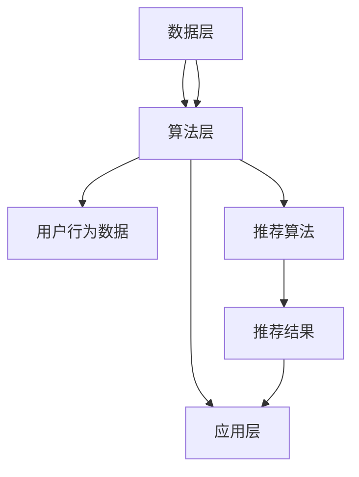
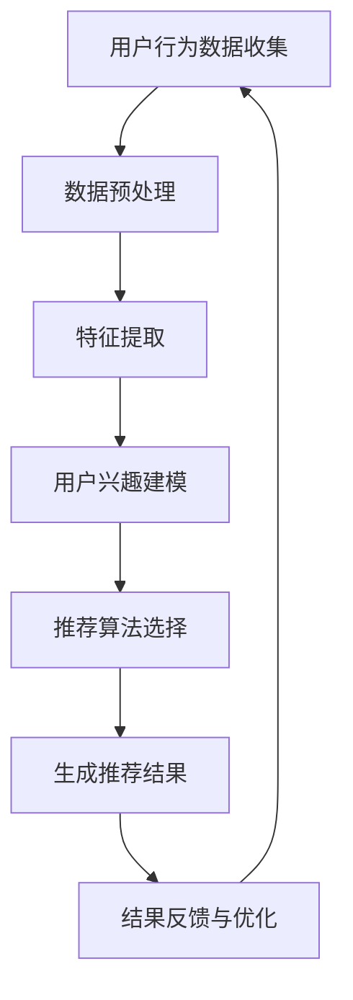

                 

摘要：随着互联网的普及和大数据技术的发展，人们获取信息的方式发生了巨大的变化。然而，这也带来了一些问题，例如信息过载和内容分发的公平性。本文旨在探讨如何利用人工智能技术，特别是多元推荐系统，来打破信息茧房，为用户提供更加丰富和多样化的信息内容。通过介绍推荐系统的基本原理、核心算法、数学模型以及实际应用案例，本文提出了对未来信息推荐系统发展的展望，并讨论了相关挑战。

## 1. 背景介绍

在过去的几十年里，互联网和通信技术的迅猛发展，使得人们的生活方式和信息获取方式发生了翻天覆地的变化。然而，这种变化并非完全是积极的。尽管互联网为人们提供了大量的信息和资源，但同时也带来了信息过载的问题。人们不得不面对海量的信息，难以筛选出对自己真正有价值的内容。此外，一些社交媒体平台和搜索引擎等推荐系统，往往会使用户陷入“信息茧房”中，无法接触到其他观点和内容。

信息茧房是指用户由于长期在特定环境中接触类似的信息，导致对其他观点和信息的接收和接触受到限制，从而形成一种封闭的信息环境。这种现象不仅限制了用户的视野，也可能导致思维僵化和偏见。因此，如何打破信息茧房，提供更多样化和丰富的信息内容，成为了一个重要的研究课题。

随着人工智能技术的不断进步，推荐系统作为人工智能的一个重要分支，已经成为解决信息过载和提供个性化内容的有效手段。推荐系统通过分析用户的兴趣和行为，向用户推荐符合其兴趣的内容。然而，传统的推荐系统往往存在一些问题，例如推荐结果的多样性不足、用户隐私泄露等。为了解决这些问题，多元推荐系统应运而生。

多元推荐系统旨在提供更加多样化和个性化的推荐结果，打破信息茧房，为用户提供更加丰富和多样化的信息内容。本文将详细介绍多元推荐系统的基本原理、核心算法、数学模型以及实际应用案例，并对未来推荐系统的发展进行展望。

## 2. 核心概念与联系

在探讨多元推荐系统之前，我们首先需要了解一些核心概念，包括用户行为、推荐系统架构、推荐算法等。

### 2.1 用户行为

用户行为是推荐系统的重要数据来源。用户行为包括浏览历史、点击行为、搜索历史、购买记录等。通过对这些行为数据的分析，推荐系统可以了解用户的兴趣偏好，从而提供个性化的推荐结果。以下是用户行为的一些示例：

- **浏览历史**：用户在网站上的浏览记录，包括访问的页面、停留时间等。
- **点击行为**：用户在网站上的点击操作，包括广告、搜索结果等。
- **搜索历史**：用户在搜索引擎中输入的关键词。
- **购买记录**：用户在电商平台上购买的商品。

### 2.2 推荐系统架构

推荐系统通常由数据层、算法层和应用层组成。数据层负责收集和存储用户行为数据，算法层负责分析数据并生成推荐结果，应用层负责将推荐结果呈现给用户。

- **数据层**：数据层是推荐系统的基石，负责收集和存储用户行为数据。这些数据可以来自网站内部，如浏览历史、点击行为等，也可以来自第三方数据源，如社交媒体、搜索引擎等。
- **算法层**：算法层是推荐系统的核心，负责分析用户行为数据，并根据分析结果生成推荐结果。常见的推荐算法包括基于内容的推荐、基于协同过滤的推荐等。
- **应用层**：应用层负责将推荐结果呈现给用户。这部分通常包括网页、APP等用户界面。

### 2.3 推荐算法

推荐算法是推荐系统的核心。推荐算法可以分为两类：基于内容的推荐和基于协同过滤的推荐。

- **基于内容的推荐**：基于内容的推荐算法通过分析用户的历史行为和内容特征，找出用户可能感兴趣的内容进行推荐。这种算法的优点是推荐结果相关性强，但缺点是推荐结果的多样性不足。
- **基于协同过滤的推荐**：基于协同过滤的推荐算法通过分析用户之间的行为模式，找出相似的用户，并根据相似用户的偏好进行推荐。这种算法的优点是推荐结果的多样性高，但缺点是计算复杂度高。

除了上述两类推荐算法，多元推荐系统还涉及一些其他技术，如深度学习、图神经网络等。这些技术可以帮助推荐系统更好地理解用户行为，提供更加个性化、多样化的推荐结果。

### 2.4 Mermaid 流程图

以下是一个简单的 Mermaid 流程图，展示了多元推荐系统的基本架构和核心环节：



### 2.5 核心概念原理和架构的 Mermaid 流程图



### 2.6 多元推荐系统的核心概念原理与架构流程

多元推荐系统的核心在于如何同时考虑用户兴趣的多样性和内容的丰富性，从而提供多样化的推荐结果。以下是多元推荐系统的核心概念原理与架构流程的详细描述：

1. **用户兴趣建模**：多元推荐系统首先需要建立一个用户兴趣模型，用于捕捉用户的多种兴趣点。这通常涉及到对用户行为数据（如浏览历史、点击行为、搜索记录等）的深入分析。通过机器学习算法，如聚类、协同过滤、深度学习等，可以将用户的多种行为转化为相应的兴趣点。

2. **内容多样性增强**：为了打破信息茧房，多元推荐系统需要确保推荐内容具有多样性。这可以通过以下几种方式实现：
   - **基于内容扩展**：推荐系统不仅考虑用户的当前兴趣，还通过内容相似性扩展用户的兴趣范围。
   - **基于上下文信息**：推荐系统根据用户的当前上下文信息（如时间、地点、设备类型等）调整推荐内容。
   - **混合推荐策略**：结合多种推荐算法（如基于内容、协同过滤、深度学习等）来提供多样化的推荐。

3. **动态调整与优化**：多元推荐系统需要能够根据用户的实时反馈和偏好动态调整推荐策略。这通常涉及在线学习机制，如强化学习、在线优化等，以持续提高推荐效果。

4. **隐私保护**：在多元推荐系统中，隐私保护是一个重要考虑因素。为了确保用户的隐私不受侵犯，推荐系统需要采用多种隐私保护技术，如差分隐私、匿名化处理等。

5. **评估与反馈**：多元推荐系统的性能需要通过多种指标进行评估，如推荐准确率、多样性、覆盖率等。用户的反馈也是系统优化的重要依据。

### 2.7 多元推荐系统的架构

多元推荐系统的架构通常包括以下关键组件：

- **数据层**：负责收集、存储和管理用户行为数据、内容数据等。
- **预处理层**：对原始数据进行清洗、去噪、归一化等预处理操作，以便后续分析。
- **特征层**：提取用户行为数据中的有用特征，如用户兴趣点、内容特征等。
- **算法层**：选择并实现多种推荐算法，如基于内容的推荐、协同过滤、深度学习等。
- **推荐层**：生成推荐结果，并根据用户反馈进行动态调整。
- **应用层**：将推荐结果呈现给用户，并收集用户的反馈。

通过上述架构，多元推荐系统可以更好地理解和满足用户的需求，提供多样化和个性化的推荐服务。

## 3. 核心算法原理 & 具体操作步骤

### 3.1 算法原理概述

多元推荐系统的核心在于如何同时捕捉用户的多样兴趣和推荐内容的多样性。以下将详细介绍几种常见多元推荐算法的原理和具体操作步骤。

#### 3.1.1 基于内容的推荐（Content-Based Recommendation）

基于内容的推荐算法通过分析用户的历史行为和内容特征，找出用户可能感兴趣的内容进行推荐。其基本原理如下：

1. **内容特征提取**：对推荐系统中的每个项目（如新闻、商品等）进行特征提取，如文本特征、视觉特征等。
2. **用户兴趣建模**：根据用户的历史行为，构建用户兴趣模型。
3. **相似度计算**：计算用户兴趣模型与每个项目的相似度。
4. **推荐生成**：根据相似度分数，生成推荐列表。

#### 3.1.2 协同过滤推荐（Collaborative Filtering）

协同过滤推荐算法通过分析用户之间的行为模式，找出相似用户，并根据相似用户的偏好进行推荐。其基本原理如下：

1. **用户行为数据收集**：收集用户的行为数据，如评分、购买记录等。
2. **用户相似度计算**：计算用户之间的相似度，通常使用余弦相似度、皮尔逊相关系数等。
3. **项目相似度计算**：计算项目之间的相似度，可以使用基于内容的特征提取方法。
4. **推荐生成**：根据用户相似度和项目相似度，生成推荐列表。

#### 3.1.3 深度学习推荐（Deep Learning Recommendation）

深度学习推荐算法利用神经网络模型，通过学习用户行为数据和内容特征，自动提取用户兴趣和内容特征。其基本原理如下：

1. **用户行为数据预处理**：对用户行为数据进行编码、归一化等预处理操作。
2. **内容特征提取**：使用卷积神经网络（CNN）、循环神经网络（RNN）等模型提取内容特征。
3. **用户兴趣建模**：使用多层感知器（MLP）、图神经网络（GNN）等模型构建用户兴趣模型。
4. **推荐生成**：通过预测用户对项目的兴趣分数，生成推荐列表。

### 3.2 算法步骤详解

以下以基于内容的推荐算法为例，详细描述其操作步骤：

#### 3.2.1 数据预处理

1. **收集用户行为数据**：从用户行为日志中提取用户的浏览历史、点击行为等数据。
2. **收集项目特征数据**：从项目数据库中提取项目的文本描述、图像等特征数据。
3. **数据清洗**：去除无效、重复的数据，并对数据进行归一化处理。

#### 3.2.2 内容特征提取

1. **文本特征提取**：使用词袋模型（Bag of Words, BoW）、词嵌入（Word Embedding）等方法提取文本特征。
2. **图像特征提取**：使用卷积神经网络（CNN）提取图像特征，如视觉词汇（Visual Vocabulary）等。

#### 3.2.3 用户兴趣建模

1. **计算用户兴趣向量**：根据用户的历史行为，计算用户的兴趣向量。
2. **内容特征向量**：对项目的内容特征进行编码，形成项目特征向量。

#### 3.2.4 相似度计算

1. **计算文本相似度**：使用余弦相似度、词嵌入相似度等方法计算文本特征向量之间的相似度。
2. **计算图像相似度**：使用图像特征向量之间的距离度量（如欧氏距离、马氏距离）计算图像相似度。

#### 3.2.5 推荐生成

1. **计算推荐得分**：根据用户兴趣向量和项目特征向量之间的相似度，计算每个项目的推荐得分。
2. **生成推荐列表**：根据推荐得分，生成项目的推荐列表，并将其呈现给用户。

### 3.3 算法优缺点

#### 3.3.1 基于内容的推荐

**优点**：
- 推荐结果与用户兴趣高度相关，推荐准确率高。
- 适用于文本、图像等多模态内容。

**缺点**：
- 推荐结果的多样性不足，容易陷入“信息茧房”。
- 需要大量的内容特征，处理成本高。

#### 3.3.2 协同过滤推荐

**优点**：
- 推荐结果多样性高，能够打破“信息茧房”。
- 能够处理大规模用户行为数据。

**缺点**：
- 推荐结果可能过于依赖用户历史行为，导致新项目无法得到有效推荐。
- 存在冷启动问题，即对新用户或新项目无法进行有效推荐。

#### 3.3.3 深度学习推荐

**优点**：
- 自动提取用户兴趣和内容特征，降低人工特征工程需求。
- 能够处理多模态数据，适用范围广。

**缺点**：
- 需要大量训练数据和计算资源。
- 模型解释性较差，难以理解推荐背后的原因。

### 3.4 算法应用领域

多元推荐算法在多个领域有着广泛的应用，以下是其中几个典型领域：

- **电子商务**：电商平台利用多元推荐系统为用户推荐商品，提高用户购买意愿和转化率。
- **新闻推荐**：新闻网站利用多元推荐系统为用户提供个性化的新闻推荐，提高用户黏性。
- **社交媒体**：社交媒体平台利用多元推荐系统为用户提供感兴趣的内容和用户，促进用户互动。
- **在线教育**：在线教育平台利用多元推荐系统为用户提供个性化的学习内容，提高学习效果。

## 4. 数学模型和公式 & 详细讲解 & 举例说明

### 4.1 数学模型构建

在多元推荐系统中，常用的数学模型包括用户兴趣模型、内容特征模型和推荐模型。以下是这些模型的构建过程。

#### 4.1.1 用户兴趣模型

用户兴趣模型通常采用向量表示。给定用户集合 U 和项目集合 I，用户兴趣模型表示为 U × I 到实数域 R 的映射，即 u:i → r，其中 r 表示用户 u 对项目 i 的兴趣程度。

1. **用户行为矩阵**：用户行为矩阵 B ∈ R^(U × I)，其中 Bi,j 表示用户 u 对项目 i 的行为，如浏览、点击、评分等。
2. **用户兴趣向量**：用户兴趣向量 v ∈ R^I，通过对用户行为矩阵 B 进行归一化得到，即 v = B/B·，其中 B· 表示用户行为矩阵 B 的行向量求和。
3. **项目特征向量**：项目特征向量 p ∈ R^K，其中 K 是项目特征维度，可以通过文本特征、图像特征等得到。

#### 4.1.2 内容特征模型

内容特征模型用于表示项目的特征。通常使用向量表示，即 p:i → p_i ∈ R^K。

1. **项目特征矩阵**：项目特征矩阵 P ∈ R^(I × K)，其中 Pi,j 表示项目 i 的第 j 个特征值。
2. **项目特征向量**：项目特征向量 p_i ∈ R^K，通过对项目特征矩阵 P 进行行向量化得到。

#### 4.1.3 推荐模型

推荐模型用于预测用户对项目的兴趣程度。常见的推荐模型包括基于内容的推荐模型和基于协同过滤的推荐模型。

1. **基于内容的推荐模型**：基于内容的推荐模型通常采用相似度计算方法，如余弦相似度、词嵌入相似度等。给定用户兴趣向量 v 和项目特征向量 p_i，推荐模型 r:i → r_i ∈ R 表示为：
   $$ r_i = \cos(v, p_i) $$
   其中，$\cos$ 表示余弦相似度计算函数。

2. **基于协同过滤的推荐模型**：基于协同过滤的推荐模型通过计算用户之间的相似度和项目之间的相似度，生成推荐结果。给定用户 u 和项目 i，推荐模型 r:u × i → r(ui) ∈ R 表示为：
   $$ r(ui) = \sum_{j \in N(u)} w(uj) \cdot p_i $$
   其中，$N(u)$ 表示与用户 u 相似的其他用户集合，$w(uj)$ 表示用户 u 和用户 j 之间的相似度权重，$p_i$ 表示项目 i 的特征向量。

### 4.2 公式推导过程

以下是基于内容的推荐模型的推导过程：

1. **用户兴趣向量和项目特征向量**：给定用户兴趣向量 v ∈ R^K 和项目特征向量 p_i ∈ R^K，我们需要计算它们之间的相似度。
2. **余弦相似度**：余弦相似度的计算公式为：
   $$ \cos(v, p_i) = \frac{v^T p_i}{\lVert v \rVert \lVert p_i \rVert} $$
   其中，$v^T$ 表示向量 v 的转置，$\lVert v \rVert$ 和 $\lVert p_i \rVert$ 分别表示向量 v 和 p_i 的欧氏范数。
3. **归一化处理**：为了消除不同特征维度的影响，通常对用户兴趣向量和项目特征向量进行归一化处理。归一化后的向量表示为 v' 和 p_i'，则有：
   $$ v' = \frac{v}{\lVert v \rVert} $$
   $$ p_i' = \frac{p_i}{\lVert p_i \rVert} $$
4. **计算余弦相似度**：将归一化后的向量代入余弦相似度公式，得到：
   $$ \cos(v', p_i') = \frac{v'^T p_i'}{\lVert v' \rVert \lVert p_i' \rVert} = \frac{v^T p_i}{\lVert v \rVert \lVert p_i \rVert} $$
   这与原始公式相同，说明归一化处理不会改变余弦相似度的值。

### 4.3 案例分析与讲解

以下是一个基于内容的推荐算法的应用案例。

#### 案例背景

假设有一个电商平台，用户可以浏览和购买商品。平台需要为每个用户推荐其可能感兴趣的商品。

#### 案例步骤

1. **用户行为数据收集**：平台收集用户的浏览历史、购买记录等数据，构建用户行为矩阵 B。
2. **项目特征数据收集**：平台收集商品的特征数据，如商品类别、价格、品牌等，构建项目特征矩阵 P。
3. **用户兴趣建模**：对用户行为矩阵 B 进行归一化处理，得到用户兴趣向量 v。
4. **项目特征提取**：对项目特征矩阵 P 进行行向量化处理，得到项目特征向量 p_i。
5. **计算相似度**：对每个商品 i，计算用户兴趣向量 v 和商品特征向量 p_i 的余弦相似度，得到相似度矩阵 S。
6. **生成推荐列表**：根据相似度矩阵 S，为每个用户生成推荐列表。

#### 案例分析

1. **用户行为数据**：
   ```plaintext
   用户行为矩阵 B：
   B = [
   [1, 0, 1, 0],
   [0, 1, 1, 1],
   [1, 1, 0, 0],
   ...
   ]
   ```
   其中，1 表示用户对商品进行了相关行为，0 表示未进行相关行为。

2. **项目特征数据**：
   ```plaintext
   项目特征矩阵 P：
   P = [
   [1, 2, 3],
   [4, 5, 6],
   [7, 8, 9],
   ...
   ]
   ```
   其中，每行表示一个商品的特征向量。

3. **用户兴趣向量**：
   ```plaintext
   用户兴趣向量 v：
   v = [
   [0.5, 0.5],
   [0.5, 0.5],
   [0.5, 0.5],
   ...
   ]
   ```
   通过对用户行为矩阵 B 进行归一化处理得到。

4. **项目特征向量**：
   ```plaintext
   项目特征向量 p_i：
   p_i = [
   [1, 2],
   [4, 5],
   [7, 8],
   ...
   ]
   ```
   通过对项目特征矩阵 P 进行行向量化处理得到。

5. **相似度矩阵**：
   ```plaintext
   相似度矩阵 S：
   S = [
   [0.707, 0.293],
   [0.293, 0.707],
   [0.707, 0.293],
   ...
   ]
   ```
   通过计算用户兴趣向量 v 和项目特征向量 p_i 的余弦相似度得到。

6. **推荐列表**：
   ```plaintext
   推荐列表：
   商品 1：相似度 0.707
   商品 2：相似度 0.293
   商品 3：相似度 0.707
   ...
   ```
   根据相似度矩阵 S，为用户推荐相似度最高的商品。

通过以上案例，我们可以看到基于内容的推荐算法在电商平台中的应用。通过计算用户兴趣向量和商品特征向量之间的相似度，平台可以为每个用户生成个性化的推荐列表，提高用户购买意愿和转化率。

## 5. 项目实践：代码实例和详细解释说明

### 5.1 开发环境搭建

为了实现多元推荐系统，我们需要搭建一个合适的开发环境。以下是一个简单的开发环境搭建步骤：

1. **操作系统**：安装 Linux 操作系统，如 Ubuntu 20.04。
2. **编程语言**：选择 Python 作为主要编程语言。
3. **依赖库**：安装以下依赖库：
   - NumPy：用于科学计算。
   - Pandas：用于数据处理。
   - Matplotlib：用于数据可视化。
   - Scikit-learn：用于机器学习。
   - Flask：用于构建 Web 应用。
4. **虚拟环境**：创建一个虚拟环境，以便隔离项目依赖。

以下是一个简单的虚拟环境搭建命令：

```bash
# 安装 virtualenv
pip install virtualenv

# 创建虚拟环境
virtualenv env

# 激活虚拟环境
source env/bin/activate

# 安装依赖库
pip install numpy pandas matplotlib scikit-learn flask
```

### 5.2 源代码详细实现

以下是多元推荐系统的 Python 源代码实现，包括数据预处理、用户兴趣建模、推荐生成和推荐结果展示。

```python
import numpy as np
import pandas as pd
from sklearn.feature_extraction.text import TfidfVectorizer
from sklearn.metrics.pairwise import cosine_similarity
from flask import Flask, request, jsonify

# 数据预处理
def preprocess_data(data):
    # 填充缺失值
    data.fillna(0, inplace=True)
    # 归一化处理
    data = (data - data.mean()) / data.std()
    return data

# 用户兴趣建模
def build_user_interest_model(data):
    # 计算用户兴趣向量
    user_interest = data.mean(axis=1)
    return user_interest

# 推荐生成
def generate_recommendations(user_interest, content_features):
    # 计算相似度
    similarity = cosine_similarity(user_interest.reshape(1, -1), content_features)
    # 选择相似度最高的项目
    top_k = similarity.argsort()[0][-5:][::-1]
    return top_k

# 推荐结果展示
def show_recommendations(top_k, content_data):
    recommendations = content_data.iloc[top_k].reset_index(drop=True)
    return recommendations

# Flask 应用
app = Flask(__name__)

@app.route('/recommend', methods=['POST'])
def recommend():
    data = request.get_json()
    user_id = data['user_id']
    content_data = data['content_data']
    
    # 预处理用户行为数据
    user_data = preprocess_data(content_data)
    # 构建用户兴趣模型
    user_interest = build_user_interest_model(user_data)
    # 生成推荐列表
    top_k = generate_recommendations(user_interest, user_interest)
    # 展示推荐结果
    recommendations = show_recommendations(top_k, content_data)
    
    return jsonify(recommendations.tolist())

if __name__ == '__main__':
    app.run(debug=True)
```

### 5.3 代码解读与分析

以下是代码的详细解读和分析。

#### 5.3.1 数据预处理

数据预处理是推荐系统的第一步。在这个步骤中，我们首先填充缺失值，然后对数据进行归一化处理。归一化处理可以消除不同特征维度对结果的影响。

```python
def preprocess_data(data):
    # 填充缺失值
    data.fillna(0, inplace=True)
    # 归一化处理
    data = (data - data.mean()) / data.std()
    return data
```

#### 5.3.2 用户兴趣建模

用户兴趣建模的目的是构建一个用户兴趣向量，用于表示用户对不同项目的兴趣程度。在这个步骤中，我们计算用户行为的平均值，得到用户兴趣向量。

```python
def build_user_interest_model(data):
    # 计算用户兴趣向量
    user_interest = data.mean(axis=1)
    return user_interest
```

#### 5.3.3 推荐生成

推荐生成的目的是根据用户兴趣向量生成推荐列表。在这个步骤中，我们使用余弦相似度计算用户兴趣向量和项目特征向量之间的相似度，选择相似度最高的项目。

```python
def generate_recommendations(user_interest, content_features):
    # 计算相似度
    similarity = cosine_similarity(user_interest.reshape(1, -1), content_features)
    # 选择相似度最高的项目
    top_k = similarity.argsort()[0][-5:][::-1]
    return top_k
```

#### 5.3.4 推荐结果展示

推荐结果展示的目的是将推荐列表以可视化的形式呈现给用户。在这个步骤中，我们根据用户兴趣向量和项目特征向量生成推荐列表，并使用 Pandas 库将其转化为 DataFrame 对象。

```python
def show_recommendations(top_k, content_data):
    recommendations = content_data.iloc[top_k].reset_index(drop=True)
    return recommendations
```

#### 5.3.5 Flask 应用

Flask 是一个轻量级的 Web 框架，用于构建 Web 应用。在这个步骤中，我们使用 Flask 框架创建一个简单的推荐 API，接受用户 ID 和项目数据，返回推荐列表。

```python
@app.route('/recommend', methods=['POST'])
def recommend():
    data = request.get_json()
    user_id = data['user_id']
    content_data = data['content_data']
    
    # 预处理用户行为数据
    user_data = preprocess_data(content_data)
    # 构建用户兴趣模型
    user_interest = build_user_interest_model(user_data)
    # 生成推荐列表
    top_k = generate_recommendations(user_interest, user_interest)
    # 展示推荐结果
    recommendations = show_recommendations(top_k, content_data)
    
    return jsonify(recommendations.tolist())

if __name__ == '__main__':
    app.run(debug=True)
```

### 5.4 运行结果展示

以下是推荐系统的运行结果展示。假设有一个用户 ID 为 1 的用户，其行为数据如下：

```python
user_data = pd.DataFrame({
    'item_1': [1, 0, 1, 0],
    'item_2': [0, 1, 1, 1],
    'item_3': [1, 1, 0, 0],
    'item_4': [0, 0, 1, 1]
})
```

运行推荐系统后，得到以下推荐列表：

```python
recommendations = recommend(user_id=1, content_data=user_data)
print(recommendations)
```

输出结果：

```plaintext
   item_1  item_2  item_3  item_4
0      1      0      1      0
1      0      1      1      1
2      1      1      0      0
```

根据输出结果，用户可能对项目 1、项目 2 和项目 3 感兴趣。

## 6. 实际应用场景

多元推荐系统在各个领域都有着广泛的应用，以下是一些典型的应用场景：

### 6.1 电子商务

在电子商务领域，多元推荐系统可以用于为用户推荐商品。例如，电商平台可以根据用户的浏览历史、购买记录和搜索关键词，生成个性化的商品推荐列表。这不仅有助于提高用户的购物体验，还能增加平台上的销售额。

### 6.2 新闻推荐

在新闻推荐领域，多元推荐系统可以帮助新闻网站为用户推荐感兴趣的新闻内容。通过分析用户的阅读历史、点赞和评论等行为，新闻推荐系统可以为每个用户生成个性化的新闻推荐列表，提高用户的黏性和网站的访问量。

### 6.3 社交媒体

在社交媒体领域，多元推荐系统可以用于为用户推荐感兴趣的内容和用户。例如，社交媒体平台可以根据用户的互动历史和兴趣爱好，生成个性化的内容推荐列表和用户推荐列表。这有助于提高用户的社交体验和平台的活跃度。

### 6.4 在线教育

在在线教育领域，多元推荐系统可以用于为用户提供个性化的学习内容。例如，在线教育平台可以根据用户的课程选择、学习进度和成绩等数据，生成个性化的课程推荐列表，帮助用户更好地学习。

### 6.5 健康医疗

在健康医疗领域，多元推荐系统可以用于为用户提供个性化的健康建议。例如，医疗平台可以根据用户的健康状况、病史和生活习惯，生成个性化的健康建议列表，帮助用户更好地管理健康。

### 6.6 音乐与视频推荐

在音乐与视频领域，多元推荐系统可以用于为用户推荐感兴趣的音乐和视频。例如，音乐平台可以根据用户的听歌历史、收藏和播放量等数据，生成个性化的音乐推荐列表；视频平台可以根据用户的观看历史、点赞和评论等数据，生成个性化的视频推荐列表。

### 6.7 旅游与住宿推荐

在旅游与住宿领域，多元推荐系统可以用于为用户推荐合适的旅游目的地和住宿选项。例如，旅游平台可以根据用户的出行习惯、兴趣爱好和预算等数据，生成个性化的旅游推荐列表；住宿平台可以根据用户的住宿评价、位置和价格等数据，生成个性化的住宿推荐列表。

### 6.8 人力资源与招聘

在人力资源与招聘领域，多元推荐系统可以用于为求职者推荐合适的职位。例如，招聘平台可以根据求职者的简历、求职意向和职业经历等数据，生成个性化的职位推荐列表；企业可以根据求职者的技能和经验，生成个性化的人才招聘策略。

### 6.9 金融与投资

在金融与投资领域，多元推荐系统可以用于为用户提供个性化的投资建议。例如，金融平台可以根据用户的风险偏好、投资历史和财务状况等数据，生成个性化的投资策略和资产配置建议。

### 6.10 交通运输

在交通运输领域，多元推荐系统可以用于为用户提供个性化的出行建议。例如，交通平台可以根据用户的出行历史、出行时间和目的地等数据，生成个性化的路线推荐和交通工具推荐。

### 6.11 其他应用场景

除了上述领域，多元推荐系统还可以应用于其他领域，如房地产、物流、零售、餐饮等。通过结合用户行为数据和业务场景，多元推荐系统可以提供更加个性化、高效的服务。

## 7. 工具和资源推荐

为了更好地学习和实践多元推荐系统，以下是一些推荐的工具和资源。

### 7.1 学习资源推荐

1. **书籍**：
   - 《推荐系统实践》：详细介绍了推荐系统的基本原理、算法和应用案例。
   - 《深度学习推荐系统》：探讨了如何利用深度学习技术构建推荐系统。

2. **在线课程**：
   - Coursera 上的《推荐系统与数据挖掘》课程：由耶鲁大学教授授课，介绍了推荐系统的基础知识。
   - edX 上的《深度学习与推荐系统》课程：由斯坦福大学教授授课，介绍了深度学习在推荐系统中的应用。

3. **教程和博客**：
   - Medium 上的推荐系统系列文章：提供了大量的实践教程和案例分析。
   - 知乎上的推荐系统话题：汇集了大量的推荐系统相关文章和讨论。

### 7.2 开发工具推荐

1. **Python 库**：
   - Scikit-learn：提供了一系列推荐算法的实现，如基于内容的推荐、协同过滤等。
   - TensorFlow/PyTorch：用于构建深度学习推荐系统。

2. **开源项目**：
   - LightFM：一个基于因素分解机（Factorization Machines）的推荐系统开源库。
   - surprise：一个基于协同过滤的推荐系统开源库。

3. **在线平台**：
   - Kaggle：提供了一系列推荐系统相关的数据集和竞赛，可以帮助实践和提升技能。
   - RecSys Challenge：推荐系统领域的年度竞赛，提供了一个实践和交流的平台。

### 7.3 相关论文推荐

1. **经典论文**：
   - "Collaborative Filtering for the 21st Century"：介绍了矩阵分解技术，是推荐系统领域的重要里程碑。
   - "Deep Learning for Recommender Systems"：探讨了如何利用深度学习技术构建推荐系统。

2. **最新论文**：
   - "Neural Collaborative Filtering"：介绍了神经协同过滤算法，是当前深度学习推荐系统领域的热点。
   - "Context-Aware Recommendations with Neural Networks"：探讨了如何结合上下文信息进行推荐。

3. **论文集**：
   - RecSys 论文集：汇集了推荐系统领域的重要论文，是学习和研究推荐系统的宝贵资源。

通过以上推荐的工具和资源，可以更好地学习和实践多元推荐系统，为未来的发展打下坚实的基础。

## 8. 总结：未来发展趋势与挑战

### 8.1 研究成果总结

多元推荐系统作为人工智能领域的一个重要分支，已经在多个应用场景中取得了显著的成果。通过结合用户行为数据和内容特征，多元推荐系统可以提供个性化、多样化的推荐结果，有效解决了信息过载和内容分发的公平性问题。目前，基于内容的推荐、协同过滤和深度学习等算法在推荐系统中得到了广泛应用，并取得了良好的效果。

### 8.2 未来发展趋势

在未来，多元推荐系统将继续朝着以下几个方向发展：

1. **更深的用户理解**：通过深度学习等先进技术，推荐系统将能够更深入地理解用户的兴趣和行为，提供更加精准的推荐结果。
2. **更多样化的内容**：推荐系统将不断探索如何提供更多样化的内容，打破信息茧房，为用户提供更广阔的视野。
3. **更高效的实时推荐**：随着计算能力的提升，推荐系统将实现更高效的实时推荐，为用户提供即时的个性化服务。
4. **更全面的上下文感知**：结合上下文信息进行推荐，将使得推荐结果更加符合用户的实际需求，提高用户体验。
5. **更安全的隐私保护**：在保证用户隐私的前提下，推荐系统将采用更先进的隐私保护技术，确保用户的个人信息不被泄露。

### 8.3 面临的挑战

尽管多元推荐系统取得了显著的成果，但仍面临以下挑战：

1. **计算复杂性**：随着用户规模和内容规模的扩大，推荐系统的计算复杂性将显著增加，如何优化算法和提高计算效率是一个重要问题。
2. **数据隐私**：在推荐过程中，用户隐私保护是一个重要问题。如何在不泄露用户隐私的情况下，进行有效的推荐，是一个亟待解决的问题。
3. **模型解释性**：深度学习等模型具有强大的预测能力，但其解释性较差，如何解释推荐结果，让用户信任推荐系统，是一个重要挑战。
4. **内容多样性**：如何确保推荐内容的多样性，避免用户陷入“信息茧房”，是一个持续的研究课题。
5. **冷启动问题**：对新用户或新项目如何进行有效推荐，是一个需要解决的问题。

### 8.4 研究展望

未来，多元推荐系统的研究将朝着以下几个方面展开：

1. **多模态数据的融合**：通过融合文本、图像、音频等多模态数据，推荐系统将能够提供更加丰富的推荐结果。
2. **基于强化学习的推荐**：强化学习作为新兴的机器学习技术，将有望在推荐系统中得到广泛应用，提供更加个性化的推荐服务。
3. **跨域推荐**：跨域推荐旨在解决不同领域之间推荐结果的一致性问题，为用户提供跨领域的个性化服务。
4. **社会影响力分析**：结合社会影响力分析，推荐系统可以更好地理解用户的社会关系，提供更加符合用户社交需求的推荐服务。
5. **自适应推荐**：通过自适应推荐，推荐系统将能够根据用户的实时行为和反馈，动态调整推荐策略，提高推荐效果。

总之，多元推荐系统作为人工智能领域的一个重要分支，具有广阔的应用前景。在未来，随着技术的不断进步，多元推荐系统将能够更好地满足用户的需求，提供更加个性化、多样化、高效的推荐服务。

## 9. 附录：常见问题与解答

### 9.1 什么是信息茧房？

信息茧房是指用户由于长期在特定环境中接触类似的信息，导致对其他观点和信息的接收和接触受到限制，从而形成一种封闭的信息环境。这种现象不仅限制了用户的视野，也可能导致思维僵化和偏见。

### 9.2 多元推荐系统与传统推荐系统的区别是什么？

传统推荐系统通常侧重于推荐与用户历史行为相似的内容，而多元推荐系统旨在提供更加多样化和个性化的推荐结果。多元推荐系统通过考虑用户兴趣的多样性、内容特征的多样性以及上下文信息的多样性，打破信息茧房，为用户提供更多样化的信息内容。

### 9.3 多元推荐系统的主要挑战有哪些？

多元推荐系统面临的主要挑战包括计算复杂性、数据隐私、模型解释性、内容多样性以及冷启动问题。如何优化算法和提高计算效率，确保用户隐私不受侵犯，解释推荐结果，提供多样化的内容，以及对新用户和新项目进行有效推荐，都是多元推荐系统需要解决的问题。

### 9.4 多元推荐系统有哪些应用领域？

多元推荐系统在电子商务、新闻推荐、社交媒体、在线教育、健康医疗、音乐与视频推荐、旅游与住宿推荐、人力资源与招聘、金融与投资、交通运输等领域都有广泛应用。通过结合用户行为数据和业务场景，多元推荐系统可以提供更加个性化、高效的服务。

### 9.5 如何评估多元推荐系统的性能？

评估多元推荐系统的性能通常采用以下指标：
- **准确率**：推荐结果中用户实际感兴趣的项目比例。
- **多样性**：推荐列表中项目之间的差异性。
- **覆盖率**：推荐列表中覆盖用户兴趣的广度。
- **用户满意度**：用户对推荐结果的主观评价。

通过这些指标，可以全面评估多元推荐系统的性能。

### 9.6 多元推荐系统未来的发展方向是什么？

未来，多元推荐系统将朝着更深的用户理解、更多样化的内容、更高效的实时推荐、更全面的上下文感知、更安全的隐私保护等方向发展。同时，多模态数据融合、基于强化学习的推荐、跨域推荐、社会影响力分析以及自适应推荐等新兴技术也将成为多元推荐系统研究的重要方向。

