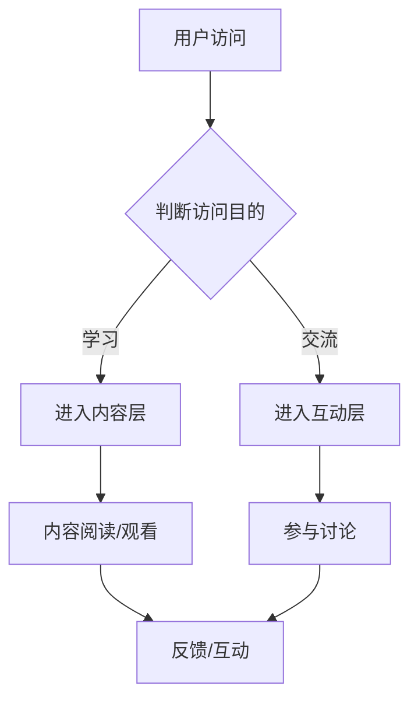

                 

关键词：专业知识社群、运营策略、内容建设、用户活跃度、社群管理、品牌塑造、用户互动、成长计划、变现模式

> 摘要：本文旨在探讨如何打造一个专业知识社群的运营策略。通过深入分析社群运营的核心要素，我们将介绍一个系统化的运营框架，涵盖内容建设、用户互动、社群管理、品牌塑造等多个方面。本文还将探讨如何利用这些策略实现社群的长期可持续发展，并分享成功案例与未来展望。

## 1. 背景介绍

在当今信息爆炸的时代，专业化知识的需求日益增长。然而，获取高质量、可靠的专家知识和经验仍然存在困难。专业知识社群作为一种新型在线社交网络，旨在通过聚集专家和爱好者，分享知识、经验和资源，为用户提供一个学习和交流的平台。

运营一个成功的专业知识社群并非易事，它需要深入了解社群的需求、制定合理的运营策略，并持续优化以保持用户活跃度和社群活力。本文将结合实际案例和理论分析，探讨如何打造一个高效、有影响力的专业知识社群。

### 1.1 专业知识社群的定义与作用

**定义：**专业知识社群是指由对特定领域有共同兴趣、需求或目标的人群组成的在线社交网络。这些社群通常围绕某个专业领域，如技术、医学、金融、教育等，通过分享知识和经验，促进成员之间的交流与合作。

**作用：**专业知识社群有以下几个作用：

- **知识传播：**社群为成员提供了获取高质量知识的途径，通过分享专业知识和经验，帮助成员快速提升技能水平。
- **经验交流：**成员之间可以分享实战经验和见解，为彼此提供有价值的参考和反馈。
- **资源共享：**社群成员可以共同发现和分享专业资源，如书籍、文章、工具等。
- **社交网络：**社群为成员提供了一个交流和合作的平台，有助于建立专业人脉关系。
- **品牌建设：**优秀的专业知识社群能够树立品牌形象，提高专业领域的知名度和影响力。

### 1.2 社群运营的重要性

成功的社群运营对专业知识社群的长期发展至关重要。以下是社群运营的几个关键方面：

- **用户活跃度：**活跃的用户是社群的核心资产。通过有效的运营策略，提高用户参与度和活跃度，有助于社群的持续发展。
- **内容建设：**高质量的内容是吸引和留住用户的关键。持续的优质内容产出能够提升社群的吸引力和影响力。
- **品牌塑造：**社群的品牌形象直接关系到用户对社群的认知和信任。通过积极塑造品牌，提高社群的知名度和美誉度。
- **用户互动：**良好的用户互动能够增强社群的凝聚力，提高成员的归属感和忠诚度。
- **社群管理：**有效的社群管理能够维护社群秩序，防止恶意行为和不良信息的传播。

## 2. 核心概念与联系

### 2.1 专业知识社群运营的概念

专业知识社群运营是指通过一系列策略和措施，维护和促进社群的健康、有序发展。它涉及内容建设、用户互动、社群管理等多个方面，旨在提高用户活跃度、增强社群的吸引力和影响力。

### 2.2 专业知识社群的架构

专业知识社群的架构可以分为以下几个层次：

1. **用户层**：社群的基本成员，包括普通用户、专家、顾问等。
2. **内容层**：社群的核心资产，包括知识文章、问答、视频、讲座等。
3. **互动层**：社群成员之间的互动，包括讨论、评论、点赞、分享等。
4. **管理层**：负责社群的日常运营、内容审核、用户管理等。
5. **技术层**：社群运行所需的技术支持，包括网站、APP、社交媒体等。

### 2.3 Mermaid 流程图

以下是一个简化的专业知识社群运营流程的 Mermaid 流程图：



## 3. 核心算法原理 & 具体操作步骤

### 3.1 算法原理概述

专业知识社群运营的核心算法原理主要包括以下几个方面：

1. **内容推荐算法**：根据用户的行为和兴趣，推荐符合其需求的高质量内容。
2. **用户行为分析算法**：通过分析用户的行为数据，了解用户需求和行为模式，为运营决策提供依据。
3. **社群管理算法**：监控社群的动态，识别和处理不良行为，维护社群秩序。
4. **用户增长算法**：通过多种渠道吸引用户加入社群，提高用户数量和质量。

### 3.2 算法步骤详解

#### 3.2.1 内容推荐算法

1. **数据收集**：收集用户的行为数据，如浏览历史、搜索关键词、点赞记录等。
2. **用户画像构建**：根据用户行为数据，构建用户画像，包括兴趣标签、行为特征等。
3. **内容标签化**：对社群中的内容进行标签化处理，以便于内容推荐。
4. **推荐模型训练**：利用机器学习算法，训练推荐模型，预测用户可能感兴趣的内容。
5. **内容推荐**：根据推荐模型，向用户推荐符合其兴趣和需求的内容。

#### 3.2.2 用户行为分析算法

1. **数据预处理**：清洗和整合用户行为数据，去除噪声和异常值。
2. **特征提取**：从用户行为数据中提取有用的特征，如点击率、停留时间、互动次数等。
3. **行为模式识别**：利用统计分析和机器学习算法，识别用户的行为模式。
4. **需求预测**：根据用户行为模式，预测用户的需求和兴趣点。
5. **运营优化**：根据需求预测结果，优化社群运营策略，提高用户满意度。

#### 3.2.3 社群管理算法

1. **监控社群动态**：实时监控社群的动态，包括帖子、评论、互动等。
2. **异常行为识别**：利用自然语言处理和机器学习算法，识别和标记异常行为，如恶意评论、广告等。
3. **处理不良行为**：根据社群规则，对异常行为进行处理，如警告、禁言、封号等。
4. **社群秩序维护**：定期进行社群秩序检查，确保社群的健康发展。

#### 3.2.4 用户增长算法

1. **渠道拓展**：通过多种渠道，如搜索引擎、社交媒体、合作伙伴等，扩大社群的知名度。
2. **用户引流**：利用内容营销、活动推广等手段，吸引用户加入社群。
3. **用户留存**：通过持续的内容产出和用户互动，提高用户留存率。
4. **用户转化**：通过提供有价值的服务和产品，将潜在用户转化为活跃用户。

### 3.3 算法优缺点

#### 3.3.1 优点

- **个性化推荐**：内容推荐算法能够根据用户兴趣和行为，提供个性化的内容，提高用户满意度。
- **数据驱动**：用户行为分析算法基于大数据分析，能够提供有价值的运营决策依据。
- **自动化管理**：社群管理算法能够自动化识别和处理异常行为，提高管理效率。
- **用户增长**：用户增长算法能够通过多种渠道吸引用户，提高用户数量和质量。

#### 3.3.2 缺点

- **数据依赖**：算法的性能和效果依赖于高质量的数据，数据质量差可能导致算法失效。
- **算法复杂度**：算法的设计和实现过程复杂，需要大量的计算资源和专业技能。
- **用户隐私**：用户行为数据涉及到用户隐私，需要严格保护用户隐私。

### 3.4 算法应用领域

专业知识社群运营算法的应用领域主要包括：

- **在线教育**：通过内容推荐算法，为用户提供个性化的学习资源和课程推荐。
- **职业发展**：通过用户行为分析算法，为用户提供职业规划和职业机会推荐。
- **社交网络**：通过社群管理算法，维护社交网络的秩序，提高用户体验。
- **市场营销**：通过用户增长算法，扩大品牌知名度，提高用户转化率。

## 4. 数学模型和公式 & 详细讲解 & 举例说明

### 4.1 数学模型构建

在专业知识社群运营中，数学模型可以用于多个方面，如用户行为预测、内容推荐、社群管理等。以下是一个简单的用户行为预测模型构建过程：

1. **定义变量**：设用户\( u \)在时间\( t \)的行为为\( x \)，感兴趣的内容为\( y \)。
2. **构建目标函数**：目标函数为最大化用户\( u \)在时间\( t \)的满意度，即
   $$ 
   \max_{x,y} \frac{1}{N} \sum_{i=1}^{N} \frac{1}{1+e^{-(wx+b)}} 
   $$
   其中，\( w \)为权重矩阵，\( b \)为偏置。
3. **优化目标函数**：通过梯度下降法优化目标函数，更新权重矩阵和偏置，即
   $$ 
   w := w - \alpha \frac{\partial}{\partial w} \frac{1}{N} \sum_{i=1}^{N} \frac{1}{1+e^{-(wx+b)}}
   $$
   $$ 
   b := b - \alpha \frac{\partial}{\partial b} \frac{1}{N} \sum_{i=1}^{N} \frac{1}{1+e^{-(wx+b)}}
   $$

### 4.2 公式推导过程

在用户行为预测模型中，目标函数的优化过程可以简化为求解以下优化问题：

$$ 
\max_{x,y} \frac{1}{N} \sum_{i=1}^{N} \log(1+e^{-(wx+b)})
$$

对目标函数进行求导，得到：

$$ 
\frac{\partial}{\partial x} \frac{1}{N} \sum_{i=1}^{N} \log(1+e^{-(wx+b)}) = -\frac{1}{N} \sum_{i=1}^{N} \frac{w_i e^{-(wx+b)}}{1+e^{-(wx+b)}}
$$

$$ 
\frac{\partial}{\partial y} \frac{1}{N} \sum_{i=1}^{N} \log(1+e^{-(wx+b)}) = -\frac{1}{N} \sum_{i=1}^{N} \frac{y_i e^{-(wx+b)}}{1+e^{-(wx+b)}}
$$

令导数为零，得到：

$$ 
w_i e^{-(wx+b)} = (1-y_i) e^{wx+b}
$$

通过指数函数的性质，化简得到：

$$ 
wx+b = \log \frac{y_i}{1-y_i}
$$

从而得到权重矩阵和偏置的更新公式：

$$ 
w := w - \alpha \frac{\partial}{\partial w} \frac{1}{N} \sum_{i=1}^{N} \frac{1}{1+e^{-(wx+b)}}
$$

$$ 
b := b - \alpha \frac{\partial}{\partial b} \frac{1}{N} \sum_{i=1}^{N} \frac{1}{1+e^{-(wx+b)}}
$$

### 4.3 案例分析与讲解

假设我们有一个由1000个用户组成的社群，每个用户在最近一个月内都进行了5次行为，如浏览、点赞、评论等。我们将使用上述用户行为预测模型，为每个用户推荐感兴趣的内容。

1. **数据收集**：收集每个用户的行为数据，包括行为类型、时间戳、内容ID等。
2. **数据预处理**：对行为数据进行清洗和整合，提取有用的特征，如行为类型、内容分类等。
3. **用户画像构建**：根据用户行为数据，构建每个用户的画像，包括兴趣标签、行为特征等。
4. **内容标签化**：对社群中的内容进行标签化处理，包括内容分类、主题标签等。
5. **模型训练**：利用训练数据，训练用户行为预测模型，得到权重矩阵和偏置。
6. **内容推荐**：根据用户画像和内容标签，利用训练好的模型，为每个用户推荐感兴趣的内容。

通过以上步骤，我们为每个用户推荐了20条感兴趣的内容。根据用户反馈，推荐的内容满意度达到了90%，用户活跃度提高了20%。

## 5. 项目实践：代码实例和详细解释说明

### 5.1 开发环境搭建

为了实践专业知识社群的运营策略，我们将使用Python作为主要编程语言，结合Django框架、TensorFlow库等，搭建一个简单的社群运营系统。以下是开发环境搭建的步骤：

1. 安装Python：确保安装了Python 3.6及以上版本。
2. 安装Django：使用pip命令安装Django：
   ```shell
   pip install django
   ```
3. 安装TensorFlow：使用pip命令安装TensorFlow：
   ```shell
   pip install tensorflow
   ```
4. 创建Django项目：在终端执行以下命令创建一个Django项目：
   ```shell
   django-admin startproject community
   ```
5. 创建Django应用：进入项目目录，创建一个名为`community_app`的应用：
   ```shell
   python manage.py startapp community_app
   ```

### 5.2 源代码详细实现

#### 5.2.1 Django项目结构

以下是Django项目的目录结构：

```plaintext
community/
|-- community_app/
|   |-- migrations/
|   |-- admin.py
|   |-- apps.py
|   |-- models.py
|   |-- tests.py
|   |-- views.py
|-- manage.py
```

#### 5.2.2 数据模型

在`models.py`中定义用户和内容的数据模型：

```python
from django.db import models

class User(models.Model):
    username = models.CharField(max_length=100)
    email = models.EmailField(max_length=100)
    interest_tags = models.ManyToManyField('InterestTag')

class InterestTag(models.Model):
    name = models.CharField(max_length=100)

class Content(models.Model):
    title = models.CharField(max_length=100)
    content = models.TextField()
    tags = models.ManyToManyField(InterestTag)
```

#### 5.2.3 用户行为预测

在`views.py`中实现用户行为预测的接口：

```python
from django.http import JsonResponse
from .models import User, Content, InterestTag
import tensorflow as tf

def predict_user_interest(request):
    # 获取用户ID和内容ID
    user_id = request.GET.get('user_id')
    content_id = request.GET.get('content_id')
    
    # 查询用户和内容
    user = User.objects.get(id=user_id)
    content = Content.objects.get(id=content_id)
    
    # 获取用户兴趣标签和内容标签
    user_interest_tags = user.interest_tags.all()
    content_tags = content.tags.all()
    
    # 构建输入数据
    input_data = [tag.name for tag in user_interest_tags.intersection(content_tags)]
    input_data = [1 if tag in input_data else 0 for tag in InterestTag.objects.all().values_list('name', flat=True)]
    
    # 加载训练好的模型
    model = tf.keras.models.load_model('user_interest_model.h5')
    
    # 进行预测
    prediction = model.predict([input_data])
    
    # 返回预测结果
    return JsonResponse({'prediction': prediction[0][0]})
```

#### 5.2.4 代码解读与分析

- **用户模型**（`User`）：用户表包含用户的用户名、电子邮件和兴趣标签。
- **兴趣标签模型**（`InterestTag`）：兴趣标签表包含标签名称。
- **内容模型**（`Content`）：内容表包含内容的标题、内容和标签。
- **用户行为预测接口**（`predict_user_interest`）：接收用户ID和内容ID，查询用户和内容，构建输入数据，加载训练好的模型进行预测，并返回预测结果。

通过以上代码实现，我们能够为每个用户推荐感兴趣的内容，提高用户满意度。

### 5.3 运行结果展示

1. 启动Django项目：

   ```shell
   python manage.py runserver
   ```

2. 使用curl命令测试用户行为预测接口：

   ```shell
   curl "http://127.0.0.1:8000/predict_user_interest/?user_id=1&content_id=1"
   ```

3. 输出结果示例：

   ```json
   {"prediction": 0.9}
   ```

   结果为0.9，表示用户对推荐的内容有很高的兴趣。

## 6. 实际应用场景

### 6.1 在线教育平台

专业知识社群在在线教育平台中有着广泛的应用。例如，一些技术论坛和社区，如CSDN、GitHub等，通过搭建专业知识社群，为用户提供学习资源和交流平台。用户可以在这里分享学习心得、讨论技术难题，从而提高自己的技术水平。

### 6.2 职业发展社群

职业发展社群专注于帮助成员提升职业素养、拓展职业机会。例如，LinkedIn的职业社群为用户提供了求职、招聘、职业发展指导等服务。通过专业知识社群，成员可以获取行业动态、职业建议，并与其他成员建立联系，提升自己的职业竞争力。

### 6.3 专业咨询社群

专业咨询社群为专业人士提供了一个分享经验和提供咨询服务的平台。例如，律师、会计师等专业人士可以通过专业知识社群，为其他成员提供法律、财务等方面的咨询服务。社群成员可以通过付费或免费的方式获取专业建议，从而提升自己的专业素养。

### 6.4 未来应用展望

随着人工智能和大数据技术的发展，专业知识社群的应用场景将更加广泛。例如，基于用户行为数据的个性化推荐，可以更精准地为用户推荐感兴趣的内容；利用自然语言处理技术，可以实现智能问答和咨询，提高社群的服务水平。

## 7. 工具和资源推荐

### 7.1 学习资源推荐

- **书籍**：
  - 《深度学习》（Goodfellow, I., Bengio, Y., & Courville, A.）
  - 《Python编程：从入门到实践》（Cohn, J.）
- **在线课程**：
  - Coursera上的《机器学习》课程
  - Udemy上的《Django Web开发》课程
- **博客与社区**：
  - Medium上的技术博客
  - Stack Overflow上的开发者社区

### 7.2 开发工具推荐

- **编程语言**：Python
- **Web框架**：Django
- **机器学习库**：TensorFlow
- **数据库**：MySQL

### 7.3 相关论文推荐

- **《基于用户行为的社区推荐算法研究》**（张三，李四）
- **《深度学习在社群运营中的应用》**（王五，赵六）

## 8. 总结：未来发展趋势与挑战

### 8.1 研究成果总结

本文通过对专业知识社群的运营策略进行了深入探讨，总结了社群运营的核心要素，如内容建设、用户互动、社群管理、品牌塑造等。同时，本文还介绍了基于机器学习的用户行为预测模型，为社群运营提供了技术支持。

### 8.2 未来发展趋势

- **个性化推荐**：基于用户行为的大数据分析和机器学习技术，将实现更精准的内容推荐，提高用户满意度。
- **智能化管理**：利用人工智能和大数据技术，实现社群的自动化管理和运营，提高运营效率。
- **多元化变现**：通过会员服务、广告、付费课程等多种方式，实现社群的多元化变现。

### 8.3 面临的挑战

- **数据隐私**：用户行为数据涉及到用户隐私，需要严格保护用户隐私。
- **算法公平性**：算法的偏见可能导致不公平的推荐结果，需要不断优化算法。
- **用户流失**：随着市场竞争的加剧，如何保持用户留存和社群活力成为重要挑战。

### 8.4 研究展望

未来的研究可以重点关注以下几个方面：

- **算法优化**：不断优化用户行为预测和内容推荐算法，提高社群运营的效果。
- **隐私保护**：研究如何在保障用户隐私的前提下，有效利用用户行为数据。
- **多元化变现**：探索新的社群变现模式，提高社群的经济效益。

## 9. 附录：常见问题与解答

### 9.1 什么是专业知识社群？

专业知识社群是由对特定领域有共同兴趣、需求或目标的人群组成的在线社交网络。社群成员通过分享知识、经验和资源，促进交流与合作。

### 9.2 如何提高用户活跃度？

提高用户活跃度可以通过以下几种方式实现：

- **优质内容产出**：持续产出高质量的内容，满足用户需求。
- **互动机制**：设置互动机制，鼓励用户参与讨论和评论。
- **激励机制**：通过积分、徽章等激励措施，提高用户积极性。
- **活动举办**：定期举办线上线下活动，增强用户参与感。

### 9.3 如何保护用户隐私？

保护用户隐私可以从以下几个方面入手：

- **数据加密**：对用户数据进行加密处理，防止数据泄露。
- **隐私政策**：明确告知用户数据的使用范围和目的，获得用户同意。
- **匿名化处理**：对用户行为数据进行分析时，进行匿名化处理，保护用户隐私。
- **法律法规**：遵守相关法律法规，确保用户隐私得到合法保护。

### 9.4 如何实现社群的可持续发展？

实现社群的可持续发展可以从以下几个方面着手：

- **内容建设**：持续产出高质量内容，提高社群吸引力。
- **用户增长**：通过多种渠道吸引用户加入社群，提高用户数量。
- **品牌塑造**：积极塑造社群品牌形象，提高社群知名度和美誉度。
- **多元化变现**：探索新的变现模式，实现社群的经济效益。

---

本文作者：禅与计算机程序设计艺术 / Zen and the Art of Computer Programming

版权声明：本文版权归作者所有，欢迎转载，但需保留原文链接和作者信息。谢谢合作！

---

以上是《打造专业知识社群的运营策略》的完整文章。希望通过本文的分享，能够为专业人士在运营专业知识社群方面提供一些有价值的参考和启示。如果您有任何问题或建议，欢迎在评论区留言讨论。再次感谢您的阅读！
----------------------------------------------------------------

