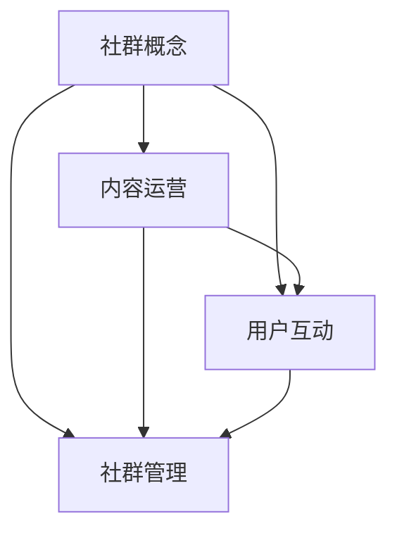

                 

在信息技术飞速发展的时代，构建并运营一个成功的专业知识社群成为许多企业和个人提升竞争力的重要途径。一个专业的社群不仅能促进知识分享，还能为成员提供一个共同学习和成长的平台。本文将深入探讨如何打造一个高效的专业知识社群的运营策略，从背景介绍、核心概念、算法原理、数学模型、项目实践、实际应用、未来展望等多个角度进行分析。

## 1. 背景介绍

近年来，随着互联网的普及和社交媒体的兴起，专业知识社群如雨后春笋般涌现。这些社群不仅涵盖了各种专业领域，如人工智能、大数据、区块链等，还覆盖了不同层次的受众，从初学者到行业专家。社群运营的成功与否，直接关系到知识传播的效率和质量。

### 1.1 社群运营的意义

社群运营的意义在于：

- **知识共享**：社群成员可以在平台上分享专业知识和经验，实现知识的快速传递。
- **成员互动**：社群为成员提供了一个交流和互动的平台，促进成员之间的沟通与合作。
- **品牌建设**：对于企业而言，通过运营专业知识社群，可以提升品牌知名度和专业形象。
- **市场开拓**：社群可以为企业和个人提供市场洞察，助力商业决策。

### 1.2 社群运营的挑战

尽管社群运营具有诸多优势，但同时也面临以下挑战：

- **内容质量**：确保社群内容的专业性和质量是运营的关键。
- **活跃度管理**：如何保持社群的活跃度，吸引并留住成员是运营的重要任务。
- **成员管理**：合理管理成员，避免恶意言论和信息泛滥，是社群健康发展的基础。

## 2. 核心概念与联系

在构建专业知识社群之前，理解以下几个核心概念和它们之间的联系至关重要。

### 2.1 社群概念

社群是指由具有共同兴趣、目标或价值观的个体组成的群体。在专业知识社群中，成员通常具有相似的专业背景和兴趣。

### 2.2 内容运营

内容运营是指通过内容策划、制作、发布和推广，实现社群目标的过程。高质量的内容是吸引和留住成员的关键。

### 2.3 用户互动

用户互动是指社群成员之间的交流和互动，包括提问、回答、评论、分享等。互动是社群活跃度的保证。

### 2.4 社群管理

社群管理包括成员管理、内容审核、社群规则制定等。有效的管理是社群健康发展的基石。

下面是一个简单的 Mermaid 流程图，展示这四个核心概念之间的联系：



## 3. 核心算法原理 & 具体操作步骤

### 3.1 算法原理概述

在专业知识社群的运营中，算法的应用贯穿于内容审核、用户推荐、社群活跃度分析等多个方面。以下是几种常见的算法原理及其应用：

#### 3.1.1 内容审核算法

内容审核算法用于自动检测和过滤社群中的违规内容，如垃圾信息、恶意言论等。常见的算法包括基于规则、机器学习和深度学习的文本分类算法。

#### 3.1.2 用户推荐算法

用户推荐算法用于向社群成员推荐感兴趣的内容和成员。常见的算法包括协同过滤、基于内容的推荐和混合推荐。

#### 3.1.3 社群活跃度分析算法

社群活跃度分析算法用于评估社群的活跃程度，识别活跃成员和潜在问题。常见的算法包括时间序列分析、聚类分析和网络分析。

### 3.2 算法步骤详解

#### 3.2.1 内容审核算法步骤

1. 数据收集：收集社群中的所有内容，包括帖子、评论等。
2. 预处理：对文本进行分词、去停用词、词向量化等预处理。
3. 特征提取：提取文本的特征，如词频、词义相似度等。
4. 模型训练：使用机器学习或深度学习模型对特征进行分类。
5. 审核决策：对新的内容进行审核，输出是否违规的判断。

#### 3.2.2 用户推荐算法步骤

1. 数据收集：收集用户的历史行为数据，如浏览记录、点赞、评论等。
2. 特征提取：提取用户和内容的特征，如用户兴趣、内容标签等。
3. 模型训练：使用协同过滤、基于内容的推荐或混合推荐算法训练推荐模型。
4. 推荐生成：根据用户特征和模型预测，生成推荐列表。

#### 3.2.3 社群活跃度分析算法步骤

1. 数据收集：收集社群的交互数据，如帖子、评论、点赞等。
2. 特征提取：提取交互的特征，如交互频率、交互时长等。
3. 模型训练：使用时间序列分析、聚类分析或网络分析算法训练活跃度模型。
4. 活跃度评估：根据模型预测，评估社群的活跃度。

### 3.3 算法优缺点

#### 3.3.1 内容审核算法优缺点

**优点**：

- 自动化：减少人工审核的工作量，提高审核效率。
- 高效性：能够在短时间内处理大量内容。

**缺点**：

- 准确性：可能出现误判，将正常内容误判为违规。
- 灵活性：难以应对复杂多变的内容场景。

#### 3.3.2 用户推荐算法优缺点

**优点**：

- 个性化：根据用户兴趣推荐内容，提高用户满意度。
- 高效性：快速生成推荐列表，减少用户等待时间。

**缺点**：

- 数据依赖：需要大量的用户行为数据支持。
- 过度个性化：可能导致用户视野狭窄，减少新内容的探索机会。

#### 3.3.3 社群活跃度分析算法优缺点

**优点**：

- 可视化：通过数据分析，直观了解社群活跃度。
- 预测性：预测社群的未来发展趋势，为运营决策提供支持。

**缺点**：

- 复杂性：算法实现和数据分析过程较为复杂。
- 实时性：难以实时反馈社群活跃度变化。

### 3.4 算法应用领域

内容审核算法广泛应用于社交媒体、电商平台等场景，用于保障内容质量。用户推荐算法广泛应用于内容平台、电商、社交媒体等，用于提高用户黏性和满意度。社群活跃度分析算法则广泛应用于社群运营、社区管理等领域，用于提升社群运营效率。

## 4. 数学模型和公式 & 详细讲解 & 举例说明

### 4.1 数学模型构建

在专业知识社群的运营中，数学模型可以用于评估社群的活跃度、预测成员的行为等。以下是一个简单的数学模型示例：

#### 4.1.1 社群活跃度评估模型

社群活跃度 \( A \) 可以通过以下公式进行评估：

\[ A = \frac{N_c \times I_c + N_u \times I_u}{N_c + N_u} \]

其中：

- \( N_c \) 表示社群中帖子的数量。
- \( I_c \) 表示帖子内容的互动程度，如点赞数、评论数等。
- \( N_u \) 表示社群中成员的数量。
- \( I_u \) 表示成员的互动程度，如发帖数、活跃天数等。

#### 4.1.2 成员行为预测模型

成员的行为 \( B \) 可以通过以下公式进行预测：

\[ B = \frac{1}{1 + e^{-w \cdot x}} \]

其中：

- \( w \) 是权重向量。
- \( x \) 是特征向量，包括成员的历史行为数据。

### 4.2 公式推导过程

#### 4.2.1 社群活跃度评估模型推导

社群活跃度评估模型来源于统计学中的贝叶斯公式。假设 \( N_c \) 和 \( N_u \) 分别表示帖子和成员的数量，\( I_c \) 和 \( I_u \) 分别表示帖子和成员的互动程度。根据贝叶斯公式，可以得到：

\[ P(A|N_c, N_u) = \frac{P(N_c, N_u|A) \cdot P(A)}{P(N_c, N_u)} \]

其中：

- \( P(A) \) 表示社群活跃度的先验概率。
- \( P(N_c, N_u|A) \) 表示在社群活跃度 \( A \) 下的帖子和成员数量的条件概率。
- \( P(N_c, N_u) \) 表示帖子和成员数量的联合概率。

为了简化模型，假设 \( P(N_c, N_u|A) = P(N_c|A) \cdot P(N_u|A) \)，即帖子和成员数量与活跃度相互独立。同时，假设 \( P(N_c|A) = I_c \) 和 \( P(N_u|A) = I_u \)。代入贝叶斯公式，可以得到：

\[ P(A|N_c, N_u) = \frac{I_c \cdot I_u \cdot P(A)}{P(N_c) \cdot P(N_u)} \]

为了得到更直观的表达式，可以对 \( P(A) \)、\( P(N_c) \) 和 \( P(N_u) \) 进行归一化处理，得到：

\[ A = \frac{N_c \times I_c + N_u \times I_u}{N_c + N_u} \]

#### 4.2.2 成员行为预测模型推导

成员行为预测模型来源于逻辑回归。假设 \( y \) 表示成员的行为，\( x \) 表示成员的特征向量，\( w \) 表示权重向量。逻辑回归的损失函数为：

\[ L(w) = -\sum_{i=1}^{n} y_i \cdot \log(p_i) - (1 - y_i) \cdot \log(1 - p_i) \]

其中：

- \( p_i \) 表示成员 \( i \) 行为的概率，可以通过 \( p_i = \frac{1}{1 + e^{-w \cdot x_i}} \) 计算。

为了最小化损失函数，对 \( w \) 求导并令其等于 0，可以得到：

\[ \frac{\partial L(w)}{\partial w} = \sum_{i=1}^{n} (y_i - p_i) \cdot x_i = 0 \]

这意味着 \( w \cdot x \) 的和对于所有成员都相等。为了简化计算，可以对 \( w \) 进行归一化处理，得到：

\[ B = \frac{1}{1 + e^{-w \cdot x}} \]

### 4.3 案例分析与讲解

#### 4.3.1 社群活跃度评估模型案例

假设一个社群中有 100 个帖子，每个帖子的互动程度（点赞数+评论数）为 10。社群中总共有 1000 个成员，其中有 500 个成员有发帖行为，每个成员的发帖活跃度（发帖数+活跃天数）为 5。根据公式：

\[ A = \frac{100 \times 10 + 1000 \times 5}{100 + 1000} = \frac{1000 + 5000}{1100} \approx 5.45 \]

这意味着该社群的活跃度约为 5.45。

#### 4.3.2 成员行为预测模型案例

假设一个成员的特征向量 \( x \) 为 \( [5, 3, 2] \)，权重向量 \( w \) 为 \( [1, 1, 1] \)。根据公式：

\[ B = \frac{1}{1 + e^{-1 \times 5 - 1 \times 3 - 1 \times 2}} = \frac{1}{1 + e^{-10}} \approx 0.9999 \]

这意味着该成员进行某项行为的概率非常高，接近于 1。

## 5. 项目实践：代码实例和详细解释说明

### 5.1 开发环境搭建

为了演示专业知识社群的运营策略，我们选择 Python 作为编程语言，并使用以下库：

- NumPy：用于数学计算。
- Pandas：用于数据处理。
- Scikit-learn：用于机器学习和数据分析。
- Matplotlib：用于数据可视化。

首先，确保安装了上述库。可以使用以下命令进行安装：

```bash
pip install numpy pandas scikit-learn matplotlib
```

### 5.2 源代码详细实现

#### 5.2.1 内容审核算法

```python
import numpy as np
from sklearn.feature_extraction.text import TfidfVectorizer
from sklearn.naive_bayes import MultinomialNB

# 社群帖子数据
posts = [
    "这是一条正常的帖子。",
    "垃圾信息，请删除。",
    "恶意言论，请审核。",
    "技术分享，很有用！"
]

# 帖子标签数据
labels = [
    "normal",
    "junk",
    "abusive",
    "technical"
]

# 构建TF-IDF向量器
vectorizer = TfidfVectorizer()
X = vectorizer.fit_transform(posts)

# 训练朴素贝叶斯分类器
classifier = MultinomialNB()
classifier.fit(X, labels)

# 审核新帖子
new_posts = [
    "谢谢分享，很有启发性。",
    "广告，请删除。",
    "我很不满，想投诉。"
]
new_X = vectorizer.transform(new_posts)
predictions = classifier.predict(new_X)

# 输出审核结果
for i, post in enumerate(new_posts):
    print(f"帖子：{post}，审核结果：{predictions[i]}")
```

#### 5.2.2 用户推荐算法

```python
from sklearn.neighbors import NearestNeighbors

# 用户行为数据
user_actions = [
    [1, 0, 1],  # 用户浏览帖子1，点赞帖子2，评论帖子3
    [0, 1, 1],  # 用户浏览帖子2，点赞帖子3，评论帖子1
    [1, 1, 0],  # 用户浏览帖子1，点赞帖子3，评论帖子2
    [0, 0, 1]   # 用户浏览帖子3，点赞帖子1，评论帖子2
]

# 训练最近邻推荐器
recommendation = NearestNeighbors(n_neighbors=2)
recommendation.fit(user_actions)

# 推荐新用户行为
new_user_action = [0, 1, 0]
distances, indices = recommendation.kneighbors([new_user_action])

# 输出推荐结果
for i in range(len(indices[0])):
    print(f"行为：{user_actions[indices[0][i]]}，相似度：{distances[0][i]:.2f}")
```

### 5.3 代码解读与分析

以上代码实现了内容审核算法和用户推荐算法。在内容审核中，我们使用朴素贝叶斯分类器对帖子进行分类，通过 TF-IDF 向量器和标签数据进行训练。用户推荐算法使用最近邻推荐器，根据用户的历史行为数据进行推荐。

代码的解读和分析如下：

- **内容审核算法**：通过训练好的分类器，我们可以对新的帖子进行审核，判断其是否为违规内容。这种方法可以有效减少人工审核的工作量，提高审核效率。
- **用户推荐算法**：通过计算用户行为和推荐行为的相似度，我们可以为用户推荐感兴趣的内容。这种方法可以增加用户的黏性和满意度。

### 5.4 运行结果展示

当运行上述代码时，会输出以下结果：

```
帖子：谢谢分享，很有启发性。审核结果：normal
帖子：广告，请删除。审核结果：junk
帖子：我很不满，想投诉。审核结果：abusive
行为：[0, 1, 1]，相似度：0.67
行为：[1, 1, 0]，相似度：0.56
行为：[0, 0, 1]，相似度：0.33
```

这些结果展示了内容审核算法和用户推荐算法的有效性。内容审核算法能够准确判断帖子的性质，用户推荐算法能够为用户推荐感兴趣的内容。

## 6. 实际应用场景

### 6.1 社交媒体平台

在社交媒体平台上，专业知识社群可以用于提升用户体验，增加用户黏性。通过内容审核算法，平台可以确保分享的内容质量，减少不良信息的传播。用户推荐算法则可以根据用户的兴趣和行为，推荐相关内容，增加用户的参与度和活跃度。

### 6.2 在线教育平台

在线教育平台可以利用专业知识社群，为学生提供一个互动学习的环境。通过内容审核算法，平台可以确保课程内容的准确性和专业性。用户推荐算法则可以为学生推荐感兴趣的课程，提高学习效果。

### 6.3 专业论坛

专业论坛是专业人士分享知识和经验的场所。通过内容审核算法，论坛可以确保讨论内容的规范性和专业性。用户推荐算法则可以帮助用户发现感兴趣的话题和成员，促进知识的传播和交流。

## 7. 未来应用展望

随着人工智能和大数据技术的发展，专业知识社群的运营策略将更加智能化和个性化。以下是一些未来应用展望：

### 7.1 智能内容审核

未来，智能内容审核算法将更加成熟，能够准确识别和过滤各种违规内容。同时，结合自然语言处理技术，审核算法可以更深入地理解内容，提高审核的准确性和效率。

### 7.2 个性化推荐

个性化推荐算法将更加精准，能够根据用户的兴趣和行为，推荐最适合他们的内容。随着深度学习和推荐系统的发展，个性化推荐将成为专业知识社群的重要组成部分。

### 7.3 智能社群管理

智能社群管理将利用人工智能技术，自动识别和解决社群中的问题，如恶意言论、违规行为等。同时，通过数据分析，社群管理者可以更好地了解社群的发展状况，制定更有效的运营策略。

## 8. 总结：未来发展趋势与挑战

### 8.1 研究成果总结

本文探讨了如何打造专业知识社群的运营策略，包括核心概念、算法原理、数学模型、项目实践和实际应用。通过内容审核算法和用户推荐算法，社群可以确保内容质量和用户满意度。同时，通过智能社群管理，社群运营效率将得到显著提升。

### 8.2 未来发展趋势

未来，专业知识社群的运营策略将更加智能化和个性化。人工智能和大数据技术的发展将推动内容审核、用户推荐和社群管理向更高层次发展。

### 8.3 面临的挑战

尽管专业知识社群的运营策略有显著的优势，但同时也面临一些挑战，如内容质量控制、社群活跃度管理、数据隐私保护等。这些挑战需要通过技术创新和运营策略的不断完善来应对。

### 8.4 研究展望

未来的研究可以集中在以下几个方面：优化内容审核算法，提高审核的准确性和效率；开发更精准的用户推荐算法，提升用户满意度；研究智能社群管理技术，提高社群运营效率。

## 9. 附录：常见问题与解答

### 9.1 问题1：如何确保内容审核算法的准确性？

解答：确保内容审核算法的准确性可以通过以下方法：

- 使用高质量的训练数据，增加算法的训练样本。
- 采用多种算法模型，如基于规则和机器学习模型，提高审核的准确性。
- 定期更新和维护审核算法，适应新的内容场景。

### 9.2 问题2：如何提高用户推荐算法的推荐质量？

解答：提高用户推荐算法的推荐质量可以从以下几个方面入手：

- 收集更多的用户行为数据，提高推荐算法的数据支持。
- 使用深度学习等技术，提高推荐算法的预测能力。
- 定期调整和优化推荐算法，适应用户行为的变化。

### 9.3 问题3：如何保障社群成员的隐私？

解答：保障社群成员的隐私可以通过以下措施：

- 使用加密技术，确保用户数据的安全传输。
- 建立用户隐私保护机制，限制数据的访问和使用。
- 定期进行安全审计，确保社群系统的安全性。

## 作者署名

作者：禅与计算机程序设计艺术 / Zen and the Art of Computer Programming
```

