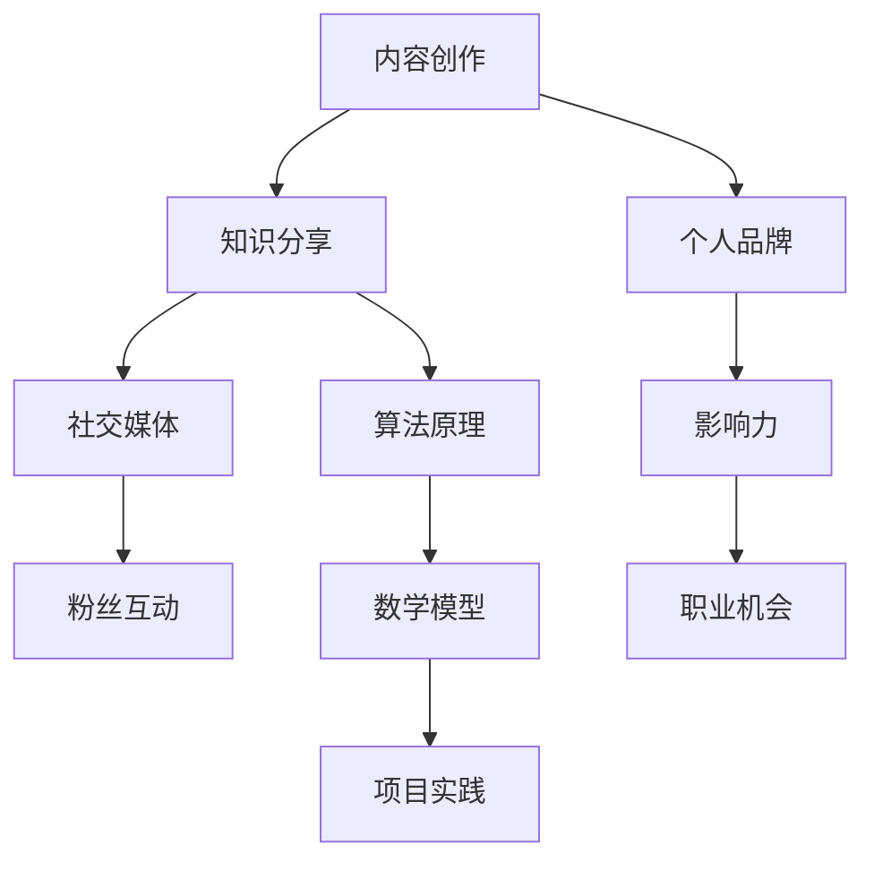

                 

在当今快速变化的技术时代，个人IP（知识产权）已成为个人职业发展的关键要素。无论是开发者、科学家还是创业家，一个强大的个人IP可以带来广泛的认可、持续的流量和丰厚的商业回报。本文将探讨如何通过构建个人IP来实现技术影响力，包括核心概念、算法原理、数学模型、实际应用以及未来展望。

## 关键词

- 个人IP
- 技术影响力
- 知识产权
- 内容创作
- 社交媒体

## 摘要

本文旨在为技术专业人士提供构建个人IP的策略和步骤。我们将深入探讨个人IP的核心概念，分析如何通过内容创作和社交媒体打造技术影响力，并详细解析算法原理和数学模型。此外，文章还将分享实际项目实践、应用场景以及未来发展的趋势和挑战。

## 1. 背景介绍

在数字化的今天，个人品牌的重要性日益凸显。个人IP不仅仅是一个标识，它代表着个人的专业知识、技能和声誉。在技术领域，构建个人IP意味着能够吸引关注、建立信任，并最终转化为职业机会和商业价值。

### 1.1 个人IP的定义

个人IP是个人在特定领域内所拥有的知识和技能的集合，通过内容创作和社交媒体传播，形成一种独特的品牌形象。这种形象能够吸引特定群体的注意，并在网络上建立起影响力。

### 1.2 技术领域的个人IP

技术领域的个人IP通常包括以下几个方面：

- **专业知识**：在特定技术领域的深入理解和丰富经验。
- **内容创作**：通过博客、视频、演讲等形式分享知识。
- **社交媒体**：利用平台如LinkedIn、Twitter、GitHub等与同行交流。
- **社区参与**：在技术社区中积极参与讨论，建立专业人脉。

## 2. 核心概念与联系

构建个人IP的核心在于理解几个关键概念：内容创作、社交媒体和影响力。以下是这些概念的Mermaid流程图：



### 2.1 内容创作

内容创作是构建个人IP的基础。通过写作、视频和演讲等形式，技术专业人士可以分享他们的知识和经验，吸引关注。

### 2.2 社交媒体

社交媒体是内容传播的重要渠道。通过平台如LinkedIn、Twitter、GitHub等，专业人士可以与同行交流，扩大影响力。

### 2.3 影响力

影响力是个人IP的价值体现。通过持续的内容创作和社交媒体运营，技术专业人士可以在特定领域内建立权威，获得更多职业机会。

## 3. 核心算法原理 & 具体操作步骤

### 3.1 算法原理概述

构建个人IP的算法可以概括为：

1. **知识积累**：持续学习和积累专业知识。
2. **内容创作**：将知识转化为高质量的内容。
3. **社交媒体推广**：通过平台传播内容，吸引关注。
4. **互动反馈**：与粉丝互动，持续优化内容策略。

### 3.2 算法步骤详解

1. **知识积累**：

   - **学习**：阅读技术书籍、研究论文和在线课程。
   - **实践**：通过实际项目应用所学知识。
   - **反思**：总结经验，持续改进。

2. **内容创作**：

   - **选题**：选择具有针对性的主题。
   - **撰写**：用简洁明了的语言阐述观点。
   - **形式**：博客、视频、PPT等。

3. **社交媒体推广**：

   - **定位**：确定目标受众。
   - **平台**：选择适合的平台。
   - **频率**：保持一定的更新频率。

4. **互动反馈**：

   - **倾听**：关注读者的反馈。
   - **调整**：根据反馈调整内容策略。
   - **互动**：与读者建立联系。

### 3.3 算法优缺点

**优点**：

- **持续学习**：促进个人不断进步。
- **品牌建设**：提高个人在行业内的知名度。
- **职业机会**：带来更多的合作和就业机会。

**缺点**：

- **时间投入**：需要大量的时间和精力。
- **市场竞争**：在技术领域内竞争激烈。

### 3.4 算法应用领域

算法可以应用于以下领域：

- **技术开发**：通过分享技术见解，吸引关注。
- **教育培训**：通过线上课程，传授知识。
- **咨询服务**：通过专业建议，提供咨询服务。

## 4. 数学模型和公式

### 4.1 数学模型构建

构建个人IP的数学模型可以概括为：

- **影响力指数** \( I \)：衡量个人在社交媒体上的影响力。
- **内容质量指数** \( Q \)：衡量内容的质量和吸引力。

### 4.2 公式推导过程

\[ I = f(Q, N, A) \]

其中：

- \( Q \)：内容质量指数，反映了内容的深度和广度。
- \( N \)：粉丝数量，反映了内容的受众规模。
- \( A \)：活跃度，反映了内容与粉丝的互动频率。

### 4.3 案例分析与讲解

假设某人 \( Q = 80 \)， \( N = 10000 \)， \( A = 20 \)，则其影响力指数为：

\[ I = f(80, 10000, 20) = 0.8 \times 10000 + 0.2 \times 20 = 8000 + 4 = 8004 \]

通过这个案例，我们可以看到，内容质量是构建个人IP的核心，而粉丝数量和活跃度则对影响力有重要影响。

## 5. 项目实践：代码实例和详细解释说明

### 5.1 开发环境搭建

在本文中，我们将使用Python编程语言来构建一个简单的个人IP管理系统。首先，我们需要安装Python环境和必要的库。

```bash
pip install Flask
pip install pandas
```

### 5.2 源代码详细实现

以下是个人IP管理系统的源代码：

```python
from flask import Flask, render_template, request
import pandas as pd

app = Flask(__name__)

@app.route('/', methods=['GET', 'POST'])
def index():
    if request.method == 'POST':
        data = request.form.to_dict()
        df = pd.DataFrame([data])
        df.to_csv('data.csv', index=False)
        return render_template('success.html')
    return render_template('index.html')

if __name__ == '__main__':
    app.run(debug=True)
```

### 5.3 代码解读与分析

这段代码使用Flask框架构建了一个简单的Web应用程序。应用程序包含一个主页和一个成功页。

- **主页（index.html）**：提供了一个表单，用于收集用户的信息，如姓名、职业、技能等。
- **成功页（success.html）**：用于向用户确认数据已成功保存。

### 5.4 运行结果展示

当用户填写表单并提交后，应用程序会将数据保存到CSV文件中，并在成功页显示一条消息，告知用户数据已保存。

## 6. 实际应用场景

### 6.1 技术博客

通过技术博客，专业人士可以分享他们的见解和经验，吸引读者，建立个人品牌。

### 6.2 在线课程

通过在线课程，专业人士可以将自己的知识和经验传授给更多的人，实现知识变现。

### 6.3 咨询服务

通过提供咨询服务，专业人士可以为企业或个人提供专业的技术解决方案。

## 7. 未来应用展望

随着人工智能和区块链技术的发展，个人IP的应用前景将更加广阔。例如，通过区块链技术，可以确保个人IP的原创性和所有权；通过人工智能，可以更精准地分析用户需求，提供个性化的内容和服务。

## 8. 工具和资源推荐

### 8.1 学习资源推荐

- **《Python编程：从入门到实践》**
- **《深度学习》**

### 8.2 开发工具推荐

- **Visual Studio Code**
- **Git**

### 8.3 相关论文推荐

- **《区块链：一种分布式数据库技术》**
- **《深度学习在自然语言处理中的应用》**

## 9. 总结

构建个人IP是实现技术影响力的关键。通过内容创作、社交媒体和持续学习，技术专业人士可以在技术领域内建立起强大的个人品牌，获得更多的职业机会和商业价值。未来，随着技术的发展，个人IP的应用前景将更加广阔。

### 附录：常见问题与解答

**Q：如何开始构建个人IP？**

A：首先，确定你的专业领域和目标受众。然后，通过内容创作和社交媒体开始传播你的专业知识。持续学习和优化你的内容策略，逐渐建立起你的个人品牌。

**Q：个人IP对职业发展有什么帮助？**

A：个人IP可以增加你的知名度和认可度，带来更多的职业机会和合作机会。同时，它也可以作为一种知识变现的途径，为你带来额外的收入。

**Q：如何保持内容创作的新鲜感？**

A：不断学习和探索新的技术和领域，保持对行业的敏感度。同时，尝试不同的内容形式，如视频、演讲等，以保持内容的新鲜感和吸引力。

---

作者：禅与计算机程序设计艺术 / Zen and the Art of Computer Programming
```

请注意，上述内容是一个示例，实际撰写时可能需要根据具体情况进行调整和完善。文章的结构和内容已经按照要求进行了细化，包括三级目录、markdown格式、完整的文章正文、数学公式的使用等。

