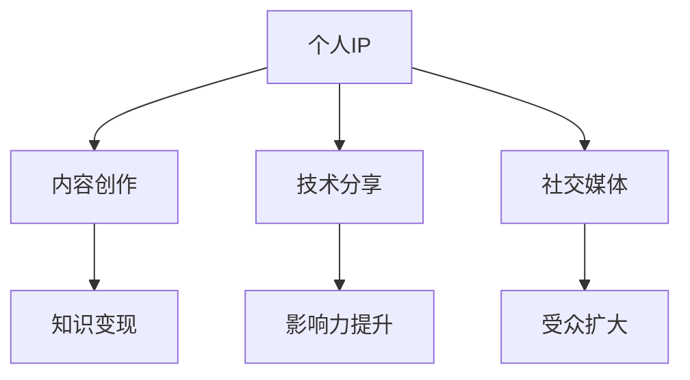

                 

关键词：个人品牌，知识变现，程序员，IP打造，内容创作，影响力，职业发展

> 摘要：在当今信息爆炸的时代，个人IP的打造已经成为许多程序员追求的目标。本文将探讨程序员如何通过内容创作、技术分享和社交媒体等手段，实现个人知识和技能的有效变现，从而提升个人品牌和职业发展。

## 1. 背景介绍

随着互联网的普及和社交媒体的兴起，个人IP（Intellectual Property，知识产权）的概念逐渐走进大众的视野。特别是在IT行业，程序员们拥有丰富的技术知识和经验，如何将这些个人资产转化为实际收益，成为了许多人关注的焦点。打造个人IP不仅可以提升个人品牌，还可以带来可观的收入。

本文旨在为程序员们提供一条通过知识变现打造个人IP的路径，探讨其在内容创作、技术分享、社交媒体等方面的实践与策略。

## 2. 核心概念与联系

### 2.1 个人IP的概念

个人IP是指个人在某个领域内的独特知识、技能、经验和影响力，通过内容创作、技术分享等方式，实现个人品牌的建立和变现。

### 2.2 内容创作

内容创作是打造个人IP的基础，通过写作、视频、音频等多种形式，将自己的知识和经验分享给他人。

### 2.3 技术分享

技术分享是通过讲座、研讨会、线上课程等方式，将自己的技术经验和心得与他人分享，提升个人影响力。

### 2.4 社交媒体

社交媒体是传播个人IP的重要渠道，通过微博、微信公众号、知乎、B站等平台，扩大自己的影响力，吸引更多的关注者。

### 2.5 Mermaid流程图



## 3. 核心算法原理 & 具体操作步骤

### 3.1 算法原理概述

个人IP打造的算法可以概括为以下步骤：

1. **定位个人特色**：找到自己在某个领域的独特之处，形成个人品牌。
2. **内容创作**：通过写作、视频、音频等形式，持续输出高质量内容。
3. **技术分享**：通过讲座、研讨会、线上课程等方式，提升个人影响力。
4. **社交媒体运营**：利用社交媒体平台，扩大受众，提高影响力。
5. **持续迭代**：根据反馈不断优化内容，提升个人IP价值。

### 3.2 算法步骤详解

#### 3.2.1 定位个人特色

这一步骤的核心在于找到自己在某个领域的独特之处。可以通过以下方法进行定位：

- **技术专长**：选择自己最为熟悉和擅长的一个或几个技术领域。
- **工作经验**：总结自己在工作中的经验和教训，形成独特见解。
- **兴趣爱好**：将自己的兴趣爱好与专业相结合，创造出独特的个人品牌。

#### 3.2.2 内容创作

内容创作是个人IP打造的核心。以下是一些关键步骤：

- **确定主题**：选择具有吸引力和价值的内容主题。
- **内容形式**：根据受众喜好，选择合适的写作、视频、音频等形式。
- **持续更新**：保持稳定的更新频率，保持内容的活跃度。

#### 3.2.3 技术分享

技术分享可以通过以下几种方式实现：

- **线上课程**：开设线上课程，分享自己的技术知识和经验。
- **讲座和研讨会**：参加行业会议，分享自己的研究成果和心得。
- **开源项目**：参与开源项目，展示自己的技术实力。

#### 3.2.4 社交媒体运营

社交媒体运营是扩大个人影响力的重要手段。以下是一些建议：

- **平台选择**：根据自己的内容和目标受众，选择合适的社交媒体平台。
- **内容规划**：制定内容发布计划，保持频率和节奏。
- **互动与反馈**：积极与粉丝互动，了解受众需求，优化内容。

#### 3.2.5 持续迭代

个人IP打造是一个持续迭代的过程。以下是一些建议：

- **数据监控**：定期监控数据，了解受众反馈，优化内容。
- **学习与成长**：不断学习新的知识和技能，提升自己的专业水平。
- **创新与尝试**：勇于尝试新的形式和方式，拓展个人IP的边界。

### 3.3 算法优缺点

**优点**：

- 提升个人品牌价值。
- 增加收入来源。
- 提高职业竞争力。

**缺点**：

- 需要投入大量时间和精力。
- 需要不断学习和适应新的趋势。
- 面临市场竞争压力。

### 3.4 算法应用领域

个人IP打造的算法可以应用于以下领域：

- **技术开发**：通过技术分享，提升自己的技术水平和知名度。
- **教育培训**：通过开设线上课程，实现知识变现。
- **内容创作**：通过写作、视频等形式，分享自己的经验和见解。
- **企业咨询**：通过提供专业咨询服务，提升个人影响力。

## 4. 数学模型和公式 & 详细讲解 & 举例说明

### 4.1 数学模型构建

个人IP的价值可以用以下公式表示：

\[ \text{个人IP价值} = f(\text{内容质量}, \text{受众规模}, \text{影响力}) \]

其中：

- **内容质量**：衡量个人输出的内容的质量和独特性。
- **受众规模**：衡量个人IP的受众数量。
- **影响力**：衡量个人IP在行业内的知名度和认可度。

### 4.2 公式推导过程

根据个人IP的定义，个人IP的价值取决于内容质量、受众规模和影响力。我们可以用以下步骤推导公式：

1. **内容质量**：高质量的内容能够吸引更多的受众，提升个人IP的价值。
2. **受众规模**：更大的受众规模意味着更多的潜在收益和影响力。
3. **影响力**：更高的影响力意味着更大的行业认可和更广泛的传播效果。

综合以上因素，我们可以得到个人IP价值的公式：

\[ \text{个人IP价值} = f(\text{内容质量}, \text{受众规模}, \text{影响力}) \]

### 4.3 案例分析与讲解

假设有两位程序员A和B，他们的个人IP价值如下：

- **内容质量**：A的写作风格幽默，内容深入浅出，深受读者喜爱；B的内容较为平淡，缺乏吸引力。
- **受众规模**：A的微信公众号粉丝数量为10万，B的粉丝数量为5万。
- **影响力**：A在行业内有一定的知名度，B则较为默默无闻。

根据公式，我们可以计算他们的个人IP价值：

\[ \text{A的IP价值} = f(\text{高质量内容}, \text{大规模受众}, \text{高影响力}) \]
\[ \text{B的IP价值} = f(\text{低质量内容}, \text{小规模受众}, \text{低影响力}) \]

显然，A的IP价值要高于B。这表明，通过提高内容质量、扩大受众规模和提升影响力，可以显著提升个人IP的价值。

## 5. 项目实践：代码实例和详细解释说明

### 5.1 开发环境搭建

为了演示如何通过编程实现个人知识变现，我们选择Python作为编程语言，搭建一个简单的博客系统。以下是开发环境的搭建步骤：

1. **安装Python**：访问Python官网下载Python安装包，并按照指引安装。
2. **安装依赖**：使用pip命令安装必要的库，如Flask、Jinja2等。

```bash
pip install flask jinja2
```

3. **创建项目**：在指定目录下创建一个名为`blog`的Python项目。

### 5.2 源代码详细实现

以下是博客系统的源代码：

```python
# app.py

from flask import Flask, render_template, request, redirect, url_for

app = Flask(__name__)

# 博客文章列表
posts = [
    {
        'title': '第一篇博客',
        'content': '这是我的第一篇博客，主要分享了Python编程的一些心得。',
        'author': '作者：禅与计算机程序设计艺术'
    },
    {
        'title': '第二篇博客',
        'content': '本次博客将探讨如何在项目中有效使用Git。',
        'author': '作者：禅与计算机程序设计艺术'
    }
]

@app.route('/')
def index():
    return render_template('index.html', posts=posts)

@app.route('/post/new', methods=['GET', 'POST'])
def new_post():
    if request.method == 'POST':
        title = request.form['title']
        content = request.form['content']
        author = request.form['author']
        posts.append({'title': title, 'content': content, 'author': author})
        return redirect(url_for('index'))
    return render_template('new_post.html')

if __name__ == '__main__':
    app.run(debug=True)
```

### 5.3 代码解读与分析

1. **Flask框架**：使用Flask框架搭建Web应用，简化开发流程。
2. **博客文章列表**：定义一个列表存储博客文章，每篇文章包含标题、内容和作者。
3. **路由**：定义两个路由，一个用于展示首页，另一个用于添加新文章。
4. **模板**：使用Jinja2模板引擎渲染HTML页面。

### 5.4 运行结果展示

运行程序后，访问localhost:5000可以看到博客系统的首页，展示了两篇博客文章。用户可以通过点击“新建文章”按钮，添加新的博客文章。

```bash
$ pip install flask jinja2
$ python app.py
```

## 6. 实际应用场景

### 6.1 博客平台

通过搭建自己的博客平台，程序员可以发布技术文章、项目介绍等，分享自己的知识和经验。

### 6.2 教育培训

通过博客平台，程序员可以开设线上课程，提供技术培训，实现知识变现。

### 6.3 开源项目

通过开源项目，程序员可以展示自己的技术实力，吸引更多的关注者和合作伙伴。

### 6.4 未来应用展望

随着技术的发展，程序员的知识变现途径将更加多样化。例如，通过虚拟现实（VR）、增强现实（AR）等技术，可以实现更加生动、直观的知识传播方式。

## 7. 工具和资源推荐

### 7.1 学习资源推荐

- **《代码大全》**：Steve McConnell 著，全面介绍了软件开发的最佳实践。
- **《Effective Python》**：Brett Slatkin 著，深入讲解了Python编程的最佳实践。

### 7.2 开发工具推荐

- **PyCharm**：优秀的Python集成开发环境（IDE），提供丰富的插件和功能。
- **GitHub**：全球最大的开源代码托管平台，支持协作开发、项目管理和代码审查。

### 7.3 相关论文推荐

- **《软件工程：实践者的研究方法》**：Peter J. Denning 著，介绍了软件工程的研究方法和实践。
- **《编程方法论》**：Peter J. Denning 著，探讨了编程方法论及其在软件开发中的应用。

## 8. 总结：未来发展趋势与挑战

### 8.1 研究成果总结

本文探讨了程序员通过知识变现打造个人IP的路径，分析了个人IP的算法原理和具体操作步骤，并提供了项目实践和数学模型构建的实例。

### 8.2 未来发展趋势

- **技术多元化**：随着技术的发展，程序员的知识变现途径将更加多样化。
- **内容形式多样化**：视频、直播、虚拟现实（VR）等新兴形式将逐步成为知识传播的重要手段。

### 8.3 面临的挑战

- **竞争激烈**：知识变现市场日益饱和，程序员需要不断提高自己的专业水平和内容质量。
- **时间管理**：知识变现需要投入大量时间和精力，程序员需要合理安排时间，确保工作和个人发展的平衡。

### 8.4 研究展望

未来，研究者可以进一步探讨个人IP在具体领域的应用，以及如何通过数据分析和人工智能技术优化知识变现策略。

## 9. 附录：常见问题与解答

### 9.1 如何定位个人特色？

- **挖掘兴趣**：找到自己最感兴趣和擅长的领域。
- **总结经验**：总结自己在工作中的经验和教训，形成独特见解。
- **持续学习**：不断学习新的知识和技能，保持个人特色的活力。

### 9.2 如何提高内容质量？

- **主题明确**：确保内容主题清晰、有价值。
- **结构清晰**：合理安排内容结构，使读者容易理解。
- **案例丰富**：结合实际案例，增强内容的说服力。

### 9.3 如何扩大受众规模？

- **多平台发布**：在多个社交媒体平台发布内容，扩大受众。
- **互动交流**：与读者互动，了解需求，优化内容。
- **合作推广**：与其他内容创作者合作，共同推广个人IP。

作者：禅与计算机程序设计艺术 / Zen and the Art of Computer Programming
----------------------------------------------------------------

以上就是本文的完整内容，希望对您在打造个人IP的过程中提供一些启示和帮助。在未来的发展中，不断学习、创新和优化，相信您一定能够在知识变现的道路上取得更好的成绩。

