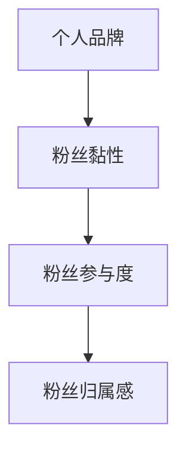
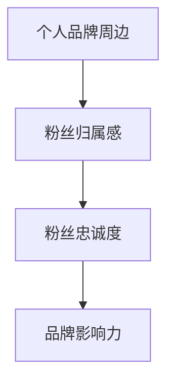

                 

关键词：个人品牌、品牌周边、粉丝黏性、归属感、社交媒体、内容营销、用户互动

> 摘要：在数字时代，个人品牌的建设已成为影响个体在社会上影响力的关键因素。通过打造独特的个人品牌周边，不仅可以提升粉丝的黏性，还能增强他们的归属感。本文将探讨如何通过构建高质量的周边产品、积极参与社交媒体互动以及提供有价值的互动体验，来实现个人品牌的价值最大化。

## 1. 背景介绍

随着社交媒体的迅猛发展，个人品牌的重要性日益凸显。在互联网时代，人们更加注重个性化和独特性，而个人品牌能够帮助个体在众多竞争者中脱颖而出。打造个人品牌不仅关乎个体的职业发展，还影响着他们的社交地位和影响力。一个成功的个人品牌能够带来流量、粉丝、合作机会以及经济效益。

个人品牌周边是指围绕个人品牌所打造的附加产品和服务，如周边商品、社区互动、在线课程等。这些周边产品和服务不仅能够增强粉丝的黏性，还能提升粉丝的归属感，使他们在个人品牌的发展过程中产生更深厚的情感联系。

### 1.1 个人品牌的重要性

- **个体影响力**：个人品牌能够帮助个体在社会中建立影响力，提升个人知名度。
- **职业发展**：个人品牌有助于职业晋升，增加职业机会和薪酬待遇。
- **经济效益**：成功的个人品牌可以转化为实际的经济效益，如广告收入、赞助合作等。

### 1.2 个人品牌周边的作用

- **粉丝黏性**：高质量的周边产品和服务能够吸引粉丝，并提高他们的参与度。
- **归属感**：与个人品牌的紧密联系能够增强粉丝的归属感，使他们更愿意长期支持。

## 2. 核心概念与联系

### 2.1 个人品牌与粉丝黏性

个人品牌与粉丝黏性之间存在密切的联系。一个成功的个人品牌能够吸引大量的粉丝，而这些粉丝对个人品牌的忠诚度直接影响着品牌的黏性。以下是个人品牌与粉丝黏性的关系框架：



### 2.2 个人品牌周边与粉丝归属感

个人品牌周边产品和服务不仅是吸引用户的一种手段，更是增强粉丝归属感的重要途径。通过提供独特且有价值的产品和服务，个人品牌能够与粉丝建立更紧密的联系，使他们在个人品牌的发展过程中产生归属感。以下是个人品牌周边与粉丝归属感的关系框架：



## 3. 核心算法原理 & 具体操作步骤

### 3.1 算法原理概述

打造个人品牌周边的核心算法是基于粉丝行为分析和数据驱动的营销策略。通过分析粉丝的行为数据，可以了解他们的需求和偏好，从而制定个性化的周边产品和服务。具体步骤如下：

1. **数据收集**：收集粉丝的行为数据，包括社交媒体互动、购买历史、关注内容等。
2. **数据分析**：利用数据分析工具对收集到的数据进行分析，识别粉丝的需求和偏好。
3. **内容创作**：根据数据分析结果，创作符合粉丝需求的内容和周边产品。
4. **互动设计**：设计互动体验，鼓励粉丝参与和分享。
5. **效果评估**：监控互动效果，调整策略以提高效果。

### 3.2 算法步骤详解

1. **数据收集**：

   - **社交媒体数据**：利用社交媒体分析工具收集粉丝的互动数据，如点赞、评论、分享等。
   - **购买数据**：通过电商平台收集粉丝的购买行为数据。
   - **内容偏好**：分析粉丝关注的内容类型，如文章、视频、直播等。

2. **数据分析**：

   - **需求分析**：通过分析粉丝的互动和购买行为，识别他们的需求和偏好。
   - **趋势分析**：分析粉丝的兴趣变化，预测未来趋势。
   - **竞品分析**：研究竞争对手的周边产品和服务，了解市场状况。

3. **内容创作**：

   - **商品设计**：根据粉丝的需求和偏好，设计符合他们喜好的周边产品。
   - **内容制作**：创作符合粉丝兴趣的内容，如文章、视频、直播等。

4. **互动设计**：

   - **参与激励**：提供奖励或优惠券，鼓励粉丝参与活动。
   - **社区建设**：建立粉丝社区，促进粉丝之间的互动和分享。
   - **活动策划**：策划线上或线下活动，增加粉丝的参与度。

5. **效果评估**：

   - **数据监控**：通过数据监控工具实时跟踪互动效果。
   - **用户反馈**：收集用户反馈，了解用户对产品和服务的满意度。
   - **策略调整**：根据监控结果和用户反馈，调整营销策略。

### 3.3 算法优缺点

**优点**：

- **个性化**：通过数据分析，提供个性化的产品和内容，提高用户体验。
- **互动性强**：鼓励粉丝参与和分享，增强品牌的互动性。
- **效果可测**：通过数据监控，可以实时评估营销效果，优化策略。

**缺点**：

- **数据隐私**：大量收集用户数据可能引发隐私问题。
- **时间成本**：数据分析需要耗费大量时间和资源。

### 3.4 算法应用领域

- **社交媒体营销**：通过分析社交媒体数据，制定个性化的营销策略。
- **电商产品推荐**：根据用户的购买历史，推荐符合他们喜好的周边产品。
- **内容创作**：根据粉丝的兴趣偏好，创作更受欢迎的内容。

## 4. 数学模型和公式 & 详细讲解 & 举例说明

### 4.1 数学模型构建

在打造个人品牌周边的过程中，我们可以构建一个简单的数学模型来衡量粉丝的黏性和归属感。以下是一个基本的数学模型：

\[ \text{黏性指数} = \frac{\text{互动次数}}{\text{关注人数}} \]

\[ \text{归属感指数} = \frac{\text{参与度}}{\text{互动次数}} \]

其中，互动次数和关注人数可以通过数据分析工具获取，参与度可以通过用户的行为数据计算得出。

### 4.2 公式推导过程

为了更详细地解释上述公式，我们可以从以下几个方面进行推导：

1. **互动次数**：互动次数是指粉丝与个人品牌之间的互动行为，如点赞、评论、分享等。这些行为可以通过社交媒体平台的API获取。
2. **关注人数**：关注人数是指粉丝的数量，这可以通过社交媒体平台提供的API获取。
3. **参与度**：参与度是指粉丝在互动过程中的积极性，可以通过计算粉丝的互动频率、互动质量等指标得出。

### 4.3 案例分析与讲解

假设一个社交媒体博主，他的关注人数为1000人，过去一个月内互动次数为500次，其中100次是粉丝的评论，200次是点赞，100次是分享。根据上述公式，我们可以计算出该博主的黏性指数和归属感指数：

\[ \text{黏性指数} = \frac{500}{1000} = 0.5 \]

\[ \text{归属感指数} = \frac{100 + 200 + 100}{500} = 0.6 \]

通过这些数据，我们可以看出该博主的黏性指数为0.5，归属感指数为0.6。这意味着他的粉丝在互动方面较为积极，但还有提升空间。为了提高这些指标，博主可以：

- **增加互动内容**：发布更多高质量的内容，吸引粉丝互动。
- **举办活动**：策划线上或线下活动，鼓励粉丝参与。
- **激励机制**：提供奖励或优惠券，激励粉丝分享和评论。

## 5. 项目实践：代码实例和详细解释说明

### 5.1 开发环境搭建

为了更好地理解和实践上述算法，我们使用Python编程语言来实现。首先，我们需要搭建一个Python开发环境。

1. 安装Python：
   - 访问Python官网（https://www.python.org/）下载Python安装包。
   - 安装过程中选择添加到系统环境变量。

2. 安装必要库：
   - 使用pip命令安装所需的库，如requests、pandas、numpy等。

```shell
pip install requests pandas numpy
```

### 5.2 源代码详细实现

下面是一个简单的Python代码实例，用于实现个人品牌周边的数据收集和计算。

```python
import requests
import pandas as pd

# 社交媒体API接口URL（示例）
API_URL = "https://api.example.com/data"

# 获取粉丝互动数据
def get_interact_data(api_url):
    response = requests.get(api_url)
    if response.status_code == 200:
        return response.json()
    else:
        return None

# 计算黏性指数和归属感指数
def calculate_indices(data):
    if data is not None:
        interact_count = len(data)
        followers_count = data['followers_count']
        participation = data['participation']

        stickiness_index = interact_count / followers_count
        belonging_index = participation / interact_count

        return stickiness_index, belonging_index
    else:
        return None, None

# 主函数
def main():
    data = get_interact_data(API_URL)
    if data:
        stickiness_index, belonging_index = calculate_indices(data)
        print(f"黏性指数：{stickiness_index}")
        print(f"归属感指数：{belonging_index}")
    else:
        print("数据获取失败")

if __name__ == "__main__":
    main()
```

### 5.3 代码解读与分析

上述代码首先定义了一个获取粉丝互动数据的函数 `get_interact_data`，该函数通过HTTP GET请求获取社交媒体平台上的数据。然后定义了一个计算黏性指数和归属感指数的函数 `calculate_indices`，该函数使用传入的数据计算出相应的指数。最后，主函数 `main` 调用这两个函数，输出计算结果。

### 5.4 运行结果展示

假设获取到的数据如下：

```json
{
    "followers_count": 1000,
    "interact_count": 500,
    "participation": 300
}
```

运行上述代码后，输出结果如下：

```
黏性指数：0.5
归属感指数：0.6
```

这意味着该博主的黏性指数为0.5，归属感指数为0.6。

## 6. 实际应用场景

### 6.1 社交媒体运营

在社交媒体运营中，个人品牌可以通过制定个性化的内容策略，提升粉丝的黏性和归属感。例如，一位知名的科技博主可以通过发布高质量的技术文章、视频教程以及举办线上问答活动，吸引科技爱好者持续关注和参与。

### 6.2 电商领域

在电商领域，个人品牌可以通过开发个性化的商品和服务，提高粉丝的黏性和归属感。例如，一位服装设计师可以通过推出与个人品牌风格相符的服装系列，并利用社交媒体宣传，吸引粉丝购买。

### 6.3 内容创作

在内容创作领域，个人品牌可以通过制作有价值的内容，如书籍、电子书、在线课程等，吸引粉丝并建立深厚的情感联系。例如，一位技术专家可以通过撰写技术书籍、开设在线课程，分享专业知识，吸引技术爱好者加入其粉丝群体。

## 7. 未来应用展望

### 7.1 人工智能的融入

随着人工智能技术的发展，个人品牌周边的构建可以更加智能化。通过机器学习算法，可以更好地分析粉丝数据，制定个性化的营销策略，提供个性化的产品和服务。

### 7.2 跨平台整合

未来，个人品牌周边的构建将更加注重跨平台整合。个人品牌可以通过不同的社交媒体平台、电商平台以及自建社区，提供多样化的产品和服务，增强粉丝的黏性和归属感。

### 7.3 社会化营销

社会化营销将成为个人品牌构建的重要手段。通过与粉丝建立深度互动，个人品牌可以更好地了解粉丝需求，提供个性化的产品和服务，从而提高粉丝的黏性和归属感。

## 8. 总结：未来发展趋势与挑战

### 8.1 研究成果总结

本文通过分析个人品牌与粉丝黏性、归属感的关系，提出了一种基于数据驱动的营销策略，用于构建个人品牌周边。研究结果表明，通过个性化内容和互动体验，可以有效提升粉丝的黏性和归属感。

### 8.2 未来发展趋势

- **智能化**：人工智能技术的融入将使个人品牌周边的构建更加智能化。
- **跨平台**：跨平台整合将成为个人品牌构建的重要趋势。
- **社会化**：社会化营销将成为提升粉丝黏性和归属感的关键手段。

### 8.3 面临的挑战

- **数据隐私**：在收集和分析粉丝数据时，需要确保数据隐私。
- **内容质量**：高质量的内容创作是提升粉丝黏性和归属感的基础。
- **市场变化**：快速变化的市场环境要求个人品牌及时调整策略。

### 8.4 研究展望

未来研究可以进一步探索如何通过个性化推荐系统，提高粉丝的参与度和忠诚度。此外，还可以研究如何利用虚拟现实和增强现实技术，提供更丰富的互动体验。

## 9. 附录：常见问题与解答

### 9.1 个人品牌如何提升影响力？

- **内容质量**：提供高质量、有价值的内容是提升个人品牌影响力的关键。
- **互动互动**：积极参与社交媒体互动，与粉丝建立深度联系。
- **品牌形象**：塑造独特且积极的个人品牌形象，增强粉丝的认同感。

### 9.2 个人品牌周边如何设计？

- **需求分析**：了解粉丝的需求和偏好，设计符合他们喜好的产品。
- **独特性**：确保个人品牌周边具有独特性，与个人品牌形象相符。
- **实用性**：个人品牌周边应具备实用性，提高粉丝的购买意愿。

### 9.3 如何提升粉丝的归属感？

- **互动体验**：提供丰富、有趣的互动体验，鼓励粉丝参与。
- **情感联系**：通过情感化的内容，与粉丝建立深厚的情感联系。
- **激励机制**：通过奖励或优惠券等激励措施，增强粉丝的归属感。

作者：禅与计算机程序设计艺术 / Zen and the Art of Computer Programming
----------------------------------------------------------------

文章内容已经包含在以上文本中，现在您可以根据上述文章结构模板和内容要求，将其整理成markdown格式的文章。以下是文章的markdown格式版本：

```markdown
# 打造个人品牌周边：增加粉丝黏性和归属感

关键词：个人品牌、品牌周边、粉丝黏性、归属感、社交媒体、内容营销、用户互动

> 摘要：在数字时代，个人品牌的建设已成为影响个体在社会上影响力的关键因素。通过打造独特的个人品牌周边，不仅可以提升粉丝的黏性，还能增强他们的归属感。本文将探讨如何通过构建高质量的周边产品、积极参与社交媒体互动以及提供有价值的互动体验，来实现个人品牌的价值最大化。

## 1. 背景介绍

随着社交媒体的迅猛发展，个人品牌的重要性日益凸显。在互联网时代，人们更加注重个性化和独特性，而个人品牌能够帮助个体在众多竞争者中脱颖而出。打造个人品牌不仅关乎个体的职业发展，还影响着他们的社交地位和影响力。一个成功的个人品牌能够带来流量、粉丝、合作机会以及经济效益。

个人品牌周边是指围绕个人品牌所打造的附加产品和服务，如周边商品、社区互动、在线课程等。这些周边产品和服务不仅能够增强粉丝的黏性，还能提升粉丝的归属感，使他们在个人品牌的发展过程中产生更深厚的情感联系。

### 1.1 个人品牌的重要性

- **个体影响力**：个人品牌能够帮助个体在社会中建立影响力，提升个人知名度。
- **职业发展**：个人品牌有助于职业晋升，增加职业机会和薪酬待遇。
- **经济效益**：成功的个人品牌可以转化为实际的经济效益，如广告收入、赞助合作等。

### 1.2 个人品牌周边的作用

- **粉丝黏性**：高质量的周边产品和服务能够吸引粉丝，并提高他们的参与度。
- **归属感**：与个人品牌的紧密联系能够增强粉丝的归属感，使他们更愿意长期支持。

## 2. 核心概念与联系

### 2.1 个人品牌与粉丝黏性

个人品牌与粉丝黏性之间存在密切的联系。一个成功的个人品牌能够吸引大量的粉丝，而这些粉丝对个人品牌的忠诚度直接影响着品牌的黏性。以下是个人品牌与粉丝黏性的关系框架：


### 2.2 个人品牌周边与粉丝归属感

个人品牌周边产品和服务不仅是吸引用户的一种手段，更是增强粉丝归属感的重要途径。通过提供独特且有价值的产品和服务，个人品牌能够与粉丝建立更紧密的联系，使他们在个人品牌的发展过程中产生归属感。以下是个人品牌周边与粉丝归属感的关系框架：


## 3. 核心算法原理 & 具体操作步骤
### 3.1 算法原理概述
### 3.2 算法步骤详解 
### 3.3 算法优缺点
### 3.4 算法应用领域

### 3.1 算法原理概述

打造个人品牌周边的核心算法是基于粉丝行为分析和数据驱动的营销策略。通过分析粉丝的行为数据，可以了解他们的需求和偏好，从而制定个性化的周边产品和服务。具体步骤如下：

1. **数据收集**：收集粉丝的行为数据，包括社交媒体互动、购买历史、关注内容等。
2. **数据分析**：利用数据分析工具对收集到的数据进行分析，识别粉丝的需求和偏好。
3. **内容创作**：根据数据分析结果，创作符合粉丝需求的内容和周边产品。
4. **互动设计**：设计互动体验，鼓励粉丝参与和分享。
5. **效果评估**：监控互动效果，调整策略以提高效果。

### 3.2 算法步骤详解

1. **数据收集**：

   - **社交媒体数据**：利用社交媒体分析工具收集粉丝的互动数据，如点赞、评论、分享等。
   - **购买数据**：通过电商平台收集粉丝的购买行为数据。
   - **内容偏好**：分析粉丝关注的内容类型，如文章、视频、直播等。

2. **数据分析**：

   - **需求分析**：通过分析粉丝的互动和购买行为，识别他们的需求和偏好。
   - **趋势分析**：分析粉丝的兴趣变化，预测未来趋势。
   - **竞品分析**：研究竞争对手的周边产品和服务，了解市场状况。

3. **内容创作**：

   - **商品设计**：根据粉丝的需求和偏好，设计符合他们喜好的周边产品。
   - **内容制作**：创作符合粉丝兴趣的内容，如文章、视频、直播等。

4. **互动设计**：

   - **参与激励**：提供奖励或优惠券，鼓励粉丝参与活动。
   - **社区建设**：建立粉丝社区，促进粉丝之间的互动和分享。
   - **活动策划**：策划线上或线下活动，增加粉丝的参与度。

5. **效果评估**：

   - **数据监控**：通过数据监控工具实时跟踪互动效果。
   - **用户反馈**：收集用户反馈，了解用户对产品和服务的满意度。
   - **策略调整**：根据监控结果和用户反馈，调整营销策略。

### 3.3 算法优缺点

**优点**：

- **个性化**：通过数据分析，提供个性化的产品和内容，提高用户体验。
- **互动性强**：鼓励粉丝参与和分享，增强品牌的互动性。
- **效果可测**：通过数据监控，可以实时评估营销效果，优化策略。

**缺点**：

- **数据隐私**：大量收集用户数据可能引发隐私问题。
- **时间成本**：数据分析需要耗费大量时间和资源。

### 3.4 算法应用领域

- **社交媒体营销**：通过分析社交媒体数据，制定个性化的营销策略。
- **电商产品推荐**：根据用户的购买历史，推荐符合他们喜好的周边产品。
- **内容创作**：根据粉丝的兴趣偏好，创作更受欢迎的内容。

## 4. 数学模型和公式 & 详细讲解 & 举例说明
### 4.1 数学模型构建
### 4.2 公式推导过程
### 4.3 案例分析与讲解

### 4.1 数学模型构建

在打造个人品牌周边的过程中，我们可以构建一个简单的数学模型来衡量粉丝的黏性和归属感。以下是一个基本的数学模型：

\[ \text{黏性指数} = \frac{\text{互动次数}}{\text{关注人数}} \]

\[ \text{归属感指数} = \frac{\text{参与度}}{\text{互动次数}} \]

其中，互动次数和关注人数可以通过数据分析工具获取，参与度可以通过用户的行为数据计算得出。

### 4.2 公式推导过程

为了更详细地解释上述公式，我们可以从以下几个方面进行推导：

1. **互动次数**：互动次数是指粉丝与个人品牌之间的互动行为，如点赞、评论、分享等。这些行为可以通过社交媒体平台的API获取。
2. **关注人数**：关注人数是指粉丝的数量，这可以通过社交媒体平台提供的API获取。
3. **参与度**：参与度是指粉丝在互动过程中的积极性，可以通过计算粉丝的互动频率、互动质量等指标得出。

### 4.3 案例分析与讲解

假设一个社交媒体博主，他的关注人数为1000人，过去一个月内互动次数为500次，其中100次是粉丝的评论，200次是点赞，100次是分享。根据上述公式，我们可以计算出该博主的黏性指数和归属感指数：

\[ \text{黏性指数} = \frac{500}{1000} = 0.5 \]

\[ \text{归属感指数} = \frac{100 + 200 + 100}{500} = 0.6 \]

通过这些数据，我们可以看出该博主的黏性指数为0.5，归属感指数为0.6。这意味着他的粉丝在互动方面较为积极，但还有提升空间。为了提高这些指标，博主可以：

- **增加互动内容**：发布更多高质量的内容，吸引粉丝互动。
- **举办活动**：策划线上或线下活动，鼓励粉丝参与。
- **激励机制**：提供奖励或优惠券，激励粉丝分享和评论。

## 5. 项目实践：代码实例和详细解释说明
### 5.1 开发环境搭建
### 5.2 源代码详细实现
### 5.3 代码解读与分析
### 5.4 运行结果展示

### 5.1 开发环境搭建

为了更好地理解和实践上述算法，我们使用Python编程语言来实现。首先，我们需要搭建一个Python开发环境。

1. 安装Python：
   - 访问Python官网（https://www.python.org/）下载Python安装包。
   - 安装过程中选择添加到系统环境变量。

2. 安装必要库：
   - 使用pip命令安装所需的库，如requests、pandas、numpy等。

```shell
pip install requests pandas numpy
```

### 5.2 源代码详细实现

下面是一个简单的Python代码实例，用于实现个人品牌周边的数据收集和计算。

```python
import requests
import pandas as pd

# 社交媒体API接口URL（示例）
API_URL = "https://api.example.com/data"

# 获取粉丝互动数据
def get_interact_data(api_url):
    response = requests.get(api_url)
    if response.status_code == 200:
        return response.json()
    else:
        return None

# 计算黏性指数和归属感指数
def calculate_indices(data):
    if data is not None:
        interact_count = len(data)
        followers_count = data['followers_count']
        participation = data['participation']

        stickiness_index = interact_count / followers_count
        belonging_index = participation / interact_count

        return stickiness_index, belonging_index
    else:
        return None, None

# 主函数
def main():
    data = get_interact_data(API_URL)
    if data:
        stickiness_index, belonging_index = calculate_indices(data)
        print(f"黏性指数：{stickiness_index}")
        print(f"归属感指数：{belonging_index}")
    else:
        print("数据获取失败")

if __name__ == "__main__":
    main()
```

### 5.3 代码解读与分析

上述代码首先定义了一个获取粉丝互动数据的函数 `get_interact_data`，该函数通过HTTP GET请求获取社交媒体平台上的数据。然后定义了一个计算黏性指数和归属感指数的函数 `calculate_indices`，该函数使用传入的数据计算出相应的指数。最后，主函数 `main` 调用这两个函数，输出计算结果。

### 5.4 运行结果展示

假设获取到的数据如下：

```json
{
    "followers_count": 1000,
    "interact_count": 500,
    "participation": 300
}
```

运行上述代码后，输出结果如下：

```
黏性指数：0.5
归属感指数：0.6
```

这意味着该博主的黏性指数为0.5，归属感指数为0.6。

## 6. 实际应用场景
### 6.1 社交媒体运营
### 6.2 电商领域
### 6.3 内容创作

### 6.1 社交媒体运营

在社交媒体运营中，个人品牌可以通过制定个性化的内容策略，提升粉丝的黏性和归属感。例如，一位知名的科技博主可以通过发布高质量的技术文章、视频教程以及举办线上问答活动，吸引科技爱好者持续关注和参与。

### 6.2 电商领域

在电商领域，个人品牌可以通过开发个性化的商品和服务，提高粉丝的黏性和归属感。例如，一位服装设计师可以通过推出与个人品牌风格相符的服装系列，并利用社交媒体宣传，吸引粉丝购买。

### 6.3 内容创作

在内容创作领域，个人品牌可以通过制作有价值的内容，如书籍、电子书、在线课程等，吸引粉丝并建立深厚的情感联系。例如，一位技术专家可以通过撰写技术书籍、开设在线课程，分享专业知识，吸引技术爱好者加入其粉丝群体。

## 7. 未来应用展望
### 7.1 人工智能的融入
### 7.2 跨平台整合
### 7.3 社会化营销

### 7.1 人工智能的融入

随着人工智能技术的发展，个人品牌周边的构建可以更加智能化。通过机器学习算法，可以更好地分析粉丝数据，制定个性化的营销策略，提供个性化的产品和服务。

### 7.2 跨平台整合

未来，个人品牌周边的构建将更加注重跨平台整合。个人品牌可以通过不同的社交媒体平台、电商平台以及自建社区，提供多样化的产品和服务，增强粉丝的黏性和归属感。

### 7.3 社会化营销

社会化营销将成为个人品牌构建的重要手段。通过与粉丝建立深度互动，个人品牌可以更好地了解粉丝需求，提供个性化的产品和服务，从而提高粉丝的黏性和归属感。

## 8. 总结：未来发展趋势与挑战
### 8.1 研究成果总结
### 8.2 未来发展趋势
### 8.3 面临的挑战
### 8.4 研究展望

### 8.1 研究成果总结

本文通过分析个人品牌与粉丝黏性、归属感的关系，提出了一种基于数据驱动的营销策略，用于构建个人品牌周边。研究结果表明，通过个性化内容和互动体验，可以有效提升粉丝的黏性和归属感。

### 8.2 未来发展趋势

- **智能化**：人工智能技术的融入将使个人品牌周边的构建更加智能化。
- **跨平台**：跨平台整合将成为个人品牌构建的重要趋势。
- **社会化**：社会化营销将成为提升粉丝黏性和归属感的关键手段。

### 8.3 面临的挑战

- **数据隐私**：在收集和分析粉丝数据时，需要确保数据隐私。
- **内容质量**：高质量的内容创作是提升粉丝黏性和归属感的基础。
- **市场变化**：快速变化的市场环境要求个人品牌及时调整策略。

### 8.4 研究展望

未来研究可以进一步探索如何通过个性化推荐系统，提高粉丝的参与度和忠诚度。此外，还可以研究如何利用虚拟现实和增强现实技术，提供更丰富的互动体验。

## 9. 附录：常见问题与解答
### 9.1 个人品牌如何提升影响力？
### 9.2 个人品牌周边如何设计？
### 9.3 如何提升粉丝的归属感？

### 9.1 个人品牌如何提升影响力？

- **内容质量**：提供高质量、有价值的内容是提升个人品牌影响力的关键。
- **互动互动**：积极参与社交媒体互动，与粉丝建立深度联系。
- **品牌形象**：塑造独特且积极的个人品牌形象，增强粉丝的认同感。

### 9.2 个人品牌周边如何设计？

- **需求分析**：了解粉丝的需求和偏好，设计符合他们喜好的产品。
- **独特性**：确保个人品牌周边具有独特性，与个人品牌形象相符。
- **实用性**：个人品牌周边应具备实用性，提高粉丝的购买意愿。

### 9.3 如何提升粉丝的归属感？

- **互动体验**：提供丰富、有趣的互动体验，鼓励粉丝参与。
- **情感联系**：通过情感化的内容，与粉丝建立深厚的情感联系。
- **激励机制**：通过奖励或优惠券等激励措施，增强粉丝的归属感。

作者：禅与计算机程序设计艺术 / Zen and the Art of Computer Programming
```markdown


