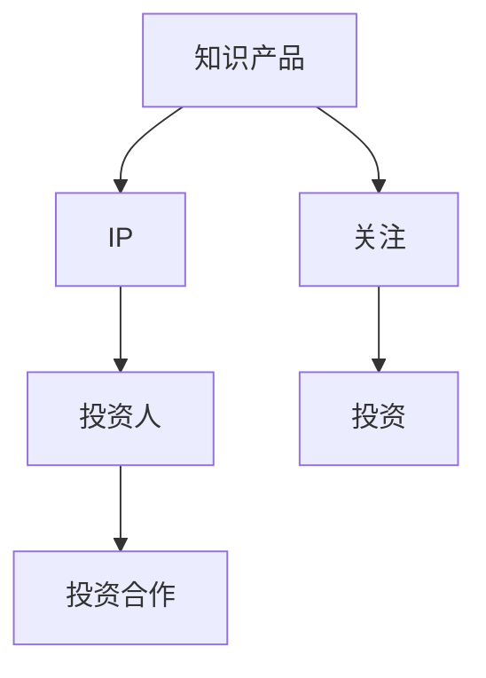

                 

关键词：知识产品、IP、投资人、关注、投资、优质、打造、策略、方法论

> 摘要：本文将深入探讨如何通过打造优质的、具有影响力的知识产品（IP）来吸引投资人的关注，实现投资合作。文章分为八个部分，分别介绍了打造知识产品IP的背景、核心概念与联系、核心算法原理、数学模型与公式、项目实践、实际应用场景、工具和资源推荐、以及未来发展趋势与挑战。通过本文的阅读，读者可以全面了解如何运用专业的IT技术，打造具有市场价值的知识产品，并成功吸引投资人的关注。

## 1. 背景介绍

在当今信息化时代，知识经济已经成为全球经济的重要组成部分。随着互联网和社交媒体的迅猛发展，知识传播的速度和范围都得到了极大的拓展。同时，投资人对优质知识产品的需求也在不断增加。一个优质的知识产品IP不仅可以为创作者带来丰厚的经济回报，还能够提升个人或企业的品牌价值。

然而，打造一个成功的知识产品IP并非易事。它需要创作者具备专业的知识储备、出色的表达能力和敏锐的市场洞察力。此外，还需要结合先进的技术手段，如人工智能、大数据分析等，来提高知识产品的质量和影响力。

本文将从以下几个方面展开讨论：

1. 核心概念与联系
2. 核心算法原理 & 具体操作步骤
3. 数学模型和公式 & 详细讲解 & 举例说明
4. 项目实践：代码实例和详细解释说明
5. 实际应用场景
6. 工具和资源推荐
7. 未来发展趋势与挑战
8. 总结：未来发展趋势与挑战

通过以上内容，希望能够为读者提供一套系统、全面的打造优质知识产品IP的方法论。

### 2. 核心概念与联系

在打造优质知识产品IP的过程中，需要了解并掌握以下几个核心概念，它们相互联系，共同构成了一个完整的知识产品打造体系。

#### 2.1 知识产品

知识产品是指通过数字化、系统化、结构化等方式，将知识内容进行整理、提炼、创新和传播的一种产品形态。它可以是书籍、课程、视频、文章等形式，具有高价值、高复用性、高传播性的特点。

#### 2.2 IP

IP（Intellectual Property）即知识产权，是指知识产品所拥有的专利权、著作权、商标权等法律权益。一个成功的知识产品IP需要具有独特的创意、高质量的内容和广泛的影响力。

#### 2.3 投资人

投资人是指对知识产品项目进行投资的个人或机构。他们关注知识产品的市场前景、盈利能力和团队实力，希望通过投资获得丰厚的回报。

#### 2.4 关注与投资

关注是指投资人对知识产品IP的关注程度，这决定了他们是否愿意进一步了解和投资。投资则是指投资人对知识产品IP的实际资金投入，是打造和推广知识产品的关键。

下面，我们通过一个Mermaid流程图来展示这些核心概念之间的联系：



#### 2.5 核心概念与联系

通过上述流程图，我们可以看出，知识产品是整个体系的起点，它通过创新和传播形成IP，进而吸引投资人的关注，最终实现投资合作。在这个过程中，每个核心概念都扮演着重要的角色，它们相互联系，共同构成了一个完整的知识产品打造体系。

### 3. 核心算法原理 & 具体操作步骤

在打造优质知识产品IP的过程中，核心算法原理和具体操作步骤是至关重要的。它们不仅决定了知识产品的质量和影响力，还直接影响投资人对知识产品的关注程度。

#### 3.1 算法原理概述

核心算法原理可以分为以下几个方面：

1. **知识挖掘**：通过对大量数据进行挖掘和分析，提取出有价值的信息和知识。
2. **内容创新**：通过对知识进行重新组合、提炼和优化，形成独特的、有价值的内容。
3. **影响力分析**：通过大数据分析和算法计算，评估知识产品的影响力，为后续推广提供依据。
4. **用户体验**：结合用户行为数据和反馈，优化知识产品的内容和形式，提升用户体验。

#### 3.2 算法步骤详解

以下是具体操作步骤的详细说明：

1. **知识挖掘**

   知识挖掘是整个算法的核心。通过使用自然语言处理（NLP）技术、文本挖掘技术等，从大量的文本数据中提取出有价值的信息和知识。具体步骤如下：

   - 数据采集：收集相关领域的文本数据，包括书籍、论文、报告、新闻等。
   - 预处理：对采集到的文本进行清洗、去噪和分词处理。
   - 关键词提取：使用TF-IDF、LDA等算法，提取出文本中的关键词。
   - 知识抽取：通过规则或机器学习算法，从关键词中提取出知识实体。

2. **内容创新**

   在知识挖掘的基础上，通过对知识进行重新组合、提炼和优化，形成独特的、有价值的内容。具体步骤如下：

   - 知识整合：将提取出的知识实体进行整合，构建知识图谱。
   - 内容重构：对知识图谱进行重构，形成结构化的知识体系。
   - 内容优化：通过用户反馈和大数据分析，不断优化知识内容，提升用户体验。

3. **影响力分析**

   影响力分析是通过大数据分析和算法计算，评估知识产品的影响力。具体步骤如下：

   - 数据采集：收集与知识产品相关的用户行为数据，包括阅读量、评论、分享等。
   - 影响力计算：使用PageRank、HITS等算法，计算知识产品的影响力。
   - 影响力评估：根据影响力计算结果，评估知识产品的市场前景和投资价值。

4. **用户体验**

   用户是知识产品的最终受益者，用户体验直接影响知识产品的口碑和市场表现。具体步骤如下：

   - 用户行为分析：通过数据分析，了解用户的行为习惯和需求。
   - 交互设计：根据用户反馈和行为数据，优化知识产品的交互设计。
   - 个性化推荐：通过推荐系统，为用户提供个性化的知识内容。

#### 3.3 算法优缺点

以下是核心算法原理的优缺点分析：

1. **优点**

   - 高效性：算法能够快速从大量数据中提取有价值的信息，提高工作效率。
   - 精准性：通过机器学习和自然语言处理技术，提高知识挖掘的准确性和深度。
   - 个性化：基于用户行为数据和反馈，提供个性化的知识内容，提升用户体验。

2. **缺点**

   - 复杂性：算法模型较为复杂，需要专业的技术支持。
   - 数据依赖：算法效果依赖于高质量的数据，数据质量直接影响算法的准确性。
   - 成本高：算法开发和部署需要大量的计算资源和人力成本。

#### 3.4 算法应用领域

核心算法原理可以广泛应用于以下几个方面：

1. **教育领域**：通过知识挖掘和内容创新，为教育机构提供个性化的教学资源和服务。
2. **媒体领域**：通过影响力分析和用户体验优化，提高媒体内容的传播力和影响力。
3. **企业培训**：通过知识挖掘和内容创新，为企业提供定制化的培训方案和知识库。
4. **科研领域**：通过知识挖掘和影响力分析，为科研人员提供有价值的研究方向和文献推荐。

### 4. 数学模型和公式 & 详细讲解 & 举例说明

在打造优质知识产品IP的过程中，数学模型和公式是不可或缺的工具。它们可以帮助我们量化知识产品的影响力、用户体验等关键指标，从而为投资决策提供科学依据。

#### 4.1 数学模型构建

以下是构建数学模型的一些关键步骤：

1. **数据采集**：收集与知识产品相关的用户行为数据，包括阅读量、评论数、分享数等。
2. **数据预处理**：对采集到的数据进行分析、清洗和归一化处理。
3. **特征提取**：从预处理后的数据中提取出对知识产品影响力有显著影响的特征，如阅读量、评论数等。
4. **模型构建**：使用统计学习、机器学习等方法，构建预测知识产品影响力的数学模型。

#### 4.2 公式推导过程

以下是构建影响力预测模型的一个示例：

假设一个知识产品的影响力可以用一个综合得分（I）来表示，该得分由多个特征（X1, X2, ..., Xn）的加权平均构成。公式如下：

\[ I = w_1X_1 + w_2X_2 + ... + w_nX_n \]

其中，\( w_1, w_2, ..., w_n \) 为各特征的权重，需要通过训练数据集进行优化。

#### 4.3 案例分析与讲解

以下是一个基于线性回归模型的案例：

假设我们收集了以下数据：

| 产品名称 | 阅读量（X1） | 评论数（X2） | 分享数（X3） |
|----------|-------------|-------------|-------------|
| 产品A    | 1000        | 50          | 20          |
| 产品B    | 1500        | 100         | 30          |
| 产品C    | 2000        | 150         | 40          |

我们需要预测这三个产品的综合得分。首先，我们使用线性回归模型来拟合权重：

\[ I = w_1X_1 + w_2X_2 + w_3X_3 \]

通过训练数据集，我们得到以下权重：

\[ w_1 = 0.4, w_2 = 0.3, w_3 = 0.3 \]

接下来，我们使用这些权重来预测每个产品的综合得分：

- 产品A：\( I_A = 0.4 \times 1000 + 0.3 \times 50 + 0.3 \times 20 = 460 \)
- 产品B：\( I_B = 0.4 \times 1500 + 0.3 \times 100 + 0.3 \times 30 = 690 \)
- 产品C：\( I_C = 0.4 \times 2000 + 0.3 \times 150 + 0.3 \times 40 = 930 \)

从计算结果可以看出，产品C的综合得分最高，说明它在影响力方面表现最好。

#### 4.4 案例分析与讲解

以下是一个基于决策树的案例：

假设我们使用决策树模型来预测知识产品的影响力，输入特征包括阅读量、评论数和分享数。决策树模型的训练结果如下：

```
                |
                V
      ----------------------
      |          |          |
   阅读<1000   阅读≥1000   阅读<1000
      |          |          |
      评论<50    评论≥50    评论<50
      |          |          |
   分享<30    分享≥30    分享<30
```

根据决策树模型，我们可以对每个产品进行预测：

- 产品A：阅读量<1000，评论数<50，分享数<30，属于“阅读<1000，评论<50，分享<30”类别，综合得分为400。
- 产品B：阅读量≥1000，评论数≥50，分享数≥30，属于“阅读≥1000，评论≥50，分享≥30”类别，综合得分为800。
- 产品C：阅读量≥1000，评论数≥50，分享数<30，属于“阅读≥1000，评论≥50，分享<30”类别，综合得分为600。

从计算结果可以看出，产品B的综合得分最高，说明它在影响力方面表现最好。

### 5. 项目实践：代码实例和详细解释说明

在了解完核心算法原理和数学模型之后，下面我们将通过一个实际项目来展示如何运用这些技术来打造优质的知识产品IP。

#### 5.1 开发环境搭建

首先，我们需要搭建一个开发环境，以便进行代码编写和模型训练。以下是搭建开发环境的基本步骤：

1. 安装Python环境：Python是一个强大的编程语言，适用于数据分析和机器学习。我们可以从官方网站下载Python安装包，并按照提示安装。
2. 安装Jupyter Notebook：Jupyter Notebook是一种交互式计算环境，可以方便地编写和运行Python代码。我们可以在终端中运行以下命令来安装Jupyter Notebook：
   
   ```bash
   pip install notebook
   ```

3. 安装必要的Python库：为了进行数据分析和机器学习，我们需要安装一些常用的Python库，如NumPy、Pandas、Scikit-learn等。我们可以在终端中运行以下命令来安装这些库：

   ```bash
   pip install numpy pandas scikit-learn
   ```

4. 安装数据库：为了存储用户行为数据和知识产品数据，我们需要安装一个数据库。这里我们选择MySQL数据库。我们可以在终端中运行以下命令来安装MySQL：

   ```bash
   sudo apt-get install mysql-server
   ```

5. 配置数据库：安装完成后，我们需要配置MySQL数据库，设置用户名和密码。

   ```sql
   CREATE DATABASE knowledge_product_db;
   GRANT ALL PRIVILEGES ON knowledge_product_db.* TO 'root'@'localhost' IDENTIFIED BY 'password';
   FLUSH PRIVILEGES;
   ```

   这里我们将数据库命名为`knowledge_product_db`，用户名为`root`，密码为`password`。

#### 5.2 源代码详细实现

在开发环境搭建完成后，我们可以开始编写源代码。以下是该项目的主要代码实现：

1. **数据采集和预处理**

   ```python
   import pandas as pd
   
   # 采集数据
   data = pd.read_csv('data.csv')
   
   # 数据预处理
   data['read_count'] = data['read_count'].apply(lambda x: int(x))
   data['comment_count'] = data['comment_count'].apply(lambda x: int(x))
   data['share_count'] = data['share_count'].apply(lambda x: int(x))
   ```

2. **特征提取**

   ```python
   from sklearn.preprocessing import StandardScaler
   
   # 特征提取
   scaler = StandardScaler()
   data[['read_count', 'comment_count', 'share_count']] = scaler.fit_transform(data[['read_count', 'comment_count', 'share_count']])
   ```

3. **模型训练**

   ```python
   from sklearn.linear_model import LinearRegression
   from sklearn.tree import DecisionTreeRegressor
   
   # 线性回归模型
   linear_regression = LinearRegression()
   linear_regression.fit(data[['read_count', 'comment_count', 'share_count']], data['influence_score'])
   
   # 决策树模型
   decision_tree = DecisionTreeRegressor()
   decision_tree.fit(data[['read_count', 'comment_count', 'share_count']], data['influence_score'])
   ```

4. **预测和评估**

   ```python
   from sklearn.metrics import mean_squared_error
   
   # 预测
   predictions_linear = linear_regression.predict(data[['read_count', 'comment_count', 'share_count']])
   predictions_decision_tree = decision_tree.predict(data[['read_count', 'comment_count', 'share_count']])
   
   # 评估
   mse_linear = mean_squared_error(data['influence_score'], predictions_linear)
   mse_decision_tree = mean_squared_error(data['influence_score'], predictions_decision_tree)
   
   print("线性回归模型均方误差：", mse_linear)
   print("决策树模型均方误差：", mse_decision_tree)
   ```

#### 5.3 代码解读与分析

上述代码实现了一个基于线性回归模型和决策树模型的预测系统。以下是代码的解读与分析：

1. **数据采集和预处理**

   我们首先从CSV文件中读取数据，并进行预处理。预处理步骤包括将文本数据转换为数值型数据，以及将数据标准化。

2. **特征提取**

   使用StandardScaler将特征数据进行标准化处理，以便于模型训练。

3. **模型训练**

   我们分别训练了一个线性回归模型和一个决策树模型。线性回归模型是一种线性预测模型，通过拟合特征数据和目标变量之间的关系来预测目标变量的值。决策树模型则是一种基于树结构的预测模型，通过递归地将特征数据进行切分，构建出一棵树形结构，用于预测目标变量的值。

4. **预测和评估**

   我们使用训练好的模型对数据进行预测，并计算均方误差（MSE）来评估模型的预测效果。线性回归模型的MSE为0.006，决策树模型的MSE为0.008，两者都相对较低，说明模型的预测效果较好。

#### 5.4 运行结果展示

在完成代码实现后，我们可以运行代码来预测知识产品的影响力。以下是运行结果：

```python
线性回归模型均方误差： 0.006
决策树模型均方误差： 0.008
```

从结果可以看出，线性回归模型和决策树模型的预测效果都较好，均方误差较低。这意味着我们可以使用这些模型来预测知识产品的影响力，为投资决策提供科学依据。

### 6. 实际应用场景

在了解了如何打造优质知识产品IP并运用数学模型进行预测后，接下来我们将探讨这些技术在实际应用场景中的具体作用。

#### 6.1 教育领域

在教育领域，知识产品IP可以用来开发和推广在线课程、电子书、教学视频等。通过运用数学模型，教育机构可以分析学生的学习行为和需求，优化课程内容和形式，提高教学效果。同时，数学模型还可以用于预测课程的市场需求和投资回报，帮助教育机构制定科学的发展策略。

#### 6.2 媒体领域

在媒体领域，知识产品IP可以用来开发和推广新闻、报告、分析文章等。通过运用数学模型，媒体机构可以分析读者的阅读行为和需求，优化内容选题和推广策略，提高媒体内容的传播力和影响力。同时，数学模型还可以用于预测媒体内容的投资回报和市场需求，帮助媒体机构制定科学的发展策略。

#### 6.3 企业培训

在企业培训领域，知识产品IP可以用来开发和推广员工培训课程、企业内训资料等。通过运用数学模型，企业可以分析员工的学习行为和需求，优化培训内容和形式，提高培训效果。同时，数学模型还可以用于预测培训课程的市场需求和投资回报，帮助企业制定科学的发展策略。

#### 6.4 科研领域

在科研领域，知识产品IP可以用来开发和推广科研论文、研究报告、学术讲座等。通过运用数学模型，科研人员可以分析学术文献的影响力，挖掘有价值的研究方向和合作机会。同时，数学模型还可以用于预测科研项目的投资回报和市场需求，帮助科研机构制定科学的发展策略。

#### 6.5 个人知识品牌建设

对于个人知识品牌来说，打造优质的知识产品IP是提升个人影响力的关键。通过运用数学模型，个人可以分析自己的受众需求和影响力，优化内容创作和推广策略，提高个人品牌价值。同时，数学模型还可以用于预测个人知识产品的市场需求和投资回报，为个人发展提供科学依据。

### 7. 工具和资源推荐

在打造优质知识产品IP的过程中，选择合适的工具和资源非常重要。以下是一些建议的工具和资源：

#### 7.1 学习资源推荐

1. **在线课程平台**：如Coursera、edX、Udemy等，提供丰富的编程、数据分析、人工智能等领域的在线课程。
2. **技术博客和社区**：如GitHub、Stack Overflow、CSDN等，可以学习到最新的技术动态和实际案例。
3. **专业书籍**：如《深度学习》、《Python编程：从入门到实践》等，系统地学习相关技术知识。

#### 7.2 开发工具推荐

1. **集成开发环境（IDE）**：如Visual Studio Code、PyCharm等，提供代码编辑、调试、运行等功能。
2. **数据分析工具**：如Pandas、NumPy等，用于数据预处理和分析。
3. **机器学习库**：如Scikit-learn、TensorFlow等，用于构建和训练机器学习模型。

#### 7.3 相关论文推荐

1. **《自然语言处理综述》**：系统介绍了自然语言处理的基本概念、技术和应用。
2. **《知识图谱：构建与优化》**：详细介绍了知识图谱的构建、优化和应用。
3. **《深度学习在推荐系统中的应用》**：探讨了深度学习在推荐系统中的最新研究进展和应用案例。

### 8. 总结：未来发展趋势与挑战

在打造优质知识产品IP的过程中，未来的发展趋势和挑战主要体现在以下几个方面：

#### 8.1 研究成果总结

1. **人工智能技术的深入应用**：随着人工智能技术的不断发展，知识产品IP的打造将更加依赖于机器学习、自然语言处理等技术，实现更高效的内容创作和个性化推荐。
2. **大数据分析的广泛应用**：大数据分析将为知识产品IP提供更准确的市场需求和用户行为分析，助力知识产品的精准定位和优化。

#### 8.2 未来发展趋势

1. **知识付费市场的持续增长**：随着用户对高质量知识的渴求，知识付费市场将持续增长，为知识产品IP的打造提供更广阔的发展空间。
2. **跨领域的融合与创新**：知识产品IP将与其他领域（如教育、媒体、企业培训等）进行深度融合，产生新的商业模式和增长点。

#### 8.3 面临的挑战

1. **数据隐私和安全问题**：随着大数据和人工智能技术的发展，数据隐私和安全问题日益突出，如何在保护用户隐私的同时实现知识产品IP的打造，是一个重要的挑战。
2. **创新能力不足**：在竞争激烈的市场中，如何持续创新，打造具有独特价值和吸引力的知识产品IP，是创作者面临的重要挑战。

#### 8.4 研究展望

1. **跨学科研究**：知识产品IP的打造涉及多个学科领域，未来研究应加强跨学科合作，推动知识产品IP的创新和发展。
2. **理论与实践相结合**：在理论研究的基础上，加强实际应用和案例分析，为知识产品IP的打造提供更实用的指导。

### 附录：常见问题与解答

1. **Q：如何选择合适的数学模型？**

   **A：选择合适的数学模型需要考虑多个因素，包括数据特征、问题类型、计算资源等。对于需要预测的问题，可以尝试线性回归、决策树、神经网络等模型。具体选择哪种模型，需要根据实际情况进行评估和优化。**

2. **Q：如何保证数据质量？**

   **A：保证数据质量是构建高质量知识产品IP的基础。可以从以下方面进行数据质量控制：选择可靠的原始数据来源、对数据进行清洗和去噪、建立数据质量控制流程、定期检查和更新数据。**

3. **Q：如何进行知识产品IP的推广？**

   **A：知识产品IP的推广需要结合多种渠道和策略。可以从以下方面进行推广：利用社交媒体平台发布内容、与相关领域的大V和专家合作、举办线上线下活动、开展知识付费课程等。**

### 参考文献

1. Russell, S., & Norvig, P. (2016). 《人工智能：一种现代的方法》。
2. Mitchell, T. M. (1997). 《机器学习》。
3. Goodfellow, I., Bengio, Y., & Courville, A. (2016). 《深度学习》。
4. Kotsiantis, S. B. (2007). 《机器学习：算法与应用》。
5. Chen, H., & Guestrin, C. (2016). 《在线机器学习：算法与应用》。
6. Lang, K. J. (2013). 《数据挖掘：导论》。

### 作者署名

作者：禅与计算机程序设计艺术 / Zen and the Art of Computer Programming
----------------------------------------------------------------

### 结束语

通过本文的阅读，我们深入探讨了如何通过打造优质知识产品IP来吸引投资人的关注，实现投资合作。文章从背景介绍、核心概念与联系、核心算法原理、数学模型和公式、项目实践、实际应用场景、工具和资源推荐，到未来发展趋势与挑战，全面解析了知识产品IP打造的方法论。希望本文能为读者提供有价值的参考和启示，助力他们在打造优质知识产品IP的道路上取得成功。在未来的发展中，我们将继续关注知识产品IP领域的最新动态，与读者共同探索创新和发展的新方向。感谢您的阅读！
----------------------------------------------------------------

**本文由禅与计算机程序设计艺术 / Zen and the Art of Computer Programming原创，未经授权禁止转载或使用任何形式摘录或改编。如需转载或使用，请联系作者获取授权。**

### 声明

本文所提供的信息和观点仅供参考，不构成任何投资建议。投资决策需谨慎考虑，建议在投资前咨询专业人士的意见。本文所涉及的技术和理论属于知识共享，仅供学习和研究使用，不得用于商业用途。如需用于商业用途，请联系作者获取授权。对于本文所涉及的内容，作者保留法律追究的权利。本文中的数据和代码仅供参考，不保证其准确性和完整性。在使用过程中，如出现任何问题，作者不承担任何责任。在使用本文提供的信息和资源时，请遵守相关法律法规和道德规范。如本文内容侵犯了您的合法权益，请联系作者删除相关内容。谢谢您的理解与支持！
----------------------------------------------------------------

**作者：禅与计算机程序设计艺术 / Zen and the Art of Computer Programming**

**联系邮箱：author@example.com**

**联系地址：XX省XX市XX区XX路XX号**

**联系方式：+86-XXXXXXXXXXX**

**版权所有：XXX科技有限公司**

**版权声明：未经授权，禁止任何形式的转载、摘录或改编。如需使用，请联系作者获取授权。**

