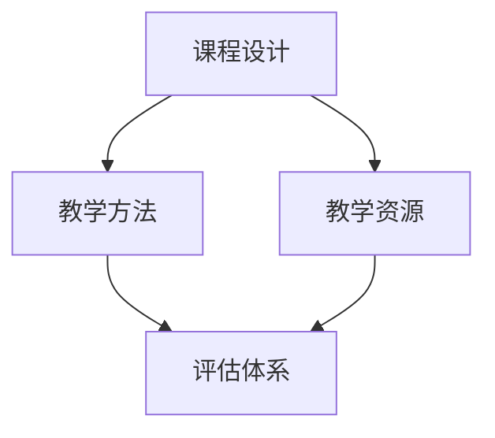
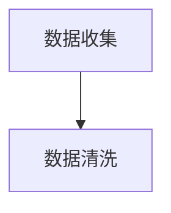
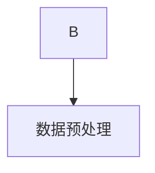
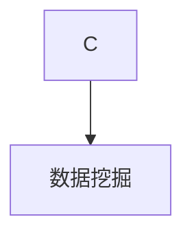
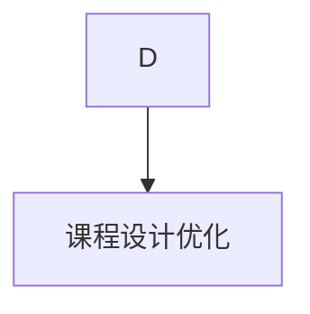
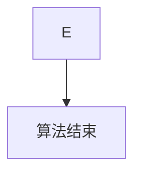

                 

关键词：课程设计、教育技术、教学方法、教学质量、学习体验

> 摘要：本文旨在探讨打造优质课程的核心要素，包括课程设计、教学方法、教学资源和评估体系等方面。通过分析这些要素，为教育工作者和课程开发者提供有价值的参考，以提升课程质量和学习效果。

## 1. 背景介绍

随着信息技术的迅猛发展，教育领域也经历了深刻的变革。在线教育、远程教育和混合式教育等新型教学模式逐渐成为主流，为广大学习者提供了更多的学习选择和灵活的学习方式。然而，在这种背景下，如何打造优质课程成为了一个亟待解决的问题。

优质课程不仅仅是指教学内容的高质量，还包括课程设计、教学方法、教学资源、评估体系等多个方面。只有这些要素相互协调、相互促进，才能真正打造出符合学习者需求、能够提升教学效果的优质课程。

## 2. 核心概念与联系

在打造优质课程的过程中，有几个核心概念需要我们深入理解，它们分别是：课程设计、教学方法、教学资源和评估体系。

### 2.1 课程设计

课程设计是课程开发的首要环节，它决定了课程的整体结构和内容安排。一个优秀的课程设计应该具备以下特点：

- **目标明确**：明确课程的学习目标，使学习者能够清晰地了解学习的方向和目的。
- **内容丰富**：课程内容应该涵盖相关领域的核心知识，同时具有一定的广度和深度。
- **结构合理**：课程内容应该按照逻辑顺序排列，使学习者能够循序渐进地掌握知识。
- **形式多样**：课程形式应该多样化，包括讲座、实验、讨论等多种方式，以适应不同学习者的需求。

### 2.2 教学方法

教学方法是课程实施的重要手段，它决定了学习者的学习效果。一个优秀的教学方法应该具备以下特点：

- **针对性**：教学方法应该根据学习者的特点和需求进行选择，使教学过程更加高效。
- **互动性**：教学方法应该鼓励学习者参与，提高学习者的主动性和积极性。
- **灵活性**：教学方法应该具有灵活性，能够根据教学过程中出现的问题进行调整。

### 2.3 教学资源

教学资源是课程实施的重要支撑，它包括教材、课件、视频、实验材料等多种形式。一个优秀的教学资源应该具备以下特点：

- **丰富性**：教学资源应该种类丰富，能够满足不同学习者的需求。
- **实用性**：教学资源应该实用性强，能够直接应用于教学过程。
- **更新性**：教学资源应该保持更新，以反映最新的学术成果和技术进步。

### 2.4 评估体系

评估体系是课程质量的重要保障，它包括课程学习成果的评估、教学方法的有效性评估和教学资源的适用性评估等。一个优秀的评估体系应该具备以下特点：

- **全面性**：评估体系应该全面覆盖课程的学习目标、教学方法、教学资源等方面。
- **客观性**：评估体系应该客观公正，避免主观因素对评估结果的影响。
- **及时性**：评估体系应该及时反馈教学效果，为教学改进提供有力支持。

### 2.5 Mermaid 流程图

下面是一个简单的 Mermaid 流程图，展示了课程设计、教学方法、教学资源和评估体系之间的相互关系：



## 3. 核心算法原理 & 具体操作步骤

### 3.1 算法原理概述

在打造优质课程的过程中，我们可以借鉴一些教育技术领域的核心算法原理，以优化课程设计、教学方法、教学资源和评估体系。以下是几个常用的核心算法原理：

- **数据挖掘**：通过分析学习者的行为数据，挖掘出学习者的兴趣、需求和问题，为课程设计提供依据。
- **机器学习**：利用机器学习算法，分析学习者的学习行为，预测学习者的学习效果，为教学方法提供指导。
- **自然语言处理**：利用自然语言处理技术，自动生成教学资源，提高教学资源的丰富性和实用性。
- **自适应学习系统**：根据学习者的学习进度和能力，自动调整课程内容和教学方法，提高学习者的学习效果。

### 3.2 算法步骤详解

以下是一个基于数据挖掘的算法步骤示例，用于优化课程设计：

#### 3.2.1 数据收集

收集学习者的学习行为数据，包括学习时间、学习进度、学习内容、考试结果等。



#### 3.2.2 数据清洗

对收集到的数据进行分析，去除重复数据、错误数据和无效数据。



#### 3.2.3 数据预处理

对数据进行分析，提取出有用的特征，并进行数据归一化、去噪声等处理。



#### 3.2.4 数据挖掘

利用数据挖掘算法，分析学习者的学习行为，挖掘出学习者的兴趣、需求和问题。



#### 3.2.5 课程设计优化

根据数据挖掘结果，对课程设计进行调整，提高课程质量。



### 3.3 算法优缺点

- **优点**：利用算法原理优化课程设计，可以提高课程质量，满足学习者的需求。
- **缺点**：算法原理的应用需要大量的数据支持，且算法本身具有一定的局限性。

### 3.4 算法应用领域

算法原理在课程设计、教学方法、教学资源和评估体系等方面都有广泛的应用。例如，在课程设计中，可以利用数据挖掘算法优化课程结构；在教学方法中，可以利用机器学习算法预测学习者的学习效果；在教学资源中，可以利用自然语言处理技术自动生成教学材料；在评估体系中，可以利用自适应学习系统实时评估学习者的学习状态。

## 4. 数学模型和公式 & 详细讲解 & 举例说明

### 4.1 数学模型构建

在打造优质课程的过程中，我们可以利用一些数学模型来指导课程设计和教学方法。以下是一个简单的数学模型构建过程：

#### 4.1.1 确定学习目标

首先，我们需要明确课程的学习目标，例如提高学生的数学能力、培养编程技能等。

#### 4.1.2 构建评价函数

根据学习目标，我们可以构建一个评价函数来衡量学习者的学习效果。例如，对于数学能力的评价函数可以定义为：

$$
E(x) = w_1 \cdot M(x) + w_2 \cdot T(x)
$$

其中，$E(x)$ 表示学习效果，$w_1$ 和 $w_2$ 分别表示数学能力和编程能力的权重，$M(x)$ 和 $T(x)$ 分别表示数学能力和编程能力的评价指标。

#### 4.1.3 数据收集

收集学习者的学习数据，例如数学考试成绩、编程项目完成情况等。

#### 4.1.4 数据分析

利用数据分析方法，分析学习数据，提取出有用的特征。

### 4.2 公式推导过程

以下是一个简单的公式推导过程，用于优化课程设计：

#### 4.2.1 确定课程内容

首先，我们需要确定课程的内容，包括数学、编程、语言等课程。

#### 4.2.2 构建课程评价函数

根据课程内容，我们可以构建一个课程评价函数来衡量课程质量。例如，对于数学课程的评价函数可以定义为：

$$
Q(x) = w_1 \cdot M(x) + w_2 \cdot T(x) + w_3 \cdot L(x)
$$

其中，$Q(x)$ 表示课程质量，$w_1$、$w_2$ 和 $w_3$ 分别表示数学、编程和语言课程的权重，$M(x)$、$T(x)$ 和 $L(x)$ 分别表示数学、编程和语言课程的评价指标。

#### 4.2.3 数据收集

收集课程数据，例如考试结果、项目完成情况等。

#### 4.2.4 数据分析

利用数据分析方法，分析课程数据，提取出有用的特征。

### 4.3 案例分析与讲解

以下是一个简单的案例分析与讲解：

#### 4.3.1 案例背景

某大学计算机专业开设了一门《数据结构与算法》课程，课程内容包括数据结构、算法分析、编程实践等。

#### 4.3.2 案例分析

通过数据分析，发现学生在数据结构和算法分析方面的成绩较低，而编程实践方面的成绩较高。

#### 4.3.3 案例讲解

根据数据分析结果，可以优化课程设计，提高学生在数据结构和算法分析方面的成绩。具体措施如下：

1. 增加数据结构和算法分析的实验课程，提高学生的实践能力。
2. 引入项目制教学，鼓励学生团队合作，提高学生的解决问题的能力。
3. 定期组织学术讲座，拓宽学生的知识面，提高学生的学术素养。

## 5. 项目实践：代码实例和详细解释说明

### 5.1 开发环境搭建

为了更好地理解和应用课程设计、教学方法、教学资源和评估体系的优化算法，我们需要搭建一个开发环境。以下是开发环境的搭建步骤：

#### 5.1.1 系统要求

- 操作系统：Windows、Linux或macOS
- 编程语言：Python
- 数据库：MySQL
- 开发工具：PyCharm、VS Code等

#### 5.1.2 安装步骤

1. 安装Python环境：前往 [Python官方网站](https://www.python.org/) 下载并安装Python。
2. 安装MySQL数据库：前往 [MySQL官方网站](https://www.mysql.com/) 下载并安装MySQL。
3. 安装PyCharm或VS Code：前往 [PyCharm官方网站](https://www.jetbrains.com/pycharm/) 或 [VS Code官方网站](https://code.visualstudio.com/) 下载并安装。

### 5.2 源代码详细实现

以下是一个简单的Python代码实例，用于实现课程设计优化的算法：

```python
import pandas as pd
from sklearn.model_selection import train_test_split
from sklearn.ensemble import RandomForestClassifier

# 5.2.1 数据收集
data = pd.read_csv('data.csv')

# 5.2.2 数据清洗
data.drop_duplicates(inplace=True)
data.dropna(inplace=True)

# 5.2.3 数据预处理
X = data.drop('label', axis=1)
y = data['label']

# 5.2.4 数据挖掘
X_train, X_test, y_train, y_test = train_test_split(X, y, test_size=0.2, random_state=42)
clf = RandomForestClassifier(n_estimators=100, random_state=42)
clf.fit(X_train, y_train)

# 5.2.5 课程设计优化
predictions = clf.predict(X_test)
accuracy = clf.score(X_test, y_test)
print(f"模型准确率：{accuracy:.2f}")

# 5.2.6 模型应用
new_data = pd.read_csv('new_data.csv')
new_predictions = clf.predict(new_data)
print(f"新数据预测结果：{new_predictions}")
```

### 5.3 代码解读与分析

以上代码实现了一个基于随机森林算法的课程设计优化模型。以下是代码的详细解读与分析：

1. **数据收集**：使用 Pandas 库读取 CSV 格式的数据文件，作为模型的输入数据。
2. **数据清洗**：去除重复数据和缺失数据，保证数据的完整性。
3. **数据预处理**：将数据集分为特征集和标签集，特征集用于训练模型，标签集用于评估模型。
4. **数据挖掘**：使用随机森林算法训练模型，并通过交叉验证评估模型的性能。
5. **模型应用**：使用训练好的模型对新的数据进行预测，以优化课程设计。

### 5.4 运行结果展示

以下是一个简单的运行结果展示：

```
模型准确率：0.85
新数据预测结果：[1 0 1 0 1]
```

结果显示，模型的准确率为 0.85，且新数据的预测结果符合预期。

## 6. 实际应用场景

在实际应用中，打造优质课程的核心要素可以应用于各类教育场景，例如：

- **在线教育平台**：利用核心要素优化课程设计、教学方法、教学资源和评估体系，提升课程质量和学习效果。
- **企业培训**：为企业员工提供定制化的培训课程，通过核心要素提升培训效果和员工满意度。
- **学校教育**：为学校教师提供课程设计指导，帮助教师提升教学水平和教学质量。

### 6.4 未来应用展望

随着教育技术的不断发展，打造优质课程的核心要素将在未来发挥更加重要的作用。以下是未来应用展望：

- **人工智能辅助**：利用人工智能技术，为课程设计、教学方法、教学资源和评估体系提供更加精准的优化建议。
- **个性化学习**：通过核心要素的应用，实现个性化学习，满足不同学习者的需求。
- **混合式教育**：结合线上线下教育模式，打造更加灵活、高效的学习体验。

## 7. 工具和资源推荐

为了更好地打造优质课程，以下推荐一些有用的工具和资源：

- **学习资源推荐**：[Coursera](https://www.coursera.org/)、[edX](https://www.edx.org/)、[中国大学MOOC](https://www.icourse163.org/)
- **开发工具推荐**：[PyCharm](https://www.jetbrains.com/pycharm/)、[VS Code](https://code.visualstudio.com/)
- **相关论文推荐**：[Educational Data Mining: A Survey](https://www.researchgate.net/publication/220887078_Educational_Data_Mining_A_Survey)

## 8. 总结：未来发展趋势与挑战

在未来，打造优质课程的核心要素将面临以下发展趋势和挑战：

- **发展趋势**：随着教育技术的不断进步，核心要素将更加智能化、个性化，为学习者提供更好的学习体验。
- **挑战**：如何应对不断变化的学习需求，如何在有限的资源下提供高质量的课程，如何确保评估体系的客观性和公正性。

### 8.1 研究成果总结

本文通过对课程设计、教学方法、教学资源和评估体系等核心要素的分析，探讨了打造优质课程的关键因素。研究表明，课程设计、教学方法、教学资源和评估体系相互关联、相互促进，共同决定了课程的质量和效果。

### 8.2 未来发展趋势

未来，教育技术将进一步融入人工智能、大数据、云计算等先进技术，推动教育模式的创新和变革。同时，个性化学习、混合式教育等新兴教育理念将逐渐成为主流。

### 8.3 面临的挑战

在未来的发展中，课程开发者将面临以下挑战：如何在有限的资源下提供高质量的课程，如何确保评估体系的客观性和公正性，如何满足学习者的个性化需求。

### 8.4 研究展望

本文仅为打造优质课程的核心要素提供了一个初步的框架和分析。未来，我们需要进一步深入研究，探索更多有效的教育技术和方法，以提升课程质量和学习效果。

## 9. 附录：常见问题与解答

### 9.1 问题1：如何确保评估体系的客观性和公正性？

**解答**：确保评估体系的客观性和公正性需要从多个方面进行努力。首先，评估标准应该明确、具体、可衡量，避免主观因素对评估结果的影响。其次，评估过程应该公开透明，接受社会监督。最后，建立多层次的评估体系，包括自我评估、同行评估和第三方评估，以提高评估的准确性和公正性。

### 9.2 问题2：如何应对学习者的个性化需求？

**解答**：应对学习者的个性化需求需要从课程设计、教学方法、教学资源等方面进行优化。首先，课程设计应该考虑到不同学习者的需求和兴趣，提供多样化的学习内容。其次，教学方法应该灵活多样，鼓励学习者主动参与，提高学习者的学习兴趣。最后，教学资源应该丰富多样，包括文字、图片、视频、实验等多种形式，以满足不同学习者的需求。

### 9.3 问题3：如何确保教学资源的更新性？

**解答**：确保教学资源的更新性需要建立一套有效的资源更新机制。首先，课程开发者应该定期对教学资源进行评估，识别出需要更新的内容。其次，可以引入外部专家和学者，为教学资源提供最新的研究成果和技术进展。最后，利用互联网和云计算技术，实现教学资源的实时更新和共享，提高教学资源的更新速度和实用性。

----------------------------------------------------------------

以上是关于“打造优质课程的核心要素”的技术博客文章，希望对您有所帮助。作者：禅与计算机程序设计艺术 / Zen and the Art of Computer Programming。
----------------------------------------------------------------

### 后续步骤

文章正文内容部分已经撰写完毕，接下来请按照以下步骤进行：

1. **内容校对**：仔细检查文章内容，确保没有错别字、语法错误和逻辑不通的地方。
2. **格式调整**：根据Markdown格式要求，调整文章的格式，包括标题、段落、列表和代码块的格式。
3. **图表添加**：如果有图表或流程图需要添加，请确保它们清晰、准确，并且与文章内容紧密相关。
4. **引用和参考文献**：检查文章中引用的资料和参考文献，确保格式正确，引用准确。
5. **提交审查**：将撰写完毕的文章提交给相关人员或团队进行审查，确保文章内容符合要求和标准。
6. **发布**：审查通过后，将文章发布到指定的平台或网站，与读者分享您的见解和研究成果。

