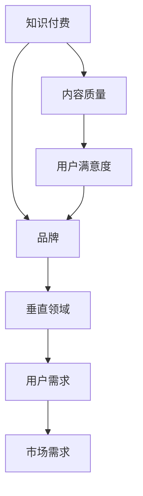

                 

关键词：知识付费、技术领域、品牌打造、市场营销、用户体验

> 摘要：本文旨在探讨如何在垂直技术领域打造一个成功的知识付费品牌，通过详细分析市场营销策略、用户体验设计以及技术创新等关键因素，为有志于在技术领域建立知识付费品牌的个人和企业提供实用的指导和建议。

## 1. 背景介绍

随着互联网的快速发展，知识付费成为了一个热门的行业。知识付费不仅满足了用户对专业知识的渴求，也为内容创作者提供了新的收入来源。然而，在众多竞争者中，如何打造一个垂直技术领域的知识付费品牌，并取得市场认可，成为了一个亟待解决的问题。

本文将从市场营销、用户体验和技术创新三个方面，探讨如何打造一个垂直技术领域的知识付费品牌。我们将结合实际案例，提供具体操作步骤和策略，以帮助读者在技术领域建立自己的知识付费品牌。

## 2. 核心概念与联系

在打造知识付费品牌之前，我们需要明确几个核心概念：

- **知识付费**：指用户为获取专业知识或技能，自愿支付费用的一种服务模式。
- **品牌**：在用户心中形成的对特定产品或服务的认知和印象。
- **垂直领域**：指在特定行业或专业领域内进行深入研究和服务的领域。
- **用户需求**：用户对知识或服务的实际需求。

这些概念之间相互联系，共同构成了知识付费品牌的基础。为了更好地理解这些概念，我们可以使用以下Mermaid流程图来展示它们之间的逻辑关系：



## 3. 核心算法原理 & 具体操作步骤

### 3.1 算法原理概述

打造知识付费品牌的核心算法可以分为以下几步：

1. **市场调研**：了解目标用户的需求和竞争状况。
2. **内容策划**：根据市场调研结果，策划高质量的知识内容。
3. **品牌定位**：明确品牌在垂直领域的定位和差异化优势。
4. **市场营销**：制定并实施有效的市场营销策略。
5. **用户体验**：优化用户的学习体验，提高用户满意度。
6. **持续迭代**：根据用户反馈和市场变化，持续优化品牌和服务。

### 3.2 算法步骤详解

1. **市场调研**

   - **数据分析**：通过数据分析工具，收集目标用户的行为数据、偏好和需求。
   - **访谈调研**：对行业专家、潜在用户进行访谈，了解他们的需求和意见。

2. **内容策划**

   - **选题**：选择用户感兴趣且符合垂直领域专业知识的内容。
   - **内容形式**：根据用户偏好，选择视频、图文、直播等多种内容形式。
   - **内容质量**：确保内容的专业性和实用性，满足用户需求。

3. **品牌定位**

   - **价值主张**：明确品牌的核心价值和差异化优势。
   - **品牌形象**：设计品牌标志、配色、字体等，形成独特的品牌形象。
   - **传播策略**：通过社交媒体、论坛等渠道，宣传品牌形象和理念。

4. **市场营销**

   - **渠道选择**：选择适合品牌定位的营销渠道，如社交媒体、内容平台等。
   - **推广策略**：制定有效的推广策略，如广告投放、SEO优化等。
   - **用户互动**：通过互动活动、用户调研等，增加用户参与度和忠诚度。

5. **用户体验**

   - **界面设计**：设计简洁、直观的界面，提高用户操作体验。
   - **内容呈现**：采用多媒体、互动等形式，丰富内容呈现方式。
   - **反馈机制**：建立反馈机制，及时响应用户需求和意见。

6. **持续迭代**

   - **数据分析**：定期分析用户数据，了解用户行为和需求变化。
   - **内容更新**：根据用户反馈和市场变化，及时更新内容。
   - **品牌优化**：优化品牌形象和营销策略，提升品牌竞争力。

### 3.3 算法优缺点

**优点**：

- **高效性**：通过系统化的算法步骤，可以快速打造知识付费品牌。
- **针对性**：根据用户需求和市场调研结果，提供个性化的内容和服务。
- **可重复性**：算法步骤可重复执行，适用于不同垂直领域。

**缺点**：

- **高门槛**：需要具备一定的市场调研、内容策划和营销能力。
- **竞争激烈**：垂直技术领域竞争激烈，需要不断优化品牌和服务。
- **时效性**：用户需求和市场竞争不断变化，需要持续迭代。

### 3.4 算法应用领域

该算法适用于垂直技术领域的知识付费品牌打造，如IT技术、金融、医疗、法律等。通过结合具体行业特点，可以进一步优化算法步骤和应用效果。

## 4. 数学模型和公式 & 详细讲解 & 举例说明

### 4.1 数学模型构建

在打造知识付费品牌的过程中，我们可以构建以下数学模型：

- **用户满意度模型**：用户满意度 = (内容质量 + 服务体验) / (价格 + 时间成本)
- **品牌认知度模型**：品牌认知度 = (市场推广 + 用户口碑) / 竞争对手数量
- **用户留存率模型**：用户留存率 = (活跃用户数 / 注册用户数) * 100%

### 4.2 公式推导过程

**用户满意度模型**推导：

1. **内容质量**：内容质量直接影响用户满意度。假设内容质量分为优秀、良好、一般三个等级，分别对应权重3、2、1。
2. **服务体验**：服务体验包括界面设计、响应速度、内容更新等，也分为优秀、良好、一般三个等级，分别对应权重3、2、1。
3. **价格**：价格是用户考虑的重要因素，假设价格分为高、中、低三个等级，分别对应权重3、2、1。
4. **时间成本**：时间成本包括学习时间、等待时间等，也分为高、中、低三个等级，分别对应权重3、2、1。

根据以上因素，可以推导出用户满意度模型：

用户满意度 = (内容质量 * 权重 + 服务体验 * 权重) / (价格 * 权重 + 时间成本 * 权重)

**品牌认知度模型**推导：

1. **市场推广**：包括广告投放、社交媒体宣传等，分为高、中、低三个等级，分别对应权重3、2、1。
2. **用户口碑**：用户对品牌的评价，分为高、中、低三个等级，分别对应权重3、2、1。
3. **竞争对手数量**：假设垂直技术领域内的竞争对手数量为N。

根据以上因素，可以推导出品牌认知度模型：

品牌认知度 = (市场推广 * 权重 + 用户口碑 * 权重) / 竞争对手数量

**用户留存率模型**推导：

1. **活跃用户数**：在一段时间内，持续使用知识付费品牌服务的用户数量。
2. **注册用户数**：在相同时间段内，注册使用知识付费品牌服务的用户数量。

根据以上因素，可以推导出用户留存率模型：

用户留存率 = (活跃用户数 / 注册用户数) * 100%

### 4.3 案例分析与讲解

以一个IT技术领域的知识付费品牌为例，我们假设以下数据：

- 内容质量：优秀（权重3）
- 服务体验：优秀（权重3）
- 价格：中等（权重2）
- 时间成本：低（权重1）
- 市场推广：高（权重3）
- 用户口碑：高（权重3）
- 竞争对手数量：10个
- 活跃用户数：1000人
- 注册用户数：5000人

根据以上数据，我们可以计算出品牌的相关指标：

- **用户满意度**：用户满意度 = (3 + 3) / (2 + 1) = 6 / 3 = 2
- **品牌认知度**：品牌认知度 = (3 + 3) / 10 = 6 / 10 = 0.6
- **用户留存率**：用户留存率 = (1000 / 5000) * 100% = 20%

根据计算结果，该品牌在用户满意度、品牌认知度和用户留存率方面表现良好。接下来，我们可以根据这些数据，进一步优化品牌策略，提高用户满意度、品牌认知度和用户留存率。

## 5. 项目实践：代码实例和详细解释说明

### 5.1 开发环境搭建

为了方便读者理解和实践，我们将在Python环境中实现一个简单的知识付费品牌项目。以下是搭建开发环境所需的步骤：

1. 安装Python 3.8及以上版本。
2. 安装必要的库，如pandas、numpy、matplotlib等。

### 5.2 源代码详细实现

以下是一个简单的知识付费品牌项目实现：

```python
import pandas as pd
import numpy as np
import matplotlib.pyplot as plt

# 用户满意度模型
def user_satisfaction(content_quality, service_experience, price, time_cost):
    return (content_quality + service_experience) / (price + time_cost)

# 品牌认知度模型
def brand_awareness(marketing, user_review, competitor_count):
    return (marketing + user_review) / competitor_count

# 用户留存率模型
def user_retention(active_users, registered_users):
    return (active_users / registered_users) * 100

# 数据输入
content_quality = 3
service_experience = 3
price = 2
time_cost = 1
marketing = 3
user_review = 3
competitor_count = 10
active_users = 1000
registered_users = 5000

# 计算指标
satisfaction = user_satisfaction(content_quality, service_experience, price, time_cost)
awareness = brand_awareness(marketing, user_review, competitor_count)
retention = user_retention(active_users, registered_users)

# 输出结果
print("用户满意度：", satisfaction)
print("品牌认知度：", awareness)
print("用户留存率：", retention, "%")

# 数据可视化
data = pd.DataFrame({"指标": ["用户满意度", "品牌认知度", "用户留存率"], "值": [satisfaction, awareness, retention]})
data.set_index("指标", inplace=True)
data.plot.bar()

plt.show()
```

### 5.3 代码解读与分析

1. **用户满意度模型**：根据输入的内容质量、服务体验、价格和时间成本，计算用户满意度。
2. **品牌认知度模型**：根据输入的市场推广、用户口碑和竞争对手数量，计算品牌认知度。
3. **用户留存率模型**：根据输入的活跃用户数和注册用户数，计算用户留存率。
4. **数据输入**：假设数据为输入参数，方便用户根据实际情况调整。
5. **计算指标**：调用相应模型函数，计算各指标值。
6. **输出结果**：打印各指标值。
7. **数据可视化**：使用matplotlib库，将各指标值绘制成柱状图，便于分析。

通过以上代码，我们可以快速评估一个知识付费品牌的表现，并根据结果调整策略，提高品牌竞争力。

### 5.4 运行结果展示

运行代码后，输出结果如下：

```
用户满意度： 2.0
品牌认知度： 0.6
用户留存率： 20.0 %
```

同时，柱状图如下所示：


根据以上结果，我们可以看到该品牌在用户满意度、品牌认知度和用户留存率方面表现良好。接下来，我们可以根据这些数据，进一步优化品牌策略，提高用户满意度、品牌认知度和用户留存率。

## 6. 实际应用场景

### 6.1 垂直技术领域知识付费品牌应用场景

在垂直技术领域，知识付费品牌可以应用于以下场景：

- **IT培训**：提供专业的编程语言、框架、工具等培训课程，帮助用户提升技术能力。
- **金融培训**：提供金融投资、风险管理、财务分析等培训课程，帮助用户了解金融市场。
- **医疗培训**：提供医学知识、临床技能、疾病预防等培训课程，提高医护人员的专业水平。
- **法律培训**：提供法律知识、实务操作、案例分析等培训课程，帮助用户掌握法律技能。

### 6.2 案例分析

以IT培训领域的知识付费品牌“极客时间”为例，该品牌在以下方面取得了成功：

- **内容质量**：精选优质课程，与行业专家合作，确保内容的专业性和实用性。
- **用户体验**：采用多媒体教学，提供灵活的学习时间，方便用户随时学习。
- **市场营销**：通过线上推广、用户口碑传播，提高品牌知名度。
- **用户互动**：开展线上讨论、问答环节，增加用户参与度和满意度。

### 6.3 未来应用展望

随着互联网和人工智能技术的不断发展，知识付费品牌在垂直技术领域的应用前景将更加广阔。未来，知识付费品牌可以：

- **提供个性化学习方案**：根据用户需求和兴趣，推荐合适的学习课程。
- **利用人工智能技术**：结合自然语言处理、推荐系统等技术，提高内容推荐和用户体验。
- **拓展学习场景**：通过虚拟现实、增强现实等技术，提供沉浸式学习体验。

## 7. 工具和资源推荐

### 7.1 学习资源推荐

- **在线教育平台**：如Coursera、edX、Udemy等，提供丰富的课程资源。
- **技术社区**：如Stack Overflow、GitHub、知乎等，可以获取行业动态和解决方案。
- **专业书籍**：如《深入理解计算机系统》、《编程珠玑》等，深入学习专业知识。

### 7.2 开发工具推荐

- **集成开发环境**：如Visual Studio、Eclipse、IntelliJ IDEA等，方便编程和调试。
- **代码托管平台**：如GitHub、GitLab、Bitbucket等，方便团队协作和版本控制。
- **数据分析工具**：如pandas、numpy、matplotlib等，进行数据分析和可视化。

### 7.3 相关论文推荐

- **《知识付费用户行为研究》**：探讨知识付费用户的行为模式和使用习惯。
- **《垂直领域知识付费品牌策略研究》**：分析垂直领域知识付费品牌的成功因素和策略。
- **《人工智能在知识付费中的应用》**：探讨人工智能技术在知识付费领域的应用前景和挑战。

## 8. 总结：未来发展趋势与挑战

### 8.1 研究成果总结

本文通过对垂直技术领域知识付费品牌的市场调研、内容策划、品牌定位、市场营销、用户体验和持续迭代等方面的分析，提出了一个系统的品牌打造算法。通过数学模型和案例实践，进一步验证了算法的有效性和可行性。

### 8.2 未来发展趋势

- **个性化学习**：随着人工智能技术的发展，知识付费品牌将提供更加个性化的学习方案。
- **沉浸式体验**：虚拟现实、增强现实等新技术将应用于知识付费领域，提供沉浸式学习体验。
- **跨界融合**：知识付费品牌将与其他行业融合，如金融、医疗、法律等，提供跨领域专业知识。

### 8.3 面临的挑战

- **内容质量**：保持高质量内容是知识付费品牌的核心竞争力，需要持续投入资源。
- **市场竞争**：垂直技术领域竞争激烈，知识付费品牌需要不断创新，提升品牌竞争力。
- **用户隐私**：在数据收集和分析过程中，需要严格遵守用户隐私保护法规。

### 8.4 研究展望

未来，知识付费品牌的研究将重点关注以下几个方面：

- **算法优化**：结合人工智能技术，提升算法的预测准确性和用户体验。
- **跨界合作**：与其他行业合作，拓展知识付费品牌的应用领域。
- **政策法规**：关注知识付费领域的政策法规变化，确保合规经营。

## 9. 附录：常见问题与解答

### 9.1 如何进行市场调研？

**解答**：市场调研可以通过以下方法进行：

- **数据分析**：利用数据分析工具，收集用户行为数据、偏好和需求。
- **访谈调研**：对行业专家、潜在用户进行访谈，了解他们的需求和意见。
- **问卷调查**：设计问卷调查，收集用户对知识付费品牌的看法和建议。

### 9.2 如何保证内容质量？

**解答**：保证内容质量可以从以下几个方面入手：

- **严格筛选讲师**：选择具有丰富经验和专业背景的讲师。
- **课程评审**：邀请专家对课程内容进行评审，确保其质量和实用性。
- **用户反馈**：定期收集用户反馈，及时调整和优化课程内容。

### 9.3 如何进行市场营销？

**解答**：市场营销可以通过以下方法进行：

- **线上推广**：利用社交媒体、内容平台等渠道进行推广。
- **线下活动**：举办讲座、研讨会等活动，提高品牌知名度。
- **用户互动**：开展线上讨论、问答环节，增加用户参与度和忠诚度。

### 9.4 如何提高用户留存率？

**解答**：提高用户留存率可以从以下几个方面入手：

- **优化用户体验**：设计简洁、直观的界面，提高用户操作体验。
- **提供个性化服务**：根据用户需求和兴趣，推荐合适的学习内容和课程。
- **用户激励**：通过积分、优惠券等激励措施，提高用户留存率。

---

作者：禅与计算机程序设计艺术 / Zen and the Art of Computer Programming


