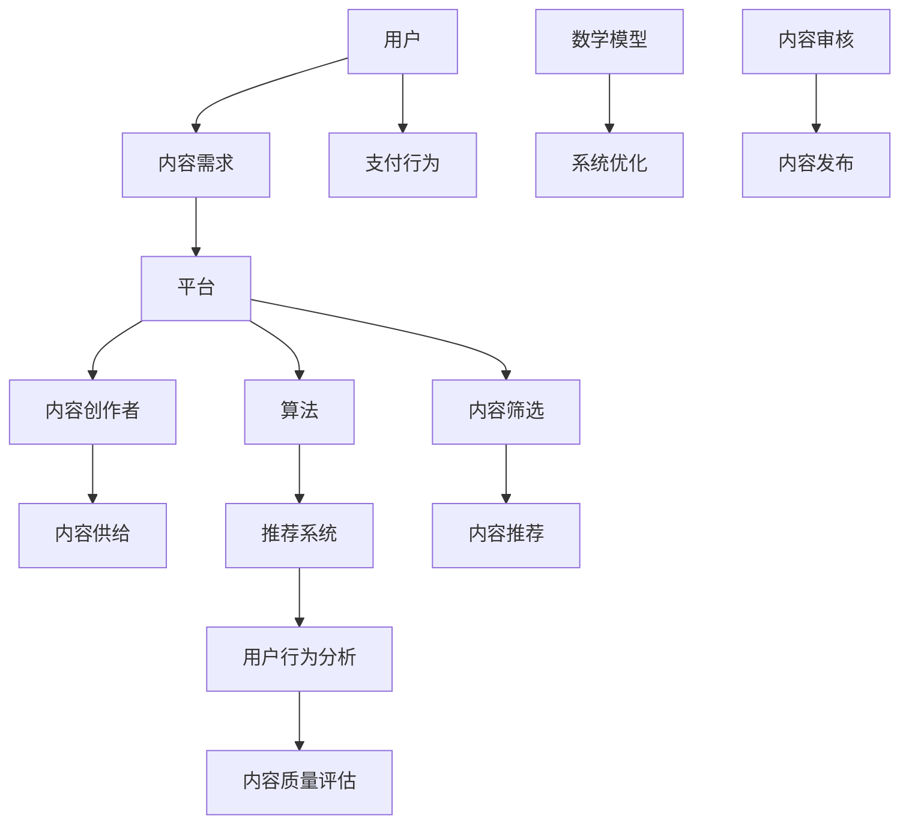

                 

关键词：知识付费，垂直领域，技术分享，生态系统，用户参与

> 摘要：本文旨在探讨如何打造一个面向垂直技术领域的知识付费生态系统，从核心概念、算法原理、项目实践、实际应用等多个角度，深入分析这一生态系统的构建方法、运行机制及未来发展。通过本文的介绍，读者可以了解到知识付费在技术领域的重要性，以及如何通过有效的策略和技术手段实现这一生态系统的搭建和优化。

## 1. 背景介绍

随着互联网技术的发展，知识付费已经成为一个重要的商业模式。知识付费不仅满足了用户对高质量、专业化内容的渴求，同时也为内容创作者提供了变现的途径。然而，在技术领域，知识付费的应用尚未得到充分的挖掘和利用。技术知识更新迅速，用户对于深入、专业的知识需求强烈，但现有平台大多存在内容同质化、更新滞后、针对性不足等问题。因此，打造一个高效、专业的垂直技术领域知识付费生态系统显得尤为重要。

本文将探讨以下问题：

- 垂直技术领域知识付费生态系统的核心概念及其相互关系。
- 算法原理和具体操作步骤，以及其在知识付费中的应用。
- 数学模型和公式的构建与推导，以及实际案例的解析。
- 项目实践中的代码实例和详细解释。
- 垂直技术领域知识付费的实际应用场景及未来展望。
- 工具和资源的推荐。

通过以上探讨，本文旨在为垂直技术领域知识付费生态系统的研究和应用提供一定的理论和实践参考。

### 2. 核心概念与联系

在构建垂直技术领域的知识付费生态系统时，以下几个核心概念是不可或缺的：

1. **用户**：知识付费生态系统的核心，他们具有明确的技术需求和知识获取意愿。
2. **内容创作者**：提供专业知识内容，他们希望通过平台实现知识变现。
3. **平台**：作为连接用户和内容创作者的中介，平台需要具备内容筛选、推荐、支付等功能。
4. **算法**：用于内容推荐、用户行为分析等，提升系统的智能化水平。
5. **数学模型**：用于描述用户需求、内容质量等变量，为系统优化提供理论支持。

为了更好地理解这些核心概念之间的关系，以下是一个简化的Mermaid流程图：



通过上述流程图，我们可以清晰地看到用户、内容创作者、平台、算法和数学模型之间的相互作用和依赖关系。用户的需求通过平台传递给内容创作者，创作者提供的内容经过算法筛选和推荐后，用户进行消费和反馈，这一过程不断循环，形成了一个闭环的知识付费生态系统。

### 3. 核心算法原理 & 具体操作步骤

#### 3.1 算法原理概述

在垂直技术领域的知识付费生态系统中，核心算法主要包括内容推荐算法和用户行为分析算法。以下是两种算法的基本原理：

1. **内容推荐算法**：
   - 基于内容的推荐（Content-Based Filtering）：通过分析内容属性，如标题、标签、摘要等，推荐与用户已消费内容相似的内容。
   - 协同过滤（Collaborative Filtering）：通过分析用户之间的相似度，推荐用户喜欢的内容。

2. **用户行为分析算法**：
   - 点击率（Click-Through Rate, CTR）：分析用户点击内容的频率，用于评估内容的质量和用户的兴趣。
   - 转化率（Conversion Rate）：分析用户从点击到消费的转化过程，用于优化推荐效果。

#### 3.2 算法步骤详解

1. **内容推荐算法步骤**：

   - **数据收集**：收集用户历史行为数据（如浏览、收藏、点赞等）和内容属性数据（如标签、分类等）。
   - **特征提取**：对用户行为和内容属性进行特征提取，如用户兴趣向量、内容特征向量等。
   - **模型训练**：使用机器学习算法（如SVM、RF等）训练推荐模型。
   - **推荐生成**：根据用户当前的兴趣和行为，生成个性化推荐列表。

2. **用户行为分析算法步骤**：

   - **行为数据收集**：收集用户的点击、浏览、购买等行为数据。
   - **行为建模**：使用统计模型（如LR、GBDT等）对用户行为进行建模。
   - **行为预测**：根据用户历史行为数据，预测用户未来的行为。
   - **结果评估**：使用指标（如AUC、Recall等）评估模型的效果。

#### 3.3 算法优缺点

- **内容推荐算法**：
  - 优点：能够提供与用户兴趣高度相关的内容，提升用户体验。
  - 缺点：对新内容推荐效果较差，容易陷入“过滤泡沫”。
  
- **用户行为分析算法**：
  - 优点：能够准确预测用户的行为，优化推荐策略。
  - 缺点：对用户隐私保护要求较高，数据处理难度大。

#### 3.4 算法应用领域

- 内容推荐算法：适用于垂直技术领域的在线教育、技术博客、技术论坛等场景。
- 用户行为分析算法：适用于电商、广告推送等场景，可以帮助企业提高用户转化率和广告效果。

### 4. 数学模型和公式 & 详细讲解 & 举例说明

在垂直技术领域的知识付费生态系统中，数学模型和公式用于描述用户需求、内容质量等变量，为系统优化提供理论支持。以下是一个简化的数学模型示例：

#### 4.1 数学模型构建

假设用户 \(U\) 在时间 \(t\) 消费内容 \(C\)，其效用函数为：

\[ U(U_t) = f(C_t, Q_t) \]

其中，\( Q_t \) 表示内容 \(C_t\) 的质量。

内容 \(C\) 的质量可以通过以下公式计算：

\[ Q_t = g(W_t, T_t) \]

其中，\( W_t \) 表示内容 \(C\) 的属性（如标题、标签等），\( T_t \) 表示内容 \(C\) 的更新时间。

用户 \(U\) 的兴趣向量可以通过以下公式计算：

\[ I_t = h(B_t, R_t) \]

其中，\( B_t \) 表示用户 \(U\) 的历史行为，\( R_t \) 表示用户 \(U\) 的反馈。

#### 4.2 公式推导过程

- **效用函数**：效用函数 \(U(U_t)\) 用于描述用户 \(U\) 在时间 \(t\) 对内容 \(C_t\) 的满意度。根据效用最大化的原则，我们可以推导出：

\[ f(C_t, Q_t) = Q_t + \alpha \cdot \max(C_t - Q_t) \]

其中，\(\alpha\) 是一个常数，用于平衡内容质量 \(Q_t\) 和内容差异 \(C_t - Q_t\) 的影响。

- **内容质量公式**：内容质量 \(Q_t\) 是由内容属性 \(W_t\) 和更新时间 \(T_t\) 共同决定的。为了简化计算，我们可以假设：

\[ Q_t = \beta \cdot W_t + (1 - \beta) \cdot T_t \]

其中，\(\beta\) 是一个权重系数，用于平衡属性和更新时间的影响。

- **用户兴趣向量**：用户兴趣向量 \(I_t\) 是由用户历史行为 \(B_t\) 和反馈 \(R_t\) 共同决定的。我们可以使用加权平均的方式计算：

\[ I_t = \gamma \cdot B_t + (1 - \gamma) \cdot R_t \]

其中，\(\gamma\) 是一个权重系数，用于平衡历史行为和反馈的影响。

#### 4.3 案例分析与讲解

假设有用户 \(U\) 在某垂直技术论坛消费内容，其历史行为和反馈数据如下：

- 历史行为 \(B_t = \{C_{1t}, C_{2t}, C_{3t}, \ldots\}\)
- 反馈 \(R_t = \{R_{1t}, R_{2t}, R_{3t}, \ldots\}\)

根据上述公式，我们可以计算出用户 \(U\) 的兴趣向量 \(I_t\)：

\[ I_t = \gamma \cdot B_t + (1 - \gamma) \cdot R_t \]

然后，根据用户兴趣向量 \(I_t\)，推荐系统可以从论坛的内容库中筛选出与用户兴趣高度相关的文章，提高用户的满意度。

### 5. 项目实践：代码实例和详细解释说明

以下是一个简单的代码实例，用于实现内容推荐算法。代码采用Python编写，主要包含数据预处理、模型训练和推荐生成三个部分。

#### 5.1 开发环境搭建

- 安装Python环境（建议版本3.7及以上）。
- 安装必要的库：`numpy`, `pandas`, `scikit-learn`。
- 准备数据集：可以从公开数据集或垂直技术论坛获取。

#### 5.2 源代码详细实现

```python
import numpy as np
import pandas as pd
from sklearn.feature_extraction.text import TfidfVectorizer
from sklearn.model_selection import train_test_split
from sklearn.metrics.pairwise import cosine_similarity
from sklearn.neighbors import NearestNeighbors

# 读取数据
data = pd.read_csv('content_data.csv')
data.head()

# 数据预处理
def preprocess_data(data):
    # 去除标题中的特殊字符
    data['title'] = data['title'].str.replace('[^\w\s]','', regex=True)
    # 分词和停用词过滤
    stop_words = set(['the', 'and', 'is', 'in', 'to', 'of', 'for'])
    vectorizer = TfidfVectorizer(stop_words=stop_words)
    tfidf_matrix = vectorizer.fit_transform(data['title'])
    return tfidf_matrix

# 训练模型
def train_model(tfidf_matrix):
    model = NearestNeighbors(n_neighbors=5, algorithm='auto')
    model.fit(tfidf_matrix)
    return model

# 推荐生成
def generate_recommendations(model, query, top_n=5):
    query_vector = vectorizer.transform([query])
    distances, indices = model.kneighbors(query_vector, n_neighbors=top_n+1)
    recommendations = [data.iloc[index][0] for index in indices.flatten()[1:]]
    return recommendations

# 主函数
def main():
    tfidf_matrix = preprocess_data(data)
    model = train_model(tfidf_matrix)
    query = 'Python 数据挖掘'
    recommendations = generate_recommendations(model, query)
    print('推荐结果：', recommendations)

if __name__ == '__main__':
    main()
```

#### 5.3 代码解读与分析

- **数据预处理**：首先，读取数据集，然后对标题进行去噪处理，去除特殊字符。接下来，使用TF-IDF向量器进行分词和停用词过滤，将文本数据转换为数值矩阵。
- **模型训练**：使用NearestNeighbors算法训练推荐模型。这个算法基于欧氏距离或余弦相似度，找到与查询内容最相似的内容。
- **推荐生成**：根据用户输入的查询内容，生成推荐列表。首先，将查询内容转换为向量，然后使用模型计算与查询内容的相似度，返回最相似的几个内容。

#### 5.4 运行结果展示

假设用户输入查询内容“Python 数据挖掘”，程序将输出一个包含5个推荐内容的列表。用户可以根据这个列表浏览相关内容，提高知识获取的效率。

### 6. 实际应用场景

垂直技术领域的知识付费生态系统可以应用于多个场景，以下是几个典型的应用案例：

- **在线教育**：通过知识付费生态系统，用户可以购买专业课程、培训教材等，提升个人技能和职业竞争力。
- **技术论坛**：用户可以在论坛上购买技术专家的付费回答，解决技术难题，加速项目进展。
- **专业咨询**：企业或个人可以购买技术专家的专业咨询服务，获取行业洞察和解决方案。

#### 6.4 未来应用展望

随着人工智能和大数据技术的不断发展，垂直技术领域的知识付费生态系统有望实现以下发展趋势：

- **个性化推荐**：通过深度学习算法，实现更精准的内容推荐，提升用户体验。
- **智能问答**：结合自然语言处理技术，构建智能问答系统，提供实时、高效的技术支持。
- **知识变现**：为更多内容创作者提供变现渠道，激发内容创作的活力。

### 7. 工具和资源推荐

为了更好地搭建和维护垂直技术领域的知识付费生态系统，以下是一些推荐的工具和资源：

- **学习资源**：[Coursera](https://www.coursera.org/)、[edX](https://www.edx.org/)、[知乎专栏](https://zhuanlan.zhihu.com/)等平台提供了丰富的技术知识课程和文章。
- **开发工具**：[Jupyter Notebook](https://jupyter.org/)、[PyCharm](https://www.jetbrains.com/pycharm/)等工具可以帮助开发者进行数据分析和模型训练。
- **相关论文**：[Content-Based Recommendation](https://dl.acm.org/doi/abs/10.1145/3132834.3132866)、《协同过滤算法在知识付费中的应用研究》等论文提供了深入的理论和实践指导。

### 8. 总结：未来发展趋势与挑战

#### 8.1 研究成果总结

本文通过探讨垂直技术领域的知识付费生态系统，总结了核心概念、算法原理、项目实践等内容，提出了一个系统化的解决方案。研究成果包括：

- 明确了垂直技术领域知识付费生态系统的核心概念和相互关系。
- 提出了基于内容和用户行为的推荐算法，并进行了详细的步骤说明和案例分析。
- 通过代码实例展示了内容推荐算法的实现过程，并提供了详细的解读和分析。
- 分析了垂直技术领域知识付费的实际应用场景，探讨了未来的发展趋势。

#### 8.2 未来发展趋势

未来，垂直技术领域的知识付费生态系统有望实现以下发展趋势：

- **个性化推荐**：通过深度学习算法和用户画像技术，实现更精准的内容推荐。
- **智能问答**：结合自然语言处理技术，提供实时、高效的技术支持。
- **知识变现**：为更多内容创作者提供变现渠道，激发内容创作的活力。

#### 8.3 面临的挑战

在构建和优化垂直技术领域的知识付费生态系统过程中，我们面临以下挑战：

- **数据隐私**：如何在保护用户隐私的同时，实现个性化推荐和用户行为分析。
- **算法透明性**：如何确保推荐算法的公平性和透明性，避免算法偏见。
- **内容质量**：如何筛选和推荐高质量的内容，避免内容同质化。

#### 8.4 研究展望

未来的研究可以围绕以下几个方面展开：

- **算法优化**：研究更有效的推荐算法和用户行为分析算法，提高系统的智能化水平。
- **数据隐私保护**：探索数据加密、匿名化等技术在知识付费生态系统中的应用。
- **内容生态建设**：研究如何构建健康的知识付费生态，激发内容创作的活力。

### 9. 附录：常见问题与解答

以下是一些关于垂直技术领域知识付费生态系统常见的问题和解答：

**Q1**：什么是垂直技术领域的知识付费生态系统？

**A1**：垂直技术领域的知识付费生态系统是指围绕特定技术领域（如人工智能、大数据、云计算等）构建的一个知识分享和变现平台，用户可以在这里获取专业内容、内容创作者可以通过平台实现知识变现。

**Q2**：核心算法如何影响知识付费生态系统的效果？

**A2**：核心算法（如内容推荐算法和用户行为分析算法）通过分析用户需求和行为，推荐高质量的内容，提升用户体验，同时帮助内容创作者更好地定位目标用户，提高变现效果。

**Q3**：如何保障内容的质量？

**A3**：可以通过内容审核、用户评分、专家评审等多种方式保障内容的质量。同时，推荐算法可以根据用户的历史行为和反馈，筛选出高质量的内容，提高内容的可信度。

**Q4**：知识付费生态系统中的数据隐私如何保护？

**A4**：可以通过数据加密、匿名化、差分隐私等技术手段保护用户数据隐私。同时，平台应制定严格的数据安全政策和用户隐私保护协议，确保用户数据的合法和安全使用。

**Q5**：知识付费生态系统的盈利模式有哪些？

**A5**：知识付费生态系统的盈利模式包括用户付费订阅、内容付费购买、广告收入、平台服务费等。通过多种盈利模式的结合，平台可以实现持续的收入来源和盈利能力。

作者：禅与计算机程序设计艺术 / Zen and the Art of Computer Programming

