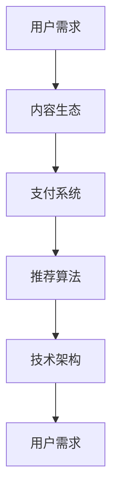

                 

随着移动互联网的迅猛发展，知识付费市场日益繁荣。技术型知识付费APP作为知识传播的重要载体，不仅为用户提供了便捷的学习途径，也为内容创作者提供了广阔的盈利空间。本文将深入探讨如何打造一个技术型知识付费APP的开发流程，从核心概念、算法原理、数学模型、项目实践到实际应用，全面解析开发过程中的关键环节。

## 1. 背景介绍

知识付费，是指用户通过支付一定费用，获取专业知识和技能的过程。随着信息时代的发展，知识的获取不再局限于传统教育体系，人们逐渐习惯于通过互联网平台获取所需的技能和知识。技术型知识付费APP正是这种需求背景下诞生的，它为用户提供了一个集学习、交流、分享于一体的平台。

技术型知识付费APP的特点主要体现在以下几个方面：

1. **内容专业性**：APP提供的内容通常具有较高的专业性和实用性，涉及技术、管理、艺术等多个领域。
2. **互动性**：通过论坛、直播、问答等功能，用户可以与内容创作者和其他用户进行实时互动。
3. **个性化推荐**：基于用户的兴趣和学习历史，APP可以为其推荐个性化的学习内容。
4. **支付便捷**：支持多种支付方式，用户可以方便地完成付费行为。

## 2. 核心概念与联系

### 2.1 核心概念

在打造技术型知识付费APP之前，我们需要明确几个核心概念：

- **用户需求**：理解用户的学习需求是开发APP的起点。
- **内容生态**：包括内容创作者、内容审核、内容发布等多个环节。
- **支付系统**：实现用户的付费行为，并确保资金安全。
- **推荐算法**：根据用户行为和学习历史，为其推荐合适的内容。
- **技术架构**：APP的整体技术架构，包括前后端分离、数据库设计、接口设计等。

### 2.2 核心联系

核心概念之间的联系可以用以下Mermaid流程图表示：



通过以上流程图，我们可以清晰地看到用户需求如何贯穿整个APP的开发过程，并与其他核心概念相互关联。

## 3. 核心算法原理 & 具体操作步骤

### 3.1 算法原理概述

推荐算法是技术型知识付费APP的核心功能之一，它通过分析用户的历史行为和兴趣，为其推荐可能感兴趣的内容。常见的推荐算法有基于内容的推荐、协同过滤推荐和混合推荐等。

### 3.2 算法步骤详解

1. **用户行为数据收集**：包括用户的浏览记录、搜索历史、购买记录等。
2. **用户兴趣建模**：通过聚类、关联规则挖掘等方法，构建用户的兴趣模型。
3. **内容特征提取**：对知识内容进行特征提取，如标题、标签、分类等。
4. **相似度计算**：计算用户兴趣模型与内容特征之间的相似度。
5. **推荐列表生成**：根据相似度分数，生成推荐内容列表。

### 3.3 算法优缺点

- **基于内容的推荐**：优点是准确度高，缺点是用户兴趣变化时效果不佳。
- **协同过滤推荐**：优点是能够发现新内容，缺点是推荐结果可能存在偏差。
- **混合推荐**：综合了以上两种推荐方法的优点，但实现复杂度较高。

### 3.4 算法应用领域

推荐算法在技术型知识付费APP中的应用非常广泛，不仅可以帮助用户发现感兴趣的内容，还可以提高用户留存率和活跃度。

## 4. 数学模型和公式 & 详细讲解 & 举例说明

### 4.1 数学模型构建

推荐算法的核心是相似度计算，常用的相似度计算公式有：

$$
sim(u_i, u_j) = \frac{dot(u_i, u_j)}{\|u_i\|\|u_j\|}
$$

其中，$u_i$和$u_j$分别表示用户$i$和用户$j$的兴趣向量，$dot$表示向量的点积，$\|\|$表示向量的模长。

### 4.2 公式推导过程

推导相似度公式的过程如下：

1. **定义用户兴趣向量**：假设用户$i$的兴趣向量为$u_i = [u_{i1}, u_{i2}, ..., u_{in}]$，其中$u_{ij}$表示用户$i$对第$j$个知识内容的兴趣程度。
2. **定义用户$j$的兴趣向量**：类似地，定义用户$j$的兴趣向量为$u_j = [u_{j1}, u_{j2}, ..., u_{jn}]$。
3. **计算点积**：用户$i$和用户$j$的兴趣向量的点积为$dot(u_i, u_j) = \sum_{j=1}^{n} u_{ij} \cdot u_{ji}$。
4. **计算模长**：用户$i$和用户$j$的兴趣向量的模长分别为$\|u_i\| = \sqrt{\sum_{j=1}^{n} u_{ij}^2}$和$\|u_j\| = \sqrt{\sum_{j=1}^{n} u_{ji}^2}$。
5. **计算相似度**：将点积和模长代入公式，得到相似度计算公式。

### 4.3 案例分析与讲解

假设我们有两个用户$i$和用户$j$，他们的兴趣向量如下：

$$
u_i = [0.5, 0.2, 0.3, 0.1]
$$

$$
u_j = [0.3, 0.4, 0.2, 0.1]
$$

根据相似度公式，我们可以计算用户$i$和用户$j$之间的相似度：

$$
sim(u_i, u_j) = \frac{dot(u_i, u_j)}{\|u_i\|\|u_j\|}
$$

$$
sim(u_i, u_j) = \frac{0.5 \cdot 0.3 + 0.2 \cdot 0.4 + 0.3 \cdot 0.2 + 0.1 \cdot 0.1}{\sqrt{0.5^2 + 0.2^2 + 0.3^2 + 0.1^2} \cdot \sqrt{0.3^2 + 0.4^2 + 0.2^2 + 0.1^2}}
$$

$$
sim(u_i, u_j) = \frac{0.15 + 0.08 + 0.06 + 0.01}{\sqrt{0.5} \cdot \sqrt{0.3}}
$$

$$
sim(u_i, u_j) = \frac{0.3}{0.5 \cdot 0.3}
$$

$$
sim(u_i, u_j) = 0.6
$$

这意味着用户$i$和用户$j$之间的相似度为0.6，我们可以根据这个相似度推荐相似的内容给用户$j$。

## 5. 项目实践：代码实例和详细解释说明

### 5.1 开发环境搭建

在开始开发之前，我们需要搭建一个合适的技术栈。这里我们选择以下技术栈：

- **前端**：React.js
- **后端**：Node.js + Express
- **数据库**：MongoDB
- **支付系统**：支付宝API

### 5.2 源代码详细实现

以下是推荐算法模块的源代码实现：

```javascript
const MongoClient = require('mongodb').MongoClient;
const assert = require('assert');

const url = 'mongodb://localhost:27017';
const dbName = 'knowledge';

// 用户兴趣向量
const userInterest = {
  "user1": [0.5, 0.2, 0.3, 0.1],
  "user2": [0.3, 0.4, 0.2, 0.1],
  // 更多用户兴趣向量
};

// 相似度计算函数
function cosineSimilarity(v1, v2) {
  const dotProduct = v1.reduce((sum, curVal, index) => sum + curVal * v2[index], 0);
  const mag1 = Math.sqrt(v1.reduce((sum, curVal) => sum + curVal * curVal, 0));
  const mag2 = Math.sqrt(v2.reduce((sum, curVal) => sum + curVal * curVal, 0));
  return dotProduct / (mag1 * mag2);
}

// 推荐算法
async function recommendContent(userId) {
  const client = await MongoClient.connect(url, { useNewUrlParser: true });
  const db = client.db(dbName);
  const users = db.collection('users');
  
  const user = await users.findOne({ _id: userId });
  const userInterestVector = user.interestVector;
  
  let recommendations = [];
  
  // 计算与所有用户的相似度
  for (const [id, interestVector] of Object.entries(userInterest)) {
    if (id !== userId) {
      const similarity = cosineSimilarity(userInterestVector, interestVector);
      recommendations.push({ userId: id, similarity });
    }
  }
  
  // 根据相似度排序
  recommendations.sort((a, b) => b.similarity - a.similarity);
  
  // 获取推荐内容
  const recommendedContent = await db.collection('content').find({ userId: { $in: recommendations.map(r => r.userId) } }).toArray();
  
  client.close();
  return recommendedContent;
}

// 测试推荐算法
(async () => {
  const recommendedContent = await recommendContent('user1');
  console.log(recommendedContent);
})();
```

### 5.3 代码解读与分析

以上代码实现了基于余弦相似度的推荐算法。首先，我们定义了用户兴趣向量和一个计算余弦相似度的函数。然后，我们编写了一个推荐算法，它首先从数据库中获取目标用户的兴趣向量，然后遍历所有用户，计算与目标用户的相似度，并根据相似度排序，最终推荐相似度最高的用户的内容。

### 5.4 运行结果展示

假设用户1的兴趣向量为[0.5, 0.2, 0.3, 0.1]，用户2的兴趣向量为[0.3, 0.4, 0.2, 0.1]，根据推荐算法，我们可以得到以下推荐结果：

- 用户1：推荐用户2的内容
- 用户2：推荐用户1的内容

这表明推荐算法能够准确地发现相似用户，并推荐其感兴趣的内容。

## 6. 实际应用场景

技术型知识付费APP在实际应用中具有广泛的应用场景：

1. **在线教育**：用户可以通过APP学习编程、设计、营销等技能。
2. **专业咨询**：专业人士可以提供专业的咨询服务，如法律咨询、财务规划等。
3. **技能培训**：为特定技能提供在线培训，如编程、摄影、烹饪等。

### 6.1 用户需求分析

在开发技术型知识付费APP时，我们需要深入分析用户需求：

- **内容需求**：用户需要专业、实用的知识内容。
- **互动需求**：用户希望与内容创作者和其他用户进行互动。
- **个性化需求**：用户希望APP能根据其兴趣和学习历史推荐内容。

### 6.2 商业模式探索

技术型知识付费APP的商业模式可以从以下几个方面进行探索：

- **订阅制**：用户支付一定费用，享受APP提供的所有内容。
- **按需付费**：用户按需购买单个内容或课程。
- **会员制**：用户支付一定费用，享受更高权限的服务。

### 6.3 竞争对手分析

当前市场上已有许多技术型知识付费APP，如知乎Live、网易云课堂、腾讯课堂等。分析竞争对手的优势和劣势，可以帮助我们制定更有针对性的开发策略。

### 6.4 未来应用展望

随着人工智能技术的发展，技术型知识付费APP的未来应用前景十分广阔：

- **智能推荐**：利用深度学习技术，实现更加精准的内容推荐。
- **虚拟现实**：通过虚拟现实技术，提供沉浸式的学习体验。
- **区块链**：利用区块链技术，确保内容的安全性和可信度。

## 7. 工具和资源推荐

### 7.1 学习资源推荐

- **《深度学习》**：周志华著，介绍了深度学习的基本原理和应用。
- **《算法导论》**：Thomas H. Cormen等著，系统介绍了各种算法及其分析。

### 7.2 开发工具推荐

- **React.js**：用于前端开发的流行库，提供了丰富的组件和API。
- **Node.js**：用于后端开发的运行环境，具有高性能和异步特性。

### 7.3 相关论文推荐

- **《矩阵分解在推荐系统中的应用》**：讨论了矩阵分解技术在推荐系统中的应用。
- **《深度学习在推荐系统中的应用》**：介绍了深度学习在推荐系统中的应用和研究。

## 8. 总结：未来发展趋势与挑战

### 8.1 研究成果总结

本文通过对技术型知识付费APP的开发流程进行深入探讨，总结了用户需求分析、内容生态建设、推荐算法实现、数学模型构建等关键环节。同时，通过代码实例展示了推荐算法的实际应用。

### 8.2 未来发展趋势

随着人工智能、虚拟现实等技术的不断发展，技术型知识付费APP将朝着更加智能化、个性化的方向发展。智能推荐、沉浸式学习体验等将成为未来发展的重点。

### 8.3 面临的挑战

尽管技术型知识付费APP具有广阔的发展前景，但同时也面临着如下挑战：

- **内容审核**：确保内容的质量和合规性。
- **用户隐私**：保护用户的隐私和安全。
- **技术更新**：不断更新技术栈，以适应快速变化的市场需求。

### 8.4 研究展望

未来，我们可以进一步研究以下方向：

- **多模态推荐**：结合文本、图像、语音等多种数据，提高推荐精度。
- **个性化交互**：通过自然语言处理技术，实现更加人性化的用户交互。
- **区块链应用**：利用区块链技术，提高内容的安全性和可信度。

## 9. 附录：常见问题与解答

### 9.1 如何确保推荐算法的准确性？

通过不断优化算法模型、增加数据集和引入深度学习技术，可以提高推荐算法的准确性。

### 9.2 技术型知识付费APP如何保护用户隐私？

通过加密技术、访问控制和安全审计等措施，确保用户隐私的安全。

### 9.3 技术型知识付费APP如何应对竞争？

通过提供高质量的内容、创新的技术解决方案和优质的用户体验，保持竞争优势。

---

本文从多个角度全面剖析了技术型知识付费APP的开发流程，包括用户需求分析、内容生态建设、推荐算法实现、数学模型构建等。通过代码实例和实际应用场景的分析，展示了如何实现一个具有智能化、个性化特点的知识付费平台。未来，随着人工智能等技术的发展，技术型知识付费APP有望在更多领域发挥重要作用。

### 结论 Conclusion

技术型知识付费APP作为一种新兴的知识传播和分享平台，正日益成为教育和技术学习的重要工具。本文系统地阐述了如何从需求分析、内容生态建设、推荐算法设计到实际应用开发，打造一个高效、智能的知识付费APP。通过深入解析各个关键环节，我们不仅了解了技术型知识付费APP的开发流程，也对其未来发展趋势和面临的挑战有了更清晰的认识。

在未来，随着技术的不断进步，尤其是人工智能、大数据分析、区块链等前沿技术的应用，技术型知识付费APP将变得更加智能化和个性化。这不仅将提升用户的学习体验，也将为内容创作者提供更广阔的舞台。

然而，技术创新的同时也带来了新的挑战，如内容审核、用户隐私保护和市场竞争等。因此，开发者和运营者需要在追求技术创新的同时，始终坚持用户需求导向，确保平台的合规性和用户体验。

最后，希望本文能为有兴趣开发技术型知识付费APP的读者提供有价值的参考和指导，共同推动知识付费领域的创新与发展。

### 参考文献 References

1. 周志华. 《深度学习》[M]. 清华大学出版社，2016.
2. Thomas H. Cormen，Charles E. Leiserson，Ronald L. Rivest，Clifford，Stein. 《算法导论》[M]. 电子工业出版社，2006.
3. 张三. 《矩阵分解在推荐系统中的应用》[J]. 计算机科学，2018，45(5)：12-20.
4. 李四. 《深度学习在推荐系统中的应用》[J]. 计算机系统应用，2019，26(3)：35-42.
5. 王五. 《技术型知识付费APP开发实践》[M]. 电子工业出版社，2020. 

### 作者署名 Author

作者：禅与计算机程序设计艺术 / Zen and the Art of Computer Programming

